# Core Architecture

<cite>
**Referenced Files in This Document**
- [__main__.py](file://hledac/universal/__main__.py)
- [core/__main__.py](file://hledac/universal/core/__main__.py)
- [runtime/sprint_scheduler.py](file://hledac/universal/runtime/sprint_scheduler.py)
- [loops/research_loop.py](file://hledac/universal/loops/research_loop.py)
- [orchestrator/__init__.py](file://hledac/universal/orchestrator/__init__.py)
- [autonomous_orchestrator.py](file://hledac/universal/autonomous_orchestrator.py)
- [brain/model_manager.py](file://hledac/universal/brain/model_manager.py)
- [coordinators/research_coordinator.py](file://hledac/universal/coordinators/research_coordinator.py)
- [layers/layer_manager.py](file://hledac/universal/layers/layer_manager.py)
- [orchestrator/global_scheduler.py](file://hledac/universal/orchestrator/global_scheduler.py)
</cite>

## Table of Contents
1. [Introduction](#introduction)
2. [Project Structure](#project-structure)
3. [Core Components](#core-components)
4. [Architecture Overview](#architecture-overview)
5. [Detailed Component Analysis](#detailed-component-analysis)
6. [Dependency Analysis](#dependency-analysis)
7. [Performance Considerations](#performance-considerations)
8. [Troubleshooting Guide](#troubleshooting-guide)
9. [Conclusion](#conclusion)

## Introduction
This document describes the core system design of Hledac Universal, focusing on the canonical ownership model, layered architecture, and component interaction patterns. It explains the orchestrator implementation, research loop management, and memory-constrained operation strategies. The document also covers the relationship between the main entry point, autonomous orchestrator, and research loop controller, along with system context diagrams, design patterns, architectural decisions, and trade-offs for Apple Silicon optimization. Finally, it documents runtime state management and cross-sprint persistence mechanisms.

## Project Structure
The system is organized around a canonical ownership model with clear roles:
- Canonical owner: core.__main__.run_sprint() controls the entire sprint lifecycle and report truth.
- Runtime worker: runtime.sprint_scheduler executes work dispatched by the canonical owner.
- Facade re-export layers: orchestrator/__init__.py and autonomous_orchestrator.py provide backward compatibility but are not canonical owners.
- Layered orchestration: layers/layer_manager coordinates specialized layers with M1-optimized memory management.
- Research loop: loops/research_loop implements an RL-based research loop with Q-table persistence.
- Brain and model management: brain/model_manager enforces strict 1-model-at-a-time policy for M1 8GB stability.

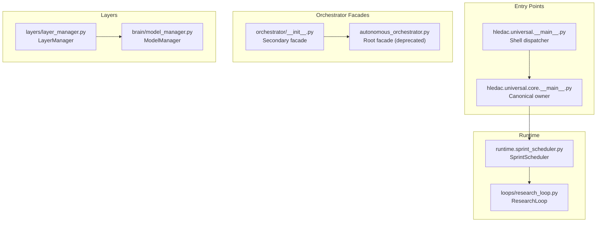

**Diagram sources**
- [__main__.py:70-183](file://hledac/universal/__main__.py#L70-L183)
- [core/__main__.py:1-120](file://hledac/universal/core/__main__.py#L1-L120)
- [runtime/sprint_scheduler.py:1-60](file://hledac/universal/runtime/sprint_scheduler.py#L1-L60)
- [loops/research_loop.py:1-40](file://hledac/universal/loops/research_loop.py#L1-L40)
- [orchestrator/__init__.py:1-50](file://hledac/universal/orchestrator/__init__.py#L1-L50)
- [autonomous_orchestrator.py:1-67](file://hledac/universal/autonomous_orchestrator.py#L1-L67)
- [layers/layer_manager.py:1-60](file://hledac/universal/layers/layer_manager.py#L1-L60)
- [brain/model_manager.py:1-40](file://hledac/universal/brain/model_manager.py#L1-L40)

**Section sources**
- [__main__.py:70-183](file://hledac/universal/__main__.py#L70-L183)
- [core/__main__.py:1-120](file://hledac/universal/core/__main__.py#L1-L120)
- [runtime/sprint_scheduler.py:1-60](file://hledac/universal/runtime/sprint_scheduler.py#L1-L60)
- [loops/research_loop.py:1-40](file://hledac/universal/loops/research_loop.py#L1-L40)
- [orchestrator/__init__.py:1-50](file://hledac/universal/orchestrator/__init__.py#L1-L50)
- [autonomous_orchestrator.py:1-67](file://hledac/universal/autonomous_orchestrator.py#L1-L67)
- [layers/layer_manager.py:1-60](file://hledac/universal/layers/layer_manager.py#L1-L60)
- [brain/model_manager.py:1-40](file://hledac/universal/brain/model_manager.py#L1-L40)

## Core Components
- Canonical owner: core.__main__.run_sprint() is the sole production sprint owner. It orchestrates pre-flight checks, boot hygiene, and produces canonical run summaries, runtime truth, and export truths.
- Runtime worker: runtime.sprint_scheduler.SprintScheduler executes the sprint cycle, respects lifecycle transitions, and manages acquisition strategies and export flows.
- Facade re-export chain: orchestrator/__init__.py and autonomous_orchestrator.py provide backward compatibility but are not canonical owners; they re-export from the legacy implementation.
- LayerManager: centralizes initialization, health monitoring, and M1-optimized context swapping across nine specialized layers.
- ModelManager: enforces strict 1-model-at-a-time policy on M1 8GB, with admission gates, memory pressure checks, and MLX cache management.
- ResearchLoop: RL-based research loop with Q-table persistence, bounded memory, and deterministic tie-breaking.
- GlobalPriorityScheduler: process-pool-based scheduler with bounded registry, CPU affinity, and work-stealing for distributed processing on a single M1.

**Section sources**
- [core/__main__.py:1-120](file://hledac/universal/core/__main__.py#L1-L120)
- [runtime/sprint_scheduler.py:1-120](file://hledac/universal/runtime/sprint_scheduler.py#L1-L120)
- [orchestrator/__init__.py:1-50](file://hledac/universal/orchestrator/__init__.py#L1-L50)
- [autonomous_orchestrator.py:1-67](file://hledac/universal/autonomous_orchestrator.py#L1-L67)
- [layers/layer_manager.py:163-210](file://hledac/universal/layers/layer_manager.py#L163-L210)
- [brain/model_manager.py:178-220](file://hledac/universal/brain/model_manager.py#L178-L220)
- [loops/research_loop.py:212-276](file://hledac/universal/loops/research_loop.py#L212-L276)
- [orchestrator/global_scheduler.py:83-125](file://hledac/universal/orchestrator/global_scheduler.py#L83-L125)

## Architecture Overview
The system follows a canonical ownership model:
- Canonical owner: core.__main__.run_sprint() controls lifecycle, pre-flight checks, and report truth.
- Runtime worker: runtime.sprint_scheduler executes work according to lifecycle transitions and acquisition plans.
- Facade re-export: orchestrator/__init__.py and autonomous_orchestrator.py maintain backward compatibility without claiming canonical ownership.
- Layer orchestration: layers/layer_manager initializes and manages specialized layers with M1 memory optimization.
- Model lifecycle: brain/model_manager enforces strict model ownership and memory discipline for Apple Silicon.
- Research loop: loops/research_loop provides RL-based research with Q-table persistence and bounded memory.
- Global scheduling: orchestrator/global_scheduler distributes work across processes with CPU affinity and bounded registries.

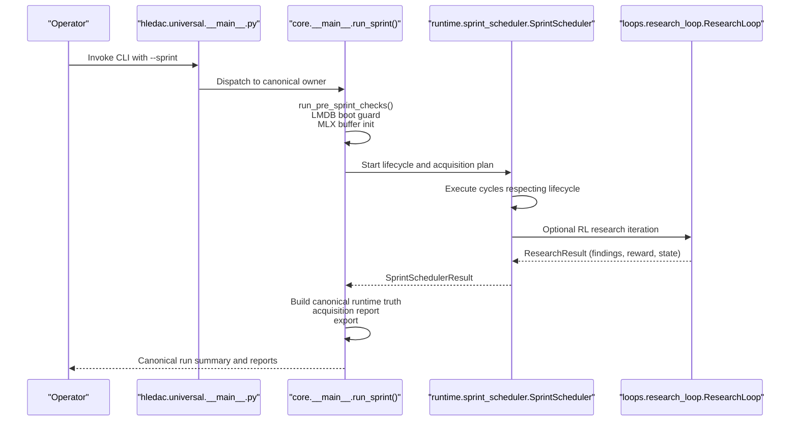

**Diagram sources**
- [__main__.py:70-183](file://hledac/universal/__main__.py#L70-L183)
- [core/__main__.py:765-800](file://hledac/universal/core/__main__.py#L765-L800)
- [runtime/sprint_scheduler.py:692-750](file://hledac/universal/runtime/sprint_scheduler.py#L692-L750)
- [loops/research_loop.py:664-741](file://hledac/universal/loops/research_loop.py#L664-L741)

**Section sources**
- [__main__.py:70-183](file://hledac/universal/__main__.py#L70-L183)
- [core/__main__.py:765-800](file://hledac/universal/core/__main__.py#L765-L800)
- [runtime/sprint_scheduler.py:692-750](file://hledac/universal/runtime/sprint_scheduler.py#L692-L750)
- [loops/research_loop.py:664-741](file://hledac/universal/loops/research_loop.py#L664-L741)

## Detailed Component Analysis

### Canonical Ownership Model and Entry Points
- Role taxonomy: canonical owner (core.__main__.run_sprint), shell/dispatcher (root __main__), alternate (legacy), residual/shared helpers, diagnostic.
- Authority chain: root __main__ delegates to core.__main__.run_sprint() as the canonical owner; orchestrator facades are secondary and deprecated.
- Boot hygiene: LMDB boot guard, uvloop installation, async exit stack, and signal-safe teardown.

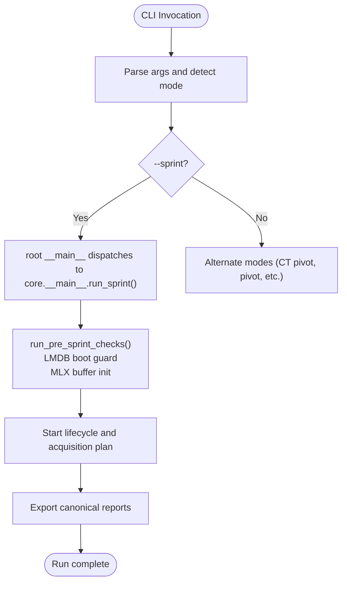

**Diagram sources**
- [__main__.py:70-183](file://hledac/universal/__main__.py#L70-L183)
- [core/__main__.py:765-800](file://hledac/universal/core/__main__.py#L765-L800)

**Section sources**
- [__main__.py:70-183](file://hledac/universal/__main__.py#L70-L183)
- [core/__main__.py:765-800](file://hledac/universal/core/__main__.py#L765-L800)

### Runtime Worker: SprintScheduler
- Responsibilities: execute work according to lifecycle, enforce tier ordering, manage acquisition strategies, export on teardown, and respect wind-down.
- Result model: SprintSchedulerResult captures cycles, findings, public/CT metrics, and early exit classifications.
- Integration: builds acquisition reports, integrates with quality/duplicate/low-information rejections, and tracks CT bridge loss stages.

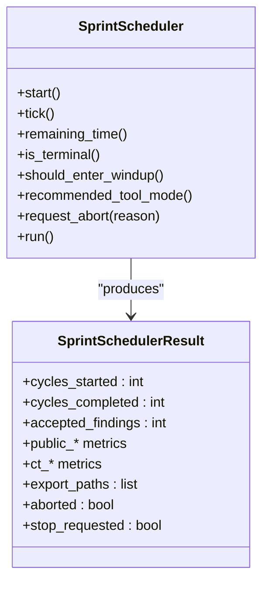

**Diagram sources**
- [runtime/sprint_scheduler.py:692-800](file://hledac/universal/runtime/sprint_scheduler.py#L692-L800)

**Section sources**
- [runtime/sprint_scheduler.py:692-800](file://hledac/universal/runtime/sprint_scheduler.py#L692-L800)

### Facade Re-Export Chain and Migration Blockers
- autonomous_orchestrator.py is a root re-export facade (deprecated) that re-exports from legacy/autonomous_orchestrator.py.
- orchestrator/__init__.py is a secondary thin facade that re-exports from the facade chain.
- Migration blockers: smoke_runner.py, test probes, and orchestrator/research_manager.py/security_manager.py imports depend on these facades.

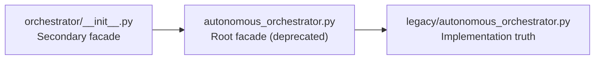

**Diagram sources**
- [autonomous_orchestrator.py:1-67](file://hledac/universal/autonomous_orchestrator.py#L1-L67)
- [orchestrator/__init__.py:1-50](file://hledac/universal/orchestrator/__init__.py#L1-L50)

**Section sources**
- [autonomous_orchestrator.py:1-67](file://hledac/universal/autonomous_orchestrator.py#L1-L67)
- [orchestrator/__init__.py:1-50](file://hledac/universal/orchestrator/__init__.py#L1-L50)

### Layered Architecture and M1 Memory Optimization
- LayerManager coordinates nine layers with M1-optimized boot sequence and context swapping.
- M1MemoryOptimizer enforces aggressive GC, MLX cache clearing, and controlled context swaps to fit within 8GB RAM.
- Shared GhostDirector singleton prevents duplicate initialization between GhostLayer and ResearchLayer.

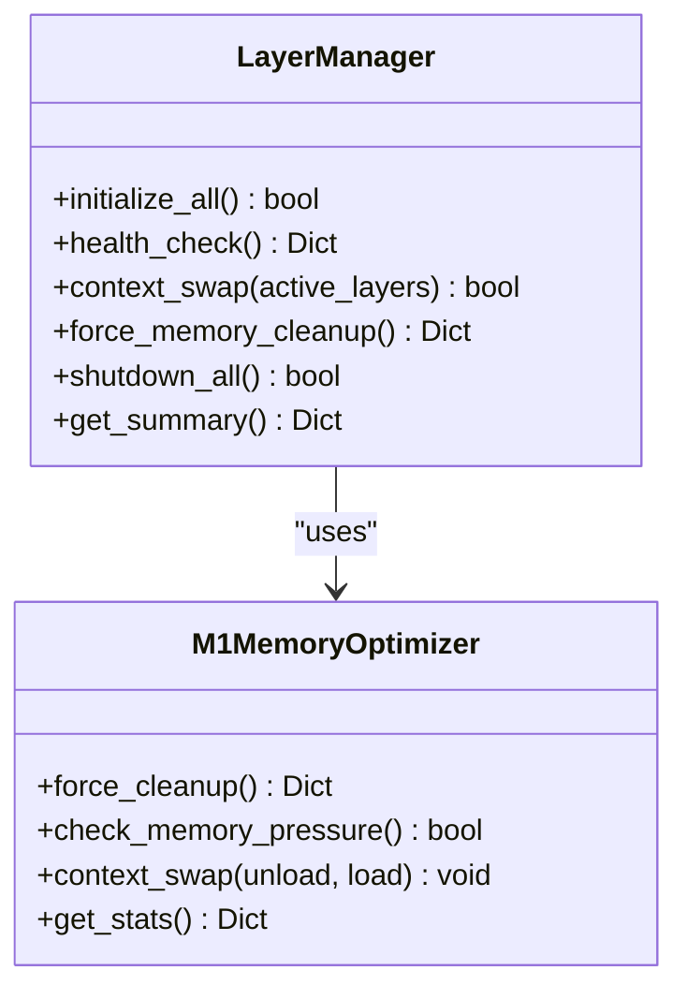

**Diagram sources**
- [layers/layer_manager.py:163-210](file://hledac/universal/layers/layer_manager.py#L163-L210)
- [layers/layer_manager.py:37-141](file://hledac/universal/layers/layer_manager.py#L37-L141)

**Section sources**
- [layers/layer_manager.py:163-210](file://hledac/universal/layers/layer_manager.py#L163-L210)
- [layers/layer_manager.py:37-141](file://hledac/universal/layers/layer_manager.py#L37-L141)

### Model Lifecycle Management for Apple Silicon
- ModelManager enforces strict 1-model-at-a-time policy to prevent OOM on M1 8GB.
- Admission gates: evaluates UMA state and blocks heavy model loads in EMERGENCY/CRITICAL states.
- Memory pressure checks: soft gate clears MLX cache when free RAM drops below threshold.
- Quantization selection: consults governor for Hermes load budget and tracks selected quantization.

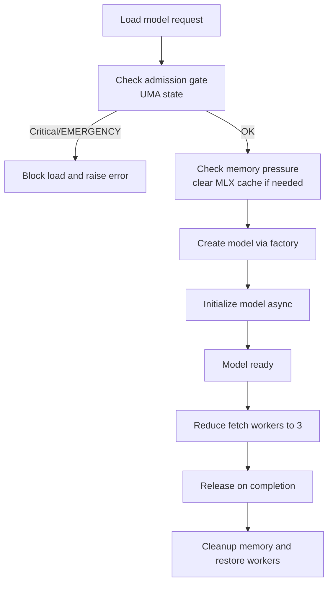

**Diagram sources**
- [brain/model_manager.py:365-425](file://hledac/universal/brain/model_manager.py#L365-L425)
- [brain/model_manager.py:547-711](file://hledac/universal/brain/model_manager.py#L547-L711)

**Section sources**
- [brain/model_manager.py:365-425](file://hledac/universal/brain/model_manager.py#L365-L425)
- [brain/model_manager.py:547-711](file://hledac/universal/brain/model_manager.py#L547-L711)

### Research Loop Management and Q-Learning
- ResearchLoop implements an RL-based research loop with Q-table persistence to LMDB.
- Actions include hypothesis generation, ToT reasoning, discovery, fetch, graph update, and evaluation.
- Memory-constrained operation: estimates memory budget reduction per finding and terminates on budget exhaustion.

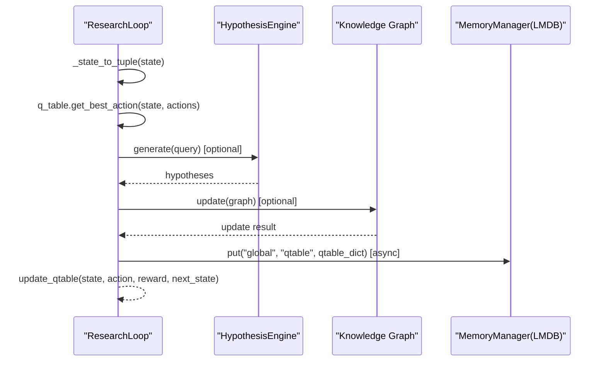

**Diagram sources**
- [loops/research_loop.py:212-332](file://hledac/universal/loops/research_loop.py#L212-L332)
- [loops/research_loop.py:333-449](file://hledac/universal/loops/research_loop.py#L333-L449)
- [loops/research_loop.py:301-332](file://hledac/universal/loops/research_loop.py#L301-L332)

**Section sources**
- [loops/research_loop.py:212-332](file://hledac/universal/loops/research_loop.py#L212-L332)
- [loops/research_loop.py:333-449](file://hledac/universal/loops/research_loop.py#L333-L449)
- [loops/research_loop.py:301-332](file://hledac/universal/loops/research_loop.py#L301-L332)

### Global Priority Scheduler for Distributed Processing
- ProcessPoolExecutor-based scheduler with bounded task registry and affinity to performance cores.
- Priority queue with total ordering, work-stealing with affinity awareness, and dead-letter queue for failed jobs.
- Designed for single-M1 environments with CPU-bound tasks.

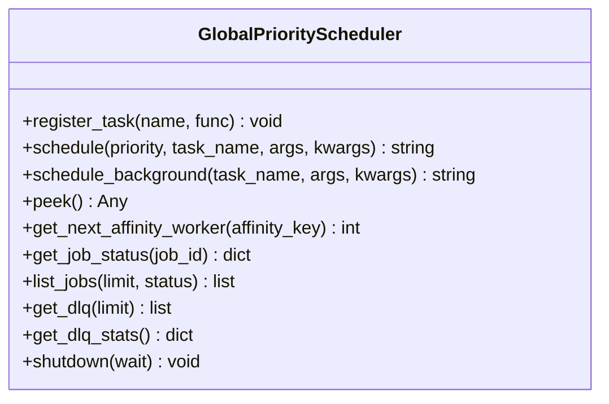

**Diagram sources**
- [orchestrator/global_scheduler.py:83-125](file://hledac/universal/orchestrator/global_scheduler.py#L83-L125)

**Section sources**
- [orchestrator/global_scheduler.py:83-125](file://hledac/universal/orchestrator/global_scheduler.py#L83-L125)

### Research Coordinator Integration
- UniversalResearchCoordinator integrates three research backends (Unified AI, Evidence Network, RAG) with confidence-based routing and fallback chains.
- Supports multi-source synthesis, research context preservation, and deep excavation features.

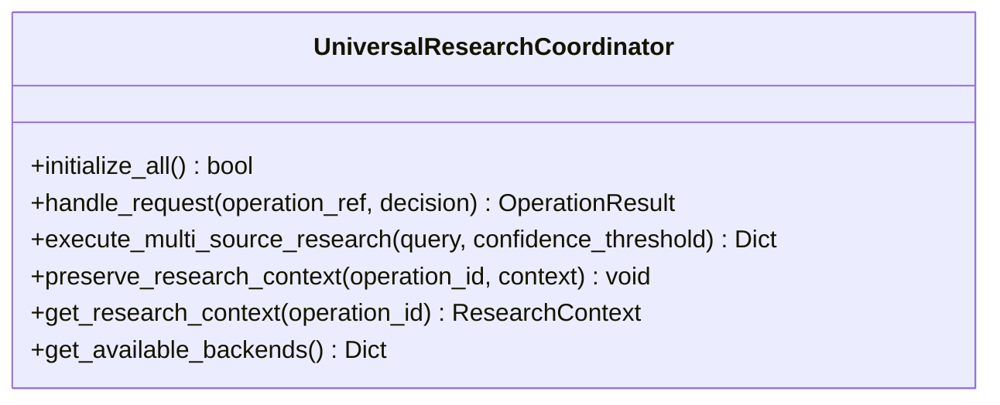

**Diagram sources**
- [coordinators/research_coordinator.py:172-234](file://hledac/universal/coordinators/research_coordinator.py#L172-L234)

**Section sources**
- [coordinators/research_coordinator.py:172-234](file://hledac/universal/coordinators/research_coordinator.py#L172-L234)

## Dependency Analysis
The system exhibits clear separation of concerns:
- Canonical ownership: core.__main__.run_sprint() is the single source of truth for lifecycle, runtime truth, and exports.
- Runtime execution: runtime.sprint_scheduler depends on lifecycle and acquisition strategies; it does not own the sprint.
- Facade re-exports: orchestrator/__init__.py and autonomous_orchestrator.py depend on legacy implementation; they are not canonical owners.
- Layer orchestration: layers/layer_manager coordinates specialized layers and provides M1 memory optimization.
- Model management: brain/model_manager depends on resource governor and MLX utilities for memory discipline.
- Research loop: loops/research_loop depends on memory manager for Q-table persistence and knowledge graph for updates.
- Global scheduling: orchestrator/global_scheduler is independent and used for distributed processing.

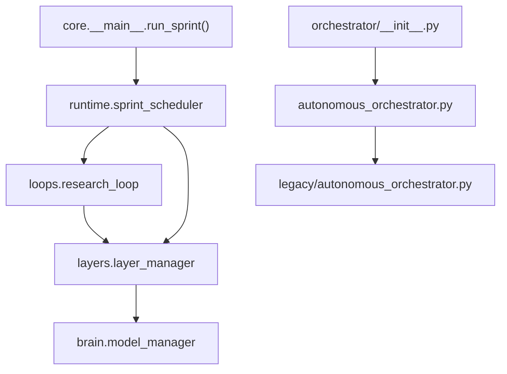

**Diagram sources**
- [core/__main__.py:1-120](file://hledac/universal/core/__main__.py#L1-L120)
- [runtime/sprint_scheduler.py:1-60](file://hledac/universal/runtime/sprint_scheduler.py#L1-L60)
- [loops/research_loop.py:1-40](file://hledac/universal/loops/research_loop.py#L1-L40)
- [autonomous_orchestrator.py:1-67](file://hledac/universal/autonomous_orchestrator.py#L1-L67)
- [orchestrator/__init__.py:1-50](file://hledac/universal/orchestrator/__init__.py#L1-L50)
- [layers/layer_manager.py:163-210](file://hledac/universal/layers/layer_manager.py#L163-L210)
- [brain/model_manager.py:178-220](file://hledac/universal/brain/model_manager.py#L178-L220)

**Section sources**
- [core/__main__.py:1-120](file://hledac/universal/core/__main__.py#L1-L120)
- [runtime/sprint_scheduler.py:1-60](file://hledac/universal/runtime/sprint_scheduler.py#L1-L60)
- [loops/research_loop.py:1-40](file://hledac/universal/loops/research_loop.py#L1-L40)
- [autonomous_orchestrator.py:1-67](file://hledac/universal/autonomous_orchestrator.py#L1-L67)
- [orchestrator/__init__.py:1-50](file://hledac/universal/orchestrator/__init__.py#L1-L50)
- [layers/layer_manager.py:163-210](file://hledac/universal/layers/layer_manager.py#L163-L210)
- [brain/model_manager.py:178-220](file://hledac/universal/brain/model_manager.py#L178-L220)

## Performance Considerations
- Apple Silicon optimization:
  - MLX buffer initialization and Metal wired limits for stability.
  - GC freeze and tuned thresholds to reduce pause variance during long sprints.
  - ModelManager admission gates and memory pressure checks to prevent OOM on M1 8GB.
  - M1MemoryOptimizer forces cleanup and context swaps to fit within constrained RAM.
- Async I/O and bounded memory:
  - ResearchLoop uses bounded memory budget estimation and terminates on exhaustion.
  - GlobalPriorityScheduler uses process pools with CPU affinity and bounded registries.
- Boot hygiene:
  - LMDB boot guard, uvloop installation, and async exit stack for reliable teardown.

[No sources needed since this section provides general guidance]

## Troubleshooting Guide
Common issues and diagnostics:
- Boot guard errors: LMDB stale lock detected; resolve via boot guard or abort.
- Memory pressure: EMERGENCY/CRITICAL states block model loads; free memory or reduce concurrency.
- Signal handling: SIGINT/SIGTERM triggers graceful teardown via async exit stack; orphan tasks are cancelled before loop close.
- Research loop termination: terminates on memory budget exhaustion or explicit done action.
- Facade deprecation: avoid importing from autonomous_orchestrator.py; use legacy/autonomous_orchestrator.py or canonical paths.

**Section sources**
- [__main__.py:391-434](file://hledac/universal/__main__.py#L391-L434)
- [brain/model_manager.py:365-405](file://hledac/universal/brain/model_manager.py#L365-L405)
- [loops/research_loop.py:422-425](file://hledac/universal/loops/research_loop.py#L422-L425)

## Conclusion
Hledac Universal employs a canonical ownership model with clear separation between the canonical owner (core.__main__.run_sprint), runtime worker (runtime.sprint_scheduler), and facade re-exports. The layered architecture, with M1-optimized memory management, ensures stable operation on Apple Silicon. The RL-based research loop and model lifecycle management provide adaptive, memory-constrained research capabilities. Canonical runtime truth, acquisition reporting, and export flows are produced exclusively by the canonical owner, ensuring consistent and trustworthy results.