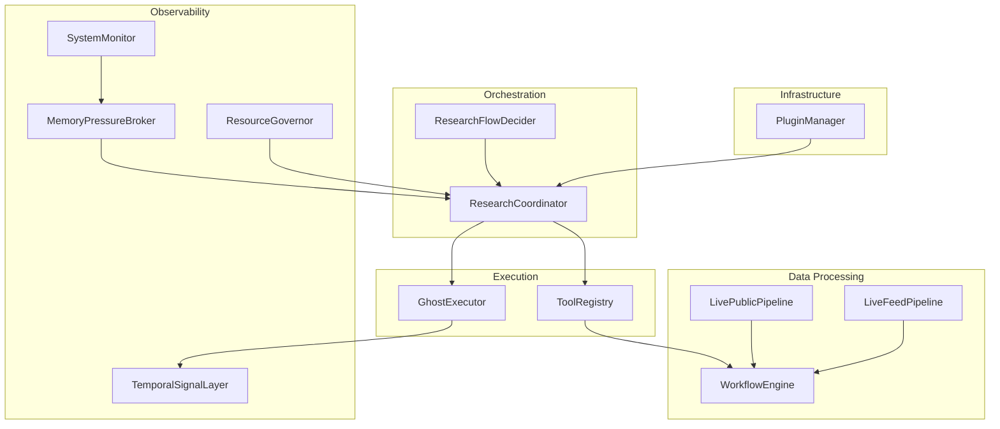
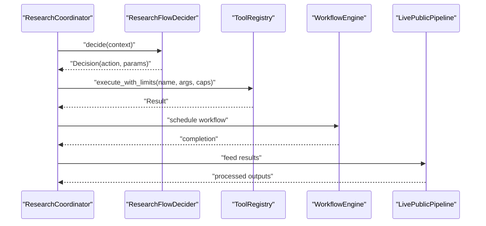
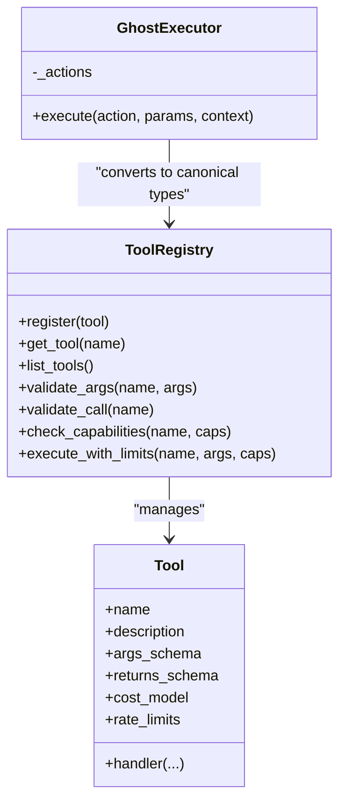
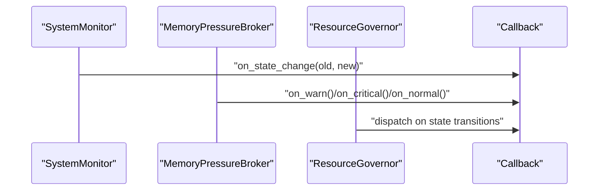
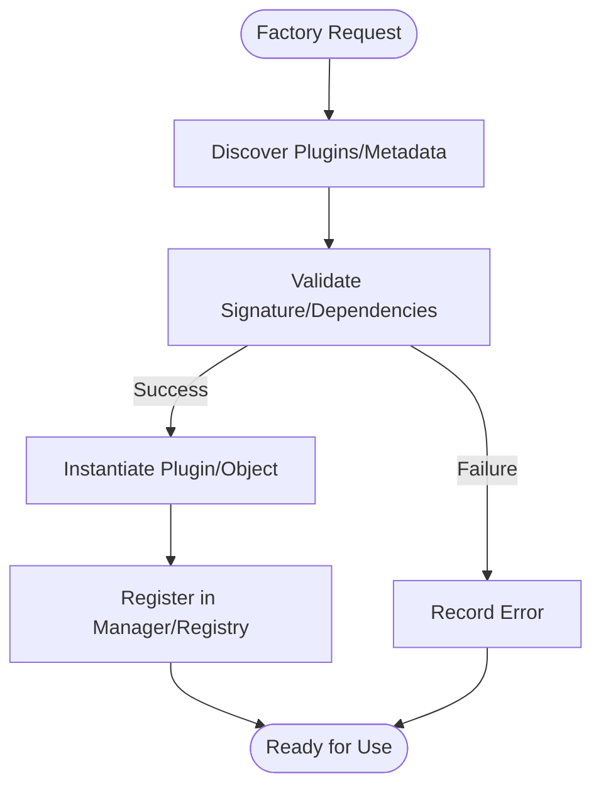
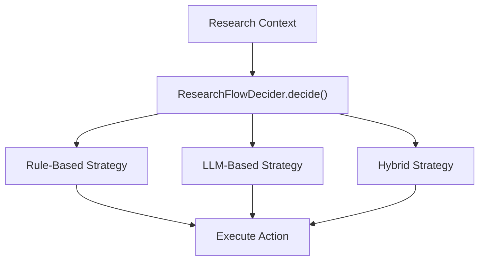
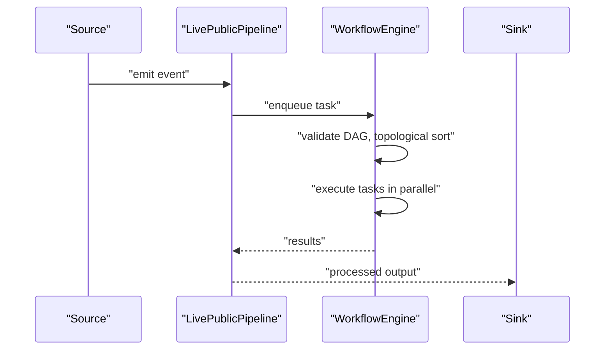
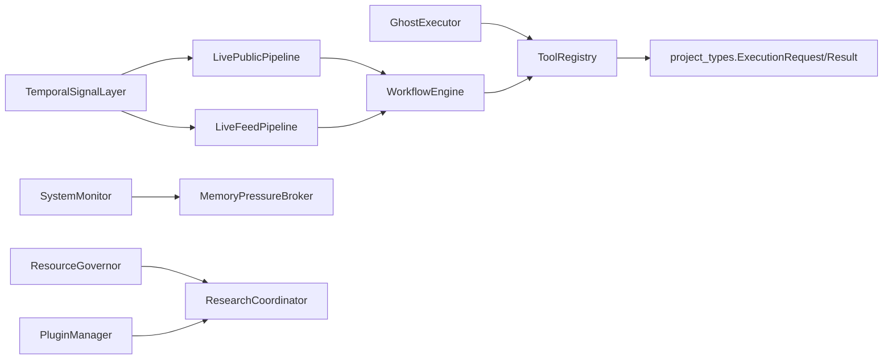

# Design Patterns and Architectural Principles

<cite>
**Referenced Files in This Document**
- [project_types.py](file://project_types.py)
- [tool_registry.py](file://tool_registry.py)
- [ghost_executor.py](file://execution/ghost_executor.py)
- [workflow_engine.py](file://utils/workflow_engine.py)
- [plugin_manager.py](file://infrastructure/plugin_manager.py)
- [temporal_signal_layer.py](file://layers/temporal_signal_layer.py)
- [system_monitor.py](file://infrastructure/system_monitor.py)
- [memory_pressure_broker.py](file://orchestrator/memory_pressure_broker.py)
- [resource_governor.py](file://core/resource_governor.py)
- [ioc_graph.py](file://knowledge/ioc_graph.py)
- [pipeline/live_public_pipeline.py](file://pipeline/live_public_pipeline.py)
- [pipeline/live_feed_pipeline.py](file://pipeline/live_feed_pipeline.py)
- [research_coordinator.py](file://coordinators/research_coordinator.py)
- [brain/research_flow_decider.py](file://brain/research_flow_decider.py)
</cite>

## Table of Contents
1. [Introduction](#introduction)
2. [Project Structure](#project-structure)
3. [Core Components](#core-components)
4. [Architecture Overview](#architecture-overview)
5. [Detailed Component Analysis](#detailed-component-analysis)
6. [Dependency Analysis](#dependency-analysis)
7. [Performance Considerations](#performance-considerations)
8. [Troubleshooting Guide](#troubleshooting-guide)
9. [Conclusion](#conclusion)

## Introduction
This document explains the design patterns and architectural principles underpinning Hledac Universal. It focuses on five pillars:
- Command Pattern for action execution
- Observer Pattern for event-driven processing
- Factory Pattern for dynamic component instantiation
- Strategy Pattern for research methodologies
- Pipeline Pattern for data processing workflows

We analyze how these patterns enhance modularity, extensibility, and maintainability, and we provide concrete references to the codebase along with diagrams and practical guidance for extension.

## Project Structure
Hledac Universal organizes functionality across layers:
- Orchestration and coordination (coordinators, orchestrators)
- Execution and tooling (tool registry, ghost executor)
- Data processing (pipelines, workflow engine)
- Observability and eventing (temporal signal layer, system monitors)
- Infrastructure (plugin manager, resource governance)

[No sources needed since this diagram shows conceptual structure, not a direct code mapping]

## Core Components
- ToolRegistry: Canonical execution authority with capability gating, rate limits, and cost modeling.
- GhostExecutor: Legacy donor path for research actions; bridges to canonical ExecutionRequest/ExecutionResult.
- WorkflowEngine: DAG-based workflow execution with retries, parallelism, and conditional tasks.
- PluginManager: Dynamic plugin loading and lifecycle management.
- TemporalSignalLayer: Event-driven temporal scoring and anomaly detection.
- SystemMonitor and MemoryPressureBroker: Health and pressure state observers with callback dispatch.
- Pipelines: LivePublicPipeline and LiveFeedPipeline orchestrate ingestion and processing.

**Section sources**
- [tool_registry.py:284-819](file://tool_registry.py#L284-L819)
- [ghost_executor.py:444-800](file://execution/ghost_executor.py#L444-L800)
- [workflow_engine.py:132-369](file://utils/workflow_engine.py#L132-L369)
- [plugin_manager.py:91-462](file://infrastructure/plugin_manager.py#L91-L462)
- [temporal_signal_layer.py:137-691](file://layers/temporal_signal_layer.py#L137-L691)
- [system_monitor.py:40-153](file://infrastructure/system_monitor.py#L40-L153)
- [memory_pressure_broker.py:272-291](file://orchestrator/memory_pressure_broker.py#L272-L291)
- [resource_governor.py:532-565](file://core/resource_governor.py#L532-L565)
- [pipeline/live_public_pipeline.py](file://pipeline/live_public_pipeline.py)
- [pipeline/live_feed_pipeline.py](file://pipeline/live_feed_pipeline.py)

## Architecture Overview
The system separates concerns:
- Canonical execution: ToolRegistry.execute_with_limits()
- Legacy compatibility: GhostExecutor.execute() with GhostBridge conversions
- Workflows: WorkflowEngine orchestrates DAGs and retries
- Plugins: PluginManager discovers and loads external components
- Observers: TemporalSignalLayer, SystemMonitor, MemoryPressureBroker react to events
- Pipelines: LivePublicPipeline and LiveFeedPipeline process streams

**Diagram sources**
- [research_coordinator.py:1152-1171](file://coordinators/research_coordinator.py#L1152-L1171)
- [brain/research_flow_decider.py:134-166](file://brain/research_flow_decider.py#L134-L166)
- [tool_registry.py:673-819](file://tool_registry.py#L673-L819)
- [workflow_engine.py:195-261](file://utils/workflow_engine.py#L195-L261)
- [pipeline/live_public_pipeline.py](file://pipeline/live_public_pipeline.py)

## Detailed Component Analysis

### Command Pattern: Action Execution
The Command Pattern encapsulates requests as objects, enabling parameterization, queuing, and deferred execution. In Hledac Universal:
- ToolRegistry.execute_with_limits() is the canonical command invoker.
- Tools define handler functions as commands with validated schemas.
- GhostExecutor.execute() acts as a legacy command executor with a thin bridge to canonical types.

Implementation highlights:
- Canonical invocation: [tool_registry.py:673-819](file://tool_registry.py#L673-L819)
- Capability gating and rate limiting: [tool_registry.py:650-748](file://tool_registry.py#L650-L748)
- Legacy bridge conversions: [ghost_executor.py:273-334](file://execution/ghost_executor.py#L273-L334)
- Execution semantics: [ghost_executor.py:581-622](file://execution/ghost_executor.py#L581-L622)

**Diagram sources**
- [tool_registry.py:224-314](file://tool_registry.py#L224-L314)
- [tool_registry.py:284-819](file://tool_registry.py#L284-L819)
- [ghost_executor.py:444-480](file://execution/ghost_executor.py#L444-L480)

Benefits:
- Modularity: Each tool is a self-contained command.
- Extensibility: New tools are added via register() with schema validation.
- Maintainability: Centralized enforcement of capabilities, rate limits, and timeouts.

Trade-offs:
- Overhead of schema validation and capability checks.
- Legacy path (GhostExecutor) introduces a compatibility seam.

Guidelines for extension:
- Define a Tool with args_schema and returns_schema.
- Implement a handler and register it via ToolRegistry.register().
- Enforce required capabilities to gate execution.

**Section sources**
- [tool_registry.py:224-314](file://tool_registry.py#L224-L314)
- [tool_registry.py:284-819](file://tool_registry.py#L284-L819)
- [ghost_executor.py:228-443](file://execution/ghost_executor.py#L228-L443)

### Observer Pattern: Event-Driven Processing
The Observer Pattern enables loose coupling between event producers and consumers. In Hledac Universal:
- SystemMonitor observes system health and notifies registered callbacks.
- MemoryPressureBroker observes memory pressure levels and triggers callbacks.
- ResourceGovernor periodically samples system metrics and dispatches callbacks.
- TemporalSignalLayer observes events and produces scores; supports feedback via confirmations.

Concrete examples:
- System state transitions and callback dispatch: [system_monitor.py:106-119](file://infrastructure/system_monitor.py#L106-L119)
- Memory pressure callbacks: [memory_pressure_broker.py:272-291](file://orchestrator/memory_pressure_broker.py#L272-L291)
- Resource governor monitoring loop: [resource_governor.py:546-565](file://core/resource_governor.py#L546-L565)
- Temporal event observation and scoring: [temporal_signal_layer.py:170-378](file://layers/temporal_signal_layer.py#L170-L378)

**Diagram sources**
- [system_monitor.py:106-119](file://infrastructure/system_monitor.py#L106-L119)
- [memory_pressure_broker.py:272-291](file://orchestrator/memory_pressure_broker.py#L272-L291)
- [resource_governor.py:546-565](file://core/resource_governor.py#L546-L565)

Benefits:
- Decoupling: Observers react to events without knowing producers.
- Flexibility: Multiple observers can subscribe to the same events.
- Predictability: Controlled dispatch with hysteresis and fail-open behavior.

Trade-offs:
- Complexity in managing observer lifecycles.
- Potential callback overhead if many observers are registered.

Guidelines for extension:
- Use on_state_change() or equivalent callback registration APIs.
- Apply hysteresis to avoid rapid oscillations.
- Keep callbacks lightweight to prevent blocking event producers.

**Section sources**
- [system_monitor.py:106-119](file://infrastructure/system_monitor.py#L106-L119)
- [memory_pressure_broker.py:272-291](file://orchestrator/memory_pressure_broker.py#L272-L291)
- [resource_governor.py:546-565](file://core/resource_governor.py#L546-L565)
- [temporal_signal_layer.py:170-378](file://layers/temporal_signal_layer.py#L170-L378)

### Factory Pattern: Dynamic Component Instantiation
The Factory Pattern centralizes object creation. In Hledac Universal:
- PluginManager creates and manages plugins from discovered metadata.
- ToolRegistry factory registers built-in tools and exposes create_default_registry().
- CommunicationLayer uses a factory function to create instances.

Examples:
- Plugin discovery and loading: [plugin_manager.py:120-278](file://infrastructure/plugin_manager.py#L120-L278)
- Tool registration factory: [tool_registry.py:1331-1440](file://tool_registry.py#L1331-L1440)
- Layer factory function: [layers/communication_layer.py:844-851](file://layers/communication_layer.py#L844-L851)

**Diagram sources**
- [plugin_manager.py:120-278](file://infrastructure/plugin_manager.py#L120-L278)
- [tool_registry.py:1331-1440](file://tool_registry.py#L1331-L1440)
- [layers/communication_layer.py:844-851](file://layers/communication_layer.py#L844-L851)

Benefits:
- Encapsulation of creation logic.
- Runtime extensibility without modifying client code.
- Centralized lifecycle management.

Trade-offs:
- Additional indirection and potential complexity in error handling.

Guidelines for extension:
- Provide metadata and entry points for plugins.
- Implement on_load/on_unload hooks for lifecycle management.
- Use factory functions for layer instantiation.

**Section sources**
- [plugin_manager.py:120-278](file://infrastructure/plugin_manager.py#L120-L278)
- [tool_registry.py:1331-1440](file://tool_registry.py#L1331-L1440)
- [layers/communication_layer.py:844-851](file://layers/communication_layer.py#L844-L851)

### Strategy Pattern: Research Methodologies
The Strategy Pattern allows selecting an algorithm at runtime. In Hledac Universal:
- ResearchFlowDecider chooses among rule-based, LLM-based, or hybrid strategies.
- ResearchCoordinator orchestrates research threads and synthesizes results.

Examples:
- Strategy selection and decision-making: [brain/research_flow_decider.py:134-166](file://brain/research_flow_decider.py#L134-L166)
- Research synthesis and quality assessment: [coordinators/research_coordinator.py:1152-1262](file://coordinators/research_coordinator.py#L1152-L1262)

**Diagram sources**
- [brain/research_flow_decider.py:134-166](file://brain/research_flow_decider.py#L134-L166)
- [coordinators/research_coordinator.py:1152-1262](file://coordinators/research_coordinator.py#L1152-L1262)

Benefits:
- Flexibility to adapt methodology based on context.
- Easy addition of new strategies without changing clients.

Trade-offs:
- Strategy switching adds branching complexity.
- Ensuring consistent evaluation across strategies.

Guidelines for extension:
- Define a clear interface for strategies.
- Encapsulate strategy-specific logic and configuration.

**Section sources**
- [brain/research_flow_decider.py:134-166](file://brain/research_flow_decider.py#L134-L166)
- [coordinators/research_coordinator.py:1152-1262](file://coordinators/research_coordinator.py#L1152-L1262)

### Pipeline Pattern: Data Processing Workflows
The Pipeline Pattern composes processing stages through a series of transformations. In Hledac Universal:
- LivePublicPipeline and LiveFeedPipeline orchestrate ingestion and processing.
- WorkflowEngine executes DAGs with retries and parallelism.

Examples:
- Pipeline entry points: [pipeline/live_public_pipeline.py](file://pipeline/live_public_pipeline.py), [pipeline/live_feed_pipeline.py](file://pipeline/live_feed_pipeline.py)
- Workflow execution: [workflow_engine.py:195-261](file://utils/workflow_engine.py#L195-L261)

**Diagram sources**
- [pipeline/live_public_pipeline.py](file://pipeline/live_public_pipeline.py)
- [pipeline/live_feed_pipeline.py](file://pipeline/live_feed_pipeline.py)
- [workflow_engine.py:195-261](file://utils/workflow_engine.py#L195-L261)

Benefits:
- Clear separation of concerns across stages.
- Parallelism and retries improve throughput and resilience.

Trade-offs:
- Complexity in managing dependencies and state.
- Potential bottlenecks in upstream stages.

Guidelines for extension:
- Define tasks with explicit dependencies.
- Use retries with exponential backoff for transient failures.

**Section sources**
- [pipeline/live_public_pipeline.py](file://pipeline/live_public_pipeline.py)
- [pipeline/live_feed_pipeline.py](file://pipeline/live_feed_pipeline.py)
- [workflow_engine.py:195-261](file://utils/workflow_engine.py#L195-L261)

## Dependency Analysis
This section maps key dependencies among components.

**Diagram sources**
- [tool_registry.py:284-819](file://tool_registry.py#L284-L819)
- [project_types.py:1-800](file://project_types.py#L1-L800)
- [ghost_executor.py:444-800](file://execution/ghost_executor.py#L444-L800)
- [workflow_engine.py:132-369](file://utils/workflow_engine.py#L132-L369)
- [pipeline/live_public_pipeline.py](file://pipeline/live_public_pipeline.py)
- [pipeline/live_feed_pipeline.py](file://pipeline/live_feed_pipeline.py)
- [temporal_signal_layer.py:137-691](file://layers/temporal_signal_layer.py#L137-L691)
- [system_monitor.py:40-153](file://infrastructure/system_monitor.py#L40-L153)
- [memory_pressure_broker.py:272-291](file://orchestrator/memory_pressure_broker.py#L272-L291)
- [resource_governor.py:532-565](file://core/resource_governor.py#L532-L565)
- [plugin_manager.py:91-462](file://infrastructure/plugin_manager.py#L91-L462)

**Section sources**
- [tool_registry.py:284-819](file://tool_registry.py#L284-L819)
- [project_types.py:1-800](file://project_types.py#L1-L800)
- [ghost_executor.py:444-800](file://execution/ghost_executor.py#L444-L800)
- [workflow_engine.py:132-369](file://utils/workflow_engine.py#L132-L369)
- [pipeline/live_public_pipeline.py](file://pipeline/live_public_pipeline.py)
- [pipeline/live_feed_pipeline.py](file://pipeline/live_feed_pipeline.py)
- [temporal_signal_layer.py:137-691](file://layers/temporal_signal_layer.py#L137-L691)
- [system_monitor.py:40-153](file://infrastructure/system_monitor.py#L40-L153)
- [memory_pressure_broker.py:272-291](file://orchestrator/memory_pressure_broker.py#L272-L291)
- [resource_governor.py:532-565](file://core/resource_governor.py#L532-L565)
- [plugin_manager.py:91-462](file://infrastructure/plugin_manager.py#L91-L462)

## Performance Considerations
- ToolRegistry enforces rate limits and timeouts to prevent resource exhaustion. See [tool_registry.py:584-748](file://tool_registry.py#L584-L748).
- WorkflowEngine uses semaphores and exponential backoff to balance throughput and stability. See [workflow_engine.py:229-330](file://utils/workflow_engine.py#L229-L330).
- TemporalSignalLayer avoids heavy dependencies and uses bounded data structures for M1 safety. See [temporal_signal_layer.py:137-154](file://layers/temporal_signal_layer.py#L137-L154).
- IOCGraph flushes buffers asynchronously to minimize latency spikes. See [ioc_graph.py:176-216](file://knowledge/ioc_graph.py#L176-L216).

[No sources needed since this section provides general guidance]

## Troubleshooting Guide
Common issues and diagnostics:
- Tool execution errors: Inspect canonical audit logging and error normalization. See [tool_registry.py:794-819](file://tool_registry.py#L794-L819).
- Plugin loading failures: Review discovery and signature validation logs. See [plugin_manager.py:120-278](file://infrastructure/plugin_manager.py#L120-L278).
- Memory pressure callbacks: Verify callback registration and error handling. See [memory_pressure_broker.py:272-291](file://orchestrator/memory_pressure_broker.py#L272-L291).
- System state transitions: Confirm callback dispatch and hysteresis behavior. See [system_monitor.py:106-119](file://infrastructure/system_monitor.py#L106-L119).
- Resource governor monitoring: Ensure clean cancellation and fail-open behavior. See [resource_governor.py:532-565](file://core/resource_governor.py#L532-L565).

**Section sources**
- [tool_registry.py:794-819](file://tool_registry.py#L794-L819)
- [plugin_manager.py:120-278](file://infrastructure/plugin_manager.py#L120-L278)
- [memory_pressure_broker.py:272-291](file://orchestrator/memory_pressure_broker.py#L272-L291)
- [system_monitor.py:106-119](file://infrastructure/system_monitor.py#L106-L119)
- [resource_governor.py:532-565](file://core/resource_governor.py#L532-L565)

## Conclusion
Hledac Universal leverages well-established design patterns to achieve a modular, extensible, and maintainable architecture:
- Command Pattern centralizes execution with capability and rate enforcement.
- Observer Pattern decouples event producers from consumers for robust reactions.
- Factory Pattern simplifies dynamic component instantiation and lifecycle management.
- Strategy Pattern adapts research methodologies to context.
- Pipeline Pattern composes processing stages with retries and parallelism.

These patterns collectively support performance, scalability, and long-term evolution of the system.