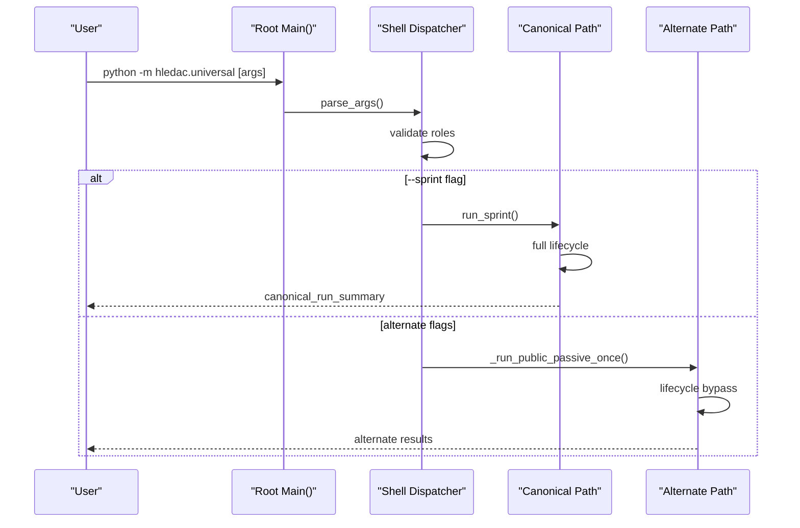
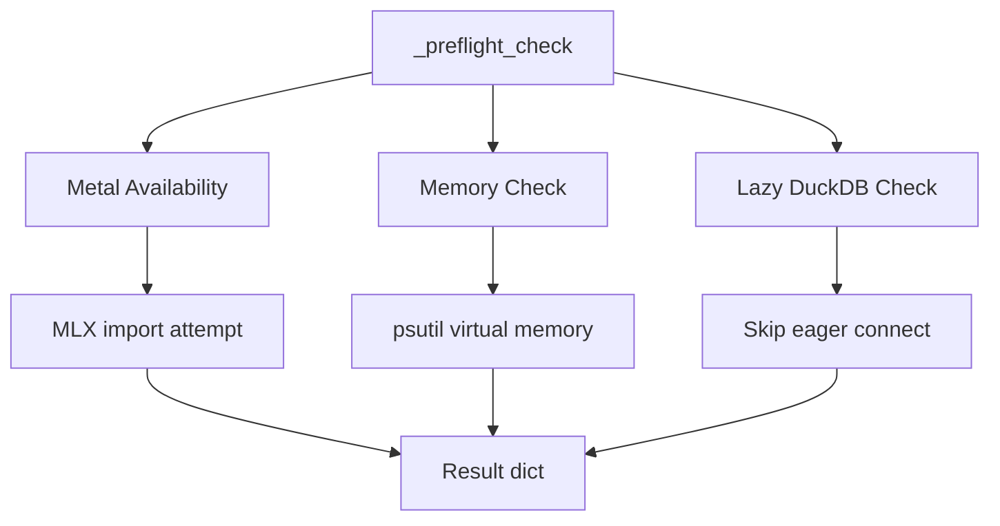
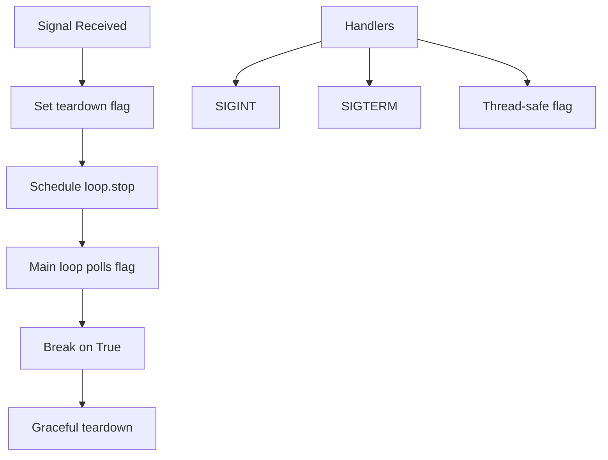
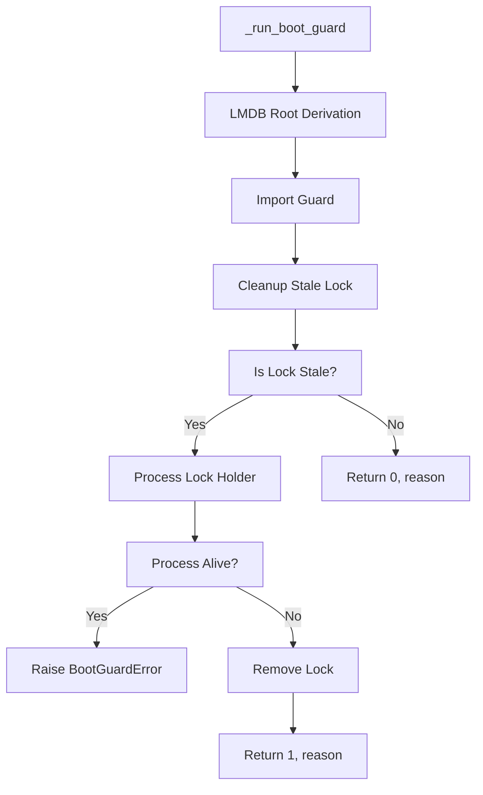
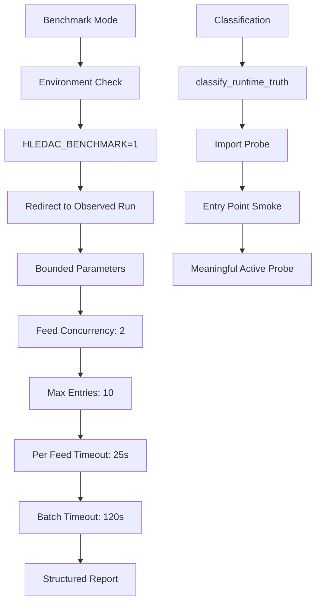
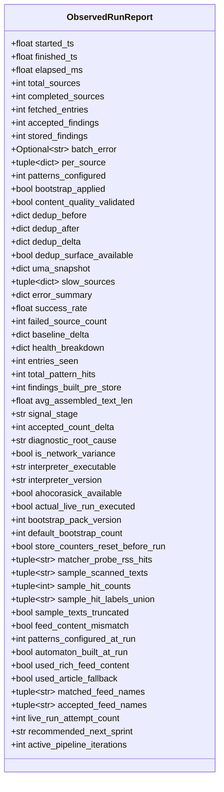
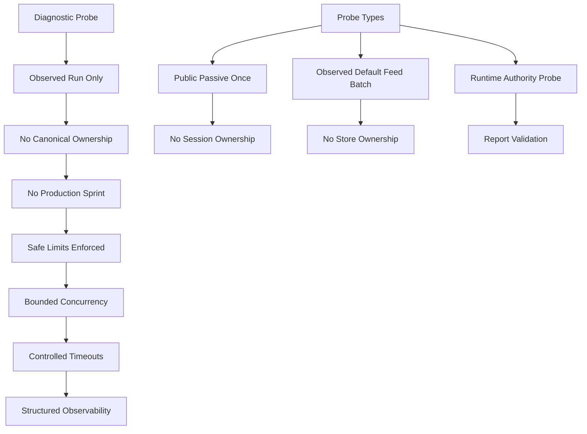
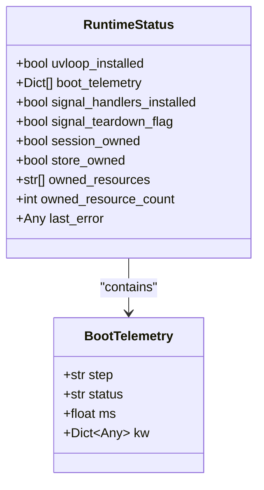
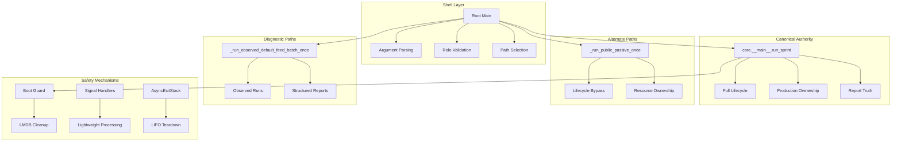

# Entrypoint System

<cite>
**Referenced Files in This Document**
- [__main__.py](file://hledac/universal/__main__.py)
- [core/__main__.py](file://hledac/universal/core/__main__.py)
- [lmdb_boot_guard.py](file://hledac/universal/knowledge/lmdb_boot_guard.py)
- [runtime_authority_manifest.py](file://hledac/universal/runtime_authority_manifest.py)
- [runtime_authority_probe.py](file://hledac/universal/tools/runtime_authority_probe.py)
- [GHOST_INVARIANTS.md](file://hledac/universal/GHOST_INVARIANTS.md)
</cite>

## Table of Contents
1. [Introduction](#introduction)
2. [Dual Entrypoint Design](#dual-entrypoint-design)
3. [Delegation Mechanism](#delegation-mechanism)
4. [CLI Argument Parsing](#cli-argument-parser)
5. [Help System Optimization](#help-system-optimization)
6. [Preflight Capability Checking](#preflight-capability-checking)
7. [Signal Handling System](#signal-handling-system)
8. [Boot Guard Implementation](#boot-guard-implementation)
9. [Async Safety Measures](#async-safety-measures)
10. [Thread-Safe Operations](#thread-safe-operations)
11. [Benchmark Mode Activation](#benchmark-mode-activation)
12. [Observed Run Reporting](#observed-run-reporting)
13. [Diagnostic Probe Execution](#diagnostic-probe-execution)
14. [Runtime Status Monitoring](#runtime-status-monitoring)
15. [Error Handling Strategies](#error-handling-strategies)
16. [Architecture Overview](#architecture-overview)
17. [Conclusion](#conclusion)

## Introduction

The Hledac Universal entrypoint system implements a sophisticated dual-entrypoint architecture designed to maintain strict authority segregation while providing flexible operational modes. This system enforces a canonical-first approach where all production sprint ownership resides exclusively with the canonical path, while alternate and diagnostic paths serve specific use cases without claiming canonical authority.

The architecture emphasizes safety through structured delegation, comprehensive preflight checks, robust signal handling, and extensive runtime monitoring. The system maintains clear role boundaries between canonical, shell, alternate, residual, and diagnostic entrypoints, each with specific responsibilities and limitations.

## Dual Entrypoint Design

The entrypoint system operates on a hardened authority model with four distinct role categories:

```mermaid
graph TB
subgraph "Entry Point Authority"
A[ENTRYPOINT_AUTHORITY] --> B[Canonical Owner]
A --> C[Shell Dispatcher]
A --> D[Alternate Paths]
A --> E[Residual Helpers]
A --> F[Diagnostic Probes]
end
B --> B1[core.__main__.run_sprint]
C --> C1[main() --sprint]
D --> D1[_run_sprint_mode]
D --> D2[_run_public_passive_once]
E --> E1[run_warmup]
F --> F1[_run_observed_default_feed_batch_once]
subgraph "Authority Invariants"
G[No Confusion Invariant]
H[Canonical Only Owner]
I[Shell Never Owns]
J[Alternate No Lifecycle]
end
```

**Diagram sources**
- [__main__.py:70-183](file://hledac/universal/__main__.py#L70-L183)

The system enforces strict authority invariants where only the canonical path (`core.__main__.run_sprint`) can claim ownership of production sprints. Shell entrypoints act solely as dispatchers, while alternate paths bypass canonical lifecycle requirements and diagnostic paths operate outside production contexts.

**Section sources**
- [__main__.py:48-183](file://hledac/universal/__main__.py#L48-L183)

## Delegation Mechanism

The delegation system establishes a clear hierarchy from root main() to canonical execution:



**Diagram sources**
- [__main__.py:144-151](file://hledac/universal/__main__.py#L144-L151)
- [core/__main__.py:869-878](file://hledac/universal/core/__main__.py#L869-L878)

The delegation mechanism ensures that root main() never acts as a sprint owner, serving exclusively as a shell dispatcher that routes to appropriate execution paths based on command-line arguments.

**Section sources**
- [__main__.py:144-176](file://hledac/universal/__main__.py#L144-L176)
- [core/__main__.py:869-887](file://hledac/universal/core/__main__.py#L869-L887)

## CLI Argument Parser

The CLI system implements a fast-help optimization by deferring heavy imports until help is explicitly requested:

```mermaid
flowchart TD
A[build_parser()] --> B[Local argparse import]
B --> C[Create ArgumentParser]
C --> D[Disable default help]
D --> E[Manual help handling]
E --> F[Lightweight parsing]
G[Help Request] --> H[Import heavy modules]
H --> I[Full help display]
```

**Diagram sources**
- [__main__.py:211-245](file://hledac/universal/__main__.py#L211-L245)

The parser construction avoids importing heavy modules like MLX and brain components during help generation, keeping the help path responsive and efficient.

**Section sources**
- [__main__.py:211-245](file://hledac/universal/__main__.py#L211-L245)

## Help System Optimization

The help system employs a two-tier approach to minimize startup overhead:

- **Fast Path**: Help requests are handled without loading MLX, brain, or other heavy dependencies
- **Slow Path**: Full help displays require importing additional modules

This optimization ensures that users can quickly access help information without the performance penalty of loading the entire runtime.

**Section sources**
- [__main__.py:208-245](file://hledac/universal/__main__.py#L208-L245)

## Preflight Capability Checking

The preflight system performs capability checks without raising exceptions:



**Diagram sources**
- [__main__.py:280-304](file://hledac/universal/__main__.py#L280-L304)

The preflight system uses graceful degradation, avoiding heavyweight operations like eager DuckDB connections that would provide no additional truth value.

**Section sources**
- [__main__.py:277-304](file://hledac/universal/__main__.py#L277-L304)

## Signal Handling System

The signal handling system implements lightweight, async-safe handlers:



**Diagram sources**
- [__main__.py:356-385](file://hledac/universal/__main__.py#L356-L385)

Signal handlers are installed before the asyncio loop is created and use thread-safe flag setting to avoid heavy work in signal context.

**Section sources**
- [__main__.py:341-385](file://hledac/universal/__main__.py#L341-L385)

## Boot Guard Implementation

The boot guard provides LMDB lock cleanup with strict stale-lock detection:



**Diagram sources**
- [__main__.py:391-434](file://hledac/universal/__main__.py#L391-L434)
- [lmdb_boot_guard.py:132-165](file://hledac/universal/knowledge/lmdb_boot_guard.py#L132-L165)

The boot guard implements fail-soft, idempotent lock cleanup with strict stale-lock detection using process liveness verification.

**Section sources**
- [__main__.py:388-434](file://hledac/universal/__main__.py#L388-L434)
- [lmdb_boot_guard.py:1-185](file://hledac/universal/knowledge/lmdb_boot_guard.py#L1-L185)

## Async Safety Measures

The system implements comprehensive async safety measures:

- **AsyncExitStack**: Unified teardown backbone with LIFO order
- **Orphan Task Cancellation**: Prevents "Task was destroyed" warnings
- **Graceful Task Drain**: Protected by 5-second timeout
- **Signal-Driven Exit**: Lightweight handlers without heavy work

```mermaid
sequenceDiagram
participant Loop as "Async Loop"
participant Stack as "AsyncExitStack"
participant Tasks as "Background Tasks"
Loop->>Tasks : Create tasks
Note over Loop,Tasks : Normal operation
Loop->>Loop : Signal received
Loop->>Stack : _cancel_orphan_tasks()
Stack->>Tasks : Cancel all tasks
Tasks-->>Stack : Complete cancellation
Stack->>Stack : __aexit__() unwind
Stack-->>Loop : Cleanup complete
```

**Diagram sources**
- [__main__.py:543-576](file://hledac/universal/__main__.py#L543-L576)

**Section sources**
- [__main__.py:438-576](file://hledac/universal/__main__.py#L438-L576)

## Thread-Safe Operations

Thread-safe operations are implemented throughout the system:

- **Atomic Flag Operations**: Thread-safe signal flag management
- **Async Locks**: Protected access to shared resources
- **Singleton Patterns**: Thread-safe lazy initialization
- **Thread-Safe Logging**: Structured logging without race conditions

**Section sources**
- [__main__.py:348-353](file://hledac/universal/__main__.py#L348-L353)
- [__main__.py:2344-2389](file://hledac/universal/__main__.py#L2344-L2389)

## Benchmark Mode Activation

Benchmark mode provides controlled execution of diagnostic probes:



**Diagram sources**
- [__main__.py:457-485](file://hledac/universal/__main__.py#L457-L485)
- [__main__.py:848-894](file://hledac/universal/__main__.py#L848-L894)

**Section sources**
- [__main__.py:457-485](file://hledac/universal/__main__.py#L457-L485)
- [__main__.py:848-894](file://hledac/universal/__main__.py#L848-L894)

## Observed Run Reporting

Observed run reporting captures comprehensive runtime metrics:



**Diagram sources**
- [__main__.py:954-1040](file://hledac/universal/__main__.py#L954-L1040)

**Section sources**
- [__main__.py:954-1040](file://hledac/universal/__main__.py#L954-L1040)

## Diagnostic Probe Execution

Diagnostic probes provide controlled execution for testing and validation:



**Diagram sources**
- [__main__.py:582-720](file://hledac/universal/__main__.py#L582-L720)
- [__main__.py:1540-1572](file://hledac/universal/__main__.py#L1540-L1572)

**Section sources**
- [__main__.py:582-720](file://hledac/universal/__main__.py#L582-L720)
- [__main__.py:1540-1572](file://hledac/universal/__main__.py#L1540-L1572)

## Runtime Status Monitoring

The runtime status system provides comprehensive monitoring capabilities:



**Diagram sources**
- [__main__.py:319-337](file://hledac/universal/__main__.py#L319-L337)
- [__main__.py:258-274](file://hledac/universal/__main__.py#L258-L274)

**Section sources**
- [__main__.py:319-337](file://hledac/universal/__main__.py#L319-L337)
- [__main__.py:258-274](file://hledac/universal/__main__.py#L258-L274)

## Error Handling Strategies

The system implements comprehensive error handling strategies:

- **Graceful Degradation**: Preflight checks never raise exceptions
- **Fail-Safe Teardown**: AsyncExitStack ensures cleanup completion
- **Protected Drains**: Orphan task cancellation with timeouts
- **Non-Fatal Failures**: Export and deep probe failures don't crash sprints
- **Signal Safety**: Handlers avoid heavy work in signal context

**Section sources**
- [__main__.py:277-304](file://hledac/universal/__main__.py#L277-L304)
- [__main__.py:526-541](file://hledac/universal/__main__.py#L526-L541)
- [core/__main__.py:1806-1807](file://hledac/universal/core/__main__.py#L1806-L1807)

## Architecture Overview

The entrypoint system architecture enforces strict authority segregation:



**Diagram sources**
- [__main__.py:70-183](file://hledac/universal/__main__.py#L70-L183)
- [core/__main__.py:869-887](file://hledac/universal/core/__main__.py#L869-L887)

**Section sources**
- [__main__.py:70-183](file://hledac/universal/__main__.py#L70-L183)
- [core/__main__.py:869-887](file://hledac/universal/core/__main__.py#L869-L887)

## Conclusion

The Hledac Universal entrypoint system demonstrates sophisticated architectural design with clear authority segregation, comprehensive safety mechanisms, and robust operational flexibility. The dual-entrypoint design ensures that canonical ownership remains centralized while providing appropriate alternatives for different operational contexts.

Key strengths include the hardened authority model that prevents confusion between canonical and observed/diagnostic paths, the comprehensive preflight and boot guard systems, lightweight signal handling, and extensive runtime monitoring capabilities. The system's emphasis on async safety, thread-safe operations, and graceful error handling creates a reliable foundation for production OSINT operations.

The architecture successfully balances operational flexibility with strict authority enforcement, ensuring that production sprint ownership remains with the canonical path while alternate and diagnostic paths serve their intended specialized purposes without compromising system integrity.