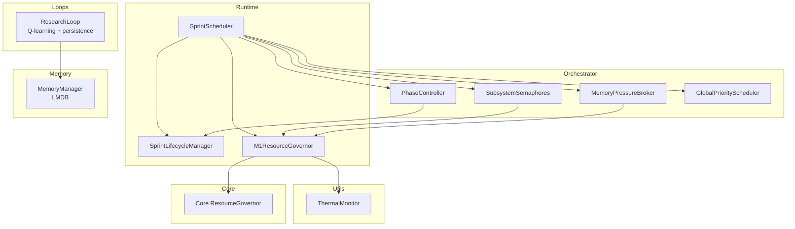
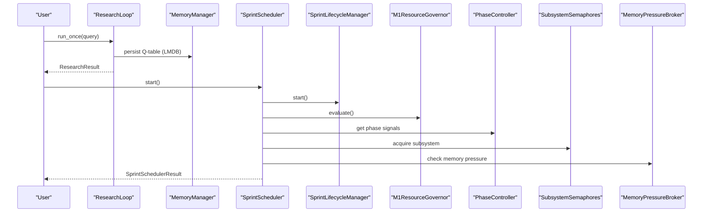
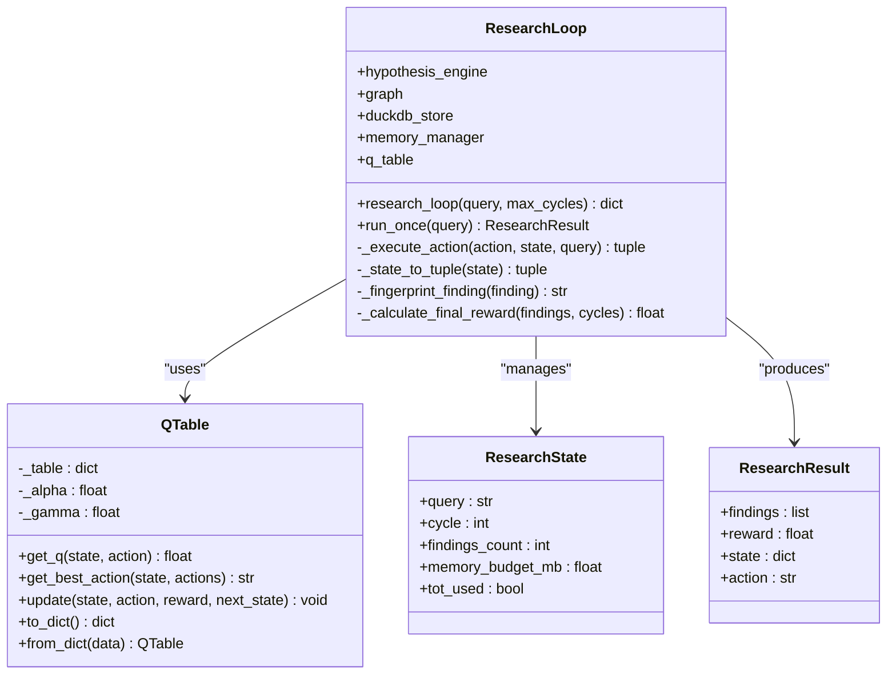
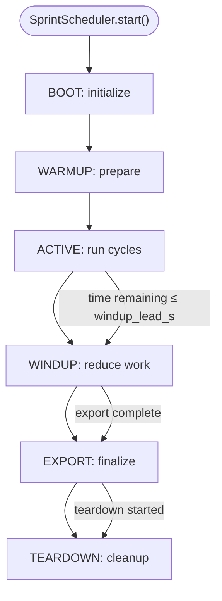
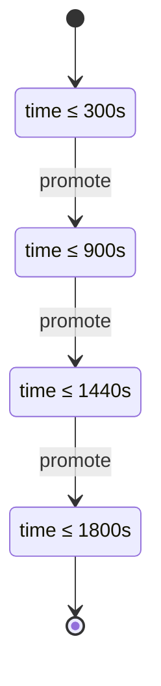
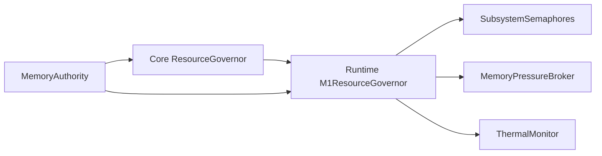
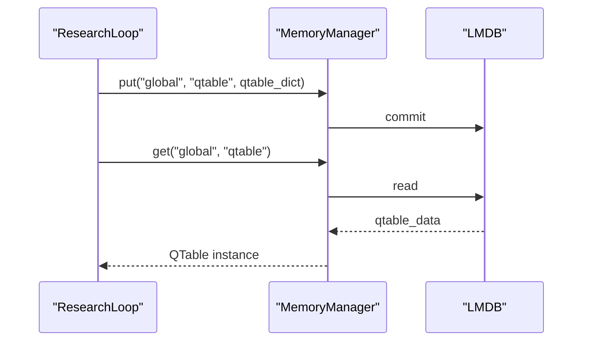
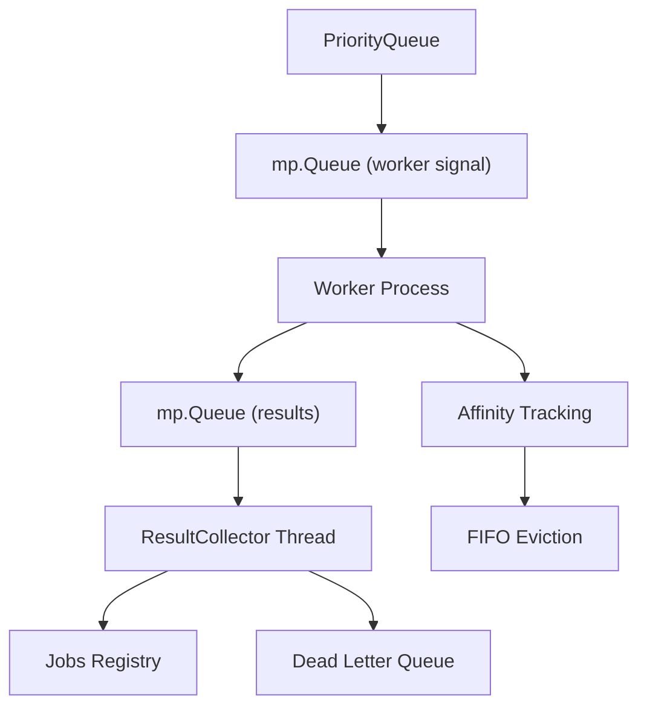
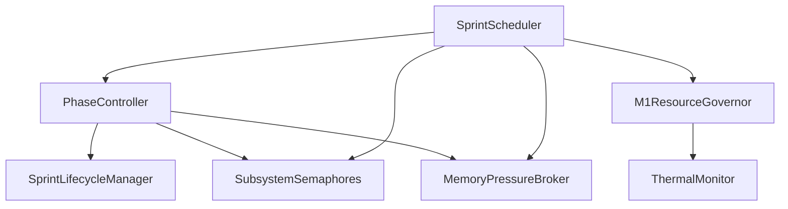
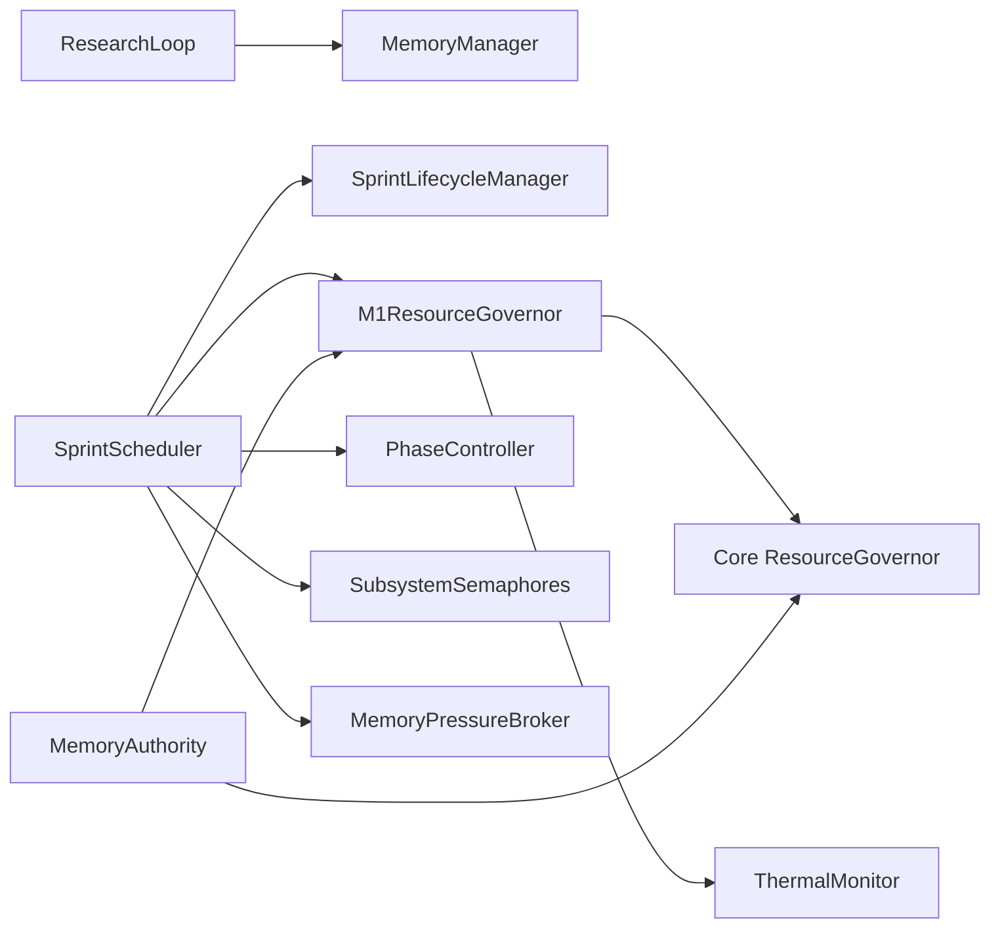

# Research Loop Management

<cite>
**Referenced Files in This Document**
- [research_loop.py](file://loops/research_loop.py)
- [autonomous_orchestrator.py](file://autonomous_orchestrator.py)
- [sprint_scheduler.py](file://runtime/sprint_scheduler.py)
- [sprint_lifecycle.py](file://runtime/sprint_lifecycle.py)
- [memory_authority.py](file://runtime/memory_authority.py)
- [resource_governor.py](file://runtime/resource_governor.py)
- [global_scheduler.py](file://orchestrator/global_scheduler.py)
- [phase_controller.py](file://orchestrator/phase_controller.py)
- [memory_manager.py](file://memory/memory_manager.py)
- [thermal.py](file://utils/thermal.py)
- [core_resource_governor.py](file://core/resource_governor.py)
- [memory_pressure_broker.py](file://orchestrator/memory_pressure_broker.py)
- [subsystem_semaphores.py](file://orchestrator/subsystem_semaphores.py)
</cite>

## Table of Contents
1. [Introduction](#introduction)
2. [Project Structure](#project-structure)
3. [Core Components](#core-components)
4. [Architecture Overview](#architecture-overview)
5. [Detailed Component Analysis](#detailed-component-analysis)
6. [Dependency Analysis](#dependency-analysis)
7. [Performance Considerations](#performance-considerations)
8. [Troubleshooting Guide](#troubleshooting-guide)
9. [Conclusion](#conclusion)

## Introduction
This document describes the research loop management system in Hledac Universal, focusing on the autonomous orchestrator implementation, research cycle coordination, and memory-constrained operation strategies. It explains the sprint scheduler architecture, task lifecycle management, and resource allocation patterns. It also covers the research loop controller functionality, phase management, cross-sprint persistence mechanisms, memory authority and thermal management, and performance optimizations tailored for Apple Silicon. The document details integration between orchestrator components, loop state management, and coordination with other system layers, along with error handling, recovery mechanisms, and monitoring capabilities.

## Project Structure
The research loop management spans several modules:
- Loops: autonomous research loop with Q-learning planning and persistence
- Runtime: sprint lifecycle, scheduler, and resource governance
- Orchestrator: phase control, subsystem semaphores, and memory pressure handling
- Memory: LMDB-backed persistent memory manager
- Utils: thermal monitoring helpers
- Core: unified memory accounting and governor logic

**Diagram sources**
- [research_loop.py:212-781](file://loops/research_loop.py#L212-L781)
- [sprint_scheduler.py:1-11696](file://runtime/sprint_scheduler.py#L1-L11696)
- [sprint_lifecycle.py:1-531](file://runtime/sprint_lifecycle.py#L1-L531)
- [resource_governor.py:1-353](file://runtime/resource_governor.py#L1-L353)
- [phase_controller.py:1-407](file://orchestrator/phase_controller.py#L1-L407)
- [subsystem_semaphores.py:1-196](file://orchestrator/subsystem_semaphores.py#L1-L196)
- [memory_pressure_broker.py:1-323](file://orchestrator/memory_pressure_broker.py#L1-L323)
- [global_scheduler.py:1-569](file://orchestrator/global_scheduler.py#L1-L569)
- [memory_manager.py:1-530](file://memory/memory_manager.py#L1-L530)
- [thermal.py:1-203](file://utils/thermal.py#L1-L203)
- [core_resource_governor.py:1-668](file://core/resource_governor.py#L1-L668)

**Section sources**
- [research_loop.py:1-781](file://loops/research_loop.py#L1-L781)
- [sprint_scheduler.py:1-11696](file://runtime/sprint_scheduler.py#L1-L11696)
- [sprint_lifecycle.py:1-531](file://runtime/sprint_lifecycle.py#L1-L531)
- [resource_governor.py:1-353](file://runtime/resource_governor.py#L1-L353)
- [phase_controller.py:1-407](file://orchestrator/phase_controller.py#L1-L407)
- [subsystem_semaphores.py:1-196](file://orchestrator/subsystem_semaphores.py#L1-L196)
- [memory_pressure_broker.py:1-323](file://orchestrator/memory_pressure_broker.py#L1-L323)
- [global_scheduler.py:1-569](file://orchestrator/global_scheduler.py#L1-L569)
- [memory_manager.py:1-530](file://memory/memory_manager.py#L1-L530)
- [thermal.py:1-203](file://utils/thermal.py#L1-L203)
- [core_resource_governor.py:1-668](file://core/resource_governor.py#L1-L668)

## Core Components
- ResearchLoop: autonomous research with Q-learning planning, action execution, reward calculation, and cross-sprint persistence via LMDB
- SprintScheduler: 30-minute bounded sprint execution with lifecycle, phase control, and resource governance
- SprintLifecycleManager: canonical state machine for sprint phases and timing
- M1ResourceGovernor: advisory safety layer for concurrency, model/renderer leases, and mission budget
- PhaseController: evidence-driven phase promotion with weighted scoring and thermal-aware beam width
- MemoryManager: LMDB-backed session-scoped memory with bounded storage and async operations
- MemoryPressureBroker: memory pressure monitoring and admission state transitions
- SubsystemSemaphores: Apple Silicon resource routing with bounded concurrency per subsystem
- ThermalMonitor: macOS thermal state reader for thermal-aware decisions
- Core ResourceGovernor: unified UMA accounting, hysteresis, and I/O-only mode

**Section sources**
- [research_loop.py:212-781](file://loops/research_loop.py#L212-L781)
- [sprint_scheduler.py:1-11696](file://runtime/sprint_scheduler.py#L1-L11696)
- [sprint_lifecycle.py:1-531](file://runtime/sprint_lifecycle.py#L1-L531)
- [resource_governor.py:1-353](file://runtime/resource_governor.py#L1-L353)
- [phase_controller.py:1-407](file://orchestrator/phase_controller.py#L1-L407)
- [memory_manager.py:1-530](file://memory/memory_manager.py#L1-L530)
- [memory_pressure_broker.py:1-323](file://orchestrator/memory_pressure_broker.py#L1-L323)
- [subsystem_semaphores.py:1-196](file://orchestrator/subsystem_semaphores.py#L1-L196)
- [thermal.py:1-203](file://utils/thermal.py#L1-L203)
- [core_resource_governor.py:1-668](file://core/resource_governor.py#L1-L668)

## Architecture Overview
The research loop management system integrates three layers:
- Research Loop Layer: Q-learning planning, action execution, and persistence
- Runtime Layer: lifecycle, scheduling, and resource governance
- Orchestrator Layer: phase control, subsystem routing, and pressure handling

**Diagram sources**
- [research_loop.py:333-741](file://loops/research_loop.py#L333-L741)
- [memory_manager.py:148-341](file://memory/memory_manager.py#L148-L341)
- [sprint_scheduler.py:1-11696](file://runtime/sprint_scheduler.py#L1-L11696)
- [sprint_lifecycle.py:82-240](file://runtime/sprint_lifecycle.py#L82-L240)
- [resource_governor.py:137-217](file://runtime/resource_governor.py#L137-L217)
- [phase_controller.py:124-361](file://orchestrator/phase_controller.py#L124-L361)
- [subsystem_semaphores.py:116-146](file://orchestrator/subsystem_semaphores.py#L116-L146)
- [memory_pressure_broker.py:223-291](file://orchestrator/memory_pressure_broker.py#L223-L291)

## Detailed Component Analysis

### Research Loop Controller
The ResearchLoop implements an autonomous research cycle with Q-learning-based planning:
- Actions: hypothesis generation, Tree of Thoughts reasoning, discovery, fetch, graph update, evaluation, done
- State representation: query, cycle, findings count, memory budget, ToT usage
- Q-table: in-memory Q-learning with LMDB persistence for cross-sprint continuity
- Reward: findings-based with bonuses/penalties; final reward combines unique findings and cycle count
- Execution: async action execution with deduplication and memory budget updates

**Diagram sources**
- [research_loop.py:74-781](file://loops/research_loop.py#L74-L781)

**Section sources**
- [research_loop.py:212-781](file://loops/research_loop.py#L212-L781)

### Sprint Scheduler Architecture
The SprintScheduler coordinates 30-minute bounded sprints with lifecycle, phase control, and resource governance:
- Lifecycle: BOOT → WARMUP → ACTIVE → WINDUP → EXPORT → TEARDOWN with strict monotonic transitions
- Configuration: duration, wind-down lead, cycle sleep, parallel sources, aggressive mode
- Results: comprehensive counters for cycles, entries, hits, accepted findings, and CT loss diagnostics
- Integration: governor decisions, thermal state, and sidecar admission

**Diagram sources**
- [sprint_scheduler.py:1-11696](file://runtime/sprint_scheduler.py#L1-L11696)
- [sprint_lifecycle.py:82-240](file://runtime/sprint_lifecycle.py#L82-L240)

**Section sources**
- [sprint_scheduler.py:623-806](file://runtime/sprint_scheduler.py#L623-L806)
- [sprint_lifecycle.py:54-240](file://runtime/sprint_lifecycle.py#L54-L240)

### Phase Management and Promotion
The PhaseController manages four-phase research with evidence-driven promotion:
- Phases: DISCOVERY (≤5 min), CONTRADICTION (≤15 min), DEEPEN (≤24 min), SYNTHESIS (≤30 min)
- Signals: strong hypotheses, contradiction pressure, beam stabilization, gaps quality, time remaining ratio
- Promotion: weighted score with thresholds; thermal-aware beam width adjustments
- Continuation: continues until max time or minimal remaining time in SYNTHESIS

**Diagram sources**
- [phase_controller.py:32-361](file://orchestrator/phase_controller.py#L32-L361)

**Section sources**
- [phase_controller.py:74-407](file://orchestrator/phase_controller.py#L74-L407)

### Resource Allocation Patterns and Memory Authority
Resource governance follows a layered approach:
- Core ResourceGovernor: unified UMA accounting, hysteresis, I/O-only mode, and alarm dispatch
- Runtime M1ResourceGovernor: advisory limits for fetch concurrency, renderer/model leases, and mission budget
- MemoryAuthority: canonical mapping of memory-related components and their roles
- SubsystemSemaphores: bounded concurrency per Apple Silicon subsystem (GPU, ANE, CPU-heavy, I/O)
- MemoryPressureBroker: memory pressure monitoring and admission state transitions

**Diagram sources**
- [core_resource_governor.py:388-488](file://core/resource_governor.py#L388-L488)
- [resource_governor.py:116-353](file://runtime/resource_governor.py#L116-L353)
- [memory_authority.py:37-72](file://runtime/memory_authority.py#L37-L72)
- [subsystem_semaphores.py:32-196](file://orchestrator/subsystem_semaphores.py#L32-L196)
- [memory_pressure_broker.py:79-323](file://orchestrator/memory_pressure_broker.py#L79-L323)
- [thermal.py:118-203](file://utils/thermal.py#L118-L203)

**Section sources**
- [core_resource_governor.py:1-668](file://core/resource_governor.py#L1-L668)
- [resource_governor.py:1-353](file://runtime/resource_governor.py#L1-L353)
- [memory_authority.py:1-129](file://runtime/memory_authority.py#L1-L129)
- [subsystem_semaphores.py:1-196](file://orchestrator/subsystem_semaphores.py#L1-L196)
- [memory_pressure_broker.py:1-323](file://orchestrator/memory_pressure_broker.py#L1-L323)
- [thermal.py:1-203](file://utils/thermal.py#L1-L203)

### Cross-Sprint Persistence Mechanisms
Persistence is implemented via LMDB:
- Q-table persistence: ResearchLoop loads/stores Q-table under a fixed key in LMDB
- MemoryManager: session-scoped storage with bounded keys, TTL, and async operations
- Export: session export for findings and hypotheses

**Diagram sources**
- [research_loop.py:277-331](file://loops/research_loop.py#L277-L331)
- [memory_manager.py:148-341](file://memory/memory_manager.py#L148-L341)

**Section sources**
- [research_loop.py:277-331](file://loops/research_loop.py#L277-L331)
- [memory_manager.py:84-530](file://memory/memory_manager.py#L84-L530)

### Task Lifecycle Management and Global Scheduler
The GlobalPriorityScheduler provides distributed processing with bounded task registry, priority queues, and CPU affinity:
- ProcessPoolExecutor-based execution with bounded registry and affinity tracking
- Priority queue ordering with total ordering and idempotency keys
- Dead Letter Queue for failed jobs with FIFO eviction
- Worker threads for consumer, result collection, and timeout checking

**Diagram sources**
- [global_scheduler.py:83-569](file://orchestrator/global_scheduler.py#L83-L569)

**Section sources**
- [global_scheduler.py:1-569](file://orchestrator/global_scheduler.py#L1-L569)

### Integration Between Orchestrator Components
The orchestrator integrates phase control, subsystem routing, and pressure handling:
- PhaseController drives phase transitions based on signals and time windows
- SubsystemSemaphores route actions to appropriate Apple Silicon subsystems with bounded concurrency
- MemoryPressureBroker adjusts admission states and budget throttle factors
- SprintScheduler coordinates lifecycle, governor decisions, and phase control

**Diagram sources**
- [phase_controller.py:74-407](file://orchestrator/phase_controller.py#L74-L407)
- [sprint_scheduler.py:1-11696](file://runtime/sprint_scheduler.py#L1-L11696)
- [resource_governor.py:116-353](file://runtime/resource_governor.py#L116-L353)
- [subsystem_semaphores.py:32-196](file://orchestrator/subsystem_semaphores.py#L32-L196)
- [memory_pressure_broker.py:79-323](file://orchestrator/memory_pressure_broker.py#L79-L323)
- [thermal.py:118-203](file://utils/thermal.py#L118-L203)

**Section sources**
- [phase_controller.py:1-407](file://orchestrator/phase_controller.py#L1-L407)
- [sprint_scheduler.py:1-11696](file://runtime/sprint_scheduler.py#L1-L11696)
- [resource_governor.py:1-353](file://runtime/resource_governor.py#L1-L353)
- [subsystem_semaphores.py:1-196](file://orchestrator/subsystem_semaphores.py#L1-L196)
- [memory_pressure_broker.py:1-323](file://orchestrator/memory_pressure_broker.py#L1-L323)
- [thermal.py:1-203](file://utils/thermal.py#L1-L203)

## Dependency Analysis
The system exhibits clear separation of concerns:
- ResearchLoop depends on MemoryManager for persistence and optional graph/memory services
- SprintScheduler depends on Lifecycle, Governor, PhaseController, Semaphores, and Pressure Broker
- ResourceGovernors depend on Core ResourceGovernor and ThermalMonitor
- MemoryAuthority defines canonical roles for memory-related components

**Diagram sources**
- [research_loop.py:249-276](file://loops/research_loop.py#L249-L276)
- [sprint_scheduler.py:1-11696](file://runtime/sprint_scheduler.py#L1-L11696)
- [sprint_lifecycle.py:54-240](file://runtime/sprint_lifecycle.py#L54-L240)
- [resource_governor.py:116-353](file://runtime/resource_governor.py#L116-L353)
- [phase_controller.py:74-407](file://orchestrator/phase_controller.py#L74-L407)
- [subsystem_semaphores.py:32-196](file://orchestrator/subsystem_semaphores.py#L32-L196)
- [memory_pressure_broker.py:79-323](file://orchestrator/memory_pressure_broker.py#L79-L323)
- [memory_manager.py:84-530](file://memory/memory_manager.py#L84-L530)
- [core_resource_governor.py:388-488](file://core/resource_governor.py#L388-L488)
- [thermal.py:118-203](file://utils/thermal.py#L118-L203)
- [memory_authority.py:37-72](file://runtime/memory_authority.py#L37-L72)

**Section sources**
- [research_loop.py:249-276](file://loops/research_loop.py#L249-L276)
- [sprint_scheduler.py:1-11696](file://runtime/sprint_scheduler.py#L1-L11696)
- [sprint_lifecycle.py:54-240](file://runtime/sprint_lifecycle.py#L54-L240)
- [resource_governor.py:116-353](file://runtime/resource_governor.py#L116-L353)
- [phase_controller.py:74-407](file://orchestrator/phase_controller.py#L74-L407)
- [subsystem_semaphores.py:32-196](file://orchestrator/subsystem_semaphores.py#L32-L196)
- [memory_pressure_broker.py:79-323](file://orchestrator/memory_pressure_broker.py#L79-L323)
- [memory_manager.py:84-530](file://memory/memory_manager.py#L84-L530)
- [core_resource_governor.py:388-488](file://core/resource_governor.py#L388-L488)
- [thermal.py:118-203](file://utils/thermal.py#L118-L203)
- [memory_authority.py:37-72](file://runtime/memory_authority.py#L37-L72)

## Performance Considerations
- M1 8GB memory budget: calibrated thresholds for WARN (6.0 GiB), CRITICAL (6.5 GiB), EMERGENCY (7.0 GiB); hysteresis exit at 5.8 GiB
- Mission budget: peak RSS ceiling 5.5 GiB; sidecar admission guards for heavy sidecars
- Concurrency limits: default 25 fetch workers, reduced to 3 when model loaded; branch concurrency tuned by governor
- Thermal awareness: thermal state influences governor decisions and phase controller beam width
- Memory pressure: polling-based monitoring with admission state transitions and budget throttle factors
- Asynchronous LMDB: zero-copy reads, bounded storage, and lazy cleanup for research loop persistence

[No sources needed since this section provides general guidance]

## Troubleshooting Guide
Common issues and recovery mechanisms:
- Q-table persistence failures: ResearchLoop logs warnings when loading/persisting Q-table; fallback to empty Q-table
- Memory pressure events: MemoryPressureBroker triggers throttling and emergency cleanup; subsystem semaphores adapt limits
- Governor failures: M1ResourceGovernor fails soft and returns safe defaults; alarms dispatched on CRITICAL/EMERGENCY transitions
- Thermal throttling: ThermalMonitor informs governor decisions; governor reduces concurrency and denies renderer/model loads when thermal state is critical
- MemoryAuthority misclassification: Use memory authority helper to classify symbols and ensure canonical ownership

**Section sources**
- [research_loop.py:282-312](file://loops/research_loop.py#L282-L312)
- [memory_pressure_broker.py:223-291](file://orchestrator/memory_pressure_broker.py#L223-L291)
- [resource_governor.py:137-217](file://runtime/resource_governor.py#L137-L217)
- [thermal.py:118-203](file://utils/thermal.py#L118-L203)
- [memory_authority.py:76-129](file://runtime/memory_authority.py#L76-L129)

## Conclusion
The research loop management system in Hledac Universal provides a robust, memory-constrained framework for autonomous research on Apple Silicon. It combines Q-learning-based planning, lifecycle-aware scheduling, and resource governance to operate reliably within M1 8GB constraints. The system’s modular design enables clear separation of concerns, with cross-sprint persistence, thermal-aware decisions, and pressure-responsive subsystem routing ensuring sustained performance and reliability.