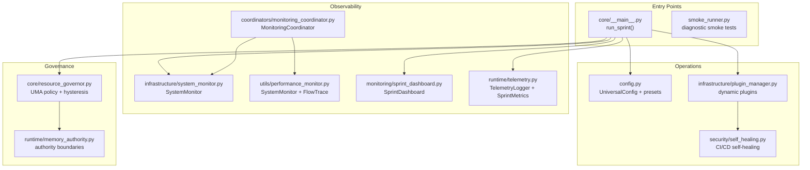
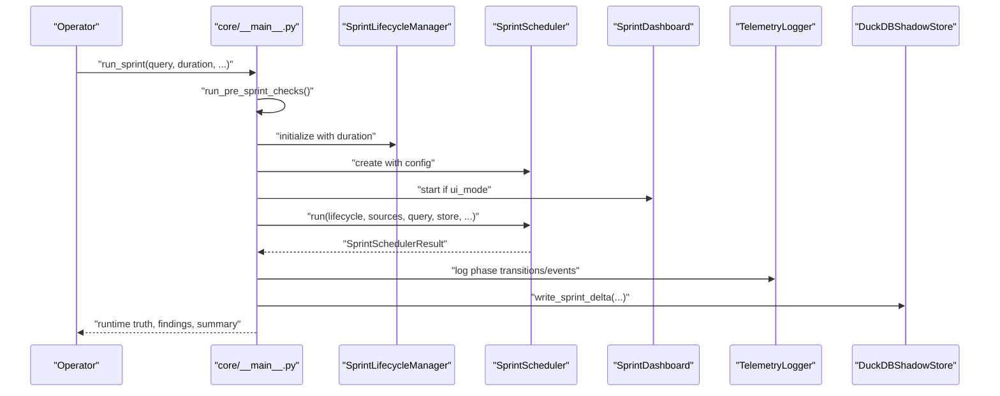
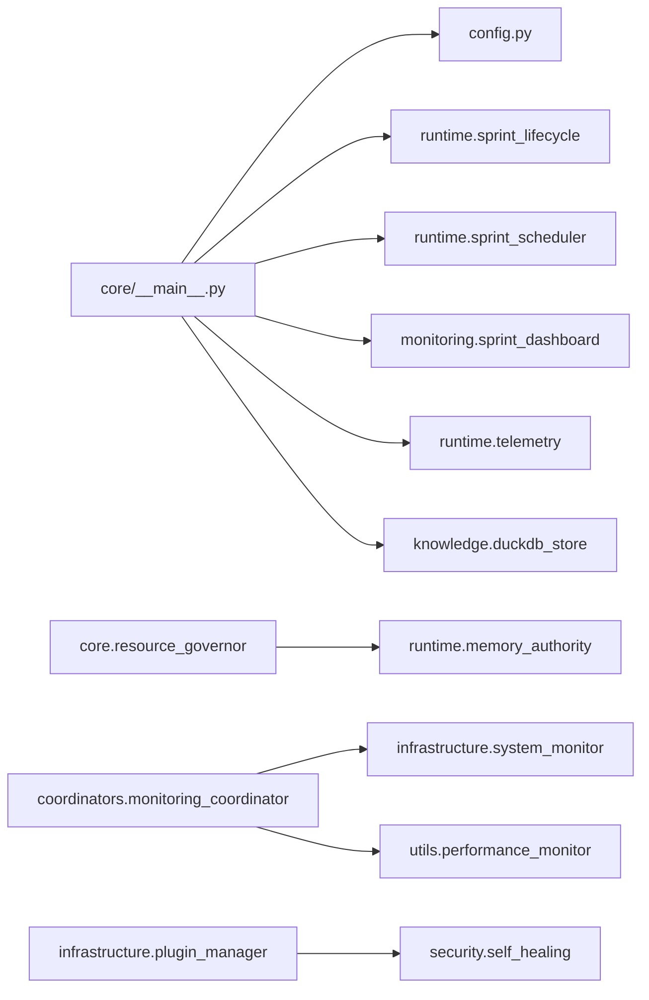

# Deployment and Operations

<cite>
**Referenced Files in This Document**
- [core/__main__.py](file://core/__main__.py)
- [smoke_runner.py](file://smoke_runner.py)
- [config.py](file://config.py)
- [infrastructure/system_monitor.py](file://infrastructure/system_monitor.py)
- [utils/performance_monitor.py](file://utils/performance_monitor.py)
- [monitoring/sprint_dashboard.py](file://monitoring/sprint_dashboard.py)
- [runtime/telemetry.py](file://runtime/telemetry.py)
- [coordinators/monitoring_coordinator.py](file://coordinators/monitoring_coordinator.py)
- [infrastructure/plugin_manager.py](file://infrastructure/plugin_manager.py)
- [security/self_healing.py](file://security/self_healing.py)
- [orchestrator_integration.py](file://orchestrator_integration.py)
- [runtime/memory_authority.py](file://runtime/memory_authority.py)
- [core/resource_governor.py](file://core/resource_governor.py)
- [04B-devops-findings.md](file://.full-review-2026-04-23/04B-devops-findings.md)
</cite>

## Table of Contents
1. [Introduction](#introduction)
2. [Project Structure](#project-structure)
3. [Core Components](#core-components)
4. [Architecture Overview](#architecture-overview)
5. [Detailed Component Analysis](#detailed-component-analysis)
6. [Dependency Analysis](#dependency-analysis)
7. [Performance Considerations](#performance-considerations)
8. [Troubleshooting Guide](#troubleshooting-guide)
9. [Conclusion](#conclusion)
10. [Appendices](#appendices)

## Introduction
This document covers the deployment and operations subsystem of the Universal Research Orchestrator. It explains how production sprints are executed, how monitoring and diagnostics operate, how configuration is managed, and how operational tooling supports maintenance and troubleshooting. It targets both newcomers and experienced operators, providing practical guidance for reliable deployments on M1-class devices and beyond.

## Project Structure
The deployment and operations domain spans several modules:
- Canonical entry points for production sprints
- Configuration management with presets and environment overrides
- System monitoring and telemetry
- Operational dashboards and diagnostics
- Self-healing and plugin management for extensibility
- Resource governance and memory authority boundaries

**Diagram sources**
- [core/__main__.py:320-800](file://core/__main__.py#L320-L800)
- [smoke_runner.py:1-327](file://smoke_runner.py#L1-L327)
- [config.py:228-666](file://config.py#L228-L666)
- [infrastructure/system_monitor.py:40-153](file://infrastructure/system_monitor.py#L40-L153)
- [utils/performance_monitor.py:240-537](file://utils/performance_monitor.py#L240-L537)
- [monitoring/sprint_dashboard.py:66-269](file://monitoring/sprint_dashboard.py#L66-L269)
- [runtime/telemetry.py:107-370](file://runtime/telemetry.py#L107-L370)
- [coordinators/monitoring_coordinator.py:249-707](file://coordinators/monitoring_coordinator.py#L249-L707)
- [infrastructure/plugin_manager.py:91-461](file://infrastructure/plugin_manager.py#L91-L461)
- [security/self_healing.py:210-935](file://security/self_healing.py#L210-L935)
- [core/resource_governor.py:1-304](file://core/resource_governor.py#L1-L304)
- [runtime/memory_authority.py:1-63](file://runtime/memory_authority.py#L1-L63)

**Section sources**
- [core/__main__.py:1-800](file://core/__main__.py#L1-L800)
- [config.py:228-666](file://config.py#L228-L666)

## Core Components
- Canonical sprint owner: run_sprint() orchestrates the full lifecycle, captures runtime truth, writes deltas, and integrates telemetry and dashboards.
- Configuration: UniversalConfig consolidates research, memory, ghost, coordination, agent, and extended security/privacy/stealth settings with M1 presets and environment overrides.
- Observability: SystemMonitor (psutil-based), PerformanceMonitor (async thermal/memory state), SprintDashboard (terminal UI), TelemetryLogger (structured logs), and MonitoringCoordinator (alerting and diagnostics).
- Governance: ResourceGovernor (UMA policy, hysteresis, alarms), with explicit memory authority boundaries.
- Operations: PluginManager (dynamic plugin loading), SelfHealing (CI/CD health and auto-fix), and smoke_runner (diagnostic entry point).

**Section sources**
- [core/__main__.py:320-800](file://core/__main__.py#L320-L800)
- [config.py:228-666](file://config.py#L228-L666)
- [infrastructure/system_monitor.py:40-153](file://infrastructure/system_monitor.py#L40-L153)
- [utils/performance_monitor.py:240-537](file://utils/performance_monitor.py#L240-L537)
- [monitoring/sprint_dashboard.py:66-269](file://monitoring/sprint_dashboard.py#L66-L269)
- [runtime/telemetry.py:107-370](file://runtime/telemetry.py#L107-L370)
- [coordinators/monitoring_coordinator.py:249-707](file://coordinators/monitoring_coordinator.py#L249-L707)
- [infrastructure/plugin_manager.py:91-461](file://infrastructure/plugin_manager.py#L91-L461)
- [security/self_healing.py:210-935](file://security/self_healing.py#L210-L935)
- [core/resource_governor.py:1-304](file://core/resource_governor.py#L1-L304)
- [runtime/memory_authority.py:1-63](file://runtime/memory_authority.py#L1-L63)

## Architecture Overview
The canonical production path is owned by core.__main__.run_sprint(), which:
- Performs pre-flight checks (MLX wired limit, swap/UMA state)
- Initializes stores and lifecycle
- Runs the scheduler with optional dashboard and telemetry
- Writes sprint delta to DuckDB
- Computes runtime truth and exports reports

**Diagram sources**
- [core/__main__.py:320-800](file://core/__main__.py#L320-L800)
- [monitoring/sprint_dashboard.py:66-269](file://monitoring/sprint_dashboard.py#L66-L269)
- [runtime/telemetry.py:107-370](file://runtime/telemetry.py#L107-L370)

**Section sources**
- [core/__main__.py:320-800](file://core/__main__.py#L320-L800)

## Detailed Component Analysis

### Canonical Sprint Execution (core.__main__.run_sprint)
Responsibilities:
- Pre-flight checks (MLX wired limit, swap/UMA state)
- Initialize stores and lifecycle
- Run scheduler with optional dashboard and progress callbacks
- Compute runtime truth and timing metrics
- Write sprint delta to DuckDB
- Export reports and log summaries

Key behaviors:
- Bootstraps pattern matcher registry for canonical pipeline
- Captures pre-sprint UMA state for smoke classification
- Supports aggressive mode with reduced branch timeouts
- Integrates CT log discovery and additive findings
- Produces canonical runtime truth and observed run tuple

Operational parameters:
- query: search query string
- duration_s: requested sprint duration
- export_dir: output directory for reports
- aggressive_mode: reduces branch timeout budget
- ui_mode: enables live terminal dashboard

Returns:
- Void; side-effects include logging, telemetry, and persisted delta

Relationships:
- Depends on config, lifecycle, scheduler, stores, and optional dashboard/telemetry

**Section sources**
- [core/__main__.py:320-800](file://core/__main__.py#L320-L800)

### Configuration Management (config.py)
Roles:
- Centralized configuration with research, memory, ghost, coordination, agent, and extended security/privacy/stealth settings
- M1 8GB optimization presets and environment variable overrides
- Validation and conversion to/from dict/json

Key presets:
- ResearchPresets: QUICK, STANDARD, DEEP, EXTREME, AUTONOMOUS
- M1Presets: memory limits, thermal thresholds, model stacks, concurrency caps

Configuration APIs:
- for_mode(mode, m1_optimized): create preset-configured UniversalConfig
- from_env(): load from environment variables
- update(**kwargs): runtime override
- validate(): return validation issues
- to_dict()/load_config_from_file(): serialization

Operational parameters:
- ResearchMode selection
- Memory limits and thermal thresholds
- Feature flags for layers and engines
- Privacy and stealth toggles

**Section sources**
- [config.py:228-666](file://config.py#L228-L666)

### System Monitoring (infrastructure/system_monitor.py)
Roles:
- Read-only health checks via psutil
- State transitions (healthy, memory_pressure, thermal_throttling, degraded, recovery)
- Callback registration for state change notifications
- Stats collection (CPU, memory, temperatures)

Key parameters:
- memory_threshold (MB)
- thermal_threshold (°C)

Methods:
- get_state(), check_health(), on_state_change(callback), get_stats()

**Section sources**
- [infrastructure/system_monitor.py:40-153](file://infrastructure/system_monitor.py#L40-L153)

### Performance Monitoring (utils/performance_monitor.py)
Roles:
- Async system monitor with thermal/memory pressure states
- Periodic snapshot emission for flow tracing
- Recommendations and throttling suggestions

Key types:
- ThermalState, MemoryPressure, SystemMetrics
- SystemMonitor: background loop, callbacks, throttling, recommendations
- FlowTraceSnapshotEmitter: periodic snapshots when tracing enabled

**Section sources**
- [utils/performance_monitor.py:240-537](file://utils/performance_monitor.py#L240-L537)

### Sprint Dashboard (monitoring/sprint_dashboard.py)
Roles:
- Live terminal dashboard during sprints
- Displays phases, findings, cycles, sources, branch status, governor state, and kill-chain tags
- Fail-safe updates and graceful finish

Public API:
- start(), update(result, phase, elapsed_s), finish(result, elapsed_s)

**Section sources**
- [monitoring/sprint_dashboard.py:66-269](file://monitoring/sprint_dashboard.py#L66-L269)

### Telemetry (runtime/telemetry.py)
Roles:
- Structured logging with session-scoped events
- Phase transitions, named events, and finalization
- Bounded event history (ring buffer)

Key types:
- SprintEvent, TelemetryLogger, SprintMetrics

**Section sources**
- [runtime/telemetry.py:107-370](file://runtime/telemetry.py#L107-L370)

### Monitoring Coordinator (coordinators/monitoring_coordinator.py)
Roles:
- Intelligent routing of monitoring requests
- System-level metrics collection (psutil)
- Alert thresholds and health checks
- Diagnostics engine integration (manual/auto)
- Operation tracking and status retrieval

Key methods:
- get_supported_operations(), handle_request(), perform_health_check()
- set_alert_threshold(), enable_alerts()
- get_current_metrics(), get_metrics_history()
- run_diagnostics(), start_auto_diagnostics(), stop_auto_diagnostics()

**Section sources**
- [coordinators/monitoring_coordinator.py:249-707](file://coordinators/monitoring_coordinator.py#L249-L707)
- [coordinators/monitoring_coordinator.py:1070-1209](file://coordinators/monitoring_coordinator.py#L1070-L1209)

### Plugin Manager (infrastructure/plugin_manager.py)
Roles:
- Dynamic plugin discovery and loading
- Hook registration and lifecycle management
- Hot-reload support
- Statistics and error tracking

Key methods:
- discover_plugins(), load_plugin(), unload_plugin(), reload_plugin()
- register_hook(), get_stats()

**Section sources**
- [infrastructure/plugin_manager.py:91-461](file://infrastructure/plugin_manager.py#L91-L461)

### Self-Healing (security/self_healing.py)
Roles:
- CI/CD self-healing configuration and metrics
- Circuit breakers per component
- Health check intervals and auto-rollback
- Reporting structure with recent health results

Configuration keys:
- self_healing.enabled, health_check_interval, max_concurrent_healings, auto_rollback
- threshnews thresholds for consecutive failures, success rate, response time, resource usage
- component-level configs (code_quality, security_scan, tests, build, deployment)

**Section sources**
- [security/self_healing.py:210-935](file://security/self_healing.py#L210-L935)

### Resource Governance and Memory Authority
- ResourceGovernor: canonical UMA policy, hysteresis, async alarm dispatcher, M1 QoS hints, priority-based reservations
- Memory Authority: explicit boundaries separating sampler, governor, and allocators

**Section sources**
- [core/resource_governor.py:1-304](file://core/resource_governor.py#L1-L304)
- [runtime/memory_authority.py:1-63](file://runtime/memory_authority.py#L1-L63)

## Dependency Analysis
High-level dependencies among core operational components:

**Diagram sources**
- [core/__main__.py:320-800](file://core/__main__.py#L320-L800)
- [config.py:228-666](file://config.py#L228-L666)
- [coordinators/monitoring_coordinator.py:249-707](file://coordinators/monitoring_coordinator.py#L249-L707)
- [infrastructure/system_monitor.py:40-153](file://infrastructure/system_monitor.py#L40-L153)
- [utils/performance_monitor.py:240-537](file://utils/performance_monitor.py#L240-L537)
- [monitoring/sprint_dashboard.py:66-269](file://monitoring/sprint_dashboard.py#L66-L269)
- [runtime/telemetry.py:107-370](file://runtime/telemetry.py#L107-L370)
- [core/resource_governor.py:1-304](file://core/resource_governor.py#L1-L304)
- [runtime/memory_authority.py:1-63](file://runtime/memory_authority.py#L1-L63)
- [infrastructure/plugin_manager.py:91-461](file://infrastructure/plugin_manager.py#L91-L461)
- [security/self_healing.py:210-935](file://security/self_healing.py#L210-L935)

**Section sources**
- [core/__main__.py:320-800](file://core/__main__.py#L320-L800)
- [coordinators/monitoring_coordinator.py:249-707](file://coordinators/monitoring_coordinator.py#L249-L707)

## Performance Considerations
- M1 8GB optimization: presets reduce memory footprint and concurrency; thermal thresholds guide throttling.
- Async monitoring avoids blocking; periodic snapshots are gated by tracing enablement.
- Telemetry is fail-soft and bounded to prevent operational overhead.
- ResourceGovernor applies hysteresis to prevent thrashing and gates I/O-only mode under pressure.
- Dashboard updates are fail-safe to avoid blocking sprints.

[No sources needed since this section provides general guidance]

## Troubleshooting Guide
Common issues and resolutions:
- Hardware-limited smoke: if no cycles run and swap/UMA critical, treat as hardware-limited and free RAM or restart before retrying.
- Public backend degraded: indicates network/TOR/proxy misconfiguration; verify connectivity and proxy settings.
- Feed zero yield: sources may be inaccessible; check source availability (e.g., urlhaus, threatfox).
- High duplicate rate: refine query scope or adjust deduplication parameters.
- Critical thermal/memory states: throttle operations or reduce concurrency; consider cooling or power delivery.

Operational tools:
- MonitoringCoordinator diagnostics: manual and auto modes with optional auto-fix.
- Self-healing: health checks, circuit breakers, and auto-rollback.
- PluginManager: hot-reload and statistics for plugin lifecycle.
- SystemMonitor: immediate health state and callback notifications.
- PerformanceMonitor: recommendations and throttling suggestions.

**Section sources**
- [core/__main__.py:570-800](file://core/__main__.py#L570-L800)
- [coordinators/monitoring_coordinator.py:1070-1209](file://coordinators/monitoring_coordinator.py#L1070-L1209)
- [security/self_healing.py:210-935](file://security/self_healing.py#L210-L935)
- [infrastructure/plugin_manager.py:91-461](file://infrastructure/plugin_manager.py#L91-L461)
- [infrastructure/system_monitor.py:40-153](file://infrastructure/system_monitor.py#L40-L153)
- [utils/performance_monitor.py:240-537](file://utils/performance_monitor.py#L240-L537)

## Conclusion
The deployment and operations subsystem centers on a canonical production path (core.__main__.run_sprint) with robust configuration, observability, governance, and diagnostics. Operators can rely on M1-presets, async monitoring, telemetry, and self-healing to maintain stable operations. The provided tools and patterns enable both safe production runs and efficient troubleshooting.

[No sources needed since this section summarizes without analyzing specific files]

## Appendices

### Production Deployment Best Practices
- Use the canonical entry point for production sprints.
- Configure environment variables for research mode and memory limits.
- Enable UI dashboard for live visibility; ensure fail-safe behavior.
- Monitor thermal/memory states and adjust concurrency accordingly.
- Leverage self-healing for CI/CD resilience and auto-rollback.

**Section sources**
- [core/__main__.py:320-800](file://core/__main__.py#L320-L800)
- [config.py:466-498](file://config.py#L466-L498)
- [monitoring/sprint_dashboard.py:66-269](file://monitoring/sprint_dashboard.py#L66-L269)
- [utils/performance_monitor.py:240-537](file://utils/performance_monitor.py#L240-L537)
- [security/self_healing.py:210-935](file://security/self_healing.py#L210-L935)

### Configuration Options Reference
- ResearchMode: QUICK, STANDARD, DEEP, EXTREME, AUTONOMOUS
- M1Presets: memory_limit_mb, thermal_threshold_c, model stacks, concurrency caps
- Feature flags: enable_knowledge_layer, enable_rag_pipeline, enable_stealth_layer, enable_privacy_layer, enable_deep_research, enable_communication_layer
- Extended configs: security, stealth, privacy, deep_research, communication

**Section sources**
- [config.py:36-117](file://config.py#L36-L117)
- [config.py:228-666](file://config.py#L228-L666)

### Entry Points and Authority
- Canonical: core.__main__.run_sprint()
- Diagnostic: smoke_runner.py
- Alternate: root __main__._run_sprint_mode()

**Section sources**
- [core/__main__.py:1-80](file://core/__main__.py#L1-L80)
- [smoke_runner.py:1-35](file://smoke_runner.py#L1-L35)
- [04B-devops-findings.md:70-105](file://.full-review-2026-04-23/04B-devops-findings.md#L70-L105)