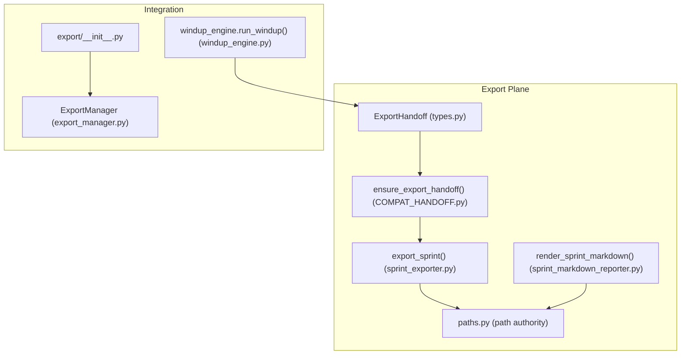
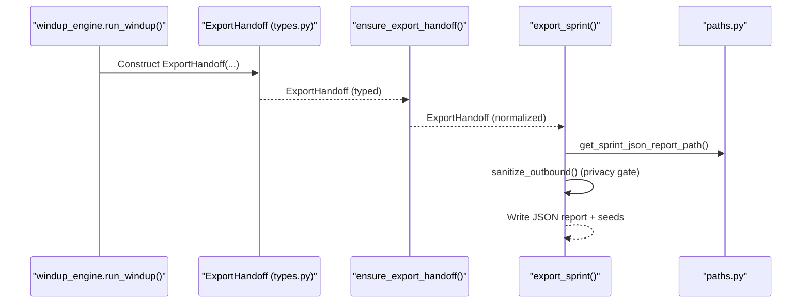
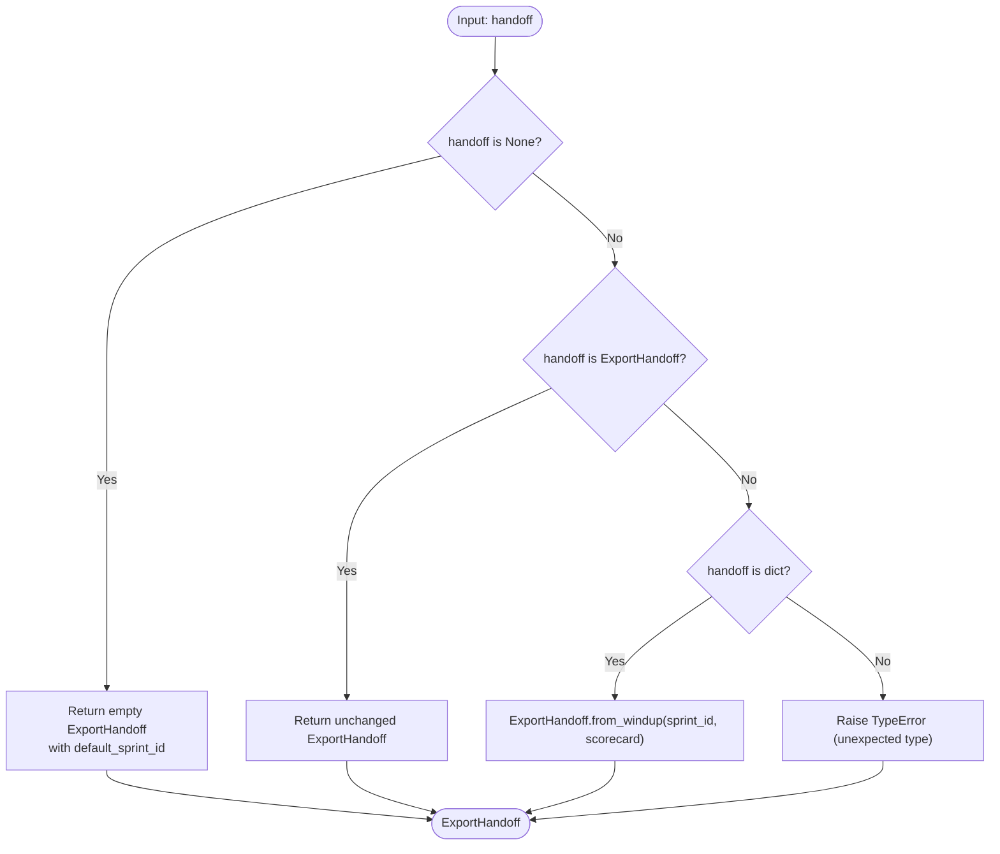
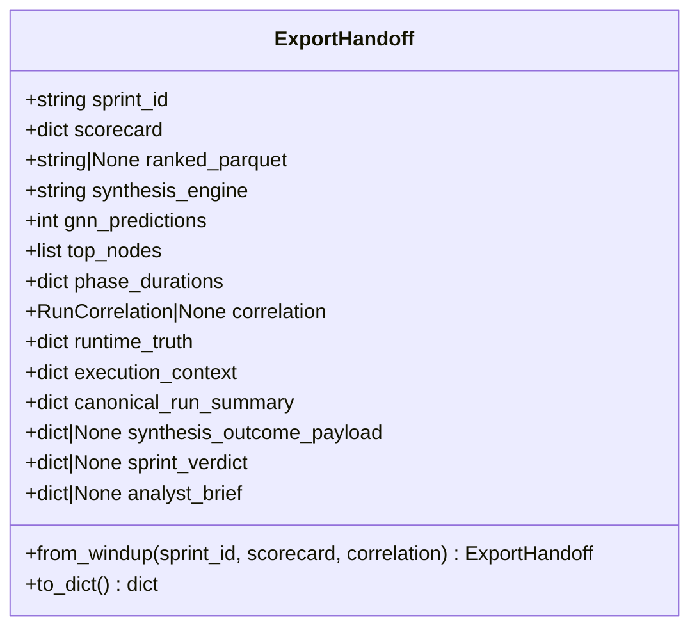
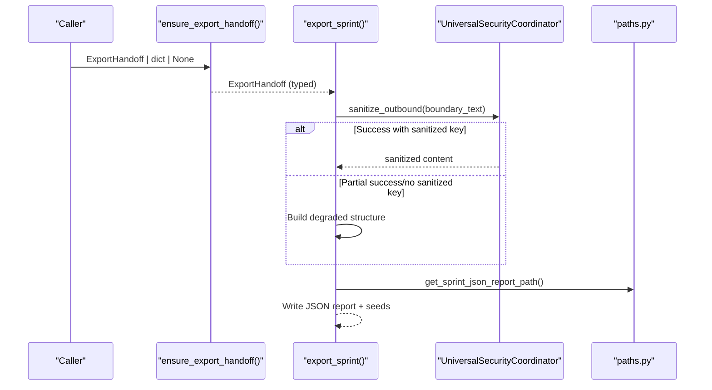
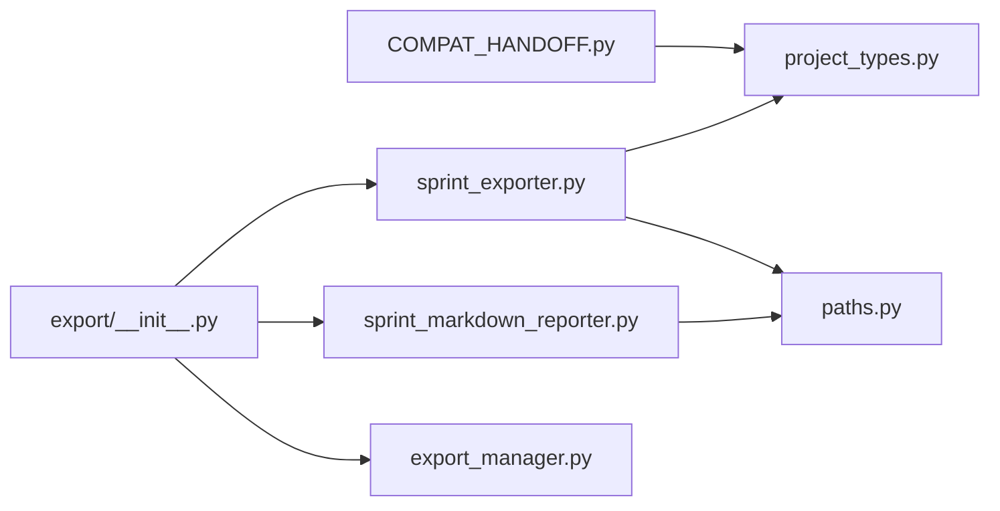

# Data Compatibility

<cite>
**Referenced Files in This Document**
- [COMPAT_HANDOFF.py](file://export/COMPAT_HANDOFF.py)
- [COMPAT_DEBT_LEDGER.md](file://export/COMPAT_DEBT_LEDGER.md)
- [EXPORT_PLANE_MAP.md](file://export/EXPORT_PLANE_MAP.md)
- [sprint_exporter.py](file://export/sprint_exporter.py)
- [sprint_markdown_reporter.py](file://export/sprint_markdown_reporter.py)
- [export_manager.py](file://export/export_manager.py)
- [__init__.py](file://export/__init__.py)
- [project_types.py](file://project_types.py)
- [paths.py](file://paths.py)
- [windup_engine.py](file://runtime/windup_engine.py)
</cite>

## Table of Contents
1. [Introduction](#introduction)
2. [Project Structure](#project-structure)
3. [Core Components](#core-components)
4. [Architecture Overview](#architecture-overview)
5. [Detailed Component Analysis](#detailed-component-analysis)
6. [Dependency Analysis](#dependency-analysis)
7. [Performance Considerations](#performance-considerations)
8. [Troubleshooting Guide](#troubleshooting-guide)
9. [Conclusion](#conclusion)
10. [Appendices](#appendices)

## Introduction
This document describes the data compatibility subsystem responsible for ensuring backward compatibility, enabling export handoff transformations, and managing format migrations across the system. It focuses on the COMPAT_HANDOFF system, version negotiation, and graceful degradation patterns. Practical examples illustrate compatibility layers, fallback mechanisms, and evolution strategies, including integration with external systems and API versioning considerations.

## Project Structure
The data compatibility subsystem resides primarily under the export plane, with dedicated modules for compatibility handoffs, export plane mapping, and path authority. The subsystem interacts with typed data contracts and path management utilities to maintain deterministic outputs and safe fallbacks.

**Diagram sources**
- [COMPAT_HANDOFF.py:25-95](file://export/COMPAT_HANDOFF.py#L25-L95)
- [sprint_exporter.py:144-464](file://export/sprint_exporter.py#L144-L464)
- [sprint_markdown_reporter.py:142-279](file://export/sprint_markdown_reporter.py#L142-L279)
- [project_types.py:1593-1699](file://project_types.py#L1593-L1699)
- [paths.py:293-351](file://paths.py#L293-L351)
- [windup_engine.py:41-200](file://runtime/windup_engine.py#L41-L200)
- [export_manager.py:47-298](file://export/export_manager.py#L47-L298)
- [__init__.py:1-47](file://export/__init__.py#L1-L47)

**Section sources**
- [EXPORT_PLANE_MAP.md:1-189](file://export/EXPORT_PLANE_MAP.md#L1-L189)
- [COMPAT_DEBT_LEDGER.md:1-224](file://export/COMPAT_DEBT_LEDGER.md#L1-L224)

## Core Components
- COMPAT_HANDOFF: Thin adapter that normalizes inputs to a typed ExportHandoff at the consumer boundary, preserving backward compatibility while guiding evolution.
- ExportHandoff: Typed handoff contract carrying structured facts from windup to export, with compatibility scaffolding for dict-based intermediaries.
- export_sprint: Canonical export consumer that accepts typed ExportHandoff, applies sanitization, and writes deterministic artifacts.
- Path authority: Centralized path computation for all export artifacts, enforcing deterministic locations and safe fallbacks.
- Sprint markdown renderer: Pure function renderer for sprint reports, separated from shell orchestration.
- ExportManager: Optional manager for Markdown and HTML graph exports with safety and output controls.

**Section sources**
- [COMPAT_HANDOFF.py:25-95](file://export/COMPAT_HANDOFF.py#L25-L95)
- [project_types.py:1593-1699](file://project_types.py#L1593-L1699)
- [sprint_exporter.py:144-464](file://export/sprint_exporter.py#L144-L464)
- [paths.py:293-351](file://paths.py#L293-L351)
- [sprint_markdown_reporter.py:142-279](file://export/sprint_markdown_reporter.py#L142-L279)
- [export_manager.py:47-298](file://export/export_manager.py#L47-L298)

## Architecture Overview
The compatibility subsystem follows a staged evolution model:
- Producer constructs typed ExportHandoff directly (canonical).
- Consumer normalizes inputs via ensure_export_handoff (compat seams).
- export_sprint consumes typed ExportHandoff, applies sanitization, and writes artifacts to canonical paths.
- Path authority enforces deterministic locations; fallbacks remain safe and deterministic.
- Sprint markdown rendering is delegated to a pure function, separated from shell orchestration.

**Diagram sources**
- [windup_engine.py:41-200](file://runtime/windup_engine.py#L41-L200)
- [project_types.py:1593-1699](file://project_types.py#L1593-L1699)
- [COMPAT_HANDOFF.py:25-95](file://export/COMPAT_HANDOFF.py#L25-L95)
- [sprint_exporter.py:144-464](file://export/sprint_exporter.py#L144-L464)
- [paths.py:312-351](file://paths.py#L312-L351)

## Detailed Component Analysis

### COMPAT_HANDOFF: Thin Adapter and Version Negotiation
- Purpose: Normalize ExportHandoff | dict | None → ExportHandoff at the consumer boundary.
- Compatibility seams:
  - Dict-to-typed conversion via ExportHandoff.from_windup.
  - Defensive None handling returning an empty ExportHandoff with a default sprint_id.
- Removal conditions:
  - from_windup(scorecard) becomes unnecessary when windup_engine returns typed ExportHandoff directly.
  - ensure_export_handoff(None) becomes unnecessary when the canonical producer always passes typed ExportHandoff.
- Evolution guidance: Prefer direct typed construction; retain compat seams only for legacy callers.

**Diagram sources**
- [COMPAT_HANDOFF.py:25-95](file://export/COMPAT_HANDOFF.py#L25-L95)
- [project_types.py:1637-1677](file://project_types.py#L1637-L1677)

**Section sources**
- [COMPAT_HANDOFF.py:25-95](file://export/COMPAT_HANDOFF.py#L25-L95)
- [COMPAT_DEBT_LEDGER.md:116-151](file://export/COMPAT_DEBT_LEDGER.md#L116-L151)
- [EXPORT_PLANE_MAP.md:76-118](file://export/EXPORT_PLANE_MAP.md#L76-L118)

### ExportHandoff: Typed Handoff Contract and Migration
- Role: Canonical typed contract wrapping existing scorecard dict and evolving toward structured windup results.
- Fields: sprint_id, scorecard, ranked_parquet, synthesis_engine, gnn_predictions, top_nodes, phase_durations, correlation, runtime_truth, execution_context, canonical_run_summary, synthesis_outcome_payload, sprint_verdict, analyst_brief.
- from_windup: Compatibility-only classmethod extracting fields from scorecard dict; canonical producer path constructs ExportHandoff(...) directly.
- Migration path: Replace scorecard with structured WindupResult; evolve top_nodes population to bypass scorecard intermediate.

**Diagram sources**
- [project_types.py:1593-1699](file://project_types.py#L1593-L1699)

**Section sources**
- [project_types.py:1593-1699](file://project_types.py#L1593-L1699)
- [COMPAT_DEBT_LEDGER.md:116-151](file://export/COMPAT_DEBT_LEDGER.md#L116-L151)
- [EXPORT_PLANE_MAP.md:76-118](file://export/EXPORT_PLANE_MAP.md#L76-L118)

### export_sprint: Consumer, Sanitization, and Graceful Degradation
- Input: store, ExportHandoff | dict | None (compat seams preserved).
- Typed contract: Canonical input is ExportHandoff; ensure_export_handoff normalizes at the boundary.
- Sanitization: Privacy gate applies sanitize_outbound with graceful degradation when sanitization fails or produces truncated output.
- Seed generation: Uses ExportHandoff.top_nodes; fallback to store.get_top_seed_nodes() when empty (store-facing seam).
- Deterministic outputs: Uses paths.py helpers for canonical JSON and seeds paths; writes operator brief and derived fields.

**Diagram sources**
- [COMPAT_HANDOFF.py:25-95](file://export/COMPAT_HANDOFF.py#L25-L95)
- [sprint_exporter.py:144-464](file://export/sprint_exporter.py#L144-L464)
- [paths.py:312-351](file://paths.py#L312-L351)

**Section sources**
- [sprint_exporter.py:144-464](file://export/sprint_exporter.py#L144-L464)
- [COMPAT_DEBT_LEDGER.md:191-224](file://export/COMPAT_DEBT_LEDGER.md#L191-L224)
- [EXPORT_PLANE_MAP.md:33-73](file://export/EXPORT_PLANE_MAP.md#L33-L73)

### Path Authority and Deterministic Outputs
- Canonical path computation: paths.get_sprint_report_path(), paths.get_sprint_json_report_path(), paths.get_sprint_next_seeds_path().
- Ownership separation: paths.py owns path semantics; shell orchestrates writes.
- Safety: Deterministic locations under ~/.hledac/reports; fallbacks remain safe and deterministic.

**Section sources**
- [paths.py:293-351](file://paths.py#L293-L351)
- [EXPORT_PLANE_MAP.md:128-136](file://export/EXPORT_PLANE_MAP.md#L128-L136)

### Sprint Markdown Renderer: Pure Function Separation
- Role: Pure function rendering deterministic markdown from report + scorecard; no side effects or graph dependencies.
- Delegation: Shell delegates orchestration to canonical renderer in sprint_markdown_reporter.py.

**Section sources**
- [sprint_markdown_reporter.py:142-279](file://export/sprint_markdown_reporter.py#L142-L279)
- [EXPORT_PLANE_MAP.md:54-73](file://export/EXPORT_PLANE_MAP.md#L54-L73)

### ExportManager: Optional Export Pipeline
- Features: Obsidian-compatible Markdown export and interactive HTML graph export via pyvis.
- Safety: Filters sensitive fields, restricts output to a controlled directory, and validates paths.

**Section sources**
- [export_manager.py:47-298](file://export/export_manager.py#L47-L298)

## Dependency Analysis
The compatibility subsystem exhibits low coupling and high cohesion:
- COMPAT_HANDOFF depends on ExportHandoff and ensures typed inputs.
- export_sprint depends on paths.py for deterministic paths and on security coordinator for sanitization.
- Path authority is centralized in paths.py; all consumers depend on it for canonical locations.
- Sprint markdown renderer is independent of store and scheduler.

**Diagram sources**
- [COMPAT_HANDOFF.py:25-95](file://export/COMPAT_HANDOFF.py#L25-L95)
- [project_types.py:1593-1699](file://project_types.py#L1593-L1699)
- [sprint_exporter.py:144-464](file://export/sprint_exporter.py#L144-L464)
- [paths.py:293-351](file://paths.py#L293-L351)
- [sprint_markdown_reporter.py:142-279](file://export/sprint_markdown_reporter.py#L142-L279)
- [__init__.py:1-47](file://export/__init__.py#L1-L47)
- [export_manager.py:47-298](file://export/export_manager.py#L47-L298)

**Section sources**
- [__init__.py:1-47](file://export/__init__.py#L1-L47)
- [EXPORT_PLANE_MAP.md:1-189](file://export/EXPORT_PLANE_MAP.md#L1-L189)

## Performance Considerations
- Deterministic outputs: Centralized path computation avoids redundant recomputation and reduces I/O overhead.
- Graceful degradation: Sanitization failures and truncated content are handled without crashing the export pipeline.
- Bounded outputs: Seed generation caps total seeds and sorts by priority to prevent combinatorial explosions.
- Pure renderers: Separating rendering logic eliminates side effects and improves testability and performance predictability.

[No sources needed since this section provides general guidance]

## Troubleshooting Guide
Common issues and remedies:
- Unexpected input types to ensure_export_handoff: The adapter raises a TypeError for non-ExportHandoff/dict/None inputs; ensure callers pass typed ExportHandoff or a compatible dict.
- Sanitization failures: export_sprint builds a bounded degraded structure when sanitize_outbound fails or returns truncated content; verify privacy gate configuration and log messages.
- Empty top_nodes: export_sprint falls back to store.get_top_seed_nodes(); confirm store implementation and availability.
- Path resolution errors: Use paths.py helpers to compute canonical paths; ensure output directories exist and are writable.

**Section sources**
- [COMPAT_HANDOFF.py:91-95](file://export/COMPAT_HANDOFF.py#L91-L95)
- [sprint_exporter.py:228-238](file://export/sprint_exporter.py#L228-L238)
- [sprint_exporter.py:295-307](file://export/sprint_exporter.py#L295-L307)
- [paths.py:293-351](file://paths.py#L293-L351)

## Conclusion
The data compatibility subsystem employs thin adapters, typed contracts, and centralized path authority to ensure backward compatibility, safe evolution, and deterministic outputs. Compatibility seams are intentionally scoped and documented with explicit removal conditions. Consumers apply sanitization and graceful degradation to maintain resilience. The separation of concerns—typed handoffs, pure renderers, and canonical paths—supports long-term maintainability and integration with external systems.

[No sources needed since this section summarizes without analyzing specific files]

## Appendices

### Practical Examples and Evolution Strategies
- Backward compatibility: Legacy callers passing scorecard dicts are normalized to ExportHandoff via ensure_export_handoff; future removal requires updating all callers to construct ExportHandoff directly.
- Fallback mechanisms: When top_nodes are empty, export_sprint consults store.get_top_seed_nodes(); this seam will be removed when all paths populate ExportHandoff.top_nodes.
- Evolution strategies: Replace dict intermediaries with structured WindupResult; migrate from windup_engine.run_windup() returning dicts to returning typed ExportHandoff directly.

**Section sources**
- [COMPAT_DEBT_LEDGER.md:116-151](file://export/COMPAT_DEBT_LEDGER.md#L116-L151)
- [EXPORT_PLANE_MAP.md:76-118](file://export/EXPORT_PLANE_MAP.md#L76-L118)
- [sprint_exporter.py:295-307](file://export/sprint_exporter.py#L295-L307)

### API Versioning and Integration Notes
- Version negotiation: The system uses typed contracts and compatibility adapters rather than explicit version headers; compatibility is maintained through ensure_export_handoff and ExportHandoff.from_windup.
- Integration with external systems: Deterministic paths and sanitized outputs enable reliable ingestion by external systems. ExportManager provides optional Markdown and HTML exports with safety controls.

**Section sources**
- [COMPAT_HANDOFF.py:25-95](file://export/COMPAT_HANDOFF.py#L25-L95)
- [project_types.py:1593-1699](file://project_types.py#L1593-L1699)
- [export_manager.py:47-298](file://export/export_manager.py#L47-L298)