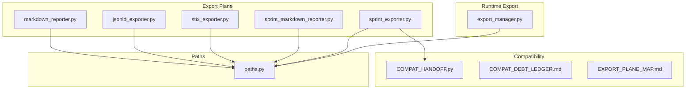
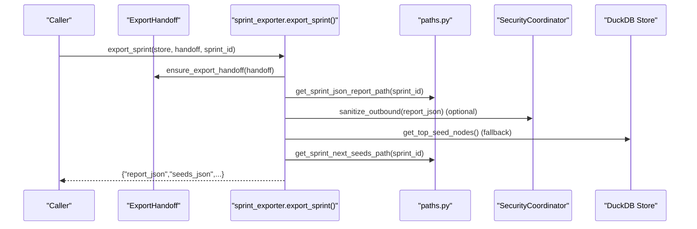
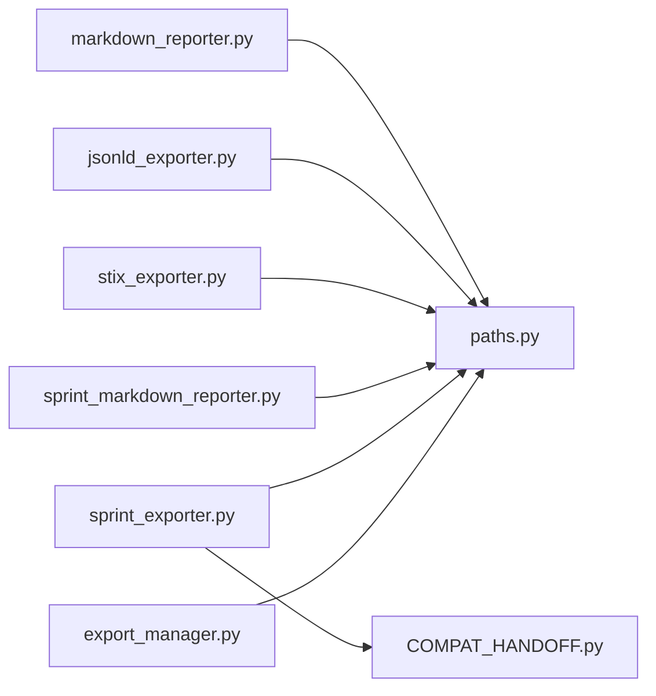

# Export Configuration and Templates

<cite>
**Referenced Files in This Document**
- [export/__init__.py](file://export/__init__.py)
- [export/export_manager.py](file://export/export_manager.py)
- [export/markdown_reporter.py](file://export/markdown_reporter.py)
- [export/jsonld_exporter.py](file://export/jsonld_exporter.py)
- [export/stix_exporter.py](file://export/stix_exporter.py)
- [export/sprint_exporter.py](file://export/sprint_exporter.py)
- [export/sprint_markdown_reporter.py](file://export/sprint_markdown_reporter.py)
- [export/COMPAT_DEBT_LEDGER.md](file://export/COMPAT_DEBT_LEDGER.md)
- [export/EXPORT_PLANE_MAP.md](file://export/EXPORT_PLANE_MAP.md)
- [export/COMPAT_HANDOFF.py](file://export/COMPAT_HANDOFF.py)
- [paths.py](file://paths.py)
</cite>

## Table of Contents
1. [Introduction](#introduction)
2. [Project Structure](#project-structure)
3. [Core Components](#core-components)
4. [Architecture Overview](#architecture-overview)
5. [Detailed Component Analysis](#detailed-component-analysis)
6. [Dependency Analysis](#dependency-analysis)
7. [Performance Considerations](#performance-considerations)
8. [Troubleshooting Guide](#troubleshooting-guide)
9. [Conclusion](#conclusion)
10. [Appendices](#appendices)

## Introduction
This document explains the export configuration system and template management for diagnostic and sprint intelligence outputs. It covers:
- Compatibility debt ledger for export format evolution
- Export plane mapping across output targets (Markdown, JSON-LD, STIX, HTML graph)
- Template customization options and deterministic rendering
- Configuration file formats, environment variables, and runtime parameter overrides
- Examples of custom export templates, format-specific configurations, and batch processing setups
- Migration strategies, backward compatibility maintenance, and template inheritance patterns
- CI/CD integration, automated export workflows, and quality assurance testing

## Project Structure
The export subsystem is organized around a clean separation of concerns:
- Export plane: pure, deterministic renderers for diagnostics and sprint intelligence
- Export manager: runtime Markdown and HTML graph export with safety controls
- Path authority: centralized path computation for deterministic artifact locations
- Compatibility seams: typed handoff and compat adapters for format evolution

**Diagram sources**
- [export/markdown_reporter.py:1-487](file://export/markdown_reporter.py#L1-L487)
- [export/jsonld_exporter.py:1-501](file://export/jsonld_exporter.py#L1-L501)
- [export/stix_exporter.py:1-800](file://export/stix_exporter.py#L1-L800)
- [export/sprint_markdown_reporter.py:1-889](file://export/sprint_markdown_reporter.py#L1-L889)
- [export/sprint_exporter.py:1-800](file://export/sprint_exporter.py#L1-L800)
- [export/export_manager.py:1-300](file://export/export_manager.py#L1-L300)
- [export/COMPAT_HANDOFF.py:1-95](file://export/COMPAT_HANDOFF.py#L1-L95)
- [export/COMPAT_DEBT_LEDGER.md:1-224](file://export/COMPAT_DEBT_LEDGER.md#L1-L224)
- [export/EXPORT_PLANE_MAP.md:1-189](file://export/EXPORT_PLANE_MAP.md#L1-L189)
- [paths.py:326-384](file://paths.py#L326-L384)

**Section sources**
- [export/__init__.py:1-47](file://export/__init__.py#L1-L47)
- [export/EXPORT_PLANE_MAP.md:1-189](file://export/EXPORT_PLANE_MAP.md#L1-L189)

## Core Components
- Deterministic diagnostic exporters (Markdown, JSON-LD, STIX) produce stable, side-effect-free outputs
- Sprint exporters generate JSON reports, next-seed tasks, and operator briefs
- Export manager handles runtime Markdown and HTML graph exports with security and path validation
- Path authority centralizes artifact locations for deterministic reproducibility
- Compatibility adapters maintain backward compatibility while evolving to typed handoffs

Key responsibilities:
- Normalization and deterministic rendering for all formats
- Safe path handling and output directory enforcement
- Typed handoff consumption with compat adapters
- Canonical path computation for all export artifacts

**Section sources**
- [export/markdown_reporter.py:65-82](file://export/markdown_reporter.py#L65-L82)
- [export/jsonld_exporter.py:131-147](file://export/jsonld_exporter.py#L131-L147)
- [export/stix_exporter.py:184-197](file://export/stix_exporter.py#L184-L197)
- [export/sprint_exporter.py:156-556](file://export/sprint_exporter.py#L156-L556)
- [export/export_manager.py:49-300](file://export/export_manager.py#L49-L300)
- [paths.py:326-384](file://paths.py#L326-L384)

## Architecture Overview
The export architecture separates concerns across planes and enforces deterministic, secure, and backward-compatible behavior.

**Diagram sources**
- [export/sprint_exporter.py:156-556](file://export/sprint_exporter.py#L156-L556)
- [export/COMPAT_HANDOFF.py:25-95](file://export/COMPAT_HANDOFF.py#L25-L95)
- [paths.py:345-384](file://paths.py#L345-L384)

**Section sources**
- [export/EXPORT_PLANE_MAP.md:33-52](file://export/EXPORT_PLANE_MAP.md#L33-L52)
- [export/COMPAT_DEBT_LEDGER.md:116-151](file://export/COMPAT_DEBT_LEDGER.md#L116-L151)

## Detailed Component Analysis

### Deterministic Diagnostic Exporters
- Markdown reporter: renders executive summaries, runtime truth, signal funnel, store rejection traces, per-source health, root cause, recommendations, and machine-readable summaries
- JSON-LD exporter: builds structured diagnostic reports with schema.org and ghost namespace contexts
- STIX exporter: produces metadata-safe diagnostic bundles and upgradeable CTI bundles with indicators and identities

Template customization options:
- Markdown sections are ordered and rendered deterministically; customization occurs through input normalization and section builders
- JSON-LD and STIX exporters embed canonical labels and recommendations; customization is controlled via input normalization and context definitions

Format-specific configurations:
- Markdown: YAML front matter with title, date, sources, tags; findings rendered as bullet lists
- JSON-LD: @context with ghost namespace; structured fields for run metadata, signal funnel, rejection traces, runtime truth, and per-source health
- STIX: diagnostic note-like objects for metadata-safe export; CTI upgrade path with indicators, identities, observed-data, and reports

**Section sources**
- [export/markdown_reporter.py:389-425](file://export/markdown_reporter.py#L389-L425)
- [export/jsonld_exporter.py:280-325](file://export/jsonld_exporter.py#L280-L325)
- [export/stix_exporter.py:249-303](file://export/stix_exporter.py#L249-L303)

### Sprint Export System
- JSON report generation with product value summary, analyst brief, canonical run summary, runtime truth, acquisition truth, and capability synthesis
- Next-seed generation from top nodes with category-aware derivation (IOC follow-up, query suggestions, source revisit, low signal recommendations)
- Operator brief generation from derived truth surfaces (branch value, sprint trend, source leaderboard, correlation, research depth)
- Security sanitization with privacy gates and fail-soft degradation

Template customization options:
- Product value summary shapes next-seed derivation and operator brief content
- Capability synthesis and analyst brief influence seed categorization and recommendations
- Export modes control enrichment layers (slim vs full)

**Section sources**
- [export/sprint_exporter.py:156-556](file://export/sprint_exporter.py#L156-L556)
- [export/sprint_markdown_reporter.py:144-282](file://export/sprint_markdown_reporter.py#L144-L282)

### Export Manager (Runtime Markdown and HTML Graph)
- Ensures output directory safety and deterministic file naming
- Renders Markdown reports with YAML front matter and findings
- Exports interactive HTML graphs via pyvis with color-coded entity types
- Filters sensitive metadata and findings before writing

Template customization options:
- Custom metadata fields are supported (filtered for sensitive content)
- Finding lists are limited and rendered deterministically
- HTML graph color scheme and node/edge rendering are configurable internally

**Section sources**
- [export/export_manager.py:49-300](file://export/export_manager.py#L49-L300)

### Path Authority and Artifact Locations
- Canonical path computation for diagnostic reports, sprint reports, and next-seed artifacts
- Deterministic locations under ~/.hledac/reports with consistent naming conventions
- Environment variable overrides for export roots and runtime directories

**Section sources**
- [paths.py:326-384](file://paths.py#L326-L384)

### Compatibility Debt Ledger and Handoff Evolution
- Typed ExportHandoff as the canonical producer-side handoff
- Compatibility adapters preserve backward compatibility for dict and None inputs
- Debt ledger documents resolved and accepted compatibility seams with removal conditions

Migration strategies:
- Prefer typed ExportHandoff over dict inputs
- Remove compat seams when producer paths consistently supply typed handoffs
- Maintain backward compatibility until removal conditions are met

**Section sources**
- [export/COMPAT_HANDOFF.py:25-95](file://export/COMPAT_HANDOFF.py#L25-L95)
- [export/COMPAT_DEBT_LEDGER.md:116-151](file://export/COMPAT_DEBT_LEDGER.md#L116-L151)

## Dependency Analysis
The export system exhibits low coupling and high cohesion:
- Exporters depend only on normalization and path utilities
- Export manager depends on safe rendering and path utilities
- Compatibility adapters isolate evolution from consumers
- Path authority centralizes cross-cutting concerns

**Diagram sources**
- [export/markdown_reporter.py:431-487](file://export/markdown_reporter.py#L431-L487)
- [export/jsonld_exporter.py:343-396](file://export/jsonld_exporter.py#L343-L396)
- [export/stix_exporter.py:349-396](file://export/stix_exporter.py#L349-L396)
- [export/sprint_markdown_reporter.py:144-282](file://export/sprint_markdown_reporter.py#L144-L282)
- [export/sprint_exporter.py:156-556](file://export/sprint_exporter.py#L156-L556)
- [export/COMPAT_HANDOFF.py:25-95](file://export/COMPAT_HANDOFF.py#L25-L95)
- [paths.py:326-384](file://paths.py#L326-L384)

**Section sources**
- [export/__init__.py:1-47](file://export/__init__.py#L1-L47)

## Performance Considerations
- Deterministic rendering avoids expensive operations; JSON and STIX outputs are sorted and compact
- Zstandard compression for transient artifacts reduces I/O overhead
- Bounded outputs limit memory and CPU usage (e.g., max seeds, max findings, max chains)
- Async operations for enrichment (evidence chains, graph annotations) are gated by export mode

[No sources needed since this section provides general guidance]

## Troubleshooting Guide
Common issues and resolutions:
- Export path escaping: ensure paths resolve within the configured output directory
- Privacy sanitization failures: degraded export structure is written when sanitization fails
- Partial export artifacts: transient JSON and zstd sidecars are written for recovery
- Missing top nodes: fallback to store-facing seam for seed generation

**Section sources**
- [export/export_manager.py:71-88](file://export/export_manager.py#L71-L88)
- [export/sprint_exporter.py:135-153](file://export/sprint_exporter.py#L135-L153)
- [export/sprint_exporter.py:263-284](file://export/sprint_exporter.py#L263-L284)

## Conclusion
The export configuration system emphasizes deterministic, secure, and backward-compatible rendering across multiple formats. The path authority, compatibility adapters, and typed handoffs ensure smooth evolution while maintaining reproducibility and safety. Template customization is achieved through input normalization and section builders, with environment variables and runtime parameters controlling output locations and enrichment levels.

[No sources needed since this section summarizes without analyzing specific files]

## Appendices

### Configuration Options and Environment Variables
- GHOST_EXPORT_DIR: overrides diagnostic export directory
- GHOST_RAMDISK: selects active ramdisk root for runtime artifacts
- GHOST_LMDB_MAX_SIZE_MB: sets LMDB map size for embedded stores
- HLEDAC_SPRINT_STORE: sets persistent sprint store root

**Section sources**
- [paths.py:116-146](file://paths.py#L116-L146)
- [paths.py:174-205](file://paths.py#L174-L205)
- [paths.py:302-304](file://paths.py#L302-L304)

### Example Workflows and Batch Processing
- Deterministic diagnostic export: render to markdown or JSON-LD using provided functions; write to canonical paths
- Sprint export: construct ExportHandoff, call export_sprint with desired mode; seeds and report colocated
- Batch processing: iterate over multiple runs or sprints, leveraging deterministic filenames and path helpers

**Section sources**
- [export/markdown_reporter.py:431-487](file://export/markdown_reporter.py#L431-L487)
- [export/jsonld_exporter.py:343-396](file://export/jsonld_exporter.py#L343-L396)
- [export/sprint_exporter.py:156-556](file://export/sprint_exporter.py#L156-L556)
- [paths.py:345-384](file://paths.py#L345-L384)

### CI/CD Integration and QA Testing
- Use canonical path helpers to ensure deterministic artifact locations
- Gate heavy enrichment (evidence chains, hypothesis engine) behind export mode flags
- Validate export outputs with unit tests that compare normalized structures and deterministic ordering
- Monitor sanitization logs and degrade gracefully when privacy gates fail

[No sources needed since this section provides general guidance]