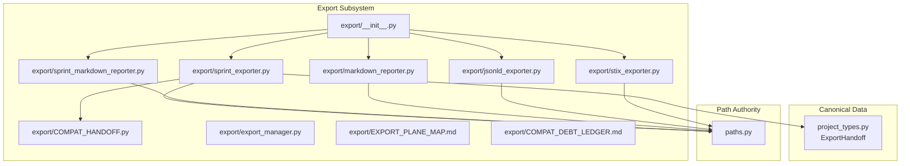
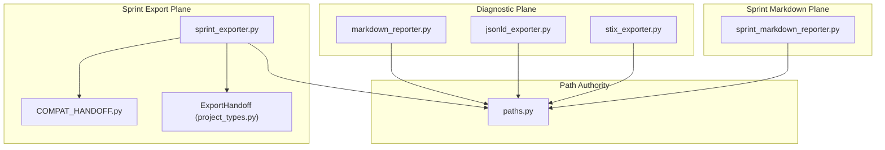
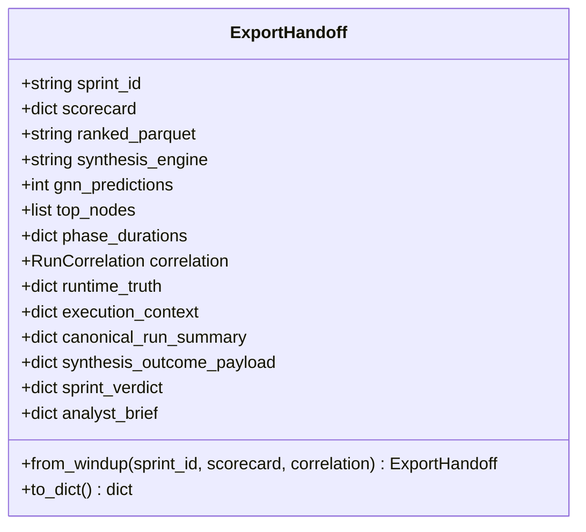
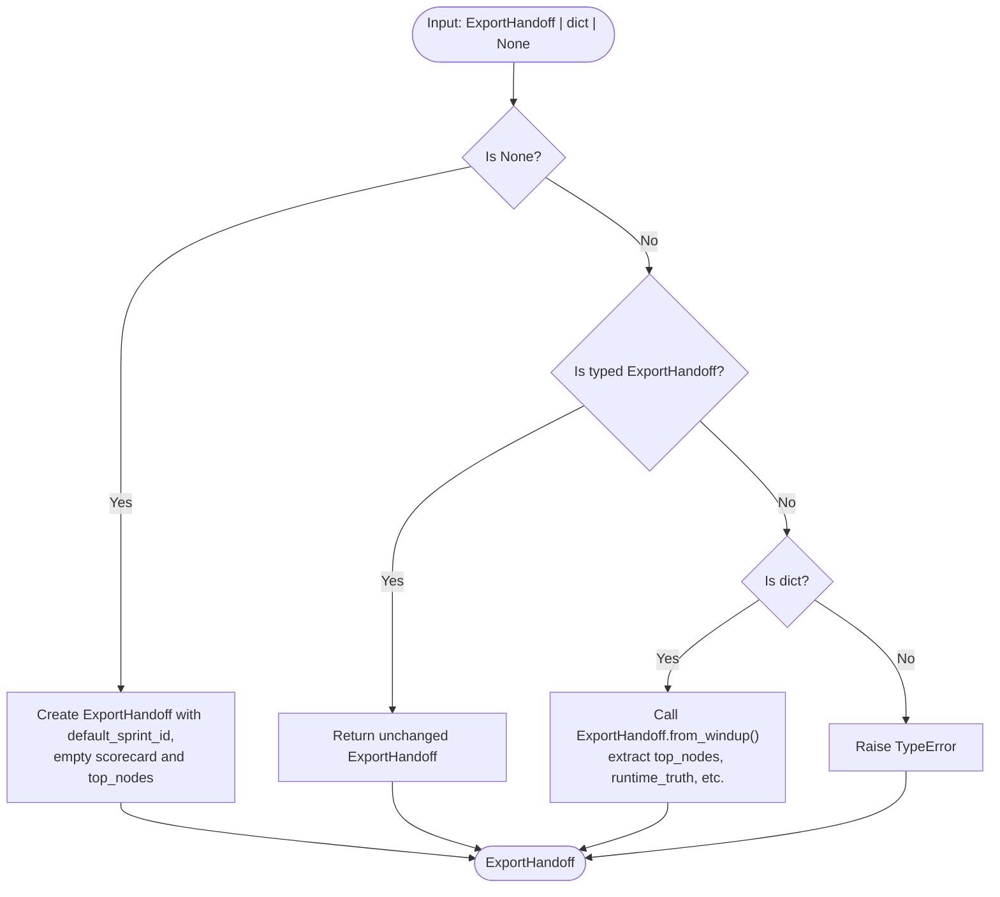
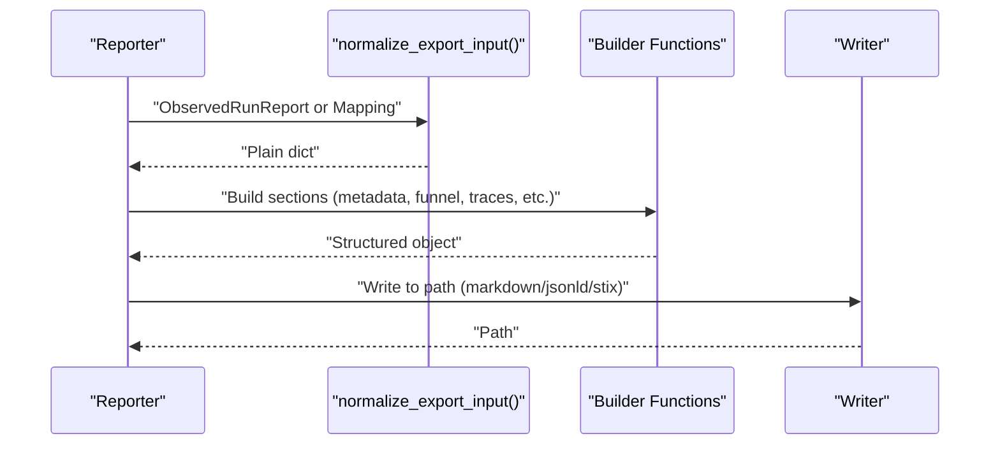
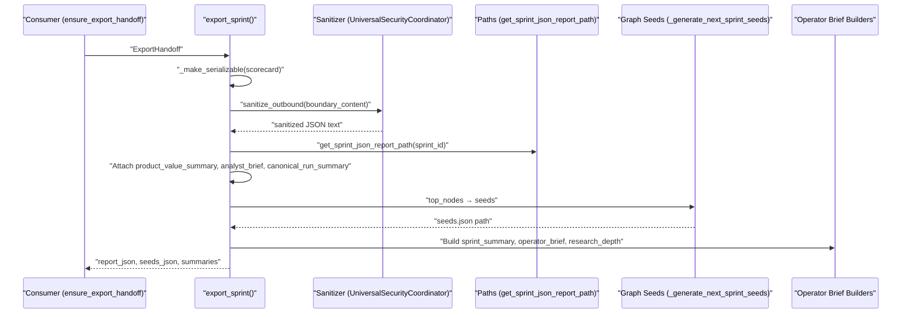
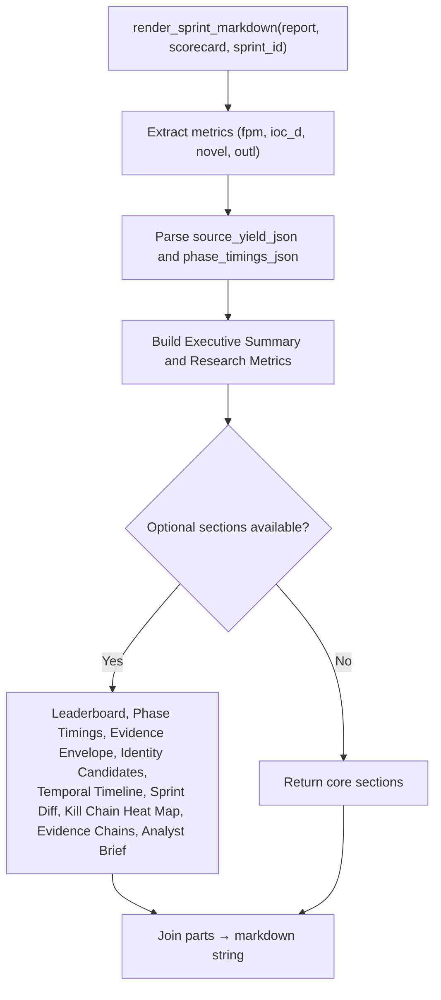
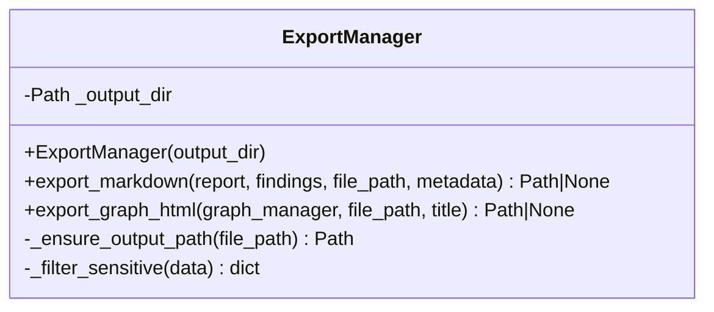
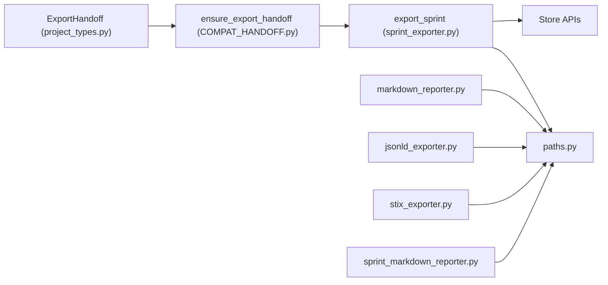

# Export Framework

<cite>
**Referenced Files in This Document**
- [export/__init__.py](file://export/__init__.py)
- [export/export_manager.py](file://export/export_manager.py)
- [export/COMPAT_HANDOFF.py](file://export/COMPAT_HANDOFF.py)
- [export/EXPORT_PLANE_MAP.md](file://export/EXPORT_PLANE_MAP.md)
- [export/COMPAT_DEBT_LEDGER.md](file://export/COMPAT_DEBT_LEDGER.md)
- [export/markdown_reporter.py](file://export/markdown_reporter.py)
- [export/jsonld_exporter.py](file://export/jsonld_exporter.py)
- [export/stix_exporter.py](file://export/stix_exporter.py)
- [export/sprint_exporter.py](file://export/sprint_exporter.py)
- [export/sprint_markdown_reporter.py](file://export/sprint_markdown_reporter.py)
- [project_types.py](file://project_types.py)
- [paths.py](file://paths.py)
</cite>

## Table of Contents
1. [Introduction](#introduction)
2. [Project Structure](#project-structure)
3. [Core Components](#core-components)
4. [Architecture Overview](#architecture-overview)
5. [Detailed Component Analysis](#detailed-component-analysis)
6. [Dependency Analysis](#dependency-analysis)
7. [Performance Considerations](#performance-considerations)
8. [Troubleshooting Guide](#troubleshooting-guide)
9. [Conclusion](#conclusion)
10. [Appendices](#appendices)

## Introduction
This document describes the export framework subsystem responsible for generating diagnostic and sprint artifacts in deterministic, side-effect-free forms suitable for downstream systems and operators. It covers the export architecture, handoff mechanisms, canonical data structures, compatibility layers, and the pipeline stages from sanitization to artifact generation. Practical examples, error handling strategies, and performance optimization techniques are included, along with the relationships between export components and other system layers.

## Project Structure
The export subsystem is organized into distinct planes and modules:
- Diagnostic export plane: pure, deterministic renderers for markdown, JSON-LD, and STIX 2.1.
- Sprint export plane: JSON report and next-seed generation with sanitization and enrichment.
- Sprint markdown renderer plane: canonical pure renderer for sprint reports.
- Compatibility and handoff: typed ExportHandoff and compat adapters ensuring backward compatibility.
- Path authority: centralized path computation for deterministic artifact locations.

**Diagram sources**
- [export/__init__.py:1-47](file://export/__init__.py#L1-L47)
- [export/markdown_reporter.py:1-474](file://export/markdown_reporter.py#L1-L474)
- [export/jsonld_exporter.py:1-505](file://export/jsonld_exporter.py#L1-L505)
- [export/stix_exporter.py:1-800](file://export/stix_exporter.py#L1-L800)
- [export/sprint_exporter.py:1-800](file://export/sprint_exporter.py#L1-L800)
- [export/sprint_markdown_reporter.py:1-833](file://export/sprint_markdown_reporter.py#L1-L833)
- [export/COMPAT_HANDOFF.py:1-95](file://export/COMPAT_HANDOFF.py#L1-L95)
- [export/export_manager.py:1-298](file://export/export_manager.py#L1-L298)
- [export/EXPORT_PLANE_MAP.md:1-189](file://export/EXPORT_PLANE_MAP.md#L1-L189)
- [export/COMPAT_DEBT_LEDGER.md:1-224](file://export/COMPAT_DEBT_LEDGER.md#L1-L224)
- [project_types.py:1593-1699](file://project_types.py#L1593-L1699)
- [paths.py:1-200](file://paths.py#L1-L200)

**Section sources**
- [export/__init__.py:1-47](file://export/__init__.py#L1-L47)
- [export/EXPORT_PLANE_MAP.md:1-189](file://export/EXPORT_PLANE_MAP.md#L1-L189)
- [export/COMPAT_DEBT_LEDGER.md:1-224](file://export/COMPAT_DEBT_LEDGER.md#L1-L224)

## Core Components
- ExportHandoff: typed handoff container carrying the canonical scorecard, runtime truths, and top graph nodes for export consumption.
- Diagnostic exporters: pure renderers for markdown, JSON-LD, and STIX 2.1.
- Sprint exporter: JSON report writer, next-seed generator, and enrichment aggregator.
- Sprint markdown renderer: pure renderer for sprint-level markdown with derived sections.
- Compatibility adapter: ensures inputs to export consumers are normalized to ExportHandoff.
- Export manager: filesystem writer for markdown and interactive HTML graph outputs.
- Path authority: deterministic path computation for all exported artifacts.

Key responsibilities:
- Deterministic, side-effect-free transformations for diagnostics.
- Privacy-safe sanitization at boundaries for sensitive data.
- Enrichment from store-backed sources and derived signals.
- Strict path semantics and deterministic filenames.

**Section sources**
- [project_types.py:1593-1699](file://project_types.py#L1593-L1699)
- [export/markdown_reporter.py:1-474](file://export/markdown_reporter.py#L1-L474)
- [export/jsonld_exporter.py:1-505](file://export/jsonld_exporter.py#L1-L505)
- [export/stix_exporter.py:1-800](file://export/stix_exporter.py#L1-L800)
- [export/sprint_exporter.py:1-800](file://export/sprint_exporter.py#L1-L800)
- [export/sprint_markdown_reporter.py:1-833](file://export/sprint_markdown_reporter.py#L1-L833)
- [export/COMPAT_HANDOFF.py:1-95](file://export/COMPAT_HANDOFF.py#L1-L95)
- [export/export_manager.py:1-298](file://export/export_manager.py#L1-L298)
- [paths.py:1-200](file://paths.py#L1-L200)

## Architecture Overview
The export architecture separates concerns into three planes:
- Diagnostic plane: pure renderers for markdown, JSON-LD, and STIX 2.1.
- Sprint export plane: JSON report and next-seed generation with sanitization and enrichment.
- Sprint markdown plane: canonical pure renderer for sprint reports.

**Diagram sources**
- [export/markdown_reporter.py:1-474](file://export/markdown_reporter.py#L1-L474)
- [export/jsonld_exporter.py:1-505](file://export/jsonld_exporter.py#L1-L505)
- [export/stix_exporter.py:1-800](file://export/stix_exporter.py#L1-L800)
- [export/sprint_exporter.py:1-800](file://export/sprint_exporter.py#L1-L800)
- [export/COMPAT_HANDOFF.py:1-95](file://export/COMPAT_HANDOFF.py#L1-L95)
- [export/sprint_markdown_reporter.py:1-833](file://export/sprint_markdown_reporter.py#L1-L833)
- [project_types.py:1593-1699](file://project_types.py#L1593-L1699)
- [paths.py:1-200](file://paths.py#L1-L200)

## Detailed Component Analysis

### ExportHandoff and Compatibility Layer
ExportHandoff is the canonical typed handoff from windup to export. It wraps the existing scorecard dict and adds typed fields for runtime truths, execution context, and canonical summaries. The compatibility adapter ensures consumers receive a typed ExportHandoff regardless of whether callers pass a dict or None.

**Diagram sources**
- [project_types.py:1593-1699](file://project_types.py#L1593-L1699)

**Diagram sources**
- [export/COMPAT_HANDOFF.py:25-95](file://export/COMPAT_HANDOFF.py#L25-L95)
- [project_types.py:1637-1677](file://project_types.py#L1637-L1677)

Practical notes:
- Canonical producer constructs ExportHandoff directly; compat adapter supports legacy callers.
- Removal conditions include windup returning typed ExportHandoff and store APIs providing top_nodes.

**Section sources**
- [project_types.py:1593-1699](file://project_types.py#L1593-L1699)
- [export/COMPAT_HANDOFF.py:1-95](file://export/COMPAT_HANDOFF.py#L1-L95)
- [export/COMPAT_DEBT_LEDGER.md:115-151](file://export/COMPAT_DEBT_LEDGER.md#L115-L151)

### Diagnostic Export Pipeline
The diagnostic plane produces deterministic artifacts without side effects:
- Markdown: executive summary, runtime truth, signal funnel, store rejection trace, per-source health, root cause, recommendations, and machine-readable summary.
- JSON-LD: structured diagnostic report with schema.org and ghost namespace terms.
- STIX 2.1: metadata-safe diagnostic bundle; optional CTI upgrade with indicators, identities, observed-data, and reports.

**Diagram sources**
- [export/markdown_reporter.py:63-408](file://export/markdown_reporter.py#L63-L408)
- [export/jsonld_exporter.py:131-325](file://export/jsonld_exporter.py#L131-L325)
- [export/stix_exporter.py:184-391](file://export/stix_exporter.py#L184-L391)

Key design principles:
- Deterministic ordering and sorting for reproducibility.
- Side-effect-free renderers; file I/O delegated to writers.
- Shared root-cause labels and recommendations across formats.

**Section sources**
- [export/markdown_reporter.py:1-474](file://export/markdown_reporter.py#L1-L474)
- [export/jsonld_exporter.py:1-505](file://export/jsonld_exporter.py#L1-L505)
- [export/stix_exporter.py:1-800](file://export/stix_exporter.py#L1-L800)

### Sprint Export Pipeline
The sprint export pipeline writes a sanitized JSON report, generates next-seed tasks, and enriches the output with derived signals and operator briefs.

**Diagram sources**
- [export/sprint_exporter.py:144-464](file://export/sprint_exporter.py#L144-L464)
- [export/COMPAT_HANDOFF.py:25-95](file://export/COMPAT_HANDOFF.py#L25-L95)
- [paths.py:1-200](file://paths.py#L1-L200)

Pipeline stages:
- Sanitization: outbound boundary sanitization with privacy gates and degraded fallbacks.
- Artifact generation: JSON report and next-seeds colocated with deterministic paths.
- Enrichment: derived signals from store APIs and canonical surfaces.
- Operator briefs: run truth note, branch truth, best first move, and why this run matters.

**Section sources**
- [export/sprint_exporter.py:144-464](file://export/sprint_exporter.py#L144-L464)
- [export/COMPAT_DEBT_LEDGER.md:1-224](file://export/COMPAT_DEBT_LEDGER.md#L1-L224)
- [paths.py:1-200](file://paths.py#L1-L200)

### Sprint Markdown Renderer
The sprint markdown renderer is a pure function that builds deterministic markdown from report and scorecard data, with optional sections for evidence envelopes, identities, timelines, diffs, kill chain heat maps, and analyst briefs.

**Diagram sources**
- [export/sprint_markdown_reporter.py:142-280](file://export/sprint_markdown_reporter.py#L142-L280)

**Section sources**
- [export/sprint_markdown_reporter.py:1-833](file://export/sprint_markdown_reporter.py#L1-L833)

### Export Manager
Export Manager provides filesystem write capabilities for markdown and interactive HTML graphs, enforcing output directory security and filtering sensitive metadata.

**Diagram sources**
- [export/export_manager.py:47-298](file://export/export_manager.py#L47-L298)

**Section sources**
- [export/export_manager.py:1-298](file://export/export_manager.py#L1-L298)

## Dependency Analysis
- ExportHandoff depends on project_types for typed contracts and on windup outputs for scorecard data.
- Sprint exporter depends on paths for canonical path computation and on store APIs for derived signals.
- Diagnostic exporters depend on shared normalization and label maps across formats.
- Compatibility adapter depends on project_types for typed ExportHandoff construction.

**Diagram sources**
- [project_types.py:1593-1699](file://project_types.py#L1593-L1699)
- [export/COMPAT_HANDOFF.py:1-95](file://export/COMPAT_HANDOFF.py#L1-L95)
- [export/sprint_exporter.py:1-800](file://export/sprint_exporter.py#L1-L800)
- [export/markdown_reporter.py:1-474](file://export/markdown_reporter.py#L1-L474)
- [export/jsonld_exporter.py:1-505](file://export/jsonld_exporter.py#L1-L505)
- [export/stix_exporter.py:1-800](file://export/stix_exporter.py#L1-L800)
- [export/sprint_markdown_reporter.py:1-833](file://export/sprint_markdown_reporter.py#L1-L833)
- [paths.py:1-200](file://paths.py#L1-L200)

**Section sources**
- [project_types.py:1593-1699](file://project_types.py#L1593-L1699)
- [export/COMPAT_HANDOFF.py:1-95](file://export/COMPAT_HANDOFF.py#L1-L95)
- [export/sprint_exporter.py:1-800](file://export/sprint_exporter.py#L1-L800)
- [export/markdown_reporter.py:1-474](file://export/markdown_reporter.py#L1-L474)
- [export/jsonld_exporter.py:1-505](file://export/jsonld_exporter.py#L1-L505)
- [export/stix_exporter.py:1-800](file://export/stix_exporter.py#L1-L800)
- [export/sprint_markdown_reporter.py:1-833](file://export/sprint_markdown_reporter.py#L1-L833)
- [paths.py:1-200](file://paths.py#L1-L200)

## Performance Considerations
- Deterministic rendering: sorting and stable field ordering minimize variance and enable caching.
- Bounded outputs: caps on seed counts, evidence chains, and display lists prevent combinatorial blow-ups.
- Fail-soft design: sanitization and enrichment degrade gracefully without crashing the export process.
- Path authority: centralized path computation avoids redundant filesystem checks and ensures deterministic filenames.
- Async store reads: concurrent gathering of inputs reduces latency in CTI export collection.

[No sources needed since this section provides general guidance]

## Troubleshooting Guide
Common issues and strategies:
- Sanitization failures: the export pipeline logs sanitization metadata and falls back to a degraded structure when sanitization fails or produces truncated JSON. Do not fall back to unsanitized content at the boundary.
- Partial export: export_partial_sprint writes a partial JSON artifact during aggressive runs to preserve progress.
- Empty or malformed inputs: ensure_export_handoff handles None and dict inputs; for unexpected types, a TypeError is raised.
- Path security: export_manager enforces output directory containment; invalid paths raise errors.
- Store fallbacks: when top_nodes are empty, export_sprint attempts store.get_top_seed_nodes(); if unavailable, seeds may be empty.

**Section sources**
- [export/sprint_exporter.py:79-142](file://export/sprint_exporter.py#L79-L142)
- [export/sprint_exporter.py:205-239](file://export/sprint_exporter.py#L205-L239)
- [export/COMPAT_HANDOFF.py:25-95](file://export/COMPAT_HANDOFF.py#L25-L95)
- [export/export_manager.py:69-87](file://export/export_manager.py#L69-L87)

## Conclusion
The export framework provides a clean separation of concerns across diagnostic and sprint export planes, with typed handoffs, deterministic renderers, and strict sanitization and path semantics. Compatibility adapters ensure backward compatibility while guiding toward canonical typed contracts. The pipeline emphasizes safety, determinism, and operator usability through derived insights and enriched artifacts.

[No sources needed since this section summarizes without analyzing specific files]

## Appendices

### Practical Examples
- Diagnostic export:
  - Render markdown: [render_diagnostic_markdown:372-408](file://export/markdown_reporter.py#L372-L408)
  - Render JSON-LD: [render_jsonld:280-325](file://export/jsonld_exporter.py#L280-L325)
  - Render STIX bundle: [render_stix_bundle:391-464](file://export/stix_exporter.py#L391-L464)
- Sprint export:
  - Export JSON report and seeds: [export_sprint:144-464](file://export/sprint_exporter.py#L144-L464)
  - Ensure typed handoff: [ensure_export_handoff:25-95](file://export/COMPAT_HANDOFF.py#L25-L95)
  - Export manager: [ExportManager:47-298](file://export/export_manager.py#L47-L298)
- Paths:
  - JSON report path: [get_sprint_json_report_path:1-200](file://paths.py#L1-L200)
  - Next seeds path: [get_sprint_next_seeds_path:1-200](file://paths.py#L1-L200)

**Section sources**
- [export/markdown_reporter.py:372-408](file://export/markdown_reporter.py#L372-L408)
- [export/jsonld_exporter.py:280-325](file://export/jsonld_exporter.py#L280-L325)
- [export/stix_exporter.py:391-464](file://export/stix_exporter.py#L391-L464)
- [export/sprint_exporter.py:144-464](file://export/sprint_exporter.py#L144-L464)
- [export/COMPAT_HANDOFF.py:25-95](file://export/COMPAT_HANDOFF.py#L25-L95)
- [export/export_manager.py:47-298](file://export/export_manager.py#L47-L298)
- [paths.py:1-200](file://paths.py#L1-L200)