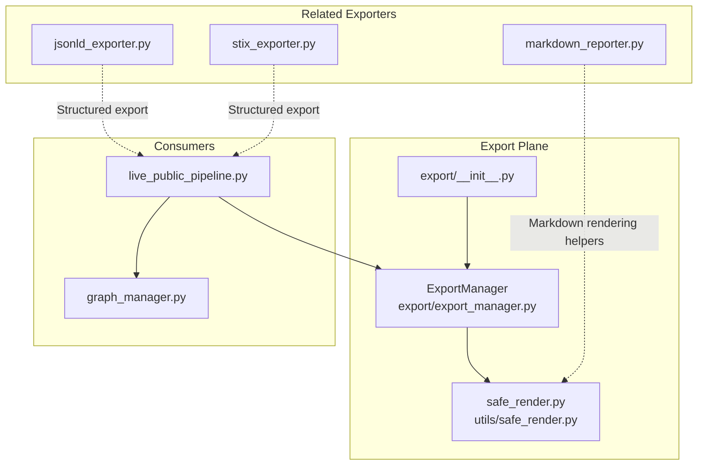
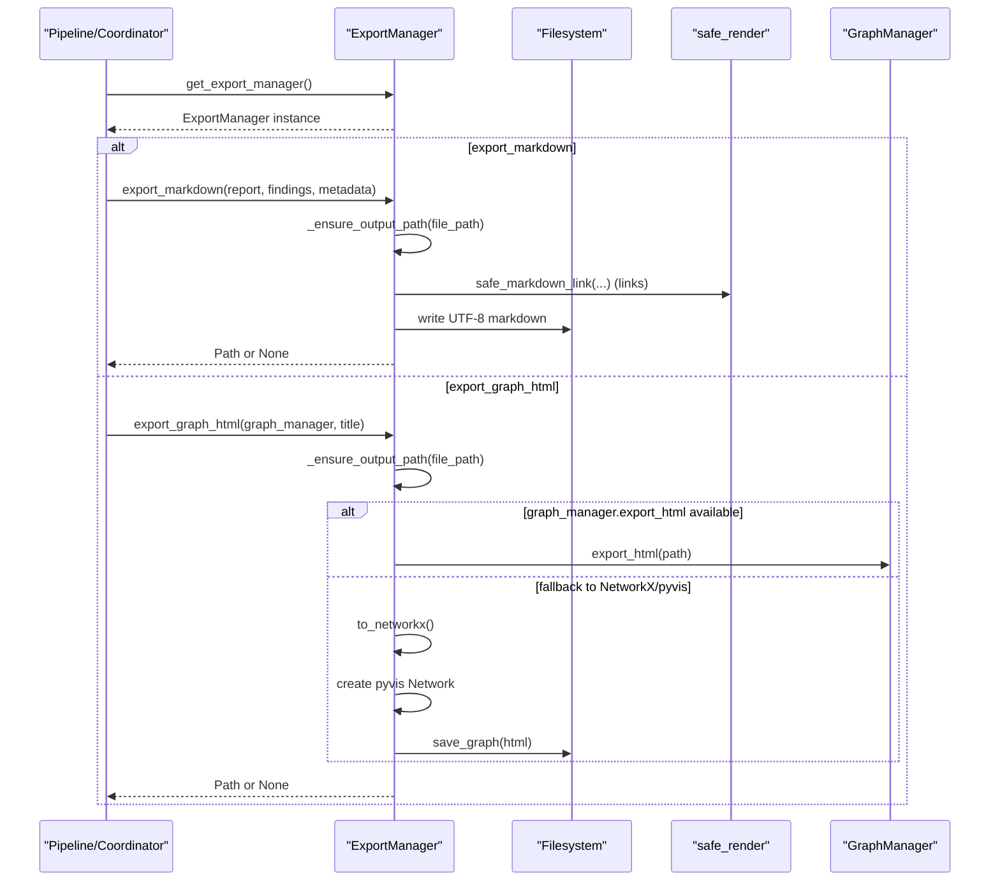
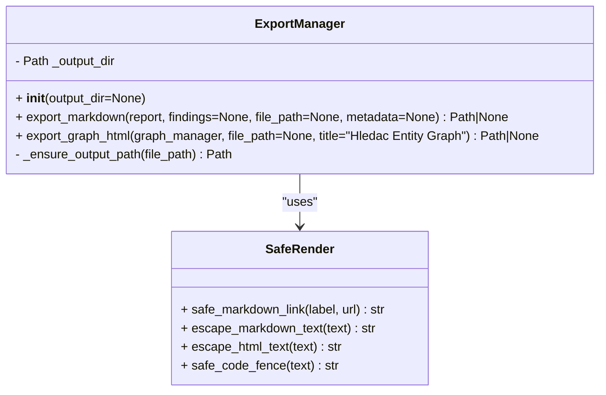
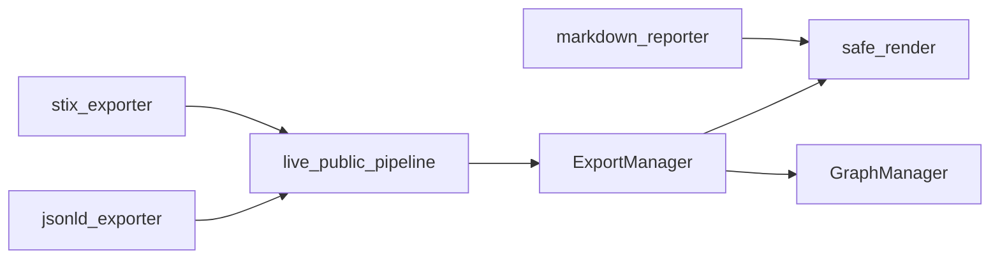

# Export Manager Core

<cite>
**Referenced Files in This Document**
- [export_manager.py](file://export/export_manager.py)
- [safe_render.py](file://utils/safe_render.py)
- [__init__.py](file://export/__init__.py)
- [live_public_pipeline.py](file://pipeline/live_public_pipeline.py)
- [graph_manager.py](file://graph/graph_manager.py)
- [markdown_reporter.py](file://export/markdown_reporter.py)
- [jsonld_exporter.py](file://export/jsonld_exporter.py)
- [stix_exporter.py](file://export/stix_exporter.py)
</cite>

## Table of Contents
1. [Introduction](#introduction)
2. [Project Structure](#project-structure)
3. [Core Components](#core-components)
4. [Architecture Overview](#architecture-overview)
5. [Detailed Component Analysis](#detailed-component-analysis)
6. [Dependency Analysis](#dependency-analysis)
7. [Performance Considerations](#performance-considerations)
8. [Troubleshooting Guide](#troubleshooting-guide)
9. [Conclusion](#conclusion)

## Introduction
This document describes the Export Manager core system responsible for exporting diagnostic reports and interactive visualizations. It covers the ExportManager class architecture, initialization, output directory management, security measures, singleton pattern, and the core export methods export_markdown() and export_graph_html(). It also provides usage patterns, examples, and guidance on error handling, file permissions, and output validation.

## Project Structure
The export subsystem is organized around a focused core module that provides a singleton ExportManager with two primary export methods, plus supporting utilities for safe rendering and related exporters.

**Diagram sources**
- [export_manager.py:1-300](file://export/export_manager.py#L1-L300)
- [safe_render.py:1-119](file://utils/safe_render.py#L1-L119)
- [__init__.py:1-47](file://export/__init__.py#L1-L47)
- [live_public_pipeline.py:3968-4031](file://pipeline/live_public_pipeline.py#L3968-L4031)
- [graph_manager.py:172-255](file://graph/graph_manager.py#L172-L255)
- [markdown_reporter.py:1-487](file://export/markdown_reporter.py#L1-L487)
- [jsonld_exporter.py:1-501](file://export/jsonld_exporter.py#L1-L501)
- [stix_exporter.py:1-800](file://export/stix_exporter.py#L1-L800)

**Section sources**
- [export_manager.py:1-300](file://export/export_manager.py#L1-L300)
- [__init__.py:1-47](file://export/__init__.py#L1-L47)

## Core Components
- ExportManager: Provides Obsidian-compatible Markdown export and interactive HTML graph export with strict output path validation and sensitive data filtering.
- get_export_manager(): Singleton accessor that lazily initializes the ExportManager instance.
- safe_render utilities: Provide safe rendering helpers for Markdown and HTML to prevent injection and XSS.
- Related exporters: markdown_reporter, jsonld_exporter, and stix_exporter provide complementary export formats and helpers.

Key responsibilities:
- Validate and constrain output paths to a controlled directory.
- Filter sensitive fields from metadata and findings.
- Render Markdown with YAML front matter and findings lists.
- Render interactive HTML graphs via pyvis or a NetworkX fallback.
- Provide deterministic filenames and safe link rendering.

**Section sources**
- [export_manager.py:49-299](file://export/export_manager.py#L49-L299)
- [safe_render.py:42-119](file://utils/safe_render.py#L42-L119)
- [markdown_reporter.py:65-487](file://export/markdown_reporter.py#L65-L487)
- [jsonld_exporter.py:131-501](file://export/jsonld_exporter.py#L131-L501)
- [stix_exporter.py:184-800](file://export/stix_exporter.py#L184-L800)

## Architecture Overview
The Export Manager follows a singleton pattern to ensure a single output directory and consistent security posture across the application. Consumers import get_export_manager() to obtain the instance, then call export_markdown() or export_graph_html().

**Diagram sources**
- [export_manager.py:294-299](file://export/export_manager.py#L294-L299)
- [export_manager.py:90-201](file://export/export_manager.py#L90-L201)
- [export_manager.py:202-287](file://export/export_manager.py#L202-L287)
- [safe_render.py:79-101](file://utils/safe_render.py#L79-L101)
- [graph_manager.py:172-255](file://graph/graph_manager.py#L172-L255)

## Detailed Component Analysis

### ExportManager Class
Responsibilities:
- Initialize with an output directory (defaults to ~/hledac_outputs).
- Validate all export paths to prevent directory traversal.
- Export Markdown with YAML front matter and findings.
- Export interactive HTML graphs via pyvis or a NetworkX fallback.
- Filter sensitive fields from metadata and findings.

Security measures:
- Path validation: Ensures the target path resolves under the configured output directory.
- Sensitive data filtering: Removes fields whose names match a predefined sensitive pattern set.
- Safe link rendering: Uses safe_markdown_link to sanitize URLs and prevent injection.

Anti-pattern enforcement:
- Output only to the configured output directory.
- No sensitive data export (cookies, API keys, tokens).
- Uses pyvis for interactive HTML graphs.

Initialization and output directory management:
- If no output_dir is provided, defaults to ~/hledac_outputs and creates the directory.
- All exports resolve relative paths against the output directory and ensure parent directories exist.

Core methods:
- export_markdown(report, findings, file_path, metadata) -> Path | None
- export_graph_html(graph_manager, file_path, title) -> Path | None

Singleton pattern:
- get_export_manager() returns a lazily initialized singleton instance.

**Section sources**
- [export_manager.py:49-88](file://export/export_manager.py#L49-L88)
- [export_manager.py:90-201](file://export/export_manager.py#L90-L201)
- [export_manager.py:202-287](file://export/export_manager.py#L202-L287)
- [export_manager.py:290-299](file://export/export_manager.py#L290-L299)

#### Class Diagram

**Diagram sources**
- [export_manager.py:49-299](file://export/export_manager.py#L49-L299)
- [safe_render.py:42-119](file://utils/safe_render.py#L42-L119)

### Singleton Pattern and get_export_manager()
- get_export_manager() ensures a single ExportManager instance is reused across the application.
- Lazy initialization: the instance is created on first access.

Usage pattern:
- Import get_export_manager from the export module.
- Call get_export_manager() to obtain the instance.
- Use export_markdown() and export_graph_html() on the returned instance.

**Section sources**
- [export_manager.py:290-299](file://export/export_manager.py#L290-L299)
- [__init__.py:22-25](file://export/__init__.py#L22-L25)

### Security Measures
Sensitive data filtering:
- A predefined set of sensitive field names is filtered from metadata and findings before export.
- Filtering is applied to both metadata dictionaries and individual finding dictionaries.

Path validation:
- _ensure_output_path() resolves the target path and checks that it starts with the configured output directory.
- Raises ValueError if the path would escape the output directory.

Safe rendering:
- safe_markdown_link() validates URL schemes, escapes labels, and percent-encodes parentheses to prevent injection.
- escape_markdown_text() and escape_html_text() escape special characters to prevent Markdown/HTML injection.

**Section sources**
- [export_manager.py:27-46](file://export/export_manager.py#L27-L46)
- [export_manager.py:71-88](file://export/export_manager.py#L71-L88)
- [safe_render.py:79-101](file://utils/safe_render.py#L79-L101)
- [safe_render.py:42-67](file://utils/safe_render.py#L42-L67)

### Core Export Methods

#### export_markdown(report, findings=None, file_path=None, metadata=None) -> Path | None
Purpose:
- Produce an Obsidian-compatible Markdown file with YAML front matter and findings list.

Parameters:
- report: String content (from Hermes 3 or other LLM).
- findings: Optional list of finding dictionaries or strings.
- file_path: Optional relative path within the output directory. If None, a timestamped filename is used.
- metadata: Optional dictionary for YAML front matter (title, date, sources, tags, and custom fields).

Processing:
- Validates output path via _ensure_output_path().
- Builds YAML front matter with title, date, sources (limited to 20), tags (limited), and sanitized metadata.
- Filters sensitive fields from metadata and findings.
- Renders findings as a bullet list with Obsidian-style wikilinks for URLs.
- Writes UTF-8 encoded content to disk.

Returns:
- Path to the written file, or None if export fails.

**Section sources**
- [export_manager.py:90-201](file://export/export_manager.py#L90-L201)

#### export_graph_html(graph_manager, file_path=None, title="Hledac Entity Graph") -> Path | None
Purpose:
- Export an interactive HTML graph using pyvis.

Parameters:
- graph_manager: An object with either export_html(path) or to_networkx() interface.
- file_path: Optional relative path within the output directory. If None, a timestamped filename is used.
- title: Title for the HTML page.

Processing:
- Validates output path via _ensure_output_path().
- If graph_manager has export_html, delegates to it.
- Otherwise, falls back to converting to NetworkX and building a pyvis Network with color-coded nodes and labeled edges.
- Saves the HTML file and returns the path.

Returns:
- Path to the written file, or None if export fails.

**Section sources**
- [export_manager.py:202-287](file://export/export_manager.py#L202-L287)
- [graph_manager.py:172-255](file://graph/graph_manager.py#L172-L255)

### Usage Patterns and Examples

#### Proper Initialization and Output Path Configuration
- Obtain the singleton instance via get_export_manager().
- By default, outputs are written to ~/hledac_outputs/. To change the output directory, initialize ExportManager with a custom path or configure the environment accordingly.

Example usage in a pipeline:
- The live_public_pipeline demonstrates exporting Markdown and HTML graphs after a successful run, collecting sources, findings, and metadata, then invoking export_markdown() and export_graph_html().

**Section sources**
- [export_manager.py:294-299](file://export/export_manager.py#L294-L299)
- [live_public_pipeline.py:3968-4031](file://pipeline/live_public_pipeline.py#L3968-L4031)

#### Security Best Practices
- Avoid passing sensitive fields in metadata or findings; sensitive fields are automatically filtered.
- Do not supply absolute or relative paths that escape the output directory; use only relative paths within the configured output directory.
- When rendering links, rely on safe_markdown_link() to sanitize URLs.

**Section sources**
- [export_manager.py:27-46](file://export/export_manager.py#L27-L46)
- [export_manager.py:71-88](file://export/export_manager.py#L71-L88)
- [safe_render.py:79-101](file://utils/safe_render.py#L79-L101)

## Dependency Analysis
- ExportManager depends on:
  - pathlib.Path for path resolution and creation.
  - time for timestamp-based filenames.
  - utils.safe_render for safe link rendering.
  - Optional external libraries (pyvis, networkx) for graph export.

- Consumers:
  - live_public_pipeline imports get_export_manager() and uses it to export Markdown and HTML.
  - graph_manager provides the export_html() method used by ExportManager.

- Related exporters:
  - markdown_reporter provides deterministic Markdown rendering for diagnostics.
  - jsonld_exporter and stix_exporter provide structured export formats.

**Diagram sources**
- [export_manager.py:16-21](file://export/export_manager.py#L16-L21)
- [safe_render.py:14-19](file://utils/safe_render.py#L14-L19)
- [live_public_pipeline.py:3971-3973](file://pipeline/live_public_pipeline.py#L3971-L3973)
- [graph_manager.py:172-185](file://graph/graph_manager.py#L172-L185)
- [markdown_reporter.py:17-23](file://export/markdown_reporter.py#L17-L23)
- [jsonld_exporter.py:12-16](file://export/jsonld_exporter.py#L12-L16)
- [stix_exporter.py:24-33](file://export/stix_exporter.py#L24-L33)

**Section sources**
- [export_manager.py:16-21](file://export/export_manager.py#L16-L21)
- [live_public_pipeline.py:3971-3973](file://pipeline/live_public_pipeline.py#L3971-L3973)
- [graph_manager.py:172-185](file://graph/graph_manager.py#L172-L185)
- [markdown_reporter.py:17-23](file://export/markdown_reporter.py#L17-L23)
- [jsonld_exporter.py:12-16](file://export/jsonld_exporter.py#L12-L16)
- [stix_exporter.py:24-33](file://export/stix_exporter.py#L24-L33)

## Performance Considerations
- Path validation and directory creation occur per export; keep file_path simple and relative to minimize overhead.
- Graph export via pyvis can be expensive; prefer export_html() when available to leverage optimized implementations.
- Limit the number of sources and findings to reduce file sizes and rendering time.
- UTF-8 writes are synchronous; consider batching or asynchronous storage elsewhere in the pipeline if needed.

## Troubleshooting Guide
Common issues and resolutions:
- Directory traversal errors: Ensure file_path does not contain “../” or absolute paths; _ensure_output_path() enforces containment.
- Permission errors: Verify the output directory exists and is writable; ExportManager creates the directory if missing.
- Graph export failures: If pyvis is unavailable, export_html() falls back to a NetworkX-based pyvis export; confirm networkx and pyvis availability.
- Sensitive data leakage: Confirm that metadata and findings do not include sensitive keys; sensitive fields are filtered automatically.
- Link rendering problems: Use safe_markdown_link() for URLs; avoid raw user-provided URLs in Markdown content.

Validation tips:
- Check return values: export_markdown() and export_graph_html() return the written Path or None on failure.
- Inspect logs: The pipeline logs warnings when exports fail.

**Section sources**
- [export_manager.py:71-88](file://export/export_manager.py#L71-L88)
- [export_manager.py:196-200](file://export/export_manager.py#L196-L200)
- [export_manager.py:230-234](file://export/export_manager.py#L230-L234)
- [export_manager.py:284-285](file://export/export_manager.py#L284-L285)
- [live_public_pipeline.py:4013-4027](file://pipeline/live_public_pipeline.py#L4013-L4027)

## Conclusion
The Export Manager provides a secure, deterministic, and extensible mechanism for exporting diagnostic reports and interactive graphs. Its singleton pattern ensures consistent configuration, while strict path validation and sensitive data filtering protect against common security pitfalls. The core methods export_markdown() and export_graph_html() offer straightforward APIs for integrating export workflows into larger pipelines.