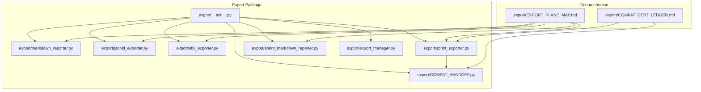
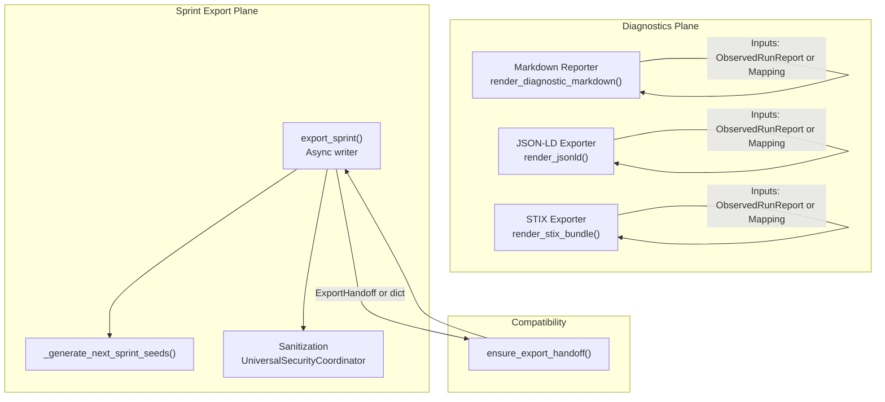
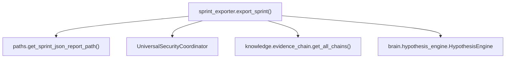

# Export and Reporting

<cite>
**Referenced Files in This Document**
- [export/__init__.py](file://export/__init__.py)
- [export/export_manager.py](file://export/export_manager.py)
- [export/jsonld_exporter.py](file://export/jsonld_exporter.py)
- [export/markdown_reporter.py](file://export/markdown_reporter.py)
- [export/stix_exporter.py](file://export/stix_exporter.py)
- [export/sprint_exporter.py](file://export/sprint_exporter.py)
- [export/sprint_markdown_reporter.py](file://export/sprint_markdown_reporter.py)
- [export/COMPAT_HANDOFF.py](file://export/COMPAT_HANDOFF.py)
- [export/EXPORT_PLANE_MAP.md](file://export/EXPORT_PLANE_MAP.md)
- [export/COMPAT_DEBT_LEDGER.md](file://export/COMPAT_DEBT_LEDGER.md)
</cite>

## Table of Contents
1. [Introduction](#introduction)
2. [Project Structure](#project-structure)
3. [Core Components](#core-components)
4. [Architecture Overview](#architecture-overview)
5. [Detailed Component Analysis](#detailed-component-analysis)
6. [Dependency Analysis](#dependency-analysis)
7. [Performance Considerations](#performance-considerations)
8. [Troubleshooting Guide](#troubleshooting-guide)
9. [Conclusion](#conclusion)
10. [Appendices](#appendices)

## Introduction
This document describes the export and reporting subsystem of the system. It covers the export framework, report generation, compatibility standards, and data interchange formats. The subsystem provides deterministic, side-effect-free rendering of diagnostic reports and structured artifacts suitable for downstream systems, operators, and analysts. It supports:
- Markdown diagnostics for human readability
- JSON-LD for graph ingestion and future synthesis
- STIX 2.1 bundles for CTI interoperability
- Sprint-level JSON reports and next-sprint seed tasks
- An export manager for Obsidian-compatible Markdown and interactive HTML graphs

## Project Structure
The export subsystem is organized under the export package with clear separation of concerns:
- Pure diagnostic exporters: Markdown, JSON-LD, STIX
- Sprint export and seed generation
- Export manager for Markdown and HTML graph exports
- Compatibility adapters and canonical path ownership

**Diagram sources**
- [export/__init__.py:1-47](file://export/__init__.py#L1-L47)
- [export/markdown_reporter.py:1-474](file://export/markdown_reporter.py#L1-L474)
- [export/jsonld_exporter.py:1-505](file://export/jsonld_exporter.py#L1-L505)
- [export/stix_exporter.py:1-1199](file://export/stix_exporter.py#L1-L1199)
- [export/sprint_exporter.py:1-2738](file://export/sprint_exporter.py#L1-L2738)
- [export/sprint_markdown_reporter.py:1-833](file://export/sprint_markdown_reporter.py#L1-L833)
- [export/export_manager.py:1-298](file://export/export_manager.py#L1-L298)
- [export/COMPAT_HANDOFF.py:1-95](file://export/COMPAT_HANDOFF.py#L1-L95)
- [export/EXPORT_PLANE_MAP.md:1-189](file://export/EXPORT_PLANE_MAP.md#L1-L189)
- [export/COMPAT_DEBT_LEDGER.md:1-224](file://export/COMPAT_DEBT_LEDGER.md#L1-L224)

**Section sources**
- [export/__init__.py:1-47](file://export/__init__.py#L1-L47)
- [export/EXPORT_PLANE_MAP.md:1-189](file://export/EXPORT_PLANE_MAP.md#L1-L189)

## Core Components
- Markdown diagnostic reporter: renders deterministic Markdown from ObservedRunReport or Mapping inputs.
- JSON-LD exporter: produces structured JSON-LD with a custom ghost namespace for graph ingestion.
- STIX exporter: emits STIX 2.1 bundles, including metadata-safe diagnostics and CTI-ready artifacts.
- Sprint exporter: async JSON report writer plus next-sprint seed generation with privacy sanitization.
- Sprint Markdown reporter: canonical pure renderer for sprint-level Markdown.
- Export manager: Obsidian-compatible Markdown export and interactive HTML graph export with safety checks.
- Compatibility adapters: ensure_export_handoff() and path authorities.

Key responsibilities:
- Deterministic, side-effect-free rendering for reproducibility
- Privacy sanitization for outbound artifacts
- Deterministic IDs and object shapes for standards compliance
- Bounded outputs and fail-soft behavior for resilience

**Section sources**
- [export/markdown_reporter.py:1-474](file://export/markdown_reporter.py#L1-L474)
- [export/jsonld_exporter.py:1-505](file://export/jsonld_exporter.py#L1-L505)
- [export/stix_exporter.py:1-1199](file://export/stix_exporter.py#L1-L1199)
- [export/sprint_exporter.py:1-2738](file://export/sprint_exporter.py#L1-L2738)
- [export/sprint_markdown_reporter.py:1-833](file://export/sprint_markdown_reporter.py#L1-L833)
- [export/export_manager.py:1-298](file://export/export_manager.py#L1-L298)
- [export/COMPAT_HANDOFF.py:1-95](file://export/COMPAT_HANDOFF.py#L1-L95)

## Architecture Overview
The export plane is split into two planes:
- Diagnostics plane: pure, stateless renderers for Markdown, JSON-LD, and STIX.
- Sprint export plane: async writer for JSON reports and seed tasks, plus operator briefs and derived metrics.

**Diagram sources**
- [export/markdown_reporter.py:372-408](file://export/markdown_reporter.py#L372-L408)
- [export/jsonld_exporter.py:280-325](file://export/jsonld_exporter.py#L280-L325)
- [export/stix_exporter.py:749-800](file://export/stix_exporter.py#L749-L800)
- [export/sprint_exporter.py:144-464](file://export/sprint_exporter.py#L144-L464)
- [export/COMPAT_HANDOFF.py:25-94](file://export/COMPAT_HANDOFF.py#L25-L94)

## Detailed Component Analysis

### Markdown Diagnostic Reporter
Purpose:
- Produce deterministic Markdown diagnostics from ObservedRunReport or Mapping inputs.
- No side effects; pure function.

Key behaviors:
- Normalizes input to dict via normalize_report_input()
- Renders sections in a fixed order: Run Metadata, Executive Summary, Runtime Truth, Signal Funnel, Store Rejection Trace, Per-Source Health, Root Cause, Recommended Next Sprint, Known Limits, Machine-Readable Summary.
- Escapes and links URLs for Markdown safety.
- Deterministic ordering via sorted keys and lists.

Parameters and return:
- render_diagnostic_markdown(report) → str
- render_diagnostic_markdown_to_path(report, path=None) → Path

Privacy and determinism:
- Uses stable sorting and escaping to ensure deterministic output.
- Uses environment variable GHOST_EXPORT_DIR or paths.RAMDISK_ROOT for output location.

**Section sources**
- [export/markdown_reporter.py:63-80](file://export/markdown_reporter.py#L63-L80)
- [export/markdown_reporter.py:125-312](file://export/markdown_reporter.py#L125-L312)
- [export/markdown_reporter.py:372-408](file://export/markdown_reporter.py#L372-L408)
- [export/markdown_reporter.py:414-474](file://export/markdown_reporter.py#L414-L474)

### JSON-LD Exporter
Purpose:
- Produce structured JSON-LD with schema.org + ghost namespace for graph ingestion and future synthesis.

Key behaviors:
- normalize_export_input() converts msgspec.Struct or Mapping to dict.
- Builds canonical objects: RunMetadata, SignalFunnel, StoreRejectionTrace, RuntimeTruth, RootCause, PerSourceHealth, DiagnosticReport.
- Uses ghost: namespace URIs and @context mapping.
- get_root_cause_label() and get_recommendation() for labels and fallback recommendations.
- render_jsonld() returns dict; render_jsonld_str() returns sorted JSON string; render_jsonld_to_path() writes to file with deterministic naming.

Determinism and safety:
- Sorted keys and filtered nulls for stable output.
- Deterministic filenames based on run_id or timestamp.

Analyst Evidence Export:
- render_analyst_evidence_jsonld() and render_analyst_evidence_jsonld_str() for analyst workbench evidence documents.

**Section sources**
- [export/jsonld_exporter.py:131-147](file://export/jsonld_exporter.py#L131-L147)
- [export/jsonld_exporter.py:152-162](file://export/jsonld_exporter.py#L152-L162)
- [export/jsonld_exporter.py:181-324](file://export/jsonld_exporter.py#L181-L324)
- [export/jsonld_exporter.py:327-338](file://export/jsonld_exporter.py#L327-L338)
- [export/jsonld_exporter.py:343-399](file://export/jsonld_exporter.py#L343-L399)
- [export/jsonld_exporter.py:405-505](file://export/jsonld_exporter.py#L405-L505)

### STIX Exporter
Purpose:
- Produce STIX 2.1 bundles for diagnostics and CTI-ready artifacts.

Key behaviors:
- normalize_export_input() for input normalization.
- _build_diagnostic_note(), _build_diagnostic_identity(), _build_per_source_notes(), _build_root_cause_object() for metadata-safe diagnostics.
- CTI upgrade: render_cti_stix_bundle() converts findings, identities, attribution scores, kill-chain tags, and evidence chains into STIX objects with deterministic UUID5 IDs.
- collect_cti_export_inputs() gathers findings and sidecar data concurrently with bounds.

Guardrails:
- No fake IOCs when findings list is empty.
- No network access or model load.
- Bounded object counts and sizes.

Recommendation and root cause:
- Uses shared root cause labels and fallback recommendations.

**Section sources**
- [export/stix_exporter.py:184-196](file://export/stix_exporter.py#L184-L196)
- [export/stix_exporter.py:249-303](file://export/stix_exporter.py#L249-L303)
- [export/stix_exporter.py:305-316](file://export/stix_exporter.py#L305-L316)
- [export/stix_exporter.py:335-364](file://export/stix_exporter.py#L335-L364)
- [export/stix_exporter.py:366-391](file://export/stix_exporter.py#L366-L391)
- [export/stix_exporter.py:99-179](file://export/stix_exporter.py#L99-L179)
- [export/stix_exporter.py:749-800](file://export/stix_exporter.py#L749-L800)
- [export/stix_exporter.py:415-448](file://export/stix_exporter.py#L415-L448)

### Sprint Exporter
Purpose:
- Async JSON report writer and next-sprint seed generator for operational handoff.

Key behaviors:
- export_sprint(store, handoff, sprint_id) writes canonical JSON report and seeds, and builds operator briefs and derived metrics.
- export_partial_sprint() writes partial JSON artifacts during aggressive runs.
- ensure_export_handoff() normalizes ExportHandoff | dict | None to typed ExportHandoff.
- _generate_next_sprint_seeds() derives seeds from:
  - IOC follow-up (type-aware)
  - Query suggestions (based on signal quality and reject breakdown)
  - Source revisit (circuit breaker and depleted signal)
  - Low-signal recommendations
  - Hypothesis-engine-derived queries
  - Focus/expand recommendations
  - Branch-driven and trend-driven seeds
- Sanitization via UniversalSecurityCoordinator with privacy gates.

Outputs:
- report_json: path to JSON report
- seeds_json: path to next-sprint seeds
- Additional derived fields: operator_brief, run_truth_note, branch_truth, best_first_move, why_this_run_matters, research_depth_metric, graph_enriched_findings, envelope_findings, sprint_diff_findings, kill_chain_findings, evidence_chains

**Section sources**
- [export/sprint_exporter.py:79-142](file://export/sprint_exporter.py#L79-L142)
- [export/sprint_exporter.py:144-464](file://export/sprint_exporter.py#L144-L464)
- [export/sprint_exporter.py:467-577](file://export/sprint_exporter.py#L467-L577)
- [export/sprint_exporter.py:588-728](file://export/sprint_exporter.py#L588-L728)
- [export/sprint_exporter.py:817-958](file://export/sprint_exporter.py#L817-L958)
- [export/COMPAT_HANDOFF.py:25-94](file://export/COMPAT_HANDOFF.py#L25-L94)

### Sprint Markdown Reporter
Purpose:
- Canonical pure renderer for sprint-level Markdown reports.

Key behaviors:
- render_sprint_markdown(report, scorecard, sprint_id) → str
- Renders executive summary, research metrics, threat actors, top findings, optional sections (source leaderboard, phase timings, evidence envelope, identity candidates, timeline, sprint diff, kill chain heat map, evidence chains, analyst brief)
- Uses centralized JSON parsing with graceful fallback
- Deterministic formatting and bounded displays

**Section sources**
- [export/sprint_markdown_reporter.py:142-280](file://export/sprint_markdown_reporter.py#L142-L280)
- [export/sprint_markdown_reporter.py:37-54](file://export/sprint_markdown_reporter.py#L37-L54)

### Export Manager
Purpose:
- Obsidian-compatible Markdown export and interactive HTML graph export.

Key behaviors:
- export_markdown(report, findings, file_path, metadata) → Path | None
- export_graph_html(graph_manager, file_path, title) → Path | None
- Security: resolves and validates output paths to prevent escaping the configured output directory
- Sensitive data filtering: removes fields containing sensitive keywords
- HTML export: uses pyvis with color-coded entity types; falls back to NetworkX + pyvis if needed

**Section sources**
- [export/export_manager.py:47-298](file://export/export_manager.py#L47-L298)

### Compatibility Adapters and Path Authorities
- ensure_export_handoff() normalizes inputs to typed ExportHandoff, preserving backward compatibility
- EXPORT_PLANE_MAP.md and COMPAT_DEBT_LEDGER.md document canonical truths, path ownership, and compat seams

**Section sources**
- [export/COMPAT_HANDOFF.py:25-94](file://export/COMPAT_HANDOFF.py#L25-L94)
- [export/EXPORT_PLANE_MAP.md:76-189](file://export/EXPORT_PLANE_MAP.md#L76-L189)
- [export/COMPAT_DEBT_LEDGER.md:1-224](file://export/COMPAT_DEBT_LEDGER.md#L1-L224)

## Dependency Analysis
High-level dependencies:
- Sprint exporter depends on:
  - paths.py for canonical report and seeds paths
  - UniversalSecurityCoordinator for sanitization
  - store for optional fallbacks (get_top_seed_nodes, async_query_recent_findings, annotate_findings_with_graph_context, async_get_findings_with_envelope)
  - knowledge.evidence_chain for evidence chains
  - brain.hypothesis_engine for query suggestions (optional)
- Diagnostic exporters depend only on their input normalization and internal helpers.
- Export manager depends on pyvis and networkx for HTML graph export.

**Diagram sources**
- [export/sprint_exporter.py:181-196](file://export/sprint_exporter.py#L181-L196)
- [export/sprint_exporter.py:206-238](file://export/sprint_exporter.py#L206-L238)
- [export/sprint_exporter.py:417-439](file://export/sprint_exporter.py#L417-L439)
- [export/sprint_exporter.py:980-992](file://export/sprint_exporter.py#L980-L992)

**Section sources**
- [export/sprint_exporter.py:181-238](file://export/sprint_exporter.py#L181-L238)
- [export/sprint_exporter.py:417-439](file://export/sprint_exporter.py#L417-L439)

## Performance Considerations
- Deterministic rendering avoids expensive operations; JSON-LD and Markdown exporters are side-effect-free and deterministic.
- STIX exporter bounds object counts and sizes to control memory and I/O.
- Sprint exporter uses asyncio.gather for concurrent reads and bounded displays to limit overhead.
- Export manager enforces output directory containment to prevent path traversal and excessive filesystem churn.

## Troubleshooting Guide
Common issues and resolutions:
- Export path escapes output directory:
  - Symptom: ValueError raised when resolving output path
  - Resolution: Ensure file_path is within configured output_dir; export_manager validates paths
- Sanitization failures:
  - Symptom: Partial or degraded sanitized output
  - Resolution: Export proceeds with degraded structure; check UniversalSecurityCoordinator logs
- Missing graph backend:
  - Symptom: HTML export fallback attempts to use NetworkX/pyvis
  - Resolution: Confirm graph_manager exposes to_networkx() or export_html()
- Empty findings for CTI:
  - Symptom: No indicators created
  - Resolution: By design, metadata-safe diagnostics are exported when findings are absent
- Partial export artifacts:
  - Symptom: Partial JSON artifacts written during aggressive runs
  - Resolution: export_partial_sprint() writes recoverable artifacts; final export does not rely on partials

**Section sources**
- [export/export_manager.py:69-86](file://export/export_manager.py#L69-L86)
- [export/sprint_exporter.py:206-238](file://export/sprint_exporter.py#L206-L238)
- [export/sprint_exporter.py:245-287](file://export/sprint_exporter.py#L245-L287)
- [export/stix_exporter.py:749-800](file://export/stix_exporter.py#L749-L800)
- [export/sprint_exporter.py:79-142](file://export/sprint_exporter.py#L79-L142)

## Conclusion
The export and reporting subsystem provides a robust, deterministic, and standards-compliant pipeline for diagnostics, CTI, and operational handoffs. It separates pure rendering from side-effectful writes, ensures privacy and determinism, and maintains compatibility through thin adapters. The design supports future evolution with canonical path ownership and lifecycle hooks.

## Appendices

### API Definitions and Usage Patterns
- Markdown diagnostic:
  - render_diagnostic_markdown(report) → str
  - render_diagnostic_markdown_to_path(report, path=None) → Path
- JSON-LD:
  - render_jsonld(report) → dict
  - render_jsonld_str(report) → str
  - render_jsonld_to_path(report, path=None) → Path
- STIX:
  - render_stix_bundle(report) → dict
  - render_stix_bundle_to_path(report, path=None) → Path
  - render_cti_stix_bundle(findings, identity_candidates, attribution_scores, killchain_tags, evidence_chains, max_objects) → dict
  - collect_cti_export_inputs(report, store) → CTIExportInputs
- Sprint export:
  - export_sprint(store, handoff, sprint_id) → dict with report_json, seeds_json, and derived fields
  - export_partial_sprint(store, handoff, sprint_id, finding_count) → dict
  - _generate_next_sprint_seeds(top_nodes, sprint_id, report_path, pvs, branch_value, sprint_trend) → Path
- Sprint Markdown:
  - render_sprint_markdown(report, scorecard, sprint_id) → str
- Export manager:
  - export_markdown(report, findings, file_path, metadata) → Path | None
  - export_graph_html(graph_manager, file_path, title) → Path | None

**Section sources**
- [export/markdown_reporter.py:372-474](file://export/markdown_reporter.py#L372-L474)
- [export/jsonld_exporter.py:280-399](file://export/jsonld_exporter.py#L280-L399)
- [export/stix_exporter.py:366-800](file://export/stix_exporter.py#L366-L800)
- [export/sprint_exporter.py:144-464](file://export/sprint_exporter.py#L144-L464)
- [export/sprint_markdown_reporter.py:142-280](file://export/sprint_markdown_reporter.py#L142-L280)
- [export/export_manager.py:88-298](file://export/export_manager.py#L88-L298)

### Configuration Options and Parameters
- Environment variables:
  - GHOST_EXPORT_DIR: overrides default export directory for diagnostic outputs
- Paths:
  - Diagnostic outputs: paths.RAMDISK_ROOT / "runs"
  - Sprint reports: ~/.hledac/reports/{sprint_id}_report.json
  - Sprint seeds: ~/.hledac/reports/{sprint_id}_next_seeds.json
  - Sprint Markdown: managed by paths.get_sprint_report_path(); shell orchestrates write
- STIX bounds:
  - MAX_STIX_OBJECTS=500, MAX_EXPORT_FINDINGS=300, MAX_EXPORT_CHAINS=20, MAX_EXPORT_BYTES≈5MB
- Deterministic naming:
  - ghost_diagnostic_{run_id}.jsonld or ghost_diagnostic_{timestamp}.jsonld
  - {sprint_id}_report.json and {sprint_id}_next_seeds.json

**Section sources**
- [export/jsonld_exporter.py:362-399](file://export/jsonld_exporter.py#L362-L399)
- [export/sprint_exporter.py:196-196](file://export/sprint_exporter.py#L196-L196)
- [export/EXPORT_PLANE_MAP.md:128-136](file://export/EXPORT_PLANE_MAP.md#L128-L136)

### Data Interchange Formats and Standards
- Markdown: human-readable diagnostics with YAML front matter and structured sections
- JSON-LD: schema.org + ghost namespace for graph ingestion
- STIX 2.1: metadata-safe diagnostics and CTI-ready artifacts with deterministic IDs
- JSON: structured sprint reports and seed tasks

**Section sources**
- [export/markdown_reporter.py:125-312](file://export/markdown_reporter.py#L125-L312)
- [export/jsonld_exporter.py:32-97](file://export/jsonld_exporter.py#L32-L97)
- [export/stix_exporter.py:49-82](file://export/stix_exporter.py#L49-L82)
- [export/sprint_exporter.py:144-464](file://export/sprint_exporter.py#L144-L464)