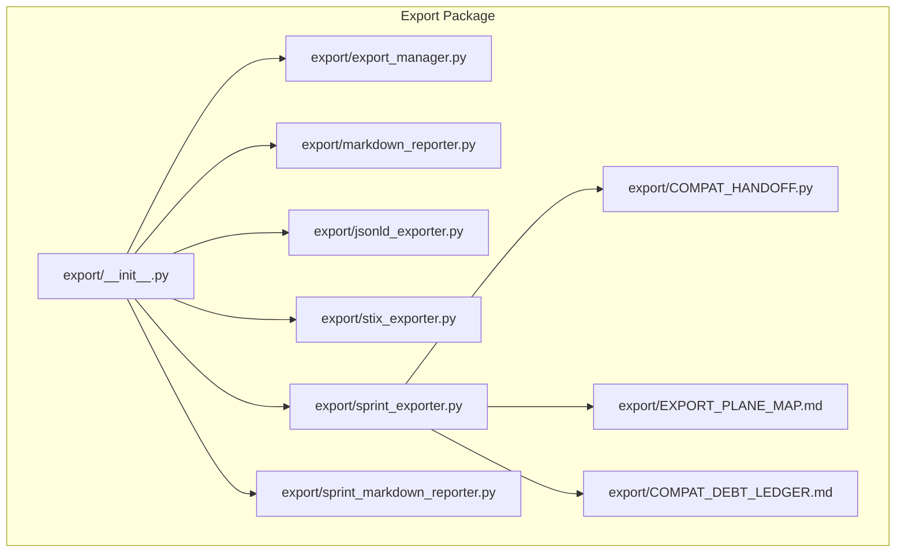
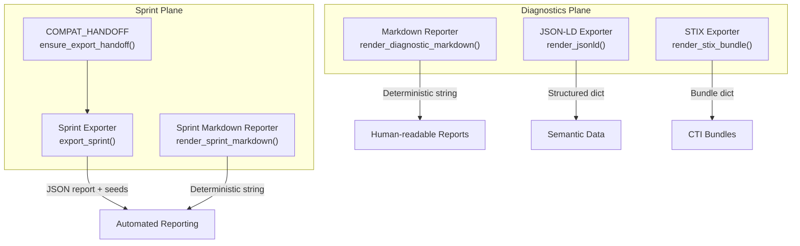
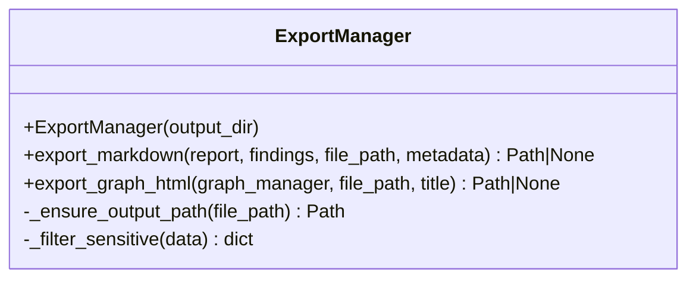
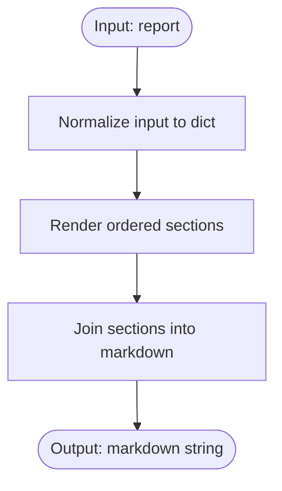
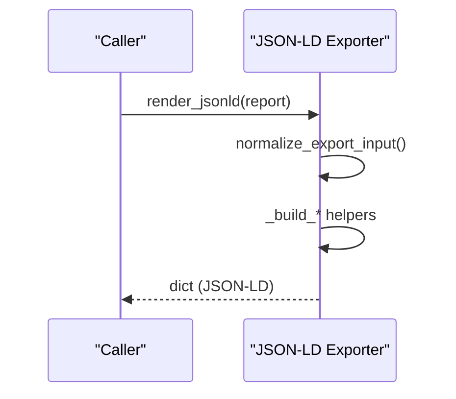
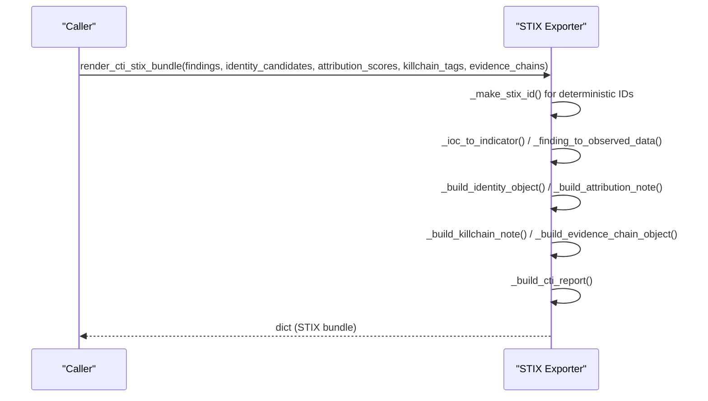
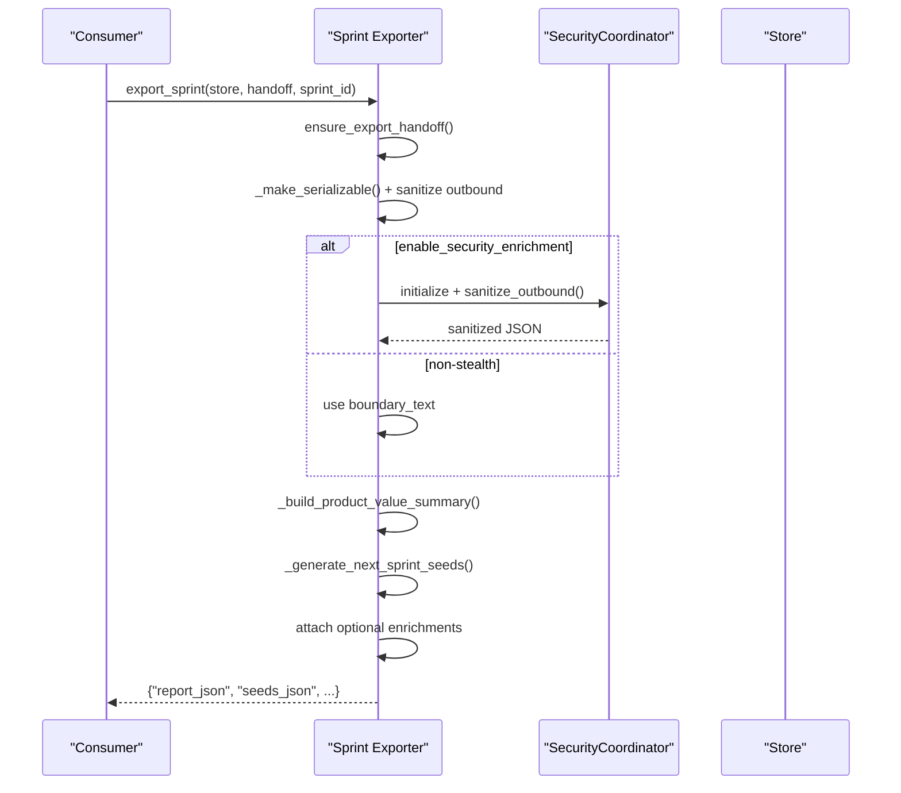
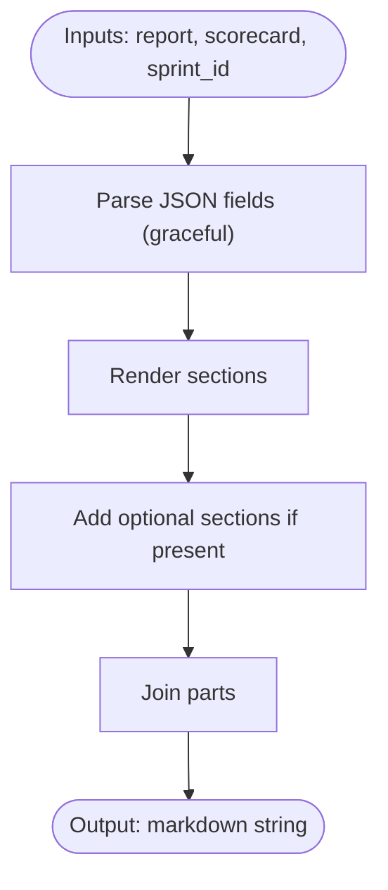
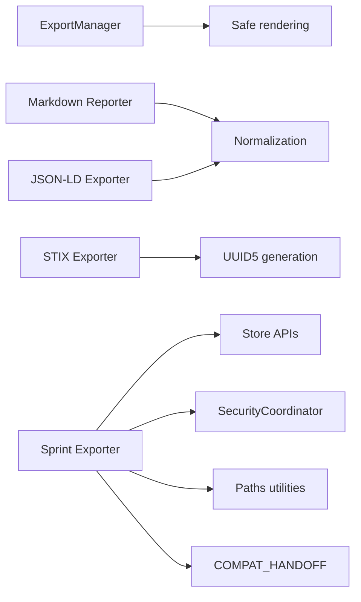

# Export and Reporting

<cite>
**Referenced Files in This Document**
- [export/__init__.py](file://hledac/universal/export/__init__.py)
- [export/export_manager.py](file://hledac/universal/export/export_manager.py)
- [export/stix_exporter.py](file://hledac/universal/export/stix_exporter.py)
- [export/markdown_reporter.py](file://hledac/universal/export/markdown_reporter.py)
- [export/jsonld_exporter.py](file://hledac/universal/export/jsonld_exporter.py)
- [export/sprint_exporter.py](file://hledac/universal/export/sprint_exporter.py)
- [export/sprint_markdown_reporter.py](file://hledac/universal/export/sprint_markdown_reporter.py)
- [export/COMPAT_HANDOFF.py](file://hledac/universal/export/COMPAT_HANDOFF.py)
- [export/COMPAT_DEBT_LEDGER.md](file://hledac/universal/export/COMPAT_DEBT_LEDGER.md)
- [export/EXPORT_PLANE_MAP.md](file://hledac/universal/export/EXPORT_PLANE_MAP.md)
</cite>

## Table of Contents
1. [Introduction](#introduction)
2. [Project Structure](#project-structure)
3. [Core Components](#core-components)
4. [Architecture Overview](#architecture-overview)
5. [Detailed Component Analysis](#detailed-component-analysis)
6. [Dependency Analysis](#dependency-analysis)
7. [Performance Considerations](#performance-considerations)
8. [Troubleshooting Guide](#troubleshooting-guide)
9. [Conclusion](#conclusion)
10. [Appendices](#appendices)

## Introduction
This document describes the export and reporting system in Hledac Universal. It covers the export manager for human-readable outputs, the STIX exporter for cyber threat intelligence, the JSON-LD exporter for semantic data, and the sprint exporter for automated reporting and seed generation. It explains supported formats, data transformation rules, configuration options, validation and formatting guarantees, and integration patterns with external systems.

## Project Structure
The export subsystem is organized under the export package with clear separation between diagnostic (human-readable and semantic) and sprint (automated) reporting planes.

**Diagram sources**
- [export/__init__.py:1-47](file://hledac/universal/export/__init__.py#L1-L47)
- [export/export_manager.py:1-300](file://hledac/universal/export/export_manager.py#L1-L300)
- [export/markdown_reporter.py:1-487](file://hledac/universal/export/markdown_reporter.py#L1-L487)
- [export/jsonld_exporter.py:1-501](file://hledac/universal/export/jsonld_exporter.py#L1-L501)
- [export/stix_exporter.py:1-1190](file://hledac/universal/export/stix_exporter.py#L1-L1190)
- [export/sprint_exporter.py:1-3546](file://hledac/universal/export/sprint_exporter.py#L1-L3546)
- [export/sprint_markdown_reporter.py:1-889](file://hledac/universal/export/sprint_markdown_reporter.py#L1-L889)
- [export/COMPAT_HANDOFF.py:1-95](file://hledac/universal/export/COMPAT_HANDOFF.py#L1-L95)
- [export/COMPAT_DEBT_LEDGER.md:1-224](file://hledac/universal/export/COMPAT_DEBT_LEDGER.md#L1-L224)
- [export/EXPORT_PLANE_MAP.md:1-189](file://hledac/universal/export/EXPORT_PLANE_MAP.md#L1-L189)

**Section sources**
- [export/__init__.py:1-47](file://hledac/universal/export/__init__.py#L1-L47)
- [export/EXPORT_PLANE_MAP.md:1-189](file://hledac/universal/export/EXPORT_PLANE_MAP.md#L1-L189)

## Core Components
- ExportManager: Human-readable Markdown and interactive HTML graph export with output path safety and sensitive data filtering.
- Markdown Reporter: Deterministic diagnostic report renderer for human consumption.
- JSON-LD Exporter: Structured semantic export with schema.org and custom ghost namespace.
- STIX Exporter: Deterministic, side-effect-free STIX 2.1 bundle exporter for diagnostics and CTI.
- Sprint Exporter: Automated JSON report, next-sprint seeds, and operator brief generation with privacy sanitization.
- Sprint Markdown Reporter: Canonical deterministic sprint report renderer.

**Section sources**
- [export/export_manager.py:49-300](file://hledac/universal/export/export_manager.py#L49-L300)
- [export/markdown_reporter.py:1-487](file://hledac/universal/export/markdown_reporter.py#L1-L487)
- [export/jsonld_exporter.py:1-501](file://hledac/universal/export/jsonld_exporter.py#L1-L501)
- [export/stix_exporter.py:1-1190](file://hledac/universal/export/stix_exporter.py#L1-L1190)
- [export/sprint_exporter.py:1-3546](file://hledac/universal/export/sprint_exporter.py#L1-L3546)
- [export/sprint_markdown_reporter.py:1-889](file://hledac/universal/export/sprint_markdown_reporter.py#L1-L889)

## Architecture Overview
The export system separates concerns into two planes:
- Diagnostics plane: Pure, stateless renderers for Markdown, JSON-LD, and STIX.
- Sprint plane: Async export with file I/O, privacy sanitization, and seed generation.

**Diagram sources**
- [export/markdown_reporter.py:389-425](file://hledac/universal/export/markdown_reporter.py#L389-L425)
- [export/jsonld_exporter.py:280-325](file://hledac/universal/export/jsonld_exporter.py#L280-L325)
- [export/stix_exporter.py:749-800](file://hledac/universal/export/stix_exporter.py#L749-L800)
- [export/sprint_exporter.py:156-556](file://hledac/universal/export/sprint_exporter.py#L156-L556)
- [export/sprint_markdown_reporter.py:144-282](file://hledac/universal/export/sprint_markdown_reporter.py#L144-L282)
- [export/COMPAT_HANDOFF.py:25-95](file://hledac/universal/export/COMPAT_HANDOFF.py#L25-L95)

## Detailed Component Analysis

### ExportManager
Exports Markdown and interactive HTML graphs with:
- Output path safety: resolves and validates paths to prevent escaping the configured output directory.
- Sensitive data filtering: removes fields containing sensitive keywords from metadata and findings.
- Obsidian-compatible Markdown: YAML front matter, report body, and findings list.

**Diagram sources**
- [export/export_manager.py:49-300](file://hledac/universal/export/export_manager.py#L49-L300)

**Section sources**
- [export/export_manager.py:49-300](file://hledac/universal/export/export_manager.py#L49-L300)

### Markdown Reporter
Deterministic diagnostic report renderer with:
- Normalization of inputs from msgspec.Struct or Mapping.
- Ordered sections: Run Metadata, Executive Summary, Runtime Truth, Signal Funnel, Store Rejection Trace, Per-Source Health, Root Cause, Recommended Next Sprint, Known Limits, Machine-Readable Summary.
- Deterministic formatting and JSON block emission.

**Diagram sources**
- [export/markdown_reporter.py:65-82](file://hledac/universal/export/markdown_reporter.py#L65-L82)
- [export/markdown_reporter.py:405-425](file://hledac/universal/export/markdown_reporter.py#L405-L425)

**Section sources**
- [export/markdown_reporter.py:1-487](file://hledac/universal/export/markdown_reporter.py#L1-L487)

### JSON-LD Exporter
Structured semantic export with:
- schema.org + ghost namespace context.
- Deterministic rendering with sorted keys and filtered nulls.
- Analyst evidence export for workbench answers.

**Diagram sources**
- [export/jsonld_exporter.py:280-325](file://hledac/universal/export/jsonld_exporter.py#L280-L325)

**Section sources**
- [export/jsonld_exporter.py:1-501](file://hledac/universal/export/jsonld_exporter.py#L1-L501)

### STIX Exporter
Deterministic STIX 2.1 bundle exporter for diagnostics and CTI:
- Diagnostic-only bundle (no fake IOCs) when no findings are present.
- CTI upgrade: findings → indicators/observed-data, identity candidates → identities, attribution scores → notes, kill-chain tags → notes, evidence chains → observed-data + relationships.
- Deterministic IDs via UUID5 from stable namespace and content.
- Bounded object counts and sizes.

**Diagram sources**
- [export/stix_exporter.py:450-508](file://hledac/universal/export/stix_exporter.py#L450-L508)
- [export/stix_exporter.py:562-596](file://hledac/universal/export/stix_exporter.py#L562-L596)
- [export/stix_exporter.py:711-742](file://hledac/universal/export/stix_exporter.py#L711-L742)

**Section sources**
- [export/stix_exporter.py:1-1190](file://hledac/universal/export/stix_exporter.py#L1-L1190)

### Sprint Exporter
Automated reporting and seed generation:
- JSON report with product value summary, runtime truth, canonical run summary, acquisition truth, capability synthesis, and optional enrichment (evidence chains, envelope findings, kill chain findings, sprint diffs).
- Privacy sanitization via SecurityCoordinator with fail-soft fallback.
- Next-sprint seeds derived from top nodes, product value summary, branch value, trend, capability synthesis, and analyst brief.
- Deterministic partial artifacts for recovery during aggressive runs.

**Diagram sources**
- [export/sprint_exporter.py:156-556](file://hledac/universal/export/sprint_exporter.py#L156-L556)
- [export/COMPAT_HANDOFF.py:25-95](file://hledac/universal/export/COMPAT_HANDOFF.py#L25-L95)

**Section sources**
- [export/sprint_exporter.py:1-3546](file://hledac/universal/export/sprint_exporter.py#L1-L3546)
- [export/COMPAT_HANDOFF.py:1-95](file://hledac/universal/export/COMPAT_HANDOFF.py#L1-L95)

### Sprint Markdown Reporter
Deterministic sprint report renderer:
- Renders executive summary, research metrics, threat actors, top findings, optional sections (source leaderboard, phase timings, evidence envelope, identity candidates, timelines, sprint diffs, kill chain heat map, analyst brief).
- Centralized JSON parsing with graceful fallback.

**Diagram sources**
- [export/sprint_markdown_reporter.py:144-282](file://hledac/universal/export/sprint_markdown_reporter.py#L144-L282)

**Section sources**
- [export/sprint_markdown_reporter.py:1-889](file://hledac/universal/export/sprint_markdown_reporter.py#L1-L889)

## Dependency Analysis
- ExportManager depends on safe rendering utilities and path resolution.
- Markdown Reporter and JSON-LD Exporter depend on normalization helpers and deterministic formatting.
- STIX Exporter depends on deterministic ID generation and object builders.
- Sprint Exporter depends on store APIs for findings and graph context, SecurityCoordinator for sanitization, and path utilities for output locations.
- Compatibility adapters ensure typed handoff inputs are normalized.

**Diagram sources**
- [export/export_manager.py:21-300](file://hledac/universal/export/export_manager.py#L21-L300)
- [export/markdown_reporter.py:65-82](file://hledac/universal/export/markdown_reporter.py#L65-L82)
- [export/jsonld_exporter.py:131-147](file://hledac/universal/export/jsonld_exporter.py#L131-L147)
- [export/stix_exporter.py:425-432](file://hledac/universal/export/stix_exporter.py#L425-L432)
- [export/sprint_exporter.py:209-351](file://hledac/universal/export/sprint_exporter.py#L209-L351)
- [export/COMPAT_HANDOFF.py:59-95](file://hledac/universal/export/COMPAT_HANDOFF.py#L59-L95)

**Section sources**
- [export/export_manager.py:1-300](file://hledac/universal/export/export_manager.py#L1-L300)
- [export/markdown_reporter.py:1-487](file://hledac/universal/export/markdown_reporter.py#L1-L487)
- [export/jsonld_exporter.py:1-501](file://hledac/universal/export/jsonld_exporter.py#L1-L501)
- [export/stix_exporter.py:1-1190](file://hledac/universal/export/stix_exporter.py#L1-L1190)
- [export/sprint_exporter.py:1-3546](file://hledac/universal/export/sprint_exporter.py#L1-L3546)
- [export/COMPAT_HANDOFF.py:1-95](file://hledac/universal/export/COMPAT_HANDOFF.py#L1-L95)

## Performance Considerations
- Deterministic rendering: Ensures stable outputs and avoids unnecessary recomputation.
- Bounded object counts and sizes: STIX exporter caps objects and bytes; sprint exporter caps seeds and displays.
- Compression sidecars: Partial and seed artifacts may be written with zstd sidecars for reduced storage and faster decompression.
- Async operations: Sprint export uses async store reads and optional enrichment computations.

[No sources needed since this section provides general guidance]

## Troubleshooting Guide
Common issues and remedies:
- Export path escaping: ExportManager enforces output directory boundaries; ensure paths are relative and within configured output directory.
- Sensitive data leakage: ExportManager filters sensitive fields; verify metadata and findings do not include sensitive keys.
- STIX object limits: STIX exporter bounds objects and bytes; reduce findings or evidence chains if exceeding limits.
- Privacy sanitization failures: Sprint export falls back to a degraded structure when sanitization fails; review logs for audit metadata.
- Seed generation failures: Sprint export writes empty seeds with zstd sidecar when generation fails; verify store connectivity and graph context availability.

**Section sources**
- [export/export_manager.py:71-88](file://hledac/universal/export/export_manager.py#L71-L88)
- [export/sprint_exporter.py:238-284](file://hledac/universal/export/sprint_exporter.py#L238-L284)
- [export/sprint_exporter.py:706-718](file://hledac/universal/export/sprint_exporter.py#L706-L718)

## Conclusion
The export and reporting system provides deterministic, side-effect-free outputs across multiple formats and planes. It supports human-readable reports, semantic data, CTI bundles, and automated sprint reporting with privacy safeguards and seed generation. The design emphasizes safety, determinism, and integration with store and security layers.

[No sources needed since this section summarizes without analyzing specific files]

## Appendices

### Configuration Options and Customization
- Output directories:
  - ExportManager: Configurable base output directory; defaults to user home directory under a project-specific folder. Paths are validated to prevent escaping.
  - Sprint exporters: JSON report and seeds colocated with canonical paths managed by path utilities.
- Deterministic formatting:
  - Markdown reporters: Ordered sections, sorted keys in JSON blocks, and safe link rendering.
  - JSON-LD: Sorted keys and filtered nulls; schema.org + ghost namespace context.
  - STIX: Deterministic IDs via UUID5; bounded object counts and sizes.
- Data transformation rules:
  - Sensitive fields are filtered from metadata and findings.
  - Recommendations and root causes are mapped to canonical labels.
  - Evidence chains and identity candidates are serialized into STIX objects when present.
- Custom report templates:
  - Markdown Reporter and Sprint Markdown Reporter produce fixed-section outputs; customization is achieved by adjusting normalization and rendering helpers while preserving determinism.
- Batch processing:
  - STIX exporter supports bounded counts and sizes; partial artifacts are written during aggressive runs.
  - Sprint exporter writes JSON reports and seeds; optional enrichment is gated by export mode.
- Integration with external systems:
  - STIX bundles can be consumed by CTI platforms; JSON-LD documents integrate with semantic pipelines.
  - Privacy sanitization integrates with SecurityCoordinator for outbound content gating.

**Section sources**
- [export/export_manager.py:59-117](file://hledac/universal/export/export_manager.py#L59-L117)
- [export/markdown_reporter.py:405-425](file://hledac/universal/export/markdown_reporter.py#L405-L425)
- [export/jsonld_exporter.py:317-325](file://hledac/universal/export/jsonld_exporter.py#L317-L325)
- [export/stix_exporter.py:415-432](file://hledac/universal/export/stix_exporter.py#L415-L432)
- [export/sprint_exporter.py:156-351](file://hledac/universal/export/sprint_exporter.py#L156-L351)

### Compliance and Validation
- Deterministic outputs: All renderers enforce deterministic ordering and formatting.
- Privacy: SecurityCoordinator sanitization with audit metadata; degraded fallback on failure.
- Standards adherence: STIX 2.1 bundles; schema.org + custom JSON-LD context.
- Data validation: Input normalization and bounded object counts; graceful fallbacks for optional enrichments.

**Section sources**
- [export/sprint_exporter.py:238-284](file://hledac/universal/export/sprint_exporter.py#L238-L284)
- [export/stix_exporter.py:415-432](file://hledac/universal/export/stix_exporter.py#L415-L432)
- [export/jsonld_exporter.py:300-325](file://hledac/universal/export/jsonld_exporter.py#L300-L325)