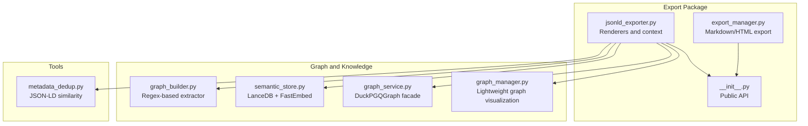
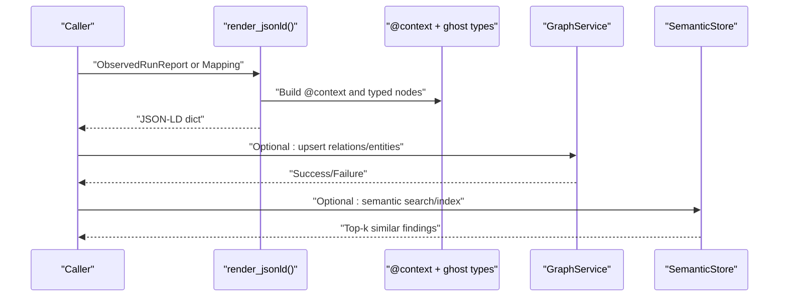
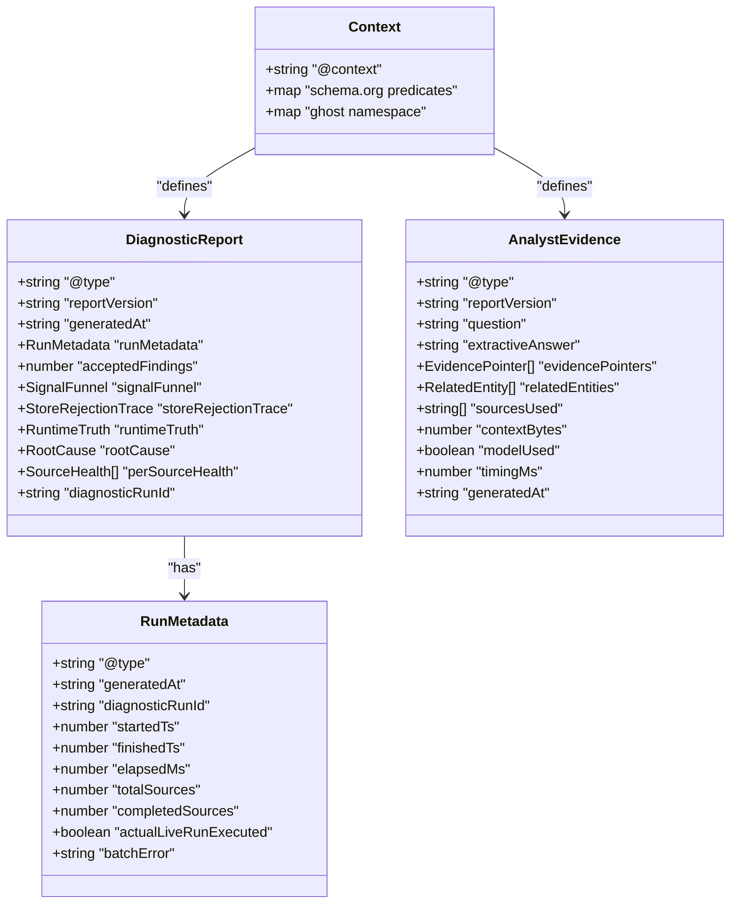
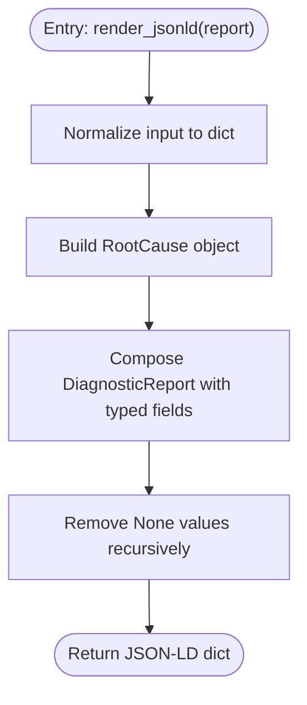
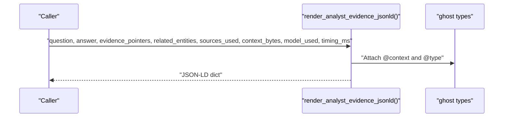
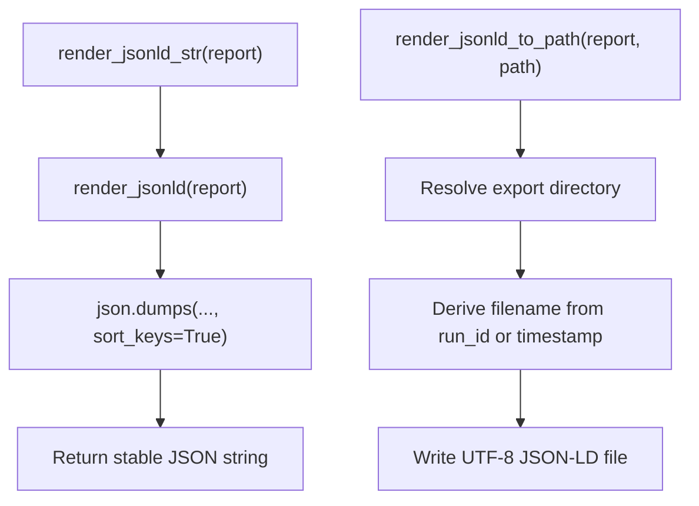
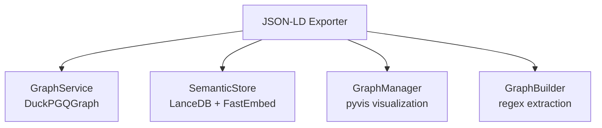
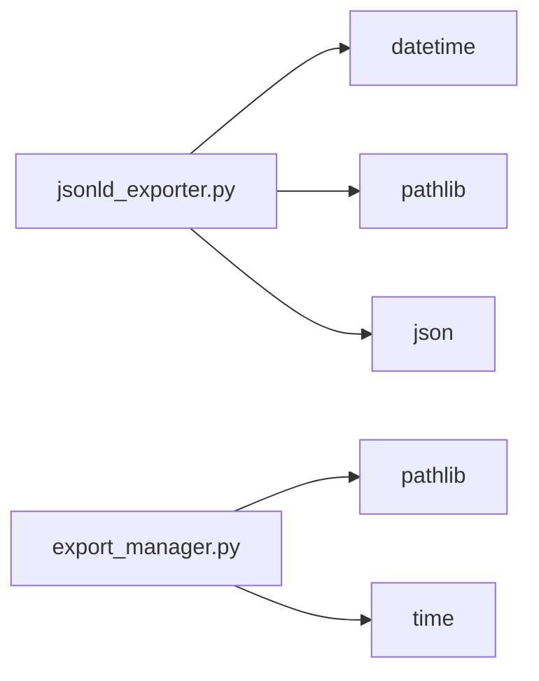

# JSON-LD Export

<cite>
**Referenced Files in This Document**
- [jsonld_exporter.py](file://export/jsonld_exporter.py)
- [__init__.py](file://export/__init__.py)
- [export_manager.py](file://export/export_manager.py)
- [graph_manager.py](file://graph/graph_manager.py)
- [graph_service.py](file://knowledge/graph_service.py)
- [semantic_store.py](file://knowledge/semantic_store.py)
- [graph_builder.py](file://knowledge/graph_builder.py)
- [metadata_dedup.py](file://tools/metadata_dedup.py)
</cite>

## Table of Contents
1. [Introduction](#introduction)
2. [Project Structure](#project-structure)
3. [Core Components](#core-components)
4. [Architecture Overview](#architecture-overview)
5. [Detailed Component Analysis](#detailed-component-analysis)
6. [Dependency Analysis](#dependency-analysis)
7. [Performance Considerations](#performance-considerations)
8. [Troubleshooting Guide](#troubleshooting-guide)
9. [Conclusion](#conclusion)
10. [Appendices](#appendices)

## Introduction
This document describes the JSON-LD export subsystem responsible for producing deterministic, schema-aligned, and graph-ready diagnostic reports. It explains RDF serialization, linked data principles, and semantic web integration, and shows how the system aligns with knowledge stores and graph databases. It covers configuration options for semantic enrichment, property mapping, and vocabulary alignment, and addresses common semantic issues, validation requirements, and performance considerations for large-scale exports.

## Project Structure
The JSON-LD export subsystem lives under the export package and integrates with knowledge and graph services. The main entry points are exposed via the export namespace and support rendering to dictionaries, strings, and files, as well as analyst evidence export.

**Diagram sources**
- [jsonld_exporter.py:1-505](file://export/jsonld_exporter.py#L1-L505)
- [__init__.py:1-47](file://export/__init__.py#L1-L47)
- [export_manager.py:1-298](file://export/export_manager.py#L1-L298)
- [graph_manager.py:1-256](file://graph/graph_manager.py#L1-L256)
- [graph_service.py:1-311](file://knowledge/graph_service.py#L1-L311)
- [semantic_store.py:1-301](file://knowledge/semantic_store.py#L1-L301)
- [graph_builder.py:1-235](file://knowledge/graph_builder.py#L1-L235)
- [metadata_dedup.py:206-238](file://tools/metadata_dedup.py#L206-L238)

**Section sources**
- [jsonld_exporter.py:1-505](file://export/jsonld_exporter.py#L1-L505)
- [__init__.py:1-47](file://export/__init__.py#L1-L47)

## Core Components
- JSON-LD context and vocabulary alignment: The exporter defines a context combining schema.org terms with a ghost namespace for domain-specific types and properties.
- Diagnostic report renderer: Converts ObservedRunReport (or Mapping) into a JSON-LD object with typed nodes and aligned properties.
- Analyst evidence renderer: Renders analyst answers and related entities as JSON-LD with ghost types.
- Output helpers: Deterministic JSON string rendering and file writing with environment-driven paths.
- Public API: Re-exports normalization and rendering functions for downstream consumers.

Key responsibilities:
- Deterministic serialization with sorted keys and stable filenames.
- Schema alignment using schema.org predicates and ghost types.
- Safe handling of timestamps, numeric types, and optional fields.

**Section sources**
- [jsonld_exporter.py:280-325](file://export/jsonld_exporter.py#L280-L325)
- [jsonld_exporter.py:405-504](file://export/jsonld_exporter.py#L405-L504)
- [jsonld_exporter.py:327-338](file://export/jsonld_exporter.py#L327-L338)
- [jsonld_exporter.py:343-399](file://export/jsonld_exporter.py#L343-L399)
- [__init__.py:5-25](file://export/__init__.py#L5-L25)

## Architecture Overview
The JSON-LD export subsystem produces structured, schema-aligned artifacts that integrate with downstream knowledge and graph systems. The diagram below shows how the JSON-LD renderer interacts with graph services and semantic stores.

**Diagram sources**
- [jsonld_exporter.py:280-325](file://export/jsonld_exporter.py#L280-L325)
- [graph_service.py:45-104](file://knowledge/graph_service.py#L45-L104)
- [semantic_store.py:158-214](file://knowledge/semantic_store.py#L158-L214)

## Detailed Component Analysis

### JSON-LD Context and Vocabulary Alignment
- Context composition: schema.org plus a ghost namespace for domain-specific types and properties.
- Property mapping: Aligns diagnostic fields to schema.org predicates (e.g., identifiers, numbers, booleans, URLs, dates).
- Ghost types: DiagnosticReport, RunMetadata, SignalFunnel, StoreRejectionTrace, RuntimeTruth, RootCause, SourceHealth, AnalystEvidence, EvidencePointer, RelatedEntity.

**Diagram sources**
- [jsonld_exporter.py:31-97](file://export/jsonld_exporter.py#L31-L97)
- [jsonld_exporter.py:280-325](file://export/jsonld_exporter.py#L280-L325)
- [jsonld_exporter.py:405-475](file://export/jsonld_exporter.py#L405-L475)

**Section sources**
- [jsonld_exporter.py:31-97](file://export/jsonld_exporter.py#L31-L97)
- [jsonld_exporter.py:181-239](file://export/jsonld_exporter.py#L181-L239)
- [jsonld_exporter.py:405-475](file://export/jsonld_exporter.py#L405-L475)

### Diagnostic Report Rendering Pipeline
- Input normalization: Accepts msgspec.Struct or Mapping and converts to dict.
- Typed object construction: Builds nested objects for run metadata, signal funnel, rejection trace, runtime truth, per-source health, and root cause.
- Deterministic output: Cleans None values and sorts keys for stable JSON.

**Diagram sources**
- [jsonld_exporter.py:280-325](file://export/jsonld_exporter.py#L280-L325)
- [jsonld_exporter.py:131-146](file://export/jsonld_exporter.py#L131-L146)
- [jsonld_exporter.py:265-274](file://export/jsonld_exporter.py#L265-L274)

**Section sources**
- [jsonld_exporter.py:280-325](file://export/jsonld_exporter.py#L280-L325)
- [jsonld_exporter.py:131-146](file://export/jsonld_exporter.py#L131-L146)

### Analyst Evidence Renderer
- Purpose: Produce analyst workbench evidence as JSON-LD with ghost types EvidencePointer and RelatedEntity.
- Fields: Question, extractive answer, evidence pointers, related entities, sources used, context bytes, model usage, timing, and generation timestamp.

**Diagram sources**
- [jsonld_exporter.py:405-475](file://export/jsonld_exporter.py#L405-L475)

**Section sources**
- [jsonld_exporter.py:405-475](file://export/jsonld_exporter.py#L405-L475)

### Output Helpers and Determinism
- String rendering: JSON dump with sorted keys for determinism.
- File writing: Environment-driven directory selection and deterministic filename generation based on run ID or timestamp.

**Diagram sources**
- [jsonld_exporter.py:327-338](file://export/jsonld_exporter.py#L327-L338)
- [jsonld_exporter.py:343-399](file://export/jsonld_exporter.py#L343-L399)

**Section sources**
- [jsonld_exporter.py:327-338](file://export/jsonld_exporter.py#L327-L338)
- [jsonld_exporter.py:343-399](file://export/jsonld_exporter.py#L343-L399)

### Integration with Knowledge Stores and Graph Databases
- GraphService: DuckPGQGraph-backed service for upserting IOCs and relations, with idempotency and bounded analytics.
- SemanticStore: LanceDB-backed semantic search using FastEmbed vectors; supports buffering, batch embedding, and ANN search.
- GraphManager: Lightweight visualization using networkx/pyvis; useful for exporting HTML graphs alongside JSON-LD diagnostics.
- GraphBuilder: Regex-based extractor that generates facts and relations; complements JSON-LD diagnostics by feeding structured triples into graph backends.

**Diagram sources**
- [graph_service.py:45-104](file://knowledge/graph_service.py#L45-L104)
- [semantic_store.py:158-214](file://knowledge/semantic_store.py#L158-L214)
- [graph_manager.py:172-255](file://graph/graph_manager.py#L172-L255)
- [graph_builder.py:67-101](file://knowledge/graph_builder.py#L67-L101)

**Section sources**
- [graph_service.py:45-104](file://knowledge/graph_service.py#L45-L104)
- [semantic_store.py:158-214](file://knowledge/semantic_store.py#L158-L214)
- [graph_manager.py:172-255](file://graph/graph_manager.py#L172-L255)
- [graph_builder.py:67-101](file://knowledge/graph_builder.py#L67-L101)

## Dependency Analysis
- Internal dependencies:
  - jsonld_exporter depends on datetime/timezone for timestamps and pathlib for file paths.
  - render_jsonld_to_path optionally uses environment variables and filesystem paths.
- External dependencies:
  - JSON-LD context relies on schema.org vocabularies.
  - Analyst evidence renderer uses datetime for generatedAt.
- Coupling:
  - Low coupling: renderers are stateless and side-effect-free.
  - Cohesion: All JSON-LD concerns are centralized in jsonld_exporter.

**Diagram sources**
- [jsonld_exporter.py:10-16](file://export/jsonld_exporter.py#L10-L16)
- [export_manager.py:16-19](file://export/export_manager.py#L16-L19)

**Section sources**
- [jsonld_exporter.py:10-16](file://export/jsonld_exporter.py#L10-L16)
- [export_manager.py:16-19](file://export/export_manager.py#L16-L19)

## Performance Considerations
- Deterministic rendering: Sorting keys ensures stable diffs and reproducible outputs.
- Minimal allocations: render_jsonld avoids unnecessary copies; cleaning removes None values to reduce payload size.
- File I/O: render_jsonld_to_path writes UTF-8 text and creates parent directories as needed.
- Large-scale exports:
  - Prefer streaming writes to disk rather than building very large in-memory strings.
  - Use environment-driven export directories to avoid filesystem contention.
  - For analyst evidence, keep evidence_pointers and related_entities bounded to control payload size.

[No sources needed since this section provides general guidance]

## Troubleshooting Guide
Common issues and resolutions:
- Invalid input type: normalize_export_input raises a TypeError for unsupported types; ensure the input is a msgspec.Struct, dict, or Mapping with keys.
- Missing run identifiers: render_jsonld_to_path falls back to timestamp-based filenames if run_id is absent; provide a diagnostic_run_id or run_id to get deterministic filenames.
- Timestamp conversion: _iso_timestamp handles invalid or missing timestamps gracefully by returning a placeholder; verify input timestamps are numeric.
- Sensitive data in exports: While JSON-LD export itself is side-effect-free, use ExportManager to filter sensitive fields when exporting Markdown or HTML alongside JSON-LD.

Validation requirements:
- JSON-LD validity: The @context and @type fields are always present; ensure downstream consumers accept the ghost namespace.
- Property presence: Some fields are optional; downstream consumers should handle missing values.
- Schema alignment: Properties map to schema.org predicates; verify downstream ingestion supports these predicates.

**Section sources**
- [jsonld_exporter.py:144-146](file://export/jsonld_exporter.py#L144-L146)
- [jsonld_exporter.py:378-394](file://export/jsonld_exporter.py#L378-L394)
- [jsonld_exporter.py:167-173](file://export/jsonld_exporter.py#L167-L173)
- [export_manager.py:25-44](file://export/export_manager.py#L25-L44)

## Conclusion
The JSON-LD export subsystem provides deterministic, schema-aligned diagnostic reports with a clear ghost namespace for domain-specific semantics. It integrates cleanly with graph services and semantic stores, enabling downstream ingestion and analytics. By leveraging environment-driven paths, deterministic rendering, and schema.org alignment, it supports reliable, large-scale exports suitable for knowledge graph pipelines.

[No sources needed since this section summarizes without analyzing specific files]

## Appendices

### Configuration Options and Best Practices
- Environment-driven export directory:
  - GHOST_EXPORT_DIR overrides default export location.
  - Falls back to a RAM disk path and then a temporary directory if unavailable.
- Deterministic filenames:
  - Use diagnostic_run_id or run_id when available; otherwise, timestamp-based names are generated.
- JSON-LD context customization:
  - Extend the context list to include additional vocabularies as needed.
  - Keep ghost types aligned with downstream consumers.
- Analyst evidence:
  - Limit evidence_pointers and related_entities sizes to maintain manageable payloads.
  - Ensure evidence pointers include sufficient provenance for traceability.

**Section sources**
- [jsonld_exporter.py:362-399](file://export/jsonld_exporter.py#L362-L399)
- [jsonld_exporter.py:31-97](file://export/jsonld_exporter.py#L31-L97)
- [jsonld_exporter.py:405-475](file://export/jsonld_exporter.py#L405-L475)

### Relationship with Knowledge Stores and Graph Databases
- GraphService:
  - Provides idempotent upserts and bounded analytics; use it to persist and query graph structures derived from JSON-LD diagnostics.
- SemanticStore:
  - Indexes findings for semantic search; complement JSON-LD diagnostics with vector search for retrieval.
- GraphManager:
  - Exports interactive HTML graphs; pair with JSON-LD for machine-readable diagnostics and human-readable visualizations.
- GraphBuilder:
  - Generates facts and relations from content; feed these into GraphService for long-term persistence.

**Section sources**
- [graph_service.py:45-104](file://knowledge/graph_service.py#L45-L104)
- [semantic_store.py:158-214](file://knowledge/semantic_store.py#L158-L214)
- [graph_manager.py:172-255](file://graph/graph_manager.py#L172-L255)
- [graph_builder.py:67-101](file://knowledge/graph_builder.py#L67-L101)

### Validation and Similarity Utilities
- JSON-LD similarity:
  - metadata_dedup includes JSON-LD type similarity checks; leverage this for deduplication strategies that consider types and predicates.

**Section sources**
- [metadata_dedup.py:206-238](file://tools/metadata_dedup.py#L206-L238)