# JSON-LD Exporter

<cite>
**Referenced Files in This Document**
- [jsonld_exporter.py](file://hledac/universal/export/jsonld_exporter.py)
- [__init__.py](file://hledac/universal/export/__init__.py)
- [export_manager.py](file://hledac/universal/export/export_manager.py)
- [paths.py](file://hledac/universal/paths.py)
- [README.md](file://hledac/universal/README.md)
- [entity_linker.py](file://hledac/universal/knowledge/entity_linker.py)
- [graph_builder.py](file://hledac/universal/knowledge/graph_builder.py)
- [graph_service.py](file://hledac/universal/knowledge/graph_service.py)
- [graph_manager.py](file://hledac/universal/graph/graph_manager.py)
- [validation.py](file://hledac/universal/utils/validation.py)
- [metadata_dedup.py](file://hledac/universal/tools/metadata_dedup.py)
</cite>

## Table of Contents
1. [Introduction](#introduction)
2. [Project Structure](#project-structure)
3. [Core Components](#core-components)
4. [Architecture Overview](#architecture-overview)
5. [Detailed Component Analysis](#detailed-component-analysis)
6. [Dependency Analysis](#dependency-analysis)
7. [Performance Considerations](#performance-considerations)
8. [Troubleshooting Guide](#troubleshooting-guide)
9. [Conclusion](#conclusion)
10. [Appendices](#appendices)

## Introduction
This document describes the JSON-LD semantic data exporter for the Hledac universal platform. It explains how research data is transformed into RDF/JSON-LD for knowledge graph representation, including entity typing, relationship mapping, and context definition. It covers schema.org compatibility, custom ghost vocabulary, data enrichment via Wikidata, validation against schemas, and practical guidance for large-scale export, streaming, and integration with semantic search and graph databases.

## Project Structure
The JSON-LD exporter resides in the export package and integrates with runtime paths, knowledge graph services, and validation utilities. The export package exposes rendering functions for diagnostic reports and analyst evidence, while the broader runtime system manages paths and output locations.

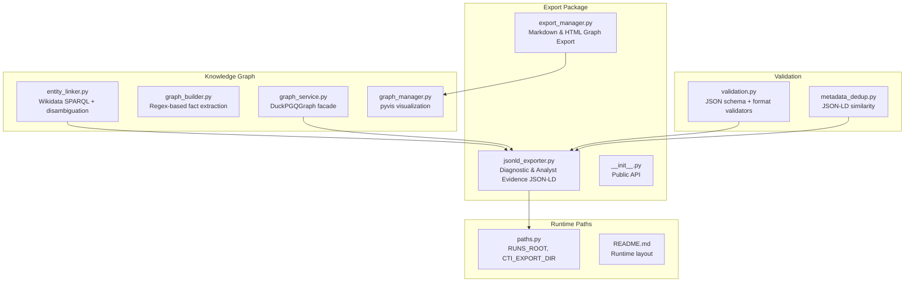

**Diagram sources**
- [jsonld_exporter.py:1-501](file://hledac/universal/export/jsonld_exporter.py#L1-L501)
- [export_manager.py:1-300](file://hledac/universal/export/export_manager.py#L1-L300)
- [paths.py:260-324](file://hledac/universal/paths.py#L260-L324)
- [README.md:1-48](file://hledac/universal/README.md#L1-L48)
- [entity_linker.py:1-936](file://hledac/universal/knowledge/entity_linker.py#L1-L936)
- [graph_builder.py:1-235](file://hledac/universal/knowledge/graph_builder.py#L1-L235)
- [graph_service.py:1-311](file://hledac/universal/knowledge/graph_service.py#L1-L311)
- [graph_manager.py:1-256](file://hledac/universal/graph/graph_manager.py#L1-L256)
- [validation.py:1-656](file://hledac/universal/utils/validation.py#L1-L656)
- [metadata_dedup.py:206-238](file://hledac/universal/tools/metadata_dedup.py#L206-L238)

**Section sources**
- [jsonld_exporter.py:1-501](file://hledac/universal/export/jsonld_exporter.py#L1-L501)
- [__init__.py:1-47](file://hledac/universal/export/__init__.py#L1-L47)
- [paths.py:260-324](file://hledac/universal/paths.py#L260-L324)
- [README.md:1-48](file://hledac/universal/README.md#L1-L48)

## Core Components
- JSON-LD Renderer: Converts structured research data into deterministic JSON-LD with schema.org compatibility and a custom ghost namespace.
- Analyst Evidence Exporter: Renders analyst answers and supporting evidence as JSON-LD for knowledge graph ingestion.
- Runtime Path Management: Determines output directories and filenames for exports.
- Knowledge Graph Integration: Links entities to Wikidata and builds facts for graph enrichment.
- Validation Utilities: Provides JSON schema and format validation for export quality assurance.

**Section sources**
- [jsonld_exporter.py:280-396](file://hledac/universal/export/jsonld_exporter.py#L280-L396)
- [jsonld_exporter.py:401-500](file://hledac/universal/export/jsonld_exporter.py#L401-L500)
- [paths.py:260-324](file://hledac/universal/paths.py#L260-L324)
- [entity_linker.py:672-740](file://hledac/universal/knowledge/entity_linker.py#L672-L740)
- [validation.py:215-312](file://hledac/universal/utils/validation.py#L215-L312)

## Architecture Overview
The exporter transforms research data into a standardized JSON-LD structure that aligns with schema.org and extends it with a ghost namespace. The resulting documents can be ingested into graph stores, searched via semantic engines, and visualized interactively.

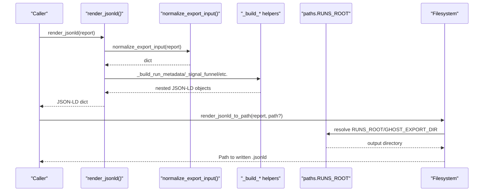

**Diagram sources**
- [jsonld_exporter.py:280-396](file://hledac/universal/export/jsonld_exporter.py#L280-L396)
- [jsonld_exporter.py:343-395](file://hledac/universal/export/jsonld_exporter.py#L343-L395)
- [paths.py:260-282](file://hledac/universal/paths.py#L260-L282)

## Detailed Component Analysis

### JSON-LD Context and Schema.org Compatibility
- The exporter defines a JSON-LD @context combining schema.org terms with a ghost namespace for domain-specific types and properties.
- Types such as DiagnosticReport, SoftwareSourceCode, DataFeed, Person, Organization, and WebContent are mapped to schema.org equivalents.
- Ghost types include RunMetadata, SignalFunnel, StoreRejectionTrace, RuntimeTruth, SourceHealth, RootCause, and AnalystEvidence.

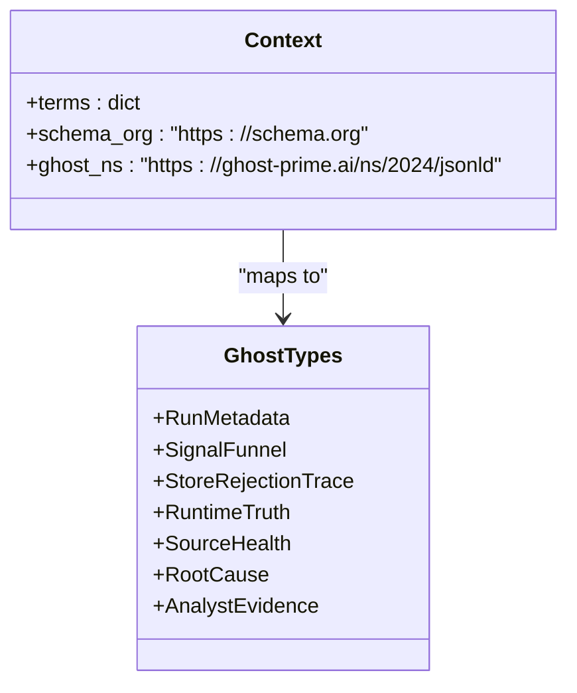

**Diagram sources**
- [jsonld_exporter.py:31-97](file://hledac/universal/export/jsonld_exporter.py#L31-L97)

**Section sources**
- [jsonld_exporter.py:31-97](file://hledac/universal/export/jsonld_exporter.py#L31-L97)

### Diagnostic Report Rendering
- Input normalization supports both msgspec.Struct and Mapping objects.
- The renderer constructs nested objects for run metadata, signal funnel statistics, rejection traces, runtime truth, root cause analysis, and per-source health.
- Timestamps are normalized to ISO 8601 UTC; strings are sanitized; null values are removed for compactness.

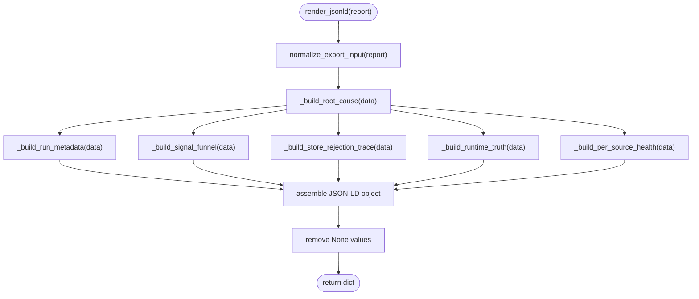

**Diagram sources**
- [jsonld_exporter.py:280-324](file://hledac/universal/export/jsonld_exporter.py#L280-L324)
- [jsonld_exporter.py:181-262](file://hledac/universal/export/jsonld_exporter.py#L181-L262)

**Section sources**
- [jsonld_exporter.py:131-146](file://hledac/universal/export/jsonld_exporter.py#L131-L146)
- [jsonld_exporter.py:181-262](file://hledac/universal/export/jsonld_exporter.py#L181-L262)
- [jsonld_exporter.py:280-324](file://hledac/universal/export/jsonld_exporter.py#L280-L324)

### Analyst Evidence Exporter
- Renders analyst answers with evidence pointers and related entities.
- Evidence pointers capture finding identifiers, source types, queries, confidence, timestamps, provenance, and optional snippets.
- Related entities include entity values, types, confidence, hop distances, and relation types.

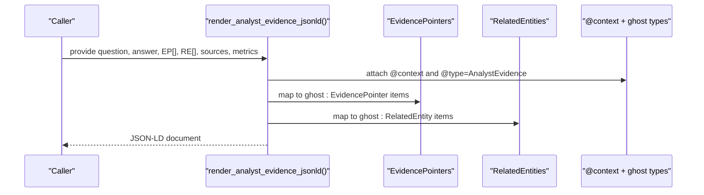

**Diagram sources**
- [jsonld_exporter.py:401-471](file://hledac/universal/export/jsonld_exporter.py#L401-L471)

**Section sources**
- [jsonld_exporter.py:401-500](file://hledac/universal/export/jsonld_exporter.py#L401-L500)

### Output Path Resolution and Deterministic Filenames
- If no explicit path is provided, the exporter resolves output to either GHOST_EXPORT_DIR (backward-compatible override) or RUNS_ROOT.
- Filenames are deterministic: ghost_diagnostic_{run_id}.jsonld or ghost_diagnostic_{timestamp}.jsonld, with forward slashes replaced to ensure filesystem compatibility.

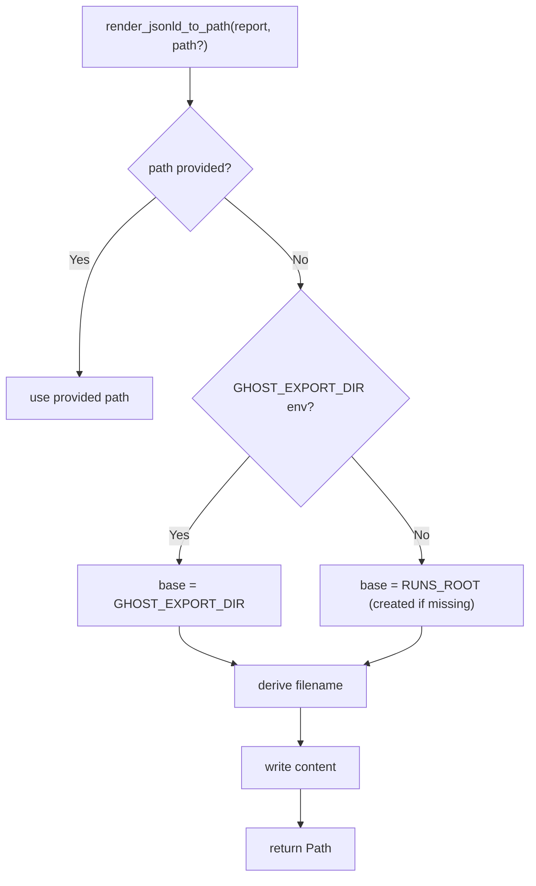

**Diagram sources**
- [jsonld_exporter.py:343-395](file://hledac/universal/export/jsonld_exporter.py#L343-L395)
- [paths.py:260-282](file://hledac/universal/paths.py#L260-L282)

**Section sources**
- [jsonld_exporter.py:343-395](file://hledac/universal/export/jsonld_exporter.py#L343-L395)
- [paths.py:260-282](file://hledac/universal/paths.py#L260-L282)

### Knowledge Graph Enrichment and Entity Linking
- Entities can be linked to Wikidata via SPARQL queries with context-aware disambiguation and caching.
- The linker supports GLiNER-based NER with regex fallback, computes context similarity, and ranks candidates by popularity and context fit.

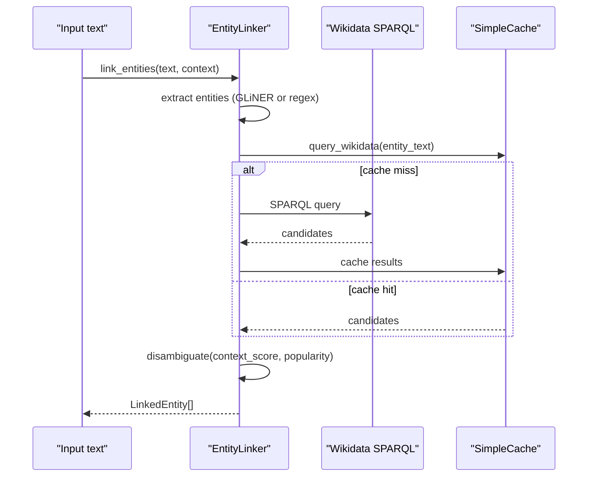

**Diagram sources**
- [entity_linker.py:672-740](file://hledac/universal/knowledge/entity_linker.py#L672-L740)
- [entity_linker.py:473-521](file://hledac/universal/knowledge/entity_linker.py#L473-L521)
- [entity_linker.py:617-670](file://hledac/universal/knowledge/entity_linker.py#L617-L670)

**Section sources**
- [entity_linker.py:672-740](file://hledac/universal/knowledge/entity_linker.py#L672-L740)
- [entity_linker.py:473-521](file://hledac/universal/knowledge/entity_linker.py#L473-L521)
- [entity_linker.py:617-670](file://hledac/universal/knowledge/entity_linker.py#L617-L670)

### Graph Construction and Fact Extraction
- Regex-based extraction identifies relations such as is_a, causes, located_in, part_of, and contains.
- Facts are transformed into nodes and edges and can be persisted via the graph service facade.

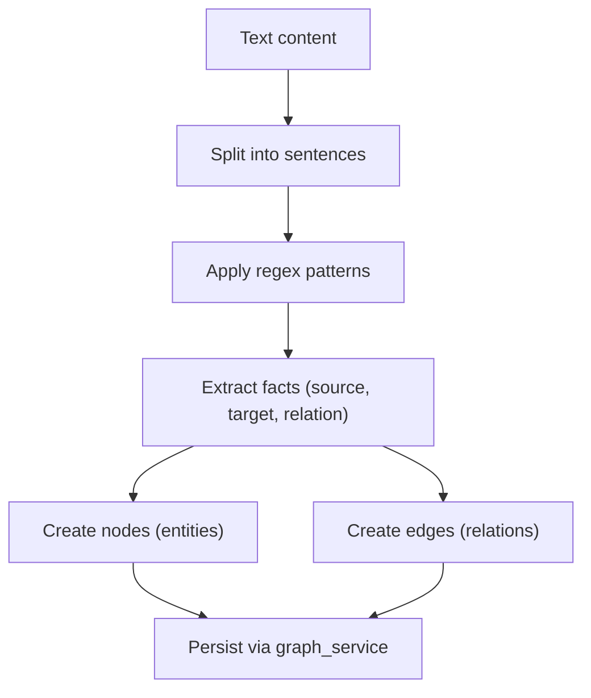

**Diagram sources**
- [graph_builder.py:67-101](file://hledac/universal/knowledge/graph_builder.py#L67-L101)
- [graph_builder.py:117-203](file://hledac/universal/knowledge/graph_builder.py#L117-L203)

**Section sources**
- [graph_builder.py:67-101](file://hledac/universal/knowledge/graph_builder.py#L67-L101)
- [graph_builder.py:117-203](file://hledac/universal/knowledge/graph_builder.py#L117-L203)

### Graph Analytics and Visualization
- DuckPGQGraph-backed analytics provide centrality estimates and community counts for bounded sampling.
- GraphManager supports lightweight visualization via pyvis with color-coded entity types and edge labels.

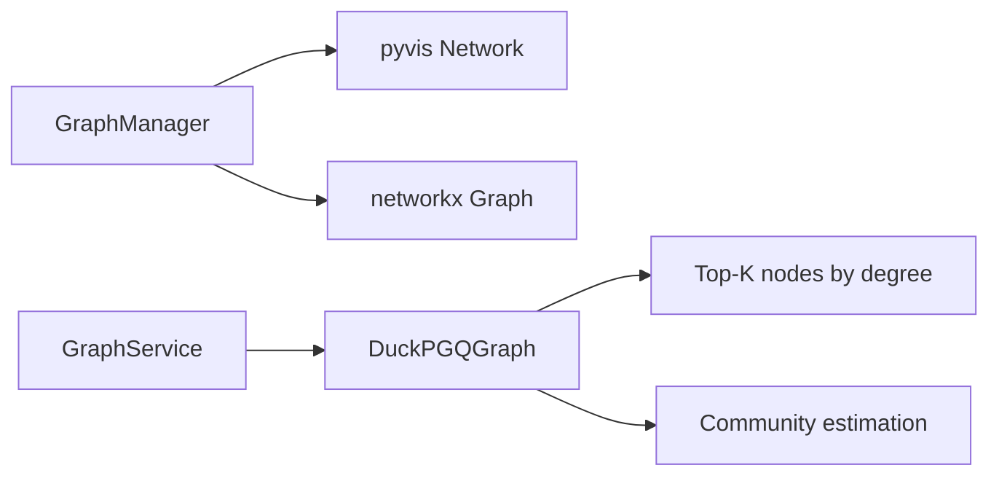

**Diagram sources**
- [graph_manager.py:172-255](file://hledac/universal/graph/graph_manager.py#L172-L255)
- [graph_service.py:194-252](file://hledac/universal/knowledge/graph_service.py#L194-L252)

**Section sources**
- [graph_manager.py:172-255](file://hledac/universal/graph/graph_manager.py#L172-L255)
- [graph_service.py:194-252](file://hledac/universal/knowledge/graph_service.py#L194-L252)

### Data Validation Against Schemas
- The validator checks required fields, types, and formats (email, URI) and aggregates structured errors with severity levels.
- Results include counts of errors, warnings, and critical issues, enabling deterministic quality gates for exports.

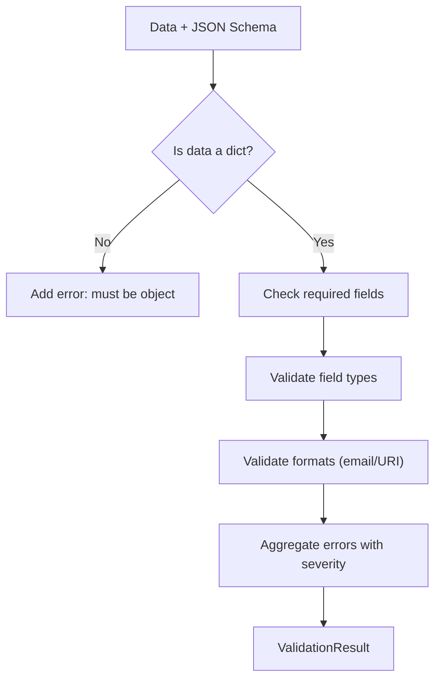

**Diagram sources**
- [validation.py:215-312](file://hledac/universal/utils/validation.py#L215-L312)

**Section sources**
- [validation.py:215-312](file://hledac/universal/utils/validation.py#L215-L312)

## Dependency Analysis
The JSON-LD exporter depends on:
- Runtime path resolution for output directories.
- Optional graph services for enrichment and analytics.
- Validation utilities for schema compliance.
- Entity linking for canonicalization and disambiguation.

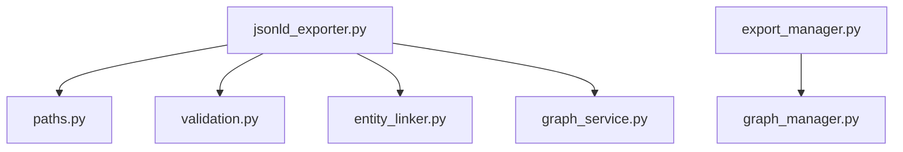

**Diagram sources**
- [jsonld_exporter.py:366-368](file://hledac/universal/export/jsonld_exporter.py#L366-L368)
- [paths.py:260-282](file://hledac/universal/paths.py#L260-L282)
- [validation.py:215-312](file://hledac/universal/utils/validation.py#L215-L312)
- [entity_linker.py:672-740](file://hledac/universal/knowledge/entity_linker.py#L672-L740)
- [graph_service.py:33-42](file://hledac/universal/knowledge/graph_service.py#L33-L42)
- [export_manager.py:202-287](file://hledac/universal/export/export_manager.py#L202-L287)
- [graph_manager.py:172-255](file://hledac/universal/graph/graph_manager.py#L172-L255)

**Section sources**
- [jsonld_exporter.py:366-368](file://hledac/universal/export/jsonld_exporter.py#L366-L368)
- [paths.py:260-282](file://hledac/universal/paths.py#L260-L282)
- [validation.py:215-312](file://hledac/universal/utils/validation.py#L215-L312)
- [entity_linker.py:672-740](file://hledac/universal/knowledge/entity_linker.py#L672-L740)
- [graph_service.py:33-42](file://hledac/universal/knowledge/graph_service.py#L33-L42)
- [export_manager.py:202-287](file://hledac/universal/export/export_manager.py#L202-L287)
- [graph_manager.py:172-255](file://hledac/universal/graph/graph_manager.py#L172-L255)

## Performance Considerations
- Deterministic output: Sorting keys and removing nulls ensures stable, diff-friendly JSON-LD.
- Lightweight dependencies: The exporter avoids heavy NLP models; entity linking is optional and can fall back to regex.
- Streaming-friendly design: The renderer produces dictionaries suitable for incremental writing or chunked export.
- Caching: Entity linking caches SPARQL responses to reduce network overhead.
- Memory constraints: Graph visualization and analytics are bounded to preserve performance on constrained hardware.

[No sources needed since this section provides general guidance]

## Troubleshooting Guide
Common issues and resolutions:
- Invalid input types: Ensure the report is a msgspec.Struct or Mapping; otherwise normalization raises a TypeError.
- Missing output directory: RUNS_ROOT is created automatically; if using GHOST_EXPORT_DIR, verify the environment variable is set.
- Entity linking failures: Check network availability for Wikidata SPARQL and confirm aiohttp installation; fallback to regex-based NER is automatic.
- Validation errors: Review ValidationResult error arrays for required fields, type mismatches, and format violations.

**Section sources**
- [jsonld_exporter.py:144-146](file://hledac/universal/export/jsonld_exporter.py#L144-L146)
- [jsonld_exporter.py:362-368](file://hledac/universal/export/jsonld_exporter.py#L362-L368)
- [entity_linker.py:364-375](file://hledac/universal/knowledge/entity_linker.py#L364-L375)
- [validation.py:215-312](file://hledac/universal/utils/validation.py#L215-L312)

## Conclusion
The JSON-LD exporter provides a deterministic, schema.org-aligned mechanism to transform research diagnostics and analyst evidence into graph-ready RDF/JSON-LD. By integrating with entity linking, graph services, and validation utilities, it enables downstream semantic search, knowledge graph construction, and visualization workflows. The design emphasizes zero-dependency rendering, optional enrichment, and robust output path management for reliable large-scale operation.

[No sources needed since this section summarizes without analyzing specific files]

## Appendices

### A. Semantic Queries and SPARQL Integration
- Use the entity linker’s SPARQL queries to enrich entities with Wikidata labels, descriptions, and types.
- Apply context-aware disambiguation to select canonical entities for knowledge graph nodes.

**Section sources**
- [entity_linker.py:440-471](file://hledac/universal/knowledge/entity_linker.py#L440-L471)
- [entity_linker.py:617-670](file://hledac/universal/knowledge/entity_linker.py#L617-L670)

### B. Knowledge Graph Visualization
- Export interactive HTML graphs using GraphManager and pyvis, with color-coded entity types and relation labels.

**Section sources**
- [graph_manager.py:172-255](file://hledac/universal/graph/graph_manager.py#L172-L255)

### C. Data Validation and Quality Gates
- Validate JSON-LD documents against JSON schemas to enforce required fields, types, and formats before export.

**Section sources**
- [validation.py:215-312](file://hledac/universal/utils/validation.py#L215-L312)

### D. Compression and Streaming Export
- For large datasets, stream JSON-LD objects to disk or pipe to downstream processors. The renderer emits dictionaries suitable for chunked serialization.

**Section sources**
- [jsonld_exporter.py:327-337](file://hledac/universal/export/jsonld_exporter.py#L327-L337)

### E. Integration with Graph Databases
- Use the graph service facade to upsert entities and relations into DuckPGQGraph for analytics and pathfinding.
- Build facts from extracted content to populate the knowledge graph incrementally.

**Section sources**
- [graph_service.py:45-104](file://hledac/universal/knowledge/graph_service.py#L45-L104)
- [graph_builder.py:117-203](file://hledac/universal/knowledge/graph_builder.py#L117-L203)