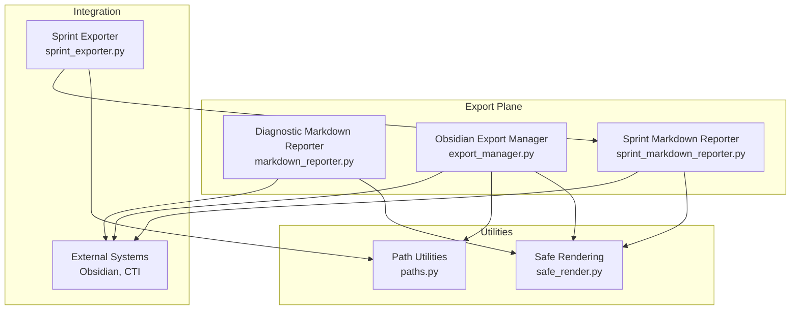
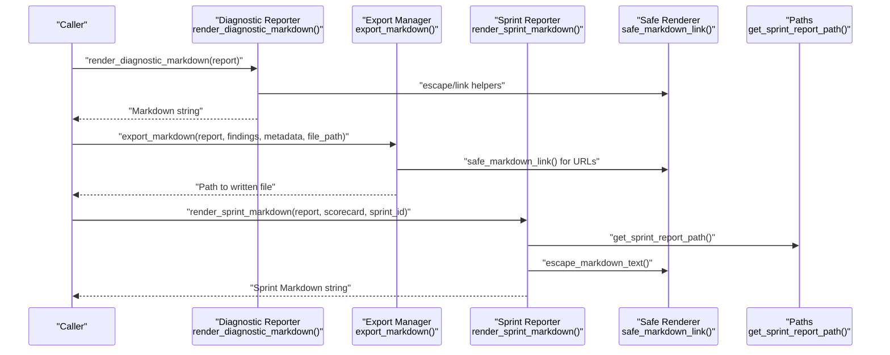
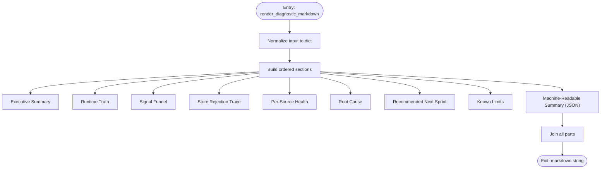
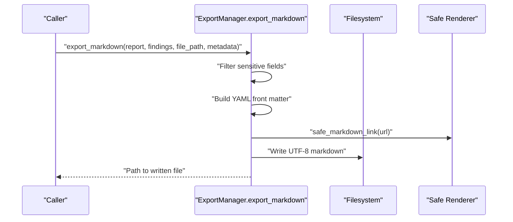
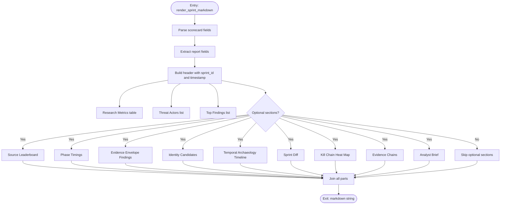
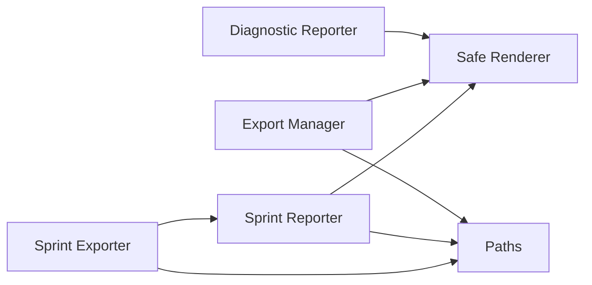

# Markdown Reporting

<cite>
**Referenced Files in This Document**
- [markdown_reporter.py](file://hledac/universal/export/markdown_reporter.py)
- [sprint_markdown_reporter.py](file://hledac/universal/export/sprint_markdown_reporter.py)
- [export_manager.py](file://hledac/universal/export/export_manager.py)
- [safe_render.py](file://hledac/universal/utils/safe_render.py)
- [paths.py](file://hledac/universal/paths.py)
- [sprint_exporter.py](file://hledac/universal/export/sprint_exporter.py)
- [05-final-report.md](file://hledac/universal/.full-review-2026-04-23/05-final-report.md)
- [01A-quality-findings.md](file://hledac/universal/.full-review-2026-04-23/01A-quality-findings.md)
</cite>

## Table of Contents
1. [Introduction](#introduction)
2. [Project Structure](#project-structure)
3. [Core Components](#core-components)
4. [Architecture Overview](#architecture-overview)
5. [Detailed Component Analysis](#detailed-component-analysis)
6. [Dependency Analysis](#dependency-analysis)
7. [Performance Considerations](#performance-considerations)
8. [Troubleshooting Guide](#troubleshooting-guide)
9. [Conclusion](#conclusion)
10. [Appendices](#appendices)

## Introduction
This document describes the Markdown reporting system used across the project’s export plane. It covers:
- The deterministic diagnostic reporter for ObservedRunReport
- The Obsidian-compatible export manager with YAML front matter and wikilink formatting
- The sprint-specific markdown reporter for automated reporting cycles
- Formatting options, safety mechanisms, and integration with external note-taking systems

The goal is to help both technical and non-technical users understand how reports are structured, how to customize metadata, and how to integrate with tools like Obsidian and external CTI systems.

## Project Structure
The Markdown reporting system is organized around three primary modules:
- Diagnostic markdown reporter for run diagnostics
- Obsidian-compatible export manager for general reports and findings
- Sprint markdown reporter for automated sprint reporting and enrichment

**Diagram sources**
- [markdown_reporter.py:1-487](file://hledac/universal/export/markdown_reporter.py#L1-L487)
- [export_manager.py:1-300](file://hledac/universal/export/export_manager.py#L1-L300)
- [sprint_markdown_reporter.py:1-889](file://hledac/universal/export/sprint_markdown_reporter.py#L1-L889)
- [safe_render.py:1-119](file://hledac/universal/utils/safe_render.py#L1-L119)
- [paths.py:1-591](file://hledac/universal/paths.py#L1-L591)
- [sprint_exporter.py:1-3546](file://hledac/universal/export/sprint_exporter.py#L1-L3546)

**Section sources**
- [markdown_reporter.py:1-487](file://hledac/universal/export/markdown_reporter.py#L1-L487)
- [export_manager.py:1-300](file://hledac/universal/export/export_manager.py#L1-L300)
- [sprint_markdown_reporter.py:1-889](file://hledac/universal/export/sprint_markdown_reporter.py#L1-L889)
- [safe_render.py:1-119](file://hledac/universal/utils/safe_render.py#L1-L119)
- [paths.py:1-591](file://hledac/universal/paths.py#L1-L591)
- [sprint_exporter.py:1-3546](file://hledac/universal/export/sprint_exporter.py#L1-L3546)

## Core Components
- Diagnostic Markdown Reporter: Renders ObservedRunReport into a deterministic, side-effect-free markdown string with standardized sections and machine-readable summaries.
- Obsidian Export Manager: Produces Obsidian-compatible markdown with YAML front matter, optional findings list, and wikilink formatting.
- Sprint Markdown Reporter: Builds comprehensive sprint reports from report and scorecard data, including optional enrichment sections (evidence envelopes, timelines, kill chain heat maps, etc.).

Key capabilities:
- Deterministic rendering with stable ordering and normalization
- Obsidian-compatible formatting (wikilinks, YAML front matter)
- Safe markdown rendering with escaping and link validation
- Path semantics for canonical report locations
- Optional enrichment for analyst briefs, evidence chains, and more

**Section sources**
- [markdown_reporter.py:389-425](file://hledac/universal/export/markdown_reporter.py#L389-L425)
- [export_manager.py:90-201](file://hledac/universal/export/export_manager.py#L90-L201)
- [sprint_markdown_reporter.py:144-281](file://hledac/universal/export/sprint_markdown_reporter.py#L144-L281)

## Architecture Overview
The system separates concerns across modules:
- Normalization and rendering for diagnostic reports
- Obsidian export with metadata and findings
- Sprint reporting with enrichment and canonical paths
- Safe rendering utilities for markdown and links
- Path utilities for canonical locations

**Diagram sources**
- [markdown_reporter.py:389-425](file://hledac/universal/export/markdown_reporter.py#L389-L425)
- [export_manager.py:90-201](file://hledac/universal/export/export_manager.py#L90-L201)
- [sprint_markdown_reporter.py:144-281](file://hledac/universal/export/sprint_markdown_reporter.py#L144-L281)
- [safe_render.py:79-102](file://hledac/universal/utils/safe_render.py#L79-L102)
- [paths.py:326-343](file://hledac/universal/paths.py#L326-L343)

## Detailed Component Analysis

### Diagnostic Markdown Reporter
Purpose:
- Accepts an ObservedRunReport (msgspec.Struct or Mapping) and renders a deterministic markdown report.

Key behaviors:
- Input normalization converts Struct or Mapping to dict
- Sections include Run Metadata, Executive Summary, Runtime Truth, Signal Funnel, Store Rejection Trace, Per-Source Health, Root Cause, Recommended Next Sprint, Known Limits, and Machine-Readable Summary
- Deterministic ordering and sorting for stability
- Optional machine-readable JSON block appended at the end

Parameters and behavior:
- render_diagnostic_markdown(report): returns markdown string
- render_diagnostic_markdown_to_path(report, path=None): writes to file with deterministic filename logic

Formatting highlights:
- Escaping for inline code and markdown special characters
- Linkification for URLs and file paths
- Ordered rendering of nested dictionaries and lists

**Diagram sources**
- [markdown_reporter.py:389-425](file://hledac/universal/export/markdown_reporter.py#L389-L425)
- [markdown_reporter.py:142-383](file://hledac/universal/export/markdown_reporter.py#L142-L383)

**Section sources**
- [markdown_reporter.py:65-82](file://hledac/universal/export/markdown_reporter.py#L65-L82)
- [markdown_reporter.py:87-136](file://hledac/universal/export/markdown_reporter.py#L87-L136)
- [markdown_reporter.py:142-383](file://hledac/universal/export/markdown_reporter.py#L142-L383)
- [markdown_reporter.py:389-425](file://hledac/universal/export/markdown_reporter.py#L389-L425)
- [markdown_reporter.py:431-487](file://hledac/universal/export/markdown_reporter.py#L431-L487)

### Obsidian Export Manager
Purpose:
- Produce Obsidian-compatible markdown with YAML front matter and optional findings list.

Parameters:
- export_markdown(report, findings=None, file_path=None, metadata=None)

Behavior:
- Ensures output path is within a controlled output directory
- Builds YAML front matter with title, date, sources, tags, and filtered metadata
- Adds report content and findings section
- Finds are rendered as bullet lists with Obsidian-style wikilinks for URLs
- Confidence and provenance are included when available

Formatting and safety:
- Filters sensitive fields from metadata and findings
- Uses safe_markdown_link for URLs
- Limits sources and tags arrays and findings count

**Diagram sources**
- [export_manager.py:90-201](file://hledac/universal/export/export_manager.py#L90-L201)
- [safe_render.py:79-102](file://hledac/universal/utils/safe_render.py#L79-L102)

**Section sources**
- [export_manager.py:90-201](file://hledac/universal/export/export_manager.py#L90-L201)
- [safe_render.py:79-102](file://hledac/universal/utils/safe_render.py#L79-L102)

### Sprint Markdown Reporter
Purpose:
- Render sprint reports from report and scorecard data with optional enrichment.

Parameters:
- render_sprint_markdown(report, scorecard, sprint_id)

Behavior:
- Extracts research metrics, threat actors, top findings, and optional sections
- Parses JSON fields safely using centralized JSON parsing helper
- Renders optional sections: Source Leaderboard, Phase Timings, Evidence Envelope Findings, Identity Candidates, Temporal Archaeology Timeline, Sprint Diff, Kill Chain Heat Map, Evidence Chains, Analyst Brief

Formatting highlights:
- Uses escape_markdown_text for safe text rendering
- Tables for metrics and leaderboards
- Bounded displays for large datasets

**Diagram sources**
- [sprint_markdown_reporter.py:144-281](file://hledac/universal/export/sprint_markdown_reporter.py#L144-L281)
- [sprint_markdown_reporter.py:288-417](file://hledac/universal/export/sprint_markdown_reporter.py#L288-L417)
- [sprint_markdown_reporter.py:423-485](file://hledac/universal/export/sprint_markdown_reporter.py#L423-L485)
- [sprint_markdown_reporter.py:491-588](file://hledac/universal/export/sprint_markdown_reporter.py#L491-L588)
- [sprint_markdown_reporter.py:594-707](file://hledac/universal/export/sprint_markdown_reporter.py#L594-L707)
- [sprint_markdown_reporter.py:713-755](file://hledac/universal/export/sprint_markdown_reporter.py#L713-L755)
- [sprint_markdown_reporter.py:800-819](file://hledac/universal/export/sprint_markdown_reporter.py#L800-L819)
- [sprint_markdown_reporter.py:824-889](file://hledac/universal/export/sprint_markdown_reporter.py#L824-L889)

**Section sources**
- [sprint_markdown_reporter.py:144-281](file://hledac/universal/export/sprint_markdown_reporter.py#L144-L281)
- [sprint_markdown_reporter.py:39-56](file://hledac/universal/export/sprint_markdown_reporter.py#L39-L56)
- [sprint_markdown_reporter.py:288-417](file://hledac/universal/export/sprint_markdown_reporter.py#L288-L417)
- [sprint_markdown_reporter.py:423-485](file://hledac/universal/export/sprint_markdown_reporter.py#L423-L485)
- [sprint_markdown_reporter.py:491-588](file://hledac/universal/export/sprint_markdown_reporter.py#L491-L588)
- [sprint_markdown_reporter.py:594-707](file://hledac/universal/export/sprint_markdown_reporter.py#L594-L707)
- [sprint_markdown_reporter.py:713-755](file://hledac/universal/export/sprint_markdown_reporter.py#L713-L755)
- [sprint_markdown_reporter.py:800-819](file://hledac/universal/export/sprint_markdown_reporter.py#L800-L819)
- [sprint_markdown_reporter.py:824-889](file://hledac/universal/export/sprint_markdown_reporter.py#L824-L889)

### Safe Rendering Utilities
Purpose:
- Provide safe text and link rendering to prevent markdown injection and ensure Obsidian compatibility.

Capabilities:
- escape_markdown_text: escapes special markdown characters
- safe_markdown_link: validates schemes, escapes labels, and percent-encodes parentheses
- safe_code_fence: escapes backticks for fenced code blocks

**Section sources**
- [safe_render.py:42-54](file://hledac/universal/utils/safe_render.py#L42-L54)
- [safe_render.py:79-102](file://hledac/universal/utils/safe_render.py#L79-L102)
- [safe_render.py:108-119](file://hledac/universal/utils/safe_render.py#L108-L119)

### Path Semantics and File Output
Purpose:
- Provide canonical paths for diagnostic and sprint reports.

Highlights:
- RUNS_ROOT for diagnostic markdown files
- get_sprint_report_path() for sprint reports under ~/.hledac/reports/
- get_sprint_json_report_path() and get_sprint_next_seeds_path() for related artifacts

**Section sources**
- [paths.py:266-283](file://hledac/universal/paths.py#L266-L283)
- [paths.py:326-343](file://hledac/universal/paths.py#L326-L343)
- [paths.py:345-363](file://hledac/universal/paths.py#L345-L363)
- [paths.py:365-385](file://hledac/universal/paths.py#L365-L385)

### Integration with External Note-Taking Systems
- Obsidian-compatible formatting:
  - YAML front matter with title, date, sources, tags
  - Wikilinks for URLs and file paths
  - Deterministic filenames and directories
- Integration points:
  - ExportManager writes to ~/hledac_outputs/
  - Sprint reporter writes to ~/.hledac/reports/

**Section sources**
- [export_manager.py:90-201](file://hledac/universal/export/export_manager.py#L90-L201)
- [paths.py:326-343](file://hledac/universal/paths.py#L326-L343)

### Example Reports and Templates
- Comprehensive review report template with executive summary, findings tables, and remediation guidance
- Quality review findings with severity ratings and fix examples

These examples illustrate:
- Obsidian-friendly structure with YAML front matter
- Markdown tables and lists
- Sectioned presentation of findings and recommendations

**Section sources**
- [05-final-report.md:1-216](file://hledac/universal/.full-review-2026-04-23/05-final-report.md#L1-L216)
- [01A-quality-findings.md:1-630](file://hledac/universal/.full-review-2026-04-23/01A-quality-findings.md#L1-L630)

## Dependency Analysis
Relationships between components:
- Diagnostic reporter depends on safe_render for escaping and linkification
- Export manager depends on safe_render for URLs and on paths for canonical locations
- Sprint reporter depends on safe_render for text and on paths for report location
- Sprint exporter coordinates with sprint reporter and paths for artifact creation

**Diagram sources**
- [markdown_reporter.py:17-18](file://hledac/universal/export/markdown_reporter.py#L17-L18)
- [export_manager.py](file://hledac/universal/export/export_manager.py#L21)
- [sprint_markdown_reporter.py](file://hledac/universal/export/sprint_markdown_reporter.py#L29)
- [paths.py:326-343](file://hledac/universal/paths.py#L326-L343)
- [sprint_exporter.py:1-3546](file://hledac/universal/export/sprint_exporter.py#L1-L3546)

**Section sources**
- [markdown_reporter.py:1-487](file://hledac/universal/export/markdown_reporter.py#L1-L487)
- [export_manager.py:1-300](file://hledac/universal/export/export_manager.py#L1-L300)
- [sprint_markdown_reporter.py:1-889](file://hledac/universal/export/sprint_markdown_reporter.py#L1-L889)
- [paths.py:1-591](file://hledac/universal/paths.py#L1-L591)
- [sprint_exporter.py:1-3546](file://hledac/universal/export/sprint_exporter.py#L1-L3546)

## Performance Considerations
- Deterministic rendering avoids expensive operations; prefer passing normalized inputs to minimize conversions
- Safe rendering functions are lightweight; use them consistently to avoid rework
- Bounded displays in sprint reporter prevent large outputs; tune limits as needed
- File I/O is minimized; ensure output directories exist to avoid repeated checks

[No sources needed since this section provides general guidance]

## Troubleshooting Guide
Common issues and resolutions:
- Sensitive data leakage: ExportManager filters sensitive fields; ensure metadata does not include credentials
- Path escapes: ExportManager enforces output directory boundaries; verify file_path resolves within output directory
- JSON parsing failures: Sprint reporter uses centralized JSON parsing; malformed JSON fields are handled gracefully
- Link safety: Use safe_markdown_link to prevent scheme-based injection and ensure URLs render correctly
- Character limits: ExportManager caps findings and sources; adjust as needed for your workflow

**Section sources**
- [export_manager.py:35-47](file://hledac/universal/export/export_manager.py#L35-L47)
- [export_manager.py:71-89](file://hledac/universal/export/export_manager.py#L71-L89)
- [sprint_markdown_reporter.py:39-56](file://hledac/universal/export/sprint_markdown_reporter.py#L39-L56)
- [safe_render.py:79-102](file://hledac/universal/utils/safe_render.py#L79-L102)

## Conclusion
The Markdown reporting system provides deterministic, safe, and Obsidian-compatible outputs for both diagnostic runs and automated sprint cycles. By leveraging normalization, safe rendering, and canonical path semantics, it integrates seamlessly with external note-taking systems while maintaining stability and readability.

[No sources needed since this section summarizes without analyzing specific files]

## Appendices

### API Definitions and Parameters

- export_markdown(report, findings=None, file_path=None, metadata=None)
  - report: string content from Hermes 3 or other LLM
  - findings: optional list of finding dicts
  - file_path: output path relative to output directory
  - metadata: optional dict for YAML front matter (query, sources, tags, etc.)

- render_diagnostic_markdown(report)
  - report: ObservedRunReport (msgspec.Struct or Mapping)
  - returns: markdown string

- render_diagnostic_markdown_to_path(report, path=None)
  - report: ObservedRunReport
  - path: optional output path; if None, uses GHOST_EXPORT_DIR or RUNS_ROOT with deterministic filename

- render_sprint_markdown(report, scorecard, sprint_id)
  - report: sprint report object with summary/threat_actors/findings
  - scorecard: dict with metrics and optional enrichment fields
  - sprint_id: sprint identifier used in header

**Section sources**
- [export_manager.py:90-201](file://hledac/universal/export/export_manager.py#L90-L201)
- [markdown_reporter.py:389-425](file://hledac/universal/export/markdown_reporter.py#L389-L425)
- [markdown_reporter.py:431-487](file://hledac/universal/export/markdown_reporter.py#L431-L487)
- [sprint_markdown_reporter.py:144-281](file://hledac/universal/export/sprint_markdown_reporter.py#L144-L281)

### Formatting Options and Examples
- Obsidian-compatible YAML front matter with title, date, sources, tags
- Wikilink formatting for URLs and file paths
- Deterministic section ordering and machine-readable JSON summary
- Bounded displays for large datasets in sprint reports

**Section sources**
- [export_manager.py:123-156](file://hledac/universal/export/export_manager.py#L123-L156)
- [export_manager.py:166-194](file://hledac/universal/export/export_manager.py#L166-L194)
- [markdown_reporter.py:343-383](file://hledac/universal/export/markdown_reporter.py#L343-L383)
- [sprint_markdown_reporter.py:70-87](file://hledac/universal/export/sprint_markdown_reporter.py#L70-L87)

### Batch Processing Workflows
- Diagnostic runs: render_diagnostic_markdown_to_path with deterministic filenames
- Sprint runs: export_sprint produces JSON report and seeds; render_sprint_markdown for markdown
- Integration: paths.py provides canonical locations for all artifacts

**Section sources**
- [markdown_reporter.py:431-487](file://hledac/universal/export/markdown_reporter.py#L431-L487)
- [sprint_exporter.py:156-556](file://hledac/universal/export/sprint_exporter.py#L156-L556)
- [sprint_markdown_reporter.py:144-281](file://hledac/universal/export/sprint_markdown_reporter.py#L144-L281)
- [paths.py:326-343](file://hledac/universal/paths.py#L326-L343)