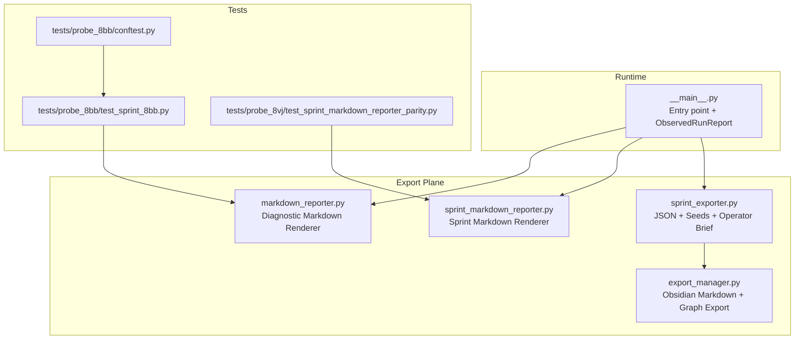
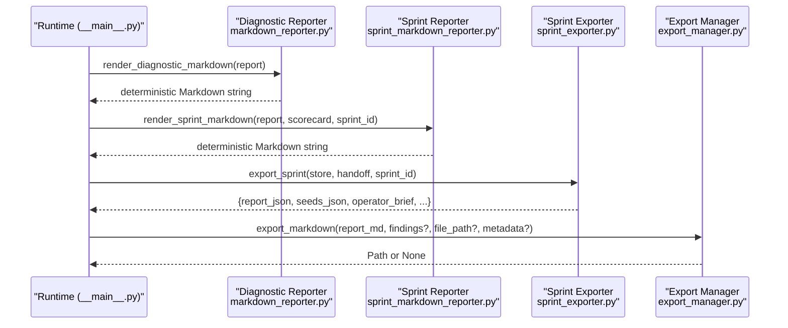
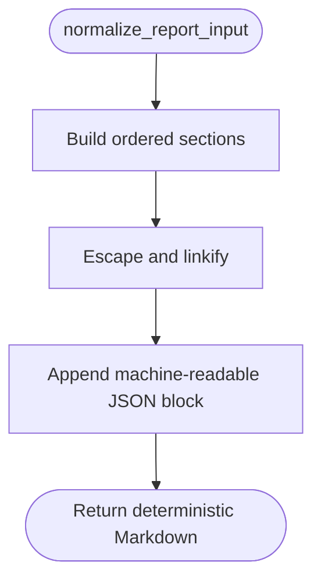
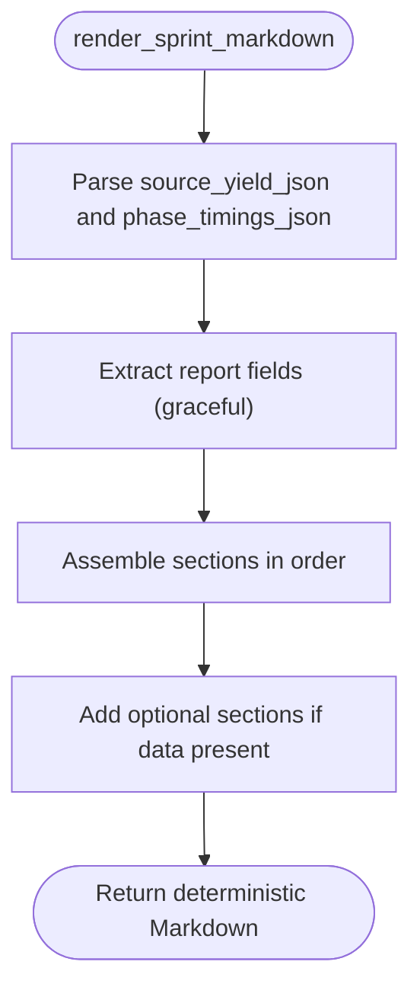
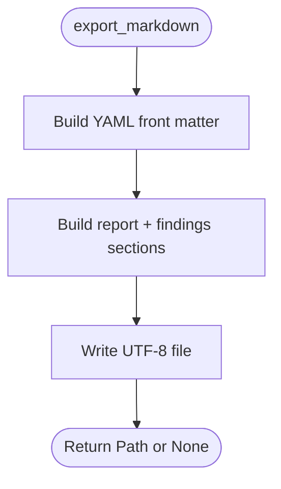
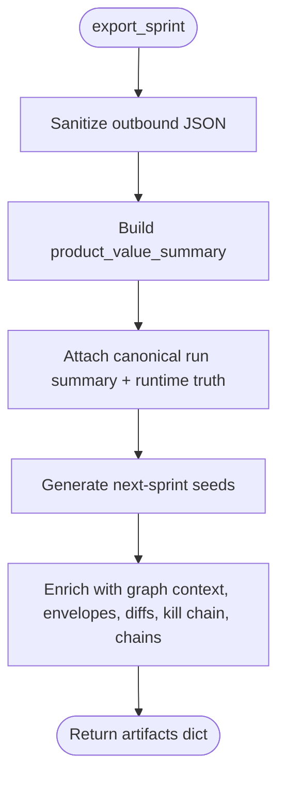
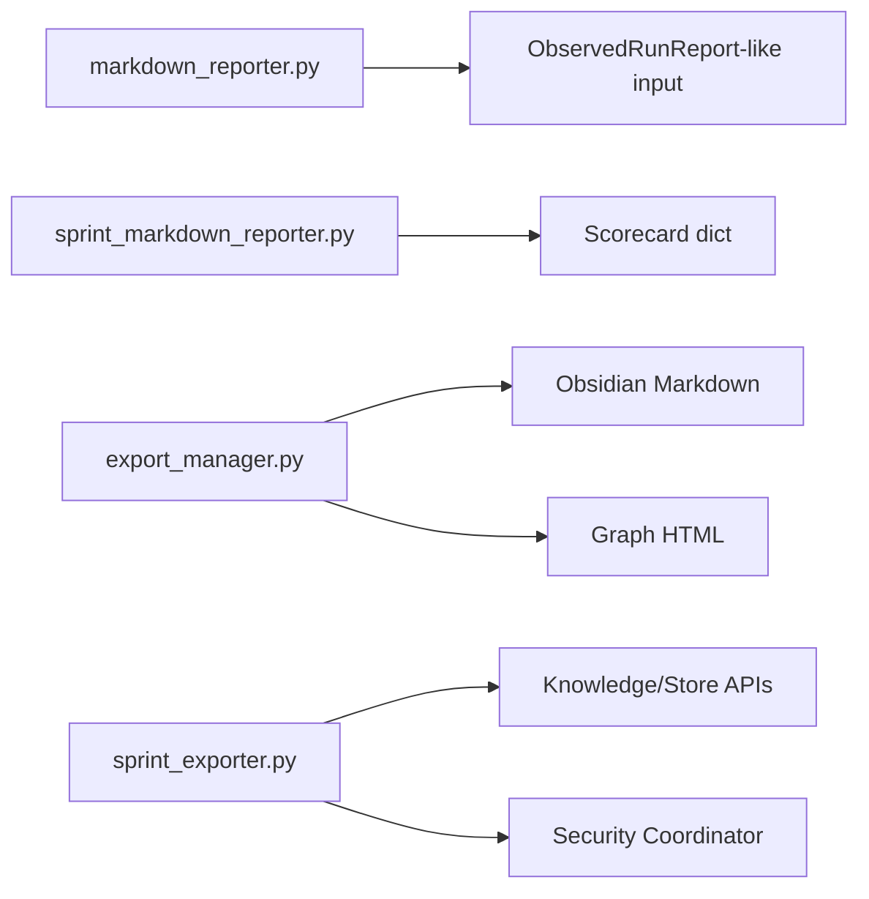

# Markdown Reporting

<cite>
**Referenced Files in This Document**
- [markdown_reporter.py](file://export/markdown_reporter.py)
- [sprint_markdown_reporter.py](file://export/sprint_markdown_reporter.py)
- [export_manager.py](file://export/export_manager.py)
- [sprint_exporter.py](file://export/sprint_exporter.py)
- [__main__.py](file://__main__.py)
- [test_sprint_8bb.py](file://tests/probe_8bb/test_sprint_8bb.py)
- [test_sprint_markdown_reporter_parity.py](file://tests/probe_8vj/test_sprint_markdown_reporter_parity.py)
- [conftest.py](file://tests/probe_8bb/conftest.py)
</cite>

## Table of Contents
1. [Introduction](#introduction)
2. [Project Structure](#project-structure)
3. [Core Components](#core-components)
4. [Architecture Overview](#architecture-overview)
5. [Detailed Component Analysis](#detailed-component-analysis)
6. [Dependency Analysis](#dependency-analysis)
7. [Performance Considerations](#performance-considerations)
8. [Troubleshooting Guide](#troubleshooting-guide)
9. [Conclusion](#conclusion)
10. [Appendices](#appendices)

## Introduction
This document describes the Markdown Reporting subsystem responsible for deterministic, side-effect-free generation of diagnostic and sprint reports in Markdown. It covers:
- Implementation details and invocation relationships
- Interfaces and domain models
- Formatting options and customization
- Configuration parameters and styling
- Integration with the export framework and knowledge stores
- Common formatting issues and solutions

The subsystem consists of:
- A deterministic diagnostic reporter for ObservedRunReport
- A deterministic sprint reporter for canonical sprint artifacts
- An export manager for Obsidian-compatible Markdown and graph exports
- An exporter that builds enriched JSON reports and next-sprint seeds

## Project Structure
The Markdown Reporting subsystem lives under the export plane and integrates with the broader runtime and knowledge layers.

**Diagram sources**
- [markdown_reporter.py:1-474](file://export/markdown_reporter.py#L1-L474)
- [sprint_markdown_reporter.py:1-833](file://export/sprint_markdown_reporter.py#L1-L833)
- [export_manager.py:1-298](file://export/export_manager.py#L1-L298)
- [sprint_exporter.py:1-2738](file://export/sprint_exporter.py#L1-L2738)
- [__main__.py:1-200](file://__main__.py#L1-L200)
- [test_sprint_8bb.py:1-200](file://tests/probe_8bb/test_sprint_8bb.py#L1-L200)
- [test_sprint_markdown_reporter_parity.py:77-207](file://tests/probe_8vj/test_sprint_markdown_reporter_parity.py#L77-L207)
- [conftest.py:1-200](file://tests/probe_8bb/conftest.py#L1-L200)

**Section sources**
- [markdown_reporter.py:1-474](file://export/markdown_reporter.py#L1-L474)
- [sprint_markdown_reporter.py:1-833](file://export/sprint_markdown_reporter.py#L1-L833)
- [export_manager.py:1-298](file://export/export_manager.py#L1-L298)
- [sprint_exporter.py:1-2738](file://export/sprint_exporter.py#L1-L2738)
- [__main__.py:1-200](file://__main__.py#L1-L200)

## Core Components
- Diagnostic Markdown Reporter
  - Converts ObservedRunReport (msgspec.Struct) or Mapping into deterministic Markdown
  - Provides normalized input, escaping, and ordered rendering
  - Includes machine-readable JSON block appended at the end
- Sprint Markdown Reporter
  - Renders canonical sprint reports with metrics, findings, optional leaderboards/timings, and extended sections
  - Pure function with centralized JSON parsing and graceful degradation
- Export Manager
  - Writes Obsidian-compatible Markdown with YAML front matter and optional findings
  - Enforces safe output paths and filters sensitive metadata
- Sprint Exporter
  - Produces JSON reports enriched with product value summaries, operator briefs, and next-sprint seeds
  - Integrates with knowledge stores for graph context, envelopes, diffs, kill chain, and evidence chains

**Section sources**
- [markdown_reporter.py:63-474](file://export/markdown_reporter.py#L63-L474)
- [sprint_markdown_reporter.py:37-279](file://export/sprint_markdown_reporter.py#L37-L279)
- [export_manager.py:47-298](file://export/export_manager.py#L47-L298)
- [sprint_exporter.py:144-464](file://export/sprint_exporter.py#L144-L464)

## Architecture Overview
The reporting subsystem is invoked from the runtime entry point and produces Markdown and JSON artifacts consumed by downstream systems and operators.

**Diagram sources**
- [__main__.py:1-200](file://__main__.py#L1-L200)
- [markdown_reporter.py:372-408](file://export/markdown_reporter.py#L372-L408)
- [sprint_markdown_reporter.py:142-279](file://export/sprint_markdown_reporter.py#L142-L279)
- [sprint_exporter.py:144-464](file://export/sprint_exporter.py#L144-L464)
- [export_manager.py:88-198](file://export/export_manager.py#L88-L198)

## Detailed Component Analysis

### Diagnostic Markdown Reporter
Purpose:
- Produce a deterministic, side-effect-free Markdown diagnostic report from ObservedRunReport-like inputs.

Key behaviors:
- Input normalization supports msgspec.Struct and Mapping
- Escaping and linkification for safe Markdown rendering
- Ordered sections with canonical labels and fallbacks
- Machine-readable JSON block appended at the end

Interfaces:
- normalize_report_input(report) -> dict
- render_diagnostic_markdown(report) -> str
- render_diagnostic_markdown_to_path(report, path=None) -> Path

Formatting and customization:
- Sections are rendered in a fixed order and use canonical labels for root causes and recommendations
- Deterministic sorting ensures stable output across runs
- URLs and paths are linkified; inline code spans escape backticks

Configuration parameters:
- Environment variable GHOST_EXPORT_DIR controls output directory for to-path helper
- Filename is derived from diagnostic_run_id/run_id or timestamp; falls back to a default name

Usage patterns:
- From runtime: call render_diagnostic_markdown(report) to get Markdown
- From orchestration: call render_diagnostic_markdown_to_path(report) to write to disk

Common issues and solutions:
- Non-deterministic inputs: ensure inputs are normalized via normalize_report_input
- Missing fields: renderer gracefully handles missing keys with defaults
- Unsafe content: rely on escaping/linkification; do not inject raw user-provided Markdown

**Diagram sources**
- [markdown_reporter.py:63-407](file://export/markdown_reporter.py#L63-L407)

**Section sources**
- [markdown_reporter.py:63-474](file://export/markdown_reporter.py#L63-L474)
- [test_sprint_8bb.py:119-180](file://tests/probe_8bb/test_sprint_8bb.py#L119-L180)

### Sprint Markdown Reporter
Purpose:
- Render canonical sprint reports with research metrics, findings, optional leaderboards/timings, and extended sections.

Key behaviors:
- Pure function with no side effects
- Centralized JSON parsing with graceful fallback
- Graceful degradation when report fields are missing
- Bounded displays for lists and tables

Interfaces:
- render_sprint_markdown(report, scorecard, sprint_id) -> str

Formatting and customization:
- Research metrics table with synthesis engine label
- Threat actors list with backtick formatting
- Top findings numbered list (bounded)
- Optional sections: Source Leaderboard, Phase Timings, Evidence Envelope Findings, Identity Candidates, Temporal Archaeology Timeline, Sprint Diff, Kill Chain Heat Map, Evidence Chains, Analyst Brief

Configuration parameters:
- Paths computed via canonical path helpers; shell role is orchestration plus file write
- Output path convention: ~/.hledac/reports/{sprint_id}.md

Usage patterns:
- From runtime: call render_sprint_markdown(report, scorecard, sprint_id) to produce Markdown
- From exporters: integrate with sprint_exporter to include extended sections

Common issues and solutions:
- JSON parsing failures: centralized fallback returns None; renderer continues with graceful placeholders
- Missing optional data: sections are omitted when data is unavailable
- Large lists: bounded displays prevent excessive output

**Diagram sources**
- [sprint_markdown_reporter.py:142-279](file://export/sprint_markdown_reporter.py#L142-L279)

**Section sources**
- [sprint_markdown_reporter.py:37-279](file://export/sprint_markdown_reporter.py#L37-L279)
- [test_sprint_markdown_reporter_parity.py:77-207](file://tests/probe_8vj/test_sprint_markdown_reporter_parity.py#L77-L207)

### Export Manager
Purpose:
- Export Markdown compatible with Obsidian and interactive HTML graphs.

Key behaviors:
- Obsidian-compatible YAML front matter with title, date, sources, tags
- Optional findings section with wikilink formatting
- Safe output path enforcement and sensitive data filtering
- HTML graph export via pyvis or networkx-to-pyvis fallback

Interfaces:
- export_markdown(report, findings?, file_path?, metadata?) -> Path | None
- export_graph_html(graph_manager, file_path?, title?) -> Path | None

Configuration parameters:
- Output directory defaults to ~/hledac_outputs
- File path resolution prevents escaping the output directory
- Sensitive fields filtered from metadata and findings

Usage patterns:
- From runtime: call export_markdown(report_md, findings?, metadata?) to write Markdown
- From runtime: call export_graph_html(graph_manager) to write HTML

Common issues and solutions:
- Path traversal: ensure file_path is within output directory; otherwise returns None
- Sensitive data leakage: metadata and findings are filtered before export
- Missing graph backend: fallback to networkx conversion if available

**Diagram sources**
- [export_manager.py:88-198](file://export/export_manager.py#L88-L198)

**Section sources**
- [export_manager.py:47-298](file://export/export_manager.py#L47-L298)

### Sprint Exporter
Purpose:
- Produce canonical JSON reports enriched with product value summaries, operator briefs, and next-sprint seeds.

Key behaviors:
- Derives product_value_summary from runtime_truth, scorecard, and branch mix
- Attaches derived data: analyst brief, canonical run summary, runtime truth, timing truth
- Generates next-sprint seeds from top nodes and product value signals
- Integrates with knowledge stores for graph context, envelopes, diffs, kill chain, and evidence chains

Interfaces:
- export_sprint(store, handoff, sprint_id?) -> dict

Configuration parameters:
- JSON report path via canonical helper; seeds path colocated with JSON report
- Sanitization via security coordinator with degraded fallback

Usage patterns:
- From runtime: call export_sprint(store, handoff, sprint_id) to produce JSON, seeds, and operator brief
- From orchestrator: consume returned artifacts for downstream actions

Common issues and solutions:
- Sanitization failures: degraded structure written instead of unsanitized content
- Truncated JSON: write sanitized prefix only when parse fails
- Missing graph/context: fallbacks and fail-soft logic ensure export proceeds

**Diagram sources**
- [sprint_exporter.py:144-464](file://export/sprint_exporter.py#L144-L464)

**Section sources**
- [sprint_exporter.py:144-464](file://export/sprint_exporter.py#L144-L464)

## Dependency Analysis
- Diagnostic reporter depends on:
  - ObservedRunReport-like inputs (msgspec.Struct or Mapping)
  - Normalization and helper functions for escaping/linkification
- Sprint reporter depends on:
  - Scorecard dictionaries with JSON-encoded fields
  - Graceful degradation when report fields are missing
- Export manager depends on:
  - Safe path handling and sensitive data filtering
  - Optional graph backend for HTML export
- Sprint exporter depends on:
  - Store interfaces for recent findings and graph context
  - Security coordinator for sanitization
  - Knowledge store for evidence chains and derived sections

**Diagram sources**
- [markdown_reporter.py:63-474](file://export/markdown_reporter.py#L63-L474)
- [sprint_markdown_reporter.py:142-279](file://export/sprint_markdown_reporter.py#L142-L279)
- [export_manager.py:88-298](file://export/export_manager.py#L88-L298)
- [sprint_exporter.py:144-464](file://export/sprint_exporter.py#L144-L464)

**Section sources**
- [markdown_reporter.py:63-474](file://export/markdown_reporter.py#L63-L474)
- [sprint_markdown_reporter.py:142-279](file://export/sprint_markdown_reporter.py#L142-L279)
- [export_manager.py:88-298](file://export/export_manager.py#L88-L298)
- [sprint_exporter.py:144-464](file://export/sprint_exporter.py#L144-L464)

## Performance Considerations
- Deterministic rendering avoids randomization and ensures byte-identical outputs across runs
- Sorting and iteration are bounded; lists and tables are truncated to maintain readability
- File I/O is minimized; to-path helper computes deterministic filenames and writes once
- Centralized JSON parsing reduces duplication and improves reliability

[No sources needed since this section provides general guidance]

## Troubleshooting Guide
Common formatting issues and resolutions:
- Non-deterministic output: ensure inputs are normalized and sections are ordered; tests confirm deterministic behavior
- Missing optional sections: verify presence of required JSON fields; reporter degrades gracefully
- Unsafe links/paths: rely on linkification; do not inject raw user-provided Markdown
- Sensitive data exposure: metadata and findings are filtered before export
- Path traversal attempts: export manager enforces safe paths and returns None on violations
- Sanitization failures: degraded structure is written instead of unsanitized content

Validation references:
- Deterministic rendering and section ordering validated by tests
- Graceful degradation for missing data and JSON parsing failures
- Safe path handling and sensitive data filtering enforced by export manager

**Section sources**
- [test_sprint_8bb.py:119-180](file://tests/probe_8bb/test_sprint_8bb.py#L119-L180)
- [test_sprint_markdown_reporter_parity.py:77-207](file://tests/probe_8vj/test_sprint_markdown_reporter_parity.py#L77-L207)
- [export_manager.py:47-198](file://export/export_manager.py#L47-L198)
- [sprint_exporter.py:205-287](file://export/sprint_exporter.py#L205-L287)

## Conclusion
The Markdown Reporting subsystem provides deterministic, secure, and extensible report generation across diagnostic and sprint contexts. It integrates cleanly with the export framework and knowledge stores, offering robust formatting, graceful degradation, and safe output handling. Developers can rely on stable interfaces and deterministic outputs while customizing sections and styling through the provided helpers and configuration parameters.

[No sources needed since this section summarizes without analyzing specific files]

## Appendices

### Domain Models and Inputs
ObservedRunReport-like input fields used by diagnostic reporter:
- Timing: started_ts, finished_ts, elapsed_ms
- Counts: total_sources, completed_sources, accepted_findings, stored_findings
- Dedup: uma_snapshot, dedup_surface_available, dedup_delta
- Patterns: patterns_configured, bootstrap_applied, content_quality_validated
- Success: success_rate, failed_source_count, batch_error
- Signal funnel: entries_seen, entries_with_empty_assembled_text, entries_with_text, entries_scanned, entries_with_hits, total_pattern_hits, findings_built_pre_store, accepted_count_delta
- Rejection trace: low_information_rejected_count_delta, in_memory_duplicate_rejected_count_delta, persistent_duplicate_rejected_count_delta, other_rejected_count_delta
- Health: per_source, health_breakdown
- Root cause: diagnostic_root_cause, is_network_variance
- Recommendation: recommendation (optional)
- Known limits: known_limits (optional)

Sprint report and scorecard inputs used by sprint reporter:
- Executive summary, threat actors, findings
- Metrics: findings_per_minute, ioc_density, semantic_novelty, outlines_used
- Optional JSON fields: source_yield_json, phase_timings_json
- Extended sections: envelope_findings, identity_candidates, timeline_findings, sprint_diff_findings, kill_chain_findings, evidence_chains, analyst_brief

**Section sources**
- [markdown_reporter.py:125-365](file://export/markdown_reporter.py#L125-L365)
- [sprint_markdown_reporter.py:142-279](file://export/sprint_markdown_reporter.py#L142-L279)
- [conftest.py:16-200](file://tests/probe_8bb/conftest.py#L16-L200)