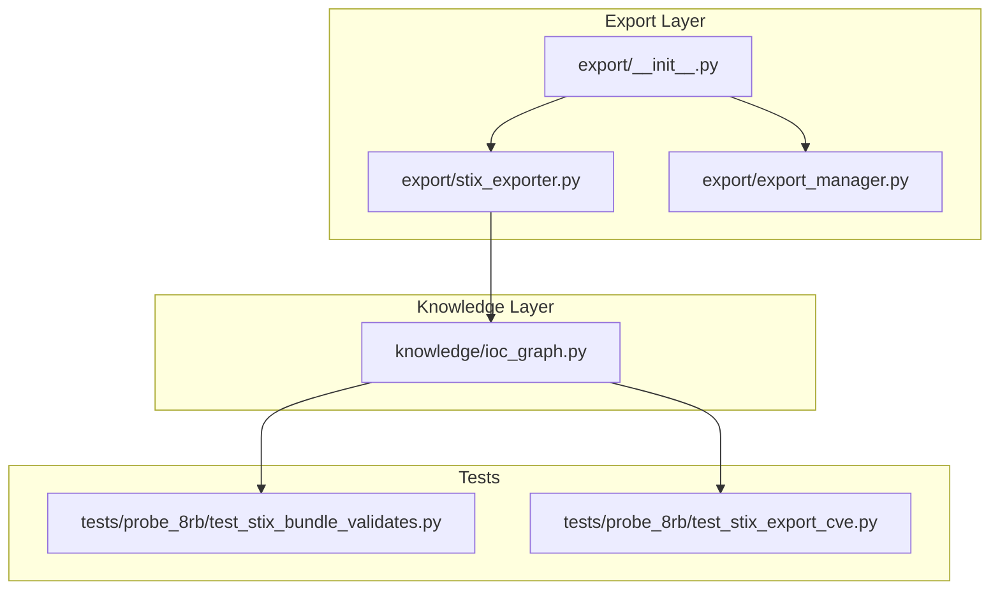
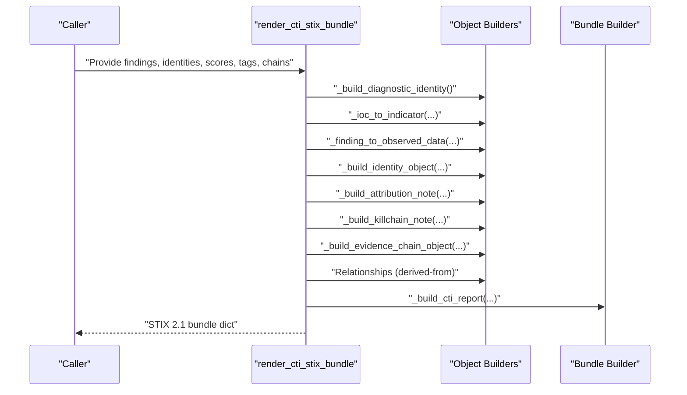
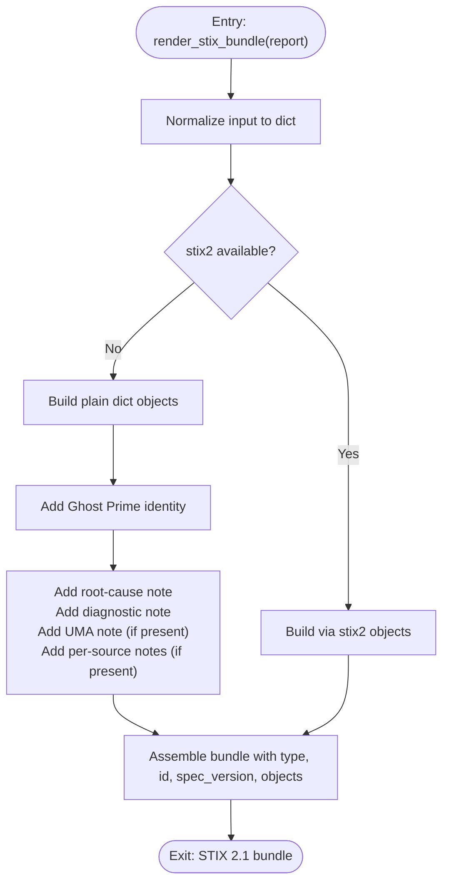
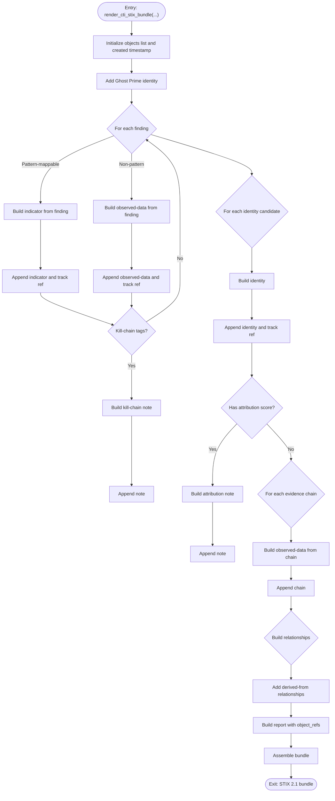
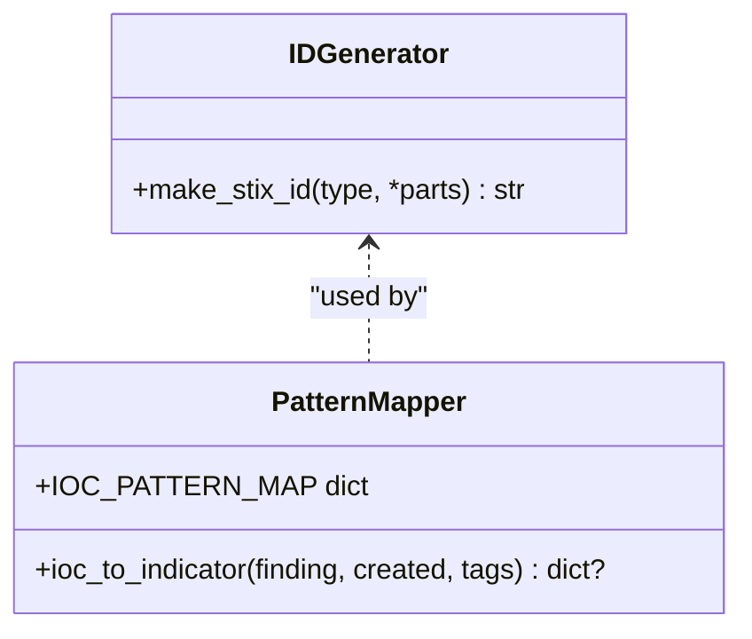
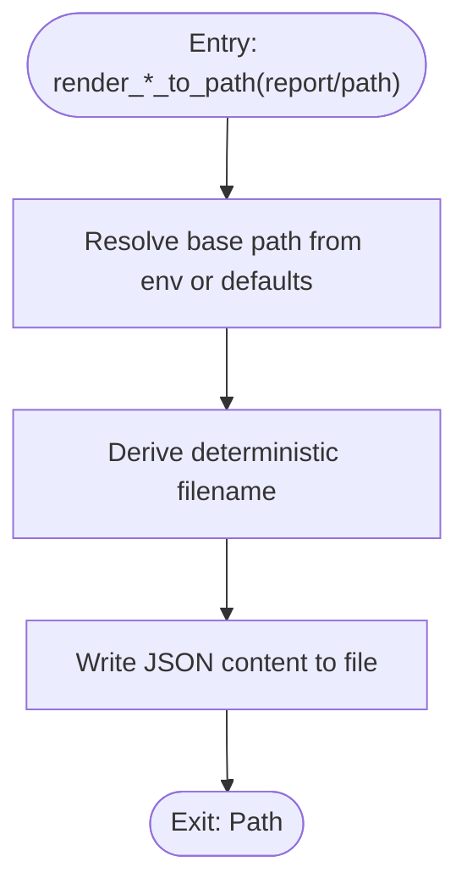
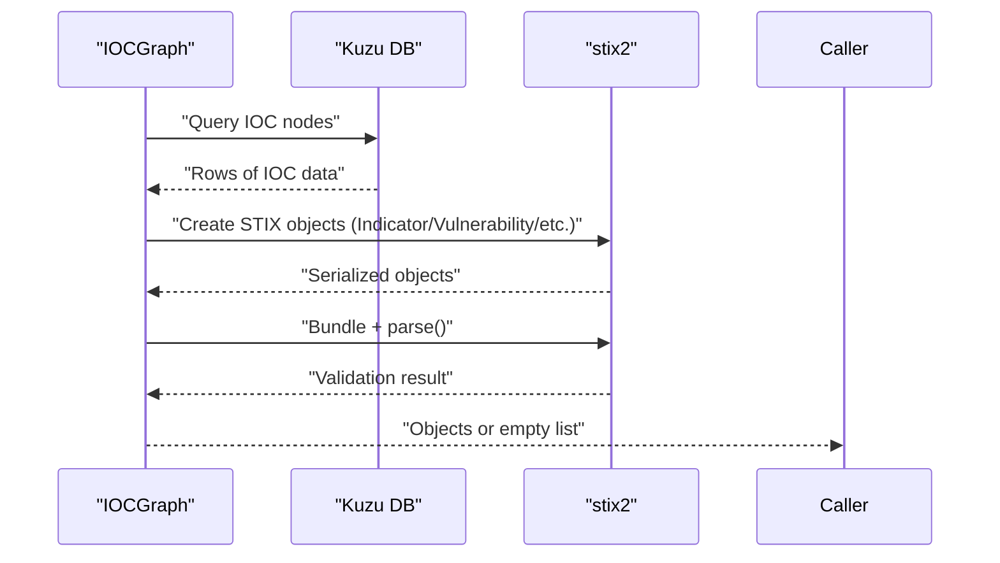
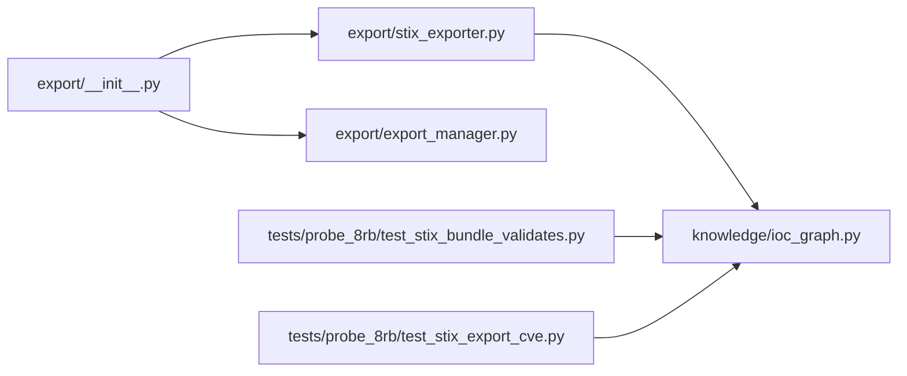

# STIX Export

<cite>
**Referenced Files in This Document**
- [stix_exporter.py](file://export/stix_exporter.py)
- [export_manager.py](file://export/export_manager.py)
- [__init__.py](file://export/__init__.py)
- [ioc_graph.py](file://knowledge/ioc_graph.py)
- [ghost_cti_20260427_153335.stix.json](file://ghost_cti_20260427_153335.stix.json)
- [test_stix_bundle_validates.py](file://tests/probe_8rb/test_stix_bundle_validates.py)
- [test_stix_export_cve.py](file://tests/probe_8rb/test_stix_export_cve.py)
</cite>

## Table of Contents
1. [Introduction](#introduction)
2. [Project Structure](#project-structure)
3. [Core Components](#core-components)
4. [Architecture Overview](#architecture-overview)
5. [Detailed Component Analysis](#detailed-component-analysis)
6. [Dependency Analysis](#dependency-analysis)
7. [Performance Considerations](#performance-considerations)
8. [Troubleshooting Guide](#troubleshooting-guide)
9. [Conclusion](#conclusion)
10. [Appendices](#appendices)

## Introduction
This document describes the STIX export subsystem that powers deterministic, side-effect-free export of cyber threat intelligence (CTI) and diagnostic reports in STIX 2.1. It explains STIX standard compliance, mapping from internal formats to STIX structures, the export pipeline, bundle creation, object relationships, and CTI representation. It also covers configuration, custom object extensions, interoperability, version compatibility, validation, error handling, and integration with external CTI platforms and automated sharing workflows.

## Project Structure
The STIX export functionality spans several modules:
- Export API surface and rendering functions for both diagnostic and CTI bundles
- Export manager for file output and directory safety
- Integration with the IOC graph for STIX 2.1 bundle generation and validation
- Test suite validating STIX 2.1 compatibility and object correctness

**Diagram sources**
- [__init__.py:16-25](file://export/__init__.py#L16-L25)
- [stix_exporter.py:1069-1199](file://export/stix_exporter.py#L1069-L1199)
- [export_manager.py:47-298](file://export/export_manager.py#L47-L298)
- [ioc_graph.py:703-791](file://knowledge/ioc_graph.py#L703-L791)
- [test_stix_bundle_validates.py:22-64](file://tests/probe_8rb/test_stix_bundle_validates.py#L22-L64)
- [test_stix_export_cve.py:9-35](file://tests/probe_8rb/test_stix_export_cve.py#L9-L35)

**Section sources**
- [__init__.py:16-25](file://export/__init__.py#L16-L25)
- [stix_exporter.py:1069-1199](file://export/stix_exporter.py#L1069-L1199)
- [export_manager.py:47-298](file://export/export_manager.py#L47-L298)
- [ioc_graph.py:703-791](file://knowledge/ioc_graph.py#L703-L791)
- [test_stix_bundle_validates.py:22-64](file://tests/probe_8rb/test_stix_bundle_validates.py#L22-L64)
- [test_stix_export_cve.py:9-35](file://tests/probe_8rb/test_stix_export_cve.py#L9-L35)

## Core Components
- STIX 2.1 diagnostic bundle renderer: Converts a normalized report into a minimal, metadata-safe bundle containing identity, diagnostic notes, and optional per-source notes.
- STIX 2.1 CTI bundle renderer: Converts findings, identities, attribution scores, kill-chain tags, and evidence chains into a full CTI bundle with indicators, observed-data, identities, notes, relationships, and a report wrapper.
- Deterministic ID generation: Uses UUID5 with a STIX namespace to ensure stable, repeatable object IDs across runs.
- Optional stix2 package path: When available, constructs STIX objects via the stix2 library; otherwise, builds plain dict representations that remain STIX-compatible and pass basic validation.
- Export manager: Provides safe file output with output directory enforcement and deterministic filenames.

Key responsibilities:
- Normalize inputs from internal report formats
- Map findings to STIX indicators or observed-data
- Map identity candidates to STIX identities
- Attach attribution notes and kill-chain notes
- Build relationships and a report wrapper
- Enforce bounds and guardrails (no network/model, bounded object counts, deterministic IDs)
- Validate bundles when stix2 is available

**Section sources**
- [stix_exporter.py:1069-1199](file://export/stix_exporter.py#L1069-L1199)
- [stix_exporter.py:749-917](file://export/stix_exporter.py#L749-L917)
- [stix_exporter.py:425-507](file://export/stix_exporter.py#L425-L507)
- [export_manager.py:47-298](file://export/export_manager.py#L47-L298)

## Architecture Overview
The STIX export subsystem supports two modes:
- Diagnostic mode: Emits a minimal bundle with identity and diagnostic notes when no findings are present.
- CTI mode: Emits a comprehensive bundle with indicators, identities, observed-data, notes, relationships, and a report when findings are present.

**Diagram sources**
- [stix_exporter.py:749-917](file://export/stix_exporter.py#L749-L917)
- [stix_exporter.py:450-507](file://export/stix_exporter.py#L450-L507)
- [stix_exporter.py:510-559](file://export/stix_exporter.py#L510-L559)
- [stix_exporter.py:562-595](file://export/stix_exporter.py#L562-L595)
- [stix_exporter.py:598-634](file://export/stix_exporter.py#L598-L634)
- [stix_exporter.py:637-668](file://export/stix_exporter.py#L637-L668)
- [stix_exporter.py:671-708](file://export/stix_exporter.py#L671-L708)
- [stix_exporter.py:877-893](file://export/stix_exporter.py#L877-L893)
- [stix_exporter.py:711-741](file://export/stix_exporter.py#L711-L741)

## Detailed Component Analysis

### Diagnostic Bundle Renderer
Purpose:
- Produce a metadata-safe STIX 2.1 bundle when no findings are present.
- Include a Ghost Prime identity, root-cause note, diagnostic note, optional UMA note, and per-source notes.

Behavior:
- Uses built-in dict construction when stix2 is unavailable.
- Applies RFC3339 timestamps and deterministic identity IDs.
- Skips IOC/indicator/malware objects when no findings are present.

**Diagram sources**
- [stix_exporter.py:1069-1199](file://export/stix_exporter.py#L1069-L1199)
- [stix_exporter.py:1004-1064](file://export/stix_exporter.py#L1004-L1064)

**Section sources**
- [stix_exporter.py:1069-1199](file://export/stix_exporter.py#L1069-L1199)

### CTI Bundle Renderer
Purpose:
- Convert findings and sidecar data into a full STIX 2.1 CTI bundle with indicators, identities, observed-data, notes, relationships, and a report.

Key mappings:
- Findings → Indicator (when pattern-mappable) or Observed-Data (non-pattern IOCs)
- Identity candidates → Identity
- Attribution scores → Note referencing the identity
- Kill-chain tags → Note with structured content
- Evidence chains → Observed-Data with serialized chain content
- Relationships → Derived-from between indicators and identities
- Report → Wrapper around all objects

Guardrails:
- No fake IOCs when findings list is empty
- No network access or model loading
- Bounded to configurable object count and bytes
- Deterministic IDs via UUID5

**Diagram sources**
- [stix_exporter.py:749-917](file://export/stix_exporter.py#L749-L917)
- [stix_exporter.py:450-507](file://export/stix_exporter.py#L450-L507)
- [stix_exporter.py:510-559](file://export/stix_exporter.py#L510-L559)
- [stix_exporter.py:562-595](file://export/stix_exporter.py#L562-L595)
- [stix_exporter.py:598-634](file://export/stix_exporter.py#L598-L634)
- [stix_exporter.py:637-668](file://export/stix_exporter.py#L637-L668)
- [stix_exporter.py:671-708](file://export/stix_exporter.py#L671-L708)
- [stix_exporter.py:877-893](file://export/stix_exporter.py#L877-L893)
- [stix_exporter.py:711-741](file://export/stix_exporter.py#L711-L741)

**Section sources**
- [stix_exporter.py:749-917](file://export/stix_exporter.py#L749-L917)

### Deterministic ID Generation and Pattern Mapping
- Deterministic IDs: Uses UUID5 with a STIX namespace and a canonical string composed from object type and stable parts to guarantee reproducible IDs.
- Pattern mapping: Maps supported IOC types to STIX patterns; certain types map to Vulnerability instead of Indicator.

**Diagram sources**
- [stix_exporter.py:425-447](file://export/stix_exporter.py#L425-L447)
- [stix_exporter.py:450-507](file://export/stix_exporter.py#L450-L507)

**Section sources**
- [stix_exporter.py:425-507](file://export/stix_exporter.py#L425-L507)

### Export Manager and File Output
- Ensures output path safety by resolving within a configured base directory.
- Provides deterministic filenames for diagnostic and CTI bundles.
- Writes JSON content with sorted keys for determinism.

**Diagram sources**
- [export_manager.py:69-86](file://export/export_manager.py#L69-L86)
- [export_manager.py:116-119](file://export/export_manager.py#L116-L119)
- [export_manager.py:1175-1194](file://export/export_manager.py#L1175-L1194)

**Section sources**
- [export_manager.py:69-86](file://export/export_manager.py#L69-L86)
- [export_manager.py:116-119](file://export/export_manager.py#L116-L119)
- [export_manager.py:1175-1194](file://export/export_manager.py#L1175-L1194)

### IOC Graph Integration and Validation
- IOCGraph exports STIX 2.1 bundles directly using stix2 objects and validates bundles via stix2.parse before returning.
- Supports specialized object types (e.g., Vulnerability for CVEs) and robust error logging during export.

**Diagram sources**
- [ioc_graph.py:703-791](file://knowledge/ioc_graph.py#L703-L791)

**Section sources**
- [ioc_graph.py:703-791](file://knowledge/ioc_graph.py#L703-L791)

## Dependency Analysis
- Export API exposes render functions for diagnostic and CTI bundles and integrates with the export manager for file output.
- CTI bundle rendering depends on internal data structures (findings, identity candidates, attribution scores, kill-chain tags, evidence chains) and applies strict bounds.
- IOC graph integration demonstrates STIX 2.1 object construction and validation using the stix2 library.

**Diagram sources**
- [__init__.py:16-25](file://export/__init__.py#L16-L25)
- [stix_exporter.py:1069-1199](file://export/stix_exporter.py#L1069-L1199)
- [export_manager.py:47-298](file://export/export_manager.py#L47-L298)
- [ioc_graph.py:703-791](file://knowledge/ioc_graph.py#L703-L791)
- [test_stix_bundle_validates.py:22-64](file://tests/probe_8rb/test_stix_bundle_validates.py#L22-L64)
- [test_stix_export_cve.py:9-35](file://tests/probe_8rb/test_stix_export_cve.py#L9-L35)

**Section sources**
- [__init__.py:16-25](file://export/__init__.py#L16-L25)
- [stix_exporter.py:1069-1199](file://export/stix_exporter.py#L1069-L1199)
- [export_manager.py:47-298](file://export/export_manager.py#L47-L298)
- [ioc_graph.py:703-791](file://knowledge/ioc_graph.py#L703-L791)
- [test_stix_bundle_validates.py:22-64](file://tests/probe_8rb/test_stix_bundle_validates.py#L22-L64)
- [test_stix_export_cve.py:9-35](file://tests/probe_8rb/test_stix_export_cve.py#L9-L35)

## Performance Considerations
- Deterministic ID generation avoids hashing overhead by using UUID5 on canonical strings.
- Bounded object counts and bytes prevent memory pressure during export.
- Async input collection for CTI export uses concurrent gathering with fail-safe defaults.
- File output is synchronous and deterministic, minimizing I/O contention.

[No sources needed since this section provides general guidance]

## Troubleshooting Guide
Common issues and resolutions:
- Missing stix2: The built-in dict path remains functional; objects are still STIX-compatible and pass basic shape validation.
- Empty findings: Diagnostic mode emits only metadata-safe objects; CTI mode avoids generating fake IOCs.
- Validation failures: When stix2 is available, bundles are validated before return; failures log warnings and return an empty list.
- Export path escaping: Export manager enforces output directory boundaries and raises on attempts to escape the base path.
- Large outputs: Configure environment variable for export directory and ensure sufficient disk space.

**Section sources**
- [stix_exporter.py:1004-1064](file://export/stix_exporter.py#L1004-L1064)
- [stix_exporter.py:780-789](file://export/stix_exporter.py#L780-L789)
- [export_manager.py:82-84](file://export/export_manager.py#L82-L84)
- [ioc_graph.py:780-789](file://knowledge/ioc_graph.py#L780-L789)

## Conclusion
The STIX export subsystem provides robust, deterministic, and standards-compliant export of diagnostic and CTI intelligence in STIX 2.1. It maps internal findings and sidecar data to STIX objects, enforces guardrails and bounds, and integrates with external validation libraries. The design supports safe file output, deterministic IDs, and seamless integration with external CTI platforms and automated sharing workflows.

[No sources needed since this section summarizes without analyzing specific files]

## Appendices

### Practical Examples and Configurations
- Diagnostic bundle export: Use the diagnostic renderer to produce a metadata-safe bundle suitable for internal diagnostics.
- CTI bundle export: Provide findings, identity candidates, attribution scores, kill-chain tags, and evidence chains to generate a comprehensive CTI bundle.
- File output: Use the export manager to write deterministic JSON files to a controlled output directory.

Example references:
- Diagnostic bundle example file: [ghost_cti_20260427_153335.stix.json:1-35](file://ghost_cti_20260427_153335.stix.json#L1-L35)
- CTI bundle export functions: [render_cti_stix_bundle:749-917](file://export/stix_exporter.py#L749-L917), [render_cti_stix_bundle_json:919-944](file://export/stix_exporter.py#L919-L944), [render_cti_stix_bundle_to_path:946-999](file://export/stix_exporter.py#L946-L999)
- Diagnostic bundle export functions: [render_stix_bundle:1069-1124](file://export/stix_exporter.py#L1069-L1124), [render_stix_bundle_json:1126-1137](file://export/stix_exporter.py#L1126-L1137), [render_stix_bundle_to_path:1142-1199](file://export/stix_exporter.py#L1142-L1199)
- Export manager: [ExportManager:47-298](file://export/export_manager.py#L47-L298)

**Section sources**
- [ghost_cti_20260427_153335.stix.json:1-35](file://ghost_cti_20260427_153335.stix.json#L1-L35)
- [stix_exporter.py:749-999](file://export/stix_exporter.py#L749-L999)
- [stix_exporter.py:1069-1199](file://export/stix_exporter.py#L1069-L1199)
- [export_manager.py:47-298](file://export/export_manager.py#L47-L298)

### STIX Version Compatibility and Interoperability
- STIX 2.1: All bundles specify spec_version 2.1 and use STIX 2.1 object types and identifiers.
- Validation: When stix2 is available, bundles are validated via stix2.parse to ensure compatibility with external platforms.
- External integrations: The subsystem is designed to interoperate with STIX-consuming tools and platforms that accept STIX 2.1 bundles.

**Section sources**
- [stix_exporter.py:49-49](file://export/stix_exporter.py#L49-L49)
- [stix_exporter.py:1004-1064](file://export/stix_exporter.py#L1004-L1064)
- [ioc_graph.py:780-789](file://knowledge/ioc_graph.py#L780-L789)
- [test_stix_bundle_validates.py:22-64](file://tests/probe_8rb/test_stix_bundle_validates.py#L22-L64)

### Custom Object Extensions
- Notes and Reports: Used to carry structured diagnostic and attribution information alongside STIX objects.
- Vulnerability objects: Specialized handling for CVEs with external references.
- Observed-Data: Serialized evidence chains embedded as content for traceability.

**Section sources**
- [stix_exporter.py:598-634](file://export/stix_exporter.py#L598-L634)
- [stix_exporter.py:637-668](file://export/stix_exporter.py#L637-L668)
- [stix_exporter.py:671-708](file://export/stix_exporter.py#L671-L708)
- [ioc_graph.py:752-759](file://knowledge/ioc_graph.py#L752-L759)
- [test_stix_export_cve.py:30-33](file://tests/probe_8rb/test_stix_export_cve.py#L30-L33)

### Automated Sharing Workflows
- Deterministic filenames and IDs enable repeatable, shareable exports.
- Export manager ensures outputs are written to a controlled location, simplifying automated ingestion by downstream systems.

**Section sources**
- [export_manager.py:1175-1194](file://export/export_manager.py#L1175-L1194)
- [stix_exporter.py:946-999](file://export/stix_exporter.py#L946-L999)