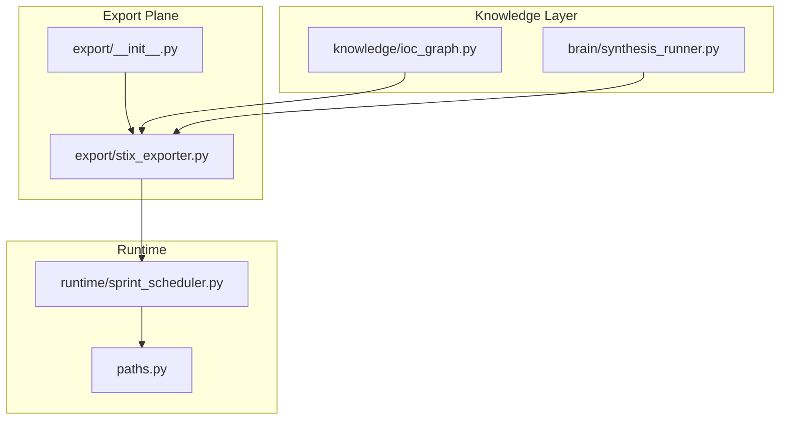
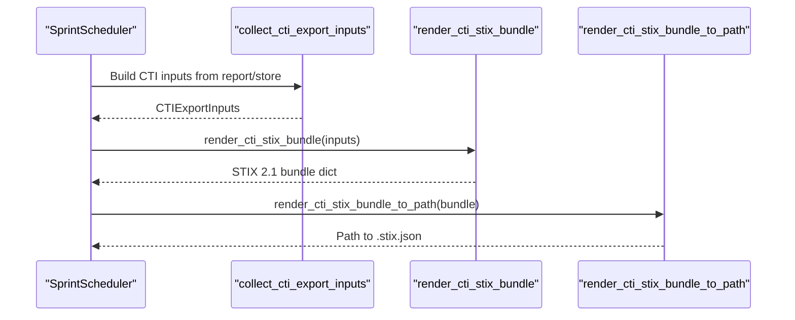
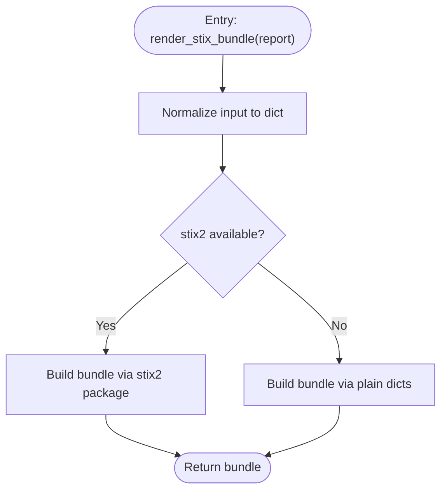
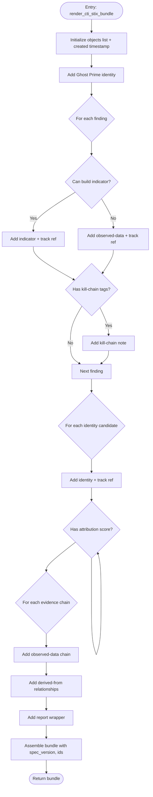
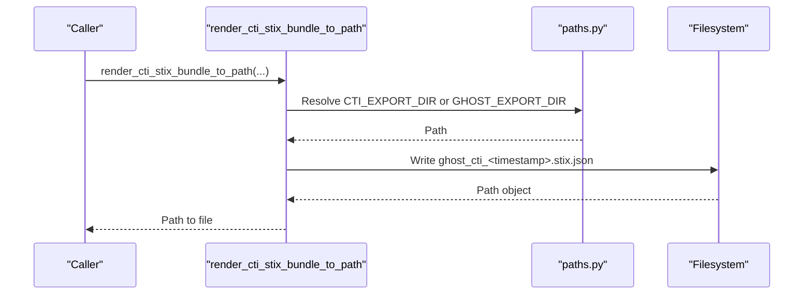
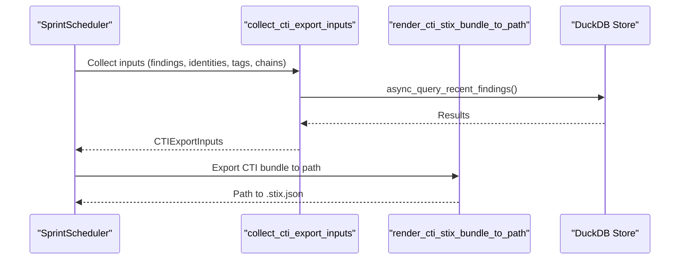
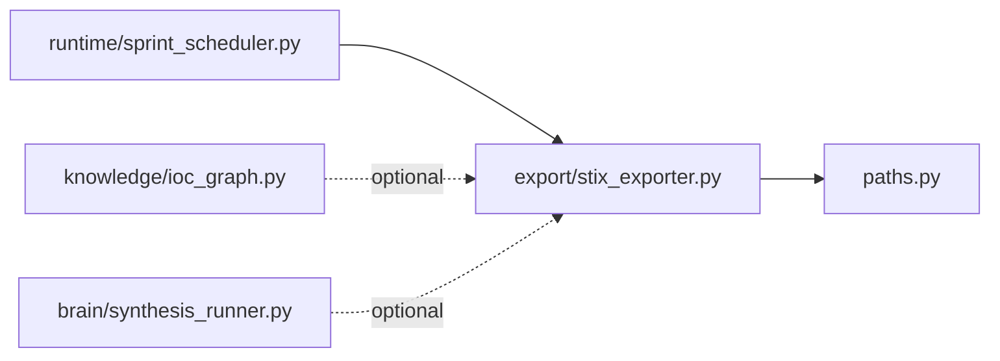

# STIX Exporter

<cite>
**Referenced Files in This Document**
- [stix_exporter.py](file://export/stix_exporter.py)
- [__init__.py](file://export/__init__.py)
- [paths.py](file://paths.py)
- [sprint_scheduler.py](file://runtime/sprint_scheduler.py)
- [ioc_graph.py](file://knowledge/ioc_graph.py)
- [synthesis_runner.py](file://brain/synthesis_runner.py)
- [ghost_cti_20260506_151445.stix.json](file://ghost_cti_20260506_151445.stix.json)
</cite>

## Table of Contents
1. [Introduction](#introduction)
2. [Project Structure](#project-structure)
3. [Core Components](#core-components)
4. [Architecture Overview](#architecture-overview)
5. [Detailed Component Analysis](#detailed-component-analysis)
6. [Dependency Analysis](#dependency-analysis)
7. [Performance Considerations](#performance-considerations)
8. [Troubleshooting Guide](#troubleshooting-guide)
9. [Conclusion](#conclusion)
10. [Appendices](#appendices)

## Introduction
This document describes the STIX exporter used to transform research findings and sidecar data into STIX 2.1 bundles suitable for cyber threat intelligence (CTI) sharing. It explains STIX format compliance, data modeling for threat actors, indicators of compromise (IoCs), and attack patterns; documents the export workflow, configuration options, data mapping rules, and validation; and covers batch export capabilities and integration with threat intelligence platforms.

## Project Structure
The STIX exporter is implemented as a standalone module within the export plane and integrates with runtime orchestration and path management utilities.



**Diagram sources**
- [stix_exporter.py](file://export/stix_exporter.py)
- [__init__.py](file://export/__init__.py)
- [paths.py](file://paths.py)
- [sprint_scheduler.py](file://runtime/sprint_scheduler.py)
- [ioc_graph.py](file://knowledge/ioc_graph.py)
- [synthesis_runner.py](file://brain/synthesis_runner.py)

**Section sources**
- [stix_exporter.py](file://export/stix_exporter.py)
- [__init__.py](file://export/__init__.py)
- [paths.py](file://paths.py)
- [sprint_scheduler.py](file://runtime/sprint_scheduler.py)
- [ioc_graph.py](file://knowledge/ioc_graph.py)
- [synthesis_runner.py](file://brain/synthesis_runner.py)

## Core Components
- Diagnostic STIX bundle renderer: Creates metadata-safe bundles containing diagnostic notes, identity, and optional per-source notes.
- CTI STIX bundle renderer: Converts findings, identities, attribution scores, kill-chain tags, and evidence chains into a full STIX 2.1 bundle with indicators, identities, observed-data, relationships, notes, and a report wrapper.
- Export helpers: JSON serialization and file-writing utilities with deterministic filenames and configurable output directories.
- Integration points: Orchestrator integration for batch export and path management for output locations.

Key responsibilities:
- STIX 2.1 compliance: spec_version, UUID-based IDs, RFC3339 timestamps, and object shapes.
- Deterministic IDs: UUID5 derived from stable namespaces and content hashes.
- Safety and bounds: No network/model usage, bounded object counts and sizes, fail-soft behavior.

**Section sources**
- [stix_exporter.py](file://export/stix_exporter.py)
- [__init__.py](file://export/__init__.py)

## Architecture Overview
The STIX exporter participates in the research-to-STIX pipeline by transforming canonical findings and sidecar intelligence into STIX objects and packaging them into a bundle. The orchestrator coordinates collection of inputs and triggers export.



**Diagram sources**
- [sprint_scheduler.py](file://runtime/sprint_scheduler.py)
- [stix_exporter.py](file://export/stix_exporter.py)

## Detailed Component Analysis

### Diagnostic STIX Bundle Renderer
Purpose:
- Produce a metadata-safe STIX 2.1 bundle without generating fake IoCs when findings are absent.
- Include diagnostic notes, root cause, and optional per-source notes.

Behavior highlights:
- Uses a canonical identity for the report author.
- Builds diagnostic notes from diagnostic report fields.
- Optionally includes a note summarizing per-source health.
- Generates deterministic bundle ID based on report metadata.



**Diagram sources**
- [stix_exporter.py](file://export/stix_exporter.py)

**Section sources**
- [stix_exporter.py](file://export/stix_exporter.py)

### CTI STIX Bundle Renderer
Purpose:
- Transform findings and sidecar data into a full STIX 2.1 CTI bundle.

Core mapping rules:
- Findings → Indicator or Observed-Data:
  - Pattern-mappable IOCs (IPv4/IPv6/domain/url/email/hash) become STIX indicators with STIX patterns.
  - Non-pattern IOCs (e.g., file hashes) become observed-data objects.
- Identity candidates → Identity objects.
- Attribution scores → Notes explaining confidence and factors.
- Kill-chain tags → Indicator labels and per-finding notes.
- Evidence chains → Observed-data objects with serialized chain content.
- Relationships → Derived-from relationships linking indicators to identities.
- Report wrapper → Aggregates all objects with metadata.



**Diagram sources**
- [stix_exporter.py](file://export/stix_exporter.py)

**Section sources**
- [stix_exporter.py](file://export/stix_exporter.py)

### Export Helpers and Configuration
- render_cti_stix_bundle_to_path: Writes deterministic .stix.json files to configured output directories.
- Output directories:
  - CTI_EXPORT_DIR: Project-local runtime directory for CTI artifacts.
  - RUNS_ROOT: Project-local runtime directory for diagnostic artifacts.
  - Environment override: GHOST_EXPORT_DIR for backward compatibility.
- Deterministic filenames:
  - CTI: ghost_cti_<timestamp>.stix.json
  - Diagnostic: ghost_diagnostic_<run_id>.stix.json or ghost_diagnostic_<timestamp>.stix.json



**Diagram sources**
- [stix_exporter.py](file://export/stix_exporter.py)
- [paths.py](file://paths.py)

**Section sources**
- [stix_exporter.py](file://export/stix_exporter.py)
- [paths.py](file://paths.py)

### Batch Export and Integration
- Orchestrator integration:
  - Collects CTI inputs from the diagnostic report and DuckDB store.
  - Triggers CTI export with fail-soft error handling.
  - Uses run_in_executor for large serializations (>1000 objects).
- Integration with threat intelligence platforms:
  - STIX 2.1 bundles conform to official spec with deterministic IDs and standard object types.
  - Optional stix2 package path enables richer object construction when available.



**Diagram sources**
- [sprint_scheduler.py](file://runtime/sprint_scheduler.py)
- [stix_exporter.py](file://export/stix_exporter.py)

**Section sources**
- [sprint_scheduler.py](file://runtime/sprint_scheduler.py)
- [stix_exporter.py](file://export/stix_exporter.py)

## Dependency Analysis
- Internal dependencies:
  - stix_exporter depends on paths for output directories.
  - Orchestrator invokes the exporter and manages concurrency and error handling.
- Optional external dependency:
  - stix2 package: When available, enables richer object construction; otherwise, plain dict path is used.



**Diagram sources**
- [stix_exporter.py](file://export/stix_exporter.py)
- [paths.py](file://paths.py)
- [sprint_scheduler.py](file://runtime/sprint_scheduler.py)
- [ioc_graph.py](file://knowledge/ioc_graph.py)
- [synthesis_runner.py](file://brain/synthesis_runner.py)

**Section sources**
- [stix_exporter.py](file://export/stix_exporter.py)
- [paths.py](file://paths.py)
- [sprint_scheduler.py](file://runtime/sprint_scheduler.py)
- [ioc_graph.py](file://knowledge/ioc_graph.py)
- [synthesis_runner.py](file://brain/synthesis_runner.py)

## Performance Considerations
- Bounded object count: MAX_STIX_OBJECTS limits total objects to keep serialization efficient.
- Bounded findings and chains: Limits on findings and evidence chains prevent excessive memory usage.
- Deterministic IDs: UUID5 ensures stable IDs without recomputation overhead.
- Large serialization offloading: run_in_executor is used for large bundles to avoid blocking the event loop.
- Fail-soft design: Errors are captured and recorded rather than propagating exceptions.

[No sources needed since this section provides general guidance]

## Troubleshooting Guide
Common issues and resolutions:
- Missing stix2 package:
  - Behavior: Plain dict path is used; some advanced validations are not performed.
  - Resolution: Install stix2 to enable richer object construction and validation.
- Empty findings:
  - Behavior: Diagnostic bundle is generated; no fake IoCs are produced.
  - Resolution: Ensure findings are present or accept the metadata-only bundle.
- Large bundle serialization:
  - Behavior: run_in_executor is used automatically for >1000 objects.
  - Resolution: Monitor export paths and logs for errors.
- Output directory issues:
  - Behavior: Export path must remain within configured output directories.
  - Resolution: Use provided helpers; avoid escaping output directories.

**Section sources**
- [stix_exporter.py](file://export/stix_exporter.py)
- [sprint_scheduler.py](file://runtime/sprint_scheduler.py)

## Conclusion
The STIX exporter provides a deterministic, side-effect-free mechanism to convert research findings and sidecar intelligence into compliant STIX 2.1 bundles. It supports both diagnostic and full CTI export modes, integrates with the orchestrator for batch export, and writes artifacts to predictable locations. Its design emphasizes safety, determinism, and interoperability with STIX-consuming systems.

[No sources needed since this section summarizes without analyzing specific files]

## Appendices

### STIX Object Mapping Reference
- Findings:
  - Pattern-mappable IOCs → Indicator with STIX pattern.
  - Non-pattern IOCs → Observed-Data.
- Identity candidates → Identity.
- Attribution scores → Note with confidence and factors.
- Kill-chain tags → Indicator labels + per-finding note.
- Evidence chains → Observed-Data with serialized chain content.
- Relationships → Derived-from between indicators and identities.
- Report → Wrapper around all CTI objects.

**Section sources**
- [stix_exporter.py](file://export/stix_exporter.py)

### Example Artifact
Sample CTI bundle with minimal content (no findings):

```json
{
  "created": "2026-05-06T15:14:45Z",
  "id": "bundle--7f115edf-aba5-580b-b314-2b4dc15cb327",
  "modified": "2026-05-06T15:14:45Z",
  "objects": [
    {
      "created": "2026-05-06T15:14:45Z",
      "id": "identity--ghost-prime",
      "identity_class": "system",
      "modified": "2026-05-06T15:14:45Z",
      "name": "Ghost Prime",
      "spec_version": "2.1",
      "type": "identity"
    },
    {
      "created": "2026-05-06T15:14:45Z",
      "description": "Ghost Prime CTI report: 0 finding(s), 0 identity/identities, 0 evidence chain(s)",
      "id": "report--a3b8cc4b-9cbe-526d-ae70-35545d78a679",
      "modified": "2026-05-06T15:14:45Z",
      "name": "Ghost Prime CTI 2026-05-06",
      "object_refs": [
        "identity--ghost-prime"
      ],
      "published": "2026-05-06T15:14:45Z",
      "report_types": [
        "threat-report",
        "indicator"
      ],
      "spec_version": "2.1",
      "type": "report"
    }
  ],
  "spec_version": "2.1",
  "type": "bundle"
}
```

**Section sources**
- [ghost_cti_20260506_151445.stix.json](file://ghost_cti_20260506_151445.stix.json)