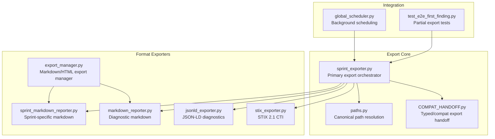
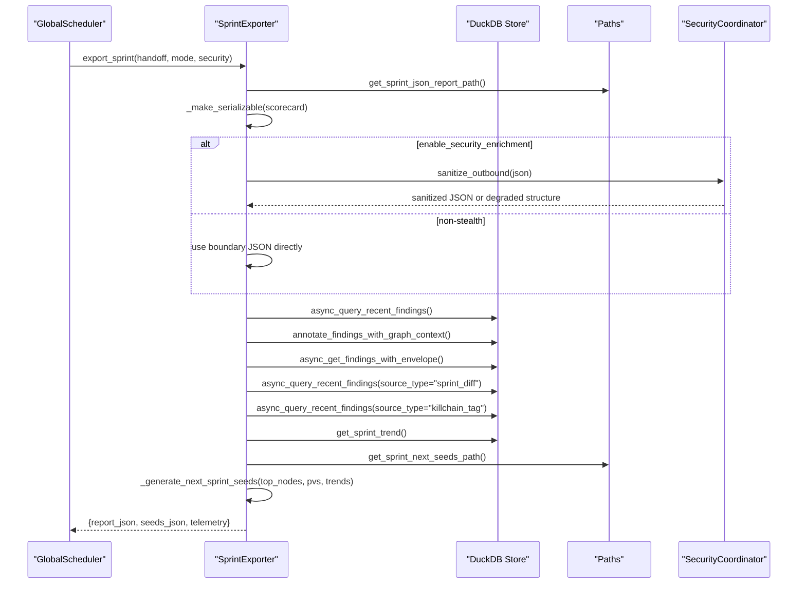
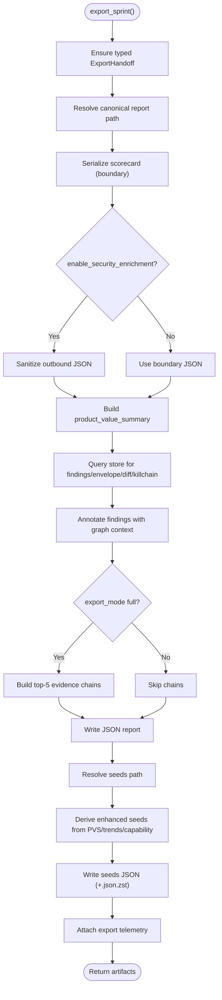
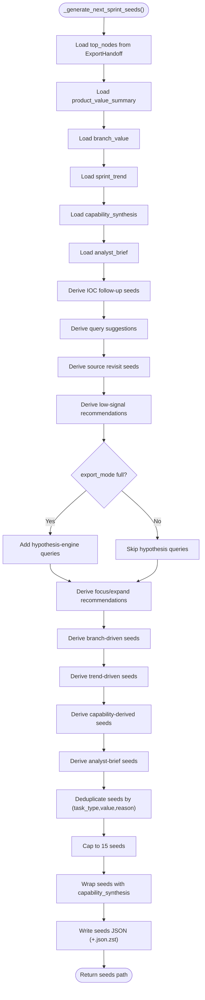
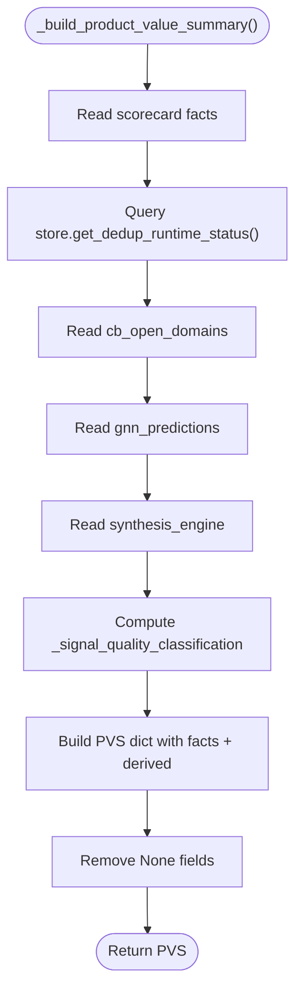
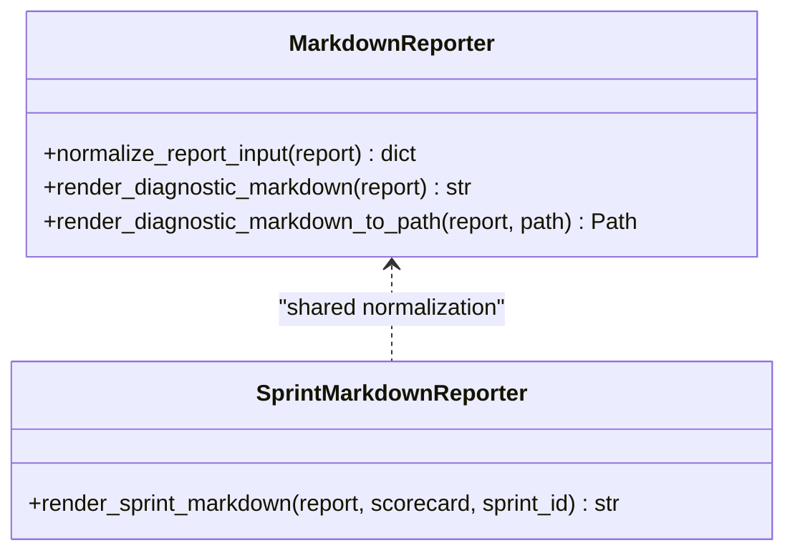
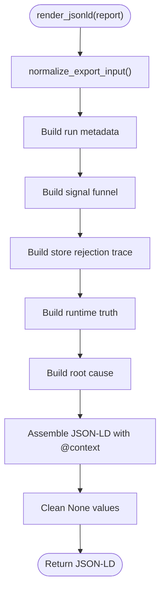
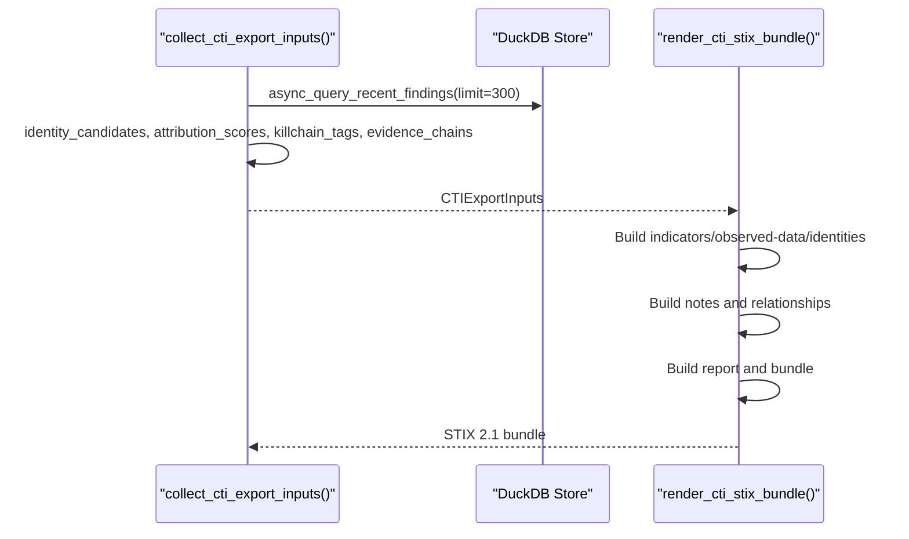
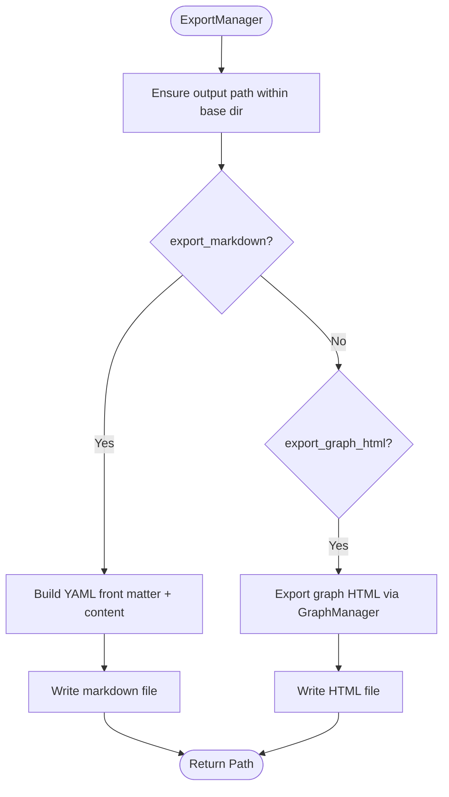
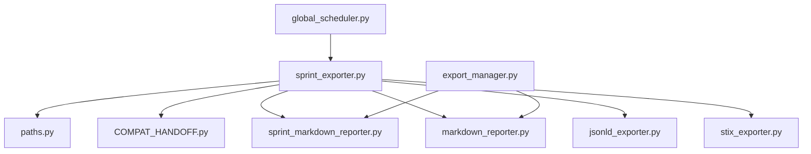

# Sprint Exporter

<cite>
**Referenced Files in This Document**
- [sprint_exporter.py](file://export/sprint_exporter.py)
- [export_manager.py](file://export/export_manager.py)
- [markdown_reporter.py](file://export/markdown_reporter.py)
- [sprint_markdown_reporter.py](file://export/sprint_markdown_reporter.py)
- [jsonld_exporter.py](file://export/jsonld_exporter.py)
- [stix_exporter.py](file://export/stix_exporter.py)
- [COMPAT_HANDOFF.py](file://export/COMPAT_HANDOFF.py)
- [paths.py](file://paths.py)
- [global_scheduler.py](file://orchestrator/global_scheduler.py)
- [test_e2e_first_finding.py](file://tests/test_e2e_first_finding.py)
</cite>

## Table of Contents
1. [Introduction](#introduction)
2. [Project Structure](#project-structure)
3. [Core Components](#core-components)
4. [Architecture Overview](#architecture-overview)
5. [Detailed Component Analysis](#detailed-component-analysis)
6. [Dependency Analysis](#dependency-analysis)
7. [Performance Considerations](#performance-considerations)
8. [Troubleshooting Guide](#troubleshooting-guide)
9. [Conclusion](#conclusion)

## Introduction
This document describes the sprint-based export system that powers automated, deterministic, and privacy-preserving export of research findings and intelligence. It covers the sprint lifecycle integration, automated export triggers, batch processing capabilities, export scheduling, and quality assurance workflows. It also documents integration with research cycles, data aggregation, consolidated reporting, configuration examples, custom export templates, automated delivery mechanisms, export timing, resource management, performance optimization for large-scale exports, and integration with monitoring systems and alerting mechanisms for export failures.

## Project Structure
The export system is organized around a set of specialized exporters and a central export manager. The core export pipeline is implemented in the sprint exporter, which coordinates JSON reports, seed generation, and enrichment data. Supporting modules provide markdown, JSON-LD, and STIX 2.1 export formats, plus a general-purpose export manager for secure, deterministic outputs.

**Diagram sources**
- [sprint_exporter.py:156-555](file://export/sprint_exporter.py#L156-L555)
- [paths.py](file://paths.py)
- [COMPAT_HANDOFF.py](file://export/COMPAT_HANDOFF.py)
- [sprint_markdown_reporter.py:144-281](file://export/sprint_markdown_reporter.py#L144-L281)
- [markdown_reporter.py:389-424](file://export/markdown_reporter.py#L389-L424)
- [jsonld_exporter.py:280-324](file://export/jsonld_exporter.py#L280-L324)
- [stix_exporter.py:749-800](file://export/stix_exporter.py#L749-L800)
- [export_manager.py:49-300](file://export/export_manager.py#L49-L300)
- [global_scheduler.py:450-455](file://orchestrator/global_scheduler.py#L450-L455)
- [test_e2e_first_finding.py:1112-1242](file://tests/test_e2e_first_finding.py#L1112-L1242)

**Section sources**
- [sprint_exporter.py:156-555](file://export/sprint_exporter.py#L156-L555)
- [export_manager.py:49-300](file://export/export_manager.py#L49-L300)
- [markdown_reporter.py:389-424](file://export/markdown_reporter.py#L389-L424)
- [sprint_markdown_reporter.py:144-281](file://export/sprint_markdown_reporter.py#L144-L281)
- [jsonld_exporter.py:280-324](file://export/jsonld_exporter.py#L280-L324)
- [stix_exporter.py:749-800](file://export/stix_exporter.py#L749-L800)
- [COMPAT_HANDOFF.py](file://export/COMPAT_HANDOFF.py)
- [paths.py](file://paths.py)
- [global_scheduler.py:450-455](file://orchestrator/global_scheduler.py#L450-L455)
- [test_e2e_first_finding.py:1112-1242](file://tests/test_e2e_first_finding.py#L1112-L1242)

## Core Components
- Sprint Export Orchestrator: Builds canonical JSON reports, derives product value summaries, attaches enrichment layers, generates next-sprint seeds, and writes deterministic artifacts with optional compression.
- Format Exporters: Provide markdown, JSON-LD, and STIX 2.1 outputs for diagnostics and CTI.
- Export Manager: Provides secure, deterministic export of markdown and interactive HTML graphs with sensitive data filtering.
- Handoff Compatibility: Normalizes typed and legacy export handoffs to ensure consistent behavior across callers.
- Path Resolution: Centralizes canonical paths for reports and seeds to ensure deterministic, relocatable outputs.

Key responsibilities:
- Automated partial exports during aggressive runs and early windup/abort for recovery.
- Privacy gates at the outbound boundary for security-enriched exports.
- Enrichment from store surfaces: dedup status, graph annotations, evidence chains, and synthesis outcomes.
- Seed generation guided by product value summary, branch trends, and capability synthesis.

**Section sources**
- [sprint_exporter.py:79-154](file://export/sprint_exporter.py#L79-L154)
- [sprint_exporter.py:156-555](file://export/sprint_exporter.py#L156-L555)
- [sprint_exporter.py:558-719](file://export/sprint_exporter.py#L558-L719)
- [COMPAT_HANDOFF.py](file://export/COMPAT_HANDOFF.py)
- [paths.py](file://paths.py)

## Architecture Overview
The export architecture integrates tightly with the research lifecycle and scheduler. Exports are triggered automatically during sprints and can be scheduled as background tasks. The system maintains deterministic outputs, applies privacy gates, and supports multiple export formats.

**Diagram sources**
- [sprint_exporter.py:156-555](file://export/sprint_exporter.py#L156-L555)
- [COMPAT_HANDOFF.py](file://export/COMPAT_HANDOFF.py)
- [paths.py](file://paths.py)

**Section sources**
- [sprint_exporter.py:156-555](file://export/sprint_exporter.py#L156-L555)

## Detailed Component Analysis

### Sprint Export Orchestrator
The orchestrator coordinates the canonical JSON report, enrichment layers, and seed generation. It enforces strict privacy boundaries and supports slim/full export modes.

**Diagram sources**
- [sprint_exporter.py:156-555](file://export/sprint_exporter.py#L156-L555)
- [sprint_exporter.py:558-719](file://export/sprint_exporter.py#L558-L719)

Key behaviors:
- Partial exports during aggressive runs and on early windup/abort for recovery.
- Privacy gate at the outbound boundary using a security coordinator when enabled.
- Enrichment from store surfaces: recent findings, envelopes, diffs, kill chain tags, and graph annotations.
- Seed generation guided by product value summary, branch value, sprint trends, and capability synthesis.

**Section sources**
- [sprint_exporter.py:79-154](file://export/sprint_exporter.py#L79-L154)
- [sprint_exporter.py:156-555](file://export/sprint_exporter.py#L156-L555)
- [sprint_exporter.py:558-719](file://export/sprint_exporter.py#L558-L719)

### Seed Generation Engine
Enhanced seed derivation uses multiple signals from the product value summary, branch trends, and capability synthesis to produce bounded, prioritized seed sets.

**Diagram sources**
- [sprint_exporter.py:558-719](file://export/sprint_exporter.py#L558-L719)

**Section sources**
- [sprint_exporter.py:558-719](file://export/sprint_exporter.py#L558-L719)

### Product Value Summary Builder
Aggregates truth surfaces into a single decision package for downstream seed generation and reporting.

**Diagram sources**
- [sprint_exporter.py:1145-1315](file://export/sprint_exporter.py#L1145-L1315)

**Section sources**
- [sprint_exporter.py:1145-1315](file://export/sprint_exporter.py#L1145-L1315)

### Markdown Exporters
Two markdown renderers provide deterministic, side-effect-free outputs:
- Diagnostic markdown reporter for generic run diagnostics.
- Sprint-specific markdown reporter for consolidated sprint reports.

**Diagram sources**
- [markdown_reporter.py:65-81](file://export/markdown_reporter.py#L65-L81)
- [markdown_reporter.py:389-424](file://export/markdown_reporter.py#L389-L424)
- [sprint_markdown_reporter.py:144-170](file://export/sprint_markdown_reporter.py#L144-L170)

**Section sources**
- [markdown_reporter.py:389-424](file://export/markdown_reporter.py#L389-L424)
- [sprint_markdown_reporter.py:144-281](file://export/sprint_markdown_reporter.py#L144-L281)

### JSON-LD Exporter
Provides structured, schema.org-compatible JSON-LD for diagnostics with a ghost namespace.

**Diagram sources**
- [jsonld_exporter.py:280-324](file://export/jsonld_exporter.py#L280-L324)

**Section sources**
- [jsonld_exporter.py:280-324](file://export/jsonld_exporter.py#L280-L324)

### STIX 2.1 Exporter
Produces metadata-safe diagnostic bundles and upgrades to CTI bundles with indicators, identities, observed data, and reports when findings are present.

**Diagram sources**
- [stix_exporter.py:99-178](file://export/stix_exporter.py#L99-L178)
- [stix_exporter.py:749-800](file://export/stix_exporter.py#L749-L800)

**Section sources**
- [stix_exporter.py:99-178](file://export/stix_exporter.py#L99-L178)
- [stix_exporter.py:749-800](file://export/stix_exporter.py#L749-L800)

### Export Manager
Provides secure, deterministic export of markdown and interactive HTML graphs with sensitive data filtering and path validation.

**Diagram sources**
- [export_manager.py:49-300](file://export/export_manager.py#L49-L300)

**Section sources**
- [export_manager.py:49-300](file://export/export_manager.py#L49-L300)

## Dependency Analysis
The export system exhibits low coupling and high cohesion:
- The orchestrator depends on path resolution and handoff compatibility.
- Format exporters share normalization utilities and rely on deterministic rendering.
- Store seams provide enrichment data without introducing new persistence.
- Background scheduling integrates with the global scheduler for non-blocking export tasks.

**Diagram sources**
- [sprint_exporter.py:156-555](file://export/sprint_exporter.py#L156-L555)
- [paths.py](file://paths.py)
- [COMPAT_HANDOFF.py](file://export/COMPAT_HANDOFF.py)
- [sprint_markdown_reporter.py:144-281](file://export/sprint_markdown_reporter.py#L144-L281)
- [markdown_reporter.py:389-424](file://export/markdown_reporter.py#L389-L424)
- [jsonld_exporter.py:280-324](file://export/jsonld_exporter.py#L280-L324)
- [stix_exporter.py:749-800](file://export/stix_exporter.py#L749-L800)
- [export_manager.py:49-300](file://export/export_manager.py#L49-L300)
- [global_scheduler.py:450-455](file://orchestrator/global_scheduler.py#L450-L455)

**Section sources**
- [sprint_exporter.py:156-555](file://export/sprint_exporter.py#L156-L555)
- [export_manager.py:49-300](file://export/export_manager.py#L49-L300)
- [global_scheduler.py:450-455](file://orchestrator/global_scheduler.py#L450-L455)

## Performance Considerations
- Compression: Both JSON reports and seeds support optional .json.zst sidecars for reduced storage and faster I/O.
- Bounded outputs: Seeds capped at 15; evidence chains capped at 5; markdown sections bounded to prevent excessive memory usage.
- Async store reads: Enrichment data is fetched asynchronously to avoid blocking the export pipeline.
- Adaptive flush intervals: Batch processing uses adaptive intervals and queue depth to balance throughput and latency.
- Resource guards: STIX export bounds object counts and bytes to manage memory footprint.

[No sources needed since this section provides general guidance]

## Troubleshooting Guide
Common issues and resolutions:
- Partial export not appearing: Verify the finding count threshold and that the partial export function is invoked during aggressive runs or early windup/abort.
- Sanitization failures: When security enrichment is enabled, sanitization failures produce a degraded structure; confirm security coordinator availability and logs.
- Missing seeds: Ensure top_nodes are provided via ExportHandoff; fallback to store-based retrieval is supported but canonical paths populate top_nodes.
- Large exports: Enable compression sidecars and consider slim export mode to reduce I/O overhead.

**Section sources**
- [test_e2e_first_finding.py:1112-1242](file://tests/test_e2e_first_finding.py#L1112-L1242)
- [sprint_exporter.py:239-283](file://export/sprint_exporter.py#L239-L283)
- [sprint_exporter.py:365-370](file://export/sprint_exporter.py#L365-L370)

## Conclusion
The sprint-based export system provides a robust, deterministic, and privacy-preserving pipeline for research intelligence. It integrates seamlessly with the research lifecycle, supports multiple export formats, and offers automated triggers and background scheduling. With bounded outputs, compression, and async enrichment, it scales to large datasets while maintaining reliability and traceability.