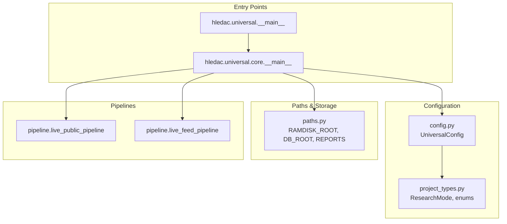
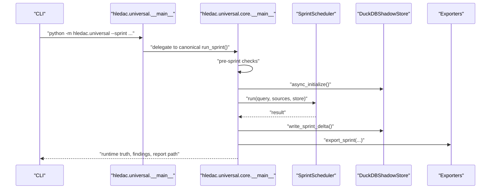
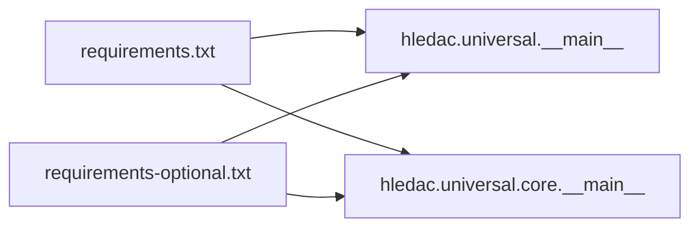

# Getting Started

<cite>
**Referenced Files in This Document**
- [requirements.txt](file://requirements.txt)
- [requirements-optional.txt](file://requirements-optional.txt)
- [__main__.py](file://__main__.py)
- [core/__main__.py](file://core/__main__.py)
- [config.py](file://config.py)
- [paths.py](file://paths.py)
- [tests/README.md](file://tests/README.md)
- [smoke_runner.py](file://smoke_runner.py)
- [project_types.py](file://project_types.py)
</cite>

## Table of Contents
1. [Introduction](#introduction)
2. [Project Structure](#project-structure)
3. [Core Components](#core-components)
4. [Architecture Overview](#architecture-overview)
5. [Detailed Component Analysis](#detailed-component-analysis)
6. [Dependency Analysis](#dependency-analysis)
7. [Performance Considerations](#performance-considerations)
8. [Troubleshooting Guide](#troubleshooting-guide)
9. [Conclusion](#conclusion)
10. [Appendices](#appendices)

## Introduction
This guide helps you install, configure, and run Hledac Universal for the first time. It covers system requirements, environment setup, dependency management, basic configuration, and a quick-start research sprint. You will learn how to interpret initial results, verify your installation, and troubleshoot common issues.

## Project Structure
Hledac Universal is a modular research platform with a canonical entrypoint and layered components for orchestration, knowledge, and intelligence. Key areas:
- Entry points: root and core modules expose CLI and canonical run paths
- Configuration: centralized presets and environment-driven tuning
- Paths: canonical runtime path roots for storage and reports
- Pipelines: live public and feed pipelines for discovery
- Tests: layered test harness optimized for M1 8GB

**Diagram sources**
- [__main__.py:1-120](file://__main__.py#L1-L120)
- [core/__main__.py:1-120](file://core/__main__.py#L1-L120)
- [config.py:228-498](file://config.py#L228-L498)
- [paths.py:111-352](file://paths.py#L111-L352)

**Section sources**
- [__main__.py:1-120](file://__main__.py#L1-L120)
- [core/__main__.py:1-120](file://core/__main__.py#L1-L120)
- [config.py:228-498](file://config.py#L228-L498)
- [paths.py:111-352](file://paths.py#L111-L352)

## Core Components
- Entry points
  - Root module: provides CLI and alternate paths
  - Core module: canonical sprint owner and orchestrator
- Configuration
  - Centralized presets for research modes and M1 optimization
  - Environment-driven overrides
- Paths
  - Canonical runtime roots for databases, keys, reports, and sprints
- Pipelines
  - Live public and default feed batches for discovery

Key responsibilities:
- Root entrypoint validates environment and boot hygiene
- Core orchestrator runs the full lifecycle, writes deltas, and generates reports
- Configuration presets tune memory, agents, and features for M1 8GB
- Paths ensure secure, ephemeral storage and deterministic report locations

**Section sources**
- [__main__.py:1-120](file://__main__.py#L1-L120)
- [core/__main__.py:1-120](file://core/__main__.py#L1-L120)
- [config.py:36-117](file://config.py#L36-L117)
- [paths.py:111-352](file://paths.py#L111-L352)

## Architecture Overview
The canonical run path is through the core module’s sprint owner. It wires lifecycle, monitors UMA, and writes canonical runtime truth and deltas. Alternate paths exist for diagnostics and probes.

**Diagram sources**
- [__main__.py:1-120](file://__main__.py#L1-L120)
- [core/__main__.py:320-520](file://core/__main__.py#L320-L520)

**Section sources**
- [__main__.py:1-120](file://__main__.py#L1-L120)
- [core/__main__.py:320-520](file://core/__main__.py#L320-L520)

## Detailed Component Analysis

### Installation and System Requirements
- Python
  - Use a supported interpreter; the project includes a CLI entrypoint and relies on async runtime features
- Operating system
  - Designed for macOS M1/M2; memory and thermal constraints are optimized for M1 8GB
- Dependencies
  - Required: see [requirements.txt:1-32](file://requirements.txt#L1-L32)
  - Optional accelerators: see [requirements-optional.txt:1-54](file://requirements-optional.txt#L1-L54)

Verification steps:
- Confirm Python interpreter and version
- Install dependencies from both requirement files
- Optionally install optional accelerators for performance and extended features

**Section sources**
- [requirements.txt:1-32](file://requirements.txt#L1-L32)
- [requirements-optional.txt:1-54](file://requirements-optional.txt#L1-L54)

### Environment Setup and Paths
- Runtime roots
  - RAMDISK_ROOT: preferred ephemeral storage; fallback to user home if unavailable
  - DB_ROOT, KEYS_ROOT, RUNS_ROOT, SOCKETS_ROOT, CACHE_ROOT: managed directories
  - Reports: canonical path for sprint reports under user home
- Environment variables
  - GHOST_RAMDISK: select active ramdisk mount
  - GHOST_LMDB_MAX_SIZE_MB: LMDB map size
  - HLEDAC_SPRINT_STORE: persistent sprint store root
  - HLEDAC_RESEARCH_MODE, HLEDAC_M1_OPTIMIZED, HLEDAC_LOG_LEVEL: configuration overrides

Validation:
- Ensure RAMDISK_ROOT is mounted or accept fallback behavior
- Verify directory permissions for security-sensitive roots
- Check canonical report paths for generated outputs

**Section sources**
- [paths.py:111-352](file://paths.py#L111-L352)

### Configuration and Presets
- Research modes
  - QUICK, STANDARD, DEEP, EXTREME, AUTONOMOUS with tuned parameters
- M1 optimization presets
  - Memory ceilings, agent limits, and feature toggles for 8GB devices
- Environment-driven configuration
  - Research mode, memory limit, max steps, log level

Usage tips:
- Start with STANDARD mode on M1 8GB
- Adjust max steps and concurrent agents conservatively
- Use environment variables to override defaults without editing code

**Section sources**
- [config.py:36-117](file://config.py#L36-L117)
- [config.py:466-498](file://config.py#L466-L498)
- [config.py:494-498](file://config.py#L494-L498)

### Running the Platform and Command-Line Options
- Canonical run path
  - Entry: python -m hledac.universal.core --sprint
  - Parameters: query, duration, export directory, aggressive mode, UI mode
- Root dispatcher
  - Entry: python -m hledac.universal --sprint
  - Delegates to canonical path
- Alternate paths
  - Public passive run and diagnostic probes exist for testing

Quick invocation:
- python -m hledac.universal.core --sprint --query "your topic" --duration 1800

Notes:
- The core module is the canonical sprint owner; root dispatcher delegates to it
- Alternate paths are for diagnostics and do not produce canonical truth

**Section sources**
- [__main__.py:1-120](file://__main__.py#L1-L120)
- [core/__main__.py:320-520](file://core/__main__.py#L320-L520)

### Understanding Results and Reports
- Runtime truth
  - Includes meaningful vs smoke classification, primary signal source, and branch timeouts
- Sprint delta
  - Stored in DuckDB with metrics like findings per minute and UMA delta
- Reports
  - Canonical report path computed under user home; JSON and Markdown variants
- Verdicts and hints
  - Heuristics summarize performance and suggest next steps

Interpretation tips:
- “Meaningful active run” indicates sustained discovery
- “Hardware-limited smoke” indicates memory/swap pressure blocked entry
- “Public-led” vs “feed-led” highlights dominant discovery source

**Section sources**
- [core/__main__.py:640-762](file://core/__main__.py#L640-L762)
- [paths.py:293-352](file://paths.py#L293-L352)

### Quick Start Guide: First Research Sprint
Follow these steps to run your first research sprint:

1. Prepare environment
   - Ensure Python interpreter is available
   - Install dependencies from [requirements.txt:1-32](file://requirements.txt#L1-L32) and [requirements-optional.txt:1-54](file://requirements-optional.txt#L1-L54)
   - Optionally set GHOST_RAMDISK to an active ramdisk mount

2. Choose configuration
   - Start with STANDARD mode and M1 optimization
   - Optionally set HLEDAC_RESEARCH_MODE, HLEDAC_M1_OPTIMIZED, HLEDAC_LOG_LEVEL

3. Run the sprint
   - python -m hledac.universal.core --sprint --query "LockBit ransomware" --duration 1800

4. Inspect results
   - Review logs for runtime truth and verdict
   - Check canonical report path under ~/.hledac/reports
   - Examine sprint delta in DuckDB store

5. Iterate
   - Adjust query, duration, or agent concurrency based on hints

Verification checklist:
- RAMDISK_ROOT is accessible or fallback is acceptable
- At least one finding accepted
- Report files generated under canonical path
- No “hardware-limited smoke” classification

**Section sources**
- [requirements.txt:1-32](file://requirements.txt#L1-L32)
- [requirements-optional.txt:1-54](file://requirements-optional.txt#L1-L54)
- [paths.py:111-352](file://paths.py#L111-L352)
- [core/__main__.py:640-762](file://core/__main__.py#L640-L762)

### Diagnostics and Smoke Testing
- Smoke runner
  - Lightweight smoke test without network
  - Validates imports, semaphores, and basic runtime
- Test harness
  - Probe gates, AO canary, phase gates, and sprint suites
  - Optimized for M1 8GB constraints

Recommended workflow:
- Run smoke tests before PRs
- Use AO canary for lifecycle checks
- Run phase gates for sprint-focused tests

**Section sources**
- [smoke_runner.py:1-150](file://smoke_runner.py#L1-L150)
- [tests/README.md:26-123](file://tests/README.md#L26-L123)

## Dependency Analysis
Required and optional dependencies are declared in dedicated requirement files. The root entrypoint documents runtime roles and deprecations.

**Diagram sources**
- [requirements.txt:1-32](file://requirements.txt#L1-L32)
- [requirements-optional.txt:1-54](file://requirements-optional.txt#L1-L54)
- [__main__.py:1-120](file://__main__.py#L1-L120)
- [core/__main__.py:1-120](file://core/__main__.py#L1-L120)

**Section sources**
- [requirements.txt:1-32](file://requirements.txt#L1-L32)
- [requirements-optional.txt:1-54](file://requirements-optional.txt#L1-L54)
- [__main__.py:1-120](file://__main__.py#L1-L120)

## Performance Considerations
- M1 8GB optimization
  - Memory limits, agent concurrency, and feature toggles are tuned for constrained RAM
- Thermal and memory monitoring
  - Pre-sprint checks and UMA sampling inform smoke classification
- Optional accelerators
  - Optional packages improve throughput and reduce latency when available

Recommendations:
- Keep concurrent agents and knowledge/graph features aligned with M1 constraints
- Enable optional accelerators for heavy workloads
- Monitor RAM and swap usage during long runs

**Section sources**
- [config.py:36-117](file://config.py#L36-L117)
- [config.py:432-464](file://config.py#L432-L464)
- [core/__main__.py:221-251](file://core/__main__.py#L221-L251)

## Troubleshooting Guide
Common issues and resolutions:

- RAMDISK not available
  - Set GHOST_RAMDISK to an active mount or accept fallback to user home
  - Verify canonical paths and cleanup behavior
- Memory pressure or swap usage
  - Reduce concurrent agents and disable heavy features
  - Check pre-sprint UMA readings and hardware-limited smoke classification
- Import or module errors
  - Use smoke runner to validate canonical runtime imports
  - Run AO canary and phase gates for targeted checks
- Network/TOR connectivity
  - Public discovery may degrade; verify TOR/proxy configuration
- Long runs and thermal throttling
  - Shorten duration or split into multiple sprints
  - Monitor thermal thresholds and adjust pacing

Verification steps:
- Confirm canonical report path exists and contains outputs
- Validate sprint delta records in DuckDB
- Review runtime truth for meaningful vs smoke classification

**Section sources**
- [paths.py:111-352](file://paths.py#L111-L352)
- [core/__main__.py:221-251](file://core/__main__.py#L221-L251)
- [tests/README.md:221-238](file://tests/README.md#L221-L238)
- [smoke_runner.py:249-290](file://smoke_runner.py#L249-L290)

## Conclusion
You are ready to install Hledac Universal, configure it for M1 8GB, and run your first research sprint. Use the canonical core entrypoint, validate with smoke tests, and iterate based on runtime truth and report outputs. For deeper exploration, consult the layered test harness and optional accelerators.

## Appendices

### Appendix A: Environment Variables
- GHOST_RAMDISK: Select active ramdisk mount
- GHOST_LMDB_MAX_SIZE_MB: LMDB map size
- HLEDAC_SPRINT_STORE: Persistent sprint store root
- HLEDAC_RESEARCH_MODE: quick, standard, deep, extreme, autonomous
- HLEDAC_M1_OPTIMIZED: true/false
- HLEDAC_LOG_LEVEL: DEBUG, INFO, WARNING, ERROR
- HLEDAC_MEMORY_LIMIT_MB: Override memory limit
- HLEDAC_MAX_STEPS: Override max steps
- HLEDAC_OFFLINE: 1 to disable network operations

**Section sources**
- [paths.py:169-200](file://paths.py#L169-L200)
- [config.py:466-498](file://config.py#L466-L498)
- [project_types.py:58-61](file://project_types.py#L58-L61)