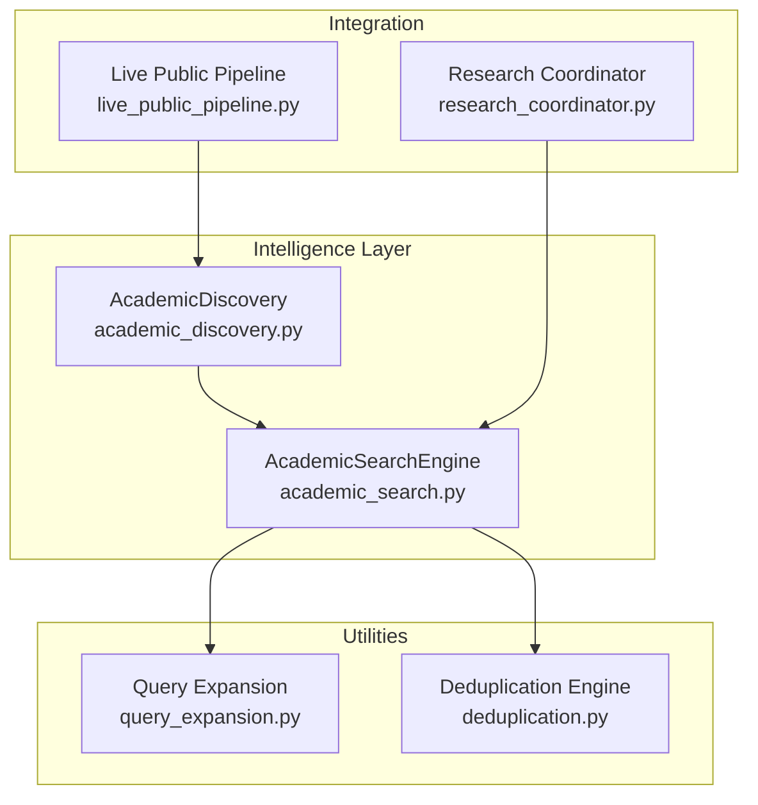
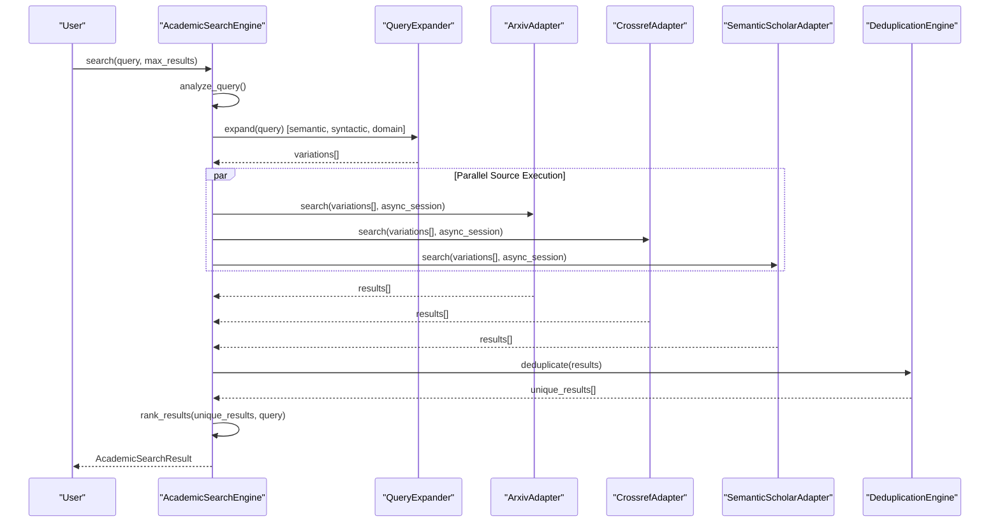
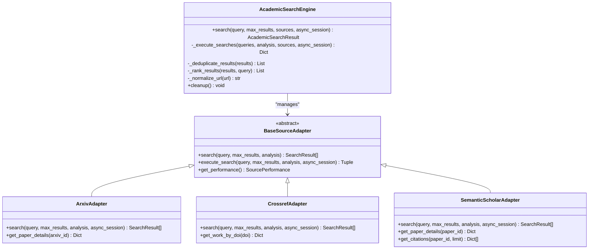
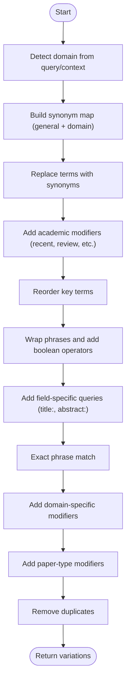
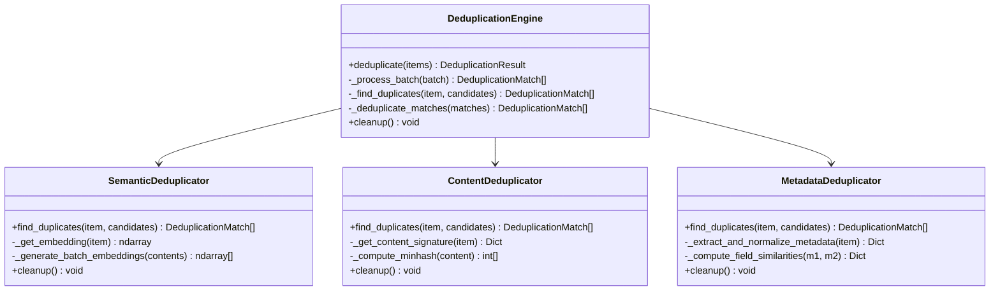
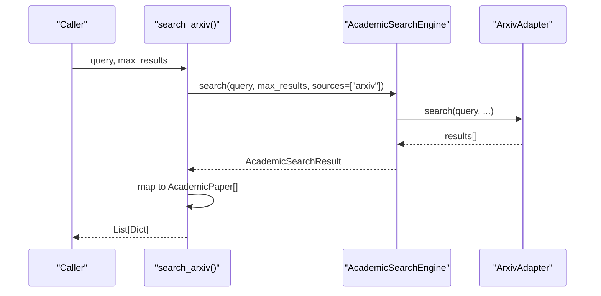
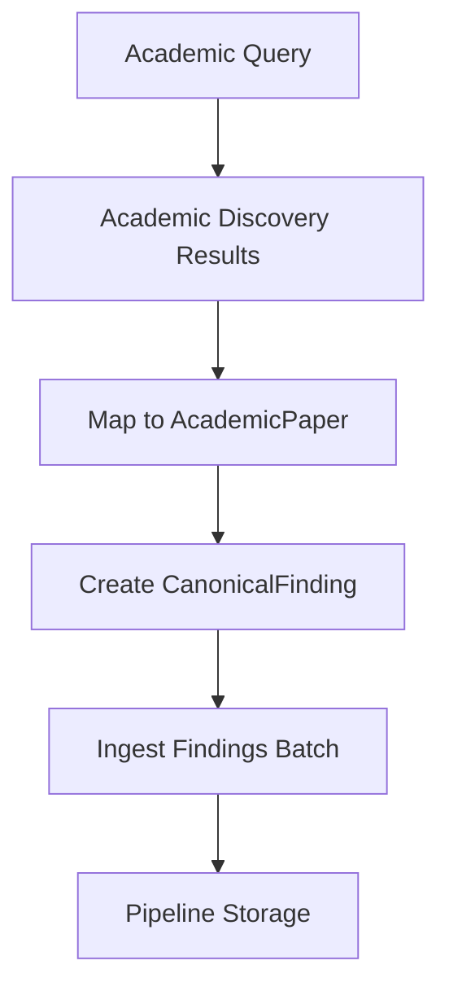
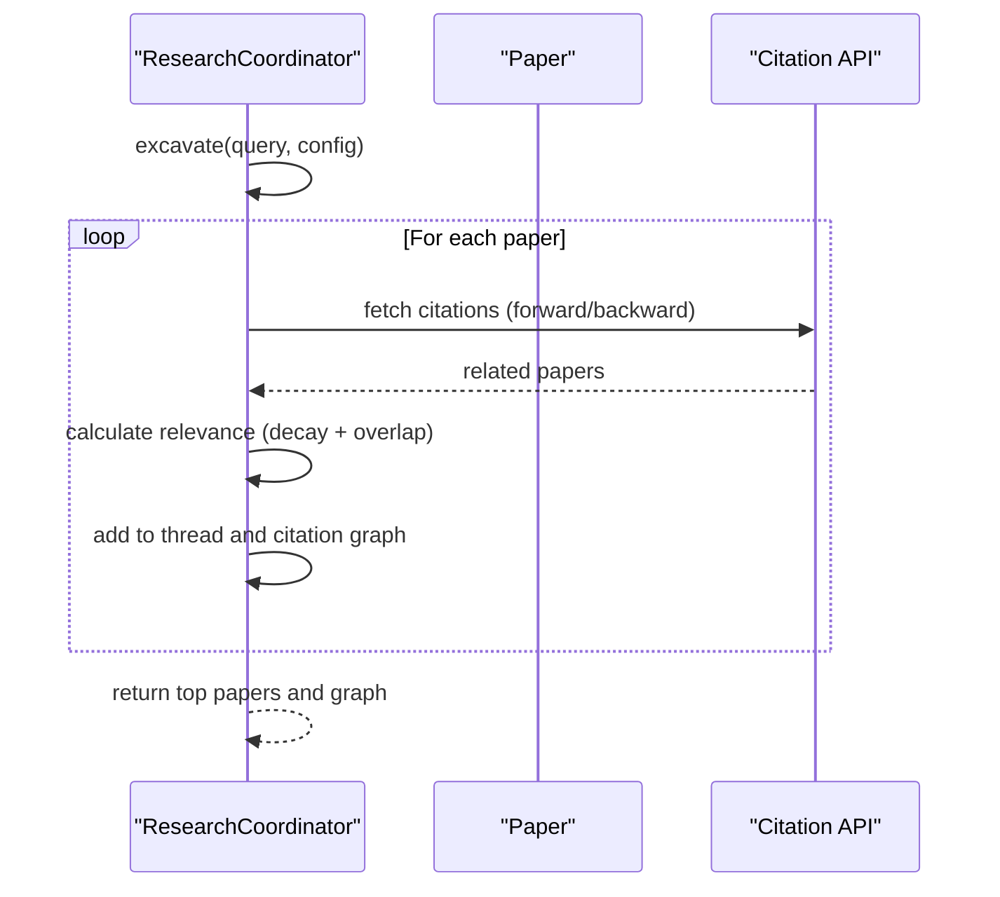
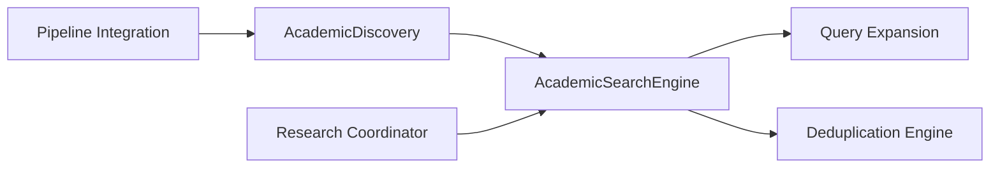

# Academic Intelligence

<cite>
**Referenced Files in This Document**
- [academic_search.py](file://intelligence/academic_search.py)
- [academic_discovery.py](file://intelligence/academic_discovery.py)
- [query_expansion.py](file://utils/query_expansion.py)
- [deduplication.py](file://utils/deduplication.py)
- [live_public_pipeline.py](file://pipeline/live_public_pipeline.py)
- [research_coordinator.py](file://coordinators/research_coordinator.py)
</cite>

## Table of Contents
1. [Introduction](#introduction)
2. [Project Structure](#project-structure)
3. [Core Components](#core-components)
4. [Architecture Overview](#architecture-overview)
5. [Detailed Component Analysis](#detailed-component-analysis)
6. [Dependency Analysis](#dependency-analysis)
7. [Performance Considerations](#performance-considerations)
8. [Troubleshooting Guide](#troubleshooting-guide)
9. [Conclusion](#conclusion)

## Introduction
This document describes the Academic Intelligence module, which provides multi-source academic search, discovery, and integration capabilities. It covers:
- Multi-source querying across ArXiv, Crossref, and Semantic Scholar
- Query expansion using semantic, syntactic, and domain-specific strategies
- Result deduplication and ranking
- Citation-aware metadata extraction and relevance scoring
- Integration with the broader research pipeline for ingestion and downstream synthesis

The module is designed for M1-optimized performance, robust error handling, and extensibility across academic domains.

## Project Structure
The Academic Intelligence module is organized into focused components:
- Intelligence layer: academic search engine and convenience discovery functions
- Utilities: query expansion and deduplication engines
- Pipeline integration: ingestion of academic findings into the research pipeline
- Research coordination: deep excavation and citation graph building

**Diagram sources**
- [academic_search.py:787-1232](file://intelligence/academic_search.py#L787-L1232)
- [academic_discovery.py:1-301](file://intelligence/academic_discovery.py#L1-L301)
- [query_expansion.py:340-751](file://utils/query_expansion.py#L340-L751)
- [deduplication.py:904-1067](file://utils/deduplication.py#L904-L1067)
- [live_public_pipeline.py:2067-2092](file://pipeline/live_public_pipeline.py#L2067-L2092)
- [research_coordinator.py:172-1200](file://coordinators/research_coordinator.py#L172-L1200)

**Section sources**
- [academic_search.py:1-1369](file://intelligence/academic_search.py#L1-L1369)
- [academic_discovery.py:1-301](file://intelligence/academic_discovery.py#L1-L301)
- [query_expansion.py:1-940](file://utils/query_expansion.py#L1-L940)
- [deduplication.py:1-1428](file://utils/deduplication.py#L1-L1428)
- [live_public_pipeline.py:2067-2092](file://pipeline/live_public_pipeline.py#L2067-L2092)
- [research_coordinator.py:1-1374](file://coordinators/research_coordinator.py#L1-L1374)

## Core Components
- AcademicSearchEngine: orchestrates multi-source search, query expansion, parallel execution, deduplication, and ranking.
- Source adapters: ArxivAdapter, CrossrefAdapter, SemanticScholarAdapter implement unified search interfaces.
- AcademicDiscovery: convenience functions for single-source searches and concurrent multi-source discovery.
- Query expansion: semantic, syntactic, and domain-specific strategies to broaden coverage.
- Deduplication engine: hybrid semantic/content/metadata deduplication with caching and LSH clustering.
- Pipeline integration: transforms academic results into CanonicalFinding entries for ingestion.
- Research coordinator: supports deep excavation and citation graph construction.

**Section sources**
- [academic_search.py:787-1232](file://intelligence/academic_search.py#L787-L1232)
- [academic_discovery.py:77-261](file://intelligence/academic_discovery.py#L77-L261)
- [query_expansion.py:340-751](file://utils/query_expansion.py#L340-L751)
- [deduplication.py:904-1067](file://utils/deduplication.py#L904-L1067)

## Architecture Overview
The Academic Intelligence architecture follows a layered design:
- Input: user query and configuration
- Query expansion: generate multiple query variants
- Parallel source execution: execute searches across adapters with concurrency control
- Result processing: deduplication, ranking, and metadata enrichment
- Output: structured results and optional integration hooks

**Diagram sources**
- [academic_search.py:873-1176](file://intelligence/academic_search.py#L873-L1176)
- [query_expansion.py:700-751](file://utils/query_expansion.py#L700-L751)
- [deduplication.py:925-1047](file://utils/deduplication.py#L925-L1047)

## Detailed Component Analysis

### AcademicSearchEngine
The engine coordinates the entire academic search lifecycle:
- Query analysis and expansion
- Parallel execution across adapters with throttling and session reuse
- Deduplication using semantic, content, and metadata strategies
- Ranking by match score, source reliability, and citation counts
- Performance tracking and cleanup

Key behaviors:
- Uses a shared aiohttp session when provided to reduce connection overhead.
- Applies a semaphore to cap concurrency across sources.
- Supports disabling expansion or deduplication for specialized workflows.

**Diagram sources**
- [academic_search.py:787-1232](file://intelligence/academic_search.py#L787-L1232)

**Section sources**
- [academic_search.py:873-1176](file://intelligence/academic_search.py#L873-L1176)

### Query Expansion Strategies
The system implements three complementary strategies:
- SemanticExpansionStrategy: synonym replacement and academic modifiers
- SyntacticExpansionStrategy: phrase reordering, boolean expressions, and field queries
- DomainSpecificExpansionStrategy: domain indicators and paper-type modifiers

These strategies generate weighted query variations that improve recall across academic databases.

**Diagram sources**
- [query_expansion.py:368-697](file://utils/query_expansion.py#L368-L697)

**Section sources**
- [query_expansion.py:340-751](file://utils/query_expansion.py#L340-L751)

### Deduplication Engine
The engine applies a hybrid approach:
- Semantic: vector embeddings with caching and SimHash LSH clustering
- Content: exact hash, character hash, MinHash Jaccard similarity
- Metadata: weighted field comparisons with normalization

It tracks statistics, supports batch processing, and provides non-blocking cleanup.

**Diagram sources**
- [deduplication.py:904-1067](file://utils/deduplication.py#L904-L1067)

**Section sources**
- [deduplication.py:904-1067](file://utils/deduplication.py#L904-L1067)

### Academic Discovery Functions
Convenience functions wrap the AcademicSearchEngine for single-source and concurrent multi-source discovery:
- search_arxiv, search_crossref, search_semantic_scholar
- search_academic_all: concurrent execution with rate limiting

These functions convert adapter results into a standardized AcademicPaper structure.

**Diagram sources**
- [academic_discovery.py:77-127](file://intelligence/academic_discovery.py#L77-L127)

**Section sources**
- [academic_discovery.py:77-261](file://intelligence/academic_discovery.py#L77-L261)

### Pipeline Integration
Academic results are transformed into CanonicalFinding entries and ingested into the research pipeline. The pipeline stores findings with provenance and confidence, enabling downstream synthesis and analysis.

**Diagram sources**
- [live_public_pipeline.py:2067-2092](file://pipeline/live_public_pipeline.py#L2067-L2092)
- [academic_discovery.py:77-217](file://intelligence/academic_discovery.py#L77-L217)

**Section sources**
- [live_public_pipeline.py:2067-2092](file://pipeline/live_public_pipeline.py#L2067-L2092)
- [academic_discovery.py:77-217](file://intelligence/academic_discovery.py#L77-L217)

### Research Coordination and Citation Graphs
The Research Coordinator supports deep excavation of academic literature:
- Citation-aware relevance scoring
- Forward/backward citation fetching (placeholder for real APIs)
- Citation graph construction for meta-synthesis

**Diagram sources**
- [research_coordinator.py:1000-1131](file://coordinators/research_coordinator.py#L1000-L1131)

**Section sources**
- [research_coordinator.py:1000-1131](file://coordinators/research_coordinator.py#L1000-L1131)

## Dependency Analysis
The Academic Intelligence module exhibits clean separation of concerns:
- Intelligence depends on utilities for expansion and deduplication
- Discovery functions depend on the engine for execution
- Pipeline integration depends on discovery outputs
- Research coordination depends on engine outputs and citation APIs

**Diagram sources**
- [academic_search.py:800-871](file://intelligence/academic_search.py#L800-L871)
- [academic_discovery.py:34-38](file://intelligence/academic_discovery.py#L34-L38)
- [deduplication.py:904-923](file://utils/deduplication.py#L904-L923)
- [live_public_pipeline.py:2067-2092](file://pipeline/live_public_pipeline.py#L2067-L2092)
- [research_coordinator.py:172-1200](file://coordinators/research_coordinator.py#L172-L1200)

**Section sources**
- [academic_search.py:800-871](file://intelligence/academic_search.py#L800-L871)
- [academic_discovery.py:34-38](file://intelligence/academic_discovery.py#L34-L38)
- [deduplication.py:904-923](file://utils/deduplication.py#L904-L923)
- [live_public_pipeline.py:2067-2092](file://pipeline/live_public_pipeline.py#L2067-L2092)
- [research_coordinator.py:172-1200](file://coordinators/research_coordinator.py#L172-L1200)

## Performance Considerations
- Concurrency control: semaphore-based throttling prevents overload across adapters.
- Session reuse: shared aiohttp sessions reduce connection overhead.
- Deduplication efficiency: SimHash LSH clustering and embedding caches minimize computational cost.
- Memory awareness: bounded caches and thread pools adapt to M1 constraints.
- Rate limiting: per-source rate limits and adaptive delays mitigate API penalties.

[No sources needed since this section provides general guidance]

## Troubleshooting Guide
Common issues and resolutions:
- Timeout errors: adjust timeouts in SourceConfig and handle asyncio.TimeoutError gracefully.
- Rate limits: respect per-source rate limits; the engine logs warnings and continues.
- Parsing failures: XML/JSON parsing errors are caught and logged; results may be partial.
- Deduplication stalls: ensure cleanup is called to release thread pools and caches.
- Pipeline ingestion errors: verify CanonicalFinding creation and ingest batch operations.

**Section sources**
- [academic_search.py:335-340](file://intelligence/academic_search.py#L335-L340)
- [academic_search.py:499-504](file://intelligence/academic_search.py#L499-L504)
- [academic_search.py:666-671](file://intelligence/academic_search.py#L666-L671)
- [deduplication.py:1052-1057](file://utils/deduplication.py#L1052-L1057)

## Conclusion
The Academic Intelligence module delivers a robust, extensible framework for academic search and discovery. Its multi-source querying, intelligent expansion, and hybrid deduplication produce high-quality, de-duplicated results suitable for integration into broader research workflows. The design emphasizes performance, reliability, and maintainability, enabling seamless pipeline integration and advanced research coordination.