# Advanced Image OSINT

<cite>
**Referenced Files in This Document**
- [advanced_image_osint.py](file://intelligence/advanced_image_osint.py)
- [vision_encoder.py](file://multimodal/vision_encoder.py)
- [analyzer.py](file://multimodal/analyzer.py)
- [vision_analyzer.py](file://tools/vision_analyzer.py)
- [ocr_engine.py](file://tools/ocr_engine.py)
- [evidence_triage.py](file://multimodal/evidence_triage.py)
- [enrichment_service.py](file://forensics/enrichment_service.py)
- [privacy_enhanced_research.py](file://coordinators/privacy_enhanced_research.py)
</cite>

## Table of Contents
1. [Introduction](#introduction)
2. [Project Structure](#project-structure)
3. [Core Components](#core-components)
4. [Architecture Overview](#architecture-overview)
5. [Detailed Component Analysis](#detailed-component-analysis)
6. [Dependency Analysis](#dependency-analysis)
7. [Performance Considerations](#performance-considerations)
8. [Troubleshooting Guide](#troubleshooting-guide)
9. [Conclusion](#conclusion)
10. [Appendices](#appendices)

## Introduction
This document describes the Advanced Image OSINT module, focusing on sophisticated image analysis capabilities for Open-Source Intelligence (OSINT) research. It covers visual pattern recognition, object detection, and multimedia intelligence processing, integrating with vision encoders, image enhancement algorithms, and visual evidence analysis workflows. The module supports automated image processing, visual pattern matching, and multimedia evidence extraction, while aligning with the multimodal processing layer and computer vision algorithms. Privacy-preserving analysis techniques and configuration options for image quality parameters and detection thresholds are documented.

## Project Structure
The Advanced Image OSINT module is organized around three primary areas:
- Core image analysis and perceptual hashing for similarity detection
- Multimodal enrichment and vision encoder integration
- Forensics and triage workflows for metadata, OCR, and URL/domain extraction

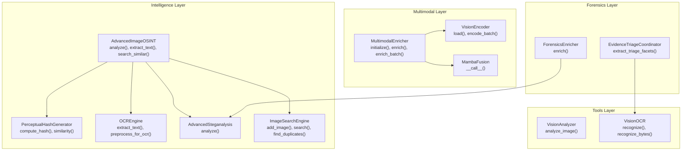

**Diagram sources**
- [advanced_image_osint.py:548-622](file://intelligence/advanced_image_osint.py#L548-L622)
- [vision_encoder.py:22-88](file://multimodal/vision_encoder.py#L22-L88)
- [analyzer.py:217-532](file://multimodal/analyzer.py#L217-L532)
- [vision_analyzer.py:29-128](file://tools/vision_analyzer.py#L29-L128)
- [ocr_engine.py:18-117](file://tools/ocr_engine.py#L18-L117)
- [evidence_triage.py:142-467](file://multimodal/evidence_triage.py#L142-L467)
- [enrichment_service.py:242-474](file://forensics/enrichment_service.py#L242-L474)

**Section sources**
- [advanced_image_osint.py:1-636](file://intelligence/advanced_image_osint.py#L1-L636)
- [vision_encoder.py:1-89](file://multimodal/vision_encoder.py#L1-L89)
- [analyzer.py:1-876](file://multimodal/analyzer.py#L1-L876)
- [vision_analyzer.py:1-129](file://tools/vision_analyzer.py#L1-L129)
- [ocr_engine.py:1-118](file://tools/ocr_engine.py#L1-L118)
- [evidence_triage.py:1-468](file://multimodal/evidence_triage.py#L1-L468)
- [enrichment_service.py:1-645](file://forensics/enrichment_service.py#L1-L645)

## Core Components
- AdvancedImageOSINT: orchestrates comprehensive image analysis including perceptual hashing, OCR, steganalysis, and similarity search.
- PerceptualHashGenerator: computes multiple perceptual hashes (aHash, pHash, dHash, wHash) and calculates similarity scores.
- OCREngine: extracts text from images using OCR engines with preprocessing for improved accuracy.
- AdvancedSteganalysis: performs LSB entropy analysis, chi-square testing, and Error Level Analysis (ELA) to detect hidden data.
- ImageSearchEngine: maintains an index of perceptual hashes for reverse image search and duplicate detection.
- MultimodalEnricher: integrates VisionEncoder and optional fusion models to produce embeddings and enrich findings.
- VisionEncoder: loads CoreML models (with fallback) and encodes images to embeddings with batching support.
- EvidenceTriageCoordinator: extracts triage facets (title/author, EXIF/GPS, OCR snippets, file hashes, embedded URLs/domains).
- ForensicsEnricher: enriches findings with metadata, steganalysis, and digital ghost detection; supports external lookups.
- VisionAnalyzer and VisionOCR: macOS Vision framework integrations for OCR, barcode detection, face detection, and feature prints.

**Section sources**
- [advanced_image_osint.py:548-622](file://intelligence/advanced_image_osint.py#L548-L622)
- [vision_encoder.py:22-88](file://multimodal/vision_encoder.py#L22-L88)
- [analyzer.py:217-532](file://multimodal/analyzer.py#L217-L532)
- [vision_analyzer.py:29-128](file://tools/vision_analyzer.py#L29-L128)
- [ocr_engine.py:18-117](file://tools/ocr_engine.py#L18-L117)
- [evidence_triage.py:142-467](file://multimodal/evidence_triage.py#L142-L467)
- [enrichment_service.py:242-474](file://forensics/enrichment_service.py#L242-L474)

## Architecture Overview
The Advanced Image OSINT module integrates with the multimodal processing layer and forensics workflows to deliver robust visual intelligence. The flow begins with image ingestion, followed by perceptual hashing and OCR, then steganalysis and similarity search. Multimodal enrichment augments findings with embeddings and optional fusion. Forensics triage extracts metadata and OCR-derived facets, while privacy controls govern data handling.

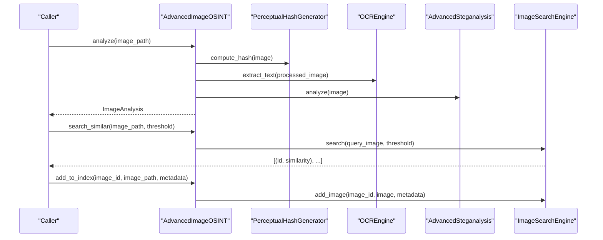

**Diagram sources**
- [advanced_image_osint.py:568-622](file://intelligence/advanced_image_osint.py#L568-L622)

**Section sources**
- [advanced_image_osint.py:548-622](file://intelligence/advanced_image_osint.py#L548-L622)

## Detailed Component Analysis

### AdvancedImageOSINT
AdvancedImageOSINT is the central orchestrator for image OSINT. It loads images, computes file and perceptual hashes, and performs OCR and steganalysis. It also exposes methods for similarity search and index management.

Key responsibilities:
- Load and validate images
- Compute perceptual hashes
- Extract OCR results with preprocessing
- Run steganalysis
- Manage similarity index and search

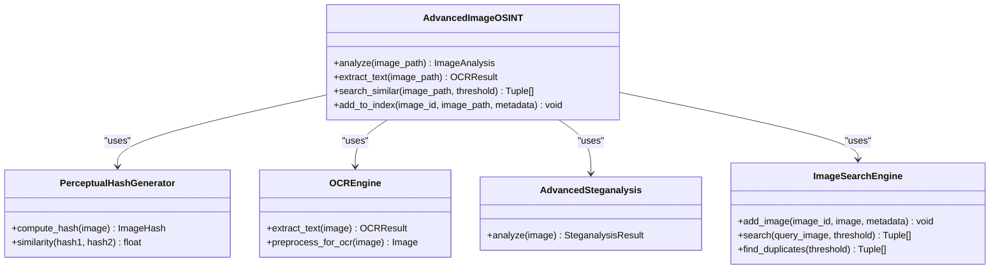

**Diagram sources**
- [advanced_image_osint.py:548-622](file://intelligence/advanced_image_osint.py#L548-L622)

**Section sources**
- [advanced_image_osint.py:548-622](file://intelligence/advanced_image_osint.py#L548-L622)

### PerceptualHashGenerator
Computes multiple perceptual hashes and similarity scores. It includes:
- Average hash (aHash)
- Perceptual hash using DCT (pHash)
- Difference hash (dHash)
- Wavelet hash (wHash)

Similarity calculation combines multiple hash comparisons with weighted normalization.

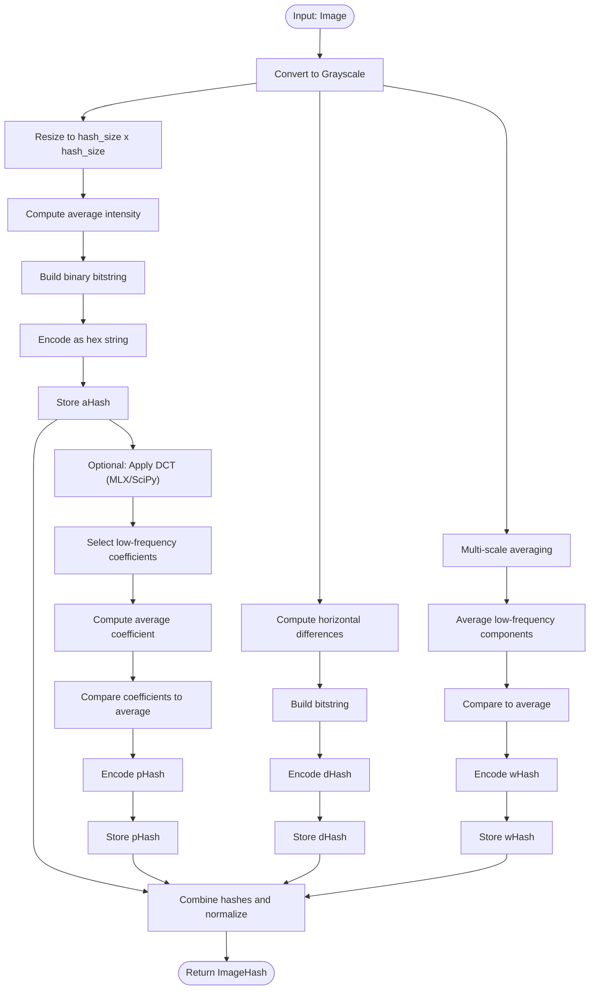

**Diagram sources**
- [advanced_image_osint.py:105-239](file://intelligence/advanced_image_osint.py#L105-L239)

**Section sources**
- [advanced_image_osint.py:105-239](file://intelligence/advanced_image_osint.py#L105-L239)

### OCREngine
OCR engine extracts text from images using OCR engines with preprocessing for improved accuracy. It includes:
- Preprocessing: grayscale conversion, contrast enhancement, median filter denoising
- OCR extraction with confidence thresholds and bounding boxes
- Async processing for performance

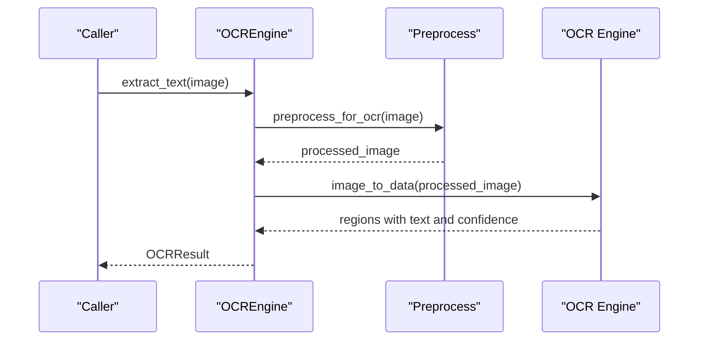

**Diagram sources**
- [advanced_image_osint.py:241-335](file://intelligence/advanced_image_osint.py#L241-L335)

**Section sources**
- [advanced_image_osint.py:241-335](file://intelligence/advanced_image_osint.py#L241-L335)

### AdvancedSteganalysis
Performs comprehensive steganalysis using:
- LSB entropy analysis
- Chi-square test for LSB distribution anomalies
- Error Level Analysis (ELA) to detect compression inconsistencies

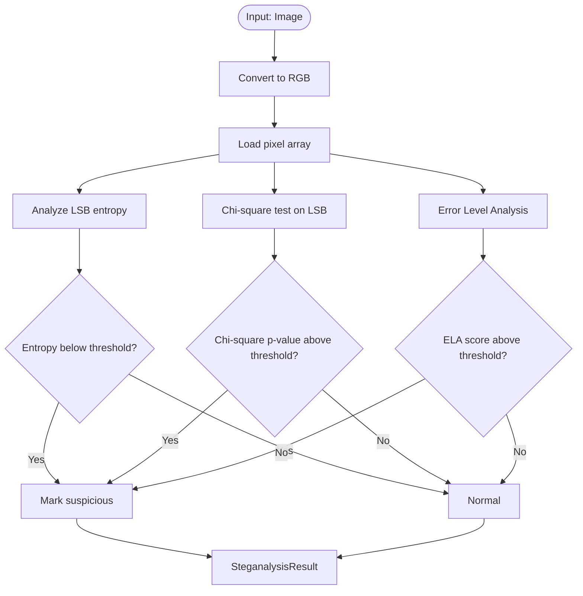

**Diagram sources**
- [advanced_image_osint.py:337-478](file://intelligence/advanced_image_osint.py#L337-L478)

**Section sources**
- [advanced_image_osint.py:337-478](file://intelligence/advanced_image_osint.py#L337-L478)

### ImageSearchEngine
Maintains an index of perceptual hashes for similarity search and duplicate detection. It supports:
- Adding images to the index
- Searching for similar images with configurable thresholds
- Finding near-duplicates

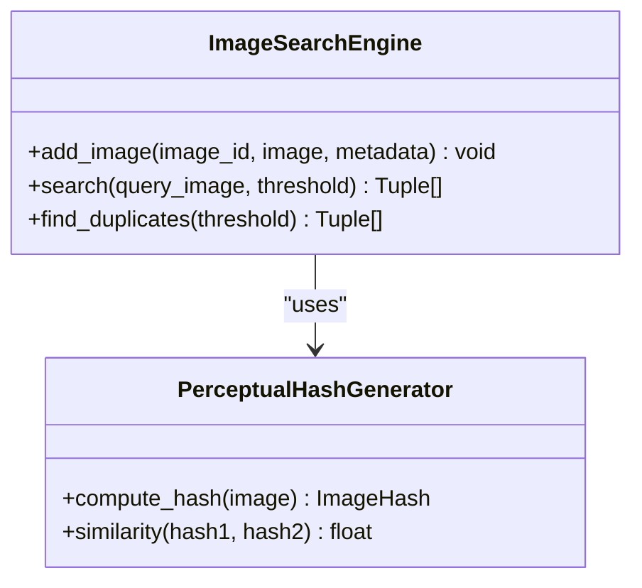

**Diagram sources**
- [advanced_image_osint.py:480-546](file://intelligence/advanced_image_osint.py#L480-L546)

**Section sources**
- [advanced_image_osint.py:480-546](file://intelligence/advanced_image_osint.py#L480-L546)

### MultimodalEnricher and VisionEncoder
The multimodal layer integrates VisionEncoder and optional fusion models to produce embeddings and enrich findings. It includes:
- Lazy loading of CoreML models with fallback
- Batch encoding of images to embeddings
- Optional MambaFusion for vision-text-graph fusion
- Optional mobileclip similarity scoring

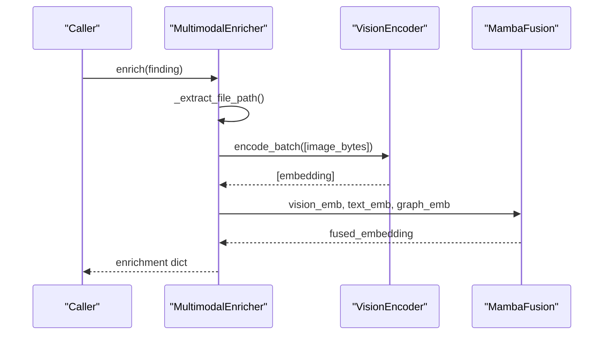

**Diagram sources**
- [analyzer.py:303-405](file://multimodal/analyzer.py#L303-L405)
- [vision_encoder.py:76-88](file://multimodal/vision_encoder.py#L76-L88)

**Section sources**
- [analyzer.py:217-532](file://multimodal/analyzer.py#L217-L532)
- [vision_encoder.py:22-88](file://multimodal/vision_encoder.py#L22-L88)

### EvidenceTriageCoordinator
Evidence triage extracts bounded facets from PDF/image artifacts:
- Metadata extraction (title, author, EXIF, GPS)
- OCR text extraction with timeouts
- URL/domain extraction from OCR text
- Bounded collections and safe defaults

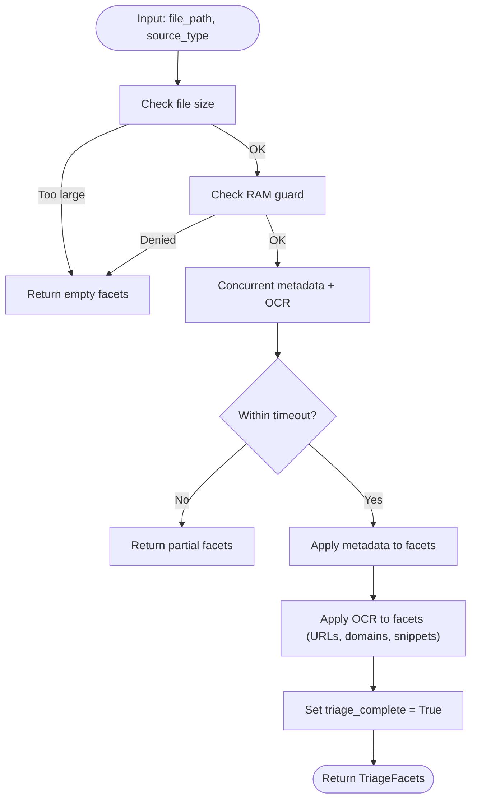

**Diagram sources**
- [evidence_triage.py:214-287](file://multimodal/evidence_triage.py#L214-L287)

**Section sources**
- [evidence_triage.py:142-467](file://multimodal/evidence_triage.py#L142-L467)

### ForensicsEnricher
Forensics enricher adds metadata, steganalysis, and digital ghost detection to findings, with optional external lookups:
- UniversalMetadataExtractor for file metadata
- Steganography analysis for images
- Digital ghost detection
- WHOIS/SSL/DNS/rDNS lookups

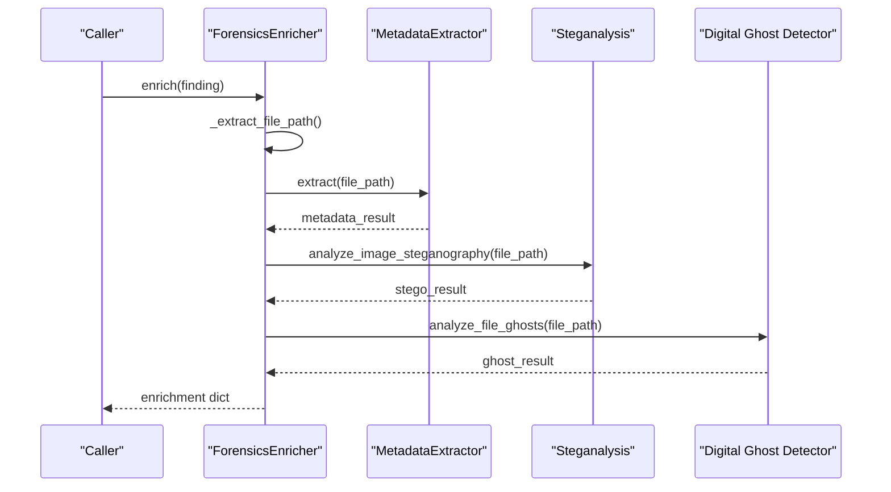

**Diagram sources**
- [enrichment_service.py:314-435](file://forensics/enrichment_service.py#L314-L435)

**Section sources**
- [enrichment_service.py:242-474](file://forensics/enrichment_service.py#L242-L474)

### macOS Vision Integrations
Two macOS Vision integrations provide additional capabilities:
- VisionAnalyzer: OCR, barcode detection, face detection, feature print generation
- VisionOCR: OCR via ocrmac with size guards and fail-safe handling

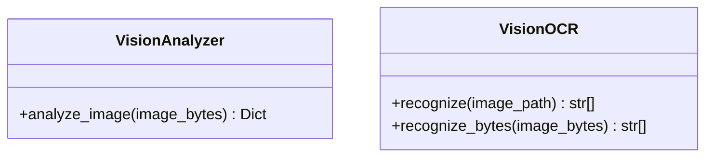

**Diagram sources**
- [vision_analyzer.py:29-128](file://tools/vision_analyzer.py#L29-L128)
- [ocr_engine.py:18-117](file://tools/ocr_engine.py#L18-L117)

**Section sources**
- [vision_analyzer.py:1-129](file://tools/vision_analyzer.py#L1-L129)
- [ocr_engine.py:1-118](file://tools/ocr_engine.py#L1-L118)

## Dependency Analysis
The module exhibits layered dependencies:
- Intelligence layer depends on PIL and optional MLX/SciPy for hashing and DCT
- Multimodal layer depends on CoreML (VisionEncoder) with fallback to random embeddings
- Tools layer depends on macOS Vision framework and optional ocrmac
- Forensics layer depends on metadata extractors and optional steganalysis/digital ghost detectors
- Privacy layer wraps research operations with anonymization and sanitization

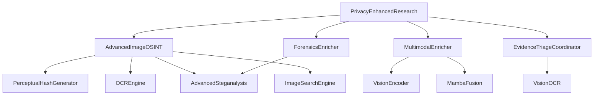

**Diagram sources**
- [advanced_image_osint.py:548-622](file://intelligence/advanced_image_osint.py#L548-L622)
- [vision_encoder.py:22-88](file://multimodal/vision_encoder.py#L22-L88)
- [analyzer.py:217-532](file://multimodal/analyzer.py#L217-L532)
- [vision_analyzer.py:29-128](file://tools/vision_analyzer.py#L29-L128)
- [ocr_engine.py:18-117](file://tools/ocr_engine.py#L18-L117)
- [evidence_triage.py:142-467](file://multimodal/evidence_triage.py#L142-L467)
- [enrichment_service.py:242-474](file://forensics/enrichment_service.py#L242-L474)
- [privacy_enhanced_research.py:82-420](file://coordinators/privacy_enhanced_research.py#L82-L420)

**Section sources**
- [advanced_image_osint.py:1-636](file://intelligence/advanced_image_osint.py#L1-L636)
- [vision_encoder.py:1-89](file://multimodal/vision_encoder.py#L1-L89)
- [analyzer.py:1-876](file://multimodal/analyzer.py#L1-L876)
- [vision_analyzer.py:1-129](file://tools/vision_analyzer.py#L1-L129)
- [ocr_engine.py:1-118](file://tools/ocr_engine.py#L1-L118)
- [evidence_triage.py:1-468](file://multimodal/evidence_triage.py#L1-L468)
- [enrichment_service.py:1-645](file://forensics/enrichment_service.py#L1-L645)
- [privacy_enhanced_research.py:1-420](file://coordinators/privacy_enhanced_research.py#L1-L420)

## Performance Considerations
- Memory governance: ResourceGovernor reservations prevent out-of-memory conditions during heavy operations (VisionEncoder, DocumentExtractor, ForensicsEnricher).
- Asynchronous processing: OCR, triage, and enrichment use asyncio to maximize throughput on M1 8GB systems.
- Batching: VisionEncoder supports configurable batch sizes to balance throughput and memory usage.
- Lazy loading: CoreML models and optional dependencies are loaded on demand to reduce startup overhead.
- Timeouts: Evidence triage and OCR operations include timeouts to bound latency.
- Fallbacks: When dependencies are unavailable (CoreML, ocrmac, SciPy), the system continues with reduced functionality.

[No sources needed since this section provides general guidance]

## Troubleshooting Guide
Common issues and resolutions:
- Missing dependencies:
  - PIL/Pillow: Required for image processing; ImportError raised if missing.
  - CoreML: VisionEncoder falls back to dummy embeddings if unavailable.
  - ocrmac: VisionOCR logs warnings and returns empty results if not installed.
  - SciPy: DCT fallback uses pixel values if unavailable.
- Memory pressure:
  - ResourceGovernor checks prevent heavy operations under memory constraints.
  - DocumentExtractor and ForensicsEnricher return None when RAM guard denies.
- OCR limitations:
  - VisionOCR enforces maximum image size; larger images are skipped.
  - OCR results are normalized to lists; unexpected types are handled gracefully.
- Steganalysis anomalies:
  - ELA and chi-square thresholds are configurable; adjust sensitivity as needed.
- Privacy controls:
  - PrivacyEnhancedResearch anonymizes queries and sanitizes results; configure retention and PII patterns accordingly.

**Section sources**
- [advanced_image_osint.py:38-50](file://intelligence/advanced_image_osint.py#L38-L50)
- [vision_encoder.py:46-75](file://multimodal/vision_encoder.py#L46-L75)
- [ocr_engine.py:38-70](file://tools/ocr_engine.py#L38-L70)
- [analyzer.py:407-440](file://multimodal/analyzer.py#L407-L440)
- [enrichment_service.py:637-652](file://forensics/enrichment_service.py#L637-L652)
- [privacy_enhanced_research.py:216-247](file://coordinators/privacy_enhanced_research.py#L216-L247)

## Conclusion
The Advanced Image OSINT module provides a comprehensive, privacy-aware toolkit for visual intelligence in OSINT workflows. It integrates perceptual hashing, OCR, steganalysis, and multimodal embeddings, while leveraging macOS Vision frameworks and robust forensics triage. The design emphasizes resilience through lazy loading, timeouts, and fallbacks, ensuring reliable operation on constrained hardware.

[No sources needed since this section summarizes without analyzing specific files]

## Appendices

### Configuration Options
- PerceptualHashGenerator
  - hash_size: Controls the resolution for perceptual hashes (default 8).
- AdvancedSteganalysis
  - lsb_threshold: Entropy threshold for LSB analysis (default 0.45).
  - chi_square_threshold: Chi-square p-value threshold (default 0.95).
- ImageSearchEngine
  - threshold: Minimum similarity score for search results (default 0.85).
  - duplicate threshold: Threshold for near-duplicate detection (default 0.95).
- VisionEncoder
  - embedding_dim: Dimension of embeddings (default 1280).
  - batch_size: Batch size for encode_batch (default 4).
  - quant_4bit: Best-effort quantization flag (default False).
- MultimodalEnricher
  - embedding_dim: Vision embedding dimension (default 1280).
  - batch_size: Max batch size (default 4).
- EvidenceTriageCoordinator
  - MAX_URL_HITS: Max embedded URLs/domains (default 20).
  - MAX_OCR_SNIPPETS: Max OCR snippets (default 10).
  - MAX_OCR_CHARS: Max OCR characters per file (default 5000).
  - METADATA_TIMEOUT_S: Metadata extraction timeout (default 30.0).
  - OCR_TIMEOUT_S: OCR timeout (default 30.0).
  - MAX_FILE_SIZE_FOR_TRIAGE: Max triage file size (default 100MB).
- ForensicsEnricher
  - enable_gps: Enable GPS extraction from EXIF (default True).
  - enable_audio: Enable audio metadata extraction (default True).
  - enable_video: Enable video metadata extraction (default False).
- PrivacyEnhancedResearch
  - PrivacyConfig.level: Privacy level (default ENHANCED).
  - PrivacyConfig.retention: Data retention policy (default SESSION).
  - PrivacyConfig.anonymize_requests: Enable request anonymization (default True).
  - PrivacyConfig.sanitize_results: Enable result sanitization (default True).
  - PrivacyConfig.audit_logging: Enable audit logging (default True).
  - PrivacyConfig.encrypt_transit: Enable transit encryption (default True).
  - PrivacyConfig.min_data_collection: Enable minimal data collection (default True).

**Section sources**
- [advanced_image_osint.py:115-174](file://intelligence/advanced_image_osint.py#L115-L174)
- [advanced_image_osint.py:348-351](file://intelligence/advanced_image_osint.py#L348-L351)
- [advanced_image_osint.py:487-490](file://intelligence/advanced_image_osint.py#L487-L490)
- [vision_encoder.py:28-40](file://multimodal/vision_encoder.py#L28-L40)
- [analyzer.py:233-254](file://multimodal/analyzer.py#L233-L254)
- [evidence_triage.py:32-51](file://multimodal/evidence_triage.py#L32-L51)
- [enrichment_service.py:257-277](file://forensics/enrichment_service.py#L257-L277)
- [privacy_enhanced_research.py:36-47](file://coordinators/privacy_enhanced_research.py#L36-L47)