# Cryptographic Intelligence

<cite>
**Referenced Files in This Document**
- [cryptographic_intelligence.py](file://intelligence/cryptographic_intelligence.py)
- [hash_identifier.py](file://text/hash_identifier.py)
- [pq_crypto.py](file://security/pq_crypto.py)
- [pq_crypto_swift.py](file://security/pq_crypto_swift.py)
- [quantum_safe.py](file://security/quantum_safe.py)
- [secure_enclave.py](file://security/secure_enclave.py)
- [deep_research_security.py](file://security/deep_research_security.py)
- [privacy_enhanced_research.py](file://coordinators/privacy_enhanced_research.py)
- [encryption.py](file://security/encryption.py)
- [post_quantum.py](file://federated/post_quantum.py)
- [__init__.py](file://intelligence/__init__.py)
</cite>

## Table of Contents
1. [Introduction](#introduction)
2. [Project Structure](#project-structure)
3. [Core Components](#core-components)
4. [Architecture Overview](#architecture-overview)
5. [Detailed Component Analysis](#detailed-component-analysis)
6. [Dependency Analysis](#dependency-analysis)
7. [Performance Considerations](#performance-considerations)
8. [Troubleshooting Guide](#troubleshooting-guide)
9. [Conclusion](#conclusion)

## Introduction
This document describes the Cryptographic Intelligence module, which provides advanced cryptographic analysis capabilities for Open-Source Intelligence (OSINT) research. It supports classical and modern cryptanalysis, hash identification and cracking, encryption detection, certificate parsing and security assessment, and integrates quantum-safe cryptography for future-proof security. The module emphasizes self-contained operation, local processing, and compatibility with Apple Silicon environments.

## Project Structure
The Cryptographic Intelligence module is organized around several core capabilities:
- Classical and modern cryptanalysis
- Hash identification and dictionary cracking
- Encryption detection using statistical analysis
- X.509 certificate parsing and security evaluation
- Integration with post-quantum cryptography backends
- Secure enclave and quantum-safe vault operations
- Privacy-enhanced research workflows

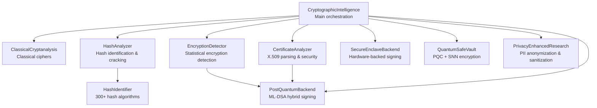

**Diagram sources**
- [cryptographic_intelligence.py:1133-1257](file://intelligence/cryptographic_intelligence.py#L1133-L1257)
- [hash_identifier.py:189-532](file://text/hash_identifier.py#L189-L532)
- [pq_crypto.py:96-263](file://security/pq_crypto.py#L96-L263)
- [secure_enclave.py:66-196](file://security/secure_enclave.py#L66-L196)
- [quantum_safe.py:754-820](file://security/quantum_safe.py#L754-L820)
- [privacy_enhanced_research.py:82-420](file://coordinators/privacy_enhanced_research.py#L82-L420)

**Section sources**
- [__init__.py:167-184](file://intelligence/__init__.py#L167-L184)
- [cryptographic_intelligence.py:1133-1257](file://intelligence/cryptographic_intelligence.py#L1133-L1257)

## Core Components
- CryptographicIntelligence: Main engine that orchestrates classical cryptanalysis, hash analysis, encryption detection, and certificate analysis.
- ClassicalCryptanalysis: Implements classical cipher analysis including Caesar, Vigenère, Rail Fence, and Atbash, with automated cracking and scoring.
- HashAnalyzer: Identifies hash types, estimates complexity, performs dictionary cracking, and computes entropy.
- EncryptionDetector: Detects encryption using statistical measures (Shannon entropy, chi-square, Index of Coincidence) and language detection.
- CertificateAnalyzer: Parses X.509 certificates and evaluates security posture with recommendations.
- PostQuantumBackend: Abstraction for ML-DSA hybrid signatures with a null backend for fail-soft operation.
- SecureEnclaveBackend: Hardware-backed signing abstraction for Apple Secure Enclave with a null backend.
- QuantumSafeVault: Quantum-safe vault integrating ML-KEM/ML-DSA and neuromorphic cryptography.
- PrivacyEnhancedResearch: Wraps research operations with anonymization, sanitization, auditing, and retention controls.

**Section sources**
- [cryptographic_intelligence.py:202-555](file://intelligence/cryptographic_intelligence.py#L202-L555)
- [cryptographic_intelligence.py:557-797](file://intelligence/cryptographic_intelligence.py#L557-L797)
- [cryptographic_intelligence.py:799-961](file://intelligence/cryptographic_intelligence.py#L799-L961)
- [cryptographic_intelligence.py:963-1131](file://intelligence/cryptographic_intelligence.py#L963-L1131)
- [cryptographic_intelligence.py:1133-1257](file://intelligence/cryptographic_intelligence.py#L1133-L1257)
- [pq_crypto.py:96-263](file://security/pq_crypto.py#L96-L263)
- [secure_enclave.py:66-196](file://security/secure_enclave.py#L66-L196)
- [quantum_safe.py:754-820](file://security/quantum_safe.py#L754-L820)
- [privacy_enhanced_research.py:82-420](file://coordinators/privacy_enhanced_research.py#L82-L420)

## Architecture Overview
The Cryptographic Intelligence module follows a layered design:
- Analysis Layer: Classical cryptanalysis, hash analysis, encryption detection, and certificate analysis.
- Security Layer: Post-quantum cryptography integration, secure enclave operations, and quantum-safe vault.
- Privacy Layer: Privacy-enhanced research wrapper for anonymization, sanitization, and audit logging.
- Integration Layer: Hash identifier for 300+ algorithms and optional cryptography library usage.

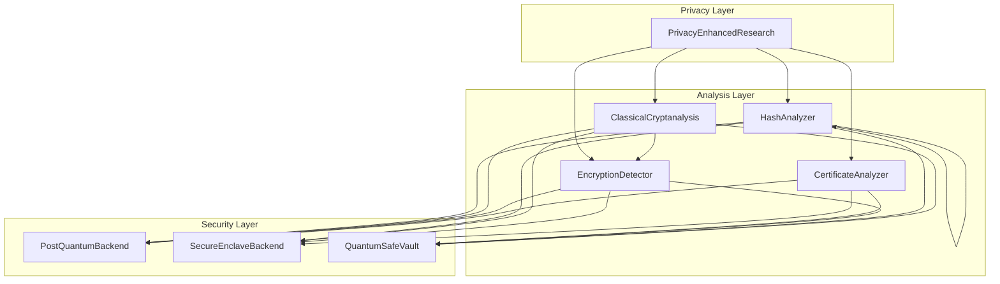

**Diagram sources**
- [cryptographic_intelligence.py:1133-1257](file://intelligence/cryptographic_intelligence.py#L1133-L1257)
- [pq_crypto.py:96-263](file://security/pq_crypto.py#L96-L263)
- [secure_enclave.py:66-196](file://security/secure_enclave.py#L66-L196)
- [quantum_safe.py:754-820](file://security/quantum_safe.py#L754-L820)
- [privacy_enhanced_research.py:82-420](file://coordinators/privacy_enhanced_research.py#L82-L420)

## Detailed Component Analysis

### Classical Cryptanalysis
Implements automated analysis of classical ciphers:
- Caesar cipher: brute-force shift analysis with English scoring.
- Vigenère cipher: Kasiski examination and frequency analysis to guess key length and recover plaintext.
- Rail Fence cipher: brute-force rail counts and zigzag reconstruction.
- Atbash cipher: reverse-alphabet substitution.
- Scoring and confidence estimation based on English word frequency and chi-square tests.

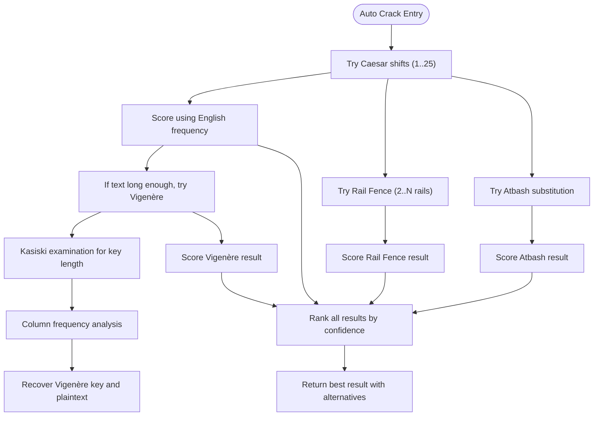

**Diagram sources**
- [cryptographic_intelligence.py:202-555](file://intelligence/cryptographic_intelligence.py#L202-L555)

**Section sources**
- [cryptographic_intelligence.py:202-555](file://intelligence/cryptographic_intelligence.py#L202-L555)

### Hash Analysis and Identification
Provides comprehensive hash identification and cracking:
- Pattern and length-based identification for 300+ algorithms.
- Entropy calculation and charset detection.
- Dictionary cracking with configurable wordlists.
- Salt detection and complexity estimation.

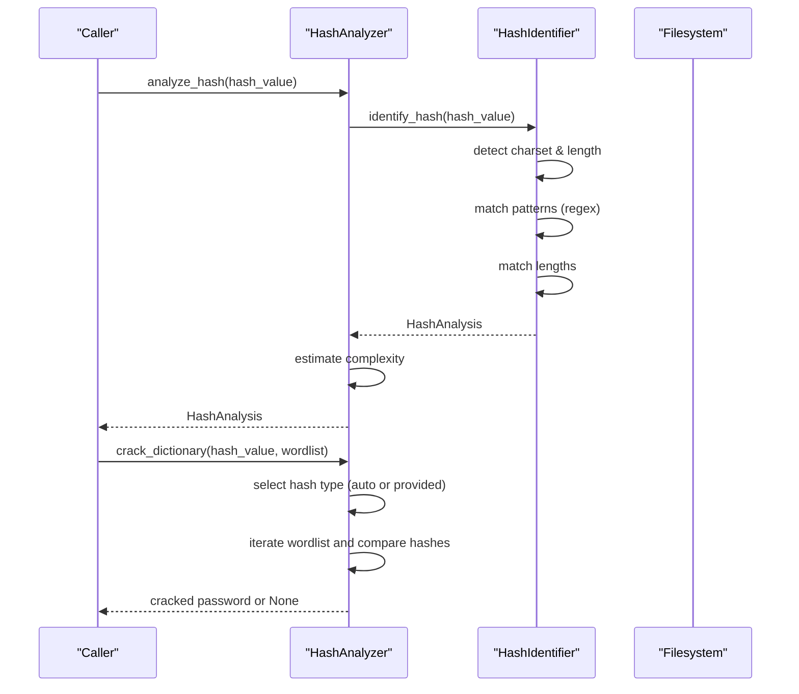

**Diagram sources**
- [cryptographic_intelligence.py:557-797](file://intelligence/cryptographic_intelligence.py#L557-L797)
- [hash_identifier.py:189-532](file://text/hash_identifier.py#L189-L532)

**Section sources**
- [cryptographic_intelligence.py:557-797](file://intelligence/cryptographic_intelligence.py#L557-L797)
- [hash_identifier.py:189-532](file://text/hash_identifier.py#L189-L532)

### Encryption Detection
Statistical detection of encryption:
- Computes Shannon entropy, chi-square deviation, and Index of Coincidence.
- Determines likelihood of encryption and estimates cipher families.
- Estimates block sizes for block ciphers and detects base64 encoding.

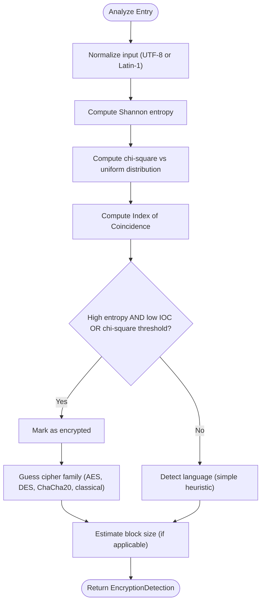

**Diagram sources**
- [cryptographic_intelligence.py:800-961](file://intelligence/cryptographic_intelligence.py#L800-L961)

**Section sources**
- [cryptographic_intelligence.py:800-961](file://intelligence/cryptographic_intelligence.py#L800-L961)

### Certificate Analysis
Parses and evaluates X.509 certificates:
- Extracts subject, issuer, serial, validity period, fingerprints, signature algorithm, and public key details.
- Checks for self-signed certificates, expiration, SAN domains, and CA flags.
- Provides security grade, issues, warnings, and recommendations.

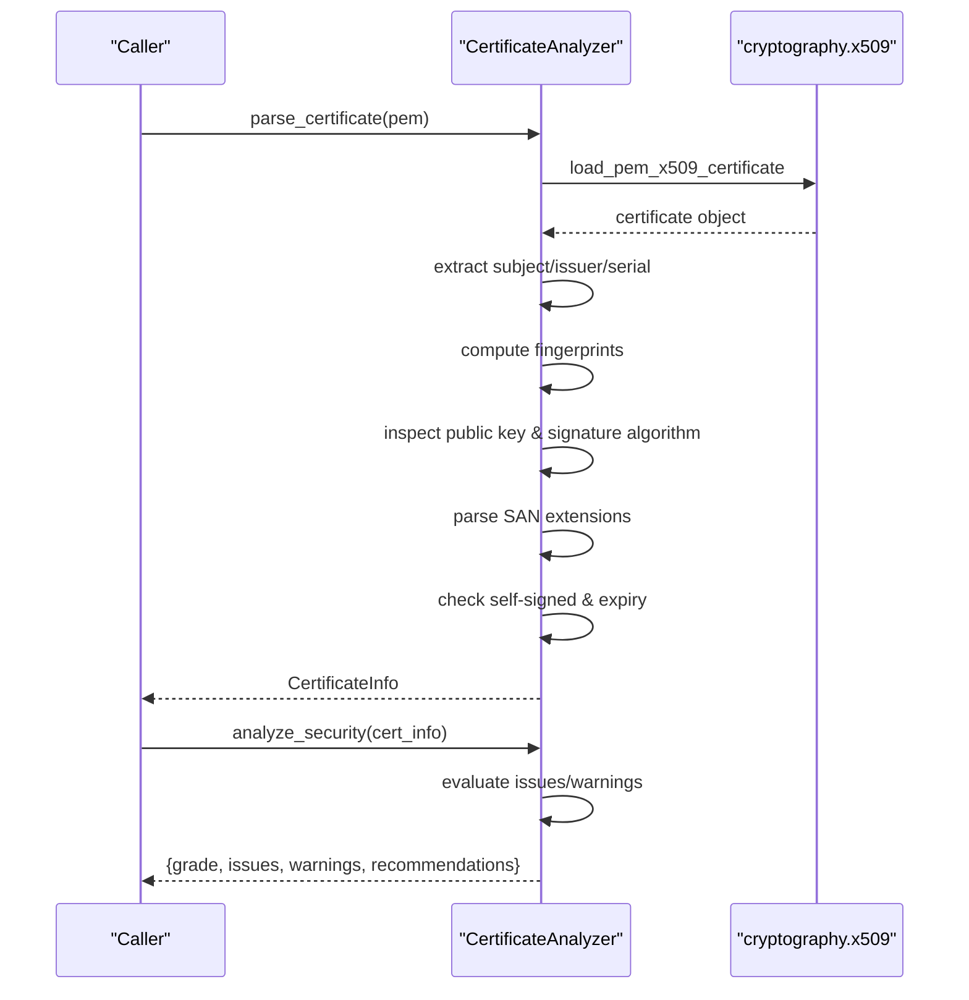

**Diagram sources**
- [cryptographic_intelligence.py:963-1131](file://intelligence/cryptographic_intelligence.py#L963-L1131)

**Section sources**
- [cryptographic_intelligence.py:963-1131](file://intelligence/cryptographic_intelligence.py#L963-L1131)

### Post-Quantum Cryptography Integration
Hybrid signature support with ML-DSA (Dilithium) and fail-soft fallback:
- PostQuantumBackend protocol defines signing and verification semantics.
- NullPostQuantumBackend ensures fail-soft behavior when hardware or environment is unavailable.
- SwiftPostQuantumBackend integrates with a secure enclave helper tool on macOS 26+.

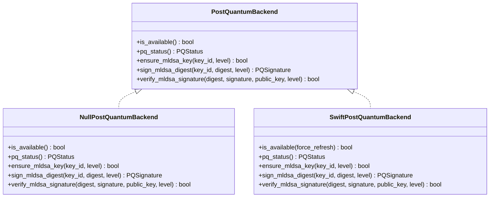

**Diagram sources**
- [pq_crypto.py:96-263](file://security/pq_crypto.py#L96-L263)
- [pq_crypto_swift.py:177-324](file://security/pq_crypto_swift.py#L177-L324)

**Section sources**
- [pq_crypto.py:96-263](file://security/pq_crypto.py#L96-L263)
- [pq_crypto_swift.py:177-324](file://security/pq_crypto_swift.py#L177-L324)

### Secure Enclave Operations
Hardware-backed signing abstraction:
- SecureEnclaveBackend protocol defines signing semantics for canonical batch manifests.
- NullSecureEnclaveBackend provides fail-soft behavior.
- build_batch_manifest creates deterministic digests for signing.

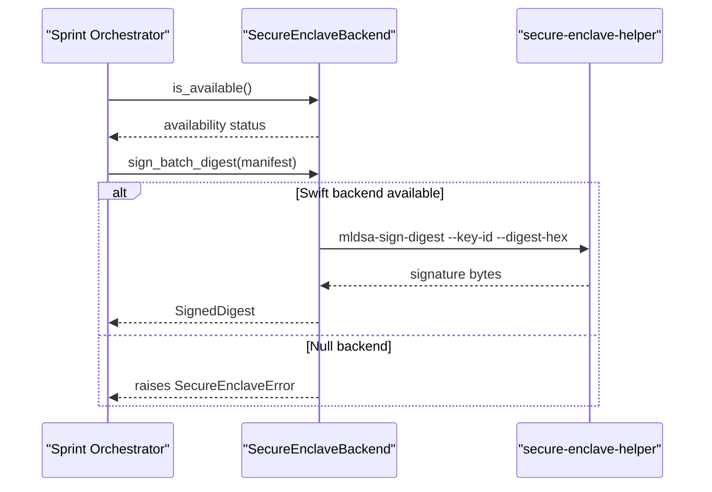

**Diagram sources**
- [secure_enclave.py:66-196](file://security/secure_enclave.py#L66-L196)
- [pq_crypto_swift.py:257-290](file://security/pq_crypto_swift.py#L257-L290)

**Section sources**
- [secure_enclave.py:66-196](file://security/secure_enclave.py#L66-L196)

### Quantum-Safe Vault and Neuromorphic Cryptography
Quantum-safe vault with ML-KEM/ML-DSA and SNN-based encryption:
- QuantumSafeVault integrates ML-KEM (Kyber) and ML-DSA (Dilithium) for quantum-resistant encryption and signatures.
- NeuromorphicCryptoEngine implements SNN-based encryption and signatures with hardware entropy integration.
- EntropyPool collects and mixes entropy from multiple sources for CSPRNG.

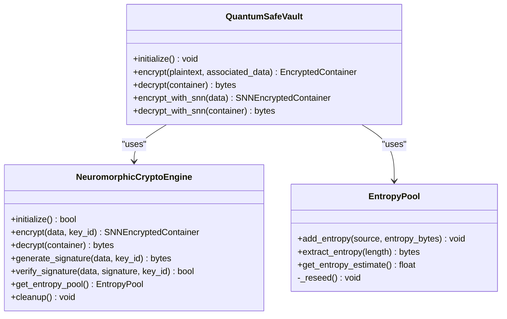

**Diagram sources**
- [quantum_safe.py:754-820](file://security/quantum_safe.py#L754-L820)
- [quantum_safe.py:405-684](file://security/quantum_safe.py#L405-L684)
- [quantum_safe.py:46-133](file://security/quantum_safe.py#L46-L133)

**Section sources**
- [quantum_safe.py:754-820](file://security/quantum_safe.py#L754-L820)
- [quantum_safe.py:405-684](file://security/quantum_safe.py#L405-L684)
- [quantum_safe.py:46-133](file://security/quantum_safe.py#L46-L133)

### Privacy-Enhanced Research Workflows
Wraps research operations with privacy protections:
- Anonymizes queries by removing PII and hashing identifiable terms under maximum privacy.
- Sanitizes results to remove PII with confidence scoring.
- Audits operations with retention policies and metadata.
- Integrates with cryptographic intelligence for secure handling of sensitive data.

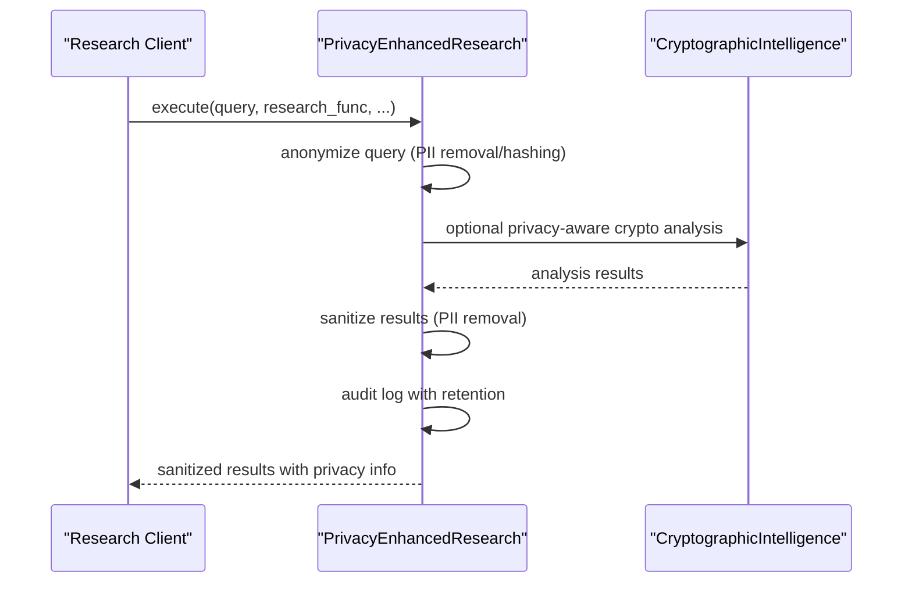

**Diagram sources**
- [privacy_enhanced_research.py:115-215](file://coordinators/privacy_enhanced_research.py#L115-L215)
- [cryptographic_intelligence.py:1133-1257](file://intelligence/cryptographic_intelligence.py#L1133-L1257)

**Section sources**
- [privacy_enhanced_research.py:82-420](file://coordinators/privacy_enhanced_research.py#L82-L420)

## Dependency Analysis
The module exhibits clear separation of concerns:
- CryptographicIntelligence depends on ClassicalCryptanalysis, HashAnalyzer, EncryptionDetector, and CertificateAnalyzer.
- HashAnalyzer optionally integrates HashIdentifier for 300+ algorithm identification.
- EncryptionDetector and CertificateAnalyzer integrate with PostQuantumBackend and SecureEnclaveBackend for quantum-safe operations.
- QuantumSafeVault depends on neuromorphic cryptography components and entropy pools.
- PrivacyEnhancedResearch coordinates across analysis components and enforces privacy policies.

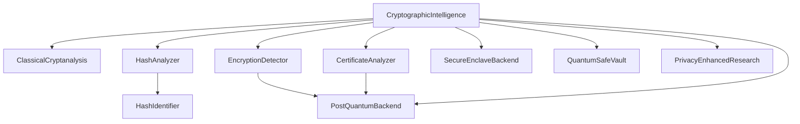

**Diagram sources**
- [cryptographic_intelligence.py:1133-1257](file://intelligence/cryptographic_intelligence.py#L1133-L1257)
- [hash_identifier.py:189-532](file://text/hash_identifier.py#L189-L532)
- [pq_crypto.py:96-263](file://security/pq_crypto.py#L96-L263)
- [secure_enclave.py:66-196](file://security/secure_enclave.py#L66-L196)
- [quantum_safe.py:754-820](file://security/quantum_safe.py#L754-L820)
- [privacy_enhanced_research.py:82-420](file://coordinators/privacy_enhanced_research.py#L82-L420)

**Section sources**
- [__init__.py:167-184](file://intelligence/__init__.py#L167-L184)
- [cryptographic_intelligence.py:1133-1257](file://intelligence/cryptographic_intelligence.py#L1133-L1257)

## Performance Considerations
- Classical cryptanalysis uses brute-force and frequency analysis; complexity grows with key space and text length.
- Hash analysis leverages pattern and length matching for fast identification; dictionary cracking is CPU-bound.
- Encryption detection relies on statistical tests; performance scales linearly with input size.
- Post-quantum operations are optional and fail-soft; hardware-dependent backends introduce latency only when active.
- Quantum-safe vault and neuromorphic cryptography are designed for M1 8GB optimization with lazy initialization and cleanup.

## Troubleshooting Guide
Common issues and resolutions:
- cryptography library not available: Some certificate operations will log warnings and return None. Install the cryptography package to enable full functionality.
- Post-quantum backend unavailable: NullPostQuantumBackend is used automatically. Ensure macOS 26+ and proper helper tool installation for ML-DSA support.
- Secure enclave helper missing: SecureEnclaveBackend falls back to NullSecureEnclaveBackend. Verify helper path resolution and permissions.
- Hash identification accuracy: Increase confidence thresholds or adjust batch size in HashIdentifier configuration.
- Privacy audit log growth: Use cleanup_expired to trim expired sessions and audit logs.

**Section sources**
- [cryptographic_intelligence.py:46-55](file://intelligence/cryptographic_intelligence.py#L46-L55)
- [pq_crypto.py:208-263](file://security/pq_crypto.py#L208-L263)
- [secure_enclave.py:152-196](file://security/secure_enclave.py#L152-L196)
- [hash_identifier.py:202-216](file://text/hash_identifier.py#L202-L216)
- [privacy_enhanced_research.py:362-379](file://coordinators/privacy_enhanced_research.py#L362-L379)

## Conclusion
The Cryptographic Intelligence module provides a comprehensive toolkit for cryptographic analysis, detection, and quantum-safe operations. It combines classical and modern techniques with privacy-preserving workflows and robust fallback mechanisms. Integration with post-quantum cryptography and secure enclaves ensures future-readiness, while privacy-enhanced research capabilities protect sensitive data throughout the analysis lifecycle.