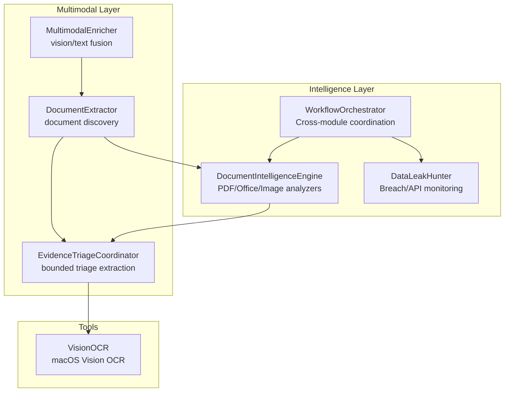
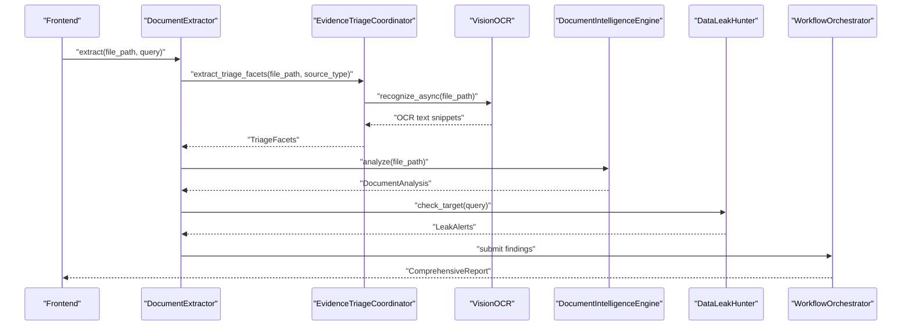
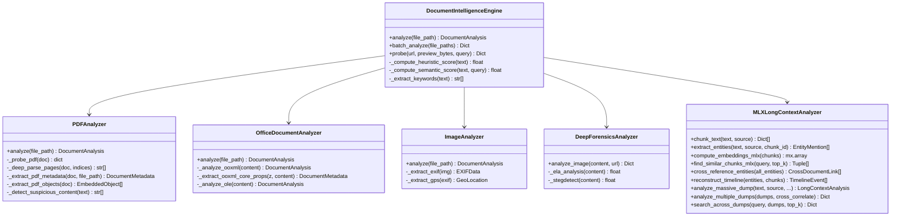
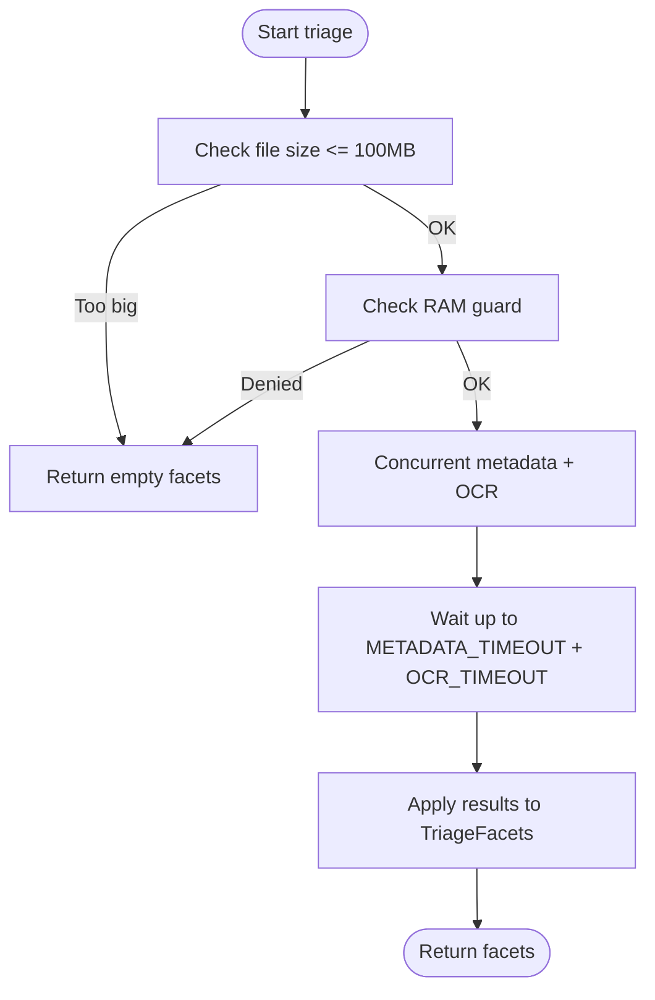
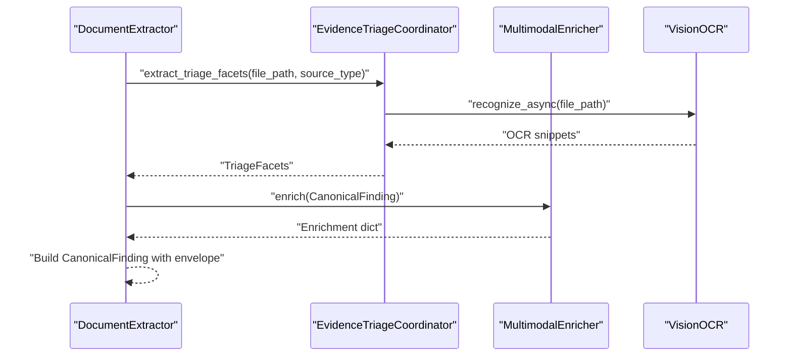
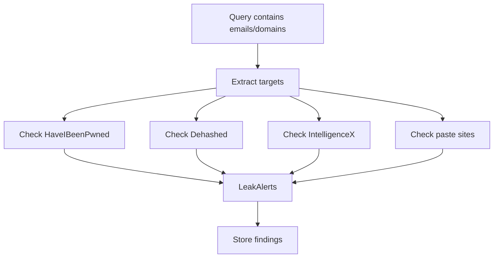
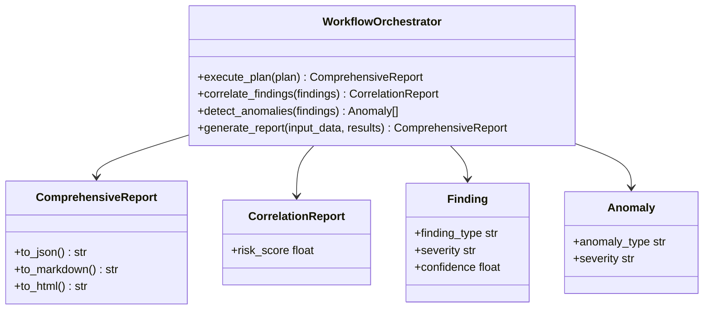
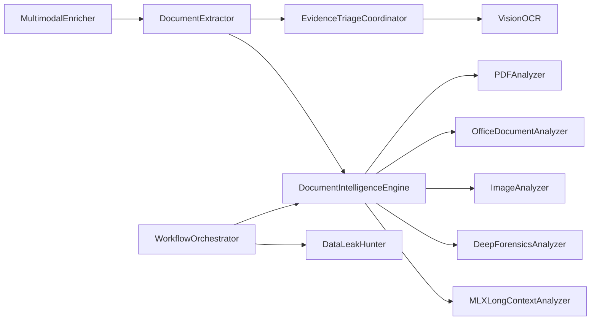

# Document Intelligence

<cite>
**Referenced Files in This Document**
- [document_intelligence.py](file://intelligence/document_intelligence.py)
- [evidence_triage.py](file://multimodal/evidence_triage.py)
- [analyzer.py](file://multimodal/analyzer.py)
- [data_leak_hunter.py](file://intelligence/data_leak_hunter.py)
- [workflow_orchestrator.py](file://intelligence/workflow_orchestrator.py)
- [ocr_engine.py](file://tools/ocr_engine.py)
- [REAL_ARCHITECTURE.md](file://REAL_ARCHITECTURE.md)
</cite>

## Table of Contents
1. [Introduction](#introduction)
2. [Project Structure](#project-structure)
3. [Core Components](#core-components)
4. [Architecture Overview](#architecture-overview)
5. [Detailed Component Analysis](#detailed-component-analysis)
6. [Dependency Analysis](#dependency-analysis)
7. [Performance Considerations](#performance-considerations)
8. [Troubleshooting Guide](#troubleshooting-guide)
9. [Conclusion](#conclusion)
10. [Appendices](#appendices)

## Introduction
This document describes the Document Intelligence module, which provides advanced document analysis for OSINT research. It extracts metadata, hidden content, and forensic artifacts from PDFs, images, and structured office formats. It integrates with multimodal processing and evidence triage systems to support document discovery, enrichment, and sensitive data detection workflows. The module emphasizes self-hosted processing, M1/MPS optimization, and fail-safe operations.

## Project Structure
The Document Intelligence module is centered in the intelligence package and integrates with multimodal and security layers:
- intelligence/document_intelligence.py: Core analyzers for PDF, Office, and images; value scoring and long-context MLX analysis
- multimodal/evidence_triage.py: Bounded triage extraction (metadata, OCR, URL/domain hits) for PDF/images
- multimodal/analyzer.py: Multimodal enrichment and document extraction pipeline
- intelligence/data_leak_hunter.py: Data leak monitoring and breach scanning integrated into research workflows
- intelligence/workflow_orchestrator.py: Cross-module orchestration and reporting
- tools/ocr_engine.py: macOS Vision OCR wrapper used by triage
- REAL_ARCHITECTURE.md: Architectural context for triage and multimodal integration

**Diagram sources**
- [document_intelligence.py:1306-1461](file://intelligence/document_intelligence.py#L1306-L1461)
- [evidence_triage.py:142-287](file://multimodal/evidence_triage.py#L142-L287)
- [analyzer.py:580-767](file://multimodal/analyzer.py#L580-L767)
- [data_leak_hunter.py:114-368](file://intelligence/data_leak_hunter.py#L114-L368)
- [workflow_orchestrator.py:24-112](file://intelligence/workflow_orchestrator.py#L24-L112)

**Section sources**
- [document_intelligence.py:1-2154](file://intelligence/document_intelligence.py#L1-L2154)
- [evidence_triage.py:1-468](file://multimodal/evidence_triage.py#L1-L468)
- [analyzer.py:1-876](file://multimodal/analyzer.py#L1-L876)
- [data_leak_hunter.py:1-912](file://intelligence/data_leak_hunter.py#L1-L912)
- [workflow_orchestrator.py:1-300](file://intelligence/workflow_orchestrator.py#L1-L300)
- [REAL_ARCHITECTURE.md:1514-1554](file://REAL_ARCHITECTURE.md#L1514-L1554)

## Core Components
- DocumentIntelligenceEngine: Unified analyzer for PDF, Office, and image documents; includes value scoring and long-context MLX analysis
- PDFAnalyzer: Progressive parsing with signal estimation, metadata extraction, embedded object discovery, and suspicious content detection
- OfficeDocumentAnalyzer: OOXML and legacy OLE analysis for metadata, comments, hyperlinks, and embedded media
- ImageAnalyzer: EXIF extraction, GPS parsing, and image metadata
- DeepForensicsAnalyzer: Forensic enhancements for images (ELA, steganalysis) with MPS acceleration
- MLXLongContextAnalyzer: MLX-powered analysis for large documents with entity extraction, cross-document linking, and timeline reconstruction
- EvidenceTriageCoordinator: Bounded triage extraction (metadata, OCR, URL/domain hits) with timeouts and bounds
- MultimodalEnricher: Vision encoder and fusion enrichment for documents
- DocumentExtractor: Document discovery pipeline producing CanonicalFinding with triage envelope
- DataLeakHunter: Breach and paste-site monitoring integrated into research workflows

**Section sources**
- [document_intelligence.py:1306-2154](file://intelligence/document_intelligence.py#L1306-L2154)
- [evidence_triage.py:142-468](file://multimodal/evidence_triage.py#L142-L468)
- [analyzer.py:217-533](file://multimodal/analyzer.py#L217-L533)
- [data_leak_hunter.py:114-368](file://intelligence/data_leak_hunter.py#L114-L368)

## Architecture Overview
The Document Intelligence module participates in a layered OSINT pipeline:
- Discovery: DocumentExtractor discovers PDFs/images and builds CanonicalFinding with triage envelope
- Triage: EvidenceTriageCoordinator extracts metadata, OCR snippets, and URL/domain hits
- Enrichment: MultimodalEnricher augments findings with vision/text fusion embeddings
- Intelligence: DocumentIntelligenceEngine performs deep analysis and value scoring
- Security: DataLeakHunter monitors for breaches and paste-site disclosures
- Orchestration: WorkflowOrchestrator coordinates modules, correlates findings, and produces reports

**Diagram sources**
- [analyzer.py:580-767](file://multimodal/analyzer.py#L580-L767)
- [evidence_triage.py:214-287](file://multimodal/evidence_triage.py#L214-L287)
- [ocr_engine.py:51-89](file://tools/ocr_engine.py#L51-L89)
- [document_intelligence.py:1306-1461](file://intelligence/document_intelligence.py#L1306-L1461)
- [data_leak_hunter.py:338-368](file://intelligence/data_leak_hunter.py#L338-L368)
- [workflow_orchestrator.py:88-144](file://intelligence/workflow_orchestrator.py#L88-L144)

## Detailed Component Analysis

### DocumentIntelligenceEngine
- Analyzes PDF, Office, and image documents
- Integrates optional forensics for images
- Provides value scoring for progressive parsing and long-context MLX analysis

**Diagram sources**
- [document_intelligence.py:1306-2154](file://intelligence/document_intelligence.py#L1306-L2154)

**Section sources**
- [document_intelligence.py:1306-1599](file://intelligence/document_intelligence.py#L1306-L1599)
- [document_intelligence.py:1668-2154](file://intelligence/document_intelligence.py#L1668-L2154)

### Evidence Triage Coordinator
- Bounded extraction: caps on OCR snippets, URLs, domains, and file size
- Timeout guards for metadata and OCR operations
- Fail-safe design: returns partial facets on any failure

**Diagram sources**
- [evidence_triage.py:214-287](file://multimodal/evidence_triage.py#L214-L287)

**Section sources**
- [evidence_triage.py:32-51](file://multimodal/evidence_triage.py#L32-L51)
- [evidence_triage.py:214-287](file://multimodal/evidence_triage.py#L214-L287)

### Multimodal Enrichment and Document Extraction
- DocumentExtractor builds CanonicalFinding with triage envelope and supports batch extraction
- MultimodalEnricher adds vision/text fusion embeddings with RAM guard
- Integration with EvidenceTriageCoordinator for triage facets

**Diagram sources**
- [analyzer.py:580-767](file://multimodal/analyzer.py#L580-L767)
- [evidence_triage.py:214-287](file://multimodal/evidence_triage.py#L214-L287)
- [ocr_engine.py:51-89](file://tools/ocr_engine.py#L51-L89)

**Section sources**
- [analyzer.py:535-800](file://multimodal/analyzer.py#L535-L800)
- [REAL_ARCHITECTURE.md:1514-1554](file://REAL_ARCHITECTURE.md#L1514-L1554)

### Data Leak Hunting Integration
- DataLeakHunter monitors breach APIs and paste sites
- Integrated into research workflows to check query-derived targets
- Supports API key loading from KeyManager or environment

**Diagram sources**
- [data_leak_hunter.py:338-368](file://intelligence/data_leak_hunter.py#L338-L368)
- [data_leak_hunter.py:412-640](file://intelligence/data_leak_hunter.py#L412-L640)

**Section sources**
- [data_leak_hunter.py:114-368](file://intelligence/data_leak_hunter.py#L114-L368)
- [data_leak_hunter.py:800-912](file://intelligence/data_leak_hunter.py#L800-L912)

### Workflow Orchestration
- Coordinates modules, correlates findings, detects anomalies, and generates comprehensive reports
- Provides verdicts and recommendations based on module outputs

**Diagram sources**
- [workflow_orchestrator.py:24-112](file://intelligence/workflow_orchestrator.py#L24-L112)
- [workflow_orchestrator.py:88-144](file://intelligence/workflow_orchestrator.py#L88-L144)

**Section sources**
- [workflow_orchestrator.py:1-300](file://intelligence/workflow_orchestrator.py#L1-L300)

## Dependency Analysis
- DocumentIntelligenceEngine depends on PDF, Office, and Image analyzers; optional forensics for images
- EvidenceTriageCoordinator depends on VisionOCR and forensics metadata extractor
- MultimodalEnricher depends on VisionEncoder and optional MambaFusion
- DocumentExtractor integrates triage and builds CanonicalFinding
- DataLeakHunter depends on aiohttp and security components
- WorkflowOrchestrator coordinates all modules and aggregates results

**Diagram sources**
- [document_intelligence.py:1306-1461](file://intelligence/document_intelligence.py#L1306-L1461)
- [evidence_triage.py:142-287](file://multimodal/evidence_triage.py#L142-L287)
- [analyzer.py:217-533](file://multimodal/analyzer.py#L217-L533)
- [data_leak_hunter.py:114-368](file://intelligence/data_leak_hunter.py#L114-L368)
- [workflow_orchestrator.py:24-112](file://intelligence/workflow_orchestrator.py#L24-L112)

**Section sources**
- [document_intelligence.py:1306-1599](file://intelligence/document_intelligence.py#L1306-L1599)
- [evidence_triage.py:142-287](file://multimodal/evidence_triage.py#L142-L287)
- [analyzer.py:217-533](file://multimodal/analyzer.py#L217-L533)
- [data_leak_hunter.py:114-368](file://intelligence/data_leak_hunter.py#L114-L368)
- [workflow_orchestrator.py:24-112](file://intelligence/workflow_orchestrator.py#L24-L112)

## Performance Considerations
- M1/MPS optimization: ELA analysis leverages MPS when available; thread pools for heavy operations
- Memory guard: ResourceGovernor-based RAM checks prevent OOM conditions
- Bounded triage: Limits on OCR snippets, URLs, and file sizes
- Progressive parsing: PDF analyzer estimates signal and parses only candidate pages for high-value content
- Lazy loading: Multimodal modules and model managers are loaded on demand
- Streaming: Large document processing avoids loading entire content into memory when possible

[No sources needed since this section provides general guidance]

## Troubleshooting Guide
- Missing dependencies:
  - PIL/Pillow: image analysis disabled; fallback to basic metadata extraction
  - PyMuPDF: basic PDF analysis without advanced features
  - MLX: semantic scoring and MLX long-context features disabled
  - MPS: falls back to CPU for ELA analysis
- OCR failures:
  - ocrmac not installed: VisionOCR returns empty results
  - Large images (>20MB): VisionOCR skips processing
- Forensics:
  - stegdetect compilation: logs warnings if missing; persistent server handles retries
- Data leak monitoring:
  - aiohttp unavailable: initialization fails
  - API keys: loaded from KeyManager or environment variables

**Section sources**
- [document_intelligence.py:44-113](file://intelligence/document_intelligence.py#L44-L113)
- [document_intelligence.py:976-1085](file://intelligence/document_intelligence.py#L976-L1085)
- [data_leak_hunter.py:31-44](file://intelligence/data_leak_hunter.py#L31-L44)
- [ocr_engine.py:51-89](file://tools/ocr_engine.py#L51-L89)
- [evidence_triage.py:32-51](file://multimodal/evidence_triage.py#L32-L51)

## Conclusion
The Document Intelligence module provides a robust, self-contained pipeline for analyzing PDFs, images, and structured documents. It combines progressive parsing, bounded triage extraction, multimodal enrichment, and sensitive data detection to support OSINT workflows. Integration with data leak hunting and workflow orchestration enables comprehensive, fail-safe analysis aligned with M1/MPS resource constraints.

[No sources needed since this section summarizes without analyzing specific files]

## Appendices

### Configuration Options and Parameters
- PDFAnalyzer
  - Email/IP/URL regex patterns for extraction
  - Signal threshold for progressive parsing (0.5)
  - Candidate pages limit for deep parse (12)
- OfficeDocumentAnalyzer
  - ZIP-based detection for OOXML vs legacy OLE
- ImageAnalyzer
  - EXIF tag parsing and GPS conversion
- DeepForensicsAnalyzer
  - ELA analysis with MPS fallback
  - Stegdetect server with semaphore pool
- MLXLongContextAnalyzer
  - Chunk size and overlap tuning
  - Entity extraction patterns (email, phone, IP, URL, BTC, credit card, dates)
- EvidenceTriageCoordinator
  - MAX_URL_HITS, MAX_OCR_SNIPPETS, MAX_OCR_CHARS
  - METADATA_TIMEOUT_S, OCR_TIMEOUT_S, MAX_FILE_SIZE_FOR_TRIAGE
- MultimodalEnricher
  - RAM guard via ResourceGovernor
  - Batch size and embedding dimensions
- DocumentExtractor
  - MAX_FILE_SIZE_BYTES, MAX_PDF_PAGES, MAX_TEXT_CHARS
- DataLeakHunter
  - API endpoints and rate limits
  - Paste site monitoring and caching

**Section sources**
- [document_intelligence.py:266-329](file://intelligence/document_intelligence.py#L266-L329)
- [document_intelligence.py:1685-1707](file://intelligence/document_intelligence.py#L1685-L1707)
- [evidence_triage.py:32-51](file://multimodal/evidence_triage.py#L32-L51)
- [analyzer.py:605-611](file://multimodal/analyzer.py#L605-L611)
- [data_leak_hunter.py:142-160](file://intelligence/data_leak_hunter.py#L142-L160)