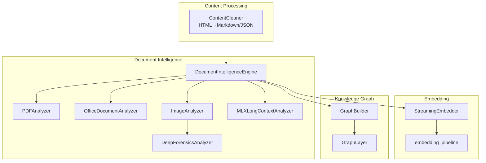
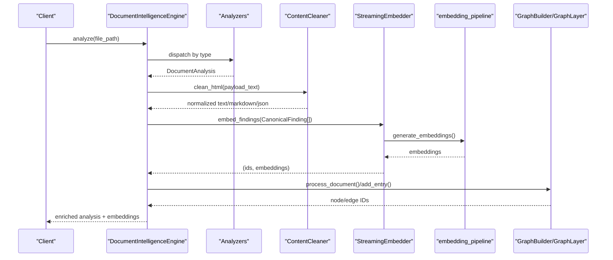
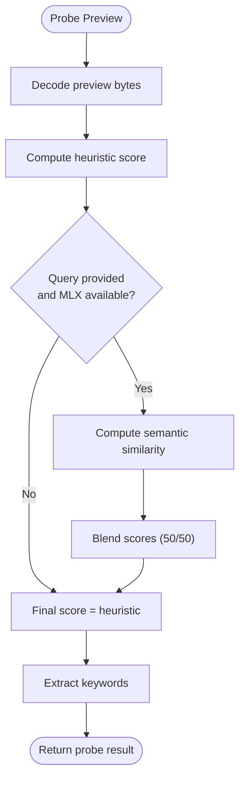
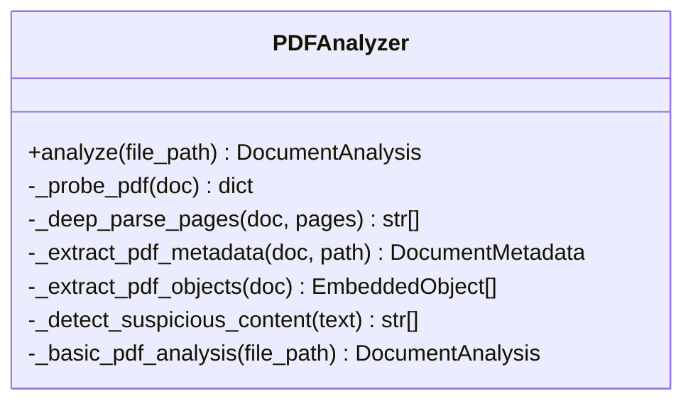
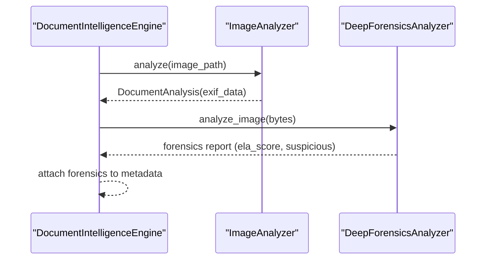
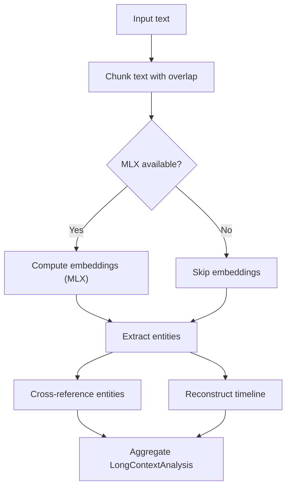
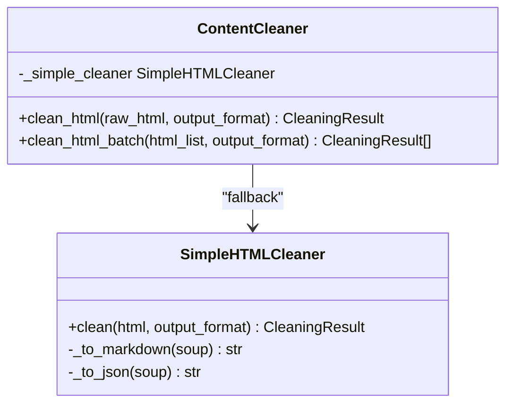
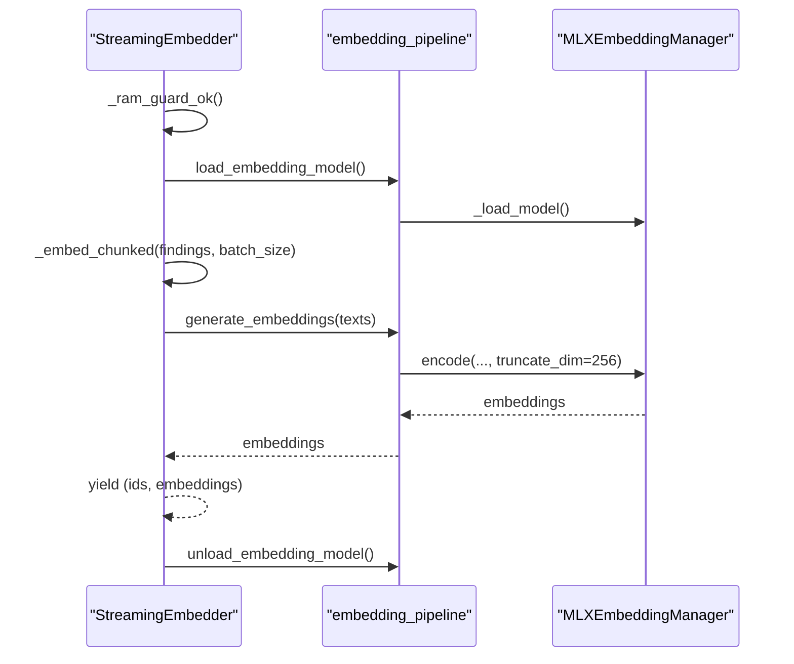
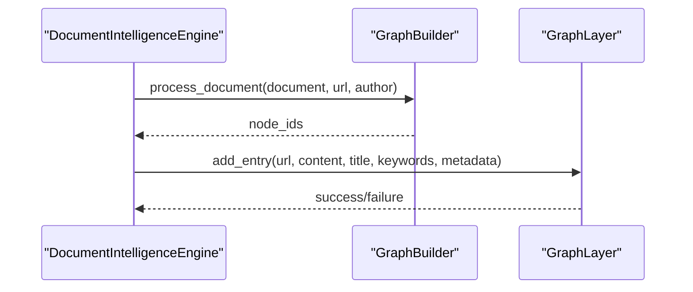
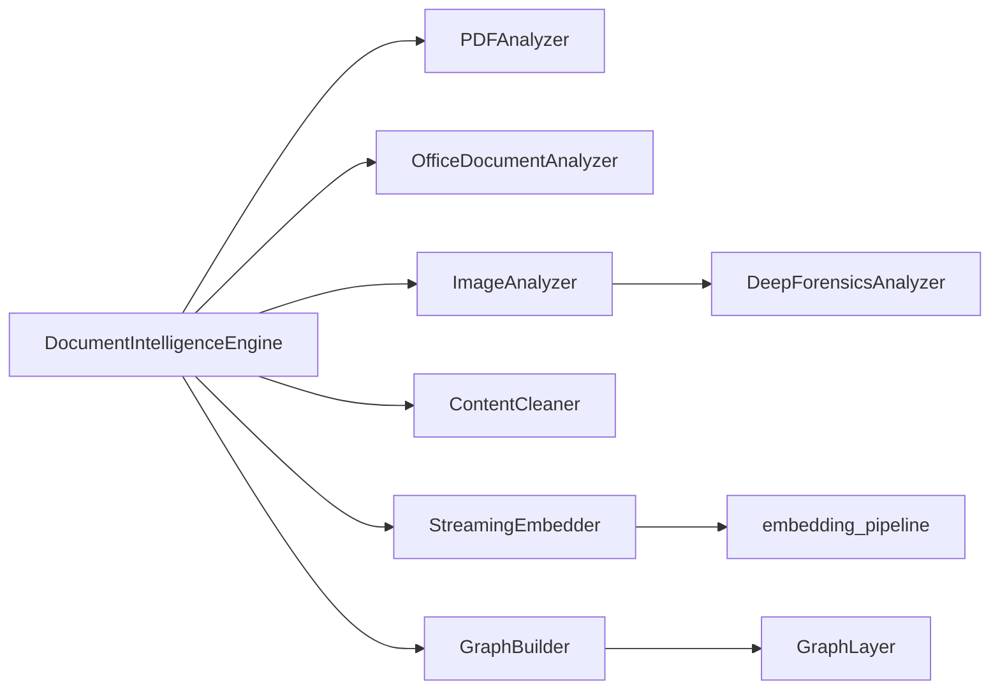

# Document Intelligence

<cite>
**Referenced Files in This Document**
- [document_intelligence.py](file://intelligence/document_intelligence.py)
- [streaming_embedder.py](file://intelligence/streaming_embedder.py)
- [content_layer.py](file://layers/content_layer.py)
- [embedding_pipeline.py](file://embedding_pipeline.py)
- [__init__.py](file://intelligence/__init__.py)
- [multimodal/analyzer.py](file://multimodal/analyzer.py)
- [graph_builder.py](file://knowledge/graph_builder.py)
- [graph_layer.py](file://knowledge/graph_layer.py)
</cite>

## Table of Contents
1. [Introduction](#introduction)
2. [Project Structure](#project-structure)
3. [Core Components](#core-components)
4. [Architecture Overview](#architecture-overview)
5. [Detailed Component Analysis](#detailed-component-analysis)
6. [Dependency Analysis](#dependency-analysis)
7. [Performance Considerations](#performance-considerations)
8. [Troubleshooting Guide](#troubleshooting-guide)
9. [Conclusion](#conclusion)

## Introduction
This document describes the document intelligence module responsible for extracting, analyzing, and enriching textual and multimedia content from diverse document formats. It covers:
- Text extraction and content analysis for PDFs, Microsoft Office/OpenDocument formats, and images
- Forensic image analysis and suspicious content detection
- Progressive parsing with heuristic and optional semantic scoring
- Structured data extraction and content layer conversion for web content
- Real-time streaming embedding for scalable, memory-safe document processing
- Integration with the broader knowledge graph for semantic enrichment and retrieval

## Project Structure
The document intelligence system is organized around three primary areas:
- Document analysis engine: specialized analyzers for PDFs, Office/OpenDocument, and images
- Content processing: HTML-to-Markdown/JSON conversion for structured web content
- Embedding pipeline: streaming, memory-guarded embedding generation for semantic indexing

**Diagram sources**
- [document_intelligence.py:1277-1366](file://intelligence/document_intelligence.py#L1277-L1366)
- [content_layer.py:327-449](file://layers/content_layer.py#L327-L449)
- [streaming_embedder.py:60-204](file://intelligence/streaming_embedder.py#L60-L204)
- [embedding_pipeline.py:127-181](file://embedding_pipeline.py#L127-L181)
- [graph_builder.py:117-203](file://knowledge/graph_builder.py#L117-L203)
- [graph_layer.py:62-98](file://knowledge/graph_layer.py#L62-L98)

**Section sources**
- [__init__.py:186-208](file://intelligence/__init__.py#L186-L208)
- [document_intelligence.py:1277-1366](file://intelligence/document_intelligence.py#L1277-L1366)
- [content_layer.py:327-449](file://layers/content_layer.py#L327-L449)
- [streaming_embedder.py:60-204](file://intelligence/streaming_embedder.py#L60-L204)
- [embedding_pipeline.py:127-181](file://embedding_pipeline.py#L127-L181)
- [graph_builder.py:117-203](file://knowledge/graph_builder.py#L117-L203)
- [graph_layer.py:62-98](file://knowledge/graph_layer.py#L62-L98)

## Core Components
- DocumentIntelligenceEngine: Unified entry point for document analysis across formats, with progressive parsing and optional semantic scoring.
- PDFAnalyzer: Heuristic and deep parsing of PDFs, metadata extraction, embedded object discovery, and suspicious content detection.
- OfficeDocumentAnalyzer: ZIP-based OOXML analysis for modern Office formats and legacy OLE handling.
- ImageAnalyzer: EXIF/GPS extraction and image forensics integration.
- DeepForensicsAnalyzer: ELA and steganalysis for suspicious images.
- MLXLongContextAnalyzer: Memory-efficient, MLX-accelerated analysis of large documents with entity extraction, cross-document linking, and timeline reconstruction.
- ContentCleaner: HTML-to-Markdown/JSON conversion for structured web content.
- StreamingEmbedder: Async, chunked embedding pipeline with memory guards and fail-open behavior.
- embedding_pipeline: Singleton MLX-based embedder with MRL 256-dimension outputs and memory-pressure safeguards.

**Section sources**
- [document_intelligence.py:1277-1366](file://intelligence/document_intelligence.py#L1277-L1366)
- [document_intelligence.py:259-598](file://intelligence/document_intelligence.py#L259-L598)
- [document_intelligence.py:601-768](file://intelligence/document_intelligence.py#L601-L768)
- [document_intelligence.py:771-954](file://intelligence/document_intelligence.py#L771-L954)
- [document_intelligence.py:958-1275](file://intelligence/document_intelligence.py#L958-L1275)
- [document_intelligence.py:1593-2104](file://intelligence/document_intelligence.py#L1593-L2104)
- [content_layer.py:327-449](file://layers/content_layer.py#L327-L449)
- [streaming_embedder.py:60-204](file://intelligence/streaming_embedder.py#L60-L204)
- [embedding_pipeline.py:127-181](file://embedding_pipeline.py#L127-L181)

## Architecture Overview
The system integrates document ingestion, analysis, enrichment, and embedding into a cohesive pipeline. Progressive parsing determines whether to perform deep analysis based on content heuristics, optionally augmented by semantic similarity to a research query. Embedded findings are streamed to maintain memory safety on constrained hardware.

**Diagram sources**
- [document_intelligence.py:1291-1365](file://intelligence/document_intelligence.py#L1291-L1365)
- [content_layer.py:420-448](file://layers/content_layer.py#L420-L448)
- [streaming_embedder.py:150-204](file://intelligence/streaming_embedder.py#L150-L204)
- [embedding_pipeline.py:425-497](file://embedding_pipeline.py#L425-L497)
- [graph_builder.py:117-203](file://knowledge/graph_builder.py#L117-L203)
- [graph_layer.py:62-98](file://knowledge/graph_layer.py#L62-L98)

## Detailed Component Analysis

### DocumentIntelligenceEngine
- Probes document previews to estimate value for progressive parsing.
- Supports heuristic scoring and optional semantic scoring using MLX when available.
- Routes to appropriate analyzer based on extension or magic bytes.
- Integrates image forensics and attaches raw metadata to analysis results.

**Diagram sources**
- [document_intelligence.py:1382-1432](file://intelligence/document_intelligence.py#L1382-L1432)

**Section sources**
- [document_intelligence.py:1382-1432](file://intelligence/document_intelligence.py#L1382-L1432)
- [document_intelligence.py:1291-1365](file://intelligence/document_intelligence.py#L1291-L1365)

### PDFAnalyzer
- Heuristic probing selects candidate pages; deep parsing performed only when signal is strong.
- Extracts metadata, embedded objects, hyperlinks, emails, IPs, and suspicious indicators.
- Falls back to basic analysis without PyMuPDF.

**Diagram sources**
- [document_intelligence.py:259-598](file://intelligence/document_intelligence.py#L259-L598)

**Section sources**
- [document_intelligence.py:259-598](file://intelligence/document_intelligence.py#L259-L598)

### OfficeDocumentAnalyzer
- Detects OOXML vs legacy OLE via ZIP signature.
- Extracts core properties, comments, hyperlinks, and media attachments.

**Section sources**
- [document_intelligence.py:601-768](file://intelligence/document_intelligence.py#L601-L768)

### ImageAnalyzer and DeepForensicsAnalyzer
- ImageAnalyzer: EXIF/GPS extraction and metadata normalization.
- DeepForensicsAnalyzer: ELA and steganalysis with MPS acceleration and fallback to CPU; integrates with graph for flagged anomalies.

**Diagram sources**
- [document_intelligence.py:771-954](file://intelligence/document_intelligence.py#L771-L954)
- [document_intelligence.py:958-1275](file://intelligence/document_intelligence.py#L958-L1275)

**Section sources**
- [document_intelligence.py:771-954](file://intelligence/document_intelligence.py#L771-L954)
- [document_intelligence.py:958-1275](file://intelligence/document_intelligence.py#L958-L1275)

### MLXLongContextAnalyzer
- Chunks large texts with overlap, computes embeddings (MLX when available), extracts entities, cross-references across documents, and reconstructs timelines.
- Designed for M1 8GB memory constraints with streaming and lazy evaluation.

**Diagram sources**
- [document_intelligence.py:1930-2104](file://intelligence/document_intelligence.py#L1930-L2104)

**Section sources**
- [document_intelligence.py:1593-2104](file://intelligence/document_intelligence.py#L1593-L2104)

### ContentCleaner (Content Layer)
- Converts HTML to Markdown/JSON using BeautifulSoup fallback; includes lightweight URL cleaning and search result parsers for DuckDuckGo/Google.

**Diagram sources**
- [content_layer.py:327-449](file://layers/content_layer.py#L327-L449)
- [content_layer.py:54-213](file://layers/content_layer.py#L54-L213)

**Section sources**
- [content_layer.py:327-449](file://layers/content_layer.py#L327-L449)
- [content_layer.py:54-213](file://layers/content_layer.py#L54-L213)

### StreamingEmbedder and embedding_pipeline
- StreamingEmbedder: Async, chunked embedding with memory guards, fetch semaphore limits, and fail-open behavior.
- embedding_pipeline: Singleton MLX embedder with MRL 256-d embeddings, memory-pressure checks, and streaming batch support.

**Diagram sources**
- [streaming_embedder.py:150-204](file://intelligence/streaming_embedder.py#L150-L204)
- [embedding_pipeline.py:425-497](file://embedding_pipeline.py#L425-L497)
- [embedding_pipeline.py:333-413](file://embedding_pipeline.py#L333-L413)

**Section sources**
- [streaming_embedder.py:60-204](file://intelligence/streaming_embedder.py#L60-L204)
- [embedding_pipeline.py:127-181](file://embedding_pipeline.py#L127-L181)
- [embedding_pipeline.py:425-497](file://embedding_pipeline.py#L425-L497)

### Knowledge Graph Integration
- GraphBuilder processes content and stores facts with nodes and edges.
- GraphLayer exposes add_entry mapped to knowledge graph storage.

**Diagram sources**
- [graph_builder.py:117-203](file://knowledge/graph_builder.py#L117-L203)
- [graph_layer.py:62-98](file://knowledge/graph_layer.py#L62-L98)

**Section sources**
- [graph_builder.py:117-203](file://knowledge/graph_builder.py#L117-L203)
- [graph_layer.py:62-98](file://knowledge/graph_layer.py#L62-L98)

## Dependency Analysis
- DocumentIntelligenceEngine depends on analyzers and optional MLX/forensics modules.
- ContentCleaner is decoupled and used by downstream processors.
- StreamingEmbedder relies on embedding_pipeline for model lifecycle and embeddings.
- GraphBuilder/GraphLayer integrate extracted content into the knowledge graph.

**Diagram sources**
- [document_intelligence.py:1277-1366](file://intelligence/document_intelligence.py#L1277-L1366)
- [content_layer.py:327-449](file://layers/content_layer.py#L327-L449)
- [streaming_embedder.py:60-204](file://intelligence/streaming_embedder.py#L60-L204)
- [embedding_pipeline.py:127-181](file://embedding_pipeline.py#L127-L181)
- [graph_builder.py:117-203](file://knowledge/graph_builder.py#L117-L203)
- [graph_layer.py:62-98](file://knowledge/graph_layer.py#L62-L98)

**Section sources**
- [__init__.py:186-208](file://intelligence/__init__.py#L186-L208)
- [document_intelligence.py:1277-1366](file://intelligence/document_intelligence.py#L1277-L1366)

## Performance Considerations
- Progressive parsing: Heuristic probing minimizes deep parsing costs for low-signal documents.
- Memory guards: StreamingEmbedder and embedding_pipeline enforce strict RSS thresholds to prevent OOM on M1 8GB systems.
- Streaming batches: Yielding embeddings per chunk reduces peak memory usage.
- MLX acceleration: Where available, MLXLongContextAnalyzer and forensics leverage GPU/CPU acceleration with MPS fallback.
- Concurrency limits: Document extraction limits concurrent operations to maintain stability on constrained devices.

[No sources needed since this section provides general guidance]

## Troubleshooting Guide
- Missing optional dependencies:
  - PIL/piexif/PDF support: If unavailable, analyzers fall back to basic modes; image and PDF analysis may be limited.
  - MLX: If unavailable, semantic scoring and MLX accelerations are disabled; the system continues with CPU-only paths.
- Memory pressure:
  - StreamingEmbedder and embedding_pipeline skip embedding when RSS exceeds thresholds; consider reducing batch sizes or freeing memory elsewhere.
- Forensics failures:
  - ELA/stegdetect may fall back to CPU or return conservative results; verify external binaries and permissions.
- Content cleaning:
  - BeautifulSoup fallback is used when MLX-based cleaners are not available; expect slower performance but functional cleaning.

**Section sources**
- [document_intelligence.py:44-112](file://intelligence/document_intelligence.py#L44-L112)
- [streaming_embedder.py:131-144](file://intelligence/streaming_embedder.py#L131-L144)
- [embedding_pipeline.py:90-114](file://embedding_pipeline.py#L90-L114)
- [content_layer.py:66-73](file://layers/content_layer.py#L66-L73)

## Conclusion
The document intelligence module provides a robust, memory-conscious pipeline for analyzing heterogeneous documents, extracting structured insights, and generating embeddings for semantic search and knowledge graph integration. Its progressive parsing, streaming embedder, and content layer ensure scalability and reliability across varied workloads and hardware constraints.