# Intelligence Modules

<cite>
**Referenced Files in This Document**
- [intelligence/__init__.py](file://hledac/universal/intelligence/__init__.py)
- [web_intelligence.py](file://hledac/universal/intelligence/web_intelligence.py)
- [cryptographic_intelligence.py](file://hledac/universal/intelligence/cryptographic_intelligence.py)
- [network_intelligence.py](file://hledac/universal/intelligence/network_intelligence.py)
- [document_intelligence.py](file://hledac/universal/intelligence/document_intelligence.py)
- [network_reconnaissance.py](file://hledac/universal/intelligence/network_reconnaissance.py)
- [workflow_orchestrator.py](file://hledac/universal/intelligence/workflow_orchestrator.py)
- [streaming_embedder.py](file://hledac/universal/intelligence/streaming_embedder.py)
- [exposed_service_hunter.py](file://hledac/universal/intelligence/exposed_service_hunter.py)
- [blockchain_analyzer.py](file://hledac/universal/intelligence/blockchain_analyzer.py)
</cite>

## Table of Contents
1. [Introduction](#introduction)
2. [Project Structure](#project-structure)
3. [Core Components](#core-components)
4. [Architecture Overview](#architecture-overview)
5. [Detailed Component Analysis](#detailed-component-analysis)
6. [Dependency Analysis](#dependency-analysis)
7. [Performance Considerations](#performance-considerations)
8. [Troubleshooting Guide](#troubleshooting-guide)
9. [Conclusion](#conclusion)
10. [Appendices](#appendices)

## Introduction
This document describes the Hledac Universal intelligence modules that power domain-specific OSINT and security analysis. It covers web intelligence, cryptographic analysis, network reconnaissance, document analysis, and multimedia intelligence. It explains intelligence gathering workflows, analysis algorithms, output formats, integration patterns, configuration options, performance characteristics, accuracy considerations, privacy and compliance, and practical usage examples.

## Project Structure
The intelligence package exposes a capability forest of modules designed for M1 8GB constrained environments. Each module encapsulates a focused domain with graceful degradation when optional dependencies are unavailable. The package exports availability flags and unified classes for each module, enabling safe integration into broader systems.

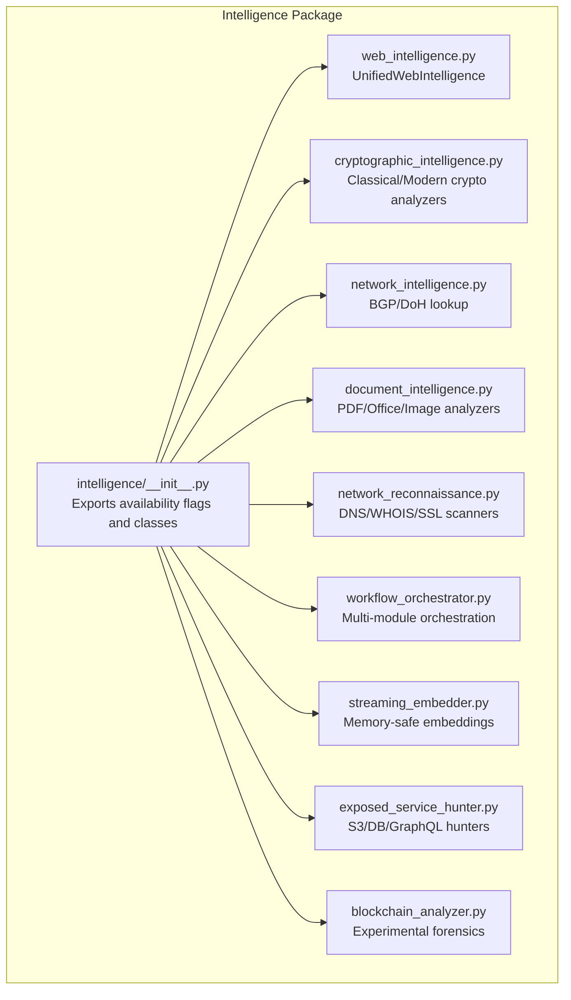

**Diagram sources**
- [intelligence/__init__.py:1-686](file://hledac/universal/intelligence/__init__.py#L1-L686)
- [web_intelligence.py:1-1075](file://hledac/universal/intelligence/web_intelligence.py#L1-L1075)
- [cryptographic_intelligence.py:1-1257](file://hledac/universal/intelligence/cryptographic_intelligence.py#L1-L1257)
- [network_intelligence.py:1-365](file://hledac/universal/intelligence/network_intelligence.py#L1-L365)
- [document_intelligence.py:1-2154](file://hledac/universal/intelligence/document_intelligence.py#L1-L2154)
- [network_reconnaissance.py:1-1388](file://hledac/universal/intelligence/network_reconnaissance.py#L1-L1388)
- [workflow_orchestrator.py:1-1849](file://hledac/universal/intelligence/workflow_orchestrator.py#L1-L1849)
- [streaming_embedder.py:1-294](file://hledac/universal/intelligence/streaming_embedder.py#L1-L294)
- [exposed_service_hunter.py:1-1683](file://hledac/universal/intelligence/exposed_service_hunter.py#L1-L1683)
- [blockchain_analyzer.py:1-1596](file://hledac/universal/intelligence/blockchain_analyzer.py#L1-L1596)

**Section sources**
- [intelligence/__init__.py:1-686](file://hledac/universal/intelligence/__init__.py#L1-L686)

## Core Components
- Unified Web Intelligence: Lightweight wrapper around Hledac’s scraping and OSINT components with bounded queues, priority aging, and memory pressure awareness. Provides comprehensive intelligence results including web data, OSINT profiles, threat assessments, and vulnerability analyses.
- Cryptographic Intelligence: Classical and modern cryptanalysis, hash identification, encryption detection, certificate parsing, and entropy analysis. Self-contained, no external APIs.
- Network Intelligence: BGP lookups via pybgpstream or fallback to ipinfo.io; DNS-over-HTTPS resolution via dnspython or direct JSON endpoints; integrates results into a knowledge graph.
- Document Intelligence: PDF, Office, and image analysis with metadata extraction, embedded object detection, suspicious content scanning, and EXIF parsing. Includes MLX-accelerated semantic scoring when available.
- Network Reconnaissance: DNS enumeration, WHOIS lookup, SSL/TLS certificate analysis, wildcard detection, and passive scanning with private IP filtering.
- Workflow Orchestrator: Multi-module orchestration coordinating execution, correlation, anomaly detection, and report generation across domains.
- Streaming Embedder: Memory-safe, chunked async embedding pipeline for canonical findings with model lifecycle integration and RAM guards.
- Exposed Service Hunter: Discovers S3 buckets, databases, GraphQL endpoints, and certificate transparency exposures using common naming patterns and HTTP checks.
- Blockchain Forensics: Experimental module for wallet analysis and transaction tracing via Etherscan/Blockchair with hard containment and circuit breaker integration.

**Section sources**
- [web_intelligence.py:115-800](file://hledac/universal/intelligence/web_intelligence.py#L115-L800)
- [cryptographic_intelligence.py:202-800](file://hledac/universal/intelligence/cryptographic_intelligence.py#L202-L800)
- [network_intelligence.py:29-365](file://hledac/universal/intelligence/network_intelligence.py#L29-L365)
- [document_intelligence.py:259-800](file://hledac/universal/intelligence/document_intelligence.py#L259-L800)
- [network_reconnaissance.py:639-1388](file://hledac/universal/intelligence/network_reconnaissance.py#L639-L1388)
- [workflow_orchestrator.py:335-800](file://hledac/universal/intelligence/workflow_orchestrator.py#L335-L800)
- [streaming_embedder.py:60-294](file://hledac/universal/intelligence/streaming_embedder.py#L60-L294)
- [exposed_service_hunter.py:115-800](file://hledac/universal/intelligence/exposed_service_hunter.py#L115-L800)
- [blockchain_analyzer.py:304-800](file://hledac/universal/intelligence/blockchain_analyzer.py#L304-L800)

## Architecture Overview
The intelligence modules are designed for composability and resilience. They expose availability flags and lazy-initialization patterns to minimize import-time overhead and memory footprint. The Workflow Orchestrator coordinates domain-specific modules, correlates findings, and produces structured reports. Streaming Embedder ensures memory safety during embedding phases. Network Intelligence and Network Reconnaissance provide foundational network metadata for correlation.

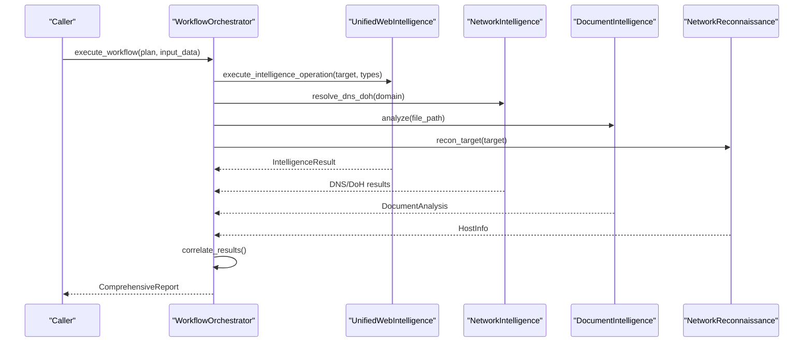

**Diagram sources**
- [workflow_orchestrator.py:385-609](file://hledac/universal/intelligence/workflow_orchestrator.py#L385-L609)
- [web_intelligence.py:344-477](file://hledac/universal/intelligence/web_intelligence.py#L344-L477)
- [network_intelligence.py:153-247](file://hledac/universal/intelligence/network_intelligence.py#L153-L247)
- [document_intelligence.py:278-351](file://hledac/universal/intelligence/document_intelligence.py#L278-L351)
- [network_reconnaissance.py:797-800](file://hledac/universal/intelligence/network_reconnaissance.py#L797-L800)

## Detailed Component Analysis

### Web Intelligence
- Purpose: Unified OSINT and web scraping with threat assessment and vulnerability analysis.
- Key features:
  - Bounded queue with priority aging and memory pressure checks.
  - Lazy component initialization for optional dependencies.
  - Parallel execution of multiple operation types.
  - Metrics tracking and completion history with FIFO eviction.
- Inputs: IntelligenceTarget with URLs, selectors, OSINT sources, and operation types.
- Outputs: IntelligenceResult with web_data, OSINT profiles, threat_assessment, vulnerabilities, and performance metrics.
- Configuration: max_concurrent_operations, enable_flashattention, enable_osint, enable_stealth, queue limits, and memory budget.
- Accuracy and performance: Uses intelligent scraper with captcha solving and stealth headers; prioritizes memory-constrained environments; supports graceful degradation.

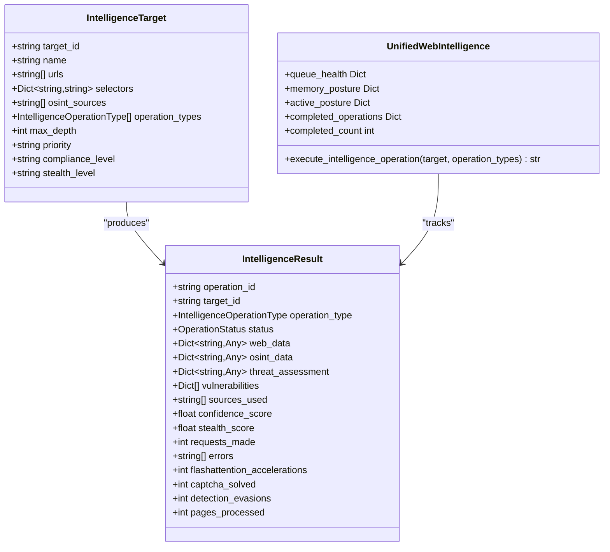

**Diagram sources**
- [web_intelligence.py:69-114](file://hledac/universal/intelligence/web_intelligence.py#L69-L114)
- [web_intelligence.py:84-113](file://hledac/universal/intelligence/web_intelligence.py#L84-L113)
- [web_intelligence.py:115-525](file://hledac/universal/intelligence/web_intelligence.py#L115-L525)

**Section sources**
- [web_intelligence.py:115-800](file://hledac/universal/intelligence/web_intelligence.py#L115-L800)

### Cryptographic Intelligence
- Purpose: Self-hosted cryptanalysis for classical ciphers, modern encryption detection, hash identification, certificate parsing, and entropy analysis.
- Algorithms:
  - Classical cryptanalysis: Caesar, Vigenere, Atbash, Rail Fence, frequency analysis, Kasiski examination.
  - Hash identification: regex and length-based matching, entropy estimation, salting detection.
  - Encryption detection: entropy, chi-square, index of coincidence, block size hints.
  - Certificate parsing: subject/issuer, SANs, fingerprints, validity periods.
- Accuracy considerations: Classical ciphers rely on English language heuristics; hash cracking depends on dictionary coverage and computational resources; entropy analysis helps distinguish encrypted vs. plain text.
- Performance: Heavily CPU-bound; optimized with NumPy; optional cryptography library for modern crypto operations.

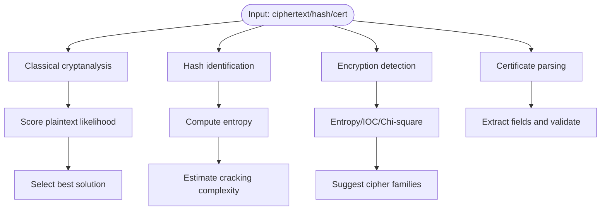

**Diagram sources**
- [cryptographic_intelligence.py:202-555](file://hledac/universal/intelligence/cryptographic_intelligence.py#L202-L555)
- [cryptographic_intelligence.py:557-797](file://hledac/universal/intelligence/cryptographic_intelligence.py#L557-L797)
- [cryptographic_intelligence.py:799-800](file://hledac/universal/intelligence/cryptographic_intelligence.py#L799-L800)

**Section sources**
- [cryptographic_intelligence.py:1-1257](file://hledac/universal/intelligence/cryptographic_intelligence.py#L1-L1257)

### Network Intelligence
- Purpose: Retrieve BGP and DNS-over-HTTPS information with fallbacks and integrate into a knowledge graph.
- Workflows:
  - BGP lookup via pybgpstream with capped records; fallback to ipinfo.io API.
  - DoH resolution via dnspython with Cloudflare/Google endpoints; direct JSON fallback.
- Output formats: Structured dictionaries with ASN, prefixes, country, A/AAAA/MX/TXT records, and provider/source metadata.
- Privacy: Uses DoH to avoid local resolver leakage; fallbacks still reach public APIs.

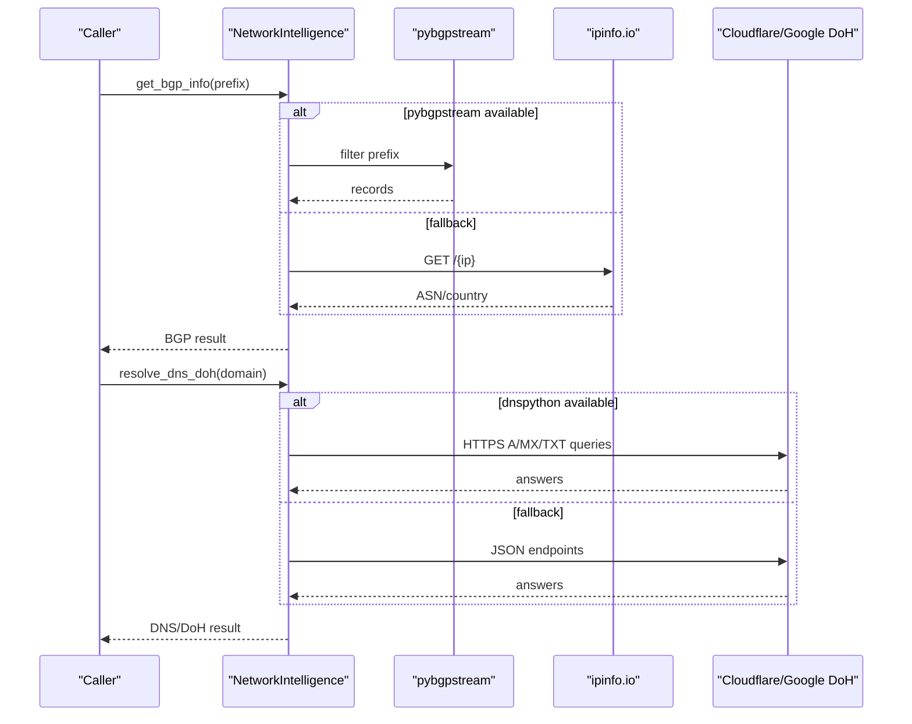

**Diagram sources**
- [network_intelligence.py:29-151](file://hledac/universal/intelligence/network_intelligence.py#L29-L151)
- [network_intelligence.py:153-307](file://hledac/universal/intelligence/network_intelligence.py#L153-L307)

**Section sources**
- [network_intelligence.py:1-365](file://hledac/universal/intelligence/network_intelligence.py#L1-L365)

### Document Intelligence
- Purpose: Extract metadata, hidden content, and forensic artifacts from PDFs, Office documents, and images.
- Features:
  - PDF: metadata, embedded objects, hyperlinks, emails, suspicious keywords (Aho-Corasick or substring).
  - Office: OOXML/OLE parsing, comments, embedded media.
  - Images: EXIF parsing, GPS extraction, orientation, device info.
  - Progressive parsing: probe first, deepen only on high signal.
- Accuracy: Metadata extraction is robust; suspicious keyword detection benefits from Aho-Corasick automaton; image forensics depend on EXIF availability.
- Performance: Streaming processing, optional PyMuPDF and PIL; MPS/MLX acceleration guarded by availability checks.

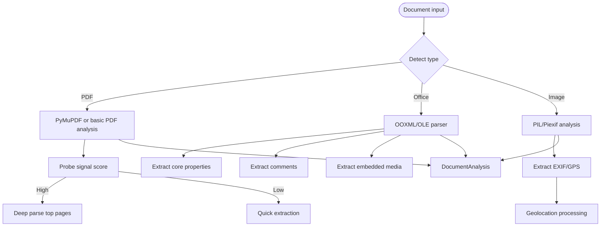

**Diagram sources**
- [document_intelligence.py:259-446](file://hledac/universal/intelligence/document_intelligence.py#L259-L446)
- [document_intelligence.py:601-769](file://hledac/universal/intelligence/document_intelligence.py#L601-L769)
- [document_intelligence.py:771-800](file://hledac/universal/intelligence/document_intelligence.py#L771-L800)

**Section sources**
- [document_intelligence.py:1-2154](file://hledac/universal/intelligence/document_intelligence.py#L1-L2154)

### Network Reconnaissance
- Purpose: Passive reconnaissance combining DNS enumeration, WHOIS, SSL/TLS analysis, wildcard detection, and private IP filtering.
- Algorithms:
  - DNS enumeration: A/AAAA/MX/NS/TXT/SOA/CNAME/PTR/SRV/CAA with zone transfer attempts.
  - WHOIS: TLD-specific servers, date parsing, privacy redaction handling.
  - SSL: Certificate parsing, SAN extraction, expiry calculation.
  - Wildcard detection: High-entropy random subdomain probing with conservative timeouts.
- Accuracy: DNS enumeration relies on resolver responses; WHOIS parsing handles various formats; wildcard detection avoids false positives with timeouts and caches.
- Performance: Async I/O, semaphores, and bounded wildcards to prevent resource exhaustion.

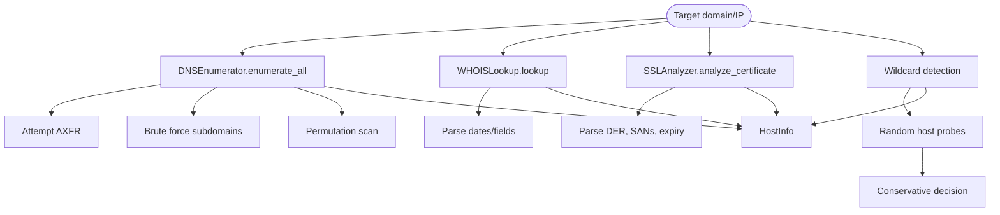

**Diagram sources**
- [network_reconnaissance.py:141-343](file://hledac/universal/intelligence/network_reconnaissance.py#L141-L343)
- [network_reconnaissance.py:379-523](file://hledac/universal/intelligence/network_reconnaissance.py#L379-L523)
- [network_reconnaissance.py:525-637](file://hledac/universal/intelligence/network_reconnaissance.py#L525-L637)
- [network_reconnaissance.py:639-796](file://hledac/universal/intelligence/network_reconnaissance.py#L639-L796)

**Section sources**
- [network_reconnaissance.py:1-1388](file://hledac/universal/intelligence/network_reconnaissance.py#L1-L1388)

### Workflow Orchestrator
- Purpose: Coordinate multi-module analysis, correlate findings, detect anomalies, and produce comprehensive reports.
- Execution modes: Sequential or parallel with grouped modules and timeouts.
- Correlation patterns: High-risk combinations (e.g., scrubbed metadata + steganography) increment risk scores; multiple indicators increase risk.
- Output formats: JSON, Markdown, HTML; timeline of execution events.
- Configuration: module_timeout, max_parallel_modules, enable_correlation, enable_anomaly_detection, risk thresholds.

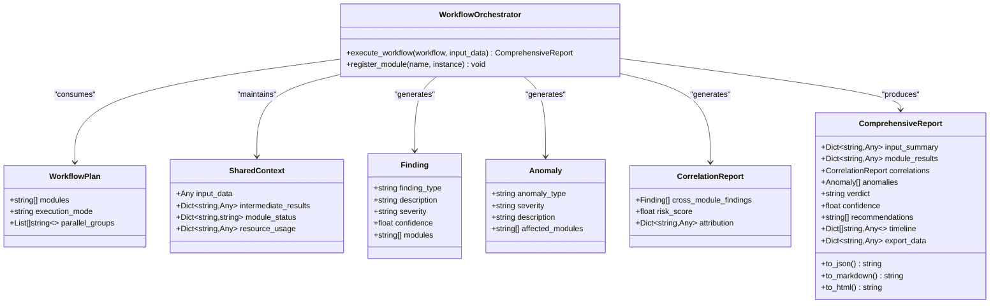

**Diagram sources**
- [workflow_orchestrator.py:24-112](file://hledac/universal/intelligence/workflow_orchestrator.py#L24-L112)
- [workflow_orchestrator.py:335-609](file://hledac/universal/intelligence/workflow_orchestrator.py#L335-L609)
- [workflow_orchestrator.py:610-800](file://hledac/universal/intelligence/workflow_orchestrator.py#L610-L800)

**Section sources**
- [workflow_orchestrator.py:1-1849](file://hledac/universal/intelligence/workflow_orchestrator.py#L1-L1849)

### Streaming Embedder
- Purpose: Memory-safe, chunked async embedding pipeline for canonical findings with model lifecycle integration and RAM guards.
- Guarantees: Bounded batch size, text truncation, fail-open behavior, and automatic model load/unload.
- Integration: Used by sprint scheduler for dedup/ANN ingestion; falls back to embedding pipeline when unavailable.

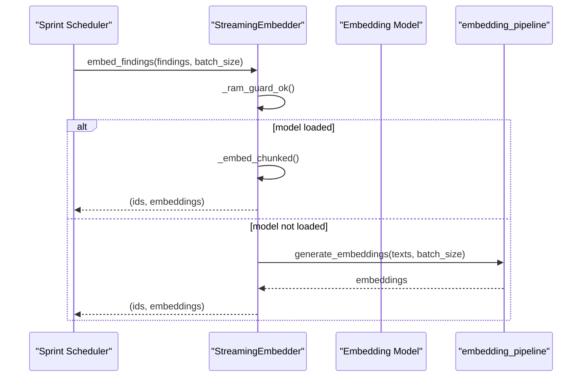

**Diagram sources**
- [streaming_embedder.py:150-204](file://hledac/universal/intelligence/streaming_embedder.py#L150-L204)
- [streaming_embedder.py:205-268](file://hledac/universal/intelligence/streaming_embedder.py#L205-L268)

**Section sources**
- [streaming_embedder.py:1-294](file://hledac/universal/intelligence/streaming_embedder.py#L1-L294)

### Exposed Service Hunter
- Purpose: Discover exposed services and misconfigurations including S3 buckets, databases, GraphQL endpoints, and certificate transparency exposures.
- Techniques:
  - S3: naming pattern enumeration across regions with permission checks.
  - Databases: TCP banner probing for MongoDB, Redis, Elasticsearch, CouchDB, and others.
  - GraphQL: introspection queries to detect schemas and permissions.
  - Certificate Transparency: queries via crt.sh for subdomain discovery.
- Risk levels: Critical, High, Medium, Low based on exposure type and service sensitivity.

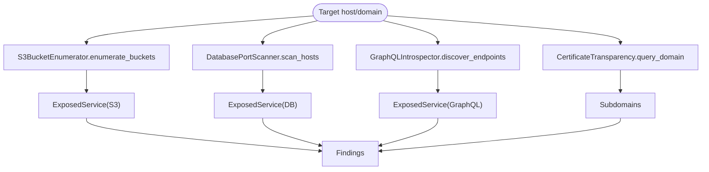

**Diagram sources**
- [exposed_service_hunter.py:115-337](file://hledac/universal/intelligence/exposed_service_hunter.py#L115-L337)
- [exposed_service_hunter.py:339-541](file://hledac/universal/intelligence/exposed_service_hunter.py#L339-L541)
- [exposed_service_hunter.py:543-749](file://hledac/universal/intelligence/exposed_service_hunter.py#L543-L749)
- [exposed_service_hunter.py:751-800](file://hledac/universal/intelligence/exposed_service_hunter.py#L751-L800)

**Section sources**
- [exposed_service_hunter.py:1-1683](file://hledac/universal/intelligence/exposed_service_hunter.py#L1-L1683)

### Blockchain Forensics (Hard Containment)
- Status: Experimental, not promoted; designed for offline research with external API keys.
- Features: Wallet analysis, transaction tracing, clustering, pattern detection, and entity tagging.
- Containment: Hard upper bounds on cache size, depth-first tracing, and circuit breaker integration; not wired into canonical paths.
- Compliance: No API key storage; network traffic goes directly to third-party APIs.

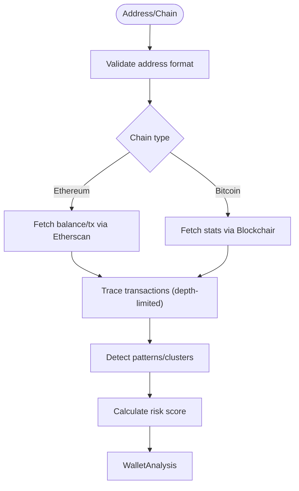

**Diagram sources**
- [blockchain_analyzer.py:304-548](file://hledac/universal/intelligence/blockchain_analyzer.py#L304-L548)
- [blockchain_analyzer.py:549-800](file://hledac/universal/intelligence/blockchain_analyzer.py#L549-L800)

**Section sources**
- [blockchain_analyzer.py:1-1596](file://hledac/universal/intelligence/blockchain_analyzer.py#L1-L1596)

## Dependency Analysis
- Availability flags: The package exports availability booleans for each module to indicate import success without production readiness.
- Lazy initialization: Many modules defer component initialization until first use to reduce startup overhead.
- Optional dependencies: Modules conditionally import optional libraries (e.g., cryptography, PIL, PyMuPDF, dnspython) and degrade gracefully.
- Integration seams:
  - Workflow Orchestrator registers modules dynamically and executes them with timeouts.
  - Streaming Embedder integrates with model lifecycle and resource governor.
  - Network Intelligence integrates with knowledge graph nodes and edges.

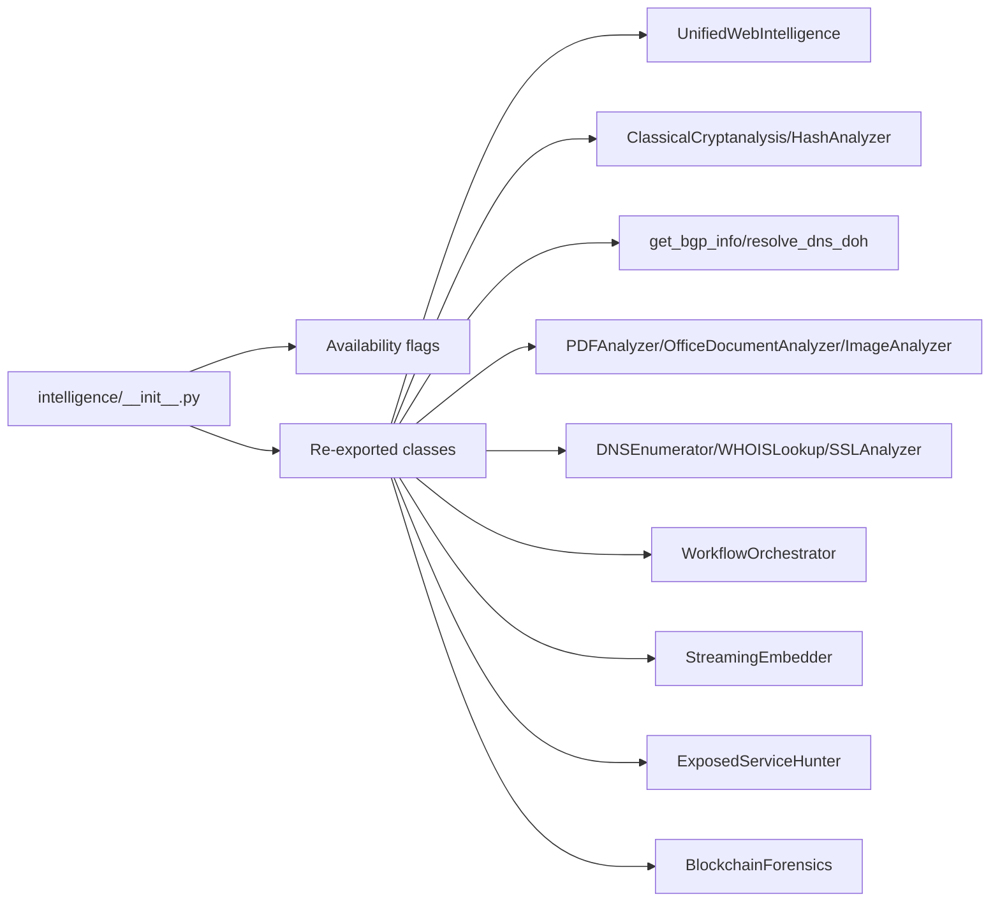

**Diagram sources**
- [intelligence/__init__.py:425-686](file://hledac/universal/intelligence/__init__.py#L425-L686)

**Section sources**
- [intelligence/__init__.py:1-686](file://hledac/universal/intelligence/__init__.py#L1-L686)

## Performance Considerations
- Memory safety:
  - Web Intelligence enforces memory budgets and evicts completed operations with bounded FIFO.
  - Streaming Embedder caps batch sizes and unloads models under memory pressure.
  - Document Intelligence uses progressive parsing and optional heavy libraries behind availability checks.
- Concurrency:
  - Network modules use semaphores and connection pools to bound concurrent operations.
  - Workflow Orchestrator supports parallel groups with timeouts.
- I/O:
  - Async I/O for DNS, HTTP, and embedding operations; bounded RAM for BGP data.
- Accuracy trade-offs:
  - Classical cryptanalysis relies on language heuristics; hash cracking depends on dictionary coverage.
  - Wildcard detection conservatively handles timeouts and ambiguous responses.

[No sources needed since this section provides general guidance]

## Troubleshooting Guide
- Degraded mode:
  - If optional dependencies are missing, modules fall back to basic functionality or log warnings. Check availability flags and logs.
- Queue and memory pressure:
  - Web Intelligence warns when operations are queued due to memory limits; inspect queue_health and memory_posture.
- Timeouts:
  - Workflow Orchestrator applies module timeouts; check module_status and timeline events for failures.
- Network errors:
  - Network Intelligence and Exposed Service Hunter may fail due to resolver issues or API limits; verify credentials and rate limits.
- Privacy and compliance:
  - Use DoH for DNS resolution; avoid exposing sensitive data in reports; review export formats and retention policies.

**Section sources**
- [web_intelligence.py:204-270](file://hledac/universal/intelligence/web_intelligence.py#L204-L270)
- [workflow_orchestrator.py:462-466](file://hledac/universal/intelligence/workflow_orchestrator.py#L462-L466)
- [network_intelligence.py:89-96](file://hledac/universal/intelligence/network_intelligence.py#L89-L96)
- [exposed_service_hunter.py:252-308](file://hledac/universal/intelligence/exposed_service_hunter.py#L252-L308)

## Conclusion
Hledac Universal intelligence modules provide a resilient, modular, and memory-conscious toolkit for OSINT and security research. They support diverse domains—from web scraping and cryptography to network reconnaissance and document analysis—while maintaining performance and privacy safeguards. The Workflow Orchestrator coordinates these modules into cohesive analyses, and Streaming Embedder ensures memory safety during embedding. For experimental or heavy workloads, modules like Blockchain Forensics are contained and not integrated into canonical paths.

[No sources needed since this section summarizes without analyzing specific files]

## Appendices

### Configuration Options
- Web Intelligence:
  - max_concurrent_operations, enable_flashattention, enable_osint, enable_stealth, queue limits, memory budget.
- Workflow Orchestrator:
  - module_timeout, max_parallel_modules, enable_correlation, enable_anomaly_detection, risk_thresholds.
- Network Intelligence:
  - MAX_BGP_DATA_MB, DoH endpoints, fallbacks.
- Document Intelligence:
  - Optional dependencies (PIL, PyMuPDF, MLX), MPS detection, suspicious keywords.
- Exposed Service Hunter:
  - S3 patterns, database ports, GraphQL endpoints, CT API base URL.
- Blockchain Forensics:
  - Etherscan/Blockchair API keys, cache TTL, max_concurrent_requests, fetch_func seam.

**Section sources**
- [web_intelligence.py:131-199](file://hledac/universal/intelligence/web_intelligence.py#L131-L199)
- [workflow_orchestrator.py:315-333](file://hledac/universal/intelligence/workflow_orchestrator.py#L315-L333)
- [network_intelligence.py:21-27](file://hledac/universal/intelligence/network_intelligence.py#L21-L27)
- [document_intelligence.py:44-81](file://hledac/universal/intelligence/document_intelligence.py#L44-L81)
- [exposed_service_hunter.py:123-179](file://hledac/universal/intelligence/exposed_service_hunter.py#L123-L179)
- [blockchain_analyzer.py:315-342](file://hledac/universal/intelligence/blockchain_analyzer.py#L315-L342)

### Example Usage
- Web Intelligence:
  - Create IntelligenceTarget with URLs and operation types; call execute_intelligence_operation; inspect IntelligenceResult.
- Workflow Orchestrator:
  - Build WorkflowPlan with module names; call execute_workflow; render ComprehensiveReport to JSON/Markdown/HTML.
- Network Intelligence:
  - Call get_bgp_info(prefix) and resolve_dns_doh(domain); integrate results into knowledge graph.
- Document Intelligence:
  - Instantiate PDFAnalyzer/OfficeDocumentAnalyzer/ImageAnalyzer; call analyze(file_path); examine DocumentAnalysis.
- Exposed Service Hunter:
  - Use S3BucketEnumerator.enumerate_buckets(target), DatabasePortScanner.scan_hosts(hosts), GraphQLIntrospector.discover_endpoints(base_url), CertificateTransparency.query_domain(domain).
- Streaming Embedder:
  - Call embed_findings(findings, batch_size) to yield (ids, embeddings) batches.

**Section sources**
- [web_intelligence.py:344-477](file://hledac/universal/intelligence/web_intelligence.py#L344-L477)
- [workflow_orchestrator.py:385-466](file://hledac/universal/intelligence/workflow_orchestrator.py#L385-L466)
- [network_intelligence.py:29-151](file://hledac/universal/intelligence/network_intelligence.py#L29-L151)
- [document_intelligence.py:278-351](file://hledac/universal/intelligence/document_intelligence.py#L278-L351)
- [exposed_service_hunter.py:198-337](file://hledac/universal/intelligence/exposed_service_hunter.py#L198-L337)
- [streaming_embedder.py:150-204](file://hledac/universal/intelligence/streaming_embedder.py#L150-L204)