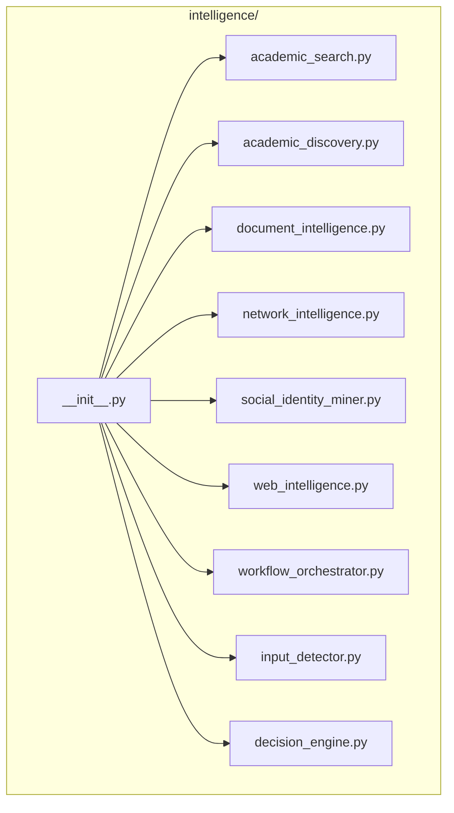
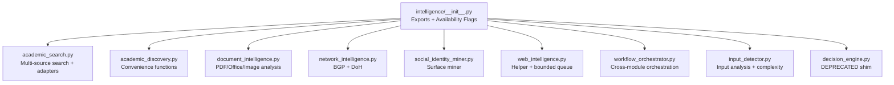
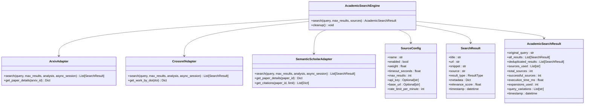
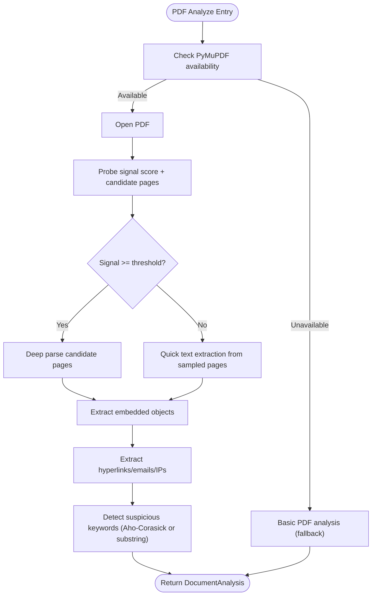
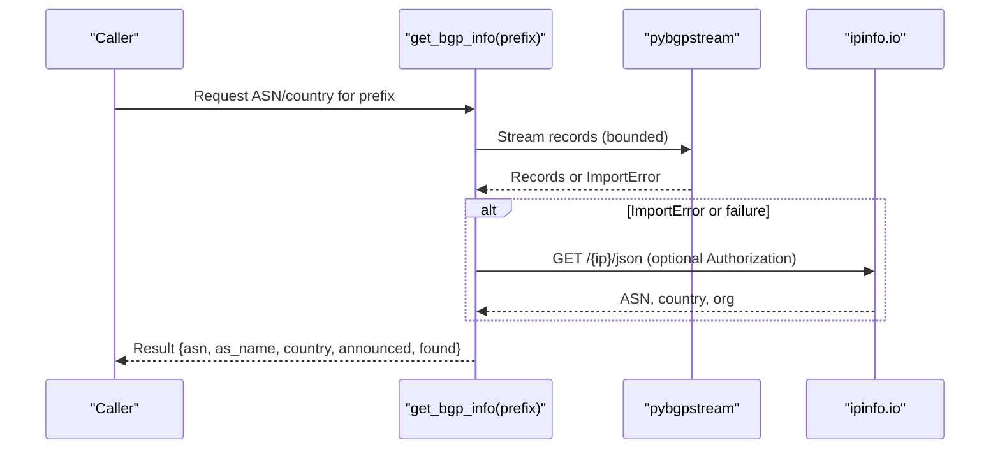
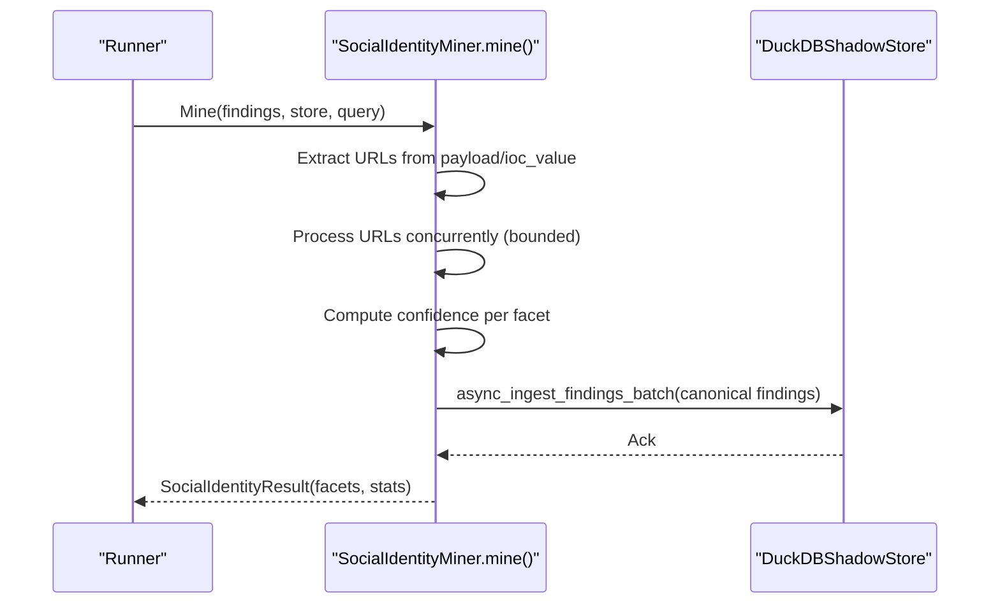
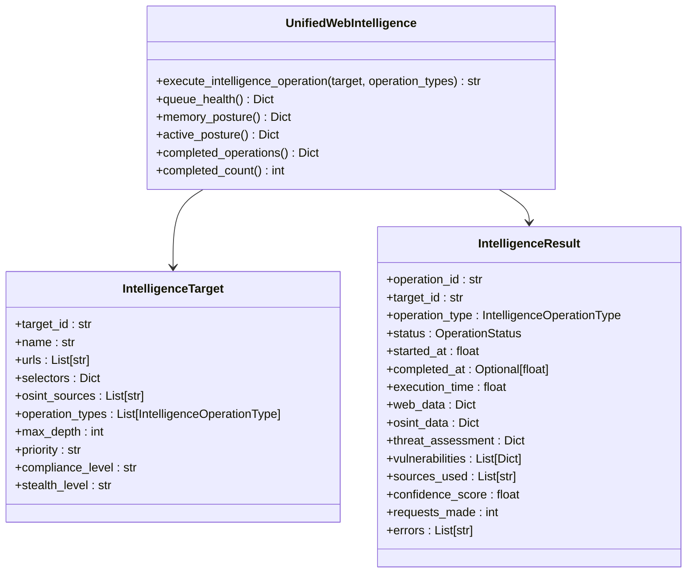
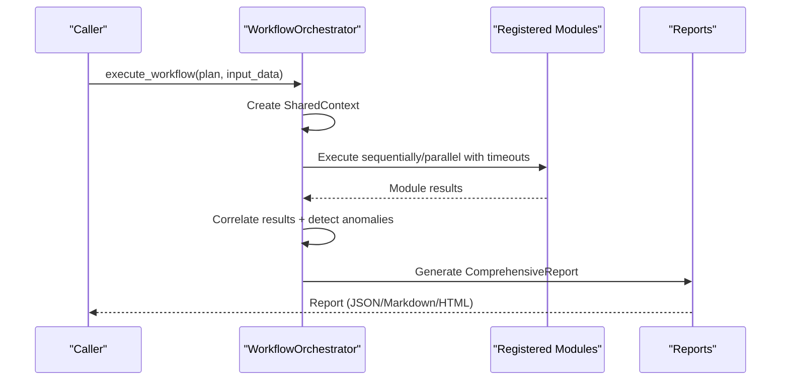
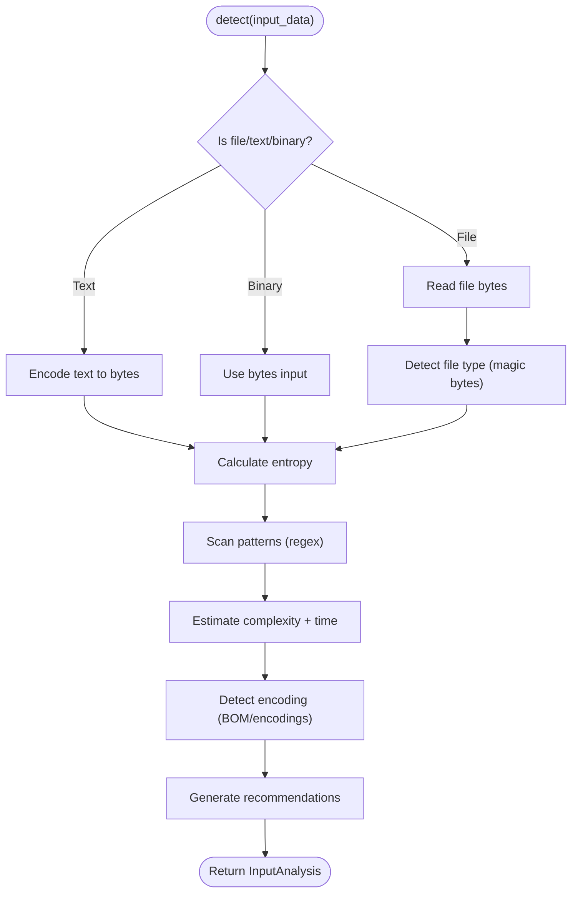
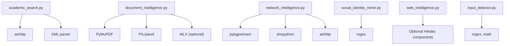

# Intelligence Modules

<cite>
**Referenced Files in This Document**
- [intelligence/__init__.py](file://intelligence/__init__.py)
- [intelligence/academic_search.py](file://intelligence/academic_search.py)
- [intelligence/academic_discovery.py](file://intelligence/academic_discovery.py)
- [intelligence/document_intelligence.py](file://intelligence/document_intelligence.py)
- [intelligence/network_intelligence.py](file://intelligence/network_intelligence.py)
- [intelligence/social_identity_miner.py](file://intelligence/social_identity_miner.py)
- [intelligence/web_intelligence.py](file://intelligence/web_intelligence.py)
- [intelligence/workflow_orchestrator.py](file://intelligence/workflow_orchestrator.py)
- [intelligence/input_detector.py](file://intelligence/input_detector.py)
- [intelligence/decision_engine.py](file://intelligence/decision_engine.py)
</cite>

## Table of Contents
1. [Introduction](#introduction)
2. [Project Structure](#project-structure)
3. [Core Components](#core-components)
4. [Architecture Overview](#architecture-overview)
5. [Detailed Component Analysis](#detailed-component-analysis)
6. [Dependency Analysis](#dependency-analysis)
7. [Performance Considerations](#performance-considerations)
8. [Troubleshooting Guide](#troubleshooting-guide)
9. [Conclusion](#conclusion)
10. [Appendices](#appendices)

## Introduction
This document explains the intelligence modules subsystem that powers academic, network, social identity, and document intelligence within the universal research framework. It covers implementation details, invocation relationships, interfaces, domain models, configuration options, parameters, return values, and usage patterns. The subsystem integrates optional dependencies, provides graceful fallbacks, and exposes a unified interface for downstream components.

## Project Structure
The intelligence subsystem is organized as a package of specialized modules under the intelligence namespace. A central initializer aggregates capabilities and exposes availability flags to indicate import success. Individual modules encapsulate distinct intelligence domains and are designed for lazy initialization and bounded resource usage.

**Diagram sources**
- [intelligence/__init__.py:1-686](file://intelligence/__init__.py#L1-686)

**Section sources**
- [intelligence/__init__.py:1-686](file://intelligence/__init__.py#L1-686)

## Core Components
This section summarizes the primary intelligence modules and their roles.

- Academic Search and Discovery
  - Multi-source academic search with query expansion, deduplication, and result ranking.
  - Convenience functions for arXiv, Crossref, and Semantic Scholar.
- Document Intelligence
  - PDF, Office, and image analysis with metadata extraction, embedded object detection, and suspicious content scanning.
  - Optional MLX acceleration and Aho-Corasick integration for keyword detection.
- Network Intelligence
  - BGP lookups via pybgpstream with fallback to ipinfo.io; DNS-over-HTTPS resolution via dnspython or direct HTTP.
- Social Identity Miner
  - Deterministic extraction of usernames, profile URLs, linked domains, and emails from findings with confidence scoring and deduplication.
- Web Intelligence Helper
  - Lightweight wrapper around optional Hledac components with bounded queues, lazy initialization, and graceful degradation.
- Workflow Orchestrator
  - Coordinates multiple modules, correlates results, detects anomalies, and produces comprehensive reports.
- Input Detector
  - File type detection via magic bytes, content classification, pattern scanning, encoding detection, and complexity estimation.
- Decision Engine (Deprecated shim)
  - Re-exports from brain.decision_engine; not intended for new development.

Key availability flags in the initializer indicate import success for each module (e.g., ACADEMIC_SEARCH_AVAILABLE, DOCUMENT_INTELLIGENCE_AVAILABLE, NETWORK_INTELLIGENCE_AVAILABLE, SOCIAL_IDENTITY_MINER_AVAILABLE, WEB_INTEL_AVAILABLE, WORKFLOW_ORCHESTRATOR_AVAILABLE, INPUT_DETECTOR_AVAILABLE).

**Section sources**
- [intelligence/__init__.py:25-422](file://intelligence/__init__.py#L25-422)
- [intelligence/academic_search.py:1-1369](file://intelligence/academic_search.py#L1-1369)
- [intelligence/academic_discovery.py:1-301](file://intelligence/academic_discovery.py#L1-301)
- [intelligence/document_intelligence.py:1-2125](file://intelligence/document_intelligence.py#L1-2125)
- [intelligence/network_intelligence.py:1-365](file://intelligence/network_intelligence.py#L1-365)
- [intelligence/social_identity_miner.py:1-577](file://intelligence/social_identity_miner.py#L1-577)
- [intelligence/web_intelligence.py:1-1075](file://intelligence/web_intelligence.py#L1-1075)
- [intelligence/workflow_orchestrator.py:1-1849](file://intelligence/workflow_orchestrator.py#L1-1849)
- [intelligence/input_detector.py:1-954](file://intelligence/input_detector.py#L1-954)
- [intelligence/decision_engine.py:1-4](file://intelligence/decision_engine.py#L1-4)

## Architecture Overview
The intelligence subsystem is designed for modular composition and bounded resource usage. Optional dependencies are lazily imported and guarded to prevent blocking imports. The initializer consolidates exports and availability flags. Downstream consumers can selectively import modules and rely on graceful degradation when dependencies are missing.

**Diagram sources**
- [intelligence/__init__.py:25-422](file://intelligence/__init__.py#L25-422)

## Detailed Component Analysis

### Academic Search and Discovery
- Academic Search Engine
  - Multi-source adapters for ArXiv, Crossref, and Semantic Scholar with configurable timeouts, weights, and API keys.
  - Query expansion strategies and deduplication pipeline produce ranked results.
  - Data models include SourceConfig, SearchResult, SourceResult, AcademicSearchResult, QueryAnalysis, and SourcePerformance.
  - Methods: search(), execute_search(), get_paper_details(), get_work_by_doi(), get_citations().
  - Configuration keys: name, enabled, weight, timeout_seconds, max_results, api_key, base_url, rate_limit_per_minute.
  - Returns: structured results with metadata, relevance scores, and timestamps.
- Academic Discovery Convenience
  - Standalone async functions for arXiv, Crossref, and Semantic Scholar with rate-limiting semaphore.
  - Structured AcademicPaper output with title, authors, year, link, source, abstract, DOI, citations, tags.
  - search_academic_all() runs all sources concurrently with bounded concurrency.

**Diagram sources**
- [intelligence/academic_search.py:787-1369](file://intelligence/academic_search.py#L787-1369)

**Section sources**
- [intelligence/academic_search.py:1-1369](file://intelligence/academic_search.py#L1-1369)
- [intelligence/academic_discovery.py:1-301](file://intelligence/academic_discovery.py#L1-301)

### Document Intelligence
- PDF Analyzer
  - Progressive analysis: probe signal score and candidate pages; deep parse only when signal is high.
  - Extracts metadata, embedded objects, hyperlinks, emails, IP addresses, suspicious indicators.
  - Suspicious content detection integrates Aho-Corasick if available; otherwise falls back to substring scanning.
- Office Document Analyzer
  - ZIP-based OOXML (docx/xlsx/pptx) and legacy OLE formats; extracts core properties, comments, and media.
- Image Analyzer
  - EXIF extraction and GPS coordinate parsing via PIL; optional fallback when PIL is unavailable.
- Data Models
  - DocumentType, MetadataCategory, GeoLocation, EXIFData, DocumentMetadata, EmbeddedObject, DocumentAnalysis.

**Diagram sources**
- [intelligence/document_intelligence.py:259-599](file://intelligence/document_intelligence.py#L259-599)

**Section sources**
- [intelligence/document_intelligence.py:1-2125](file://intelligence/document_intelligence.py#L1-2125)

### Network Intelligence
- BGP Lookup
  - Primary: pybgpstream with capped record count and bounded memory footprint.
  - Fallback: ipinfo.io API with optional bearer token; returns ASN, AS name, country, announced flag.
- DNS-over-HTTPS Resolution
  - Primary: dnspython with Cloudflare and Google DoH endpoints.
  - Fallback: direct JSON-mode DoH via aiohttp; returns A, AAAA, MX, TXT records and provider used.
- Graph Integration
  - integrate_bgp_doh_to_graph() adds ASN and IP nodes with relationships to a knowledge graph.

**Diagram sources**
- [intelligence/network_intelligence.py:29-151](file://intelligence/network_intelligence.py#L29-151)

**Section sources**
- [intelligence/network_intelligence.py:1-365](file://intelligence/network_intelligence.py#L1-365)

### Social Identity Miner
- Surface-level extraction from accepted findings without invasive scraping.
- URL patterns for major platforms; username and profile URL construction; confidence scoring based on platform, domain/email linkage, and username quality.
- Bounded concurrency, RAM guard, and deduplication by profile URL.
- Canonical write path via DuckDBShadowStore.

**Diagram sources**
- [intelligence/social_identity_miner.py:187-577](file://intelligence/social_identity_miner.py#L187-577)

**Section sources**
- [intelligence/social_identity_miner.py:1-577](file://intelligence/social_identity_miner.py#L1-577)

### Web Intelligence Helper
- UnifiedWebIntelligence provides a bounded, lazy-initialized wrapper around optional Hledac components.
- Bounded queue with priority aging, memory pressure awareness, and task ownership tracking.
- Executes web scraping, OSINT collection, threat assessment, and vulnerability analysis with graceful degradation.

**Diagram sources**
- [intelligence/web_intelligence.py:115-800](file://intelligence/web_intelligence.py#L115-800)

**Section sources**
- [intelligence/web_intelligence.py:1-1075](file://intelligence/web_intelligence.py#L1-1075)

### Workflow Orchestrator
- Coordinates execution of analysis modules, correlates results, detects anomalies, and generates comprehensive reports.
- Configurable execution modes (sequential/parallel), timeouts, and risk thresholds.
- Data models: Finding, Anomaly, SharedContext, ComprehensiveReport, CorrelationReport, WorkflowPlan, IntelligenceConfig.

**Diagram sources**
- [intelligence/workflow_orchestrator.py:335-800](file://intelligence/workflow_orchestrator.py#L335-800)

**Section sources**
- [intelligence/workflow_orchestrator.py:1-1849](file://intelligence/workflow_orchestrator.py#L1-1849)

### Input Detector
- IntelligentInputDetector analyzes input data to determine type, content, patterns, and complexity.
- Magic-byte file type detection, content classification, pattern scanning (hashes, URLs, IPs, emails, etc.), encoding detection, and complexity estimation with time estimates.
- Data models: Pattern, ComplexityScore, InputAnalysis, IntelligenceConfig.

**Diagram sources**
- [intelligence/input_detector.py:190-954](file://intelligence/input_detector.py#L190-954)

**Section sources**
- [intelligence/input_detector.py:1-954](file://intelligence/input_detector.py#L1-954)

### Decision Engine (Deprecated)
- Re-exports from brain.decision_engine; not intended for new development. Availability flag indicates import success only.

**Section sources**
- [intelligence/decision_engine.py:1-4](file://intelligence/decision_engine.py#L1-4)

## Dependency Analysis
- Optional Dependencies and Graceful Degradation
  - Academic Search: aiohttp, XML parsing; adapters handle timeouts and errors.
  - Document Intelligence: PyMuPDF (PDF), PIL/piexif (images), MLX (optional), Aho-Corasick (optional).
  - Network Intelligence: pybgpstream (preferred), dnspython (preferred), ipinfo.io API (fallback), direct DoH via aiohttp.
  - Social Identity Miner: regex patterns, optional UMA memory guard.
  - Web Intelligence Helper: optional Hledac components; degraded mode when unavailable.
  - Workflow Orchestrator: generic dataclasses and asyncio.
  - Input Detector: regex patterns, math for entropy, optional encoding detection.
- Coupling and Cohesion
  - Modules are loosely coupled via explicit imports and availability flags.
  - Data models are self-contained and serializable.
- External Integration Points
  - Academic sources (ArXiv, Crossref, Semantic Scholar).
  - Network services (pybgpstream, ipinfo.io, Cloudflare/Google DoH).
  - Knowledge graph integration for BGP/DoH results.

**Diagram sources**
- [intelligence/academic_search.py:35-48](file://intelligence/academic_search.py#L35-48)
- [intelligence/document_intelligence.py:45-94](file://intelligence/document_intelligence.py#L45-94)
- [intelligence/network_intelligence.py:55-179](file://intelligence/network_intelligence.py#L55-179)
- [intelligence/social_identity_miner.py:23-33](file://intelligence/social_identity_miner.py#L23-33)
- [intelligence/web_intelligence.py:35-47](file://intelligence/web_intelligence.py#L35-47)
- [intelligence/input_detector.py:23-31](file://intelligence/input_detector.py#L23-31)

**Section sources**
- [intelligence/__init__.py:25-422](file://intelligence/__init__.py#L25-422)

## Performance Considerations
- Bounded Concurrency and Queues
  - Academic Discovery uses a semaphore to cap concurrent requests (~100 per minute).
  - Web Intelligence Helper enforces bounded queue sizes, priority aging, and memory limits.
- Lazy Initialization
  - Web Intelligence and Social Identity Miner initialize optional components on first use.
- Memory Management
  - Document Intelligence uses progressive analysis and optional image size caps.
  - Network Intelligence enforces a bounded RAM limit for BGP data.
- Optional Acceleration
  - Document Intelligence supports MLX and MPS availability checks; graceful fallback when absent.
- Timeouts and Degradation
  - Workflow Orchestrator applies per-module timeouts; modules return structured error payloads.

[No sources needed since this section provides general guidance]

## Troubleshooting Guide
- Academic Search
  - Symptom: Empty results or timeouts.
  - Actions: Verify API keys, reduce max_results, confirm network connectivity, check rate limits.
  - References: [intelligence/academic_search.py:231-273](file://intelligence/academic_search.py#L231-273)
- Document Intelligence
  - Symptom: PDF analysis fails or returns minimal metadata.
  - Actions: Install PyMuPDF; verify file integrity; check suspicious keyword extractor availability.
  - References: [intelligence/document_intelligence.py:278-351](file://intelligence/document_intelligence.py#L278-351)
- Network Intelligence
  - Symptom: BGP lookup fails or slow.
  - Actions: Ensure pybgpstream is installed; if unavailable, configure IPINFO_API_KEY; verify resolver availability.
  - References: [intelligence/network_intelligence.py:29-151](file://intelligence/network_intelligence.py#L29-151)
- Social Identity Miner
  - Symptom: No facets extracted.
  - Actions: Confirm findings payload contains URLs; check RAM guard conditions; adjust confidence thresholds.
  - References: [intelligence/social_identity_miner.py:187-299](file://intelligence/social_identity_miner.py#L187-299)
- Web Intelligence Helper
  - Symptom: Operations rejected due to queue/memory limits.
  - Actions: Reduce max_concurrent_operations, monitor memory_posture(), or wait for aging.
  - References: [intelligence/web_intelligence.py:344-427](file://intelligence/web_intelligence.py#L344-427)
- Workflow Orchestrator
  - Symptom: Module timeouts or failures.
  - Actions: Increase module_timeout; review module status and error messages in results.
  - References: [intelligence/workflow_orchestrator.py:385-466](file://intelligence/workflow_orchestrator.py#L385-466)
- Input Detector
  - Symptom: Incorrect file type or encoding detection.
  - Actions: Validate magic bytes; ensure content is readable; adjust min_pattern_length.
  - References: [intelligence/input_detector.py:429-544](file://intelligence/input_detector.py#L429-544)

**Section sources**
- [intelligence/academic_search.py:231-273](file://intelligence/academic_search.py#L231-273)
- [intelligence/document_intelligence.py:278-351](file://intelligence/document_intelligence.py#L278-351)
- [intelligence/network_intelligence.py:29-151](file://intelligence/network_intelligence.py#L29-151)
- [intelligence/social_identity_miner.py:187-299](file://intelligence/social_identity_miner.py#L187-299)
- [intelligence/web_intelligence.py:344-427](file://intelligence/web_intelligence.py#L344-427)
- [intelligence/workflow_orchestrator.py:385-466](file://intelligence/workflow_orchestrator.py#L385-466)
- [intelligence/input_detector.py:429-544](file://intelligence/input_detector.py#L429-544)

## Conclusion
The intelligence modules subsystem offers a robust, modular, and resilient foundation for academic, network, social identity, and document intelligence. Its design emphasizes lazy initialization, graceful degradation, bounded resources, and clear interfaces. By leveraging availability flags and structured data models, downstream components can compose workflows that adapt to environment constraints while maintaining high fidelity to the underlying intelligence tasks.

[No sources needed since this section summarizes without analyzing specific files]

## Appendices

### Configuration Options and Parameters
- Academic Search Engine
  - Parameters: enable_expansion, enable_deduplication.
  - SourceConfig fields: name, enabled, weight, timeout_seconds, max_results, api_key, base_url, rate_limit_per_minute.
  - References: [intelligence/academic_search.py:795-800](file://intelligence/academic_search.py#L795-800), [intelligence/academic_search.py:79-94](file://intelligence/academic_search.py#L79-94)
- Document Intelligence
  - Availability flags: PYMUPDF_AVAILABLE, PIL_AVAILABLE, MLX_AVAILABLE, MPS_AVAILABLE.
  - Suspicious keywords scanning via Aho-Corasick with lazy import.
  - References: [intelligence/document_intelligence.py:45-113](file://intelligence/document_intelligence.py#L45-113)
- Network Intelligence
  - MAX_BGP_DATA_MB: 300 MB.
  - DoH endpoints: Cloudflare and Google.
  - References: [intelligence/network_intelligence.py:22-27](file://intelligence/network_intelligence.py#L22-27)
- Social Identity Miner
  - Bounds: MAX_SOCIAL_PROFILES, MAX_LINKS_PER_PROFILE, MAX_SOCIAL_TEXT_BYTES, SOCIAL_MIN_CONFIDENCE.
  - References: [intelligence/social_identity_miner.py:36-40](file://intelligence/social_identity_miner.py#L36-40)
- Web Intelligence Helper
  - Config keys: max_concurrent_operations, enable_flashattention, enable_osint, enable_stealth.
  - Queue bounds: _MAX_QUEUE, _MAX_QUEUED_OPS.
  - References: [intelligence/web_intelligence.py:131-199](file://intelligence/web_intelligence.py#L131-199)
- Workflow Orchestrator
  - IntelligenceConfig fields: module_timeout, max_parallel_modules, enable_correlation, enable_anomaly_detection, risk_thresholds.
  - References: [intelligence/workflow_orchestrator.py:315-333](file://intelligence/workflow_orchestrator.py#L315-333)
- Input Detector
  - IntelligenceConfig fields: max_file_size, chunk_size, min_pattern_length, entropy_threshold_low, entropy_threshold_high, enable_pattern_scanning, enable_encoding_detection, enable_complexity_analysis.
  - References: [intelligence/input_detector.py:162-183](file://intelligence/input_detector.py#L162-183)

### Return Values and Interfaces
- Academic Search
  - search(): AcademicSearchResult with lists of results and metadata.
  - Convenience functions: List[Dict] with keys title, authors, year, link, source, abstract, DOI, citations, tags.
  - References: [intelligence/academic_search.py:133-159](file://intelligence/academic_search.py#L133-159), [intelligence/academic_discovery.py:77-122](file://intelligence/academic_discovery.py#L77-122)
- Document Intelligence
  - analyze(): DocumentAnalysis with metadata, embedded objects, hyperlinks, emails, IPs, suspicious indicators.
  - References: [intelligence/document_intelligence.py:278-351](file://intelligence/document_intelligence.py#L278-351)
- Network Intelligence
  - get_bgp_info(): Dict with prefix, asn, as_name, country, announced, found, error.
  - resolve_dns_doh(): Dict with a, aaaa, mx, txt, found, errors, source/provider.
  - References: [intelligence/network_intelligence.py:29-247](file://intelligence/network_intelligence.py#L29-247)
- Social Identity Miner
  - mine(): SocialIdentityResult with facets, scanned_count, skipped_count, elapsed_ms.
  - References: [intelligence/social_identity_miner.py:187-299](file://intelligence/social_identity_miner.py#L187-299)
- Web Intelligence Helper
  - execute_intelligence_operation(): operation_id; results stored in completed_operations.
  - References: [intelligence/web_intelligence.py:344-427](file://intelligence/web_intelligence.py#L344-427)
- Workflow Orchestrator
  - execute_workflow(): ComprehensiveReport with module_results, correlations, anomalies, verdict, confidence, recommendations.
  - References: [intelligence/workflow_orchestrator.py:385-466](file://intelligence/workflow_orchestrator.py#L385-466)
- Input Detector
  - detect(): InputAnalysis with input_type, file_type, content_type, patterns, complexity, recommendations, encoding, size_bytes, entropy.
  - References: [intelligence/input_detector.py:241-272](file://intelligence/input_detector.py#L241-272)