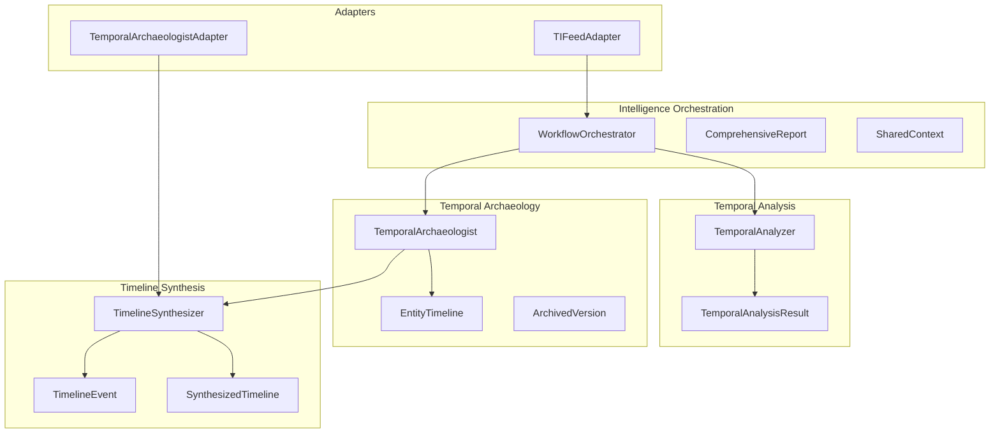
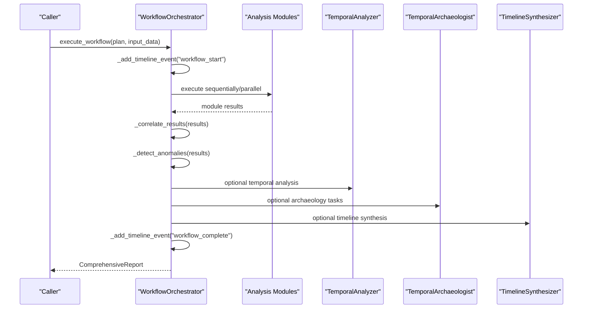
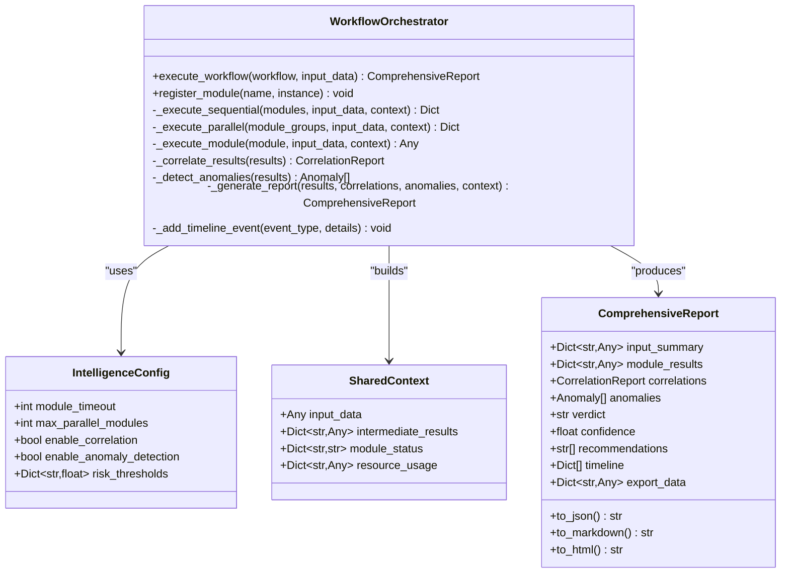
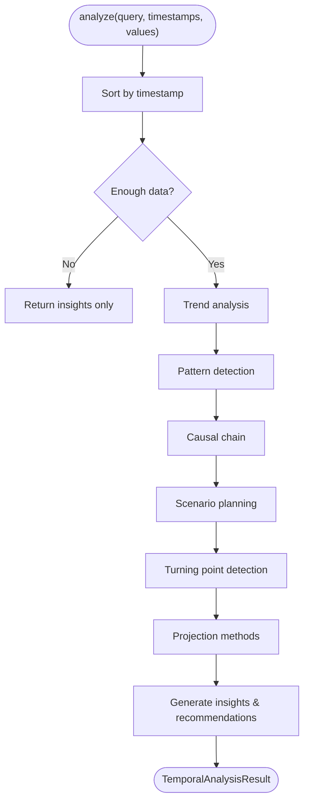
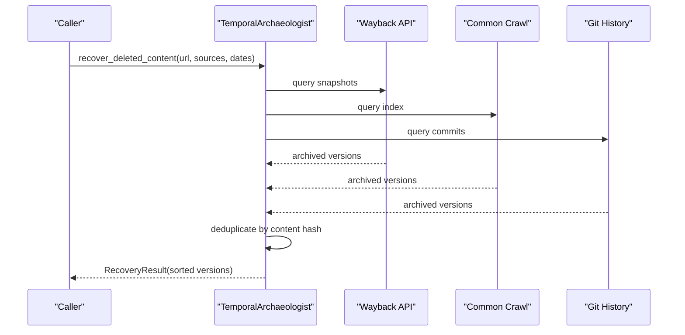
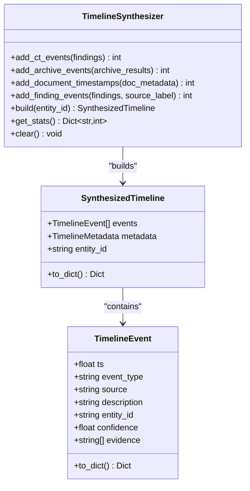
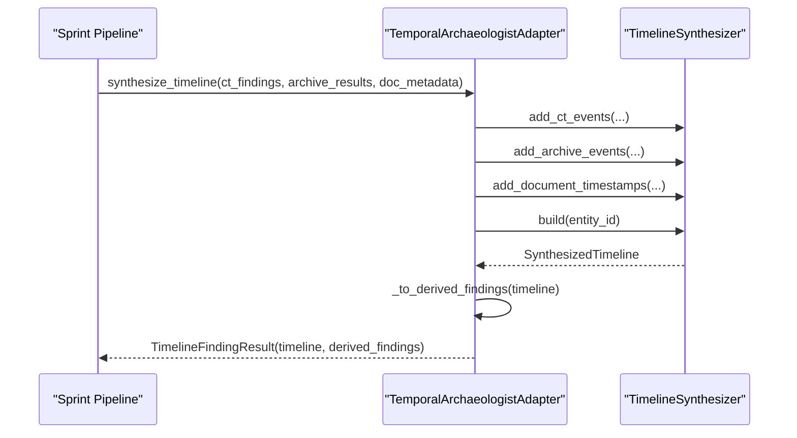
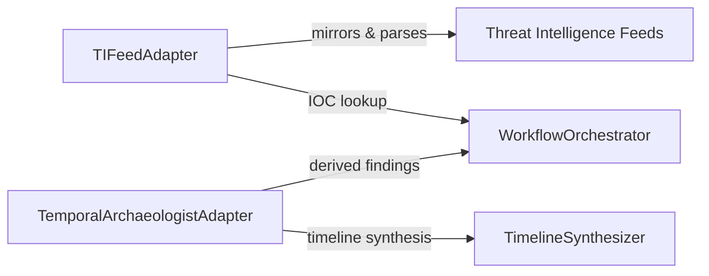
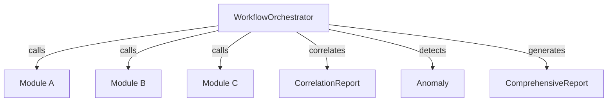

# Intelligence Workflow Orchestration

<cite>
**Referenced Files in This Document**
- [workflow_orchestrator.py](file://intelligence/workflow_orchestrator.py)
- [temporal_analysis.py](file://intelligence/temporal_analysis.py)
- [temporal_archaeologist.py](file://intelligence/temporal_archaeologist.py)
- [timeline_synthesizer.py](file://intelligence/timeline_synthesizer.py)
- [temporal_archaeologist_adapter.py](file://intelligence/temporal_archaeologist_adapter.py)
- [ti_feed_adapter.py](file://intelligence/ti_feed_adapter.py)
- [__init__.py](file://intelligence/__init__.py)
</cite>

## Table of Contents
1. [Introduction](#introduction)
2. [Project Structure](#project-structure)
3. [Core Components](#core-components)
4. [Architecture Overview](#architecture-overview)
5. [Detailed Component Analysis](#detailed-component-analysis)
6. [Dependency Analysis](#dependency-analysis)
7. [Performance Considerations](#performance-considerations)
8. [Troubleshooting Guide](#troubleshooting-guide)
9. [Conclusion](#conclusion)

## Introduction
This document explains the intelligence workflow orchestration and temporal analysis capabilities of the system. It focuses on how the workflow orchestrator coordinates multiple intelligence modules, manages execution dependencies, optimizes resource utilization, and integrates temporal analysis and archaeology features. It also covers timeline synthesis, historical data correlation, and the adapter patterns for integrating external temporal data sources.

## Project Structure
The intelligence subsystem is organized around modular capabilities:
- Workflow orchestration: central coordination of multiple analysis modules
- Temporal analysis: time-series trend, pattern, and projection analysis
- Temporal archaeology: historical content recovery and timeline reconstruction
- Timeline synthesis: canonical event timeline builder from multiple sources
- Adapter patterns: integration of external temporal data sources and mirroring

**Diagram sources**
- [workflow_orchestrator.py:335-466](file://intelligence/workflow_orchestrator.py#L335-L466)
- [temporal_analysis.py:127-234](file://intelligence/temporal_analysis.py#L127-L234)
- [temporal_archaeologist.py:246-518](file://intelligence/temporal_archaeologist.py#L246-L518)
- [timeline_synthesizer.py:112-148](file://intelligence/timeline_synthesizer.py#L112-L148)
- [temporal_archaeologist_adapter.py:86-183](file://intelligence/temporal_archaeologist_adapter.py#L86-L183)
- [ti_feed_adapter.py:601-768](file://intelligence/ti_feed_adapter.py#L601-L768)

**Section sources**
- [__init__.py:402-423](file://intelligence/__init__.py#L402-L423)

## Core Components
- WorkflowOrchestrator: executes module plans sequentially or in parallel groups, tracks execution timeline, correlates results, detects anomalies, and generates comprehensive reports.
- TemporalAnalyzer: performs trend analysis, pattern detection, causal chain analysis, scenario planning, turning point detection, and projections.
- TemporalArchaeologist: recovers deleted content, reconstructs version histories, detects anomalies, correlates entities across time, and supports deep historical search.
- TimelineSynthesizer: aggregates events from CT logs, archives, documents, and findings into a bounded, chronological timeline.
- TemporalArchaeologistAdapter: wraps the synthesizer to produce derived findings and maintain M1 memory constraints.
- TIFeedAdapter: mirrors and parses external threat intelligence feeds with a mirrors-first strategy.

**Section sources**
- [workflow_orchestrator.py:335-466](file://intelligence/workflow_orchestrator.py#L335-L466)
- [temporal_analysis.py:127-234](file://intelligence/temporal_analysis.py#L127-L234)
- [temporal_archaeologist.py:246-518](file://intelligence/temporal_archaeologist.py#L246-L518)
- [timeline_synthesizer.py:112-148](file://intelligence/timeline_synthesizer.py#L112-L148)
- [temporal_archaeologist_adapter.py:86-183](file://intelligence/temporal_archaeologist_adapter.py#L86-L183)
- [ti_feed_adapter.py:601-768](file://intelligence/ti_feed_adapter.py#L601-L768)

## Architecture Overview
The orchestration system coordinates heterogeneous intelligence modules while maintaining resource-aware execution and robust reporting. Temporal capabilities are integrated to enrich workflows with historical context and timeline synthesis.

**Diagram sources**
- [workflow_orchestrator.py:385-466](file://intelligence/workflow_orchestrator.py#L385-L466)
- [temporal_analysis.py:152-234](file://intelligence/temporal_analysis.py#L152-L234)
- [temporal_archaeologist.py:438-518](file://intelligence/temporal_archaeologist.py#L438-L518)
- [timeline_synthesizer.py:356-417](file://intelligence/timeline_synthesizer.py#L356-L417)

## Detailed Component Analysis

### WorkflowOrchestrator
The orchestrator coordinates execution, manages dependencies, and builds comprehensive reports. It supports:
- Sequential and parallel execution modes with configurable timeouts
- Execution timeline recording for observability
- Cross-module correlation and anomaly detection
- Resource usage tracking per module

Key behaviors:
- Execution modes: sequential vs. parallel groups with per-module timeouts
- Module discovery: registry-first, then via orchestrator attribute access
- Correlation engine: applies high-risk pattern matching and multi-indicator scoring
- Anomaly detection: module failures, inconsistent results, confidence checks
- Reporting: JSON, Markdown, and HTML export formats

**Diagram sources**
- [workflow_orchestrator.py:335-466](file://intelligence/workflow_orchestrator.py#L335-L466)
- [workflow_orchestrator.py:314-334](file://intelligence/workflow_orchestrator.py#L314-L334)
- [workflow_orchestrator.py:72-112](file://intelligence/workflow_orchestrator.py#L72-L112)

**Section sources**
- [workflow_orchestrator.py:356-466](file://intelligence/workflow_orchestrator.py#L356-L466)

### Temporal Analysis Engine
Performs comprehensive time-series analysis:
- Trend analysis: direction, strength, slope, confidence
- Pattern detection: seasonal, cyclical, step-change
- Causal chain identification: significant value changes
- Scenario planning: continuation, reversal, acceleration, stabilization
- Turning point detection: slope change analysis
- Projections: linear, ARIMA approximation, exponential smoothing, Monte Carlo, Bayesian, ensemble

**Diagram sources**
- [temporal_analysis.py:152-234](file://intelligence/temporal_analysis.py#L152-L234)
- [temporal_analysis.py:235-284](file://intelligence/temporal_analysis.py#L235-L284)
- [temporal_analysis.py:286-346](file://intelligence/temporal_analysis.py#L286-L346)
- [temporal_analysis.py:348-436](file://intelligence/temporal_analysis.py#L348-L436)
- [temporal_analysis.py:438-545](file://intelligence/temporal_analysis.py#L438-L545)

**Section sources**
- [temporal_analysis.py:127-234](file://intelligence/temporal_analysis.py#L127-L234)

### Temporal Archaeologist
Provides advanced historical content recovery and timeline reconstruction:
- Archive recovery: Wayback, Archive.today, Google/Bing caches, Common Crawl, Git history, social archives
- Version history reconstruction: snapshots, identity changes, temporal gaps
- Anomaly detection: disappearances, content wipes, activity gaps, sudden changes, frequency shifts
- Cross-temporal correlation: overlapping periods, shared attributes, temporal proximity
- Deep historical search: query-based across archives with time-range filtering

**Diagram sources**
- [temporal_archaeologist.py:332-437](file://intelligence/temporal_archaeologist.py#L332-L437)
- [temporal_archaeologist.py:758-807](file://intelligence/temporal_archaeologist.py#L758-L807)

**Section sources**
- [temporal_archaeologist.py:246-518](file://intelligence/temporal_archaeologist.py#L246-L518)

### Timeline Synthesizer
Aggregates events from multiple temporal sources into a canonical, bounded timeline:
- Sources: CT logs, archive snapshots, document metadata, finding timestamps
- Validation: timestamp bounds, age filtering, invalid timestamps skipped
- Bounding: maximum 200 events, 5-year span cap
- Output: sorted events with metadata and conversion to derived findings

**Diagram sources**
- [timeline_synthesizer.py:112-148](file://intelligence/timeline_synthesizer.py#L112-L148)
- [timeline_synthesizer.py:356-417](file://intelligence/timeline_synthesizer.py#L356-L417)
- [timeline_synthesizer.py:38-72](file://intelligence/timeline_synthesizer.py#L38-L72)

**Section sources**
- [timeline_synthesizer.py:112-148](file://intelligence/timeline_synthesizer.py#L112-L148)

### Temporal Archaeologist Adapter
Wraps the synthesizer to produce derived findings and integrate with the sprint pipeline:
- Multi-source aggregation: CT, archive, document, findings
- Bounded output: up to 200 timeline events, advisory confidence
- Derived findings: serialized timeline as CanonicalFinding
- Fail-soft: errors do not crash the sprint

**Diagram sources**
- [temporal_archaeologist_adapter.py:117-183](file://intelligence/temporal_archaeologist_adapter.py#L117-L183)
- [timeline_synthesizer.py:356-417](file://intelligence/timeline_synthesizer.py#L356-L417)

**Section sources**
- [temporal_archaeologist_adapter.py:86-183](file://intelligence/temporal_archaeologist_adapter.py#L86-L183)

### Adapter Pattern for External Temporal Data Sources
The system integrates external temporal data via adapters:
- TIFeedAdapter: mirrors-first strategy for threat intelligence feeds (CISA KEV, URLHaus, ThreatFox, Feodo, OpenPhish, NVD), with parsers and caching
- TemporalArchaeologistAdapter: bridges archaeology results into the timeline synthesis and derived findings

**Diagram sources**
- [ti_feed_adapter.py:601-768](file://intelligence/ti_feed_adapter.py#L601-L768)
- [temporal_archaeologist_adapter.py:117-183](file://intelligence/temporal_archaeologist_adapter.py#L117-L183)

**Section sources**
- [ti_feed_adapter.py:601-768](file://intelligence/ti_feed_adapter.py#L601-L768)

## Dependency Analysis
The intelligence modules are loosely coupled and accessed through the orchestrator. The orchestrator maintains:
- Module registry for direct instances
- Dynamic discovery via orchestrator attribute access
- Shared context propagation across modules
- Centralized correlation and anomaly detection

**Diagram sources**
- [workflow_orchestrator.py:385-466](file://intelligence/workflow_orchestrator.py#L385-L466)

**Section sources**
- [workflow_orchestrator.py:356-466](file://intelligence/workflow_orchestrator.py#L356-L466)

## Performance Considerations
- Concurrency control: parallel execution groups with per-module timeouts prevent resource exhaustion
- Memory efficiency: TemporalArchaeologist uses streaming and deduplication to reduce memory footprint
- Bounded timelines: TimelineSynthesizer caps events and spans to keep processing predictable
- Fail-soft adapters: TIFeedAdapter and TemporalArchaeologistAdapter avoid pipeline crashes on external failures
- Predictive modeling: TemporalAnalyzer employs multiple projection methods with confidence weighting

[No sources needed since this section provides general guidance]

## Troubleshooting Guide
Common issues and mitigations:
- Module timeouts: adjust module_timeout in IntelligenceConfig; review module performance
- Missing modules: ensure modules are registered or accessible via orchestrator attributes
- Insufficient temporal data: TemporalAnalyzer returns insights-only when data points are below threshold
- Archive failures: TemporalArchaeologist uses fail-open behavior; verify network and rate limits
- Timeline synthesis errors: TemporalArchaeologistAdapter catches exceptions and returns empty results

**Section sources**
- [workflow_orchestrator.py:601-609](file://intelligence/workflow_orchestrator.py#L601-L609)
- [temporal_analysis.py:179-182](file://intelligence/temporal_analysis.py#L179-L182)
- [temporal_archaeologist.py:389-404](file://intelligence/temporal_archaeologist.py#L389-L404)
- [temporal_archaeologist_adapter.py:176-182](file://intelligence/temporal_archaeologist_adapter.py#L176-L182)

## Conclusion
The intelligence workflow orchestration system provides a robust framework for coordinating heterogeneous analysis modules, correlating results, detecting anomalies, and generating comprehensive reports. Integrated temporal analysis and archaeology capabilities enrich workflows with historical context, while adapters ensure resilient integration with external data sources. The bounded, memory-conscious design and fail-soft strategies support reliable operation under diverse conditions.