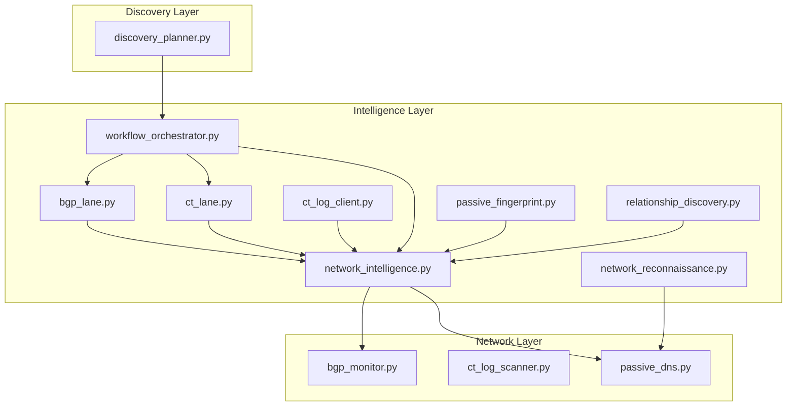
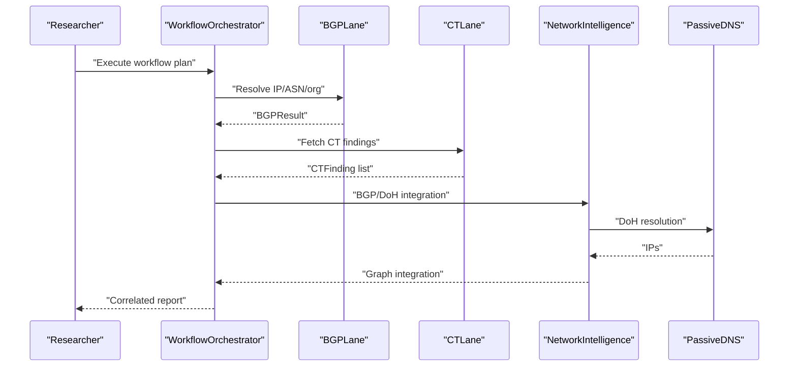
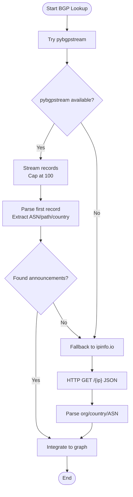
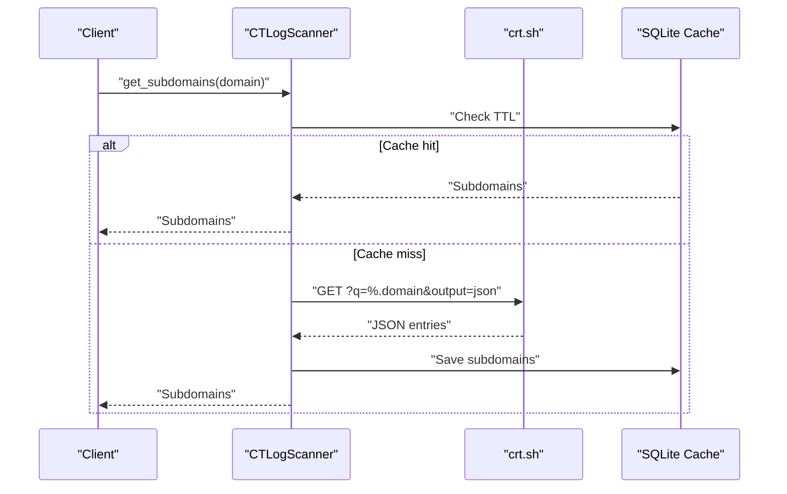
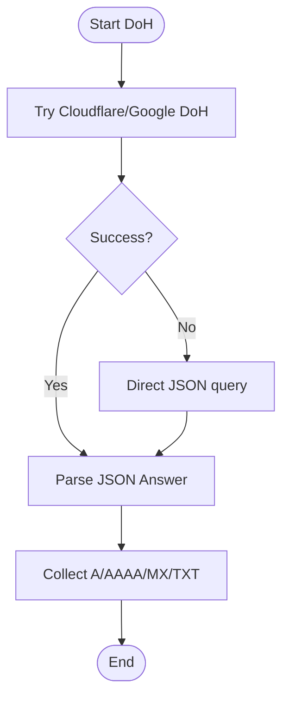
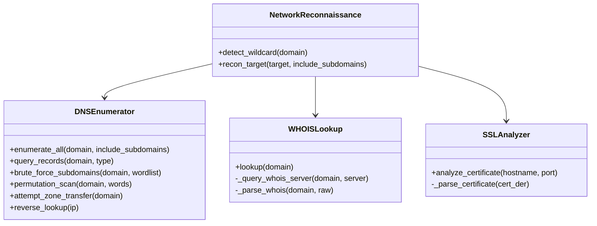
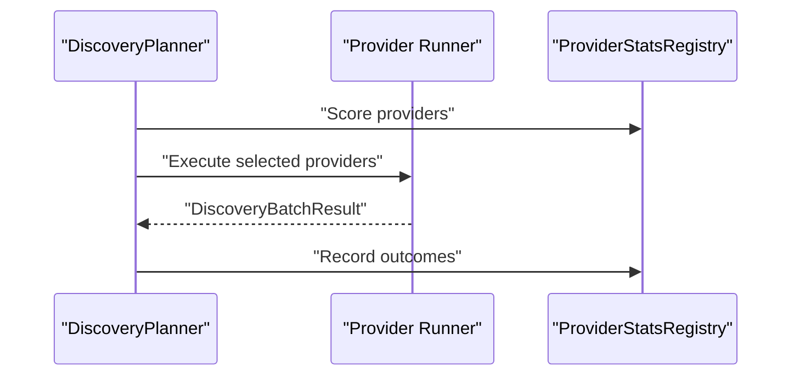
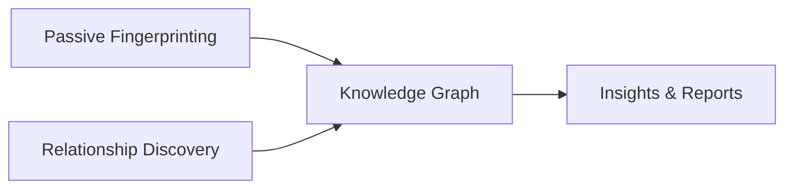
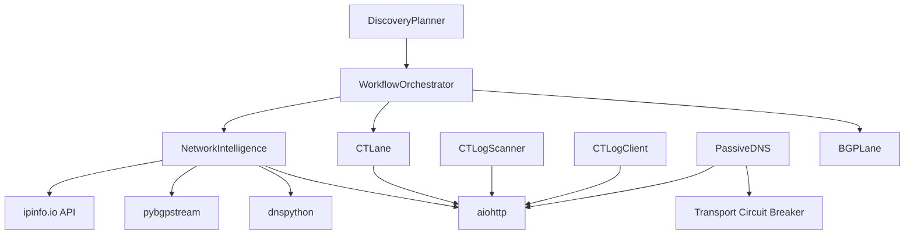

# Network Intelligence

<cite>
**Referenced Files in This Document**
- [network_intelligence.py](file://intelligence/network_intelligence.py)
- [network_reconnaissance.py](file://intelligence/network_reconnaissance.py)
- [bgp_monitor.py](file://network/bgp_monitor.py)
- [ct_log_scanner.py](file://network/ct_log_scanner.py)
- [passive_dns.py](file://security/passive_dns.py)
- [bgp_lane.py](file://intelligence/bgp_lane.py)
- [ct_lane.py](file://intelligence/ct_lane.py)
- [ct_log_client.py](file://intelligence/ct_log_client.py)
- [workflow_orchestrator.py](file://intelligence/workflow_orchestrator.py)
- [discovery_planner.py](file://discovery/discovery_planner.py)
- [passive_fingerprint.py](file://intelligence/passive_fingerprint.py)
- [relationship_discovery.py](file://intelligence/relationship_discovery.py)
</cite>

## Table of Contents
1. [Introduction](#introduction)
2. [Project Structure](#project-structure)
3. [Core Components](#core-components)
4. [Architecture Overview](#architecture-overview)
5. [Detailed Component Analysis](#detailed-component-analysis)
6. [Dependency Analysis](#dependency-analysis)
7. [Performance Considerations](#performance-considerations)
8. [Troubleshooting Guide](#troubleshooting-guide)
9. [Conclusion](#conclusion)

## Introduction
This document describes the Network Intelligence module, which provides comprehensive network reconnaissance and passive intelligence capabilities. It covers BGP monitoring, Certificate Transparency (CT) log scanning, and passive DNS analysis, and integrates these capabilities with broader discovery and workflow orchestration systems. The module emphasizes privacy-preserving, asynchronous, and bounded-memory operations suitable for self-contained, offline-first research on constrained hardware.

## Project Structure
The Network Intelligence module spans several packages:
- Intelligence lanes and engines: BGP and CT lanes, passive fingerprinting, workflow orchestration
- Network monitoring and scanning: BGP event streaming, CT log scanning, passive DNS resolution
- Discovery integration: budget-aware provider selection and expansion
- Relationship discovery: entity and relationship graph analysis

**Diagram sources**
- [network_intelligence.py](file://intelligence/network_intelligence.py)
- [network_reconnaissance.py](file://intelligence/network_reconnaissance.py)
- [bgp_monitor.py](file://network/bgp_monitor.py)
- [ct_log_scanner.py](file://network/ct_log_scanner.py)
- [passive_dns.py](file://security/passive_dns.py)
- [bgp_lane.py](file://intelligence/bgp_lane.py)
- [ct_lane.py](file://intelligence/ct_lane.py)
- [ct_log_client.py](file://intelligence/ct_log_client.py)
- [workflow_orchestrator.py](file://intelligence/workflow_orchestrator.py)
- [discovery_planner.py](file://discovery/discovery_planner.py)
- [passive_fingerprint.py](file://intelligence/passive_fingerprint.py)
- [relationship_discovery.py](file://intelligence/relationship_discovery.py)

**Section sources**
- [network_intelligence.py](file://intelligence/network_intelligence.py)
- [network_reconnaissance.py](file://intelligence/network_reconnaissance.py)
- [bgp_monitor.py](file://network/bgp_monitor.py)
- [ct_log_scanner.py](file://network/ct_log_scanner.py)
- [passive_dns.py](file://security/passive_dns.py)
- [bgp_lane.py](file://intelligence/bgp_lane.py)
- [ct_lane.py](file://intelligence/ct_lane.py)
- [ct_log_client.py](file://intelligence/ct_log_client.py)
- [workflow_orchestrator.py](file://intelligence/workflow_orchestrator.py)
- [discovery_planner.py](file://discovery/discovery_planner.py)
- [passive_fingerprint.py](file://intelligence/passive_fingerprint.py)
- [relationship_discovery.py](file://intelligence/relationship_discovery.py)

## Core Components
- BGP Intelligence: Asynchronous BGP lookups via pybgpstream with fallback to ipinfo.io, and BGP event streaming with bounded memory.
- CT Intelligence: CT log scanning via crt.sh with caching and rate limiting; dual-mode client supporting both batch and streaming.
- Passive DNS: DoH resolution via Cloudflare/Google endpoints and CIRCL PDNS lookup with graceful degradation and rate limiting.
- Network Reconnaissance: Comprehensive passive DNS enumeration, WHOIS lookup, SSL/TLS certificate analysis, wildcard detection, and private network filtering.
- Workflow Orchestration: Cross-module correlation, anomaly detection, and reporting with configurable timeouts and parallel execution.
- Discovery Integration: Budget-aware provider selection and expansion across multiple sources including CT pivots.
- Passive Fingerprinting: Deterministic extraction of service fingerprints from existing findings without active scanning.
- Relationship Discovery: Entity and relationship graph analysis with centrality, community detection, and GNN-based prediction.

**Section sources**
- [network_intelligence.py](file://intelligence/network_intelligence.py)
- [bgp_monitor.py](file://network/bgp_monitor.py)
- [ct_log_scanner.py](file://network/ct_log_scanner.py)
- [passive_dns.py](file://security/passive_dns.py)
- [network_reconnaissance.py](file://intelligence/network_reconnaissance.py)
- [bgp_lane.py](file://intelligence/bgp_lane.py)
- [ct_lane.py](file://intelligence/ct_lane.py)
- [ct_log_client.py](file://intelligence/ct_log_client.py)
- [workflow_orchestrator.py](file://intelligence/workflow_orchestrator.py)
- [discovery_planner.py](file://discovery/discovery_planner.py)
- [passive_fingerprint.py](file://intelligence/passive_fingerprint.py)
- [relationship_discovery.py](file://intelligence/relationship_discovery.py)

## Architecture Overview
The Network Intelligence architecture combines asynchronous, bounded-memory operations with modular lanes and orchestrators. Data sources include public APIs (crt.sh, bgpview.io, CIRCL PDNS) and local streaming (pybgpstream). Outputs are integrated into the knowledge graph and can be correlated across modules.

**Diagram sources**
- [workflow_orchestrator.py](file://intelligence/workflow_orchestrator.py)
- [bgp_lane.py](file://intelligence/bgp_lane.py)
- [ct_lane.py](file://intelligence/ct_lane.py)
- [network_intelligence.py](file://intelligence/network_intelligence.py)
- [passive_dns.py](file://security/passive_dns.py)

## Detailed Component Analysis

### BGP Intelligence
- Asynchronous BGP lookup using pybgpstream with capped record count and memory safety.
- Fallback to ipinfo.io API when pybgpstream is unavailable, with optional API key support.
- BGP event streaming with bounded memory buffer and graceful degradation when pybgpstream is unavailable.
- Integration with knowledge graph nodes for ASN and IP relationships.

**Diagram sources**
- [network_intelligence.py](file://intelligence/network_intelligence.py)

**Section sources**
- [network_intelligence.py](file://intelligence/network_intelligence.py)
- [bgp_monitor.py](file://network/bgp_monitor.py)

### Certificate Transparency (CT) Intelligence
- Batch and streaming CT log retrieval from crt.sh with rate limiting and deduplication.
- Local SQLite cache for subdomain results with TTL-based freshness.
- Dual-mode client supporting per-call sessions and shared session injection for connection pooling.
- Outcome normalization and canonical finding conversion for downstream ingestion.

**Diagram sources**
- [ct_log_scanner.py](file://network/ct_log_scanner.py)
- [ct_log_client.py](file://intelligence/ct_log_client.py)

**Section sources**
- [ct_lane.py](file://intelligence/ct_lane.py)
- [ct_log_scanner.py](file://network/ct_log_scanner.py)
- [ct_log_client.py](file://intelligence/ct_log_client.py)

### Passive DNS and DoH Resolution
- DoH resolution via Cloudflare and Google endpoints with JSON-mode fallback.
- CIRCL PDNS lookup with rate limiting and graceful degradation.
- Outcome normalization with transport policy telemetry and circuit breaker integration.

**Diagram sources**
- [passive_dns.py](file://security/passive_dns.py)

**Section sources**
- [passive_dns.py](file://security/passive_dns.py)

### Network Reconnaissance
- Comprehensive passive DNS enumeration including A/AAAA/MX/NS/TXT/SOA/CNAME with rate limiting and concurrency control.
- WHOIS lookup across multiple registries with robust parsing and privacy-aware redaction.
- SSL/TLS certificate analysis with optional pyOpenSSL fallback.
- Wildcard detection using high-entropy random subdomains with conservative timeouts and caching.
- Private network filtering to avoid scanning reserved/private ranges.

**Diagram sources**
- [network_reconnaissance.py](file://intelligence/network_reconnaissance.py)

**Section sources**
- [network_reconnaissance.py](file://intelligence/network_reconnaissance.py)

### Workflow Orchestration and Discovery Integration
- Cross-module correlation with risk scoring and anomaly detection.
- Configurable timeouts, parallel execution modes, and module status tracking.
- Discovery planner selects providers under budget constraints with reliability and novelty heuristics.

**Diagram sources**
- [workflow_orchestrator.py](file://intelligence/workflow_orchestrator.py)
- [discovery_planner.py](file://discovery/discovery_planner.py)

**Section sources**
- [workflow_orchestrator.py](file://intelligence/workflow_orchestrator.py)
- [discovery_planner.py](file://discovery/discovery_planner.py)

### Passive Fingerprinting and Relationship Discovery
- Deterministic passive fingerprinting from HTTP headers, TLS/cert data, CT metadata, and HTML content.
- Relationship discovery engine with graph construction, centrality metrics, community detection, and GNN-based prediction.

**Diagram sources**
- [passive_fingerprint.py](file://intelligence/passive_fingerprint.py)
- [relationship_discovery.py](file://intelligence/relationship_discovery.py)

**Section sources**
- [passive_fingerprint.py](file://intelligence/passive_fingerprint.py)
- [relationship_discovery.py](file://intelligence/relationship_discovery.py)

## Dependency Analysis
Key dependencies and integration points:
- Network Intelligence depends on async HTTP clients (aiohttp) and DNS libraries (dnspython).
- BGP operations depend on pybgpstream when available; otherwise fall back to public APIs.
- CT operations depend on crt.sh and local SQLite caching; supports shared sessions for pooling.
- Passive DNS integrates with transport circuit breakers and telemetry.
- Workflow orchestrator coordinates multiple lanes and discovery providers.

**Diagram sources**
- [network_intelligence.py](file://intelligence/network_intelligence.py)
- [ct_lane.py](file://intelligence/ct_lane.py)
- [ct_log_scanner.py](file://network/ct_log_scanner.py)
- [ct_log_client.py](file://intelligence/ct_log_client.py)
- [passive_dns.py](file://security/passive_dns.py)
- [bgp_lane.py](file://intelligence/bgp_lane.py)
- [workflow_orchestrator.py](file://intelligence/workflow_orchestrator.py)
- [discovery_planner.py](file://discovery/discovery_planner.py)

**Section sources**
- [network_intelligence.py](file://intelligence/network_intelligence.py)
- [ct_lane.py](file://intelligence/ct_lane.py)
- [ct_log_scanner.py](file://network/ct_log_scanner.py)
- [ct_log_client.py](file://intelligence/ct_log_client.py)
- [passive_dns.py](file://security/passive_dns.py)
- [bgp_lane.py](file://intelligence/bgp_lane.py)
- [workflow_orchestrator.py](file://intelligence/workflow_orchestrator.py)
- [discovery_planner.py](file://discovery/discovery_planner.py)

## Performance Considerations
- Asynchronous I/O and bounded memory: All major components use asyncio and enforce memory caps (e.g., BGP data capped at 300MB, event buffers bounded at 1000 items).
- Concurrency controls: Semaphores and gather with return_exceptions to prevent resource exhaustion.
- Rate limiting: CT and PDNS operations include deliberate delays and per-call timeouts to respect upstream limits.
- Graceful degradation: Components return empty results or fallback gracefully on failures, preventing pipeline stalls.
- Connection pooling: Shared aiohttp sessions reduce overhead and improve throughput.

[No sources needed since this section provides general guidance]

## Troubleshooting Guide
Common issues and mitigations:
- pybgpstream unavailable: The system falls back to ipinfo.io API; ensure IPINFO_API_KEY is configured if needed.
- DoH failures: Verify DNS endpoints and network connectivity; the system logs detailed errors and continues with fallbacks.
- CT rate limits: Requests are throttled; consider increasing cache TTL or reducing frequency.
- PDNS timeouts: CIRCL PDNS is rate-limited; the system sleeps between calls and returns empty results on failure.
- Wildcard detection timeouts: Conservative timeouts are used; adjust probe counts and timeouts if necessary.

**Section sources**
- [network_intelligence.py](file://intelligence/network_intelligence.py)
- [passive_dns.py](file://security/passive_dns.py)
- [ct_log_scanner.py](file://network/ct_log_scanner.py)
- [ct_log_client.py](file://intelligence/ct_log_client.py)
- [network_reconnaissance.py](file://intelligence/network_reconnaissance.py)

## Conclusion
The Network Intelligence module delivers robust, privacy-preserving, and performance-conscious network reconnaissance and passive intelligence capabilities. By combining BGP monitoring, CT log scanning, and passive DNS resolution with workflow orchestration and discovery integration, it enables comprehensive network footprint discovery, traffic pattern analysis, and infrastructure mapping suitable for constrained environments.