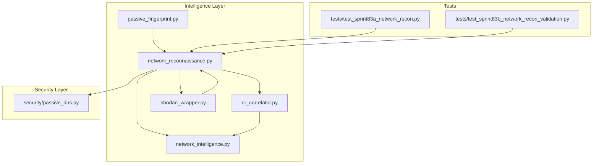
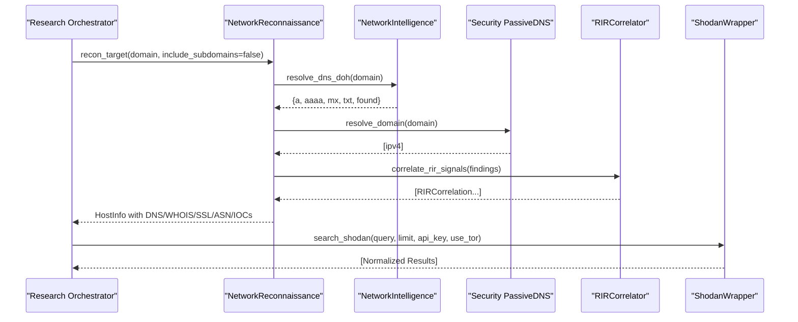
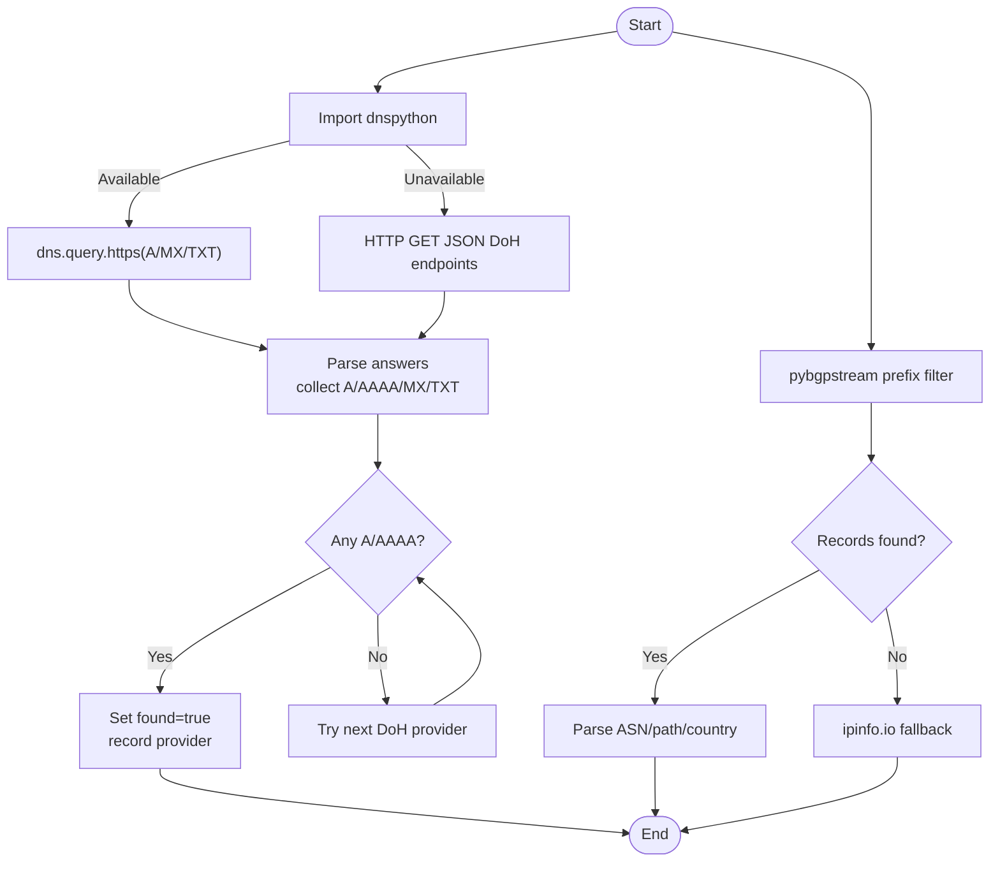
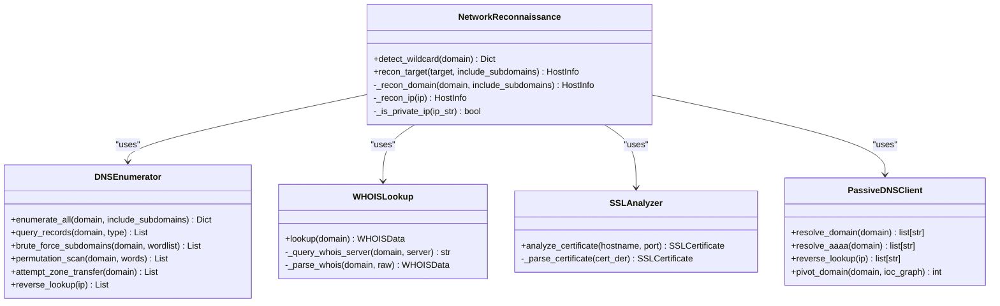
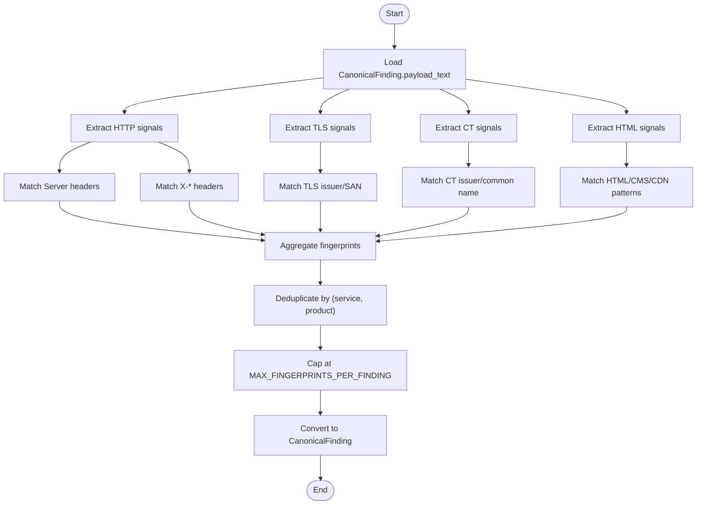
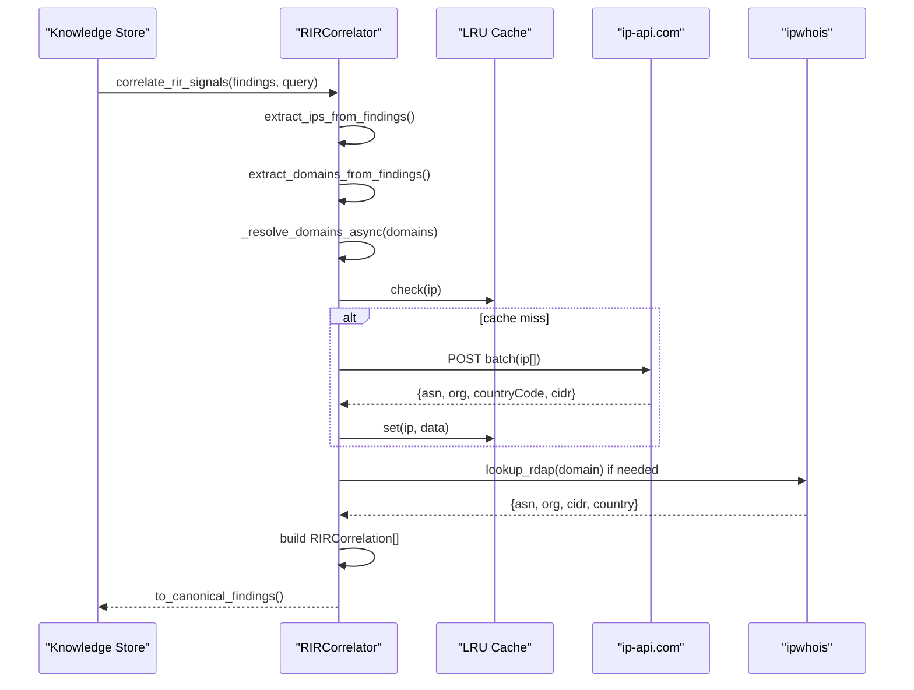
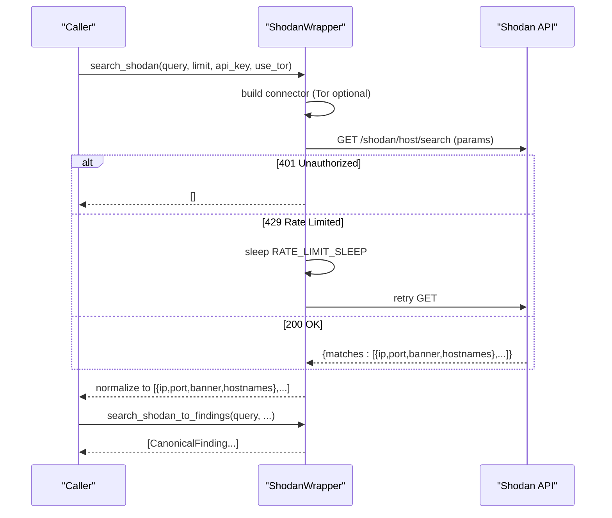
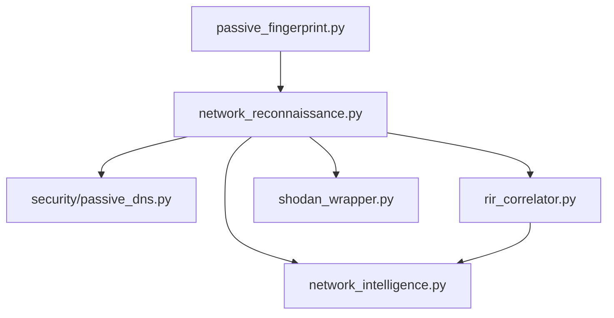

# Network Intelligence

<cite>
**Referenced Files in This Document**
- [network_intelligence.py](file://intelligence/network_intelligence.py)
- [network_reconnaissance.py](file://intelligence/network_reconnaissance.py)
- [passive_fingerprint.py](file://intelligence/passive_fingerprint.py)
- [rir_correlator.py](file://intelligence/rir_correlator.py)
- [shodan_wrapper.py](file://intelligence/shodan_wrapper.py)
- [passive_dns.py](file://security/passive_dns.py)
- [test_sprint83a_network_recon.py](file://tests/test_sprint83a_network_recon.py)
- [test_sprint83b_network_recon_validation.py](file://tests/test_sprint83b_network_recon_validation.py)
</cite>

## Table of Contents
1. [Introduction](#introduction)
2. [Project Structure](#project-structure)
3. [Core Components](#core-components)
4. [Architecture Overview](#architecture-overview)
5. [Detailed Component Analysis](#detailed-component-analysis)
6. [Dependency Analysis](#dependency-analysis)
7. [Performance Considerations](#performance-considerations)
8. [Troubleshooting Guide](#troubleshooting-guide)
9. [Privacy and Operational Security](#privacy-and-operational-security)
10. [Conclusion](#conclusion)

## Introduction
This document describes the network intelligence module, focusing on passive fingerprinting, RIR/ASN correlation, and network reconnaissance capabilities. It explains how the system integrates with external sources (Shodan, passive DNS providers), correlates IP addresses and network topology, and maintains privacy and operational security during reconnaissance. The module emphasizes asynchronous, bounded, and resilient operations suitable for self-contained OSINT research.

## Project Structure
The network intelligence module resides under the intelligence package and includes:
- Passive DNS and BGP/DoH resolution
- Network reconnaissance with DNS enumeration, WHOIS, SSL/TLS analysis, and passive DNS pivots
- Passive service fingerprinting from existing findings
- RIR/ASN correlation for attribution
- Shodan wrapper for passive host discovery
- Security-layer passive DNS utilities

**Diagram sources**
- [network_intelligence.py:1-365](file://intelligence/network_intelligence.py#L1-L365)
- [network_reconnaissance.py:1-1388](file://intelligence/network_reconnaissance.py#L1-L1388)
- [passive_fingerprint.py:1-977](file://intelligence/passive_fingerprint.py#L1-L977)
- [rir_correlator.py:1-614](file://intelligence/rir_correlator.py#L1-L614)
- [shodan_wrapper.py:1-220](file://intelligence/shodan_wrapper.py#L1-L220)
- [passive_dns.py:1-167](file://security/passive_dns.py#L1-L167)
- [test_sprint83a_network_recon.py:1-303](file://tests/test_sprint83a_network_recon.py#L1-L303)
- [test_sprint83b_network_recon_validation.py:1-255](file://tests/test_sprint83b_network_recon_validation.py#L1-L255)

**Section sources**
- [network_intelligence.py:1-365](file://intelligence/network_intelligence.py#L1-L365)
- [network_reconnaissance.py:1-1388](file://intelligence/network_reconnaissance.py#L1-L1388)
- [passive_fingerprint.py:1-977](file://intelligence/passive_fingerprint.py#L1-L977)
- [rir_correlator.py:1-614](file://intelligence/rir_correlator.py#L1-L614)
- [shodan_wrapper.py:1-220](file://intelligence/shodan_wrapper.py#L1-L220)
- [passive_dns.py:1-167](file://security/passive_dns.py#L1-L167)
- [test_sprint83a_network_recon.py:1-303](file://tests/test_sprint83a_network_recon.py#L1-L303)
- [test_sprint83b_network_recon_validation.py:1-255](file://tests/test_sprint83b_network_recon_validation.py#L1-L255)

## Core Components
- Passive DNS and BGP/DoH resolution: Asynchronous resolution via DNS-over-HTTPS and fallbacks, plus BGP prefix lookups with IP info API fallback.
- Network reconnaissance: DNS enumeration (A/AAAA/MX/NS/TXT/SOA/CNAME/PTR/SRV/CAA), WHOIS lookup, SSL/TLS certificate analysis, reverse DNS, wildcard detection, and passive pivots.
- Passive service fingerprinting: Deterministic pattern matching across HTTP headers, TLS/cert data, CT metadata, and HTML content to derive service fingerprints from existing findings.
- RIR/ASN correlation: Batch IP lookups via ip-api.com, optional domain WHOIS via ipwhois, caching, and conversion to canonical findings.
- Shodan wrapper: Controlled search with rate limiting, Tor support, and conversion to canonical findings.
- Security-layer passive DNS: DoH and CIRCL PDNS lookups with graceful degradation.

**Section sources**
- [network_intelligence.py:29-365](file://intelligence/network_intelligence.py#L29-L365)
- [network_reconnaissance.py:141-1388](file://intelligence/network_reconnaissance.py#L141-L1388)
- [passive_fingerprint.py:61-977](file://intelligence/passive_fingerprint.py#L61-L977)
- [rir_correlator.py:58-614](file://intelligence/rir_correlator.py#L58-L614)
- [shodan_wrapper.py:46-220](file://intelligence/shodan_wrapper.py#L46-L220)
- [passive_dns.py:34-167](file://security/passive_dns.py#L34-L167)

## Architecture Overview
The network intelligence architecture combines passive data sources with deterministic correlation and bounded execution. Key flows:
- Passive DNS and BGP/DoH resolution enrich targets with authoritative records and ASN information.
- Network reconnaissance aggregates DNS, WHOIS, and SSL/TLS data, with wildcard detection and passive pivots.
- Passive fingerprinting consumes existing findings to derive service fingerprints deterministically.
- RIR/ASN correlation enriches IOCs with ownership facets (ASN, org, netblock, country).
- Shodan wrapper enables controlled passive discovery with rate limiting and Tor routing.

**Diagram sources**
- [network_reconnaissance.py:797-911](file://intelligence/network_reconnaissance.py#L797-L911)
- [network_intelligence.py:153-247](file://intelligence/network_intelligence.py#L153-L247)
- [passive_dns.py:34-99](file://security/passive_dns.py#L34-L99)
- [rir_correlator.py:308-471](file://intelligence/rir_correlator.py#L308-L471)
- [shodan_wrapper.py:46-153](file://intelligence/shodan_wrapper.py#L46-L153)

## Detailed Component Analysis

### Passive DNS and BGP/DoH Resolution
- DoH resolution supports Cloudflare and Google endpoints with dnspython and direct JSON-mode fallbacks. Returns A/AAAA/MX/TXT records and tracks provider.
- BGP prefix lookup uses pybgpstream with capped record count and memory safety; falls back to ipinfo.io API when unavailable.
- Integration helpers add ASN and IP nodes to a knowledge graph with belongs_to relationships.

**Diagram sources**
- [network_intelligence.py:153-247](file://intelligence/network_intelligence.py#L153-L247)
- [network_intelligence.py:29-97](file://intelligence/network_intelligence.py#L29-L97)

**Section sources**
- [network_intelligence.py:29-365](file://intelligence/network_intelligence.py#L29-L365)

### Network Reconnaissance
- DNS enumeration covers A/AAAA/MX/NS/TXT/SOA/CNAME/PTR/SRV/CAA with parallel queries and optional zone transfer attempts.
- WHOIS lookup parses registrar, creation/expiry dates, name servers, DNSSEC, and contact info with robust parsing and privacy-aware redaction.
- SSL/TLS analyzer extracts subject/issuer, SANs, fingerprints, validity, and days to expiry.
- Wildcard detection uses high-entropy random subdomains with conservative timeouts and caching.
- Passive pivots include reverse DNS lookups and passive DNS client for domain→IP→PTR hostnames.

**Diagram sources**
- [network_reconnaissance.py:639-1388](file://intelligence/network_reconnaissance.py#L639-L1388)

**Section sources**
- [network_reconnaissance.py:141-1388](file://intelligence/network_reconnaissance.py#L141-L1388)

### Passive Service Fingerprinting
- Extracts HTTP headers, TLS/cert data, CT metadata, and HTML content from CanonicalFinding payload_text.
- Applies deterministic regex patterns to identify services (e.g., Apache, Nginx, IIS, Cloudflare, Akamai, WordPress, Django).
- Produces ServiceFingerprint with confidence, evidence IDs, and facets; converts to CanonicalFinding with source_type "passive_fingerprint".

**Diagram sources**
- [passive_fingerprint.py:676-977](file://intelligence/passive_fingerprint.py#L676-L977)

**Section sources**
- [passive_fingerprint.py:1-977](file://intelligence/passive_fingerprint.py#L1-L977)

### RIR/ASN Correlation
- Extracts IP and domain IOCs from findings, resolves domains to IPs, filters private/reserved networks, batches IP lookups via ip-api.com, and optionally performs domain WHOIS via ipwhois.
- Maintains bounded in-memory cache with FIFO eviction and returns CanonicalFinding with source_type "rir_correlation".

**Diagram sources**
- [rir_correlator.py:308-551](file://intelligence/rir_correlator.py#L308-L551)

**Section sources**
- [rir_correlator.py:1-614](file://intelligence/rir_correlator.py#L1-L614)

### Shodan Wrapper Integration
- Performs controlled searches with rate limiting (free tier ~10/hour), optional Tor routing via aiohttp-socks, and normalization of results to a consistent shape.
- Converts results to CanonicalFinding with source_type "shodan_search" and confidence derived from banner richness and port significance.

**Diagram sources**
- [shodan_wrapper.py:46-213](file://intelligence/shodan_wrapper.py#L46-L213)

**Section sources**
- [shodan_wrapper.py:1-220](file://intelligence/shodan_wrapper.py#L1-L220)

### Passive DNS Utilities
- DoH resolution via Cloudflare or Google endpoints with JSON-mode fallback and graceful degradation.
- CIRCL PDNS lookup (keyless) with rate limiting and deduplicated IP results.

**Section sources**
- [passive_dns.py:1-167](file://security/passive_dns.py#L1-L167)

## Dependency Analysis
The network intelligence module exhibits low coupling and high cohesion:
- NetworkReconnaissance depends on DNSEnumerator, WHOISLookup, SSLAnalyzer, and PassiveDNSClient.
- NetworkIntelligence provides BGP/DoH utilities consumed by NetworkReconnaissance and RIRCorrelator.
- PassiveFingerprint consumes findings from the broader research pipeline.
- ShodanWrapper is a standalone integration with bounded rate limiting.
- Security PassiveDNS complements the intelligence layer with DoH and PDNS lookups.

**Diagram sources**
- [network_reconnaissance.py:1-1388](file://intelligence/network_reconnaissance.py#L1-L1388)
- [network_intelligence.py:1-365](file://intelligence/network_intelligence.py#L1-L365)
- [passive_fingerprint.py:1-977](file://intelligence/passive_fingerprint.py#L1-L977)
- [rir_correlator.py:1-614](file://intelligence/rir_correlator.py#L1-L614)
- [shodan_wrapper.py:1-220](file://intelligence/shodan_wrapper.py#L1-L220)
- [passive_dns.py:1-167](file://security/passive_dns.py#L1-L167)

**Section sources**
- [network_reconnaissance.py:1-1388](file://intelligence/network_reconnaissance.py#L1-L1388)
- [network_intelligence.py:1-365](file://intelligence/network_intelligence.py#L1-L365)
- [passive_fingerprint.py:1-977](file://intelligence/passive_fingerprint.py#L1-L977)
- [rir_correlator.py:1-614](file://intelligence/rir_correlator.py#L1-L614)
- [shodan_wrapper.py:1-220](file://intelligence/shodan_wrapper.py#L1-L220)
- [passive_dns.py:1-167](file://security/passive_dns.py#L1-L167)

## Performance Considerations
- Asynchronous I/O: All network calls use asyncio/aiohttp to avoid blocking.
- Bounded concurrency and timeouts: DNS enumerations use semaphores and timeouts; wildcard detection caps probes and total time.
- Memory guards: BGP data capped at 300 MB; passive fingerprinting limits pattern bytes and fingerprints per finding; RIR correlator enforces maximum lookups/results and cache size.
- Graceful degradation: On failures or timeouts, functions return safe defaults rather than crashing the pipeline.
- Rate limiting: Shodan free tier and CIRCL PDNS rate limits are respected with sleeps.

[No sources needed since this section provides general guidance]

## Troubleshooting Guide
Common issues and mitigations:
- DNS failures: Partial success is expected; DNS queries may fail while WHOIS or SSL/TLS succeed. Validate results and handle empty lists gracefully.
- Wildcard detection timeouts: Conservative behavior returns not wildcard on overall timeout; tune timeouts or reduce probe count if needed.
- Shodan rate limits: Free tier throttling triggers automatic sleep; paid keys increase throughput. Enable Tor routing via aiohttp-socks if required.
- Private/reserved IPs: Filtering prevents internal network noise; verify private network definitions if unexpected exclusions occur.
- RIR cache misses: Increase cache capacity or adjust batch sizes; monitor cache hits ratio.

**Section sources**
- [network_reconnaissance.py:689-796](file://intelligence/network_reconnaissance.py#L689-L796)
- [shodan_wrapper.py:116-152](file://intelligence/shodan_wrapper.py#L116-L152)
- [rir_correlator.py:107-124](file://intelligence/rir_correlator.py#L107-L124)

## Privacy and Operational Security
Privacy considerations:
- WHOIS parsing redacts privacy-protected fields and ignores redacted values.
- Private/reserved IP filtering avoids internal network reconnaissance.
- Passive techniques only: no active scanning or port probing.

Operational security:
- Tor routing support via aiohttp-socks for Shodan searches.
- Graceful degradation and offline mode detection to prevent leaks in constrained environments.
- Strict timeouts and bounded concurrency to minimize exposure windows.
- Logging avoids sensitive data; errors are logged with warnings rather than stack traces.

**Section sources**
- [network_reconnaissance.py:478-523](file://intelligence/network_reconnaissance.py#L478-L523)
- [shodan_wrapper.py:74-82](file://intelligence/shodan_wrapper.py#L74-L82)
- [test_sprint83a_network_recon.py:175-190](file://tests/test_sprint83a_network_recon.py#L175-L190)

## Conclusion
The network intelligence module provides a robust, asynchronous, and privacy-conscious toolkit for passive network reconnaissance. It integrates multiple data sources, correlates network data with attribution and service fingerprints, and maintains strict bounds and resilience. The included tests validate integration, bounded behavior, and partial failure handling, ensuring reliable operation in real-world research scenarios.