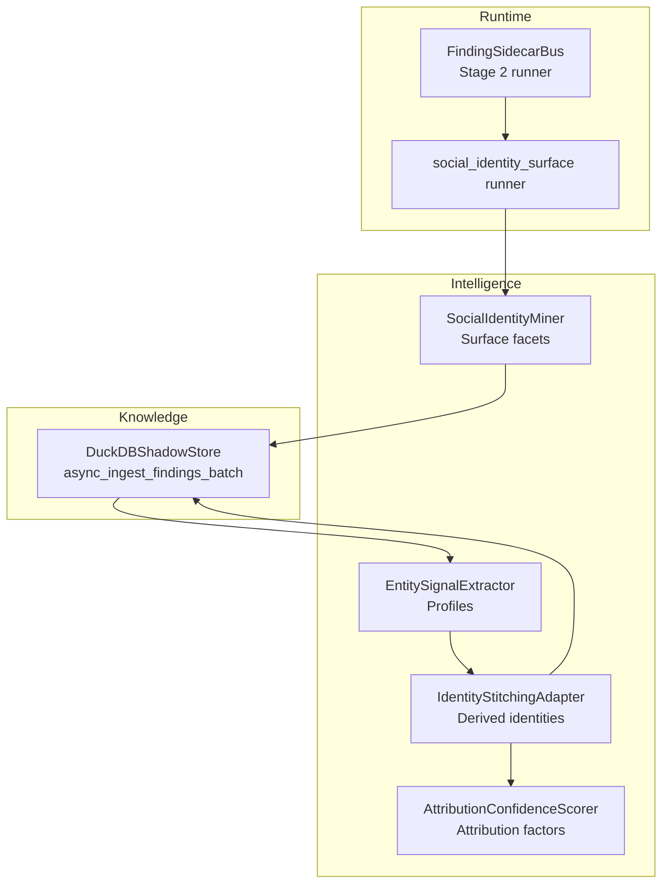
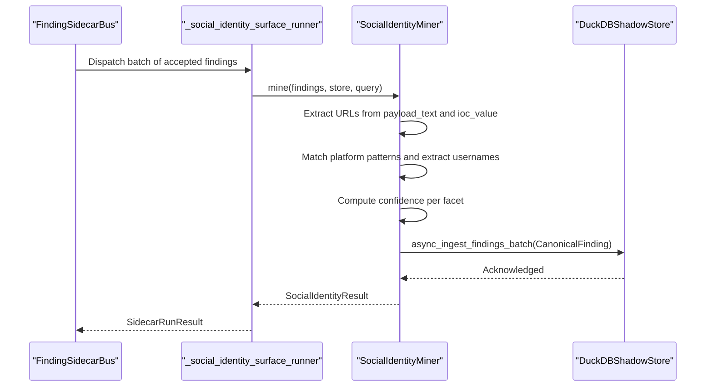
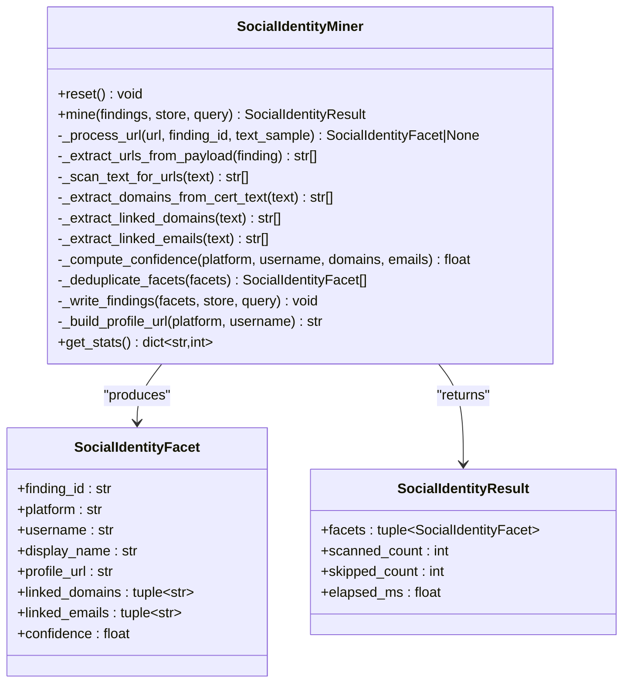
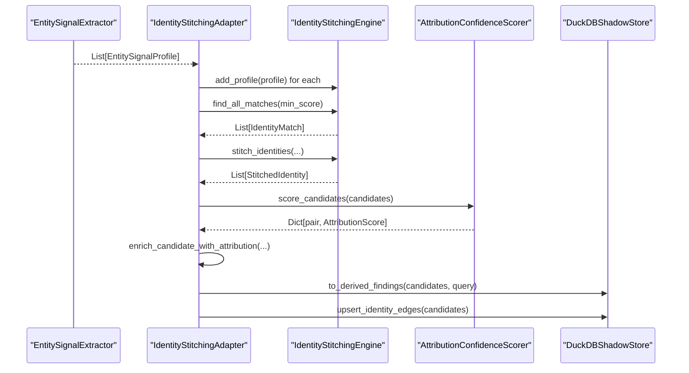
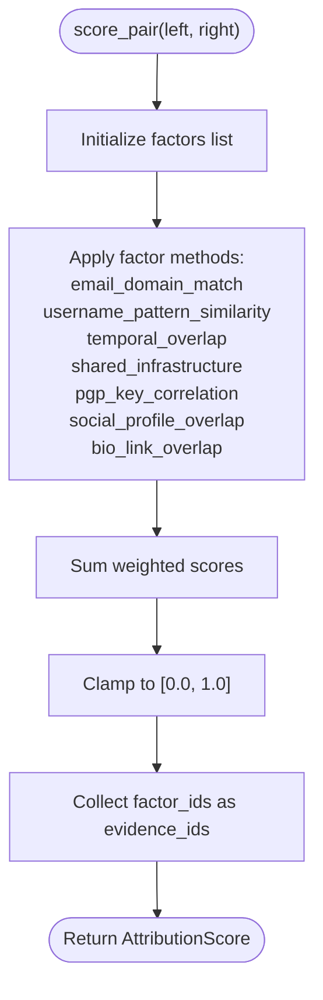
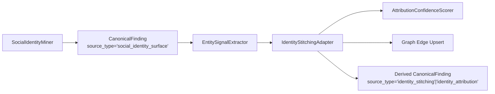

# Social Identity Mining

<cite>
**Referenced Files in This Document**
- [social_identity_miner.py](file://intelligence/social_identity_miner.py)
- [identity_stitching.py](file://intelligence/identity_stitching.py)
- [identity_stitching_canonical.py](file://intelligence/identity_stitching_canonical.py)
- [attribution_scorer.py](file://intelligence/attribution_scorer.py)
- [entity_signal_extractor.py](file://intelligence/entity_signal_extractor.py)
- [sidecar_bus.py](file://runtime/sidecar_bus.py)
- [REAL_ARCHITECTURE.md](file://REAL_ARCHITECTURE.md)
- [pii_gate.py](file://security/pii_gate.py)
</cite>

## Table of Contents
1. [Introduction](#introduction)
2. [Project Structure](#project-structure)
3. [Core Components](#core-components)
4. [Architecture Overview](#architecture-overview)
5. [Detailed Component Analysis](#detailed-component-analysis)
6. [Dependency Analysis](#dependency-analysis)
7. [Performance Considerations](#performance-considerations)
8. [Privacy and Data Protection](#privacy-and-data-protection)
9. [Troubleshooting Guide](#troubleshooting-guide)
10. [Conclusion](#conclusion)

## Introduction
This document describes the social identity mining module and its role in constructing coherent identity profiles from disparate data sources. It explains how the system extracts surface-level social identity facets, correlates them across platforms, resolves canonical identities, and computes attribution confidence. It also documents privacy safeguards and operational constraints that govern identity analysis.

## Project Structure
The social identity mining capability spans several modules:
- Intelligence miners and adapters: social identity surface miner, identity stitching adapter, attribution scorer, and entity signal extractor
- Runtime orchestration: sidecar bus and runner registration
- Privacy and security: early PII detection and sanitization

**Diagram sources**
- [sidecar_bus.py:793-831](file://runtime/sidecar_bus.py#L793-L831)
- [social_identity_miner.py:158-577](file://intelligence/social_identity_miner.py#L158-L577)
- [entity_signal_extractor.py:1-331](file://intelligence/entity_signal_extractor.py#L1-L331)
- [identity_stitching_canonical.py:98-497](file://intelligence/identity_stitching_canonical.py#L98-L497)
- [attribution_scorer.py:136-687](file://intelligence/attribution_scorer.py#L136-L687)

**Section sources**
- [REAL_ARCHITECTURE.md:601-669](file://REAL_ARCHITECTURE.md#L601-L669)
- [sidecar_bus.py:54-831](file://runtime/sidecar_bus.py#L54-L831)

## Core Components
- SocialIdentityMiner: Extracts usernames, profile URLs, linked domains, and emails from accepted findings without invasive scraping. Computes per-facet confidence and writes canonical findings.
- IdentityStitchingAdapter: Converts entity signal profiles into IdentityProfile objects, finds matches, stitches identities, and produces derived canonical findings with attribution confidence.
- AttributionConfidenceScorer: Computes explainable attribution scores across identity candidate pairs using multiple factors (email domain match, username pattern similarity, temporal overlap, shared infrastructure, PGP correlation, social profile overlap, bio link overlap).
- EntitySignalExtractor: Extracts usernames, emails, and domain handles from CanonicalFinding payloads to build lightweight profiles for stitching.
- Sidecar orchestration: Registers and runs the social identity surface miner as part of Stage 2 correlation.

**Section sources**
- [social_identity_miner.py:158-577](file://intelligence/social_identity_miner.py#L158-L577)
- [identity_stitching_canonical.py:98-497](file://intelligence/identity_stitching_canonical.py#L98-L497)
- [attribution_scorer.py:136-687](file://intelligence/attribution_scorer.py#L136-L687)
- [entity_signal_extractor.py:1-331](file://intelligence/entity_signal_extractor.py#L1-L331)
- [sidecar_bus.py:793-831](file://runtime/sidecar_bus.py#L793-L831)

## Architecture Overview
The social identity mining pipeline operates as a sidecar within the sprint lifecycle. It scans accepted findings for URLs and textual signals, extracts surface-level identity facets, writes them to the canonical store, and later supports attribution analysis.

**Diagram sources**
- [sidecar_bus.py:793-814](file://runtime/sidecar_bus.py#L793-L814)
- [social_identity_miner.py:187-298](file://intelligence/social_identity_miner.py#L187-L298)

**Section sources**
- [REAL_ARCHITECTURE.md:601-669](file://REAL_ARCHITECTURE.md#L601-L669)
- [sidecar_bus.py:54-831](file://runtime/sidecar_bus.py#L54-L831)

## Detailed Component Analysis

### SocialIdentityMiner
- Purpose: Passive extraction of usernames, profile URLs, linked domains, and emails from findings; confidence scoring; canonical write.
- Key behaviors:
  - URL extraction from JSON envelopes and raw text
  - Platform pattern matching (GitHub, Twitter, LinkedIn, Mastodon, Keybase, GitLab, HackerNews, Reddit, YouTube, Facebook)
  - Confidence scoring based on platform type, presence of linked domains/emails, username length, and domain-in-username match
  - Deduplication by platform:username key
  - Canonical write via async_ingest_findings_batch with source_type "social_identity_surface"

**Diagram sources**
- [social_identity_miner.py:114-136](file://intelligence/social_identity_miner.py#L114-L136)
- [social_identity_miner.py:158-577](file://intelligence/social_identity_miner.py#L158-L577)

**Section sources**
- [social_identity_miner.py:158-577](file://intelligence/social_identity_miner.py#L158-L577)
- [REAL_ARCHITECTURE.md:601-669](file://REAL_ARCHITECTURE.md#L601-L669)

### IdentityStitchingAdapter
- Purpose: Convert entity signal profiles into IdentityProfile objects, run bounded identity stitching, produce derived identity findings, and upsert graph edges.
- Key behaviors:
  - Bounded profile ingestion (MAX_PROFILES) and comparison limits (MAX_COMPARISONS)
  - Match and stitch identities with configurable thresholds
  - Enrich candidates with attribution confidence and evidence
  - Upsert identity edges with weights derived from attribution confidence

**Diagram sources**
- [identity_stitching_canonical.py:165-497](file://intelligence/identity_stitching_canonical.py#L165-L497)
- [attribution_scorer.py:480-687](file://intelligence/attribution_scorer.py#L480-L687)

**Section sources**
- [identity_stitching_canonical.py:98-497](file://intelligence/identity_stitching_canonical.py#L98-L497)
- [attribution_scorer.py:136-687](file://intelligence/attribution_scorer.py#L136-L687)

### AttributionConfidenceScorer
- Purpose: Provide explainable confidence scores for identity pairing using multiple factors.
- Factors:
  - Email domain match
  - Username pattern similarity (Levenshtein-based)
  - Temporal overlap (based on shared finding density)
  - Shared infrastructure (platform overlap)
  - PGP key correlation
  - Social profile overlap (platform:username sets)
  - Bio link overlap (domains and emails)

**Diagram sources**
- [attribution_scorer.py:480-562](file://intelligence/attribution_scorer.py#L480-L562)

**Section sources**
- [attribution_scorer.py:136-687](file://intelligence/attribution_scorer.py#L136-L687)

### EntitySignalExtractor
- Purpose: Lightweight extraction of usernames, emails, and domain handles from CanonicalFinding payloads to support downstream stitching.
- Key behaviors:
  - Regex-based extraction from payload_text
  - Normalization and deduplication
  - Bounded profile creation (MAX_PROFILES)

**Section sources**
- [entity_signal_extractor.py:1-331](file://intelligence/entity_signal_extractor.py#L1-L331)

## Dependency Analysis
- Social identity surface miner is a Stage 2 sidecar runner registered in the sidecar bus.
- Derived identity findings and graph edges are produced by the identity stitching adapter and written via the canonical store.
- Attribution scoring consumes social identity facets and candidate profiles to enhance confidence.

**Diagram sources**
- [sidecar_bus.py:793-831](file://runtime/sidecar_bus.py#L793-L831)
- [social_identity_miner.py:507-549](file://intelligence/social_identity_miner.py#L507-L549)
- [entity_signal_extractor.py:222-297](file://intelligence/entity_signal_extractor.py#L222-L297)
- [identity_stitching_canonical.py:411-477](file://intelligence/identity_stitching_canonical.py#L411-L477)

**Section sources**
- [REAL_ARCHITECTURE.md:601-669](file://REAL_ARCHITECTURE.md#L601-L669)
- [sidecar_bus.py:54-831](file://runtime/sidecar_bus.py#L54-L831)

## Performance Considerations
- Concurrency and timeouts: The surface miner uses bounded concurrency and per-call timeouts to prevent resource exhaustion.
- Memory guards: The miner checks RSS against high-water marks and skips processing under memory pressure.
- Bounded collections: Limits on profiles, links per profile, and text scanning bytes ensure predictable resource usage.
- Adapter memory management: The stitching adapter optimizes memory after processing batches.

**Section sources**
- [social_identity_miner.py:207-220](file://intelligence/social_identity_miner.py#L207-L220)
- [identity_stitching_canonical.py:280-282](file://intelligence/identity_stitching_canonical.py#L280-L282)

## Privacy and Data Protection
- Early PII detection: The SecurityGate module detects and optionally masks PII (emails, phones, SSNs, etc.) using regex-based patterns. It computes risk scores and provides a fallback sanitizer for fail-safe operation.
- Social identity facets are written as canonical findings with source_type "social_identity_surface". Attribution analysis augments these with additional signals but does not introduce new sensitive data.
- Privacy gates operate independently of the identity mining pipeline; they apply sanitization to text content prior to storage or further processing when required by policy.

**Section sources**
- [pii_gate.py:75-200](file://security/pii_gate.py#L75-L200)
- [social_identity_miner.py:507-549](file://intelligence/social_identity_miner.py#L507-L549)
- [identity_stitching_canonical.py:411-477](file://intelligence/identity_stitching_canonical.py#L411-L477)

## Troubleshooting Guide
Common issues and mitigations:
- Surface miner returns no facets:
  - Verify findings contain URLs or text with platform patterns
  - Confirm miner bounds are not exceeded (MAX_SOCIAL_PROFILES, MAX_LINKS_PER_PROFILE)
- Memory pressure causing skipping:
  - Monitor RSS and high-water thresholds; reduce concurrent loads
- Stitches not produced:
  - Ensure entity signal extraction yields sufficient profiles and that comparison limits are adequate
- Attribution confidence missing:
  - Confirm candidates have sufficient overlap in usernames, platforms, domains, or PGP keys

Operational checks:
- Sidecar registration and staging: Ensure "social_identity_surface" is present in DEFAULT_SIDECAR_RUNNERS and runs in Stage 2.
- Canonical writes: Verify async_ingest_findings_batch is reachable and functioning.

**Section sources**
- [sidecar_bus.py:54-831](file://runtime/sidecar_bus.py#L54-L831)
- [social_identity_miner.py:207-220](file://intelligence/social_identity_miner.py#L207-L220)
- [identity_stitching_canonical.py:184-287](file://intelligence/identity_stitching_canonical.py#L184-L287)

## Conclusion
The social identity mining module provides a robust, privacy-aware pipeline for extracting surface-level social identity facets, correlating them across platforms, and deriving attribution-enhanced identity candidates. Its design emphasizes determinism, fail-soft behavior, bounded resource usage, and clear canonical write paths, enabling reliable integration into the broader research and intelligence workflows.