# Specialized Intelligence Modules

<cite>
**Referenced Files in This Document**
- [intelligence/__init__.py](file://intelligence/__init__.py)
- [dark_web_intelligence.py](file://intelligence/dark_web_intelligence.py)
- [blockchain_analyzer.py](file://intelligence/blockchain_analyzer.py)
- [cryptographic_intelligence.py](file://intelligence/cryptographic_intelligence.py)
- [data_leak_hunter.py](file://intelligence/data_leak_hunter.py)
- [exposed_service_hunter.py](file://intelligence/exposed_service_hunter.py)
- [github_secret_scanner.py](file://intelligence/github_secret_scanner.py)
- [pastebin_monitor.py](file://intelligence/pastebin_monitor.py)
- [onion_seed_manager.py](file://intelligence/onion_seed_manager.py)
</cite>

## Table of Contents
1. [Introduction](#introduction)
2. [Project Structure](#project-structure)
3. [Core Components](#core-components)
4. [Architecture Overview](#architecture-overview)
5. [Detailed Component Analysis](#detailed-component-analysis)
6. [Dependency Analysis](#dependency-analysis)
7. [Performance Considerations](#performance-considerations)
8. [Troubleshooting Guide](#troubleshooting-guide)
9. [Conclusion](#conclusion)

## Introduction
This document describes specialized intelligence modules that extend the universal intelligence framework with domain-specific capabilities for:
- Dark web intelligence (Tor/I2P crawling, hidden service analysis)
- Blockchain forensics (wallet analysis, transaction tracing)
- Cryptographic intelligence (hash analysis, classical cryptanalysis, certificate parsing)
- Data leak hunting (breach monitoring, paste site surveillance)
- Exposed service detection (S3 buckets, databases, GraphQL, CT logs)
- GitHub secret scanning (public code search for secrets)
- Pastebin monitoring (multi-source scraping with circuit breaker)
- Onion seed management (seed curation, Ahmia discovery)

Each module defines clear data models, analytical techniques, and operational patterns suitable for integration into the broader research orchestration and knowledge pipeline.

## Project Structure
The specialized modules live under the intelligence package and are exported via the central module initializer. They expose classes and functions that encapsulate domain logic, data structures, and asynchronous workflows.

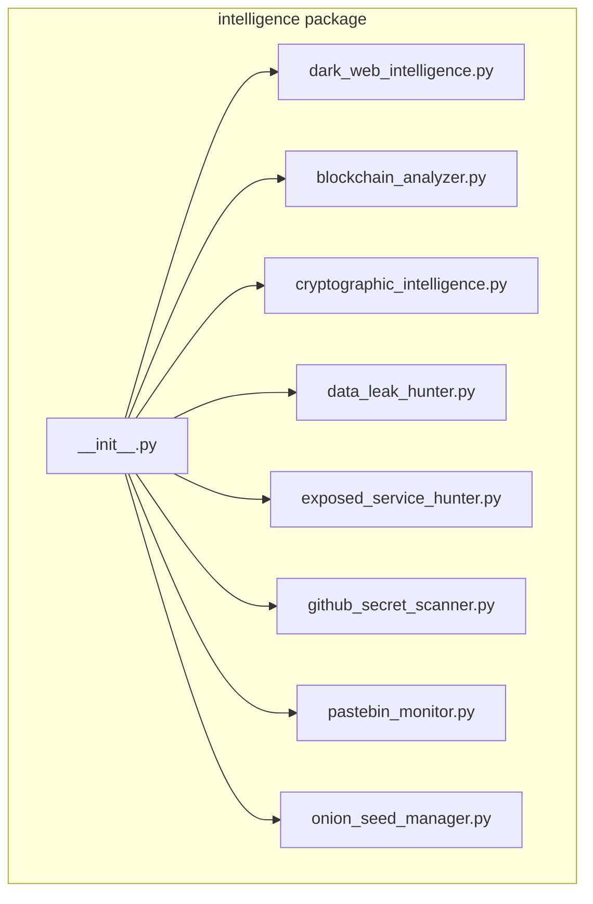

**Diagram sources**
- [intelligence/__init__.py:1-686](file://intelligence/__init__.py#L1-L686)

**Section sources**
- [intelligence/__init__.py:1-686](file://intelligence/__init__.py#L1-L686)

## Core Components
This section outlines the principal capabilities and data models for each specialized module.

- Dark Web Intelligence
  - Tor/I2P crawling, hidden service discovery, marketplace/forum monitoring
  - PGP key extraction, cryptocurrency address detection
  - Streaming content extraction, bounded memory caches, identity rotation
  - Data models: HiddenService, DarkWebContent, PGPKeyInfo, TorProxyManager

- Blockchain Forensics
  - Wallet analysis, transaction tracing, pattern detection
  - Known services database, risk scoring, clustering
  - Data models: WalletAnalysis, Transaction, TransactionPattern, Cluster, CrossChainResult

- Cryptographic Intelligence
  - Classical cipher cryptanalysis (Caesar, Vigenere, Rail Fence, Atbash)
  - Hash identification and dictionary cracking
  - Encryption detection heuristics, certificate parsing
  - Data models: ClassicalCryptanalysis, HashAnalyzer, EncryptionDetector, CertificateInfo

- Data Leak Hunter
  - Breach API integrations (HaveIBeenPwned, LeakLookup, Dehashed, IntelligenceX)
  - Paste site surveillance, temporal anonymization, alerting
  - Data models: LeakAlert, MonitoringTarget, BreachAPIConfig

- Exposed Service Hunter
  - S3 bucket enumeration, database port scanning, GraphQL introspection
  - Certificate transparency queries, container API detection
  - Data models: ExposedService, S3Bucket, CertificateInfo

- GitHub Secret Scanner
  - Public code search for AWS keys, API keys, Stripe tokens, Slack tokens, private keys
  - Rate limiting, circuit breaker integration, secret masking
  - Data models: SecretFinding

- Pastebin Monitor
  - Multi-source scraping (pastebin.com, paste.gg, rentry.co)
  - Circuit breaker, rate limiting, secret extraction
  - Data models: PasteFinding

- Onion Seed Manager
  - Curated seed lists, persistence, Ahmia discovery (clearnet and Tor)
  - Data models: none (utility class)

**Section sources**
- [dark_web_intelligence.py:1-694](file://intelligence/dark_web_intelligence.py#L1-L694)
- [blockchain_analyzer.py:1-1515](file://intelligence/blockchain_analyzer.py#L1-L1515)
- [cryptographic_intelligence.py:1-1257](file://intelligence/cryptographic_intelligence.py#L1-L1257)
- [data_leak_hunter.py:1-912](file://intelligence/data_leak_hunter.py#L1-L912)
- [exposed_service_hunter.py:1-1683](file://intelligence/exposed_service_hunter.py#L1-L1683)
- [github_secret_scanner.py:1-231](file://intelligence/github_secret_scanner.py#L1-L231)
- [pastebin_monitor.py:1-372](file://intelligence/pastebin_monitor.py#L1-L372)
- [onion_seed_manager.py:1-211](file://intelligence/onion_seed_manager.py#L1-L211)

## Architecture Overview
The modules integrate with the broader system through:
- Central exports in intelligence/__init__.py
- Asynchronous I/O and bounded resource usage
- Optional security and anonymization utilities
- Circuit breakers and rate limiting for external APIs
- Data models compatible with knowledge graph and reporting pipelines

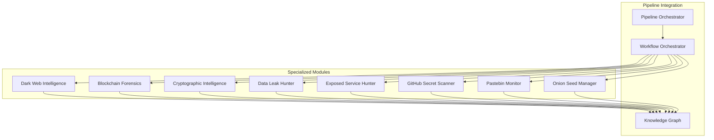

**Diagram sources**
- [intelligence/__init__.py:1-686](file://intelligence/__init__.py#L1-L686)

## Detailed Component Analysis

### Dark Web Intelligence
Capabilities:
- Tor/I2P crawling with stealth headers and identity rotation
- Hidden service enumeration and content extraction
- Cryptocurrency address and PGP key discovery
- Streaming monitoring with bounded caches and LRU eviction

Operational patterns:
- Initialize Tor proxy, crawl onion addresses, extract links and content
- Monitor services for content changes with periodic hashing
- Manage bounded memory structures to avoid unbounded growth

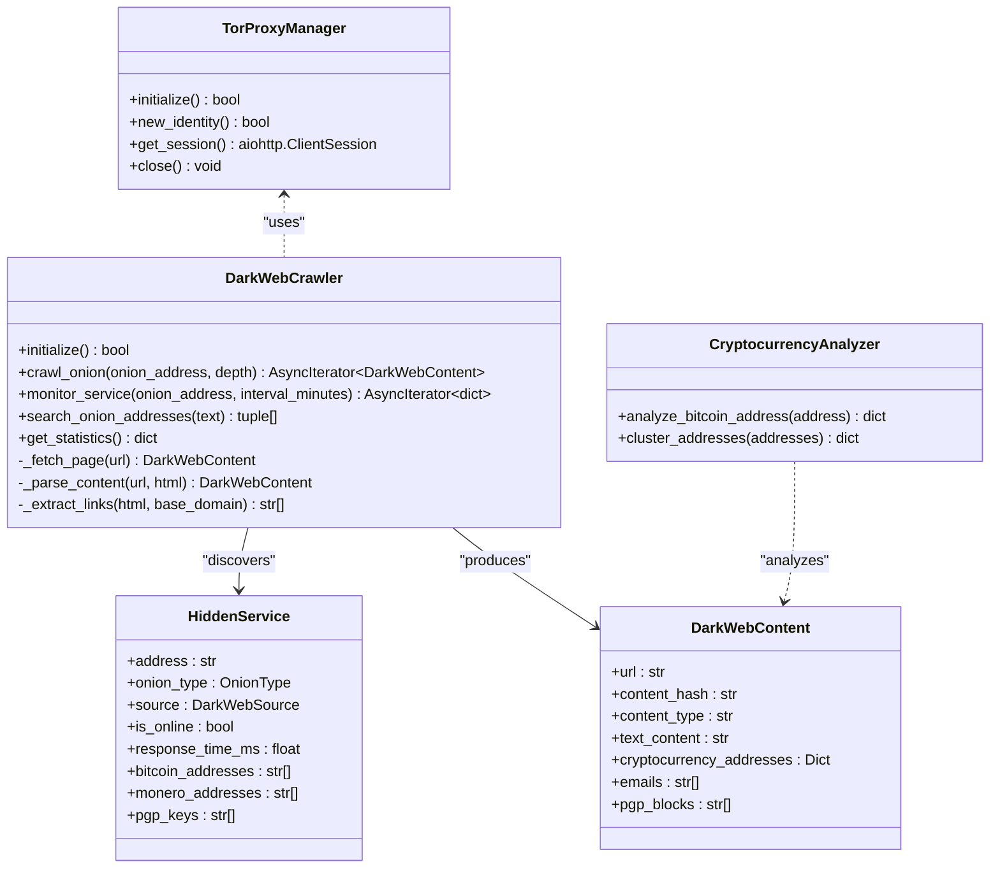

**Diagram sources**
- [dark_web_intelligence.py:120-694](file://intelligence/dark_web_intelligence.py#L120-L694)

**Section sources**
- [dark_web_intelligence.py:1-694](file://intelligence/dark_web_intelligence.py#L1-L694)

### Blockchain Forensics
Capabilities:
- Wallet analysis across Ethereum and Bitcoin via external APIs
- Transaction tracing with depth-first exploration
- Pattern detection (peel chain, mixing, layering, round amounts)
- Known services tagging and risk scoring

Operational patterns:
- Rate-limited API calls with caching and semaphores
- Validation of address formats per chain
- Clustering and correlation via heuristics

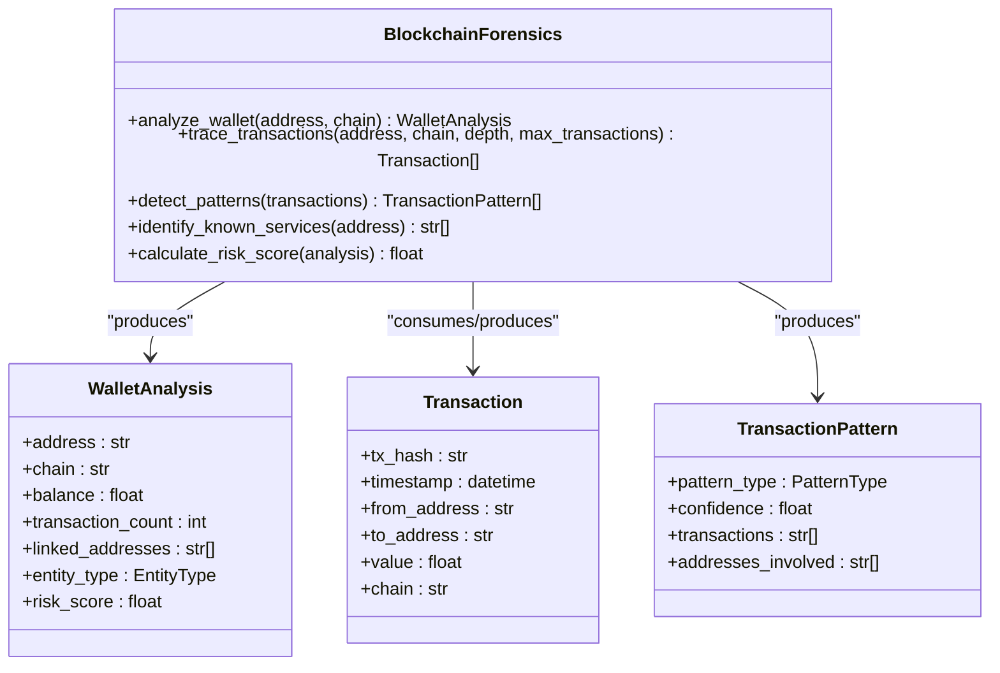

**Diagram sources**
- [blockchain_analyzer.py:266-1515](file://intelligence/blockchain_analyzer.py#L266-L1515)

**Section sources**
- [blockchain_analyzer.py:1-1515](file://intelligence/blockchain_analyzer.py#L1-L1515)

### Cryptographic Intelligence
Capabilities:
- Classical cryptanalysis: Caesar, Vigenere, Rail Fence, Atbash
- Hash identification and dictionary cracking
- Encryption detection heuristics (entropy, chi-square, IOC)
- Certificate parsing and validation metadata

Operational patterns:
- Frequency analysis and scoring for classical ciphers
- Precompiled regex patterns for hash families
- Heuristic-based detection of encryption vs. encoding/compression

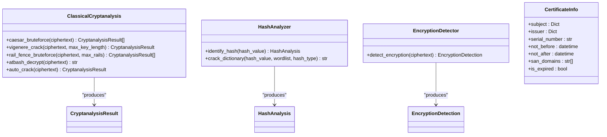

**Diagram sources**
- [cryptographic_intelligence.py:202-1257](file://intelligence/cryptographic_intelligence.py#L202-L1257)

**Section sources**
- [cryptographic_intelligence.py:1-1257](file://intelligence/cryptographic_intelligence.py#L1-L1257)

### Data Leak Hunter
Capabilities:
- Breach API checks (HaveIBeenPwned, LeakLookup, Dehashed, IntelligenceX)
- Paste site surveillance (Pastebin, Ghostbin, etc.)
- Temporal anonymization and zero-attribution techniques
- Alert deduplication and handler callbacks

Operational patterns:
- Periodic monitoring loop with configurable intervals
- Rate-limited API calls with per-service delays
- Security-aware HTTP sessions and randomized delays

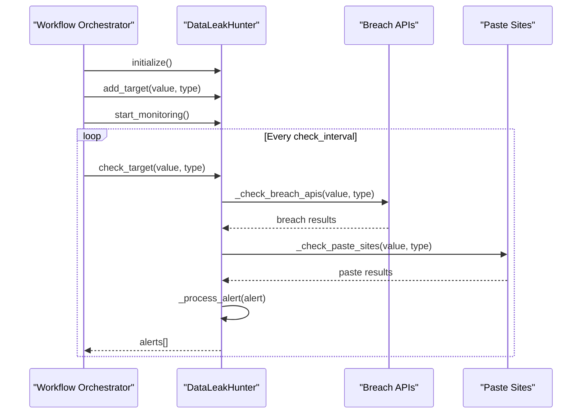

**Diagram sources**
- [data_leak_hunter.py:114-912](file://intelligence/data_leak_hunter.py#L114-L912)

**Section sources**
- [data_leak_hunter.py:1-912](file://intelligence/data_leak_hunter.py#L1-L912)

### Exposed Service Hunter
Capabilities:
- S3 bucket enumeration using naming patterns and region probing
- Database port scanning with banner detection and auth tests
- GraphQL introspection discovery and schema extraction
- Certificate transparency log queries via crt.sh

Operational patterns:
- Concurrency control via semaphores and connection pools
- Lightweight TCP checks for open ports
- JSON introspection queries for GraphQL endpoints

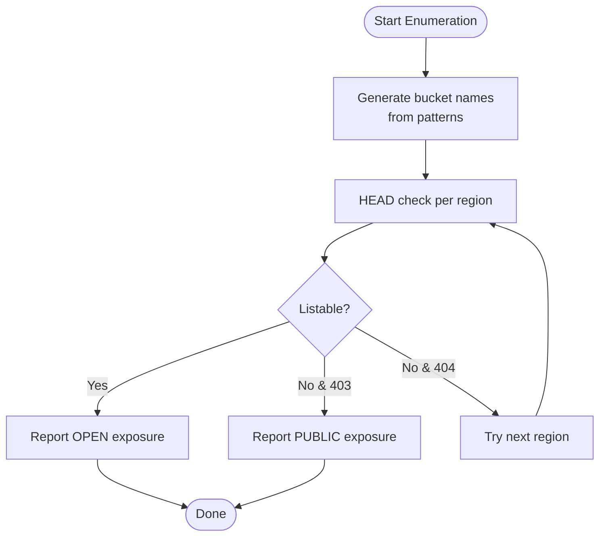

**Diagram sources**
- [exposed_service_hunter.py:115-337](file://intelligence/exposed_service_hunter.py#L115-L337)

**Section sources**
- [exposed_service_hunter.py:1-1683](file://intelligence/exposed_service_hunter.py#L1-L1683)

### GitHub Secret Scanner
Capabilities:
- Public code search for AWS keys, Google API keys, Stripe keys, Slack tokens, private keys
- Rate limiting and circuit breaker integration
- Secret masking for safe logging

Operational patterns:
- Unauthenticated GitHub Code Search API with strict rate limiting
- Per-page result iteration and raw content retrieval
- Pattern-based extraction with masked context reporting

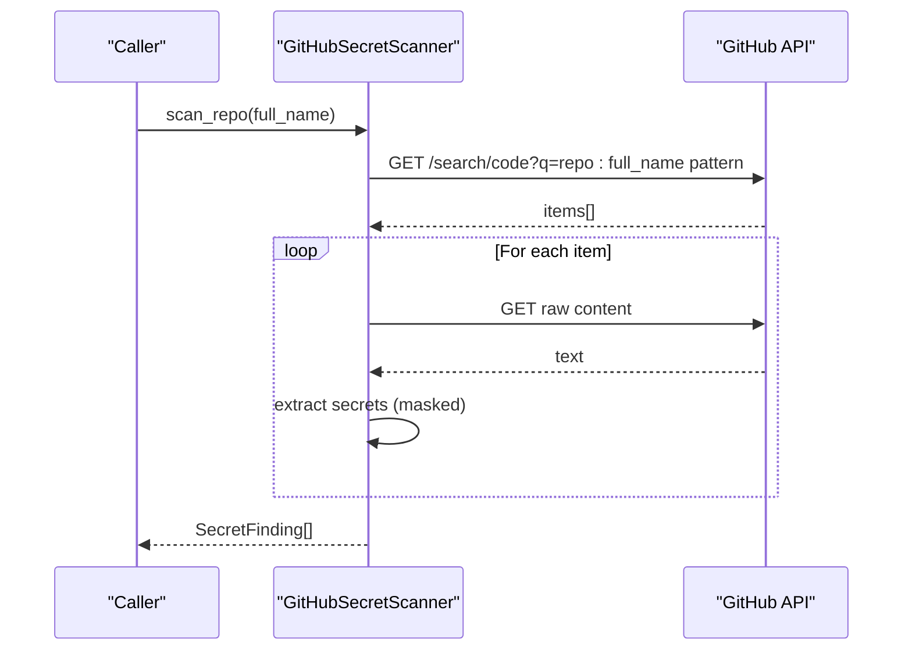

**Diagram sources**
- [github_secret_scanner.py:74-231](file://intelligence/github_secret_scanner.py#L74-L231)

**Section sources**
- [github_secret_scanner.py:1-231](file://intelligence/github_secret_scanner.py#L1-L231)

### Pastebin Monitor
Capabilities:
- Multi-source scraping (pastebin.com, paste.gg, rentry.co)
- Circuit breaker and rate limiting
- Secret extraction (emails, IPs, tokens, private keys)

Operational patterns:
- Hard 1-req/sec rate limit across sources
- Circuit breaker opens after repeated failures
- Selectolax-based HTML parsing for search results

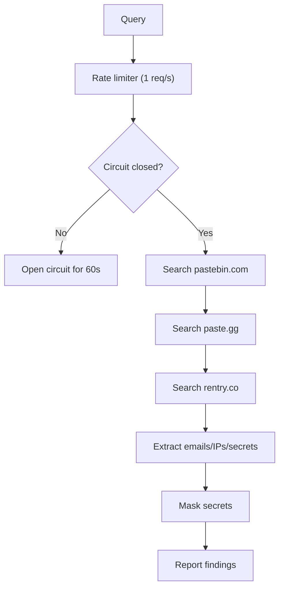

**Diagram sources**
- [pastebin_monitor.py:191-372](file://intelligence/pastebin_monitor.py#L191-L372)

**Section sources**
- [pastebin_monitor.py:1-372](file://intelligence/pastebin_monitor.py#L1-L372)

### Onion Seed Management
Capabilities:
- Curated seed list maintenance and persistence
- Ahmia discovery via clearnet and Tor
- Invariant-safe seed ingestion (http(s) with .onion)

Operational patterns:
- Load/save seeds to JSON file
- Extract .onion addresses from Ahmia search results
- Prefer curated seeds first, then additional seeds

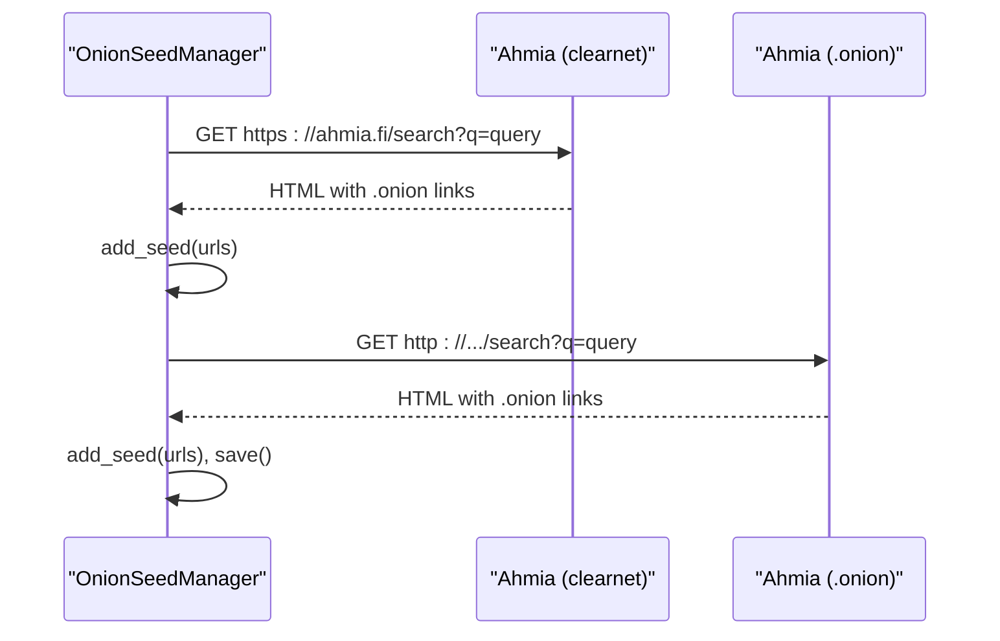

**Diagram sources**
- [onion_seed_manager.py:100-211](file://intelligence/onion_seed_manager.py#L100-L211)

**Section sources**
- [onion_seed_manager.py:1-211](file://intelligence/onion_seed_manager.py#L1-L211)

## Dependency Analysis
Integration and coupling:
- Central exports in intelligence/__init__.py enable unified imports and availability flags
- Optional dependencies (e.g., cryptography, aiohttp_socks) guarded by try/except
- Security utilities (temporal anonymization, zero attribution) conditionally available
- External API dependencies (Etherscan, Blockchair, GitHub) isolated per module

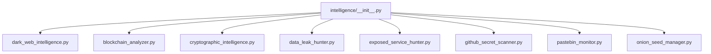

**Diagram sources**
- [intelligence/__init__.py:1-686](file://intelligence/__init__.py#L1-L686)

**Section sources**
- [intelligence/__init__.py:1-686](file://intelligence/__init__.py#L1-L686)

## Performance Considerations
- Asynchronous I/O and bounded concurrency:
  - Semaphores and connection pools limit resource usage
  - Rate limiting prevents throttling and quota exhaustion
- Memory containment:
  - OrderedDict-based LRU caches with fixed capacities
  - Bounded queues and visited sets to avoid unbounded growth
- Network resilience:
  - Circuit breakers and retry/backoff for unstable endpoints
  - Optional Tor control for identity rotation

## Troubleshooting Guide
Common issues and mitigations:
- Tor connectivity failures:
  - Verify local Tor installation and socks proxy settings
  - Use new_identity() to rotate exit nodes
- API rate limits:
  - Respect per-service delays; implement backoff on 429/403
  - Use circuit breakers to pause scraping temporarily
- Parsing errors:
  - Ensure optional parsers (selectolax) are installed for HTML parsing
  - Validate regex patterns and character encodings
- Memory pressure:
  - Monitor bounded cache sizes and reset session state when needed
  - Reduce max_concurrent or adjust timeouts

**Section sources**
- [dark_web_intelligence.py:120-241](file://intelligence/dark_web_intelligence.py#L120-L241)
- [data_leak_hunter.py:312-337](file://intelligence/data_leak_hunter.py#L312-L337)
- [pastebin_monitor.py:77-102](file://intelligence/pastebin_monitor.py#L77-L102)
- [exposed_service_hunter.py:181-197](file://intelligence/exposed_service_hunter.py#L181-L197)

## Conclusion
These specialized intelligence modules provide robust, modular capabilities for dark web research, blockchain forensics, cryptographic analysis, leak monitoring, exposed service discovery, secret scanning, paste site surveillance, and onion seed curation. Their asynchronous design, bounded resource usage, and optional security features make them suitable for integration into larger research pipelines while maintaining operational safety and performance.