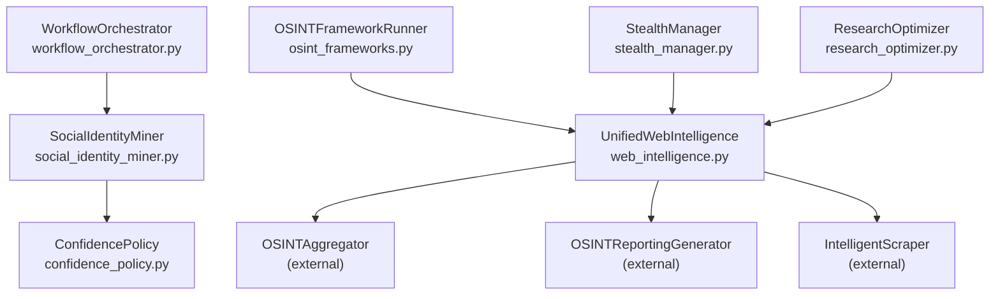
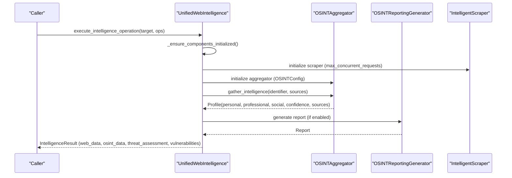
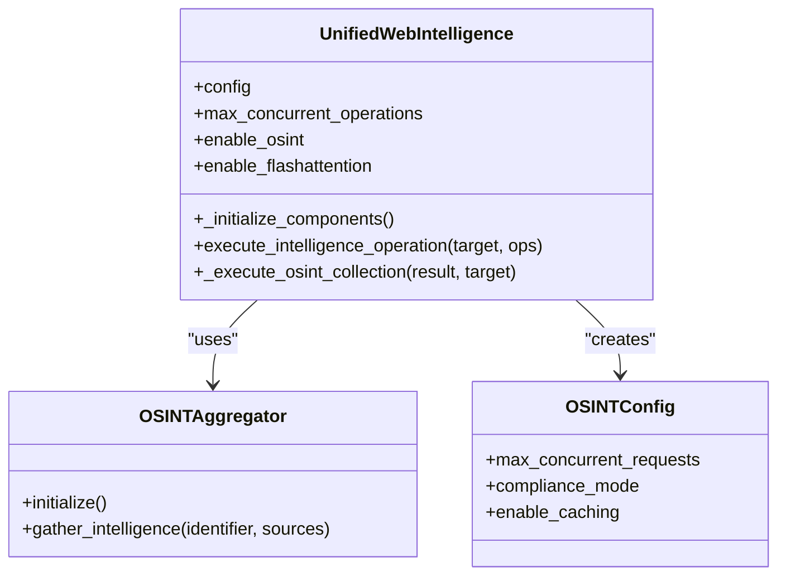
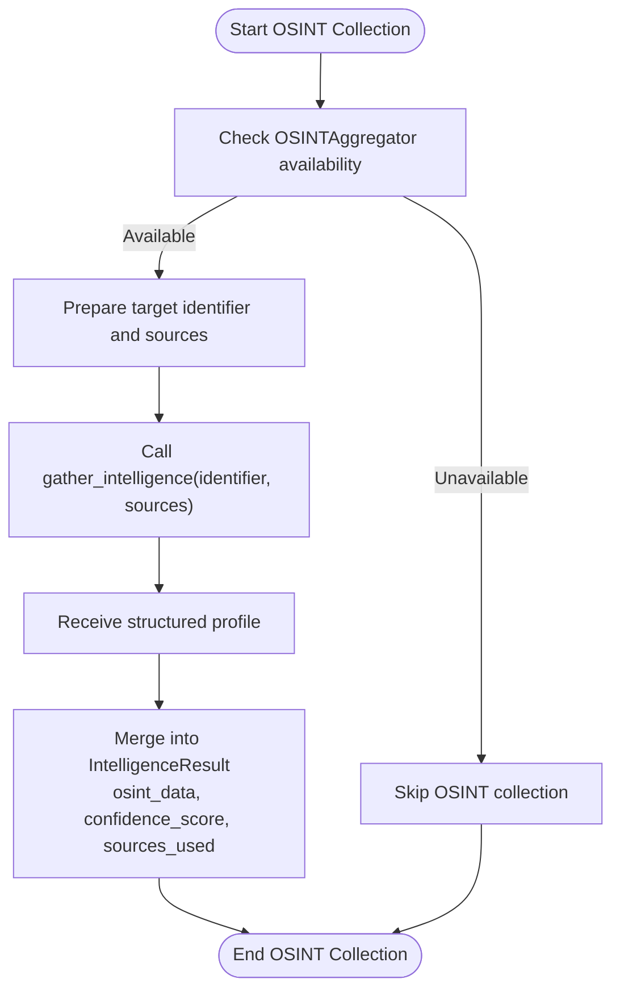
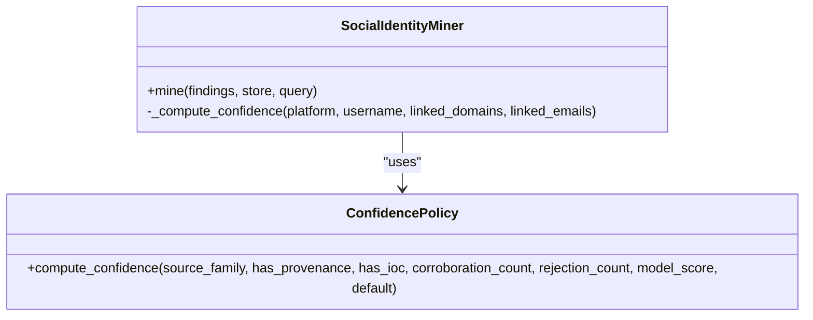
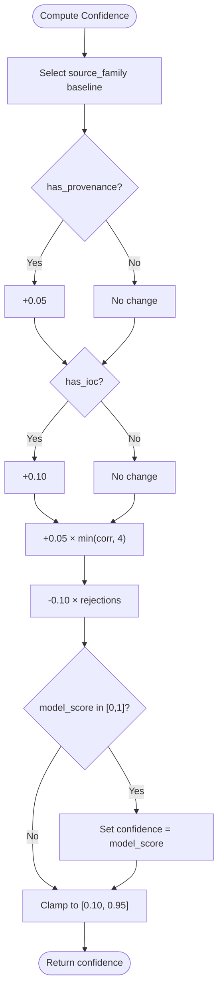
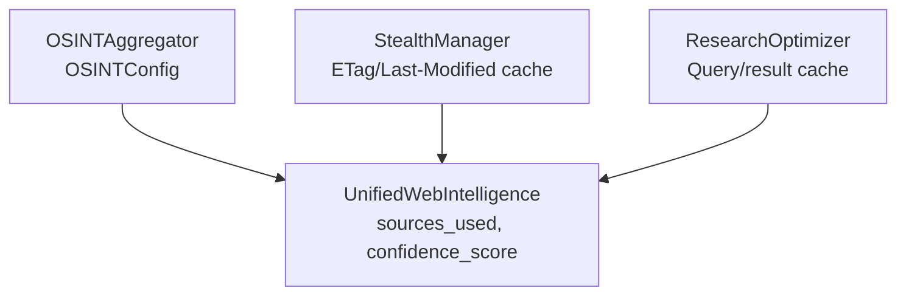
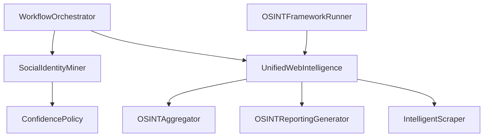

# OSINT Collection System

<cite>
**Referenced Files in This Document**
- [web_intelligence.py](file://hledac/universal/intelligence/web_intelligence.py)
- [social_identity_miner.py](file://hledac/universal/intelligence/social_identity_miner.py)
- [confidence_policy.py](file://hledac/universal/intelligence/confidence_policy.py)
- [workflow_orchestrator.py](file://hledac/universal/intelligence/workflow_orchestrator.py)
- [osint_frameworks.py](file://hledac/universal/tools/osint_frameworks.py)
- [stealth_manager.py](file://hledac/universal/stealth/stealth_manager.py)
- [research_optimizer.py](file://hledac/universal/coordinators/research_optimizer.py)
</cite>

## Table of Contents
1. [Introduction](#introduction)
2. [Project Structure](#project-structure)
3. [Core Components](#core-components)
4. [Architecture Overview](#architecture-overview)
5. [Detailed Component Analysis](#detailed-component-analysis)
6. [Dependency Analysis](#dependency-analysis)
7. [Performance Considerations](#performance-considerations)
8. [Troubleshooting Guide](#troubleshooting-guide)
9. [Conclusion](#conclusion)

## Introduction
This document describes the OSINT Collection System within the Universal Intelligence module. It explains how OSINTAggregator integration and OSINTConfig management work together to collect intelligence from multiple sources, how the OSINT gathering workflow operates (including target identification, source selection, and data aggregation), and how personal information, professional data, and social media analysis are handled. It also covers confidence scoring mechanisms, compliance modes, caching strategies, data source attribution, and configuration options such as maximum concurrent requests, compliance levels, and caching behavior.

## Project Structure
The OSINT Collection System spans several modules:
- Unified Web Intelligence: orchestrates OSINT collection alongside web scraping and threat/vulnerability analysis.
- Social Identity Miner: extracts surface-level social identities from findings.
- Confidence Policy: deterministic scoring for OSINT findings.
- Workflow Orchestrator: coordinates multi-module analysis and report generation.
- OSINT Framework Runner: integrates external OSINT tools (theHarvester, Sherlock, Maigret).
- Stealth Manager and Research Optimizer: provide caching and concurrency controls used by OSINT operations.

**Diagram sources**
- [web_intelligence.py:115-201](file://hledac/universal/intelligence/web_intelligence.py#L115-L201)
- [social_identity_miner.py:226-252](file://hledac/universal/intelligence/social_identity_miner.py#L226-L252)
- [confidence_policy.py:84-158](file://hledac/universal/intelligence/confidence_policy.py#L84-L158)
- [workflow_orchestrator.py:335-369](file://hledac/universal/intelligence/workflow_orchestrator.py#L335-L369)
- [osint_frameworks.py:16-207](file://hledac/universal/tools/osint_frameworks.py#L16-L207)
- [stealth_manager.py:130-153](file://hledac/universal/stealth/stealth_manager.py#L130-L153)
- [research_optimizer.py:385-423](file://hledac/universal/coordinators/research_optimizer.py#L385-L423)

**Section sources**
- [web_intelligence.py:115-201](file://hledac/universal/intelligence/web_intelligence.py#L115-L201)
- [social_identity_miner.py:226-252](file://hledac/universal/intelligence/social_identity_miner.py#L226-L252)
- [confidence_policy.py:84-158](file://hledac/universal/intelligence/confidence_policy.py#L84-L158)
- [workflow_orchestrator.py:335-369](file://hledac/universal/intelligence/workflow_orchestrator.py#L335-L369)
- [osint_frameworks.py:16-207](file://hledac/universal/tools/osint_frameworks.py#L16-L207)
- [stealth_manager.py:130-153](file://hledac/universal/stealth/stealth_manager.py#L130-L153)
- [research_optimizer.py:385-423](file://hledac/universal/coordinators/research_optimizer.py#L385-L423)

## Core Components
- UnifiedWebIntelligence: Provides a unified interface for OSINT collection, web scraping, threat assessment, and vulnerability analysis. It initializes optional components lazily, manages queues and concurrency, and coordinates OSINT aggregation.
- OSINTAggregator: External component integrated via OSINTConfig; performs OSINT gathering from configured sources and returns a structured profile with personal/professional/social data, confidence score, and data sources.
- OSINTReportingGenerator: External component used for generating OSINT reports.
- SocialIdentityMiner: Extracts surface-level social identity facets (platform, username, profile URL, linked domains/emails) from findings and writes canonical results with confidence computed via the confidence policy.
- ConfidencePolicy: Deterministic scoring engine that computes confidence scores based on source family, provenance, IOC presence, corroboration count, and rejection penalties.
- WorkflowOrchestrator: Coordinates multi-module analysis, correlates results, detects anomalies, and produces comprehensive reports with risk assessments.
- OSINTFrameworkRunner: Integrates external OSINT tools (theHarvester, Sherlock, Maigret) to augment OSINT collection.
- StealthManager and ResearchOptimizer: Provide caching and concurrency controls that influence OSINT operations’ performance and reliability.

**Section sources**
- [web_intelligence.py:115-201](file://hledac/universal/intelligence/web_intelligence.py#L115-L201)
- [web_intelligence.py:300-344](file://hledac/universal/intelligence/web_intelligence.py#L300-L344)
- [web_intelligence.py:652-690](file://hledac/universal/intelligence/web_intelligence.py#L652-L690)
- [social_identity_miner.py:226-252](file://hledac/universal/intelligence/social_identity_miner.py#L226-L252)
- [confidence_policy.py:84-158](file://hledac/universal/intelligence/confidence_policy.py#L84-L158)
- [workflow_orchestrator.py:335-369](file://hledac/universal/intelligence/workflow_orchestrator.py#L335-L369)
- [osint_frameworks.py:16-207](file://hledac/universal/tools/osint_frameworks.py#L16-L207)
- [stealth_manager.py:130-153](file://hledac/universal/stealth/stealth_manager.py#L130-L153)
- [research_optimizer.py:385-423](file://hledac/universal/coordinators/research_optimizer.py#L385-L423)

## Architecture Overview
The OSINT Collection System follows a layered architecture:
- Control Layer: UnifiedWebIntelligence manages operations, queues, and component initialization.
- Aggregation Layer: OSINTAggregator gathers data from configured sources using OSINTConfig.
- Analysis Layer: SocialIdentityMiner and ConfidencePolicy refine and score findings.
- Reporting Layer: OSINTReportingGenerator and WorkflowOrchestrator produce reports and correlate results.
- Infrastructure Layer: StealthManager and ResearchOptimizer provide caching and concurrency controls.

**Diagram sources**
- [web_intelligence.py:300-344](file://hledac/universal/intelligence/web_intelligence.py#L300-L344)
- [web_intelligence.py:652-690](file://hledac/universal/intelligence/web_intelligence.py#L652-L690)

## Detailed Component Analysis

### OSINTAggregator Integration and OSINTConfig Management
- Initialization: On first operation, UnifiedWebIntelligence initializes OSINTAggregator with OSINTConfig containing:
  - max_concurrent_requests: bounded by max_concurrent_operations
  - compliance_mode: set to "strict"
  - enable_caching: enabled
- Execution: OSINTAggregator.gather_intelligence is called with a target identifier and a list of configured sources. The result is a structured profile containing personal_info, professional_info, social_media, contact_info, relationships, interests, confidence_score, and data_sources.

**Diagram sources**
- [web_intelligence.py:300-344](file://hledac/universal/intelligence/web_intelligence.py#L300-L344)
- [web_intelligence.py:652-690](file://hledac/universal/intelligence/web_intelligence.py#L652-L690)

**Section sources**
- [web_intelligence.py:300-344](file://hledac/universal/intelligence/web_intelligence.py#L300-L344)
- [web_intelligence.py:652-690](file://hledac/universal/intelligence/web_intelligence.py#L652-L690)

### OSINT Gathering Workflow
- Target Identification: The target identifier is derived from the IntelligenceTarget’s name.
- Source Selection: The target’s osint_sources list determines which sources the aggregator queries.
- Data Aggregation: The aggregator returns a profile with structured fields and a confidence score. UnifiedWebIntelligence merges this into IntelligenceResult and updates sources_used and confidence_score.

**Diagram sources**
- [web_intelligence.py:652-690](file://hledac/universal/intelligence/web_intelligence.py#L652-L690)

**Section sources**
- [web_intelligence.py:652-690](file://hledac/universal/intelligence/web_intelligence.py#L652-L690)

### Personal Information Extraction, Professional Data Collection, and Social Media Analysis
- Personal Information: Extracted into personal_info within the OSINT profile.
- Professional Data: Extracted into professional_info within the OSINT profile.
- Social Media Analysis: Extracted into social_media within the OSINT profile; SocialIdentityMiner can further extract platform-specific identities from findings and compute confidence using the canonical policy.

**Diagram sources**
- [social_identity_miner.py:226-252](file://hledac/universal/intelligence/social_identity_miner.py#L226-L252)
- [social_identity_miner.py:532-557](file://hledac/universal/intelligence/social_identity_miner.py#L532-L557)
- [confidence_policy.py:84-158](file://hledac/universal/intelligence/confidence_policy.py#L84-L158)

**Section sources**
- [social_identity_miner.py:226-252](file://hledac/universal/intelligence/social_identity_miner.py#L226-L252)
- [social_identity_miner.py:532-557](file://hledac/universal/intelligence/social_identity_miner.py#L532-L557)
- [confidence_policy.py:84-158](file://hledac/universal/intelligence/confidence_policy.py#L84-L158)

### Confidence Scoring Mechanisms
- Source Family Baselines: Different source families (FEED, PUBLIC, CT, WAYBACK, PASSIVE_DNS, SOCIAL, PLANNER, STEALTH) have predefined baselines.
- Modifiers: Provenance bonus (+0.05), IOC bonus (+0.10), corroboration bonus up to +0.20 (4×0.05), rejection penalty up to -0.10 per occurrence, and optional model_score override.
- Bounds: Confidence is clamped between 0.10 and 0.95.

**Diagram sources**
- [confidence_policy.py:84-158](file://hledac/universal/intelligence/confidence_policy.py#L84-L158)

**Section sources**
- [confidence_policy.py:84-158](file://hledac/universal/intelligence/confidence_policy.py#L84-L158)

### Compliance Modes, Caching Strategies, and Data Source Attribution
- Compliance Mode: OSINTConfig sets compliance_mode to "strict" during initialization, ensuring adherence to responsible collection practices.
- Caching Behavior: OSINTConfig enables_caching, and UnifiedWebIntelligence passes max_concurrent_operations to the aggregator. Additional caching is provided by StealthManager (ETag/Last-Modified cache with TTL) and ResearchOptimizer (query/result caching).
- Data Source Attribution: OSINTAggregator returns data_sources used to collect the profile, which UnifiedWebIntelligence appends to IntelligenceResult.sources_used.

**Diagram sources**
- [web_intelligence.py:330-336](file://hledac/universal/intelligence/web_intelligence.py#L330-L336)
- [web_intelligence.py:678-684](file://hledac/universal/intelligence/web_intelligence.py#L678-L684)
- [stealth_manager.py:130-153](file://hledac/universal/stealth/stealth_manager.py#L130-L153)
- [research_optimizer.py:385-423](file://hledac/universal/coordinators/research_optimizer.py#L385-L423)

**Section sources**
- [web_intelligence.py:330-336](file://hledac/universal/intelligence/web_intelligence.py#L330-L336)
- [web_intelligence.py:678-684](file://hledac/universal/intelligence/web_intelligence.py#L678-L684)
- [stealth_manager.py:130-153](file://hledac/universal/stealth/stealth_manager.py#L130-L153)
- [research_optimizer.py:385-423](file://hledac/universal/coordinators/research_optimizer.py#L385-L423)

### Configuration Options
- Maximum Concurrent Requests: Controlled by max_concurrent_operations in UnifiedWebIntelligence and passed to OSINTConfig and IntelligentScraper.
- Compliance Levels: OSINTConfig.compliance_mode is set to "strict".
- Caching Behavior: OSINTConfig.enable_caching is enabled; StealthManager provides ETag/Last-Modified caching; ResearchOptimizer provides query/result caching.

**Section sources**
- [web_intelligence.py:192-195](file://hledac/universal/intelligence/web_intelligence.py#L192-L195)
- [web_intelligence.py:330-336](file://hledac/universal/intelligence/web_intelligence.py#L330-L336)
- [stealth_manager.py:130-153](file://hledac/universal/stealth/stealth_manager.py#L130-L153)
- [research_optimizer.py:385-423](file://hledac/universal/coordinators/research_optimizer.py#L385-L423)

### Examples
- OSINT Source Configuration: Configure IntelligenceTarget.osint_sources with a list of source identifiers; UnifiedWebIntelligence passes this to OSINTAggregator.gather_intelligence.
- Data Profile Construction: OSINTAggregator returns a profile with personal_info, professional_info, social_media, contact_info, relationships, interests, confidence_score, and data_sources; UnifiedWebIntelligence merges these into IntelligenceResult.
- Confidence Scoring: ConfidencePolicy.compute_confidence is used by SocialIdentityMiner to derive confidence from platform, username, linked domains/emails, and corroboration.

**Section sources**
- [web_intelligence.py:667-684](file://hledac/universal/intelligence/web_intelligence.py#L667-L684)
- [social_identity_miner.py:532-557](file://hledac/universal/intelligence/social_identity_miner.py#L532-L557)
- [confidence_policy.py:84-158](file://hledac/universal/intelligence/confidence_policy.py#L84-L158)

## Dependency Analysis
- UnifiedWebIntelligence depends on OSINTAggregator and OSINTReportingGenerator (external) and optionally on IntelligentScraper.
- SocialIdentityMiner depends on ConfidencePolicy for scoring and writes canonical findings.
- WorkflowOrchestrator coordinates multiple modules and consumes results from UnifiedWebIntelligence and SocialIdentityMiner.
- OSINTFrameworkRunner augments OSINT collection by invoking external tools.

**Diagram sources**
- [web_intelligence.py:115-201](file://hledac/universal/intelligence/web_intelligence.py#L115-L201)
- [social_identity_miner.py:226-252](file://hledac/universal/intelligence/social_identity_miner.py#L226-L252)
- [workflow_orchestrator.py:335-369](file://hledac/universal/intelligence/workflow_orchestrator.py#L335-L369)
- [osint_frameworks.py:16-207](file://hledac/universal/tools/osint_frameworks.py#L16-L207)

**Section sources**
- [web_intelligence.py:115-201](file://hledac/universal/intelligence/web_intelligence.py#L115-L201)
- [social_identity_miner.py:226-252](file://hledac/universal/intelligence/social_identity_miner.py#L226-L252)
- [workflow_orchestrator.py:335-369](file://hledac/universal/intelligence/workflow_orchestrator.py#L335-L369)
- [osint_frameworks.py:16-207](file://hledac/universal/tools/osint_frameworks.py#L16-L207)

## Performance Considerations
- Concurrency Control: UnifiedWebIntelligence enforces a maximum number of concurrent operations and uses bounded queues with priority aging to prevent overload.
- Memory Budgeting: Memory pressure checks and limits are enforced to avoid system instability.
- Caching: StealthManager’s ETag/Last-Modified cache and ResearchOptimizer’s query/result cache reduce redundant requests and improve throughput.
- External Tool Integration: OSINTFrameworkRunner invokes external tools with timeouts to prevent stalls.

[No sources needed since this section provides general guidance]

## Troubleshooting Guide
- Degraded Mode: If optional components are unavailable, UnifiedWebIntelligence logs a warning and continues with reduced functionality.
- Queue Full: When the operation queue reaches its limit, new operations are rejected with a runtime error.
- Memory Pressure: If memory exceeds the configured limit, operations may be queued until pressure subsides.
- External Tool Failures: OSINTFrameworkRunner handles missing tools, timeouts, and parsing errors gracefully, returning empty results and logging warnings.

**Section sources**
- [web_intelligence.py:204-212](file://hledac/universal/intelligence/web_intelligence.py#L204-L212)
- [web_intelligence.py:394-405](file://hledac/universal/intelligence/web_intelligence.py#L394-L405)
- [web_intelligence.py:378-391](file://hledac/universal/intelligence/web_intelligence.py#L378-L391)
- [osint_frameworks.py:32-80](file://hledac/universal/tools/osint_frameworks.py#L32-L80)

## Conclusion
The OSINT Collection System integrates OSINTAggregator with OSINTConfig to gather, score, and report intelligence across personal, professional, and social domains. It leverages confidence scoring, compliance modes, and caching strategies to ensure reliable, responsible, and efficient operations. The system’s modular design allows for external tool augmentation and robust orchestration through UnifiedWebIntelligence and WorkflowOrchestrator.