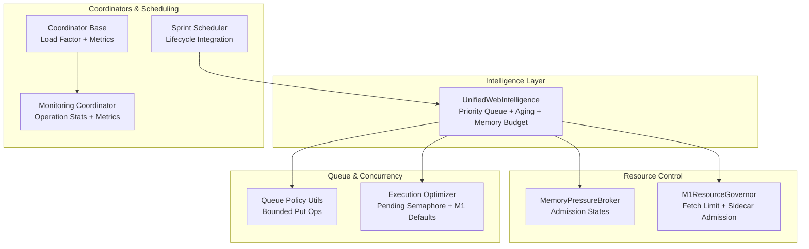
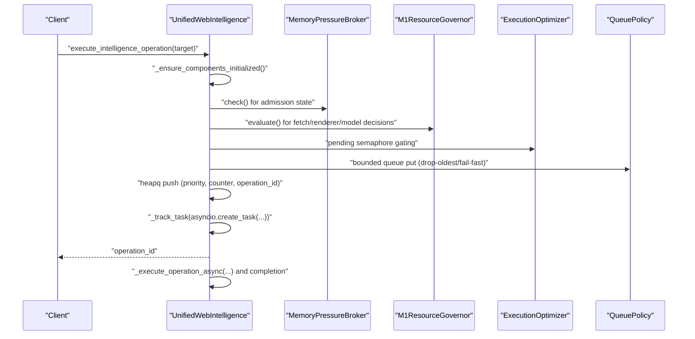
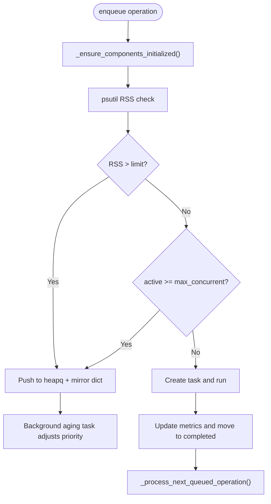
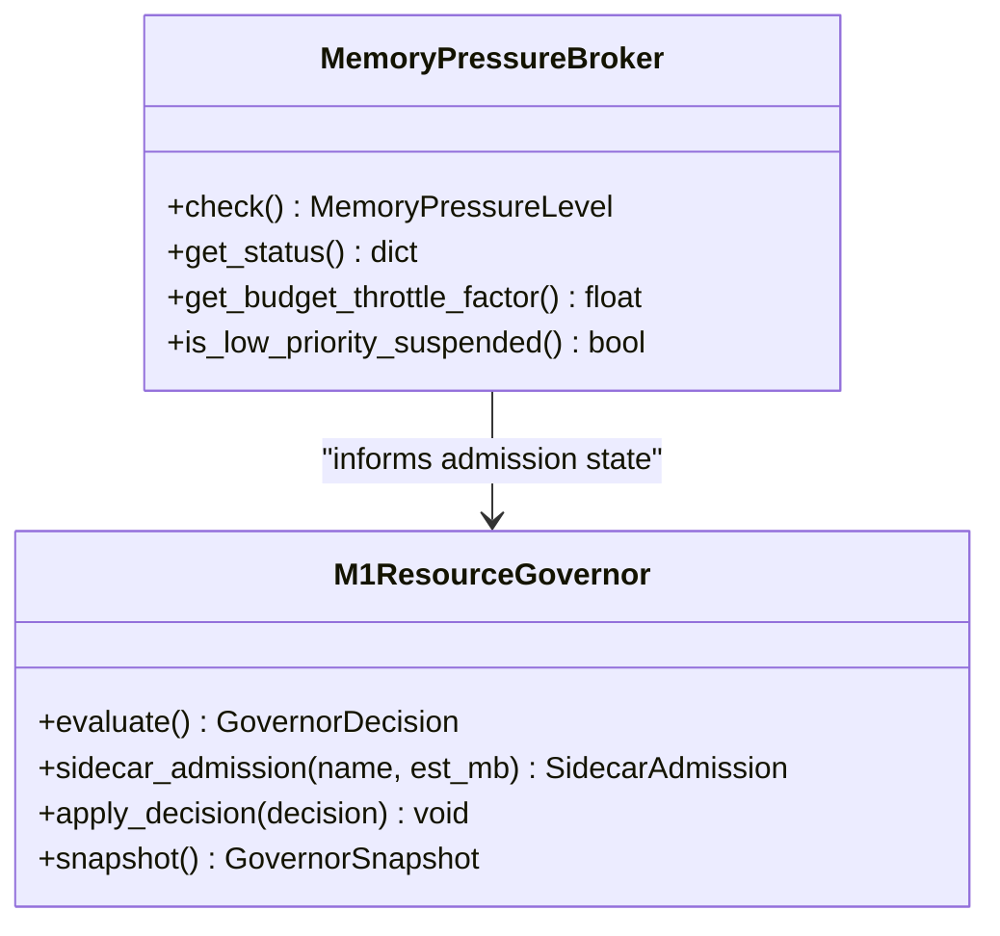
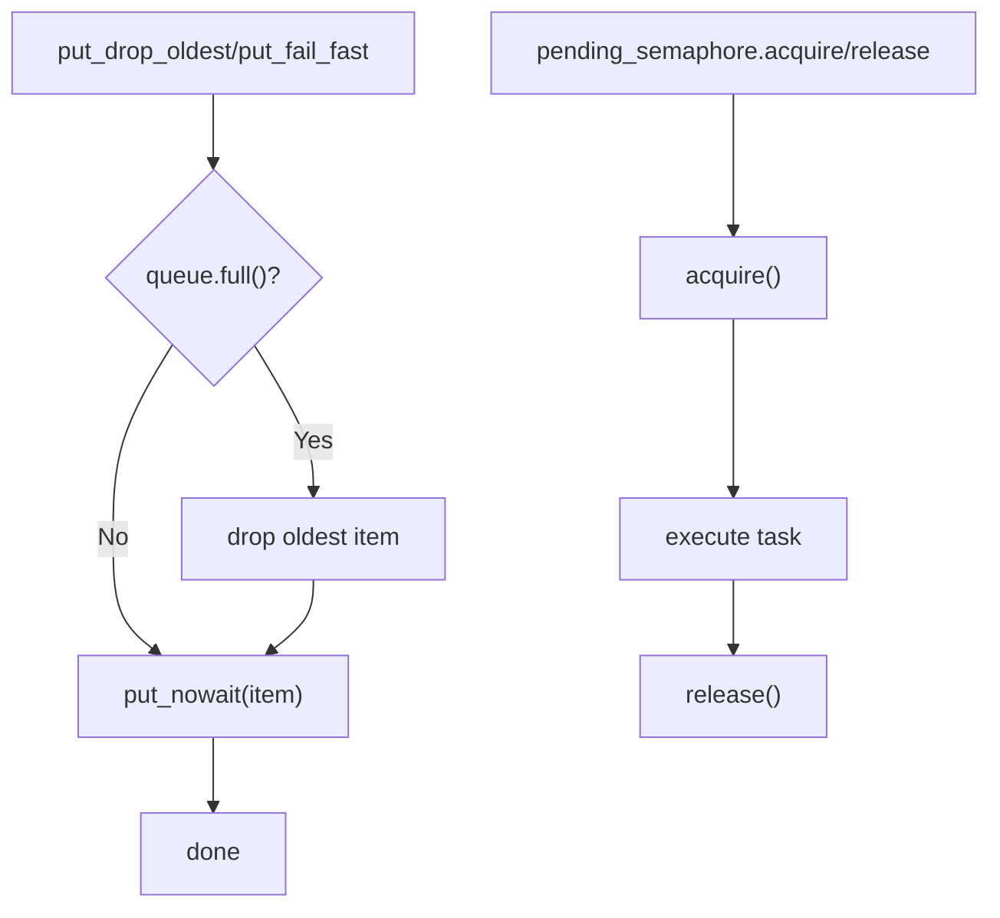
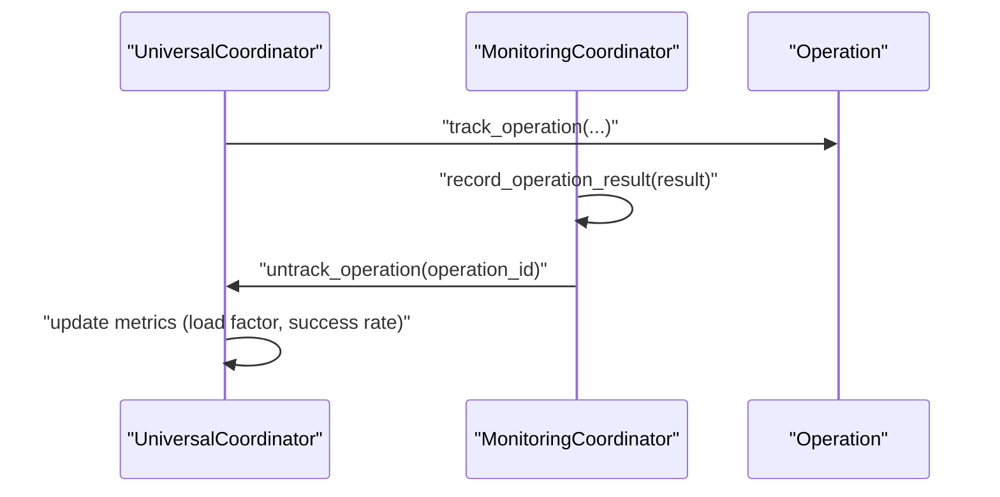
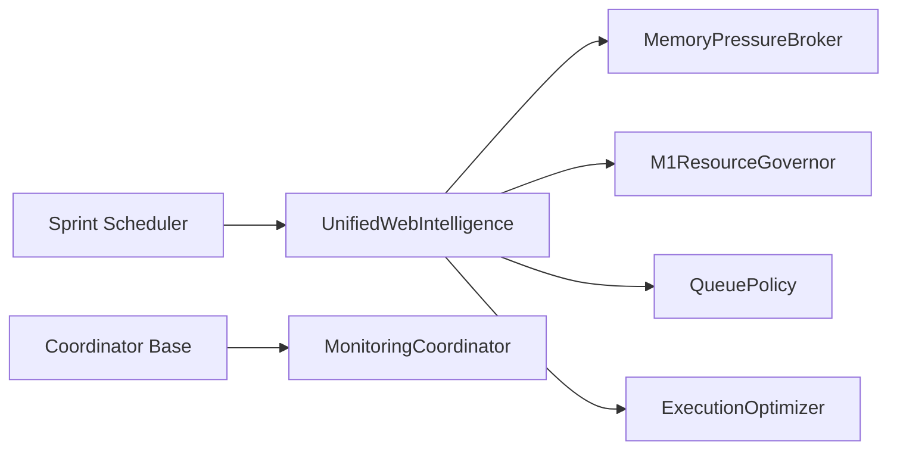

# Operation Management

<cite>
**Referenced Files in This Document**
- [web_intelligence.py](file://intelligence/web_intelligence.py)
- [memory_pressure_broker.py](file://orchestrator/memory_pressure_broker.py)
- [resource_governor.py](file://runtime/resource_governor.py)
- [queue_policy.py](file://utils/queue_policy.py)
- [execution_optimizer.py](file://utils/execution_optimizer.py)
- [M1_8GB_MEMORY_BUDGET.md](file://M1_8GB_MEMORY_BUDGET.md)
- [base.py](file://coordinators/base.py)
- [monitoring_coordinator.py](file://coordinators/monitoring_coordinator.py)
- [sprint_scheduler.py](file://runtime/sprint_scheduler.py)
</cite>

## Table of Contents
1. [Introduction](#introduction)
2. [Project Structure](#project-structure)
3. [Core Components](#core-components)
4. [Architecture Overview](#architecture-overview)
5. [Detailed Component Analysis](#detailed-component-analysis)
6. [Dependency Analysis](#dependency-analysis)
7. [Performance Considerations](#performance-considerations)
8. [Troubleshooting Guide](#troubleshooting-guide)
9. [Conclusion](#conclusion)
10. [Appendices](#appendices)

## Introduction
This document describes the unified operation execution system for intelligence operations, focusing on the IntelligenceTarget configuration and IntelligenceResult tracking, alongside a priority-based queuing system, bounded queue management, and memory pressure awareness tailored for M1 8GB environments. It documents the lazy initialization pattern, task ownership tracking, graceful degradation mechanisms, and provides examples of operation scheduling, priority aging, and resource management. It also covers operation lifecycle management, completion tracking, performance metrics collection, and configuration options for maximum concurrent operations, queue limits, and memory budget enforcement.

## Project Structure
The operation management system spans several modules:
- Intelligence orchestration and execution: UnifiedWebIntelligence with bounded queues, priority aging, and memory budget enforcement
- Memory pressure monitoring and admission control: MemoryPressureBroker and M1ResourceGovernor
- Queue policies and bounded concurrency: queue_policy utilities and execution_optimizer
- Coordinator base and monitoring: base coordinator patterns and monitoring coordinator metrics
- Runtime scheduling and lifecycle: sprint_scheduler integration points

**Diagram sources**
- [web_intelligence.py:115-200](file://intelligence/web_intelligence.py#L115-L200)
- [memory_pressure_broker.py:79-120](file://orchestrator/memory_pressure_broker.py#L79-L120)
- [resource_governor.py:116-140](file://runtime/resource_governor.py#L116-L140)
- [queue_policy.py:17-45](file://utils/queue_policy.py#L17-L45)
- [execution_optimizer.py:178-205](file://utils/execution_optimizer.py#L178-L205)
- [base.py:88-140](file://coordinators/base.py#L88-L140)
- [monitoring_coordinator.py:295-315](file://coordinators/monitoring_coordinator.py#L295-L315)
- [sprint_scheduler.py:1-40](file://runtime/sprint_scheduler.py#L1-L40)

**Section sources**
- [web_intelligence.py:115-200](file://intelligence/web_intelligence.py#L115-L200)
- [memory_pressure_broker.py:79-120](file://orchestrator/memory_pressure_broker.py#L79-L120)
- [resource_governor.py:116-140](file://runtime/resource_governor.py#L116-L140)
- [queue_policy.py:17-45](file://utils/queue_policy.py#L17-L45)
- [execution_optimizer.py:178-205](file://utils/execution_optimizer.py#L178-L205)
- [base.py:88-140](file://coordinators/base.py#L88-L140)
- [monitoring_coordinator.py:295-315](file://coordinators/monitoring_coordinator.py#L295-L315)
- [sprint_scheduler.py:1-40](file://runtime/sprint_scheduler.py#L1-L40)

## Core Components
- UnifiedWebIntelligence: central orchestrator for intelligence operations with:
  - IntelligenceTarget configuration and IntelligenceResult tracking
  - Priority-based queue with heapq and priority aging
  - Bounded queue management and mirror dictionary synchronization
  - Lazy initialization of optional components
  - Memory budget enforcement and task ownership tracking
  - Performance metrics collection and completion tracking
- MemoryPressureBroker: monitors macOS memory pressure and exposes admission states and throttle factors
- M1ResourceGovernor: advisory resource governance for fetch concurrency, renderer, and model load decisions
- QueuePolicy utilities: bounded queue put operations with drop-oldest and fail-fast strategies
- ExecutionOptimizer: bounded pending operations with M1-safe defaults and telemetry
- Coordinator base and MonitoringCoordinator: operation lifecycle, load factor, and metrics aggregation
- SprintScheduler: runtime integration points for lifecycle and windup barriers

**Section sources**
- [web_intelligence.py:115-200](file://intelligence/web_intelligence.py#L115-L200)
- [memory_pressure_broker.py:79-120](file://orchestrator/memory_pressure_broker.py#L79-L120)
- [resource_governor.py:116-140](file://runtime/resource_governor.py#L116-L140)
- [queue_policy.py:17-45](file://utils/queue_policy.py#L17-L45)
- [execution_optimizer.py:178-205](file://utils/execution_optimizer.py#L178-L205)
- [base.py:88-140](file://coordinators/base.py#L88-L140)
- [monitoring_coordinator.py:295-315](file://coordinators/monitoring_coordinator.py#L295-L315)
- [sprint_scheduler.py:2003-2022](file://runtime/sprint_scheduler.py#L2003-L2022)

## Architecture Overview
The unified operation execution system integrates intelligence orchestration with resource-aware controls and bounded concurrency:

**Diagram sources**
- [web_intelligence.py:344-427](file://intelligence/web_intelligence.py#L344-L427)
- [memory_pressure_broker.py:223-291](file://orchestrator/memory_pressure_broker.py#L223-L291)
- [resource_governor.py:137-217](file://runtime/resource_governor.py#L137-L217)
- [execution_optimizer.py:206-227](file://utils/execution_optimizer.py#L206-L227)
- [queue_policy.py:17-45](file://utils/queue_policy.py#L17-L45)

## Detailed Component Analysis

### UnifiedWebIntelligence: Priority-Based Queuing and Memory Budget Enforcement
- Priority-based queue:
  - Uses heapq with (priority, counter, operation_id) tuples
  - Priority mapping: low=3, medium=2, high=1, critical=0 (lower number = higher priority)
  - Queue bounds: _MAX_QUEUE and _MAX_QUEUED_OPS mirror protection against unbounded growth
- Priority aging:
  - Background task periodically decrements priority for long-queued operations
  - Aging threshold and interval configurable; shutdown via event for graceful exit
- Memory budget enforcement:
  - Lazy psutil.Process initialization with dead-process cache poisoning
  - Hard memory limit enforced (512 MB default) to reject new operations under pressure
- Lazy initialization:
  - Ensures components are initialized on first use with race-condition protection
- Task ownership tracking:
  - Tracks owned tasks with a hard cap on concurrent tasks
  - Symmetric cleanup via done callbacks
- Completion tracking and metrics:
  - Bounded FIFO eviction for completed operations
  - Metrics include totals, averages, and success rates

**Diagram sources**
- [web_intelligence.py:372-427](file://intelligence/web_intelligence.py#L372-L427)
- [web_intelligence.py:551-581](file://intelligence/web_intelligence.py#L551-L581)
- [web_intelligence.py:478-501](file://intelligence/web_intelligence.py#L478-L501)

**Section sources**
- [web_intelligence.py:142-199](file://intelligence/web_intelligence.py#L142-L199)
- [web_intelligence.py:372-427](file://intelligence/web_intelligence.py#L372-L427)
- [web_intelligence.py:503-524](file://intelligence/web_intelligence.py#L503-L524)
- [web_intelligence.py:551-581](file://intelligence/web_intelligence.py#L551-L581)
- [web_intelligence.py:529-549](file://intelligence/web_intelligence.py#L529-L549)

### MemoryPressureBroker and M1ResourceGovernor: Admission States and Budget Throttling
- MemoryPressureBroker:
  - Polls system memory pressure and exposes admission states
  - Throttle factor and low-priority suspension flags
  - Callbacks for warn/critical/normal transitions
- M1ResourceGovernor:
  - Advisory evaluation of fetch limits, renderer allowance, and model load decisions
  - Sidecar admission checks against UMA state and RSS thresholds
  - Snapshot and telemetry for dashboard rendering

**Diagram sources**
- [memory_pressure_broker.py:223-291](file://orchestrator/memory_pressure_broker.py#L223-L291)
- [resource_governor.py:137-217](file://runtime/resource_governor.py#L137-L217)

**Section sources**
- [memory_pressure_broker.py:79-120](file://orchestrator/memory_pressure_broker.py#L79-L120)
- [memory_pressure_broker.py:223-291](file://orchestrator/memory_pressure_broker.py#L223-L291)
- [resource_governor.py:116-140](file://runtime/resource_governor.py#L116-L140)
- [resource_governor.py:137-217](file://runtime/resource_governor.py#L137-L217)
- [resource_governor.py:219-290](file://runtime/resource_governor.py#L219-L290)

### Queue Policies and Bounded Concurrency
- QueuePolicy utilities:
  - put_drop_oldest: non-blocking put with oldest-item eviction
  - put_fail_fast: non-blocking put with immediate failure indication
- ExecutionOptimizer:
  - Bounded pending operations via asyncio.Semaphore
  - M1-safe default for pending operations (4) with environment override
  - Telemetry for throttling events

**Diagram sources**
- [queue_policy.py:17-45](file://utils/queue_policy.py#L17-L45)
- [execution_optimizer.py:178-205](file://utils/execution_optimizer.py#L178-L205)
- [execution_optimizer.py:206-227](file://utils/execution_optimizer.py#L206-L227)

**Section sources**
- [queue_policy.py:17-45](file://utils/queue_policy.py#L17-L45)
- [execution_optimizer.py:178-205](file://utils/execution_optimizer.py#L178-L205)
- [execution_optimizer.py:206-227](file://utils/execution_optimizer.py#L206-L227)

### Coordinator Base and MonitoringCoordinator: Lifecycle and Metrics
- UniversalCoordinator base:
  - Operation lifecycle tracking and load factor computation
  - Memory-aware scheduling with configurable thresholds
  - Metrics aggregation for operation results
- MonitoringCoordinator:
  - Records operation results and collects system metrics
  - Maintains operation statistics and cleans up tracking

**Diagram sources**
- [base.py:308-392](file://coordinators/base.py#L308-L392)
- [monitoring_coordinator.py:295-315](file://coordinators/monitoring_coordinator.py#L295-L315)
- [monitoring_coordinator.py:964-1003](file://coordinators/monitoring_coordinator.py#L964-L1003)

**Section sources**
- [base.py:88-140](file://coordinators/base.py#L88-L140)
- [base.py:308-392](file://coordinators/base.py#L308-L392)
- [monitoring_coordinator.py:295-315](file://coordinators/monitoring_coordinator.py#L295-L315)
- [monitoring_coordinator.py:964-1003](file://coordinators/monitoring_coordinator.py#L964-L1003)

### Sprint Scheduler Integration
- The scheduler coordinates lifecycle and windup barriers, ensuring that scheduling and runtime execution respect lifecycle transitions and pre-dispatch checkpoints.

**Section sources**
- [sprint_scheduler.py:2003-2022](file://runtime/sprint_scheduler.py#L2003-L2022)

## Dependency Analysis
The operation management system exhibits clear separation of concerns:
- Intelligence orchestration depends on resource control for admission and budget decisions
- Queue policies and execution optimizer enforce bounded concurrency and prevent unbounded task creation
- Coordinators provide lifecycle and metrics integration
- Runtime scheduler ensures lifecycle correctness

**Diagram sources**
- [web_intelligence.py:115-200](file://intelligence/web_intelligence.py#L115-L200)
- [memory_pressure_broker.py:79-120](file://orchestrator/memory_pressure_broker.py#L79-L120)
- [resource_governor.py:116-140](file://runtime/resource_governor.py#L116-L140)
- [queue_policy.py:17-45](file://utils/queue_policy.py#L17-L45)
- [execution_optimizer.py:178-205](file://utils/execution_optimizer.py#L178-L205)
- [base.py:88-140](file://coordinators/base.py#L88-L140)
- [monitoring_coordinator.py:295-315](file://coordinators/monitoring_coordinator.py#L295-L315)
- [sprint_scheduler.py:1-40](file://runtime/sprint_scheduler.py#L1-L40)

**Section sources**
- [web_intelligence.py:115-200](file://intelligence/web_intelligence.py#L115-L200)
- [memory_pressure_broker.py:79-120](file://orchestrator/memory_pressure_broker.py#L79-L120)
- [resource_governor.py:116-140](file://runtime/resource_governor.py#L116-L140)
- [queue_policy.py:17-45](file://utils/queue_policy.py#L17-L45)
- [execution_optimizer.py:178-205](file://utils/execution_optimizer.py#L178-L205)
- [base.py:88-140](file://coordinators/base.py#L88-L140)
- [monitoring_coordinator.py:295-315](file://coordinators/monitoring_coordinator.py#L295-L315)
- [sprint_scheduler.py:1-40](file://runtime/sprint_scheduler.py#L1-L40)

## Performance Considerations
- M1 8GB memory budget:
  - Unified memory architecture with hard ceiling and warning threshold
  - Practical headroom and safe operating range documented
- Bounded concurrency and pending operations:
  - M1-safe defaults and environment overrides to prevent Metal memory pressure
- Priority aging:
  - Prevents starvation by gradually increasing priority of queued operations
- Memory pressure awareness:
  - Integration with MemoryPressureBroker and M1ResourceGovernor for admission and throttle decisions

**Section sources**
- [M1_8GB_MEMORY_BUDGET.md:1-136](file://M1_8GB_MEMORY_BUDGET.md#L1-L136)
- [execution_optimizer.py:189-204](file://utils/execution_optimizer.py#L189-L204)
- [web_intelligence.py:551-581](file://intelligence/web_intelligence.py#L551-L581)
- [memory_pressure_broker.py:223-291](file://orchestrator/memory_pressure_broker.py#L223-L291)
- [resource_governor.py:178-204](file://runtime/resource_governor.py#L178-L204)

## Troubleshooting Guide
Common issues and mitigations:
- Queue full or rejected operations:
  - Check queue health and aging status; verify queue limits and mirror dictionary synchronization
- Memory pressure spikes:
  - Inspect memory posture and admission state; confirm throttle factor and low-priority suspension
- Task ownership overflow:
  - Verify owned task cap and cleanup via done callbacks
- Degraded mode:
  - Confirm optional component availability and fallback behavior

**Section sources**
- [web_intelligence.py:214-228](file://intelligence/web_intelligence.py#L214-L228)
- [web_intelligence.py:231-258](file://intelligence/web_intelligence.py#L231-L258)
- [web_intelligence.py:530-549](file://intelligence/web_intelligence.py#L530-L549)
- [memory_pressure_broker.py:293-306](file://orchestrator/memory_pressure_broker.py#L293-L306)

## Conclusion
The unified operation execution system provides a robust, memory-aware framework for managing intelligence operations. It combines priority-based queuing with bounded concurrency, memory budget enforcement, and graceful degradation. The integration of admission control and resource governance ensures safe operation on M1 8GB systems, while lifecycle management and metrics collection support observability and reliability.

## Appendices

### Configuration Options
- UnifiedWebIntelligence:
  - max_concurrent_operations: maximum concurrent operations
  - enable_flashattention: enable flashattention acceleration
  - enable_osint: enable OSINT aggregator
  - enable_stealth: enable stealth features
  - completed_operations_limit: bounded FIFO eviction limit for completed operations
- ExecutionOptimizer:
  - HLEDAC_MAX_PENDING_OPS: environment override for pending operations (sanitized 1–16)
- MemoryPressureBroker:
  - poll_interval: fallback polling interval
- M1ResourceGovernor:
  - Fetch semaphore limits and sidecar admission thresholds

**Section sources**
- [web_intelligence.py:192-196](file://intelligence/web_intelligence.py#L192-L196)
- [execution_optimizer.py:189-204](file://utils/execution_optimizer.py#L189-L204)
- [memory_pressure_broker.py:96-103](file://orchestrator/memory_pressure_broker.py#L96-L103)
- [resource_governor.py:52-58](file://runtime/resource_governor.py#L52-L58)