# Threat Assessment Module

<cite>
**Referenced Files in This Document**
- [threat-intelligence-automation.py](file://hledac/universal/security/automation/threat-intelligence-automation.py)
- [web_intelligence.py](file://hledac/universal/intelligence/web_intelligence.py)
- [confidence_policy.py](file://hledac/universal/intelligence/confidence_policy.py)
- [scoring.py](file://hledac/universal/tools/scoring.py)
- [attribution_scorer.py](file://hledac/universal/intelligence/attribution_scorer.py)
- [exposure_correlator.py](file://hledac/universal/intelligence/exposure_correlator.py)
- [network_intelligence.py](file://hledac/universal/intelligence/network_intelligence.py)
- [data_leak_hunter.py](file://hledac/universal/intelligence/data_leak_hunter.py)
- [github_secret_scanner.py](file://hledac/universal/intelligence/github_secret_scanner.py)
- [pattern_mining.py](file://hledac/universal/intelligence/pattern_mining.py)
</cite>

## Table of Contents
1. [Introduction](#introduction)
2. [Project Structure](#project-structure)
3. [Core Components](#core-components)
4. [Architecture Overview](#architecture-overview)
5. [Detailed Component Analysis](#detailed-component-analysis)
6. [Dependency Analysis](#dependency-analysis)
7. [Performance Considerations](#performance-considerations)
8. [Troubleshooting Guide](#troubleshooting-guide)
9. [Conclusion](#conclusion)

## Introduction
The Threat Assessment Module provides a comprehensive framework for analyzing collected intelligence, detecting personal threats, identifying vulnerability patterns, and calculating risk scores. It integrates with web scraping and OSINT data sources, applies deterministic confidence scoring, and supports automated risk assessment processes. The module offers configuration options for sensitivity and assessment parameters, enabling tailored threat detection across diverse environments.

## Project Structure
The Threat Assessment Module spans several components:
- Security automation and threat intelligence aggregation
- Web intelligence and OSINT integration
- Confidence scoring and attribution analysis
- Vulnerability pattern recognition and exposure correlation
- Network intelligence and data leak monitoring
- GitHub secret scanning and pattern mining

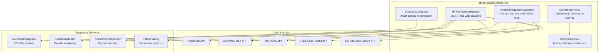

**Diagram sources**
- [threat-intelligence-automation.py:70-172](file://hledac/universal/security/automation/threat-intelligence-automation.py#L70-L172)
- [web_intelligence.py:115-200](file://hledac/universal/intelligence/web_intelligence.py#L115-L200)
- [confidence_policy.py:84-158](file://hledac/universal/intelligence/confidence_policy.py#L84-L158)
- [attribution_scorer.py:136-162](file://hledac/universal/intelligence/attribution_scorer.py#L136-L162)
- [exposure_correlator.py:351-463](file://hledac/universal/intelligence/exposure_correlator.py#L351-L463)

**Section sources**
- [threat-intelligence-automation.py:70-172](file://hledac/universal/security/automation/threat-intelligence-automation.py#L70-L172)
- [web_intelligence.py:115-200](file://hledac/universal/intelligence/web_intelligence.py#L115-L200)

## Core Components
This section outlines the primary components that form the Threat Assessment Module.

### ThreatIntelligenceAutomation
The central automation class manages continuous threat intelligence gathering, analysis, and automated defense actions. It maintains threat intelligence databases, active alerts, and defense actions, and coordinates with external threat sources.

Key responsibilities:
- Continuous threat intelligence gathering from multiple sources
- Threat analysis and alert generation
- Automated defense action execution
- Report generation and recommendation synthesis

Configuration highlights:
- Threat intelligence sources (abuse.ch, VirusTotal, AlienVault, NVD)
- Automated defense policies (blocking, rate limiting, patching)
- Monitoring capabilities (log analysis, network monitoring, behavior analysis)

**Section sources**
- [threat-intelligence-automation.py:70-172](file://hledac/universal/security/automation/threat-intelligence-automation.py#L70-L172)
- [threat-intelligence-automation.py:85-118](file://hledac/universal/security/automation/threat-intelligence-automation.py#L85-L118)

### UnifiedWebIntelligence
Provides OSINT scraping and threat analysis utilities with bounded queues and graceful degradation. Integrates web scraping, OSINT collection, threat assessment, and vulnerability analysis into a unified workflow.

Key features:
- Bounded queue management with priority aging
- Lazy component initialization
- Memory pressure awareness for constrained environments
- Comprehensive intelligence result tracking

**Section sources**
- [web_intelligence.py:115-200](file://hledac/universal/intelligence/web_intelligence.py#L115-L200)
- [web_intelligence.py:344-428](file://hledac/universal/intelligence/web_intelligence.py#L344-L428)

### ConfidencePolicy
Implements deterministic confidence scoring for findings based on source families, provenance, IOC presence, corroboration, and rejections. Provides bounded confidence values with configurable bonuses and penalties.

Key aspects:
- Source family baselines (FEED, PUBLIC, CT, WAYBACK, PASSIVE_DNS, SOCIAL, PLANNER, STEALTH)
- Provenance, IOC, and corroboration bonuses
- Rejection penalties with minimum confidence bounds
- Model score override capability

**Section sources**
- [confidence_policy.py:84-158](file://hledac/universal/intelligence/confidence_policy.py#L84-L158)

### AttributionScorer
Scores identity candidate pairs using multiple attribution factors including email domain matches, username pattern similarity, temporal overlap, shared infrastructure, PGP key correlation, social profile overlap, and bio-link overlap. Provides explainable confidence scores with factor breakdowns.

**Section sources**
- [attribution_scorer.py:136-162](file://hledac/universal/intelligence/attribution_scorer.py#L136-L162)
- [attribution_scorer.py:480-561](file://hledac/universal/intelligence/attribution_scorer.py#L480-L561)

### ExposureCorrelator
Correlates asset exposure signals into explainable findings, combining certificate transparency data, open storage detections, JARM fingerprints, and passive DNS information. Produces exposure findings with confidence scores and suggested pivots.

**Section sources**
- [exposure_correlator.py:351-463](file://hledac/universal/intelligence/exposure_correlator.py#L351-L463)
- [exposure_correlator.py:666-707](file://hledac/universal/intelligence/exposure_correlator.py#L666-L707)

## Architecture Overview
The Threat Assessment Module follows a layered architecture with clear separation of concerns:

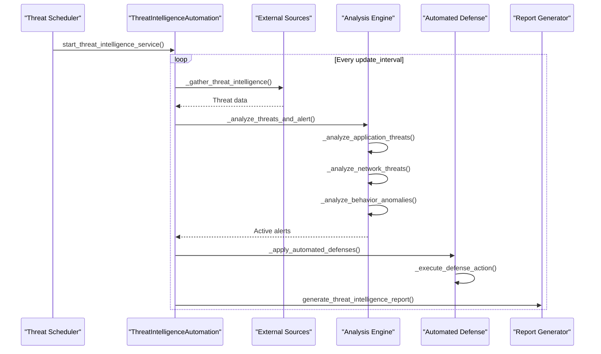

**Diagram sources**
- [threat-intelligence-automation.py:157-172](file://hledac/universal/security/automation/threat-intelligence-automation.py#L157-L172)
- [threat-intelligence-automation.py:325-332](file://hledac/universal/security/automation/threat-intelligence-automation.py#L325-L332)
- [threat-intelligence-automation.py:513-529](file://hledac/universal/security/automation/threat-intelligence-automation.py#L513-L529)

The architecture supports:
- Asynchronous threat intelligence gathering
- Multi-layered threat analysis
- Automated defense actions
- Comprehensive reporting and recommendations

## Detailed Component Analysis

### Threat Analysis Algorithms
The module implements several threat analysis algorithms:

#### Application Threat Detection
Matches threat indicators against application endpoints using IP address and domain validation:

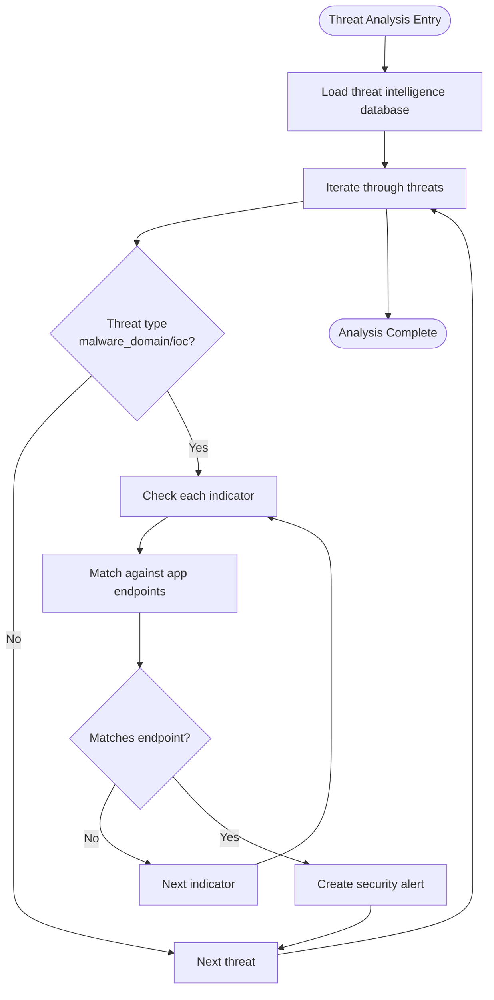

**Diagram sources**
- [threat-intelligence-automation.py:333-357](file://hledac/universal/security/automation/threat-intelligence-automation.py#L333-L357)
- [threat-intelligence-automation.py:358-380](file://hledac/universal/security/automation/threat-intelligence-automation.py#L358-L380)

#### Network Threat Analysis
Analyzes access logs for suspicious patterns using regular expression matching:

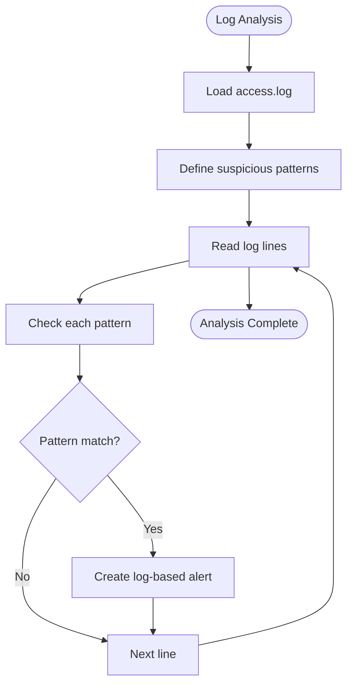

**Diagram sources**
- [threat-intelligence-automation.py:404-447](file://hledac/universal/security/automation/threat-intelligence-automation.py#L404-L447)

#### Behavior Anomaly Detection
Monitors system metrics and detects anomalies using threshold-based comparisons:

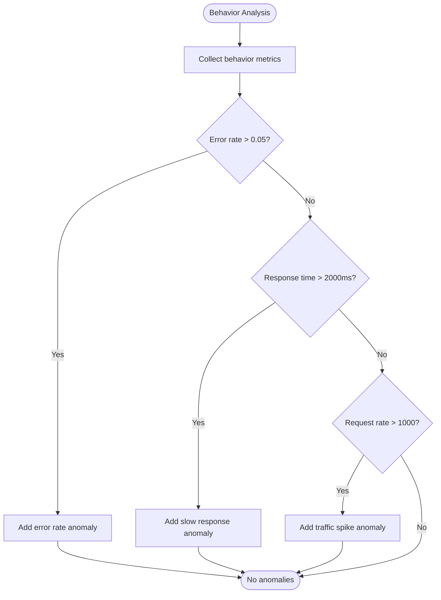

**Diagram sources**
- [threat-intelligence-automation.py:486-496](file://hledac/universal/security/automation/threat-intelligence-automation.py#L486-L496)
- [threat-intelligence-automation.py:498-511](file://hledac/universal/security/automation/threat-intelligence-automation.py#L498-L511)

### Risk Scoring Mechanisms
The module employs multiple risk scoring approaches:

#### Deterministic Confidence Scoring
Uses a structured formula to compute confidence scores:

```
confidence = base + Σ(provenance_bonus) + Σ(IOB_bonus) + Σ(corroboration_bonus)
           - Σ(rejection_penalty)
```

Where:
- Base confidence from source family
- Provenance bonus (+0.05) for verified provenance pointers
- IOC bonus (+0.10) for indicators of compromise
- Corroboration bonus (+0.05 per source, capped at 4)
- Rejection penalty (-0.10 per rejection)
- Clamped to [0.10, 0.95]

**Section sources**
- [confidence_policy.py:84-158](file://hledac/universal/intelligence/confidence_policy.py#L84-L158)

#### Attribution Confidence Scoring
Computes identity attribution confidence using weighted factors:

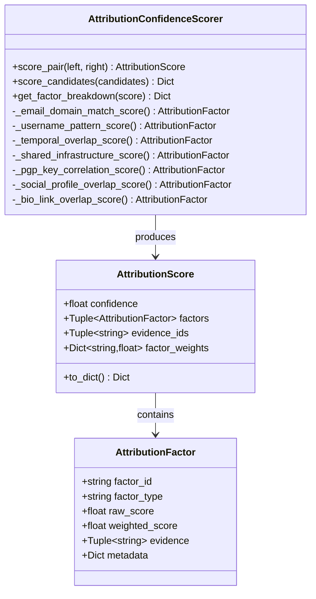

**Diagram sources**
- [attribution_scorer.py:136-162](file://hledac/universal/intelligence/attribution_scorer.py#L136-L162)
- [attribution_scorer.py:59-75](file://hledac/universal/intelligence/attribution_scorer.py#L59-L75)
- [attribution_scorer.py:47-57](file://hledac/universal/intelligence/attribution_scorer.py#L47-L57)

**Section sources**
- [attribution_scorer.py:480-561](file://hledac/universal/intelligence/attribution_scorer.py#L480-L561)

### Security Indicator Analysis
The module analyzes various security indicators from collected intelligence:

#### Web Security Indicators
Analyzes web data for:
- SSL certificate configurations
- HTTP security headers
- Vulnerability patterns
- Suspicious content indicators

#### Personal Threat Detection
Evaluates OSINT data for:
- Social media exposure levels
- Contact information exposure
- Identity-related risks

**Section sources**
- [web_intelligence.py:750-762](file://hledac/universal/intelligence/web_intelligence.py#L750-L762)
- [web_intelligence.py:764-788](file://hledac/universal/intelligence/web_intelligence.py#L764-L788)

### Vulnerability Pattern Recognition
Combines multiple data sources to identify and correlate vulnerabilities:

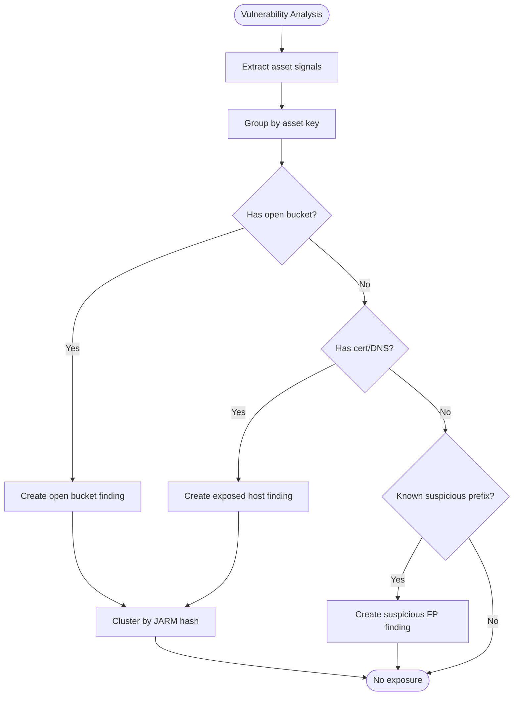

**Diagram sources**
- [exposure_correlator.py:353-463](file://hledac/universal/intelligence/exposure_correlator.py#L353-L463)
- [exposure_correlator.py:468-502](file://hledac/universal/intelligence/exposure_correlator.py#L468-L502)
- [exposure_correlator.py:505-559](file://hledac/universal/intelligence/exposure_correlator.py#L505-L559)

**Section sources**
- [exposure_correlator.py:353-463](file://hledac/universal/intelligence/exposure_correlator.py#L353-L463)

### Threat Level Calculation Methodology
The module calculates threat levels through a multi-factor scoring system:

#### Threat Score Calculation
```python
# From web_intelligence.py
threat_score = (security_analysis.risk_score * 0.3) + 
               (personal_threats.risk_score * 0.7)
```

#### Severity Mapping
- Low: 0.0 - 0.3
- Medium: 0.3 - 0.6
- High: 0.6 - 0.8
- Critical: 0.8 - 1.0

**Section sources**
- [web_intelligence.py:790-800](file://hledac/universal/intelligence/web_intelligence.py#L790-L800)

### Confidence Scoring Implementation
The confidence scoring system provides deterministic, bounded confidence values:

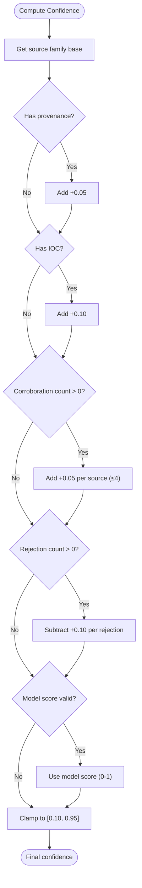

**Diagram sources**
- [confidence_policy.py:84-158](file://hledac/universal/intelligence/confidence_policy.py#L84-L158)

**Section sources**
- [confidence_policy.py:84-158](file://hledac/universal/intelligence/confidence_policy.py#L84-L158)

### Mitigation Strategy Recommendations
The module generates automated mitigation strategies based on threat analysis:

#### Automated Defense Actions
- Block malicious IPs and domains
- Apply rate limiting to suspicious entities
- Update security rules based on threat intelligence
- Enhance monitoring for suspicious activities

#### Manual Recommendations
- Immediate action for critical alerts
- IP reputation scoring implementation
- Domain blocking policy reviews
- High defensive activity investigation

**Section sources**
- [threat-intelligence-automation.py:531-555](file://hledac/universal/security/automation/threat-intelligence-automation.py#L531-L555)
- [threat-intelligence-automation.py:706-733](file://hledac/universal/security/automation/threat-intelligence-automation.py#L706-L733)

### Examples of Threat Assessment Workflows
The module supports several assessment workflows:

#### Continuous Threat Intelligence Workflow
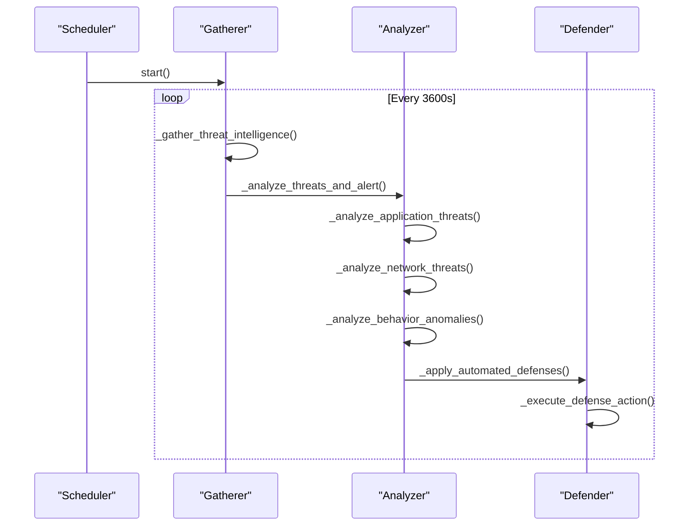

**Diagram sources**
- [threat-intelligence-automation.py:157-172](file://hledac/universal/security/automation/threat-intelligence-automation.py#L157-L172)

#### Web Intelligence Assessment Workflow
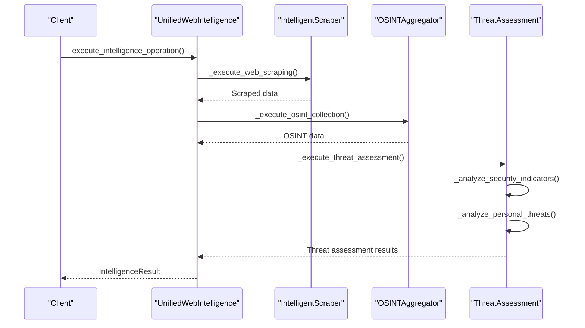

**Diagram sources**
- [web_intelligence.py:344-428](file://hledac/universal/intelligence/web_intelligence.py#L344-L428)
- [web_intelligence.py:691-725](file://hledac/universal/intelligence/web_intelligence.py#L691-L725)

### Risk Factor Evaluation
The module evaluates multiple risk factors:

#### Security Header Analysis
Analyzes HTTP security headers for:
- Content Security Policy (CSP)
- Strict Transport Security (HSTS)
- X-Frame-Options
- X-Content-Type-Options
- Referrer-Policy

#### Personal Risk Factors
Evaluates personal information exposure:
- Social media platform counts
- Email address exposure
- Professional profile completeness
- Contact information visibility

**Section sources**
- [web_intelligence.py:750-762](file://hledac/universal/intelligence/web_intelligence.py#L750-L762)

### Integration with Web Scraping and OSINT
The module integrates with various data sources:

#### External API Integration
- VirusTotal API for file reputation
- AlienVault OTX for IOCs
- NVD CVE API for vulnerability intelligence
- HaveIBeenPwned for breach monitoring
- GitHub Code Search for secret detection

#### Network Intelligence Integration
- BGP lookup via pybgpstream
- DNS-over-HTTPS resolution
- ASN information integration

**Section sources**
- [threat-intelligence-automation.py:120-147](file://hledac/universal/security/automation/threat-intelligence-automation.py#L120-L147)
- [network_intelligence.py:29-97](file://hledac/universal/intelligence/network_intelligence.py#L29-L97)

### Threat Scoring Thresholds
The module defines configurable thresholds:

#### Confidence Thresholds
- Critical: > 0.90
- High: > 0.70
- Medium: > 0.50
- Low: ≤ 0.50

#### Defense Action Thresholds
- Automatic blocking: severity "critical" or "high"
- Enhanced monitoring: confidence > 0.80
- Rate limiting: suspicious IP patterns

**Section sources**
- [threat-intelligence-automation.py:382-393](file://hledac/universal/security/automation/threat-intelligence-automation.py#L382-L393)

### Automated Risk Assessment Processes
The module automates risk assessment through:

#### Continuous Monitoring
- Periodic threat intelligence updates
- Real-time log analysis
- Behavior anomaly detection
- Automated defense actions

#### Decision Logic
```python
if threat.severity in ["critical", "high"] and threat.threat_type in ["malware_domain", "ioc"]:
    return "block_ip_domain"
elif threat.threat_type == "vulnerability" and threat.severity in ["critical", "high"]:
    return "update_rules"
elif threat.confidence > 0.8:
    return "enhance_monitoring"
```

**Section sources**
- [threat-intelligence-automation.py:382-393](file://hledac/universal/security/automation/threat-intelligence-automation.py#L382-L393)

### Configuration Options
The module provides extensive configuration options:

#### Threat Intelligence Configuration
- Enable/disable threat intelligence sources
- Update intervals (default: 3600 seconds)
- Retention periods (default: 90 days)
- Confidence thresholds (default: 0.7)

#### Automated Defense Configuration
- Block suspicious IPs (enabled)
- Rate limit offenders (enabled)
- Auto-patch vulnerabilities (disabled)
- Isolate compromised systems (enabled)
- Defense timeout (300 seconds)

#### Monitoring Configuration
- Log analysis (enabled)
- Network monitoring (enabled)
- Behavior analysis (enabled)
- Anomaly detection (enabled)

**Section sources**
- [threat-intelligence-automation.py:85-118](file://hledac/universal/security/automation/threat-intelligence-automation.py#L85-L118)

## Dependency Analysis
The Threat Assessment Module exhibits the following dependency relationships:

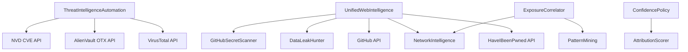

**Diagram sources**
- [threat-intelligence-automation.py:120-147](file://hledac/universal/security/automation/threat-intelligence-automation.py#L120-L147)
- [web_intelligence.py:303-343](file://hledac/universal/intelligence/web_intelligence.py#L303-L343)
- [exposure_correlator.py:351-463](file://hledac/universal/intelligence/exposure_correlator.py#L351-L463)

The module demonstrates:
- Loose coupling between components
- Clear separation of concerns
- Extensible threat source integration
- Configurable defense mechanisms

**Section sources**
- [threat-intelligence-automation.py:120-147](file://hledac/universal/security/automation/threat-intelligence-automation.py#L120-L147)
- [web_intelligence.py:303-343](file://hledac/universal/intelligence/web_intelligence.py#L303-L343)

## Performance Considerations
The module incorporates several performance optimizations:

### Memory Management
- Bounded queue limits (500 operations)
- Memory pressure awareness for M1 8GB environments
- Lazy component initialization
- Garbage collection optimization

### Concurrency Control
- Asynchronous threat intelligence gathering
- Parallel operation execution
- Circuit breaker patterns for external APIs
- Rate limiting for API calls

### Resource Optimization
- M1-optimized algorithms (MLX acceleration)
- Streaming statistics for large datasets
- Memory-efficient sliding windows
- Bounded data structures

## Troubleshooting Guide
Common issues and resolutions:

### Threat Intelligence Gathering Issues
- **API Key Configuration**: Ensure proper API key setup for external services
- **Network Connectivity**: Verify outbound connectivity to threat intelligence sources
- **Rate Limiting**: Monitor and handle API rate limits appropriately

### Analysis Performance Issues
- **Memory Pressure**: Monitor RSS usage and adjust queue limits
- **Timeout Errors**: Increase timeout values for slow external APIs
- **Queue Backlog**: Implement aging mechanisms for queued operations

### Defense Action Failures
- **Permission Issues**: Verify system permissions for firewall updates
- **Configuration Errors**: Check security configuration file syntax
- **Resource Constraints**: Monitor system resources during defense actions

**Section sources**
- [threat-intelligence-automation.py:163-171](file://hledac/universal/security/automation/threat-intelligence-automation.py#L163-L171)
- [web_intelligence.py:393-405](file://hledac/universal/intelligence/web_intelligence.py#L393-L405)

## Conclusion
The Threat Assessment Module provides a robust, extensible framework for comprehensive threat analysis and risk assessment. Its modular architecture supports integration with multiple data sources, deterministic confidence scoring, automated defense actions, and detailed reporting. The module's design emphasizes performance, reliability, and configurability, making it suitable for diverse threat assessment scenarios across different environments and use cases.