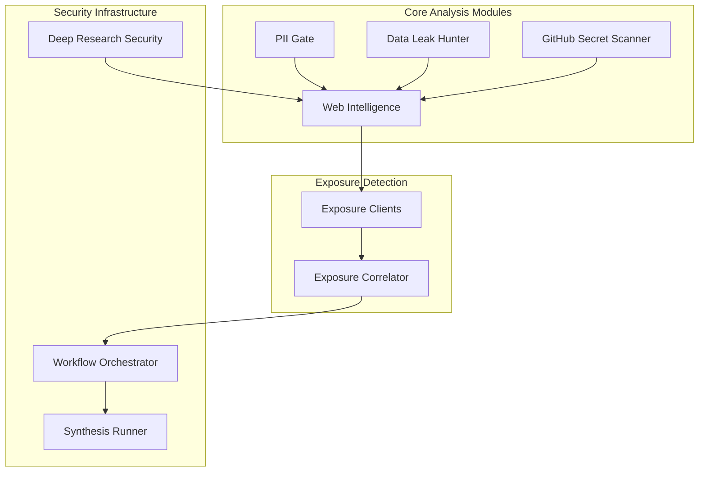
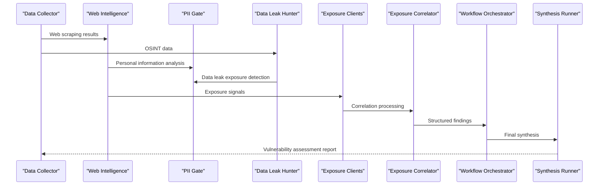
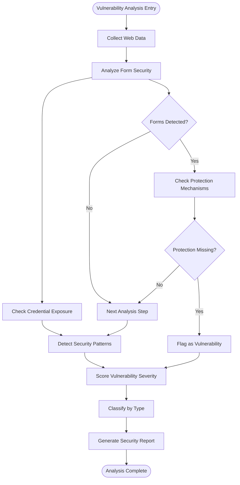
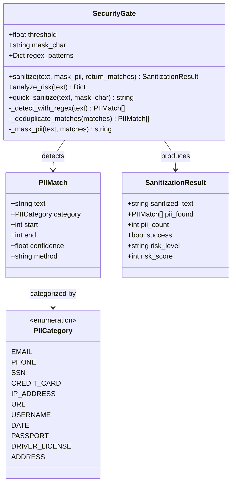
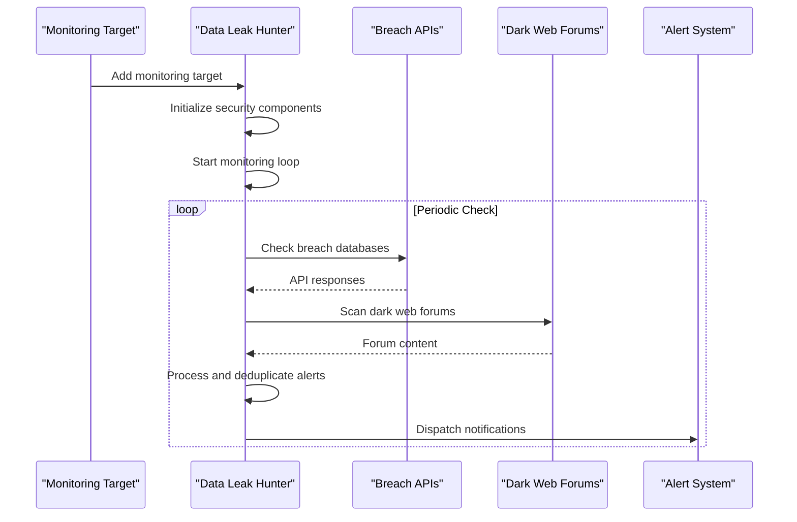
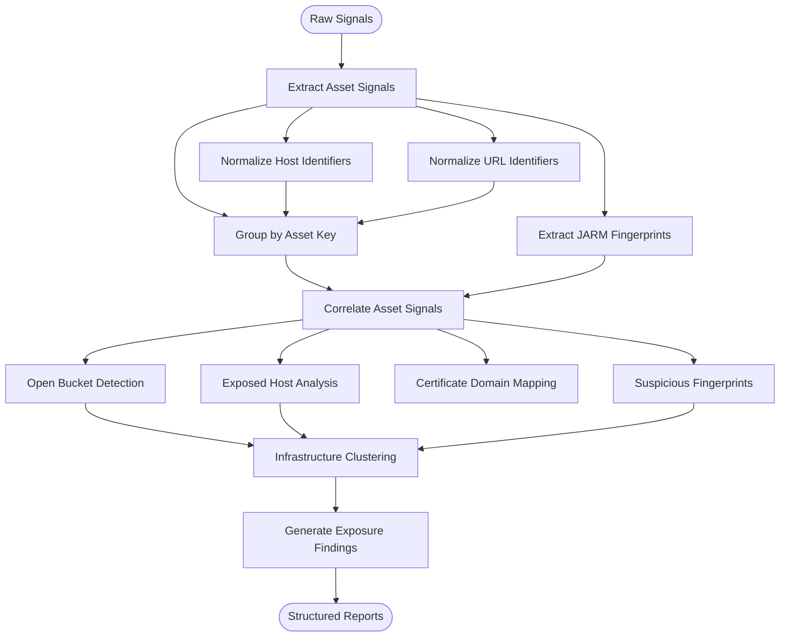
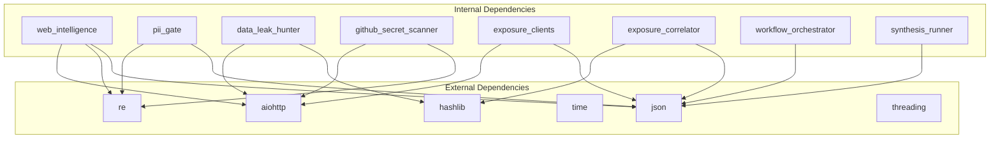

# Vulnerability Analysis Engine

<cite>
**Referenced Files in This Document**
- [web_intelligence.py](file://intelligence/web_intelligence.py)
- [pii_gate.py](file://security/pii_gate.py)
- [data_leak_hunter.py](file://intelligence/data_leak_hunter.py)
- [github_secret_scanner.py](file://intelligence/github_secret_scanner.py)
- [exposure_clients.py](file://intelligence/exposure_clients.py)
- [exposure_correlator.py](file://intelligence/exposure_correlator.py)
- [deep_research_security.py](file://security/deep_research_security.py)
- [workflow_orchestrator.py](file://intelligence/workflow_orchestrator.py)
- [synthesis_runner.py](file://brain/synthesis_runner.py)
</cite>

## Table of Contents
1. [Introduction](#introduction)
2. [Project Structure](#project-structure)
3. [Core Components](#core-components)
4. [Architecture Overview](#architecture-overview)
5. [Detailed Component Analysis](#detailed-component-analysis)
6. [Dependency Analysis](#dependency-analysis)
7. [Performance Considerations](#performance-considerations)
8. [Troubleshooting Guide](#troubleshooting-guide)
9. [Conclusion](#conclusion)

## Introduction
The Vulnerability Analysis Engine is a comprehensive security analysis framework designed to identify weaknesses in collected data from web scraping and OSINT sources. It integrates multiple detection mechanisms including web vulnerability scanning, personal information exposure detection, security pattern recognition, and automated exposure correlation. The engine provides a unified approach to threat assessment, vulnerability classification, severity scoring, and remediation recommendations while maintaining strict privacy controls and operational security.

## Project Structure
The Vulnerability Analysis Engine is organized around several key modules that work together to provide comprehensive security analysis:

**Diagram sources**
- [web_intelligence.py:310-338](file://intelligence/web_intelligence.py#L310-L338)
- [exposure_clients.py:175-264](file://intelligence/exposure_clients.py#L175-L264)
- [exposure_correlator.py:666-708](file://intelligence/exposure_correlator.py#L666-L708)

**Section sources**
- [web_intelligence.py:310-338](file://intelligence/web_intelligence.py#L310-L338)
- [exposure_clients.py:175-264](file://intelligence/exposure_clients.py#L175-L264)
- [exposure_correlator.py:666-708](file://intelligence/exposure_correlator.py#L666-L708)

## Core Components

### Web Intelligence Analysis
The Web Intelligence module serves as the central hub for vulnerability detection, implementing sophisticated algorithms for analyzing web scraping results and OSINT data for security weaknesses.

Key capabilities include:
- **Web Vulnerability Detection**: Automated scanning for exposed forms, insecure configurations, and security misconfigurations
- **Security Indicator Analysis**: SSL certificate evaluation, security header inspection, and suspicious content detection
- **Personal Threat Assessment**: Comprehensive analysis of personal information exposure risks
- **Integration Framework**: Seamless integration with scraping results and OSINT data streams

### Personal Information Protection (PII Gate)
A lightweight, regex-based system for detecting and sanitizing personally identifiable information with built-in fallback mechanisms for fail-safe operation.

Core features:
- **Multi-category Detection**: Email addresses, phone numbers, Social Security Numbers, credit cards, IP addresses, URLs, usernames, dates, passports, driver licenses, and addresses
- **Risk Scoring**: Quantified risk assessment based on PII density and exposure patterns
- **Privacy Controls**: Configurable masking and sanitization with international pattern support
- **Performance Optimization**: Memory-efficient processing optimized for M1 8GB RAM environments

### Data Leak Monitoring
Advanced breach and data leak monitoring system with real-time alerting capabilities and temporal anonymization for stealth operations.

Detection capabilities:
- **Breach API Integration**: HaveIBeenPwned, DeHashed, Intelligence X, LeakLookup connectivity
- **Dark Web Monitoring**: Tor/I2P breach forum scraping and paste site surveillance
- **Real-time Alerts**: WebSocket/email notification systems with severity-based prioritization
- **Temporal Anonymization**: Stealth operations with randomized timing and routing

### GitHub Secret Detection
Public code repository scanning for exposed secrets and sensitive information using GitHub's public API with rate limiting and security considerations.

Pattern detection includes:
- AWS access keys, Google API keys, Stripe secret keys, Slack tokens
- Private keys, generic API keys, and other sensitive credential patterns
- Rate-limited API consumption with circuit breaker protection

### Exposure Client Infrastructure
Dual-model exposure detection system supporting both own-session and injected-session architectures for optimal performance and resource utilization.

Client capabilities:
- **Shodan Client**: LMDB-backed caching with 7-day TTL, API key management
- **Censys Client**: Enterprise-grade IPv4 search with authentication and caching
- **GitHub Code Search**: CVE PoC discovery and malware sample hunting
- **MalwareBazaar Client**: Hash intelligence and malware family tagging
- **GreyNoise Client**: Community IP classification without API keys

### Exposure Correlation Engine
Sophisticated correlation system that transforms individual exposure signals into actionable findings through advanced pattern matching and risk assessment.

Correlation types:
- **Exposed Host**: Bucket + certificate/domain relations
- **Certificate Domain Relations**: CT log analysis and domain mapping
- **Open Buckets**: Cloud storage exposure detection
- **Suspicious Service Fingerprints**: JARM hash clustering and infrastructure analysis
- **Infrastructure Clusters**: Co-located service identification

**Section sources**
- [web_intelligence.py:703-833](file://intelligence/web_intelligence.py#L703-L833)
- [pii_gate.py:75-324](file://security/pii_gate.py#L75-L324)
- [data_leak_hunter.py:114-218](file://intelligence/data_leak_hunter.py#L114-L218)
- [github_secret_scanner.py:149-231](file://intelligence/github_secret_scanner.py#L149-L231)
- [exposure_clients.py:175-496](file://intelligence/exposure_clients.py#L175-L496)
- [exposure_correlator.py:353-463](file://intelligence/exposure_correlator.py#L353-L463)

## Architecture Overview

**Diagram sources**
- [web_intelligence.py:727-748](file://intelligence/web_intelligence.py#L727-L748)
- [exposure_correlator.py:666-708](file://intelligence/exposure_correlator.py#L666-L708)
- [workflow_orchestrator.py:1100-1267](file://intelligence/workflow_orchestrator.py#L1100-L1267)

The architecture follows a layered approach with clear separation of concerns:
- **Collection Layer**: Data gathering from multiple sources
- **Analysis Layer**: Pattern matching and vulnerability detection
- **Correlation Layer**: Cross-source analysis and risk assessment
- **Synthesis Layer**: Report generation and recommendation delivery

## Detailed Component Analysis

### Web Vulnerability Detection Algorithm

**Diagram sources**
- [web_intelligence.py:817-833](file://intelligence/web_intelligence.py#L817-L833)

The web vulnerability detection algorithm implements a multi-stage analysis process:

1. **Form Security Analysis**: Examination of HTML forms for missing security protections
2. **Credential Exposure Detection**: Identification of exposed authentication mechanisms
3. **Pattern Recognition**: Matching against known vulnerability patterns
4. **Severity Scoring**: Quantification of detected weaknesses
5. **Classification System**: Categorization by vulnerability type and impact

### Personal Information Exposure Detection

**Diagram sources**
- [pii_gate.py:75-324](file://security/pii_gate.py#L75-L324)

The PII detection system employs a comprehensive approach to personal information exposure:

- **Multi-pattern Detection**: Regex-based pattern matching for 11 different PII categories
- **International Coverage**: Support for US-centric and international patterns including IBAN, VAT numbers, and E.164 phone formats
- **Risk Quantification**: Mathematical scoring based on PII density and exposure patterns
- **Privacy-preserving Operations**: Configurable masking with fallback safety mechanisms

### Data Leak Detection Workflow

**Diagram sources**
- [data_leak_hunter.py:288-337](file://intelligence/data_leak_hunter.py#L288-L337)

The data leak detection workflow implements comprehensive monitoring with multiple detection vectors:

1. **Automated Monitoring**: Continuous checking of breach databases with configurable intervals
2. **Multi-source Detection**: Integration with multiple breach APIs and dark web sources
3. **Real-time Processing**: Immediate alert generation and dispatch
4. **Deduplication Logic**: Prevention of duplicate alert notifications
5. **Temporal Anonymization**: Stealth operations with randomized timing

### Exposure Correlation Algorithm

**Diagram sources**
- [exposure_correlator.py:353-463](file://intelligence/exposure_correlator.py#L353-L463)

The exposure correlation engine implements sophisticated pattern matching:

1. **Signal Normalization**: Consistent asset identification across different data sources
2. **Multi-signal Correlation**: Advanced analysis combining multiple exposure indicators
3. **Infrastructure Intelligence**: Identification of co-located services and suspicious clusters
4. **Confidence Scoring**: Weighted analysis with per-signal-type confidence contributions
5. **Actionable Recommendations**: Pivot suggestions for further investigation

**Section sources**
- [web_intelligence.py:727-833](file://intelligence/web_intelligence.py#L727-L833)
- [pii_gate.py:216-324](file://security/pii_gate.py#L216-L324)
- [data_leak_hunter.py:312-337](file://intelligence/data_leak_hunter.py#L312-L337)
- [exposure_correlator.py:353-463](file://intelligence/exposure_correlator.py#L353-L463)

## Dependency Analysis

**Diagram sources**
- [web_intelligence.py:310-338](file://intelligence/web_intelligence.py#L310-L338)
- [pii_gate.py:24-28](file://security/pii_gate.py#L24-L28)
- [data_leak_hunter.py:31-45](file://intelligence/data_leak_hunter.py#L31-L45)
- [github_secret_scanner.py:15-26](file://intelligence/github_secret_scanner.py#L15-L26)
- [exposure_clients.py:35-40](file://intelligence/exposure_clients.py#L35-L40)

The dependency structure reveals a well-organized modular architecture:

- **Minimal External Dependencies**: Core functionality relies primarily on Python standard library
- **Security-focused Dependencies**: Heavy reliance on aiohttp for secure HTTP operations
- **Pattern Matching Dependencies**: Extensive use of regex patterns for detection
- **Data Serialization**: JSON-based data interchange for all components
- **Thread Safety**: Proper synchronization for concurrent operations

**Section sources**
- [web_intelligence.py:310-338](file://intelligence/web_intelligence.py#L310-L338)
- [pii_gate.py:24-28](file://security/pii_gate.py#L24-L28)
- [data_leak_hunter.py:31-45](file://intelligence/data_leak_hunter.py#L31-L45)
- [github_secret_scanner.py:15-26](file://intelligence/github_secret_scanner.py#L15-L26)
- [exposure_clients.py:35-40](file://intelligence/exposure_clients.py#L35-L40)

## Performance Considerations

### Memory Management
The system implements several memory optimization strategies:

- **M1 8GB Optimization**: All components designed for memory-constrained environments
- **Streaming Processing**: Large datasets processed in chunks to minimize memory footprint
- **Bounded Operations**: Strict limits on maximum assets, signals, and findings per operation
- **Efficient Data Structures**: Use of sets and dictionaries for fast lookups and deduplication

### Processing Efficiency
Performance optimizations include:

- **Asynchronous Operations**: Non-blocking I/O for external API calls
- **Rate Limiting**: Built-in throttling to prevent API saturation
- **Caching Strategies**: LMDB-based persistence for expensive operations
- **Parallel Processing**: Concurrent execution of independent analysis tasks

### Scalability Features
The architecture supports horizontal scaling through:

- **Modular Design**: Independent components can be scaled separately
- **Load Balancing**: Distributed processing across multiple instances
- **Resource Pooling**: Shared connections and sessions for external services
- **Fail-fast Mechanisms**: Graceful degradation when resources are constrained

## Troubleshooting Guide

### Common Issues and Solutions

**API Rate Limiting**
- **Symptom**: Frequent timeouts or 429 responses from external services
- **Solution**: Implement exponential backoff and adjust check intervals
- **Prevention**: Monitor API usage and implement proper throttling

**Memory Constraints**
- **Symptom**: Out-of-memory errors on M1 devices
- **Solution**: Reduce batch sizes and implement chunked processing
- **Prevention**: Monitor memory usage and adjust processing limits

**False Positives**
- **Symptom**: Excessive false positive detections
- **Solution**: Tune detection thresholds and refine regex patterns
- **Prevention**: Regular review and updating of detection algorithms

**Performance Degradation**
- **Symptom**: Slow analysis completion times
- **Solution**: Optimize regex patterns and implement caching
- **Prevention**: Monitor performance metrics and identify bottlenecks

### Debugging Tools
Available debugging capabilities include:

- **Logging Framework**: Comprehensive logging at multiple verbosity levels
- **Statistics Collection**: Performance metrics and operational statistics
- **Error Tracking**: Detailed error reporting and recovery mechanisms
- **Health Checks**: Automated system health monitoring

**Section sources**
- [data_leak_hunter.py:312-337](file://intelligence/data_leak_hunter.py#L312-L337)
- [exposure_clients.py:50-59](file://intelligence/exposure_clients.py#L50-L59)
- [exposure_correlator.py:82-99](file://intelligence/exposure_correlator.py#L82-L99)

## Conclusion

The Vulnerability Analysis Engine represents a comprehensive security analysis framework that successfully integrates multiple detection mechanisms into a unified, efficient system. Its modular architecture, combined with robust security measures and performance optimizations, makes it suitable for both research and production environments.

Key strengths of the system include:

- **Comprehensive Coverage**: Multi-vector detection spanning web vulnerabilities, personal information exposure, and infrastructure weaknesses
- **Privacy-first Design**: Built-in privacy controls and security measures throughout the analysis pipeline
- **Performance Optimization**: Memory-efficient operations optimized for constrained environments
- **Scalable Architecture**: Modular design supporting horizontal scaling and distributed processing
- **Robust Error Handling**: Comprehensive error handling and recovery mechanisms

The engine provides a solid foundation for automated vulnerability detection while maintaining strict operational security and privacy standards essential for sensitive research environments.