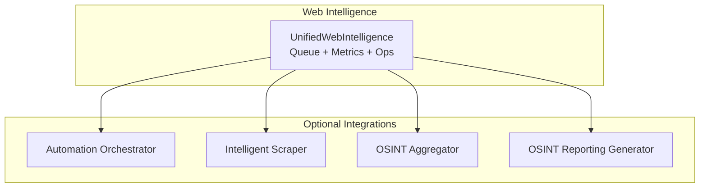
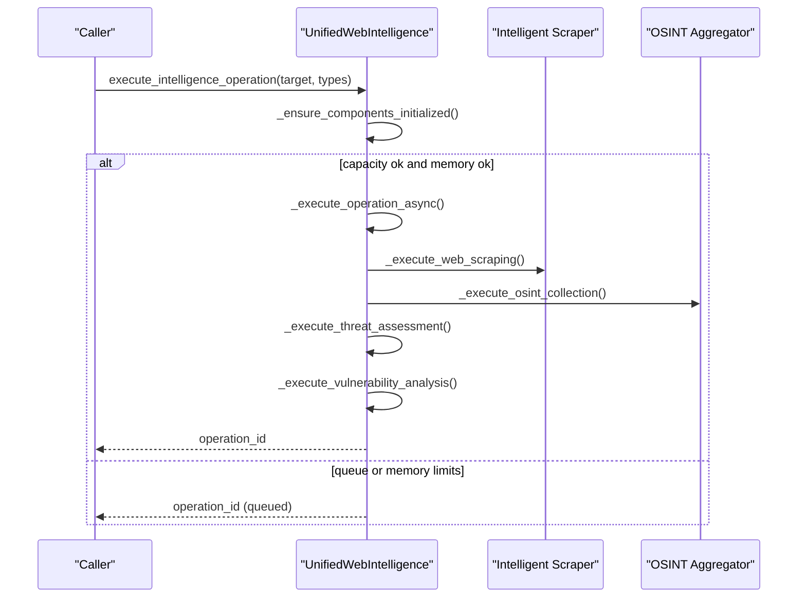
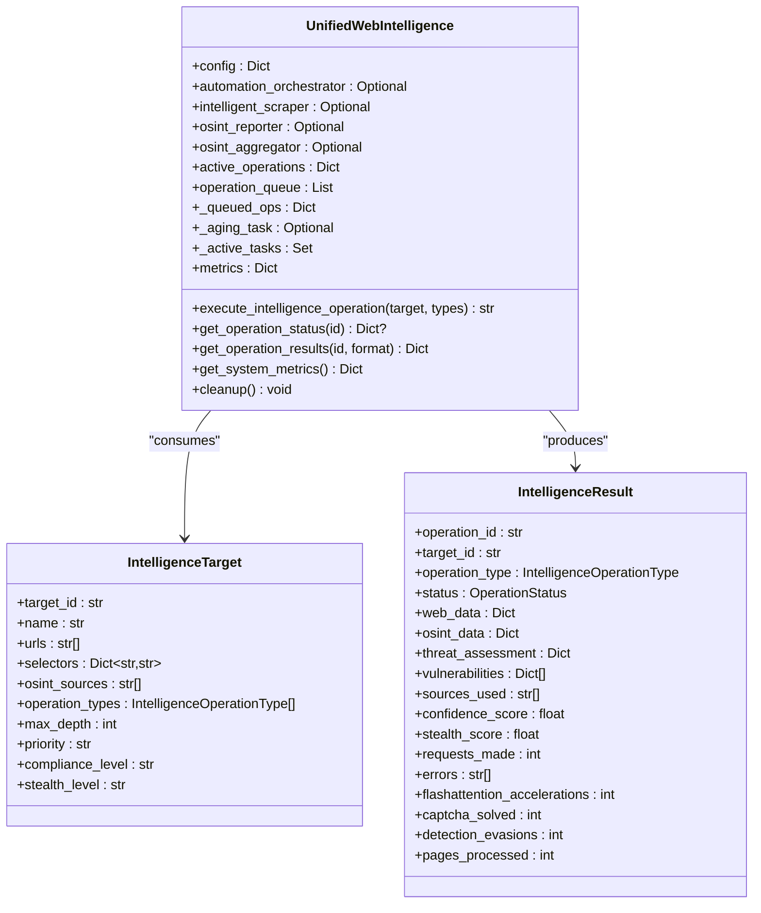
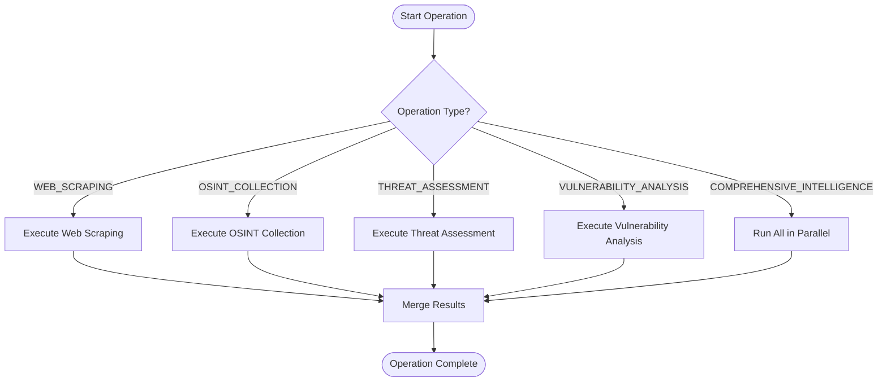
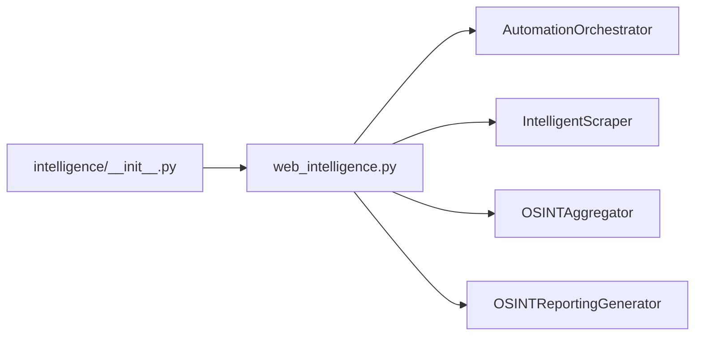

# Web Intelligence

<cite>
**Referenced Files in This Document**
- [web_intelligence.py](file://hledac/universal/intelligence/web_intelligence.py)
- [workflow_orchestrator.py](file://hledac/universal/intelligence/workflow_orchestrator.py)
- [__init__.py](file://hledac/universal/intelligence/__init__.py)
</cite>

## Table of Contents
1. [Introduction](#introduction)
2. [Project Structure](#project-structure)
3. [Core Components](#core-components)
4. [Architecture Overview](#architecture-overview)
5. [Detailed Component Analysis](#detailed-component-analysis)
6. [Dependency Analysis](#dependency-analysis)
7. [Performance Considerations](#performance-considerations)
8. [Troubleshooting Guide](#troubleshooting-guide)
9. [Conclusion](#conclusion)
10. [Appendices](#appendices)

## Introduction
This document describes the Web Intelligence module, a unified OSINT scraping and analysis utility integrated into the broader Hledac ecosystem. It provides:
- A lightweight wrapper around optional scraping and OSINT components
- Bounded queue management with priority aging and graceful degradation
- Lazy initialization to minimize startup overhead
- Memory pressure awareness for constrained environments (e.g., M1 8GB)
- Priority-based queuing and bounded operation tracking
- Five operation types: web scraping, OSINT collection, threat assessment, vulnerability analysis, and comprehensive intelligence
- Integration points with Automation Orchestrator, Intelligent Scraper, OSINT Aggregator, and OSINT Reporting Generator
- Configuration options for maximum concurrent operations, FlashAttention acceleration, and compliance levels

## Project Structure
The Web Intelligence module resides under the intelligence package and exposes a unified interface for OSINT operations. It integrates with:
- Automation Orchestrator for workflow control
- Intelligent Scraper for web scraping
- OSINT Aggregator for OSINT collection
- OSINT Reporting Generator for reporting

**Diagram sources**
- [web_intelligence.py:115-200](file://hledac/universal/intelligence/web_intelligence.py#L115-L200)

**Section sources**
- [__init__.py:117-129](file://hledac/universal/intelligence/__init__.py#L117-L129)
- [web_intelligence.py:34-48](file://hledac/universal/intelligence/web_intelligence.py#L34-L48)

## Core Components
- UnifiedWebIntelligence: Central coordinator that manages queues, metrics, lazy initialization, and operation execution lifecycle.
- IntelligenceTarget: Configuration container for targets, URLs, selectors, OSINT sources, operation types, priorities, compliance, and stealth levels.
- IntelligenceResult: Aggregated result container for each operation, including web data, OSINT data, threat assessment, vulnerabilities, metadata, and performance counters.
- IntelligenceOperationType: Enumerates supported operation types.
- OperationStatus: Enumerates operation lifecycle states.

Key behaviors:
- Lazy initialization of integrations on first operation
- Bounded queues with priority aging and proactive stale eviction
- Memory pressure checks using psutil with defensive caching
- Task ownership tracking with capped capacity
- Comprehensive metrics and health endpoints

**Section sources**
- [web_intelligence.py:50-113](file://hledac/universal/intelligence/web_intelligence.py#L50-L113)
- [web_intelligence.py:115-200](file://hledac/universal/intelligence/web_intelligence.py#L115-L200)

## Architecture Overview
The system is designed as a utility layer that coordinates optional components. It does not own the canonical runtime; heavy orchestration occurs elsewhere. The UnifiedWebIntelligence class:
- Accepts IntelligenceTarget configurations
- Enqueues operations with priority and memory-awareness
- Executes operations asynchronously
- Aggregates results into IntelligenceResult
- Exposes health, metrics, and status APIs

**Diagram sources**
- [web_intelligence.py:344-427](file://hledac/universal/intelligence/web_intelligence.py#L344-L427)
- [web_intelligence.py:429-477](file://hledac/universal/intelligence/web_intelligence.py#L429-L477)
- [web_intelligence.py:610-651](file://hledac/universal/intelligence/web_intelligence.py#L610-L651)
- [web_intelligence.py:652-689](file://hledac/universal/intelligence/web_intelligence.py#L652-L689)

## Detailed Component Analysis

### UnifiedWebIntelligence
Responsibilities:
- Lazy initialization of optional components
- Priority-aware queueing with aging and bounded growth
- Memory pressure checks and throttling
- Asynchronous operation execution and result aggregation
- Health and metrics exposure
- Graceful cleanup with symmetric task cancellation

Notable design choices:
- Bounded queues: separate heap and mirrored dict to prevent unbounded growth
- Aging task: periodically lowers priority of queued items to prevent starvation
- Memory budget: 512 MB RSS threshold with psutil lazy initialization and dead-process cache
- Task ownership: capped set of owned tasks with callbacks for cleanup
- Degraded mode: logs and continues when optional components are missing

**Diagram sources**
- [web_intelligence.py:115-200](file://hledac/universal/intelligence/web_intelligence.py#L115-L200)
- [web_intelligence.py:69-113](file://hledac/universal/intelligence/web_intelligence.py#L69-L113)

**Section sources**
- [web_intelligence.py:115-200](file://hledac/universal/intelligence/web_intelligence.py#L115-L200)
- [web_intelligence.py:203-270](file://hledac/universal/intelligence/web_intelligence.py#L203-L270)
- [web_intelligence.py:300-344](file://hledac/universal/intelligence/web_intelligence.py#L300-L344)
- [web_intelligence.py:429-477](file://hledac/universal/intelligence/web_intelligence.py#L429-L477)
- [web_intelligence.py:503-525](file://hledac/universal/intelligence/web_intelligence.py#L503-L525)
- [web_intelligence.py:528-550](file://hledac/universal/intelligence/web_intelligence.py#L528-L550)
- [web_intelligence.py:551-582](file://hledac/universal/intelligence/web_intelligence.py#L551-L582)
- [web_intelligence.py:962-1013](file://hledac/universal/intelligence/web_intelligence.py#L962-L1013)

### IntelligenceTarget and IntelligenceResult
- IntelligenceTarget encapsulates all configuration for a given intelligence operation, including URLs, CSS selectors, OSINT sources, operation types, depth, priority, compliance, and stealth level.
- IntelligenceResult aggregates outputs and metadata from all executed operations, including performance counters and error logs.

Usage patterns:
- Targets define what to scrape and collect
- Results define what was produced and how well

**Section sources**
- [web_intelligence.py:69-113](file://hledac/universal/intelligence/web_intelligence.py#L69-L113)
- [web_intelligence.py:84-113](file://hledac/universal/intelligence/web_intelligence.py#L84-L113)

### Operation Types and Workflows
Supported operation types:
- WEB_SCRAPING: Extract structured content from URLs using Intelligent Scraper
- OSINT_COLLECTION: Aggregate personal/professional info from configured OSINT sources
- THREAT_ASSESSMENT: Compute risk score from web and OSINT data
- VULNERABILITY_ANALYSIS: Identify potential weaknesses in collected data
- COMPREHENSIVE_INTELLIGENCE: Execute all operation types in parallel

Execution flow:
- UnifiedWebIntelligence routes to appropriate handler based on operation type
- Handlers call into optional integrations (Intelligent Scraper, OSINT Aggregator)
- Results are merged into IntelligenceResult

**Diagram sources**
- [web_intelligence.py:583-609](file://hledac/universal/intelligence/web_intelligence.py#L583-L609)
- [web_intelligence.py:610-651](file://hledac/universal/intelligence/web_intelligence.py#L610-L651)
- [web_intelligence.py:652-689](file://hledac/universal/intelligence/web_intelligence.py#L652-L689)
- [web_intelligence.py:691-748](file://hledac/universal/intelligence/web_intelligence.py#L691-L748)

**Section sources**
- [web_intelligence.py:50-57](file://hledac/universal/intelligence/web_intelligence.py#L50-L57)
- [web_intelligence.py:583-609](file://hledac/universal/intelligence/web_intelligence.py#L583-L609)

### Lazy Initialization Pattern
- Components are initialized on first operation via _ensure_components_initialized
- Uses asyncio.Lock to prevent race conditions
- Starts aging task only after successful initialization
- Surfaces initialization errors and marks initialization as complete to avoid retries

Benefits:
- Reduced cold-start overhead
- Controlled resource allocation
- Symmetric cleanup on shutdown

**Section sources**
- [web_intelligence.py:300-344](file://hledac/universal/intelligence/web_intelligence.py#L300-L344)
- [web_intelligence.py:503-525](file://hledac/universal/intelligence/web_intelligence.py#L503-L525)

### Memory Pressure Awareness (M1 8GB)
- Periodic RSS checks using psutil with lazy Process creation
- Dead-process cache to avoid repeated syscalls
- Hard rejection when RSS exceeds 512 MB
- Queues operations when memory pressure is detected

Guidance:
- Monitor memory_posture for RSS, limit, and pressure percentage
- Tune max_concurrent_operations to fit workload and memory headroom

**Section sources**
- [web_intelligence.py:167-172](file://hledac/universal/intelligence/web_intelligence.py#L167-L172)
- [web_intelligence.py:231-259](file://hledac/universal/intelligence/web_intelligence.py#L231-L259)
- [web_intelligence.py:378-392](file://hledac/universal/intelligence/web_intelligence.py#L378-L392)

### Priority-Based Queuing System
- Heap-based queue with (priority, counter, operation_id)
- Priority mapping: low=3, medium=2, high=1, critical=0 (lower number = higher priority)
- Aging task periodically increases priority of long-waiting items
- Stale eviction prunes _queued_ops to maintain bounds

**Section sources**
- [web_intelligence.py:146-161](file://hledac/universal/intelligence/web_intelligence.py#L146-L161)
- [web_intelligence.py:478-502](file://hledac/universal/intelligence/web_intelligence.py#L478-L502)
- [web_intelligence.py:551-582](file://hledac/universal/intelligence/web_intelligence.py#L551-L582)

### Examples and Workflows

#### Web Scraping Workflow
- Define IntelligenceTarget with URLs and selectors
- Call execute_intelligence_operation with WEB_SCRAPING
- Poll status and retrieve results
- Inspect web_data, stealth_score, and performance metrics

**Section sources**
- [web_intelligence.py:610-651](file://hledac/universal/intelligence/web_intelligence.py#L610-L651)
- [web_intelligence.py:855-877](file://hledac/universal/intelligence/web_intelligence.py#L855-L877)
- [web_intelligence.py:879-924](file://hledac/universal/intelligence/web_intelligence.py#L879-L924)

#### OSINT Aggregation Process
- Define IntelligenceTarget with osint_sources
- Call execute_intelligence_operation with OSINT_COLLECTION
- Review OSINT profile and confidence score

**Section sources**
- [web_intelligence.py:652-689](file://hledac/universal/intelligence/web_intelligence.py#L652-L689)

#### Threat Assessment Methodology
- Combine security indicators from web scraping and personal/professional insights from OSINT
- Compute threat score and convert to level (low/medium/high/critical)

**Section sources**
- [web_intelligence.py:691-748](file://hledac/universal/intelligence/web_intelligence.py#L691-L748)
- [web_intelligence.py:790-816](file://hledac/universal/intelligence/web_intelligence.py#L790-L816)

#### Vulnerability Analysis Technique
- Scan web data for exposed forms and sensitive content
- Review OSINT exposure (e.g., personal info) and tag risks

**Section sources**
- [web_intelligence.py:817-847](file://hledac/universal/intelligence/web_intelligence.py#L817-L847)

### Intelligent Scraper Integration
- Uses IntelligentScraper.ScrapingTarget and ScrapingConfig
- Auto-solve captchas, respect robots.txt, and enforce max concurrency
- Captures stealth_score, requests_made, and captcha_solved metrics

**Section sources**
- [web_intelligence.py:311-318](file://hledac/universal/intelligence/web_intelligence.py#L311-L318)
- [web_intelligence.py:610-651](file://hledac/universal/intelligence/web_intelligence.py#L610-L651)

### Automation Orchestrator Usage
- UnifiedWebIntelligence creates AutomationOrchestrator instances internally
- Orchestrator coordinates workflows; UnifiedWebIntelligence remains a lightweight wrapper

**Section sources**
- [web_intelligence.py:304-307](file://hledac/universal/intelligence/web_intelligence.py#L304-L307)

### Stealth Browsing Capabilities
- Target includes stealth_level configuration
- Intelligent Scraper captures stealth_score and evasion metrics
- OSINT operations can be configured with compliance_mode

**Section sources**
- [web_intelligence.py:79-81](file://hledac/universal/intelligence/web_intelligence.py#L79-L81)
- [web_intelligence.py:330-334](file://hledac/universal/intelligence/web_intelligence.py#L330-L334)

### Configuration Options
- max_concurrent_operations: Controls concurrency for scrapers and aggregators
- enable_flashattention: Enables FlashAttention acceleration in scraping
- enable_osint: Enables OSINT aggregator
- enable_stealth: Enables stealth features in integrations
- Completed operations limit: Defaults to 1000 entries with FIFO eviction
- Queue bounds: Both heap and _queued_ops mirror bound to 500

**Section sources**
- [web_intelligence.py:145-155](file://hledac/universal/intelligence/web_intelligence.py#L145-L155)
- [web_intelligence.py:192-196](file://hledac/universal/intelligence/web_intelligence.py#L192-L196)
- [web_intelligence.py:281-299](file://hledac/universal/intelligence/web_intelligence.py#L281-L299)

## Dependency Analysis
The module imports optional components and falls back gracefully when unavailable. The intelligence package’s __init__ consolidates availability flags and exports.

**Diagram sources**
- [web_intelligence.py:34-48](file://hledac/universal/intelligence/web_intelligence.py#L34-L48)
- [__init__.py:117-129](file://hledac/universal/intelligence/__init__.py#L117-L129)

**Section sources**
- [web_intelligence.py:34-48](file://hledac/universal/intelligence/web_intelligence.py#L34-L48)
- [__init__.py:117-129](file://hledac/universal/intelligence/__init__.py#L117-L129)

## Performance Considerations
- Concurrency: Tune max_concurrent_operations to balance throughput and memory usage
- FlashAttention: Enable when supported to accelerate text processing
- Queue sizing: Keep _MAX_QUEUE and _MAX_QUEUED_OPS aligned to prevent leaks
- Aging intervals: Adjust aging thresholds and intervals to reduce starvation without over-prioritization
- Memory budget: Monitor memory_posture and reduce concurrency under pressure

[No sources needed since this section provides general guidance]

## Troubleshooting Guide
Common scenarios:
- Degraded mode: If optional components are missing, the system logs a warning and continues with reduced capabilities
- Queue full: When either the heap or _queued_ops reaches 500, new operations are rejected
- Memory pressure: Operations are queued when RSS exceeds 512 MB
- Task ownership cap: If active tasks exceed 200, new tasks are dropped with a warning
- Cleanup: Use cleanup() to cancel tasks, drain queues, and close integrations

Operational checks:
- Use queue_health, memory_posture, active_posture, and task_posture for diagnostics
- Retrieve operation status/results via get_operation_status and get_operation_results
- Inspect system metrics for totals, success rates, and component availability

**Section sources**
- [web_intelligence.py:204-212](file://hledac/universal/intelligence/web_intelligence.py#L204-L212)
- [web_intelligence.py:394-406](file://hledac/universal/intelligence/web_intelligence.py#L394-L406)
- [web_intelligence.py:391-392](file://hledac/universal/intelligence/web_intelligence.py#L391-L392)
- [web_intelligence.py:530-550](file://hledac/universal/intelligence/web_intelligence.py#L530-L550)
- [web_intelligence.py:855-877](file://hledac/universal/intelligence/web_intelligence.py#L855-L877)
- [web_intelligence.py:879-924](file://hledac/universal/intelligence/web_intelligence.py#L879-L924)
- [web_intelligence.py:925-960](file://hledac/universal/intelligence/web_intelligence.py#L925-L960)
- [web_intelligence.py:962-1013](file://hledac/universal/intelligence/web_intelligence.py#L962-L1013)

## Conclusion
The Web Intelligence module provides a robust, bounded, and resilient OSINT scraping and analysis utility. Its lazy initialization, memory-aware controls, and priority-based queuing make it suitable for constrained environments while maintaining extensibility through optional integrations. The five operation types and comprehensive result model support end-to-end intelligence workflows, and the integration with the broader orchestration stack ensures scalable deployment.

[No sources needed since this section summarizes without analyzing specific files]

## Appendices

### Appendix A: Workflow Orchestrator Integration
While the Web Intelligence module is a lightweight wrapper, the broader system includes a WorkflowOrchestrator capable of coordinating multiple analysis modules, correlating results, detecting anomalies, and generating comprehensive reports. This complements UnifiedWebIntelligence by orchestrating higher-level multi-module workflows.

**Section sources**
- [workflow_orchestrator.py:335-466](file://hledac/universal/intelligence/workflow_orchestrator.py#L335-L466)
- [workflow_orchestrator.py:467-536](file://hledac/universal/intelligence/workflow_orchestrator.py#L467-L536)
- [workflow_orchestrator.py:653-711](file://hledac/universal/intelligence/workflow_orchestrator.py#L653-L711)