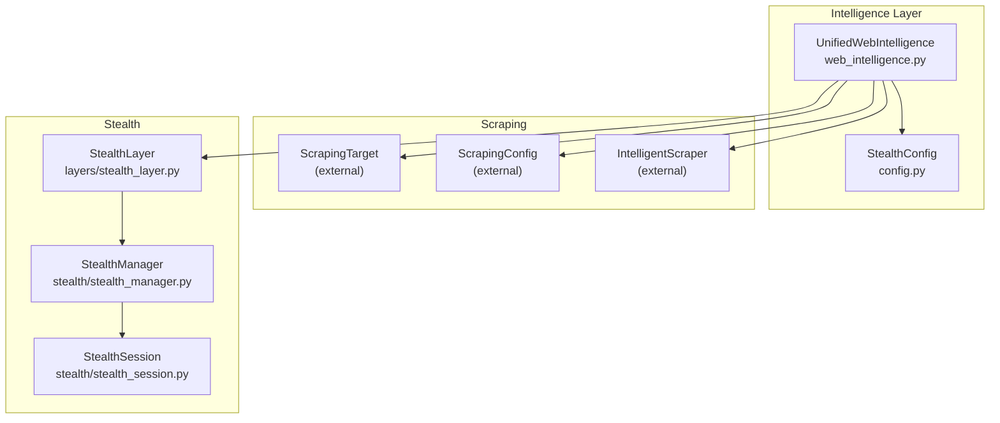
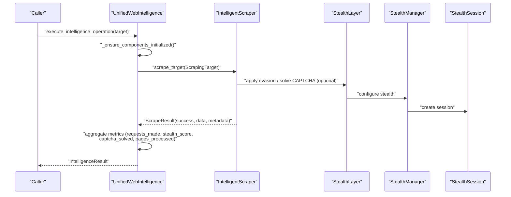
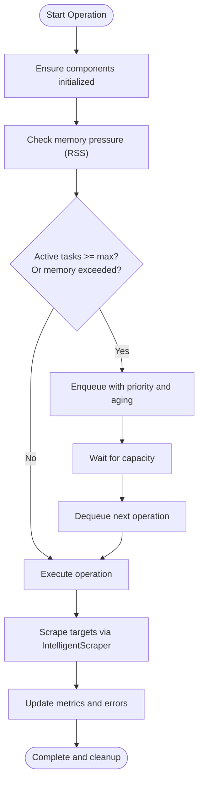
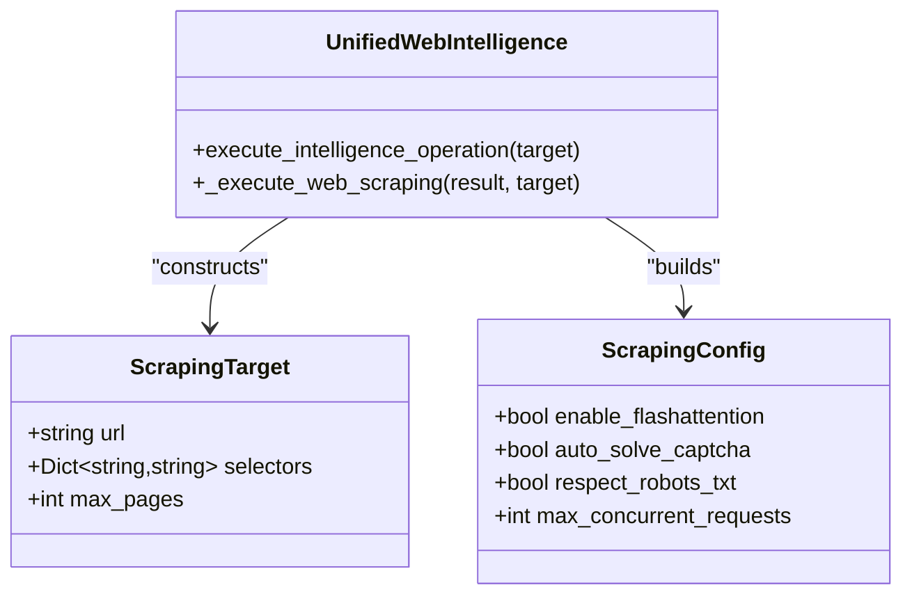
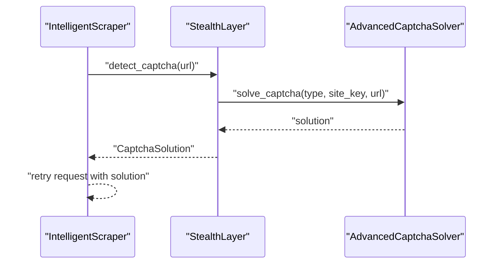
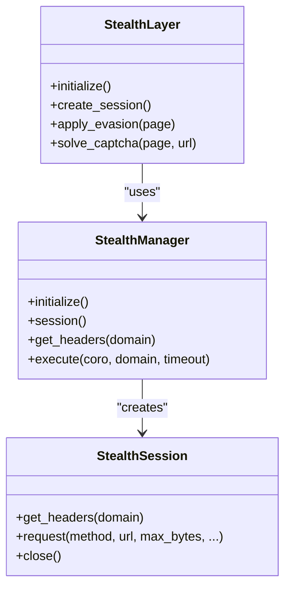
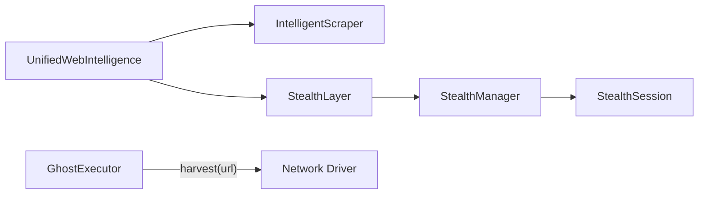

# Web Scraping Engine

<cite>
**Referenced Files in This Document**
- [web_intelligence.py](file://intelligence/web_intelligence.py)
- [config.py](file://config.py)
- [stealth_layer.py](file://layers/stealth_layer.py)
- [stealth_manager.py](file://stealth/stealth_manager.py)
- [stealth_session.py](file://stealth/stealth_session.py)
- [ghost_executor.py](file://execution/ghost_executor.py)
</cite>

## Table of Contents
1. [Introduction](#introduction)
2. [Project Structure](#project-structure)
3. [Core Components](#core-components)
4. [Architecture Overview](#architecture-overview)
5. [Detailed Component Analysis](#detailed-component-analysis)
6. [Dependency Analysis](#dependency-analysis)
7. [Performance Considerations](#performance-considerations)
8. [Troubleshooting Guide](#troubleshooting-guide)
9. [Conclusion](#conclusion)

## Introduction
This document describes the Web Scraping Engine within the Universal Intelligence subsystem. It explains how the intelligent scraper integrates with ScrapingTarget and ScrapingConfig, documents the web scraping workflow (URL processing, selector-based extraction, and depth management), and covers acceleration, CAPTCHA solving, and stealth browsing features. It also provides configuration guidance, selector syntax guidance, result processing patterns, performance metrics, error handling, and memory management tailored for M1 8GB environments.

## Project Structure
The Web Scraping Engine is implemented as a lightweight orchestration layer that coordinates:
- Target definition and configuration (ScrapingTarget, ScrapingConfig)
- Intelligent scraper execution
- Stealth browsing and CAPTCHA solving
- Metrics and memory pressure handling

**Diagram sources**
- [web_intelligence.py:300-340](file://intelligence/web_intelligence.py#L300-L340)
- [config.py:149-176](file://config.py#L149-L176)
- [stealth_layer.py:1895-2014](file://layers/stealth_layer.py#L1895-L2014)
- [stealth_manager.py:98-176](file://stealth/stealth_manager.py#L98-L176)
- [stealth_session.py:55-103](file://stealth/stealth_session.py#L55-L103)

**Section sources**
- [web_intelligence.py:115-200](file://intelligence/web_intelligence.py#L115-L200)
- [config.py:149-176](file://config.py#L149-L176)

## Core Components
- UnifiedWebIntelligence: Orchestrates scraping operations, manages queues and memory pressure, initializes optional components lazily, and aggregates results and metrics.
- ScrapingTarget and ScrapingConfig: Define URLs, CSS/selector-based extraction rules, and depth limits; passed to the IntelligentScraper.
- StealthConfig: Controls stealth features such as browser type, headless mode, pool size, fingerprint rotation, CAPTCHA solving, and proxy rotation.
- StealthLayer: Provides stealth browser management, detection evasion, CAPTCHA solving, behavior simulation, and fingerprint randomization.
- StealthManager and StealthSession: Provide HTTP-level stealth, rate limiting, header spoofing, fingerprint randomization, and bounded-memory request handling.

Key responsibilities:
- URL processing and pagination depth control
- Selector-based content extraction
- FlashAttention acceleration flag propagation
- CAPTCHA detection and solving
- Stealth browsing and anti-detection
- Metrics collection and memory budget enforcement

**Section sources**
- [web_intelligence.py:115-200](file://intelligence/web_intelligence.py#L115-L200)
- [web_intelligence.py:310-340](file://intelligence/web_intelligence.py#L310-L340)
- [config.py:149-176](file://config.py#L149-L176)
- [stealth_layer.py:1895-1956](file://layers/stealth_layer.py#L1895-L1956)
- [stealth_manager.py:98-176](file://stealth/stealth_manager.py#L98-L176)
- [stealth_session.py:55-103](file://stealth/stealth_session.py#L55-L103)

## Architecture Overview
The scraping workflow begins with an IntelligenceTarget containing URLs, selectors, and depth. The UnifiedWebIntelligence constructs ScrapingTarget objects and invokes the IntelligentScraper. During execution, the system can leverage stealth features (via StealthLayer/StealthManager/StealthSession) for anti-detection and CAPTCHA solving. Results are aggregated with performance metrics and errors.

**Diagram sources**
- [web_intelligence.py:344-477](file://intelligence/web_intelligence.py#L344-L477)
- [web_intelligence.py:610-651](file://intelligence/web_intelligence.py#L610-L651)
- [stealth_layer.py:1957-2014](file://layers/stealth_layer.py#L1957-L2014)
- [stealth_manager.py:166-279](file://stealth/stealth_manager.py#L166-L279)
- [stealth_session.py:503-620](file://stealth/stealth_session.py#L503-L620)

## Detailed Component Analysis

### UnifiedWebIntelligence Orchestration
- Lazy initialization of components on first operation to avoid startup overhead.
- Bounded queue with priority aging and hard caps on active tasks and queued ops.
- Memory pressure monitoring using psutil with a 512 MB RSS threshold for M1 8GB environments.
- Execution of web scraping and OSINT collection in parallel when requested.
- Aggregation of metrics: flashattention accelerations, captcha solutions, detections evaded, pages processed, and success rate.

**Diagram sources**
- [web_intelligence.py:378-427](file://intelligence/web_intelligence.py#L378-L427)
- [web_intelligence.py:478-501](file://intelligence/web_intelligence.py#L478-L501)
- [web_intelligence.py:610-651](file://intelligence/web_intelligence.py#L610-L651)

**Section sources**
- [web_intelligence.py:300-340](file://intelligence/web_intelligence.py#L300-L340)
- [web_intelligence.py:378-427](file://intelligence/web_intelligence.py#L378-L427)
- [web_intelligence.py:478-501](file://intelligence/web_intelligence.py#L478-L501)
- [web_intelligence.py:610-651](file://intelligence/web_intelligence.py#L610-L651)

### Intelligent Scraper Integration (ScrapingTarget and ScrapingConfig)
- ScrapingTarget encapsulates:
  - url: single target URL
  - selectors: dictionary mapping logical names to CSS/selector expressions
  - max_pages: depth limit for follow-up pages
- ScrapingConfig controls:
  - enable_flashattention: toggles acceleration flag
  - auto_solve_captcha: enables CAPTCHA auto-solving
  - respect_robots_txt: enforces robots.txt compliance
  - max_concurrent_requests: concurrency limit aligned with orchestration

**Diagram sources**
- [web_intelligence.py:310-319](file://intelligence/web_intelligence.py#L310-L319)
- [web_intelligence.py:624-628](file://intelligence/web_intelligence.py#L624-L628)

**Section sources**
- [web_intelligence.py:310-319](file://intelligence/web_intelligence.py#L310-L319)
- [web_intelligence.py:624-628](file://intelligence/web_intelligence.py#L624-L628)

### Selector-Based Content Extraction
- Selectors are provided as a dictionary mapping logical names to CSS/selector expressions.
- Extraction is performed by the IntelligentScraper using the provided ScrapingTarget.
- The resulting data is stored under the originating URL in the IntelligenceResult.

Guidelines:
- Use precise selectors to minimize noise and reduce memory footprint.
- Prefer attribute selectors for structured data (e.g., product price, author).
- For nested structures, define multiple selectors and combine results in post-processing.

**Section sources**
- [web_intelligence.py:624-631](file://intelligence/web_intelligence.py#L624-L631)

### Page Depth Management
- max_pages controls how many follow-up pages are crawled from the initial URL.
- Depth is enforced per target; deeper exploration increases memory and time costs.
- On M1 8GB, keep max_depth low (e.g., 1–2) and use targeted selectors to reduce payload sizes.

**Section sources**
- [web_intelligence.py:627-628](file://intelligence/web_intelligence.py#L627-L628)

### FlashAttention Acceleration Support
- enable_flashattention is propagated from UnifiedWebIntelligence to ScrapingConfig.
- This flag signals the IntelligentScraper to use FlashAttention acceleration when available.
- Metrics track flashattention_usage for observability.

**Section sources**
- [web_intelligence.py:193-193](file://intelligence/web_intelligence.py#L193-L193)
- [web_intelligence.py:313-313](file://intelligence/web_intelligence.py#L313-L313)
- [web_intelligence.py:109-109](file://intelligence/web_intelligence.py#L109-L109)

### CAPTCHA Solving Capabilities
- Auto-solving is enabled via auto_solve_captcha in ScrapingConfig.
- StealthLayer includes an AdvancedCaptchaSolver (self-hosted) that detects CAPTCHA challenges and attempts to solve them.
- Captcha solutions are recorded in metrics (captcha_solved).

**Diagram sources**
- [stealth_layer.py:2355-2376](file://layers/stealth_layer.py#L2355-L2376)

**Section sources**
- [web_intelligence.py:314-314](file://intelligence/web_intelligence.py#L314-L314)
- [stealth_layer.py:2031-2041](file://layers/stealth_layer.py#L2031-L2041)
- [stealth_layer.py:2355-2376](file://layers/stealth_layer.py#L2355-L2376)

### Stealth Browsing Features
- StealthLayer manages stealth browser instances, detection evasion scripts, behavior simulation, and fingerprint randomization.
- StealthManager provides HTTP-level stealth: rate limiting, header spoofing, fingerprint randomization, and bounded-memory request handling.
- StealthSession offers UA rotation, jitter timing, and clean lifecycle management.

**Diagram sources**
- [stealth_layer.py:1895-1956](file://layers/stealth_layer.py#L1895-L1956)
- [stealth_manager.py:98-176](file://stealth/stealth_manager.py#L98-L176)
- [stealth_session.py:503-620](file://stealth/stealth_session.py#L503-L620)

**Section sources**
- [stealth_layer.py:1895-1956](file://layers/stealth_layer.py#L1895-L1956)
- [stealth_manager.py:98-176](file://stealth/stealth_manager.py#L98-L176)
- [stealth_session.py:503-620](file://stealth/stealth_session.py#L503-L620)

### Robots.txt Compliance
- respect_robots_txt is enabled in ScrapingConfig to enforce compliance.
- This reduces the risk of being blocked and aligns with ethical scraping practices.

**Section sources**
- [web_intelligence.py:315-315](file://intelligence/web_intelligence.py#L315-L315)

### Result Processing
- Successful scrapes populate IntelligenceResult.web_data with a URL-keyed dictionary of extracted content.
- Metrics include requests_made, stealth_score, captcha_solved, pages_processed, and others.
- Errors are appended to IntelligenceResult.errors for diagnostics.

**Section sources**
- [web_intelligence.py:633-650](file://intelligence/web_intelligence.py#L633-L650)
- [web_intelligence.py:85-113](file://intelligence/web_intelligence.py#L85-L113)

## Dependency Analysis
- UnifiedWebIntelligence depends on:
  - ScrapingTarget and ScrapingConfig (external)
  - IntelligentScraper (external)
  - StealthConfig (internal)
  - StealthLayer (internal)
- StealthLayer depends on:
  - StealthManager for HTTP-level stealth
  - StealthSession for request lifecycle
- Execution path for deep reads uses a network driver and harvests content, updating Bloom filters and context.

**Diagram sources**
- [web_intelligence.py:310-319](file://intelligence/web_intelligence.py#L310-L319)
- [stealth_layer.py:1957-2014](file://layers/stealth_layer.py#L1957-L2014)
- [stealth_manager.py:166-279](file://stealth/stealth_manager.py#L166-L279)
- [stealth_session.py:503-620](file://stealth/stealth_session.py#L503-L620)
- [ghost_executor.py:716-720](file://execution/ghost_executor.py#L716-L720)

**Section sources**
- [web_intelligence.py:310-319](file://intelligence/web_intelligence.py#L310-L319)
- [ghost_executor.py:716-720](file://execution/ghost_executor.py#L716-L720)

## Performance Considerations
- Concurrency:
  - max_concurrent_operations controls the number of simultaneous operations.
  - max_concurrent_requests in ScrapingConfig aligns with orchestration limits.
- Memory:
  - UnifiedWebIntelligence enforces a 512 MB RSS threshold and tracks memory posture.
  - StealthManager and StealthSession use streaming reads with max_bytes limits to avoid large payloads in RAM.
- Acceleration:
  - FlashAttention acceleration flag is propagated to the IntelligentScraper for potential performance gains.
- Metrics:
  - Track total_pages_processed, total_captcha_solved, total_detections_evaded, flashattention_usage, and success_rate.

Recommendations for M1 8GB:
- Keep max_concurrent_operations low (e.g., 2–5).
- Limit max_depth to 1–2.
- Use targeted selectors to reduce payload sizes.
- Monitor memory_posture and adjust concurrency accordingly.

**Section sources**
- [web_intelligence.py:167-172](file://intelligence/web_intelligence.py#L167-L172)
- [web_intelligence.py:231-258](file://intelligence/web_intelligence.py#L231-L258)
- [stealth_manager.py:60-64](file://stealth/stealth_manager.py#L60-L64)
- [stealth_session.py:503-620](file://stealth/stealth_session.py#L503-L620)

## Troubleshooting Guide
Common issues and strategies:
- Initialization failures:
  - UnifiedWebIntelligence surfaces component initialization errors and marks initialization as done to prevent retries.
- Memory pressure:
  - When RSS exceeds 512 MB, operations are queued or rejected to protect stability.
- CAPTCHA challenges:
  - CAPTCHA solving is automatic; if not resolved, scrape results will include error messages.
- Stealth failures:
  - Verify StealthLayer initialization and that stealth scripts are enabled.
  - For HTTP-level issues, inspect StealthManager statistics and circuit breaker telemetry.

Operational checks:
- Use queue_health and memory_posture to assess system load.
- Review IntelligenceResult.errors for detailed failure reasons.
- Inspect StealthManager.get_statistics() and get_stealth_transport_telemetry() for stealth-related insights.

**Section sources**
- [web_intelligence.py:503-524](file://intelligence/web_intelligence.py#L503-L524)
- [web_intelligence.py:231-258](file://intelligence/web_intelligence.py#L231-L258)
- [stealth_layer.py:1957-2014](file://layers/stealth_layer.py#L1957-L2014)
- [stealth_manager.py:314-341](file://stealth/stealth_manager.py#L314-L341)
- [stealth_manager.py:343-390](file://stealth/stealth_manager.py#L343-L390)

## Conclusion
The Web Scraping Engine provides a robust, memory-aware, and stealth-enhanced pipeline for extracting structured content from web pages. By combining target-driven scraping, selector-based extraction, depth control, and optional stealth and CAPTCHA solving, it delivers reliable results while respecting resource constraints on M1 8GB systems. Proper configuration of concurrency, depth, and selectors, along with monitoring of metrics and memory posture, ensures sustainable performance.