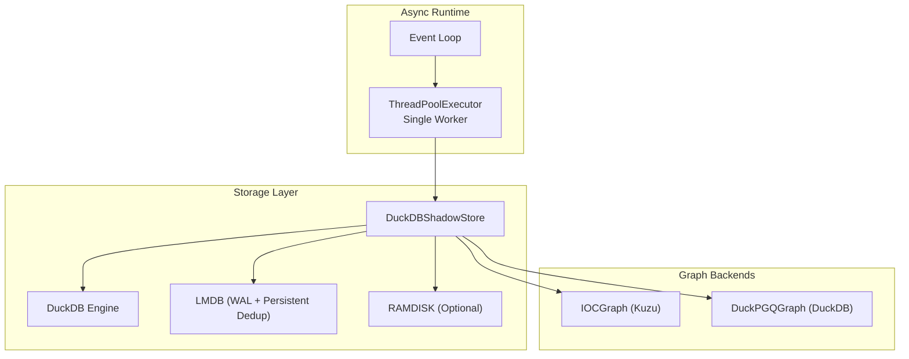
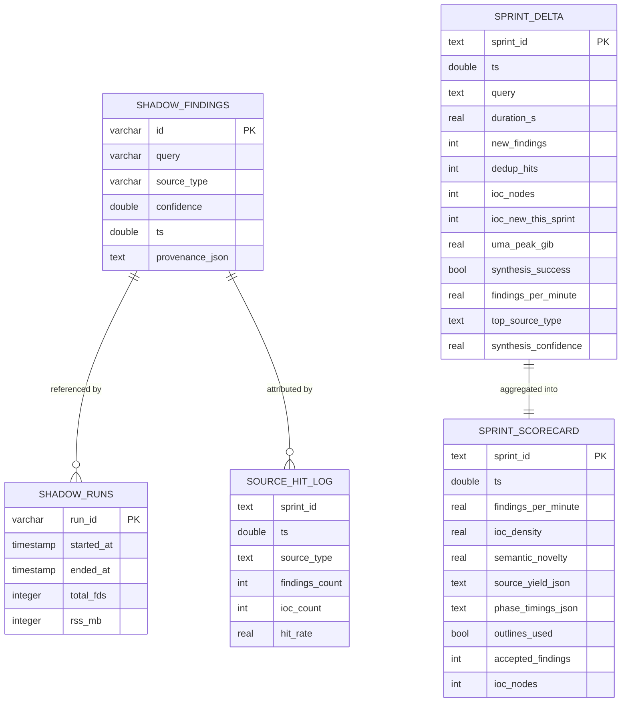
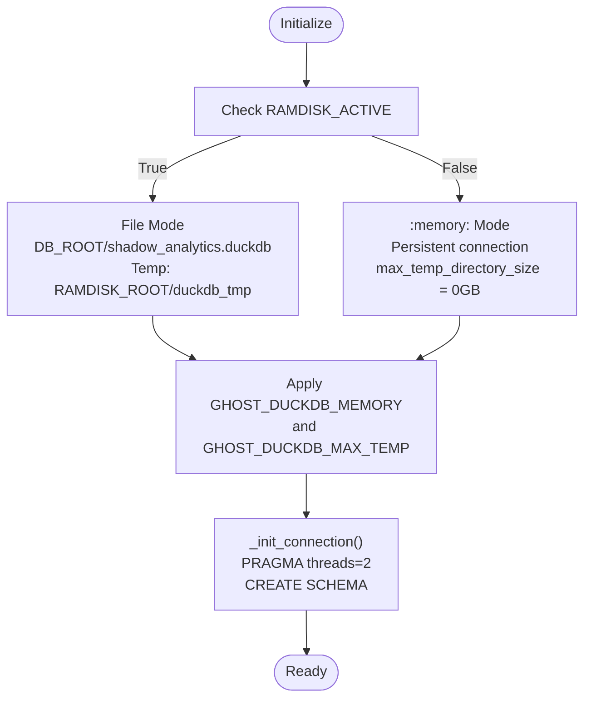
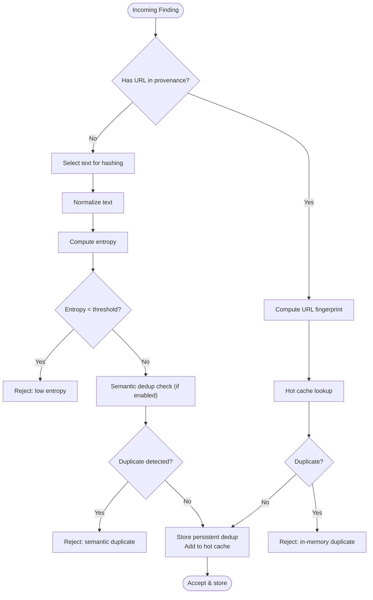
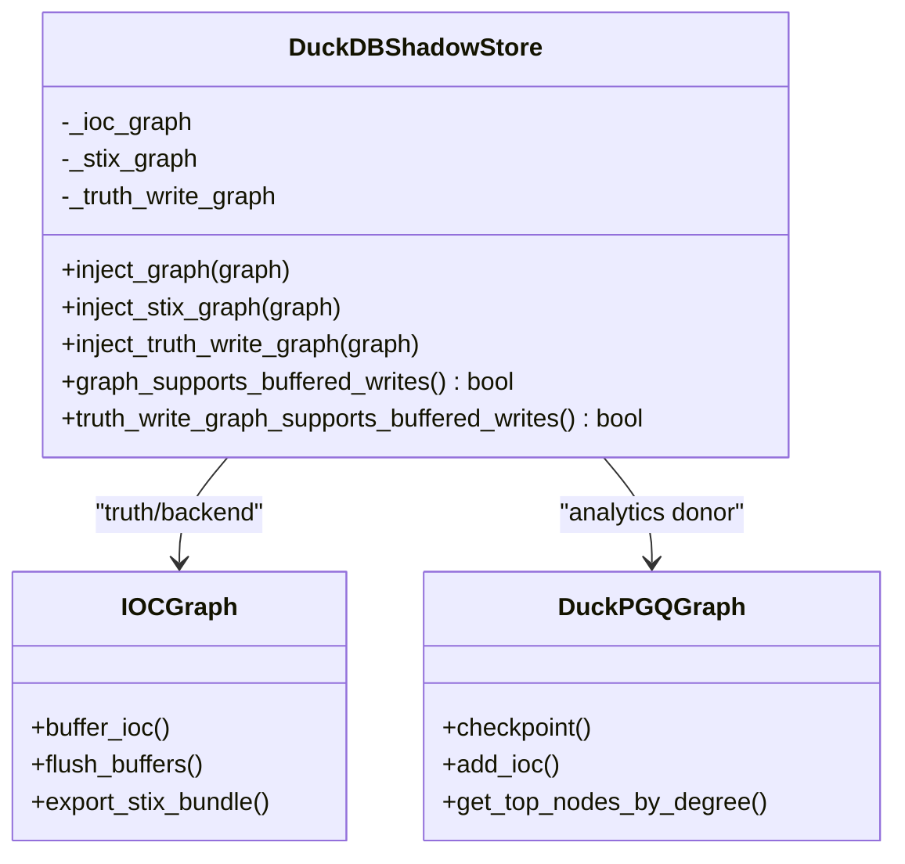
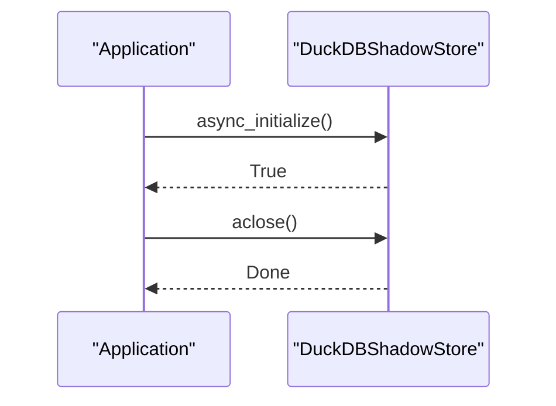
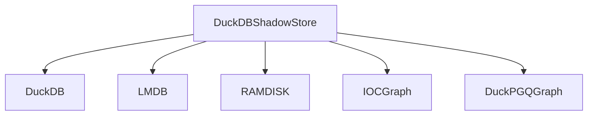

# DuckDB Shadow Store

<cite>
**Referenced Files in This Document**
- [duckdb_store.py](file://knowledge/duckdb_store.py)
- [test_sprint8ao_duckdb_sidecar.py](file://tests/test_sprint8ao_duckdb_sidecar.py)
- [test_duckdb_async_safety.py](file://tests/test_sprint8as_duckdb_async/test_duckdb_async_safety.py)
- [test_lmdb_duckdb_dryrun.py](file://tests/probe_7f/test_lmdb_duckdb_dryrun.py)
- [test_truth_write_graph_slot.py](file://tests/probe_8wa/test_truth_write_graph_slot.py)
- [semantic_deduplicator.py](file://semantic_deduplicator.py)
- [memory_layer.py](file://layers/memory_layer.py)
</cite>

## Table of Contents
1. [Introduction](#introduction)
2. [Project Structure](#project-structure)
3. [Core Components](#core-components)
4. [Architecture Overview](#architecture-overview)
5. [Detailed Component Analysis](#detailed-component-analysis)
6. [Dependency Analysis](#dependency-analysis)
7. [Performance Considerations](#performance-considerations)
8. [Troubleshooting Guide](#troubleshooting-guide)
9. [Conclusion](#conclusion)
10. [Appendices](#appendices)

## Introduction
The DuckDB Shadow Store serves as the canonical sprint facts store and analytics authority for the system. It maintains a three-tier facts hierarchy:
- Tier 1: Sprint-level analytics (durable) — sprint_delta, sprint_scorecard, source_hit_log
- Tier 2: Shadow findings (durable) — shadow_findings, shadow_runs
- Tier 3: Graph integration (external backends) — IOCGraph and DuckPGQGraph

The store provides an async API surface for ingestion and querying, with a RAMDISK-first connection model, thread-affine execution via a single-worker ThreadPoolExecutor, and robust health checking. It implements a quality gate system with entropy filtering, duplicate detection, and persistent deduplication using LMDB. The store also exposes graph integration hooks for IOC ingestion and STIX export.

## Project Structure
The DuckDB Shadow Store is implemented as a single, cohesive class with extensive async and sync APIs, quality gates, and graph integration seams. Supporting components include:
- DuckDB integration with deferred import and validated settings
- RAMDISK-based storage orchestration for OPSEC-safe degraded mode
- Quality gate with entropy filtering and dual-layer dedup (hot cache + LMDB)
- Graph integration slots for analytics, STIX export, and truth-write buffering



**Diagram sources**
- [duckdb_store.py:533-788](file://knowledge/duckdb_store.py#L533-L788)
- [duckdb_store.py:1324-1369](file://knowledge/duckdb_store.py#L1324-L1369)
- [duckdb_store.py:663-788](file://knowledge/duckdb_store.py#L663-L788)

**Section sources**
- [duckdb_store.py:1-57](file://knowledge/duckdb_store.py#L1-L57)

## Core Components
- DuckDBShadowStore: Central async/sync store with:
  - Async API: async_initialize(), async_record_shadow_run(), async_record_shadow_finding(), async_record_shadow_findings_batch(), async_query_recent_findings(), async_healthcheck(), aclose()
  - Sync API: initialize(), insert_shadow_run(), insert_shadow_finding(), query_recent_findings(), close()
  - Quality gate: entropy filtering, duplicate detection, persistent dedup LMDB
  - Graph integration: inject_graph(), inject_stix_graph(), inject_truth_write_graph(), and capability checks
  - Schema: sprint_delta, sprint_scorecard, source_hit_log, shadow_findings, shadow_runs, plus extended tables for research and target memory
- Connection model: RAMDISK-first with file-backed DB and temp on RAMDISK; fallback to :memory: mode with persistent connection
- Health checking: async_healthcheck() performs a zero-cost query to verify responsiveness
- Environment configuration: GHOST_DUCKDB_MEMORY and GHOST_DUCKDB_MAX_TEMP validated and applied to DuckDB PRAGMAs

**Section sources**
- [duckdb_store.py:48-57](file://knowledge/duckdb_store.py#L48-L57)
- [duckdb_store.py:533-788](file://knowledge/duckdb_store.py#L533-L788)
- [duckdb_store.py:1324-1369](file://knowledge/duckdb_store.py#L1324-L1369)
- [duckdb_store.py:377-411](file://knowledge/duckdb_store.py#L377-L411)

## Architecture Overview
The store enforces thread-affinity by running all DuckDB operations on a single-worker ThreadPoolExecutor named duckdb_worker. Async methods use run_in_executor to avoid blocking the event loop. The connection is created inside the worker thread, ensuring isolation and preventing cross-thread resource misuse.

```mermaid
sequenceDiagram
participant Client as "Client"
participant Loop as "Event Loop"
participant Exec as "ThreadPoolExecutor"
participant Store as "DuckDBShadowStore"
participant DB as "DuckDB"
Client->>Loop : async_record_shadow_finding(...)
Loop->>Exec : run_in_executor(fn, args)
Exec->>Store : _sync_insert_finding(...)
Store->>DB : INSERT INTO shadow_findings
DB-->>Store : OK
Store-->>Exec : True
Exec-->>Loop : True
Loop-->>Client : True
```

**Diagram sources**
- [duckdb_store.py:2330-2355](file://knowledge/duckdb_store.py#L2330-L2355)
- [duckdb_store.py:1463-1501](file://knowledge/duckdb_store.py#L1463-L1501)

**Section sources**
- [duckdb_store.py:533-598](file://knowledge/duckdb_store.py#L533-L598)
- [duckdb_store.py:2330-2355](file://knowledge/duckdb_store.py#L2330-L2355)

## Detailed Component Analysis

### Facts Hierarchy and Schema
The store organizes analytics into three tiers:
- Tier 1 (Sprint-level): sprint_delta, sprint_scorecard, source_hit_log
- Tier 2 (Shadow findings): shadow_findings, shadow_runs
- Tier 3 (Graph): IOCGraph and DuckPGQGraph integrations

Schema definitions include:
- shadow_findings: id, query, source_type, confidence, ts, provenance_json
- shadow_runs: run_id, started_at, ended_at, total_fds, rss_mb
- sprint_delta: sprint_id, ts, query, duration_s, new_findings, dedup_hits, ioc_nodes, ioc_new_this_sprint, uma_peak_gib, synthesis_success, findings_per_minute, top_source_type, synthesis_confidence
- source_hit_log: sprint_id, ts, source_type, findings_count, ioc_count, hit_rate
- sprint_scorecard: sprint_id, ts, findings_per_minute, ioc_density, semantic_novelty, source_yield_json, phase_timings_json, outlines_used, accepted_findings, ioc_nodes
- Extended tables: research_episodes, target_profiles, hypothesis_feedback, target_memory



**Diagram sources**
- [duckdb_store.py:421-527](file://knowledge/duckdb_store.py#L421-L527)

**Section sources**
- [duckdb_store.py:421-527](file://knowledge/duckdb_store.py#L421-L527)

### Async API Surface
Key async methods:
- async_initialize(replay_pending_limit, replay_timeout_s): initializes connection, optional startup replay, ensures schema, and sets readiness barrier
- async_record_shadow_run(run_id, started_at, ended_at, total_fds, rss_mb): inserts run metadata
- async_record_shadow_finding(finding_id, query, source_type, confidence): inserts a single finding
- async_record_shadow_findings_batch(findings, max_batch_size=500): chunked batch insert
- async_query_recent_findings(limit=10): retrieves recent findings ordered by ts desc
- async_healthcheck(): quick responsiveness check
- aclose(): idempotent shutdown

Thread-safety is ensured by running all operations on the duckdb_worker via run_in_executor.

**Section sources**
- [duckdb_store.py:2221-2301](file://knowledge/duckdb_store.py#L2221-L2301)
- [duckdb_store.py:2303-2355](file://knowledge/duckdb_store.py#L2303-L2355)
- [duckdb_store.py:2356-2387](file://knowledge/duckdb_store.py#L2356-L2387)
- [duckdb_store.py:2388-2406](file://knowledge/duckdb_store.py#L2388-L2406)
- [duckdb_store.py:2407-2426](file://knowledge/duckdb_store.py#L2407-L2426)

### Connection Model and RAMDISK-First Approach
Connection modes:
- Mode A (RAMDISK active): file-backed DB with temp directory on RAMDISK; memory_limit and max_temp_directory_size applied
- Mode B (:memory: mode): single persistent connection with max_temp_directory_size set to 0GB; no SSD spill

Path resolution respects RAMDISK_ACTIVE and falls back to :memory: if paths are unavailable.



**Diagram sources**
- [duckdb_store.py:1324-1369](file://knowledge/duckdb_store.py#L1324-L1369)
- [duckdb_store.py:2086-2105](file://knowledge/duckdb_store.py#L2086-L2105)
- [test_sprint8ao_duckdb_sidecar.py:132-185](file://tests/test_sprint8ao_duckdb_sidecar.py#L132-L185)

**Section sources**
- [duckdb_store.py:1324-1369](file://knowledge/duckdb_store.py#L1324-L1369)
- [duckdb_store.py:2086-2105](file://knowledge/duckdb_store.py#L2086-L2105)
- [test_sprint8ao_duckdb_sidecar.py:132-185](file://tests/test_sprint8ao_duckdb_sidecar.py#L132-L185)

### Health Checking Mechanism
async_healthcheck() executes a minimal query against the store to verify connectivity and responsiveness. It returns True on success, False otherwise.

**Section sources**
- [duckdb_store.py:2407-2426](file://knowledge/duckdb_store.py#L2407-L2426)

### Quality Gate System
The quality gate evaluates findings using:
- Entropy filtering: strings below a configurable threshold are rejected
- Duplicate detection: in-memory hot cache and persistent LMDB cross-source dedup
- URL-first fingerprinting: when a canonical URL exists in provenance, it is used as the primary dedup signal
- Semantic deduplication: embedding-based near-duplicate detection (fail-open)

Counters track rejected and accepted findings for observability.



**Diagram sources**
- [duckdb_store.py:4719-4869](file://knowledge/duckdb_store.py#L4719-L4869)
- [duckdb_store.py:6425-6501](file://knowledge/duckdb_store.py#L6425-L6501)
- [semantic_deduplicator.py:133-394](file://semantic_deduplicator.py#L133-L394)

**Section sources**
- [duckdb_store.py:205-208](file://knowledge/duckdb_store.py#L205-L208)
- [duckdb_store.py:4719-4869](file://knowledge/duckdb_store.py#L4719-L4869)
- [duckdb_store.py:6425-6501](file://knowledge/duckdb_store.py#L6425-L6501)
- [semantic_deduplicator.py:133-394](file://semantic_deduplicator.py#L133-L394)

### Graph Integration Capabilities
The store exposes three independent graph integration slots:
- inject_graph(graph): analytics/donor graph (DuckPGQGraph) or truth backend (IOCGraph)
- inject_stix_graph(graph): STIX export-only slot (IOCGraph only)
- inject_truth_write_graph(graph): truth-write graph for ACTIVE-phase buffered IOC ingest (IOCGraph only)

Capability checks ensure buffered write support before triggering background graph ingest.



**Diagram sources**
- [duckdb_store.py:663-788](file://knowledge/duckdb_store.py#L663-L788)
- [test_truth_write_graph_slot.py:85-424](file://tests/probe_8wa/test_truth_write_graph_slot.py#L85-L424)

**Section sources**
- [duckdb_store.py:663-788](file://knowledge/duckdb_store.py#L663-L788)
- [test_truth_write_graph_slot.py:85-424](file://tests/probe_8wa/test_truth_write_graph_slot.py#L85-L424)

### Practical Examples

#### Initialization and Shutdown
- Initialize: call async_initialize() to set up connection, schema, and quality gate resources
- Shutdown: call aclose() to close DuckDB connections and release resources



**Diagram sources**
- [duckdb_store.py:2221-2301](file://knowledge/duckdb_store.py#L2221-L2301)
- [duckdb_store.py:2217-2216](file://knowledge/duckdb_store.py#L2217-L2216)

**Section sources**
- [duckdb_store.py:2221-2301](file://knowledge/duckdb_store.py#L2221-L2301)
- [duckdb_store.py:2217-2216](file://knowledge/duckdb_store.py#L2217-L2216)

#### Data Insertion
- Single finding: async_record_shadow_finding()
- Batch findings: async_record_shadow_findings_batch()
- Run metadata: async_record_shadow_run()

**Section sources**
- [duckdb_store.py:2303-2355](file://knowledge/duckdb_store.py#L2303-L2355)
- [duckdb_store.py:2356-2387](file://knowledge/duckdb_store.py#L2356-L2387)
- [duckdb_store.py:2303-2329](file://knowledge/duckdb_store.py#L2303-L2329)

#### Querying
- Recent findings: async_query_recent_findings()
- Sprint-scoped findings: async_query_recent_findings_by_sprint()
- Top entities by sprint: async_query_top_entities_by_sprint()
- Sprint IOC summary: async_query_sprint_ioc_summary()
- Top sources by sprint: async_query_top_sources_by_sprint()

**Section sources**
- [duckdb_store.py:2388-2406](file://knowledge/duckdb_store.py#L2388-L2406)
- [duckdb_store.py:2496-2520](file://knowledge/duckdb_store.py#L2496-L2520)
- [duckdb_store.py:2561-2586](file://knowledge/duckdb_store.py#L2561-L2586)
- [duckdb_store.py:2664-2687](file://knowledge/duckdb_store.py#L2664-L2687)
- [duckdb_store.py:2729-2753](file://knowledge/duckdb_store.py#L2729-L2753)

#### Graph Integration
- Inject truth-write graph: inject_truth_write_graph(IOCGraph)
- Check capability: truth_write_graph_supports_buffered_writes()
- Background ingest: triggered automatically after successful activation

**Section sources**
- [duckdb_store.py:741-788](file://knowledge/duckdb_store.py#L741-L788)
- [duckdb_store.py:1245-1308](file://knowledge/duckdb_store.py#L1245-L1308)

## Dependency Analysis
The store depends on:
- DuckDB engine (deferred import)
- LMDB for WAL and persistent dedup
- RAMDISK for high-speed temporary storage (optional)
- Graph backends (IOCGraph, DuckPGQGraph) for IOC ingestion and export



**Diagram sources**
- [duckdb_store.py:533-788](file://knowledge/duckdb_store.py#L533-L788)

**Section sources**
- [duckdb_store.py:533-788](file://knowledge/duckdb_store.py#L533-L788)

## Performance Considerations
- Single-worker ThreadPoolExecutor ensures thread-affinity and avoids cross-thread contention
- Batch operations use chunked inserts with explicit transactions for throughput
- RAMDISK-first approach minimizes SSD writes and improves latency
- PRAGMA threads=2 applied after connection initialization
- Environment variables GHOST_DUCKDB_MEMORY and GHOST_DUCKDB_MAX_TEMP are validated and applied to DuckDB settings

[No sources needed since this section provides general guidance]

## Troubleshooting Guide
Common issues and resolutions:
- Initialization failures: verify RAMDISK availability and permissions; fallback to :memory: mode documented
- Health check failures: inspect async_healthcheck() results and underlying DuckDB connectivity
- Quality gate rejections: review entropy thresholds, duplicate counters, and persistent dedup LMDB status
- Graph integration problems: confirm capability checks before triggering buffered writes

**Section sources**
- [test_sprint8ao_duckdb_sidecar.py:132-185](file://tests/test_sprint8ao_duckdb_sidecar.py#L132-L185)
- [duckdb_store.py:2407-2426](file://knowledge/duckdb_store.py#L2407-L2426)
- [duckdb_store.py:6600-6647](file://knowledge/duckdb_store.py#L6600-L6647)

## Conclusion
The DuckDB Shadow Store provides a robust, async-first analytics authority with a clear three-tier facts hierarchy, thread-affine execution, and comprehensive quality gating. Its RAMDISK-first design, validated environment configuration, and graph integration slots make it suitable for high-throughput, OPSEC-conscious operations while maintaining durability and cross-source deduplication.

## Appendices

### Configuration Options
- GHOST_DUCKDB_MEMORY: memory_limit applied to DuckDB (validated)
- GHOST_DUCKDB_MAX_TEMP: max_temp_directory_size applied to DuckDB (validated)

**Section sources**
- [duckdb_store.py:377-411](file://knowledge/duckdb_store.py#L377-L411)

### RAMDISK Integration
RAMDiskManager provides forensic-clean, high-speed temporary storage with automatic cleanup and nuke-on-exit semantics.

**Section sources**
- [memory_layer.py:832-1056](file://layers/memory_layer.py#L832-L1056)

### Async Safety and Executor Validation
Tests confirm the presence of a duckdb_worker thread and idempotent aclose() behavior.

**Section sources**
- [test_duckdb_async_safety.py:295-331](file://tests/test_sprint8as_duckdb_async/test_duckdb_async_safety.py#L295-L331)

### End-to-End Dry Run
Integration tests demonstrate async batch insertions and read-back verification.

**Section sources**
- [test_lmdb_duckdb_dryrun.py:96-227](file://tests/probe_7f/test_lmdb_duckdb_dryrun.py#L96-L227)