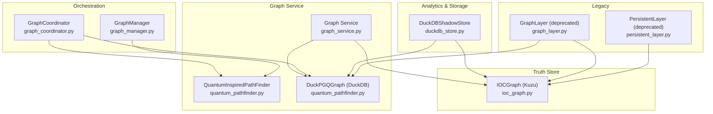
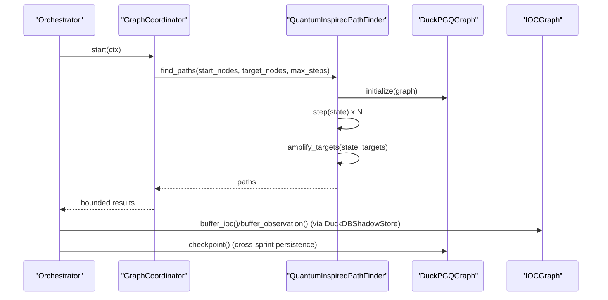
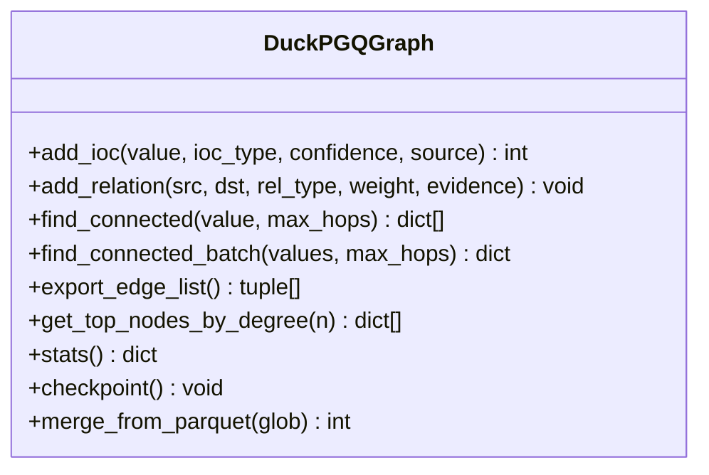
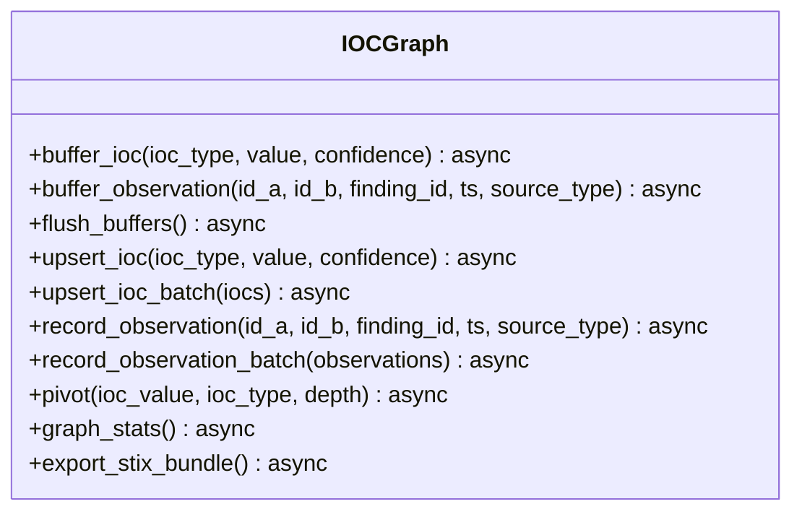
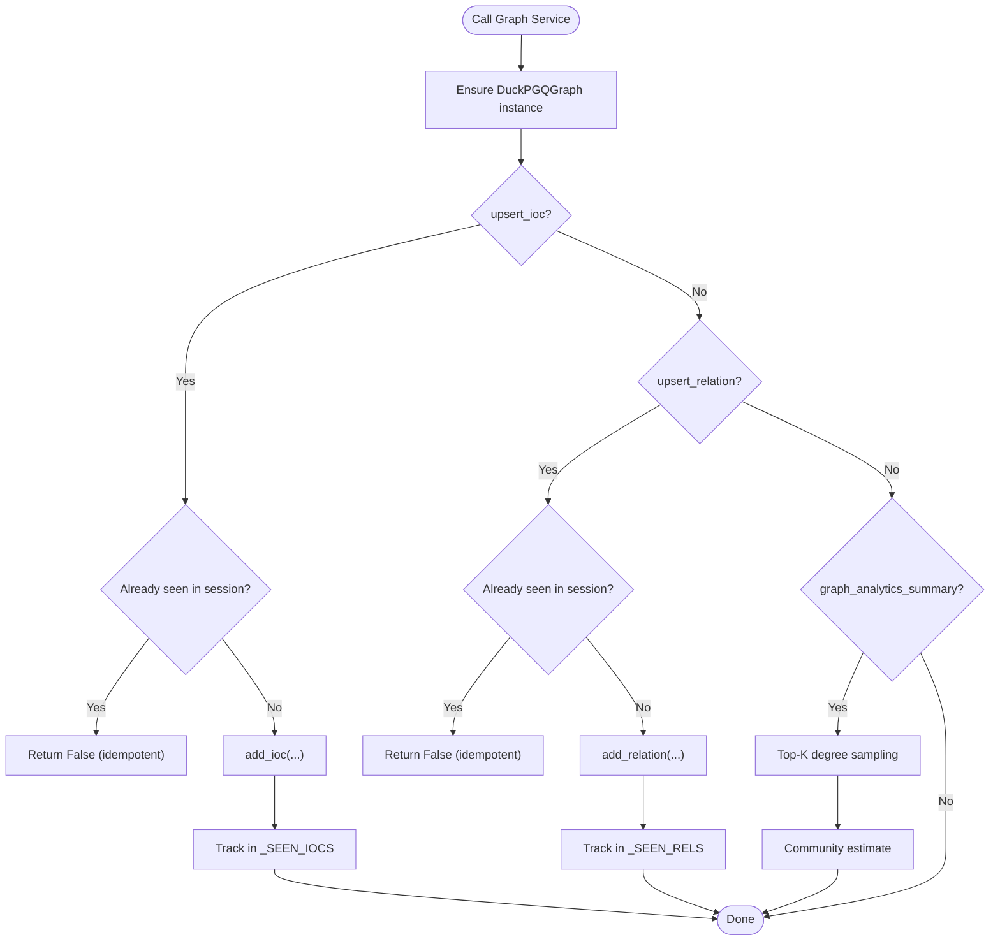
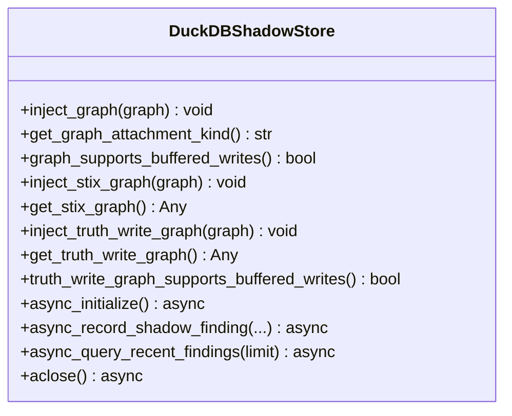
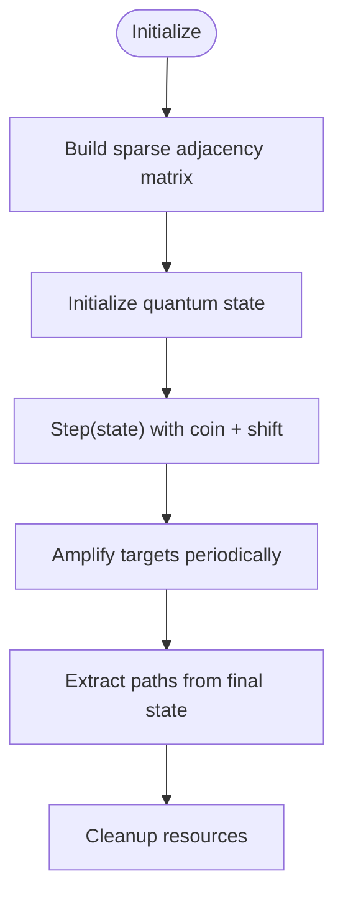
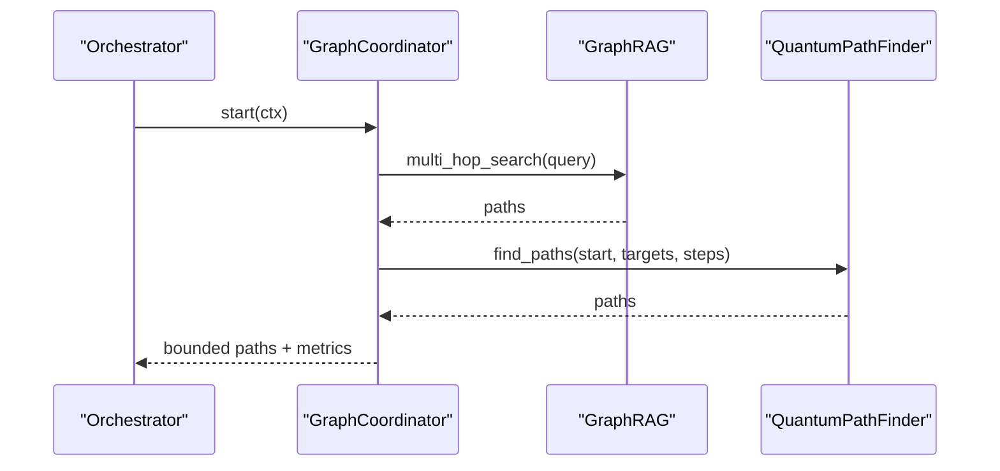
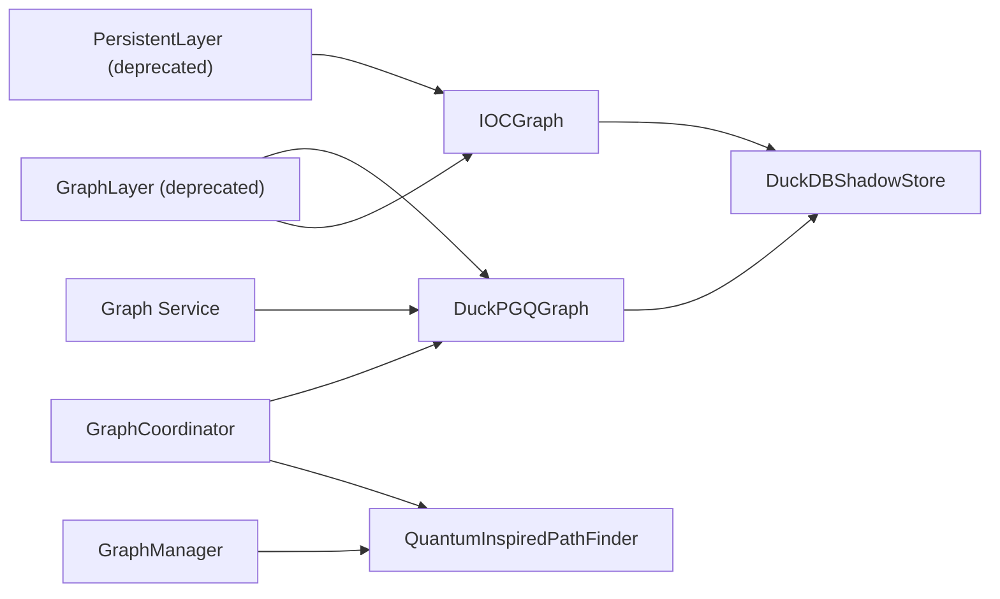

# Graph Service

<cite>
**Referenced Files in This Document**
- [graph_service.py](file://knowledge/graph_service.py)
- [quantum_pathfinder.py](file://graph/quantum_pathfinder.py)
- [ioc_graph.py](file://knowledge/ioc_graph.py)
- [context_graph.py](file://knowledge/context_graph.py)
- [graph_builder.py](file://knowledge/graph_builder.py)
- [duckdb_store.py](file://knowledge/duckdb_store.py)
- [graph_coordinator.py](file://coordinators/graph_coordinator.py)
- [graph_manager.py](file://graph/graph_manager.py)
- [graph_layer.py](file://knowledge/graph_layer.py)
- [persistent_layer.py](file://legacy/persistent_layer.py)
</cite>

## Table of Contents
1. [Introduction](#introduction)
2. [Project Structure](#project-structure)
3. [Core Components](#core-components)
4. [Architecture Overview](#architecture-overview)
5. [Detailed Component Analysis](#detailed-component-analysis)
6. [Dependency Analysis](#dependency-analysis)
7. [Performance Considerations](#performance-considerations)
8. [Troubleshooting Guide](#troubleshooting-guide)
9. [Conclusion](#conclusion)
10. [Appendices](#appendices)

## Introduction
This document describes the Graph Service ecosystem responsible for OSINT knowledge graph construction, analytics, and reasoning. It covers:
- Truth store: IOCGraph (Kuzu) for authoritative IOC entity storage and STIX export
- Analytics donor: DuckPGQGraph (DuckDB) for graph analytics and path queries
- Cross-sprint memory: Graph Service facade for idempotent upserts and analytics summaries
- Graph reasoning: Quantum-inspired pathfinding and coordinator orchestration
- Persistence and integration: DuckDB-backed sprint facts, IOCGraph injection, and legacy compatibility

## Project Structure
The Graph Service spans several modules:
- knowledge/graph_service.py: Graph Service facade for DuckPGQGraph analytics and cross-sprint memory
- graph/quantum_pathfinder.py: DuckPGQGraph backend and QuantumInspiredPathFinder ML overlay
- knowledge/ioc_graph.py: IOCGraph truth store with buffered writes and STIX export
- knowledge/context_graph.py: Deprecated in-memory context tracker
- knowledge/graph_builder.py: Regex-based extractor feeding IOCGraph
- knowledge/duckdb_store.py: DuckDB sidecar for sprint-level facts and analytics integration
- coordinators/graph_coordinator.py: Orchestration of GraphRAG and quantum pathfinder
- graph/graph_manager.py: Lightweight visualization and pathfinding helper
- knowledge/graph_layer.py: Deprecated orchestrator module
- legacy/persistent_layer.py: Legacy Kuzu-backed persistent layer (deprecated)

**Diagram sources**
- [graph_service.py:1-311](file://knowledge/graph_service.py#L1-L311)
- [quantum_pathfinder.py:1105-1435](file://graph/quantum_pathfinder.py#L1105-L1435)
- [ioc_graph.py:113-791](file://knowledge/ioc_graph.py#L113-L791)
- [duckdb_store.py:533-800](file://knowledge/duckdb_store.py#L533-L800)
- [graph_coordinator.py:52-322](file://coordinators/graph_coordinator.py#L52-L322)
- [graph_manager.py:27-256](file://graph/graph_manager.py#L27-L256)
- [graph_layer.py:23-131](file://knowledge/graph_layer.py#L23-L131)
- [persistent_layer.py:674-800](file://legacy/persistent_layer.py#L674-L800)

**Section sources**
- [graph_service.py:1-311](file://knowledge/graph_service.py#L1-L311)
- [quantum_pathfinder.py:1105-1435](file://graph/quantum_pathfinder.py#L1105-L1435)
- [ioc_graph.py:113-791](file://knowledge/ioc_graph.py#L113-L791)
- [context_graph.py:1-55](file://knowledge/context_graph.py#L1-L55)
- [graph_builder.py:24-235](file://knowledge/graph_builder.py#L24-L235)
- [duckdb_store.py:533-800](file://knowledge/duckdb_store.py#L533-L800)
- [graph_coordinator.py:52-322](file://coordinators/graph_coordinator.py#L52-L322)
- [graph_manager.py:27-256](file://graph/graph_manager.py#L27-L256)
- [graph_layer.py:23-131](file://knowledge/graph_layer.py#L23-L131)
- [persistent_layer.py:674-800](file://legacy/persistent_layer.py#L674-L800)

## Core Components
- DuckPGQGraph (DuckDB): SQL/PGQ graph backend providing analytics, path queries, and checkpoints. It owns ioc_nodes and ioc_edges tables and exposes add_ioc, add_relation, find_connected, export_edge_list, get_top_nodes_by_degree, stats, and checkpoint.
- IOCGraph (Kuzu): Truth store for IOC entities with buffered writes, pivot queries, and STIX export. Supports upsert_ioc, upsert_ioc_batch, record_observation, flush_buffers, graph_stats, and export_stix_bundle.
- Graph Service: Facade for cross-sprint memory and analytics. Exposes idempotent upsert_ioc, upsert_relation, upsert_identity_edge, find_entity_history, graph_stats, checkpoint, reset_session, and graph_analytics_summary.
- DuckDBShadowStore: Canonical sprint facts store and analytics sidecar. Provides async APIs for findings, runs, and scorecards; integrates IOCGraph for buffered writes; supports capability checks for graph attachment.
- QuantumInspiredPathFinder: ML overlay using MLX/NumPy/scipy.sparse for quantum-inspired walks, Grover amplification, and path reconstruction.
- GraphCoordinator: Delegator for GraphRAG and quantum pathfinder execution with bounded outputs.
- GraphManager: Lightweight visualization and pathfinding helper for small graphs.
- GraphBuilder: Regex-based extractor feeding IOCGraph with facts and relations.
- Deprecated modules: context_graph (in-memory), graph_layer (orchestrator), persistent_layer (legacy Kuzu).

**Section sources**
- [quantum_pathfinder.py:1105-1435](file://graph/quantum_pathfinder.py#L1105-L1435)
- [ioc_graph.py:113-791](file://knowledge/ioc_graph.py#L113-L791)
- [graph_service.py:45-311](file://knowledge/graph_service.py#L45-L311)
- [duckdb_store.py:533-800](file://knowledge/duckdb_store.py#L533-L800)
- [quantum_pathfinder.py:158-1063](file://graph/quantum_pathfinder.py#L158-L1063)
- [graph_coordinator.py:52-322](file://coordinators/graph_coordinator.py#L52-L322)
- [graph_manager.py:27-256](file://graph/graph_manager.py#L27-L256)
- [graph_builder.py:24-235](file://knowledge/graph_builder.py#L24-L235)
- [context_graph.py:1-55](file://knowledge/context_graph.py#L1-L55)
- [graph_layer.py:23-131](file://knowledge/graph_layer.py#L23-L131)
- [persistent_layer.py:674-800](file://legacy/persistent_layer.py#L674-L800)

## Architecture Overview
The system separates truth and analytics:
- Truth ownership: IOCGraph (Kuzu) persists authoritative IOC entities and relationships, supports buffered writes, and exports STIX.
- Analytics ownership: DuckPGQGraph (DuckDB) provides path queries, centrality summaries, and edge exports.
- Cross-sprint memory: Graph Service coordinates DuckPGQGraph for analytics and maintains idempotency within a sprint.
- Integration: DuckDBShadowStore consumes canonical findings and optionally injects IOCGraph for buffered writes and STIX export.

**Diagram sources**
- [graph_coordinator.py:167-221](file://coordinators/graph_coordinator.py#L167-L221)
- [quantum_pathfinder.py:763-826](file://graph/quantum_pathfinder.py#L763-L826)
- [quantum_pathfinder.py:1105-1435](file://graph/quantum_pathfinder.py#L1105-L1435)
- [ioc_graph.py:143-217](file://knowledge/ioc_graph.py#L143-L217)
- [duckdb_store.py:663-788](file://knowledge/duckdb_store.py#L663-L788)

## Detailed Component Analysis

### DuckPGQGraph (DuckDB Analytics Provider)
- Purpose: SQL/PGQ graph backend for analytics and path queries.
- Schema: ioc_nodes (id, value, ioc_type, confidence, source, first_seen) and ioc_edges (src_id, dst_id, rel_type, weight, evidence).
- Operations:
  - add_ioc(value, ioc_type, confidence, source) returns stable node ID
  - add_relation(src, dst, rel_type, weight, evidence)
  - find_connected(value, max_hops) with DuckPGQ GRAPH_TABLE path or CTE fallback
  - find_connected_batch(values, max_hops) with batched CTE
  - export_edge_list() for GNN inference
  - get_top_nodes_by_degree(n) for centrality summary
  - stats() for node/edge counts
  - checkpoint() to flush WAL
  - merge_from_parquet(glob) to import prior sprint data

**Diagram sources**
- [quantum_pathfinder.py:1105-1340](file://graph/quantum_pathfinder.py#L1105-L1340)

**Section sources**
- [quantum_pathfinder.py:1105-1340](file://graph/quantum_pathfinder.py#L1105-L1340)

### IOCGraph (Kuzu Truth Store)
- Purpose: Authoritative IOC entity storage and STIX export.
- Schema: IOC(id, ioc_type, value, first_seen, last_seen, confidence) and OBSERVED(from IOC TO IOC, finding_id, source_type, first_seen, last_seen).
- Buffered writes: buffer_ioc(), buffer_observation(), flush_buffers() with configurable thresholds.
- Upserts: upsert_ioc(), upsert_ioc_batch() return newly created IDs.
- Queries: pivot(ioc_value, ioc_type, depth) for multi-hop exploration.
- Analytics: graph_stats() node/edge counts.
- Export: export_stix_bundle() validates and serializes STIX 2.1 objects.

**Diagram sources**
- [ioc_graph.py:113-791](file://knowledge/ioc_graph.py#L113-L791)

**Section sources**
- [ioc_graph.py:113-791](file://knowledge/ioc_graph.py#L113-L791)

### Graph Service (Cross-Sprint Memory Facade)
- Purpose: Idempotent upserts and analytics for the current sprint; fail-safe operation on DuckPGQGraph failures.
- Idempotency: In-memory sets track seen IOCs and relations per session.
- Operations:
  - upsert_ioc(value, ioc_type, confidence, source)
  - upsert_relation(src, dst, rel_type, weight, evidence)
  - upsert_identity_edge(src, dst, confidence, evidence)
  - find_entity_history(value, max_hops)
  - graph_stats()
  - checkpoint()
  - reset_session()

**Diagram sources**
- [graph_service.py:45-311](file://knowledge/graph_service.py#L45-L311)

**Section sources**
- [graph_service.py:45-311](file://knowledge/graph_service.py#L45-L311)

### DuckDBShadowStore (Sprint Facts and Integration)
- Purpose: Canonical store for sprint-level facts and derived analytics; integrates with IOCGraph for buffered writes.
- Capabilities:
  - Inject IOCGraph for truth writes: buffer_ioc(), flush_buffers()
  - Capability checks: graph_supports_buffered_writes(), truth_write_graph_supports_buffered_writes()
  - STIX-only slot: inject_stix_graph() and get_stix_graph()
  - Async APIs: initialize, record findings, query recent findings, healthcheck, close
- Design: lazy DuckDB import, single-worker executor, thread-affine connections, RAMDISK-first mode.

**Diagram sources**
- [duckdb_store.py:533-800](file://knowledge/duckdb_store.py#L533-L800)

**Section sources**
- [duckdb_store.py:533-800](file://knowledge/duckdb_store.py#L533-L800)

### QuantumInspiredPathFinder (ML Overlay)
- Purpose: Quantum-inspired pathfinding using MLX/NumPy/scipy.sparse for M1-optimized memory usage.
- Initialization: Accepts networkx Graph, adjacency dict, or adjacency matrix; builds sparse COO representation.
- Algorithms:
  - Coin operator (Hadamard or Grover)
  - Shift operator via stochastic adjacency multiplication
  - Grover-style amplification for target nodes
  - Path extraction via greedy backtracking from final state
- Cleanup: Clears matrices, mappings, and MLX cache; forces garbage collection.

**Diagram sources**
- [quantum_pathfinder.py:158-1063](file://graph/quantum_pathfinder.py#L158-L1063)

**Section sources**
- [quantum_pathfinder.py:158-1063](file://graph/quantum_pathfinder.py#L158-L1063)

### GraphCoordinator (Reasoning Orchestration)
- Purpose: Delegates GraphRAG and quantum pathfinder execution with bounded outputs.
- Controls: max_walks_per_step, max_steps_per_walk, max_paths_per_step, enable flags.
- Fingerprint metadata: consumes CT subdomains, open storage buckets, source maps, onion mirrors, and favicon/JARM hashes to add edges.

**Diagram sources**
- [graph_coordinator.py:167-221](file://coordinators/graph_coordinator.py#L167-L221)

**Section sources**
- [graph_coordinator.py:52-322](file://coordinators/graph_coordinator.py#L52-L322)

### GraphManager (Visualization and Small Graph Pathfinding)
- Purpose: Lightweight visualization using networkx/pyvis and pathfinding for small graphs.
- Methods: add_entity, add_relation, export_html, find_path via internal quantum pathfinder wrapper.

**Section sources**
- [graph_manager.py:27-256](file://graph/graph_manager.py#L27-L256)

### GraphBuilder (Regex-Based Extraction)
- Purpose: Memory-safe extraction of facts from text using regex patterns; forwards to IOCGraph via knowledge layer.
- Features: relation extraction (is_a, causes, located_in, part_of, contains), metadata-driven generation, and author/url linking.

**Section sources**
- [graph_builder.py:24-235](file://knowledge/graph_builder.py#L24-L235)

### Deprecated Modules
- context_graph: Simple in-memory context tracker (not for persistent storage).
- graph_layer: Deprecated orchestrator module; use IOCGraph and DuckPGQGraph directly.
- persistent_layer: Legacy Kuzu-backed persistent layer (deprecated in favor of DuckDBShadowStore and IOCGraph).

**Section sources**
- [context_graph.py:1-55](file://knowledge/context_graph.py#L1-L55)
- [graph_layer.py:23-131](file://knowledge/graph_layer.py#L23-L131)
- [persistent_layer.py:674-800](file://legacy/persistent_layer.py#L674-L800)

## Dependency Analysis
- DuckPGQGraph depends on DuckDB and optionally DuckPGQ extension; falls back to CTE for paths.
- IOCGraph depends on Kuzu; uses single-threaded executor for thread-safety.
- Graph Service depends on DuckPGQGraph and maintains idempotency via in-memory sets.
- DuckDBShadowStore injects IOCGraph for buffered writes and capability checks.
- GraphCoordinator orchestrates GraphRAG and QuantumPathFinder; uses DuckPGQGraph for analytics.
- GraphManager depends on QuantumPathFinder for pathfinding and networkx/pyvis for visualization.

**Diagram sources**
- [graph_service.py:33-42](file://knowledge/graph_service.py#L33-L42)
- [quantum_pathfinder.py:1105-1435](file://graph/quantum_pathfinder.py#L1105-L1435)
- [ioc_graph.py:122-131](file://knowledge/ioc_graph.py#L122-L131)
- [duckdb_store.py:663-788](file://knowledge/duckdb_store.py#L663-L788)
- [graph_coordinator.py:180-221](file://coordinators/graph_coordinator.py#L180-L221)
- [graph_manager.py:158-170](file://graph/graph_manager.py#L158-L170)
- [graph_layer.py:47-59](file://knowledge/graph_layer.py#L47-L59)
- [persistent_layer.py:200-254](file://legacy/persistent_layer.py#L200-L254)

**Section sources**
- [graph_service.py:33-42](file://knowledge/graph_service.py#L33-L42)
- [quantum_pathfinder.py:1105-1435](file://graph/quantum_pathfinder.py#L1105-L1435)
- [ioc_graph.py:122-131](file://knowledge/ioc_graph.py#L122-L131)
- [duckdb_store.py:663-788](file://knowledge/duckdb_store.py#L663-L788)
- [graph_coordinator.py:180-221](file://coordinators/graph_coordinator.py#L180-L221)
- [graph_manager.py:158-170](file://graph/graph_manager.py#L158-L170)
- [graph_layer.py:47-59](file://knowledge/graph_layer.py#L47-L59)
- [persistent_layer.py:200-254](file://legacy/persistent_layer.py#L200-L254)

## Performance Considerations
- DuckPGQGraph:
  - DuckPGQ extension preferred for vectorized Arrow IPC and MATCH clauses; falls back to CTE.
  - checkpoint() ensures durability across restarts.
  - get_top_nodes_by_degree() and export_edge_list() bound by limits to control memory.
- IOCGraph:
  - Buffered writes reduce I/O; flush_buffers() consolidates writes.
  - Single-threaded executor prevents race conditions; idempotent upserts minimize redundant writes.
- QuantumInspiredPathFinder:
  - Lazy imports (MLX, scipy.sparse, NumPy) avoid overhead when not used.
  - Sparse COO matrices and periodic garbage collection optimize M1 8GB RAM.
  - Amplitude amplification reduces search steps to targets.
- DuckDBShadowStore:
  - Lazy DuckDB import, single-worker executor, thread-affine connections.
  - RAMDISK-first mode improves performance; health checks and idempotent close.
- Graph Service:
  - In-memory idempotency prevents duplicate writes within a sprint.
  - Bounded analytics summary protects memory usage.

[No sources needed since this section provides general guidance]

## Troubleshooting Guide
- DuckPGQGraph path failures:
  - DuckPGQ extension missing: falls back to CTE; verify installation and permissions.
  - WAL not flushing: call checkpoint() after WINDUP.
- IOCGraph errors:
  - Kuzu not installed: fallback to JSON backend; install Kuzu for full functionality.
  - Concurrency: single-threaded executor; avoid concurrent queries.
- Graph Service:
  - Singleton initialization failures: log warning; operations return safe defaults.
  - Session idempotency leaks: call reset_session() at sprint start.
- DuckDBShadowStore:
  - DuckDB import errors: lazy import mitigates; check environment variables for memory limits.
  - Capability checks: use graph_supports_buffered_writes() before triggering buffered writes.
- QuantumInspiredPathFinder:
  - MLX unavailable: uses NumPy fallback; clear caches and eval to free memory.
  - Large graphs: reduce max_nodes and top_k; enable garbage collection.

**Section sources**
- [quantum_pathfinder.py:1075-1091](file://graph/quantum_pathfinder.py#L1075-L1091)
- [quantum_pathfinder.py:1128-1138](file://graph/quantum_pathfinder.py#L1128-L1138)
- [ioc_graph.py:229-240](file://knowledge/ioc_graph.py#L229-L240)
- [graph_service.py:33-42](file://knowledge/graph_service.py#L33-L42)
- [graph_service.py:152-159](file://knowledge/graph_service.py#L152-L159)
- [duckdb_store.py:363-370](file://knowledge/duckdb_store.py#L363-L370)
- [duckdb_store.py:693-713](file://knowledge/duckdb_store.py#L693-L713)
- [quantum_pathfinder.py:807-845](file://graph/quantum_pathfinder.py#L807-L845)

## Conclusion
The Graph Service ecosystem cleanly separates truth and analytics:
- IOCGraph (Kuzu) owns authoritative IOC entities and STIX export.
- DuckPGQGraph (DuckDB) provides analytics, path queries, and centrality summaries.
- Graph Service coordinates cross-sprint memory and analytics with idempotency.
- DuckDBShadowStore integrates sprint facts and optional IOCGraph injection.
- Quantum-inspired pathfinding and coordinator orchestration enable scalable reasoning on large graphs.

[No sources needed since this section summarizes without analyzing specific files]

## Appendices

### Graph Construction Workflow
- Extract facts from content using GraphBuilder.
- Upsert IOCs and relations into IOCGraph (truth store) via buffered writes.
- Optionally query DuckPGQGraph for analytics and centrality.
- Use GraphCoordinator to run GraphRAG and quantum pathfinder.
- Persist sprint-level findings via DuckDBShadowStore.

**Section sources**
- [graph_builder.py:117-203](file://knowledge/graph_builder.py#L117-L203)
- [ioc_graph.py:176-217](file://knowledge/ioc_graph.py#L176-L217)
- [graph_coordinator.py:180-221](file://coordinators/graph_coordinator.py#L180-L221)
- [duckdb_store.py:533-600](file://knowledge/duckdb_store.py#L533-L600)

### Query and Traversal Examples
- Find connected entities within N hops:
  - DuckPGQGraph.find_connected(value, max_hops)
  - DuckPGQGraph.find_connected_batch(values, max_hops)
- Top central entities:
  - DuckPGQGraph.get_top_nodes_by_degree(n)
- Export edges for GNN:
  - DuckPGQGraph.export_edge_list()
- Pivot IOCs:
  - IOCGraph.pivot(ioc_value, ioc_type, depth)

**Section sources**
- [quantum_pathfinder.py:1240-1333](file://graph/quantum_pathfinder.py#L1240-L1333)
- [quantum_pathfinder.py:1184-1197](file://graph/quantum_pathfinder.py#L1184-L1197)
- [quantum_pathfinder.py:1165-1183](file://graph/quantum_pathfinder.py#L1165-L1183)
- [ioc_graph.py:575-637](file://knowledge/ioc_graph.py#L575-L637)

### Relationship Discovery and Pattern Matching
- Fingerprint metadata ingestion:
  - GraphCoordinator.consume_fingerprint_metadata(url, metadata) adds edges for subdomains, storage buckets, source maps, onion mirrors, and same infrastructure via hashes.
- GraphBuilder pattern matching:
  - Regex-based extraction of relations (is_a, causes, located_in, part_of, contains) from text.

**Section sources**
- [graph_coordinator.py:237-322](file://coordinators/graph_coordinator.py#L237-L322)
- [graph_builder.py:37-101](file://knowledge/graph_builder.py#L37-L101)

### Persistence, Backup, and Maintenance
- DuckPGQGraph checkpoint() flushes WAL to disk.
- DuckDBShadowStore healthchecks and idempotent close.
- IOCGraph flush_buffers() ensures buffered writes are persisted.
- Graph Service reset_session() clears idempotency and singleton to prevent cross-sprint leakage.

**Section sources**
- [quantum_pathfinder.py:1128-1138](file://graph/quantum_pathfinder.py#L1128-L1138)
- [duckdb_store.py:595-601](file://knowledge/duckdb_store.py#L595-L601)
- [ioc_graph.py:176-217](file://knowledge/ioc_graph.py#L176-L217)
- [graph_service.py:152-159](file://knowledge/graph_service.py#L152-L159)

### Scaling and Optimization
- DuckPGQGraph:
  - Prefer DuckPGQ extension; bound analytics outputs (top_k, node limits).
- IOCGraph:
  - Tune buffer sizes; use flush_buffers() strategically.
- QuantumInspiredPathFinder:
  - Reduce max_nodes and top_k; leverage MLX when available.
- DuckDBShadowStore:
  - Configure memory and temp directory via environment variables; use RAMDISK for performance.

**Section sources**
- [quantum_pathfinder.py:136-156](file://graph/quantum_pathfinder.py#L136-L156)
- [quantum_pathfinder.py:117-134](file://graph/quantum_pathfinder.py#L117-L134)
- [duckdb_store.py:377-411](file://knowledge/duckdb_store.py#L377-L411)