# Knowledge Layer

<cite>
**Referenced Files in This Document**
- [knowledge/__init__.py](file://knowledge/__init__.py)
- [knowledge/duckdb_store.py](file://knowledge/duckdb_store.py)
- [knowledge/semantic_store.py](file://knowledge/semantic_store.py)
- [knowledge/vector_store.py](file://knowledge/vector_store.py)
- [knowledge/graph_service.py](file://knowledge/graph_service.py)
- [knowledge/graph_layer.py](file://knowledge/graph_layer.py)
- [knowledge/lancedb_store.py](file://knowledge/lancedb_store.py)
- [knowledge/context_graph.py](file://knowledge/context_graph.py)
- [knowledge/rag_engine.py](file://knowledge/rag_engine.py)
- [knowledge/graph_rag.py](file://knowledge/graph_rag.py)
- [knowledge/entity_linker.py](file://knowledge/entity_linker.py)
- [knowledge/graph_builder.py](file://knowledge/graph_builder.py)
- [knowledge/target_memory.py](file://knowledge/target_memory.py)
</cite>

## Table of Contents
1. [Introduction](#introduction)
2. [Project Structure](#project-structure)
3. [Core Components](#core-components)
4. [Architecture Overview](#architecture-overview)
5. [Detailed Component Analysis](#detailed-component-analysis)
6. [Dependency Analysis](#dependency-analysis)
7. [Performance Considerations](#performance-considerations)
8. [Troubleshooting Guide](#troubleshooting-guide)
9. [Conclusion](#conclusion)
10. [Appendices](#appendices)

## Introduction
This document describes the Knowledge Layer subsystem that powers grounding, retrieval, semantic search, vector storage, identity/entity resolution, graph services, and multi-hop reasoning. It covers DuckDB-backed analytics and facts, semantic stores for IOC search, LanceDB-based vector and identity stores, and knowledge graph services. The content is organized to be accessible to newcomers while providing sufficient technical depth for experienced developers.

## Project Structure
The Knowledge Layer lives primarily under the knowledge/ package and integrates with broader subsystems (e.g., embedding managers, graph backends). Key modules include:
- DuckDB analytics and facts store
- Semantic and vector stores
- Graph services and builders
- Identity/entity resolution
- Retrieval and grounding engines
- Target memory for cross-sprint persistence

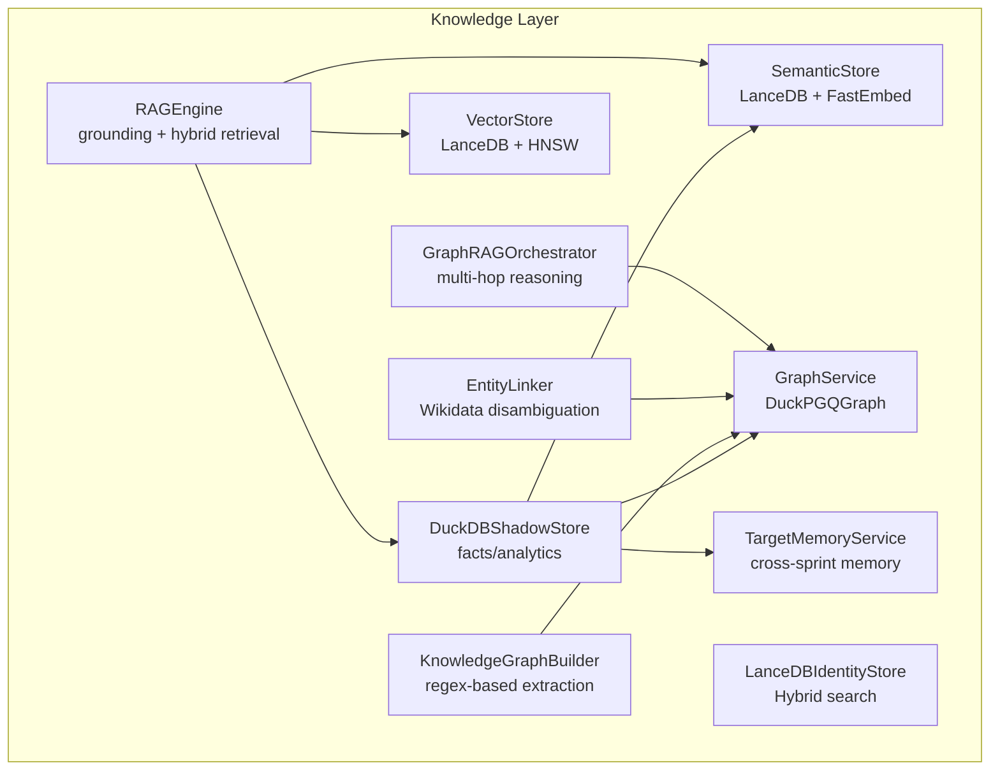

**Diagram sources**
- [knowledge/duckdb_store.py:533-800](file://knowledge/duckdb_store.py#L533-L800)
- [knowledge/semantic_store.py:42-301](file://knowledge/semantic_store.py#L42-L301)
- [knowledge/vector_store.py:44-308](file://knowledge/vector_store.py#L44-L308)
- [knowledge/lancedb_store.py:66-200](file://knowledge/lancedb_store.py#L66-L200)
- [knowledge/graph_service.py:26-160](file://knowledge/graph_service.py#L26-L160)
- [knowledge/rag_engine.py:1-200](file://knowledge/rag_engine.py#L1-L200)
- [knowledge/graph_rag.py:93-160](file://knowledge/graph_rag.py#L93-L160)
- [knowledge/entity_linker.py:1-120](file://knowledge/entity_linker.py#L1-L120)
- [knowledge/graph_builder.py:24-120](file://knowledge/graph_builder.py#L24-L120)
- [knowledge/target_memory.py:56-120](file://knowledge/target_memory.py#L56-L120)

**Section sources**
- [knowledge/__init__.py:1-189](file://knowledge/__init__.py#L1-L189)

## Core Components
- DuckDBShadowStore: Canonical facts/analytics store with async-safe operations, quality gates, persistent dedup, and optional integration with graph backends and semantic store.
- SemanticStore: FastEmbed + LanceDB for semantic IOC search; buffers findings and flushes to LanceDB; supports ANN search.
- VectorStore: LanceDB-backed vector store with separate text and image indices; supports streaming batch adds and cosine similarity queries.
- LanceDBIdentityStore: Hybrid vector + FTS identity store with embedding cache, MLX acceleration, binary prefilter, and adaptive reranking.
- GraphService: Cross-sprint memory layer facade over DuckPGQGraph; idempotent upserts, history lookup, and analytics summary.
- RAGEngine: Grounding authority integrating ultra-context, SPR compression, hybrid retrieval (dense + sparse), and HNSW vector search.
- GraphRAGOrchestrator: Multi-hop reasoning over graph backends; centrality, communities, contradiction detection, and timeline analysis.
- EntityLinker: Wikidata-based entity linking with context-aware ranking and caching.
- KnowledgeGraphBuilder: Regex-based fact extractor that feeds into authoritative graph backends.
- TargetMemoryService: Bounded cross-sprint memory with RAM guard and drift explainability.

**Section sources**
- [knowledge/duckdb_store.py:533-800](file://knowledge/duckdb_store.py#L533-L800)
- [knowledge/semantic_store.py:42-301](file://knowledge/semantic_store.py#L42-L301)
- [knowledge/vector_store.py:44-308](file://knowledge/vector_store.py#L44-L308)
- [knowledge/lancedb_store.py:66-200](file://knowledge/lancedb_store.py#L66-L200)
- [knowledge/graph_service.py:26-160](file://knowledge/graph_service.py#L26-L160)
- [knowledge/rag_engine.py:55-120](file://knowledge/rag_engine.py#L55-L120)
- [knowledge/graph_rag.py:93-160](file://knowledge/graph_rag.py#L93-L160)
- [knowledge/entity_linker.py:82-184](file://knowledge/entity_linker.py#L82-L184)
- [knowledge/graph_builder.py:24-120](file://knowledge/graph_builder.py#L24-L120)
- [knowledge/target_memory.py:56-120](file://knowledge/target_memory.py#L56-L120)

## Architecture Overview
The Knowledge Layer orchestrates retrieval, grounding, and graph reasoning:
- RAGEngine is the grounding authority and coordinates hybrid retrieval (sparse BM25 + dense HNSW).
- DuckDBShadowStore persists facts and analytics and optionally integrates with graph and semantic stores.
- SemanticStore and VectorStore provide complementary search modalities.
- GraphService and GraphRAGOrchestrator enable multi-hop reasoning over graph backends.
- LanceDBIdentityStore supports identity/entity resolution with hybrid search and memory optimization.
- EntityLinker enriches extracted entities with Wikidata canonical forms.
- KnowledgeGraphBuilder extracts structured facts from content and feeds graph backends.
- TargetMemoryService maintains bounded cross-sprint memory.

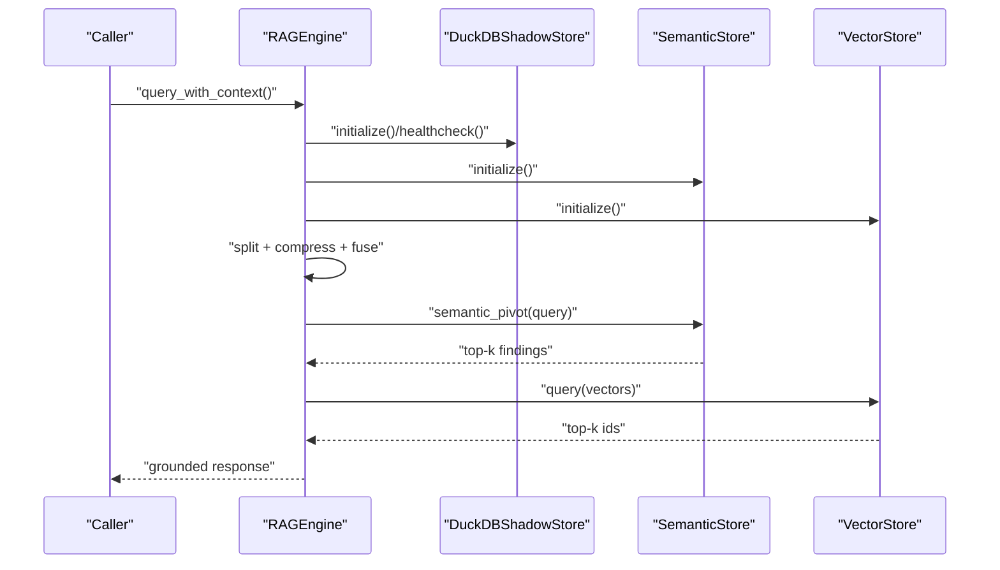

**Diagram sources**
- [knowledge/rag_engine.py:55-120](file://knowledge/rag_engine.py#L55-L120)
- [knowledge/duckdb_store.py:533-660](file://knowledge/duckdb_store.py#L533-L660)
- [knowledge/semantic_store.py:220-266](file://knowledge/semantic_store.py#L220-L266)
- [knowledge/vector_store.py:211-277](file://knowledge/vector_store.py#L211-L277)

## Detailed Component Analysis

### DuckDBShadowStore
- Role: Canonical facts/analytics store for sprint-level records; integrates with graph and semantic stores.
- Async design: Uses a single-threaded worker via ThreadPoolExecutor; all public async methods run_in_executor.
- Schema tiers: Tier 1 (sprint_delta, sprint_scorecard, source_hit_log), Tier 2 (shadow_findings, shadow_runs), Tier 3 (graph backends).
- Quality gates: Entropy filtering, duplicate detection, and persistent LMDB-based dedup.
- Graph integration: Supports injecting IOCGraph (truth) and STIX graphs; guarded capability checks.
- Persistence: File-backed or in-memory mode depending on environment; configurable memory and temp limits.

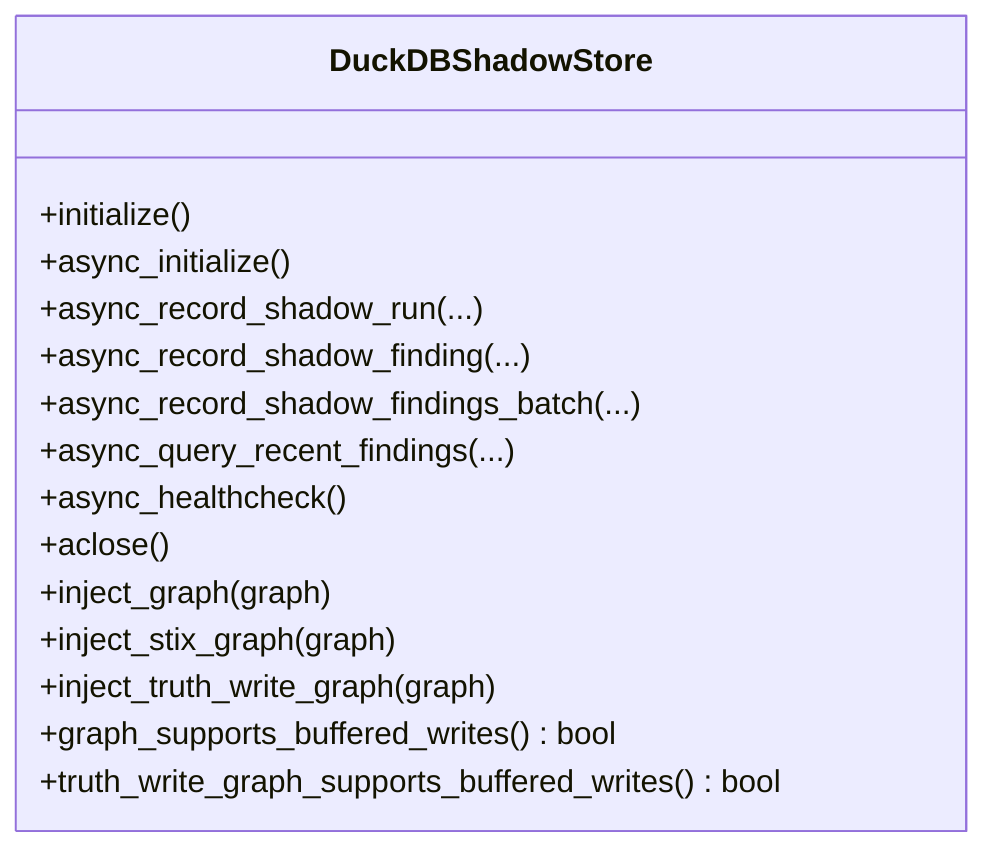

**Diagram sources**
- [knowledge/duckdb_store.py:533-790](file://knowledge/duckdb_store.py#L533-L790)

**Section sources**
- [knowledge/duckdb_store.py:533-800](file://knowledge/duckdb_store.py#L533-L800)

### SemanticStore
- Role: Consumer/Enrichment store for semantic IOC search; not the embedding owner nor the primary retrieval engine.
- Lifecycle: initialize() loads FastEmbed model and opens LanceDB table; flush() batches embeddings and upserts; semantic_pivot() performs ANN search.
- Buffering: bounded pending queue to prevent unbounded growth.
- Metrics: cosine similarity search; returns top-k with scores.

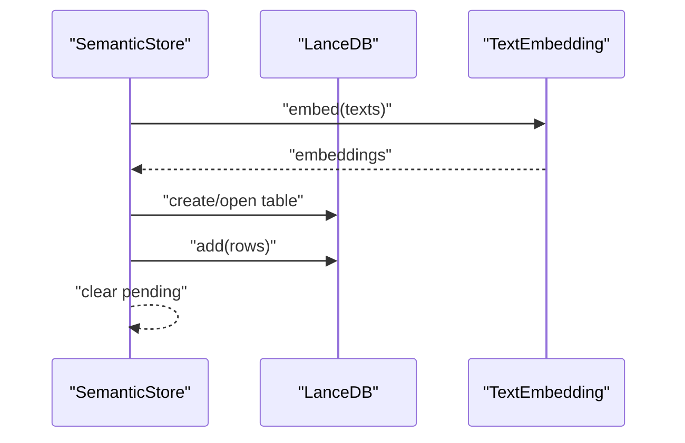

**Diagram sources**
- [knowledge/semantic_store.py:80-214](file://knowledge/semantic_store.py#L80-L214)

**Section sources**
- [knowledge/semantic_store.py:42-301](file://knowledge/semantic_store.py#L42-L301)

### VectorStore
- Role: Primary vector storage for embedding pipeline with separate text and image indices.
- Indices: Text (256d MRL) and image (1024d); lazy initialization on first add_vectors.
- Streaming: add_vectors_streaming() yields control between chunks to reduce RSS on constrained hardware.
- Query: cosine similarity search via LanceDB.

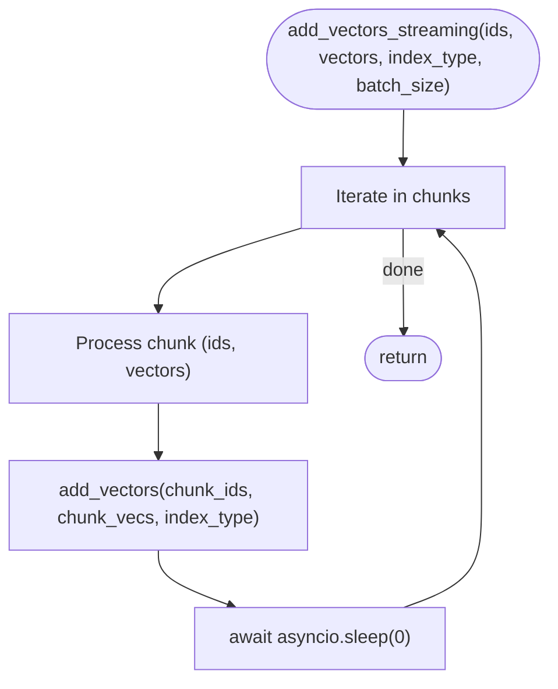

**Diagram sources**
- [knowledge/vector_store.py:180-210](file://knowledge/vector_store.py#L180-L210)

**Section sources**
- [knowledge/vector_store.py:44-308](file://knowledge/vector_store.py#L44-L308)

### LanceDBIdentityStore
- Role: Identity/Entity Store (not grounding authority).
- Hybrid search: vector + FTS; supports binary prefilter and MMR diversity.
- Acceleration: MLX fallback; float16 embedding cache; periodic writeback buffer.
- Resilience: fail-safe degradation; health checks; memory-aware index building.

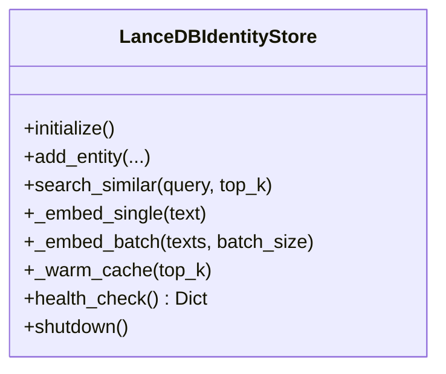

**Diagram sources**
- [knowledge/lancedb_store.py:66-200](file://knowledge/lancedb_store.py#L66-L200)

**Section sources**
- [knowledge/lancedb_store.py:66-200](file://knowledge/lancedb_store.py#L66-L200)

### GraphService
- Role: Cross-sprint memory layer facade over DuckPGQGraph; idempotent upserts and history lookup.
- Operations: upsert_ioc, upsert_relation, find_entity_history, graph_stats, checkpoint, reset_session, graph_analytics_summary.
- Safety: fail-safe behavior; bounded analytics outputs.

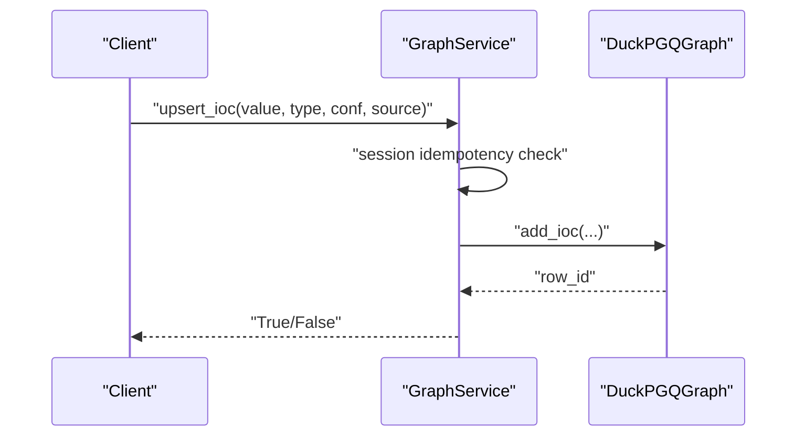

**Diagram sources**
- [knowledge/graph_service.py:45-105](file://knowledge/graph_service.py#L45-L105)

**Section sources**
- [knowledge/graph_service.py:26-160](file://knowledge/graph_service.py#L26-L160)

### RAGEngine
- Role: Grounding Authority (not owner of identity or embeddings).
- Features: Ultra Context, SPR compression, Secure Enclave, hybrid retrieval (BM25 + HNSW), MLX-native execution.
- Config: RAGConfig controls enabling/disabling components and thresholds.
- Indexes: BM25Index and HNSWVectorIndex for sparse and dense retrieval.

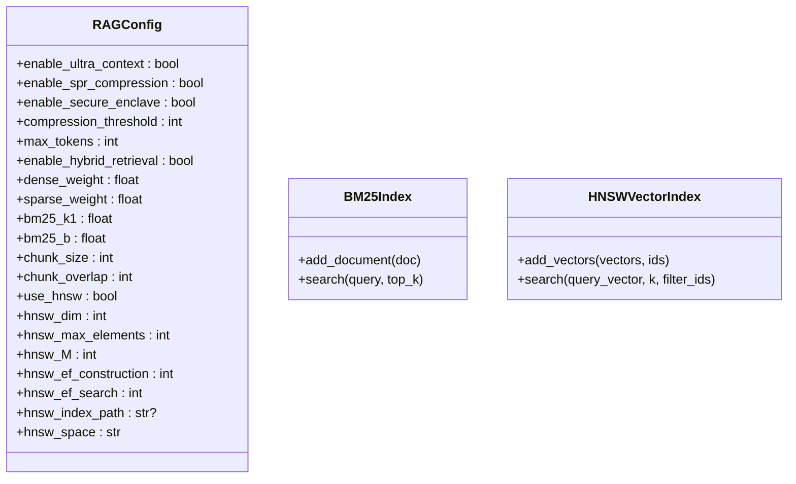

**Diagram sources**
- [knowledge/rag_engine.py:55-120](file://knowledge/rag_engine.py#L55-L120)
- [knowledge/rag_engine.py:106-190](file://knowledge/rag_engine.py#L106-L190)
- [knowledge/rag_engine.py:192-400](file://knowledge/rag_engine.py#L192-L400)

**Section sources**
- [knowledge/rag_engine.py:55-200](file://knowledge/rag_engine.py#L55-L200)

### GraphRAGOrchestrator
- Role: Consumer/Orchestrator for multi-hop reasoning; not the backend owner.
- Capabilities: multi-hop traversal, centrality analysis, community detection, contradiction detection, timeline analysis, narrative synthesis.
- Embedder: uses shared MLXEmbeddingManager singleton to avoid duplication.

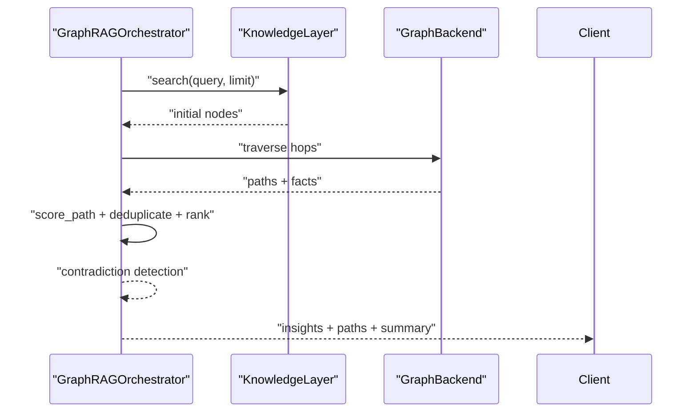

**Diagram sources**
- [knowledge/graph_rag.py:246-400](file://knowledge/graph_rag.py#L246-L400)

**Section sources**
- [knowledge/graph_rag.py:93-200](file://knowledge/graph_rag.py#L93-L200)

### EntityLinker
- Role: Wikidata-based entity linking and disambiguation.
- Features: async HTTP requests, context-aware candidate ranking, response caching, batch processing, optional GLiNER integration.
- Data contracts: EntityCandidate and LinkedEntity dataclasses.

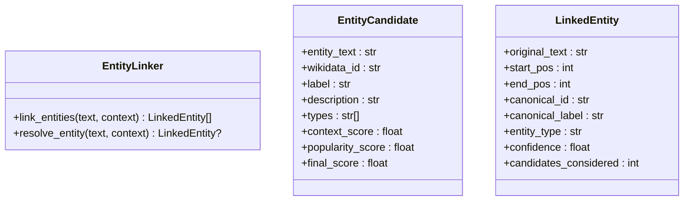

**Diagram sources**
- [knowledge/entity_linker.py:82-184](file://knowledge/entity_linker.py#L82-L184)

**Section sources**
- [knowledge/entity_linker.py:1-200](file://knowledge/entity_linker.py#L1-L200)

### KnowledgeGraphBuilder
- Role: Helper/extractor that processes content and feeds results into authoritative graph backends.
- Method: extract_facts() uses regex patterns; process_and_store() creates nodes and relations.

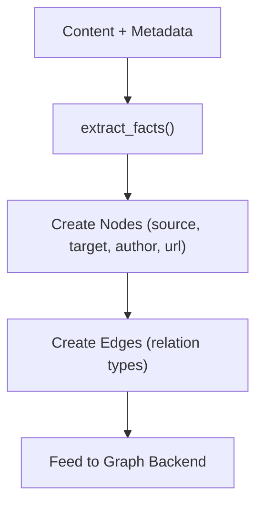

**Diagram sources**
- [knowledge/graph_builder.py:67-120](file://knowledge/graph_builder.py#L67-L120)

**Section sources**
- [knowledge/graph_builder.py:24-200](file://knowledge/graph_builder.py#L24-L200)

### TargetMemoryService
- Role: Bounded cross-sprint target memory with RAM guard and drift explainability.
- Contracts: TargetMemoryUpdate and TargetMemory dataclasses; enforces facet bounds and computes drift reasons.

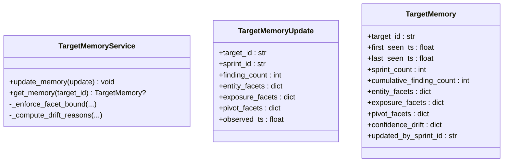

**Diagram sources**
- [knowledge/target_memory.py:56-120](file://knowledge/target_memory.py#L56-L120)

**Section sources**
- [knowledge/target_memory.py:56-200](file://knowledge/target_memory.py#L56-L200)

### Conceptual Overview
- DuckDBShadowStore is the canonical facts/analytics authority for sprint-level records and integrates with graph and semantic stores.
- RAGEngine is the grounding authority; it coordinates hybrid retrieval and relies on external stores for embeddings and graph backends.
- GraphService and GraphRAGOrchestrator enable multi-hop reasoning over graph backends.
- EntityLinker and KnowledgeGraphBuilder enrich and populate the graph with canonical entities and structured facts.
- TargetMemoryService provides bounded cross-sprint persistence.

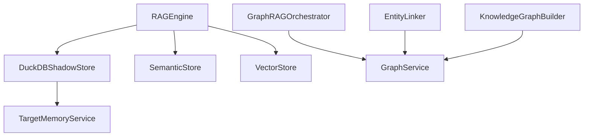

[No sources needed since this diagram shows conceptual workflow, not actual code structure]

## Dependency Analysis
- DuckDBShadowStore depends on DuckDB (imported lazily), LMDB for persistent dedup, and optional graph/semantic integrations.
- SemanticStore depends on LanceDB and FastEmbed; VectorStore depends on LanceDB and PyArrow.
- GraphService depends on DuckPGQGraph; GraphRAGOrchestrator depends on a knowledge layer interface and shared embedder.
- LanceDBIdentityStore depends on LMDB, optional MLX/CoreML/Numpy fallbacks, and embedding cache.
- EntityLinker depends on aiohttp and rapidfuzz; optionally uses GLiNER.
- KnowledgeGraphBuilder depends on legacy types for node/edge modeling.
- TargetMemoryService depends on JSON parsing and bounded memory constraints.

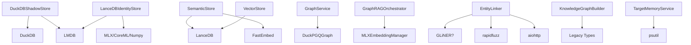

**Diagram sources**
- [knowledge/duckdb_store.py:363-410](file://knowledge/duckdb_store.py#L363-L410)
- [knowledge/semantic_store.py:90-110](file://knowledge/semantic_store.py#L90-L110)
- [knowledge/vector_store.py:68-120](file://knowledge/vector_store.py#L68-L120)
- [knowledge/graph_service.py:33-42](file://knowledge/graph_service.py#L33-L42)
- [knowledge/graph_rag.py:142-149](file://knowledge/graph_rag.py#L142-L149)
- [knowledge/lancedb_store.py:37-60](file://knowledge/lancedb_store.py#L37-L60)
- [knowledge/entity_linker.py:47-80](file://knowledge/entity_linker.py#L47-L80)
- [knowledge/graph_builder.py:107-115](file://knowledge/graph_builder.py#L107-L115)
- [knowledge/target_memory.py:13-28](file://knowledge/target_memory.py#L13-L28)

**Section sources**
- [knowledge/duckdb_store.py:363-410](file://knowledge/duckdb_store.py#L363-L410)
- [knowledge/semantic_store.py:90-110](file://knowledge/semantic_store.py#L90-L110)
- [knowledge/vector_store.py:68-120](file://knowledge/vector_store.py#L68-L120)
- [knowledge/graph_service.py:33-42](file://knowledge/graph_service.py#L33-L42)
- [knowledge/graph_rag.py:142-149](file://knowledge/graph_rag.py#L142-L149)
- [knowledge/lancedb_store.py:37-60](file://knowledge/lancedb_store.py#L37-L60)
- [knowledge/entity_linker.py:47-80](file://knowledge/entity_linker.py#L47-L80)
- [knowledge/graph_builder.py:107-115](file://knowledge/graph_builder.py#L107-L115)
- [knowledge/target_memory.py:13-28](file://knowledge/target_memory.py#L13-L28)

## Performance Considerations
- DuckDBShadowStore
  - Uses a single-threaded worker to avoid contention; all async methods run_in_executor.
  - Environment variables control memory and temp limits; validates inputs to prevent SQL injection.
  - Persistent dedup via LMDB reduces redundant writes; bounded hot cache prevents unbounded growth.
- SemanticStore
  - Bounded pending buffer; warm-up embedding; batched flush to LanceDB.
  - Uses CPU executor to avoid blocking the event loop.
- VectorStore
  - Streaming batch adds to reduce RSS on constrained hardware; dimension checks and lazy initialization.
- LanceDBIdentityStore
  - Float16 embedding cache with TTL; binary prefilter for fast pre-selection; MLX acceleration with fallbacks.
- RAGEngine
  - HNSW index with configurable parameters; hybrid retrieval weights; BM25 optimization via rank_bm25.
- GraphRAGOrchestrator
  - Bounded queues and visited sets; shared embedder to avoid duplication; path scoring with relevance and credibility.

[No sources needed since this section provides general guidance]

## Troubleshooting Guide
- DuckDBShadowStore
  - Health checks and idempotent operations; persistent dedup errors surfaced via typed results; environment variable validation prevents misconfiguration.
- SemanticStore
  - Missing LanceDB or model load failures; ensure db path exists and model is available; flush on close to guarantee persistence.
- VectorStore
  - Missing LanceDB; dimension mismatches; streaming errors logged but do not raise (fail-open).
- LanceDBIdentityStore
  - Embedding cache initialization failures; memory pressure handling; index build deferred under low RAM conditions.
- GraphService
  - DuckPGQGraph initialization failures; session-level idempotency prevents duplicate writes; reset_session clears state.
- RAGEngine
  - HNSW initialization fallback to brute-force; dimension mismatches; BM25 library availability affects performance.
- GraphRAGOrchestrator
  - Shared embedder acquisition failures; path scoring fallbacks; bounded traversal to prevent memory issues.
- EntityLinker
  - Missing aiohttp or rapidfuzz; GLiNER availability; cache TTL and eviction behavior.
- KnowledgeGraphBuilder
  - Legacy type imports guarded to avoid coupling; ensure metadata completeness for relations.
- TargetMemoryService
  - Facet bounds exceeded; JSON parsing errors; drift reason computation falls back to legacy ratios.

**Section sources**
- [knowledge/duckdb_store.py:381-410](file://knowledge/duckdb_store.py#L381-L410)
- [knowledge/semantic_store.py:288-301](file://knowledge/semantic_store.py#L288-L301)
- [knowledge/vector_store.py:115-121](file://knowledge/vector_store.py#L115-L121)
- [knowledge/lancedb_store.py:432-460](file://knowledge/lancedb_store.py#L432-L460)
- [knowledge/graph_service.py:152-160](file://knowledge/graph_service.py#L152-L160)
- [knowledge/rag_engine.py:250-254](file://knowledge/rag_engine.py#L250-L254)
- [knowledge/graph_rag.py:142-149](file://knowledge/graph_rag.py#L142-L149)
- [knowledge/entity_linker.py:47-80](file://knowledge/entity_linker.py#L47-L80)
- [knowledge/graph_builder.py:107-115](file://knowledge/graph_builder.py#L107-L115)
- [knowledge/target_memory.py:62-94](file://knowledge/target_memory.py#L62-L94)

## Conclusion
The Knowledge Layer integrates multiple specialized stores and services to provide robust grounding, retrieval, semantic search, and graph reasoning. DuckDBShadowStore anchors analytics and facts, while SemanticStore and VectorStore complement dense and lexical retrieval. GraphService and GraphRAGOrchestrator enable multi-hop reasoning, and LanceDBIdentityStore supports identity resolution. EntityLinker and KnowledgeGraphBuilder enrich the graph with canonical entities and structured facts. TargetMemoryService ensures bounded cross-sprint persistence. Together, these components form a scalable, memory-conscious, and resilient knowledge foundation.

## Appendices
- Deprecated modules and compatibility
  - KnowledgeGraphLayer is deprecated and acts as a composer/orchestrator; use IOCGraph for truth and DuckPGQGraph for analytics.
  - ContextGraph is deprecated and not a storage backend; use IOCGraph or DuckPGQGraph for persistence.
- Backward compatibility
  - Legacy types are re-exported via a lazy-compat module to prevent import-time coupling; canonical consumers should use knowledge.duckdb_store and modern APIs.

**Section sources**
- [knowledge/graph_layer.py:1-131](file://knowledge/graph_layer.py#L1-L131)
- [knowledge/context_graph.py:1-55](file://knowledge/context_graph.py#L1-L55)
- [knowledge/__init__.py:26-110](file://knowledge/__init__.py#L26-L110)