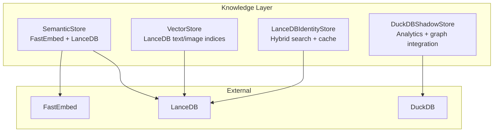
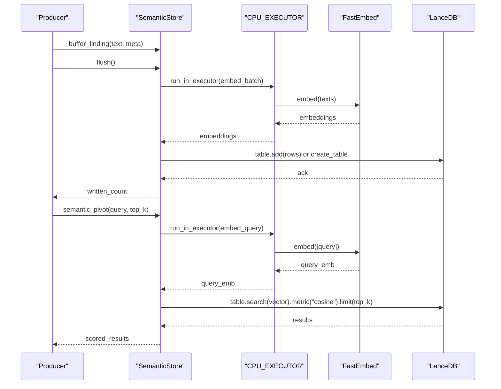
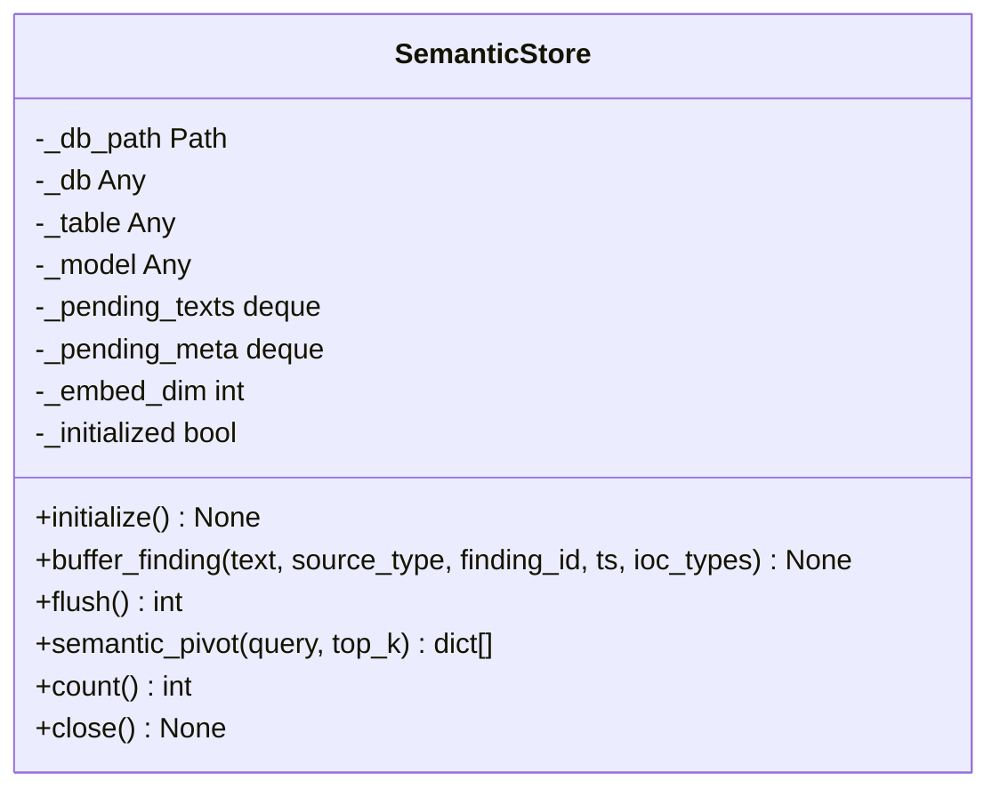
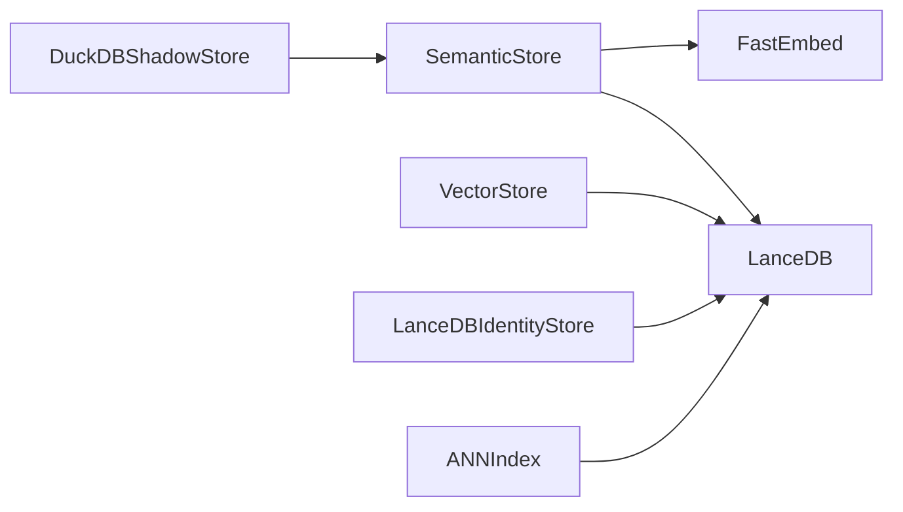

# Semantic Store

<cite>
**Referenced Files in This Document**
- [semantic_store.py](file://knowledge/semantic_store.py)
- [lancedb_store.py](file://knowledge/lancedb_store.py)
- [duckdb_store.py](file://knowledge/duckdb_store.py)
- [vector_store.py](file://knowledge/vector_store.py)
- [ann_index.py](file://knowledge/ann_index.py)
- [rag_engine.py](file://knowledge/rag_engine.py)
- [graph_service.py](file://knowledge/graph_service.py)
- [paths.py](file://paths.py)
</cite>

## Table of Contents
1. [Introduction](#introduction)
2. [Project Structure](#project-structure)
3. [Core Components](#core-components)
4. [Architecture Overview](#architecture-overview)
5. [Detailed Component Analysis](#detailed-component-analysis)
6. [Dependency Analysis](#dependency-analysis)
7. [Performance Considerations](#performance-considerations)
8. [Troubleshooting Guide](#troubleshooting-guide)
9. [Conclusion](#conclusion)
10. [Appendices](#appendices)

## Introduction
Semantic Store is a FastEmbed-based semantic search engine integrated with LanceDB for approximate nearest neighbor (ANN) similarity search over findings. It provides a lightweight, high-throughput pipeline for buffering, batch embedding, and ANN retrieval with cosine similarity. The component is designed as a consumer/producer in the broader research workflow, not as the primary retrieval or grounding authority. It complements other stores and engines (e.g., DuckDB analytics, LanceDB identity store, and RAG engine) to enable efficient semantic pivots and retrieval.

Key characteristics:
- FastEmbed model integration for text embeddings
- LanceDB-backed ANN index for similarity search
- Bounded buffering and batched ingestion
- Async-safe operations with CPU-bound work offloaded to thread pools
- Lightweight lifecycle: initialize, buffer, flush, semantic pivot, close

## Project Structure
The Semantic Store resides in the knowledge layer alongside other vector and analytics stores. It interacts with:
- LanceDB for vector storage and ANN search
- DuckDB for canonical analytics and orchestration
- RAG engine for primary retrieval and grounding
- Paths configuration for persistent storage locations

**Diagram sources**
- [semantic_store.py:1-301](file://knowledge/semantic_store.py#L1-L301)
- [vector_store.py:1-308](file://knowledge/vector_store.py#L1-L308)
- [lancedb_store.py:1-1177](file://knowledge/lancedb_store.py#L1-L1177)
- [duckdb_store.py:1-6681](file://knowledge/duckdb_store.py#L1-L6681)

**Section sources**
- [semantic_store.py:1-301](file://knowledge/semantic_store.py#L1-L301)
- [paths.py](file://paths.py)

## Core Components
- SemanticStore: FastEmbed + LanceDB for ANN similarity search over findings. Supports buffering, batch embedding, and semantic pivot queries.
- VectorStore: General-purpose LanceDB-backed vector store for text and image embeddings.
- LanceDBIdentityStore: Advanced identity/entity store with hybrid search, embedding cache, and MLX acceleration.
- DuckDBShadowStore: Canonical analytics store and integration point for graph and semantic components.
- ANNIndex: Optional fast-path ANN index for semantic deduplication.

**Section sources**
- [semantic_store.py:42-301](file://knowledge/semantic_store.py#L42-L301)
- [vector_store.py:44-308](file://knowledge/vector_store.py#L44-L308)
- [lancedb_store.py:66-180](file://knowledge/lancedb_store.py#L66-L180)
- [duckdb_store.py:533-800](file://knowledge/duckdb_store.py#L533-L800)
- [ann_index.py:51-371](file://knowledge/ann_index.py#L51-L371)

## Architecture Overview
Semantic Store operates as a specialized semantic search sink and source:
- Ingestion: Buffer textual findings and metadata; flush batches to LanceDB with embeddings.
- Retrieval: Embed a query and perform ANN cosine similarity search against the LanceDB table.
- Integration: Used by higher-level systems (e.g., DuckDBShadowStore) for semantic pivots and enrichment.

**Diagram sources**
- [semantic_store.py:123-266](file://knowledge/semantic_store.py#L123-L266)

## Detailed Component Analysis

### SemanticStore: FastEmbed + LanceDB
Responsibilities:
- Initialize FastEmbed model and LanceDB connection
- Buffer findings and metadata
- Batch embed and upsert to LanceDB
- Perform ANN cosine similarity search
- Provide counts and lifecycle management

Implementation highlights:
- Singleton-like lifecycle: initialize() boots model and DB; close() flushes and tears down
- Bounded pending buffer to protect memory on constrained devices
- Offloads CPU-intensive work to a dedicated executor to avoid blocking the event loop
- Uses cosine metric; converts LanceDB’s internal distance to a 0..1 similarity score

**Diagram sources**
- [semantic_store.py:42-118](file://knowledge/semantic_store.py#L42-L118)

**Section sources**
- [semantic_store.py:80-118](file://knowledge/semantic_store.py#L80-L118)
- [semantic_store.py:123-153](file://knowledge/semantic_store.py#L123-L153)
- [semantic_store.py:158-214](file://knowledge/semantic_store.py#L158-L214)
- [semantic_store.py:220-266](file://knowledge/semantic_store.py#L220-L266)
- [semantic_store.py:272-282](file://knowledge/semantic_store.py#L272-L282)
- [semantic_store.py:288-301](file://knowledge/semantic_store.py#L288-L301)

### Embedding Pipeline and Model Integration
- FastEmbed model: BAAI/bge-small-en-v1.5 (dimension 384)
- Warm-up embedding performed during model load
- Embeddings are float32 vectors stored in LanceDB
- Batch embedding executed in a CPU executor to keep the event loop responsive

Best practices:
- Keep query and buffered texts truncated to the model’s token limit
- Use flush() to drain the bounded buffer periodically
- Avoid synchronous embedding on the main event loop

**Section sources**
- [semantic_store.py:96-104](file://knowledge/semantic_store.py#L96-L104)
- [semantic_store.py:176-178](file://knowledge/semantic_store.py#L176-L178)

### Vector Indexing Mechanisms
- LanceDB table schema includes vector (float32 list), text, and metadata fields
- First write creates the table with a schema; subsequent writes append
- ANN search uses cosine metric; similarity score computed from internal distance

Operational notes:
- Table name is fixed for the findings index
- Embedding dimension is enforced at write time
- Index creation and optimization are managed by LanceDB

**Section sources**
- [semantic_store.py:195-207](file://knowledge/semantic_store.py#L195-L207)
- [semantic_store.py:244-266](file://knowledge/semantic_store.py#L244-L266)

### Semantic Search API
Capabilities:
- Keyword matching: Not provided by SemanticStore; use other stores/services for keyword-centric retrieval
- Similarity search: semantic_pivot(query, top_k) returns scored results
- Retrieval with relevance scoring: Scores are normalized to 0..1 scale

Usage patterns:
- Call semantic_pivot after flushing recent findings to ensure freshness
- Tune top_k based on downstream needs and latency targets

**Section sources**
- [semantic_store.py:220-266](file://knowledge/semantic_store.py#L220-L266)

### Integration with DuckDB for Hybrid Search
While SemanticStore focuses on ANN similarity, DuckDBShadowStore coordinates analytics and graph integration. It maintains:
- Canonical sprint-level facts and derived analytics
- Injection points for graph backends (truth-store and synthesis graphs)
- Optional semantic store integration for semantic pivots

Implications:
- DuckDB orchestrates when and how semantic results are surfaced
- Graph backends receive enriched findings from semantic pivots
- Hybrid workflows combine structured analytics with semantic similarity

**Section sources**
- [duckdb_store.py:652-658](file://knowledge/duckdb_store.py#L652-L658)
- [duckdb_store.py:663-714](file://knowledge/duckdb_store.py#L663-L714)
- [duckdb_store.py:741-787](file://knowledge/duckdb_store.py#L741-L787)

### Embedding Caching Strategies and Batch Processing
- Bounded pending buffer prevents unbounded growth
- Batch embedding in CPU executor reduces overhead and improves throughput
- Flush is idempotent and safe to call multiple times

Optimization tips:
- Adjust MAX_PENDING to balance memory and ingestion throughput
- Use flush() during windup phases to minimize latency spikes
- Offload embedding to CPU_EXECUTOR to avoid event loop contention

**Section sources**
- [semantic_store.py:139-152](file://knowledge/semantic_store.py#L139-L152)
- [semantic_store.py:176-178](file://knowledge/semantic_store.py#L176-L178)
- [semantic_store.py:165-166](file://knowledge/semantic_store.py#L165-L166)

### Relationship with Broader Knowledge Graph System
- SemanticStore is a consumer/producer component; it does not own primary retrieval or grounding
- RAG engine remains the primary retrieval authority
- Graph service integrates enriched findings into the knowledge graph
- DuckDBShadowStore orchestrates analytics and graph ingestion

Outcome:
- SemanticStore enhances recall by surfacing semantically similar findings
- Results are integrated into the broader research workflow for synthesis and graph updates

**Section sources**
- [semantic_store.py:6-14](file://knowledge/semantic_store.py#L6-L14)
- [rag_engine.py](file://knowledge/rag_engine.py)
- [graph_service.py](file://knowledge/graph_service.py)

## Dependency Analysis
Inter-component dependencies:
- SemanticStore depends on FastEmbed for embeddings and LanceDB for persistence
- DuckDBShadowStore optionally integrates SemanticStore for semantic pivots
- VectorStore and LanceDBIdentityStore share LanceDB infrastructure
- ANNIndex provides a complementary fast-path for semantic deduplication

**Diagram sources**
- [semantic_store.py:96-104](file://knowledge/semantic_store.py#L96-L104)
- [duckdb_store.py:652-658](file://knowledge/duckdb_store.py#L652-L658)
- [vector_store.py:70-110](file://knowledge/vector_store.py#L70-L110)
- [lancedb_store.py:107-113](file://knowledge/lancedb_store.py#L107-L113)
- [ann_index.py:104-123](file://knowledge/ann_index.py#L104-L123)

**Section sources**
- [semantic_store.py:96-118](file://knowledge/semantic_store.py#L96-L118)
- [duckdb_store.py:652-658](file://knowledge/duckdb_store.py#L652-L658)
- [vector_store.py:70-110](file://knowledge/vector_store.py#L70-L110)
- [lancedb_store.py:107-113](file://knowledge/lancedb_store.py#L107-L113)
- [ann_index.py:104-123](file://knowledge/ann_index.py#L104-L123)

## Performance Considerations
- CPU-bound embedding offloading: All embedding operations run in a CPU executor to avoid blocking the event loop
- Bounded buffering: Prevents memory pressure during high-volume ingestion
- Batched writes: Minimizes I/O overhead and improves throughput
- Model warm-up: Embedding model is warmed during initialization to reduce first-query latency
- Indexing: LanceDB manages index creation and search; ensure adequate memory for optimal performance

Recommendations:
- Monitor pending buffer size and adjust MAX_PENDING accordingly
- Use flush() during quiet periods to reduce latency spikes
- Prefer cosine similarity for text embeddings; tune top_k based on workload
- Consider memory guard thresholds when enabling additional indices

[No sources needed since this section provides general guidance]

## Troubleshooting Guide
Common issues and resolutions:
- Model not initialized: Ensure initialize() is called before any embedding operations
- Empty results: Verify that flush() has been called and the table contains data
- Slow queries: Confirm that embeddings are float32 and the table has been created
- Memory pressure: Reduce MAX_PENDING or increase CPU executor capacity
- Index creation failures: Check LanceDB availability and permissions

Operational checks:
- Health of the LanceDB table: Use count() to verify row counts
- Flush idempotency: Calling flush() multiple times is safe and returns 0 when no pending items remain

**Section sources**
- [semantic_store.py:80-118](file://knowledge/semantic_store.py#L80-L118)
- [semantic_store.py:272-282](file://knowledge/semantic_store.py#L272-L282)
- [semantic_store.py:288-301](file://knowledge/semantic_store.py#L288-L301)

## Conclusion
SemanticStore delivers a focused, efficient semantic search capability powered by FastEmbed and LanceDB. Its design emphasizes simplicity, bounded resource usage, and seamless integration into broader research workflows. By buffering and batching embeddings, offloading CPU work, and providing ANN similarity search, it enables rapid semantic pivots that complement structured analytics and graph-based reasoning.

[No sources needed since this section summarizes without analyzing specific files]

## Appendices

### Configuration Options
- Embedding model: BAAI/bge-small-en-v1.5 (dimension 384)
- Embedding dimension: 384
- Pending buffer cap: 10,000 items
- Text truncation: Up to 512 characters
- Storage path: Derived from paths configuration for LanceDB

Operational controls:
- initialize(): Bootstraps model and DB connection
- flush(): Writes buffered items to LanceDB
- semantic_pivot(): Performs ANN similarity search
- close(): Final flush and cleanup

**Section sources**
- [semantic_store.py:8-19](file://knowledge/semantic_store.py#L8-L19)
- [semantic_store.py:66-74](file://knowledge/semantic_store.py#L66-L74)
- [semantic_store.py:139-152](file://knowledge/semantic_store.py#L139-L152)
- [semantic_store.py:220-266](file://knowledge/semantic_store.py#L220-L266)
- [paths.py](file://paths.py)

### Example Workflows
- Ingestion and retrieval:
  - Buffer findings with buffer_finding()
  - Periodically call flush() to persist
  - Invoke semantic_pivot(query, top_k) to retrieve similar findings
- Integration with analytics:
  - DuckDBShadowStore coordinates semantic pivots and graph ingestion
  - Graph service consumes enriched findings for knowledge graph updates

**Section sources**
- [semantic_store.py:123-153](file://knowledge/semantic_store.py#L123-L153)
- [semantic_store.py:158-214](file://knowledge/semantic_store.py#L158-L214)
- [semantic_store.py:220-266](file://knowledge/semantic_store.py#L220-L266)
- [duckdb_store.py:652-658](file://knowledge/duckdb_store.py#L652-L658)
- [graph_service.py](file://knowledge/graph_service.py)