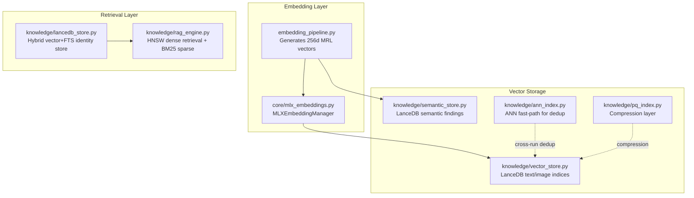
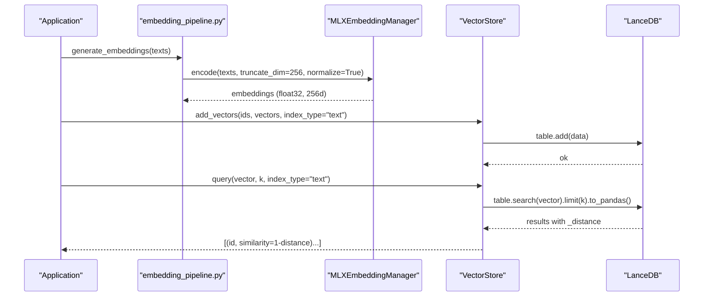
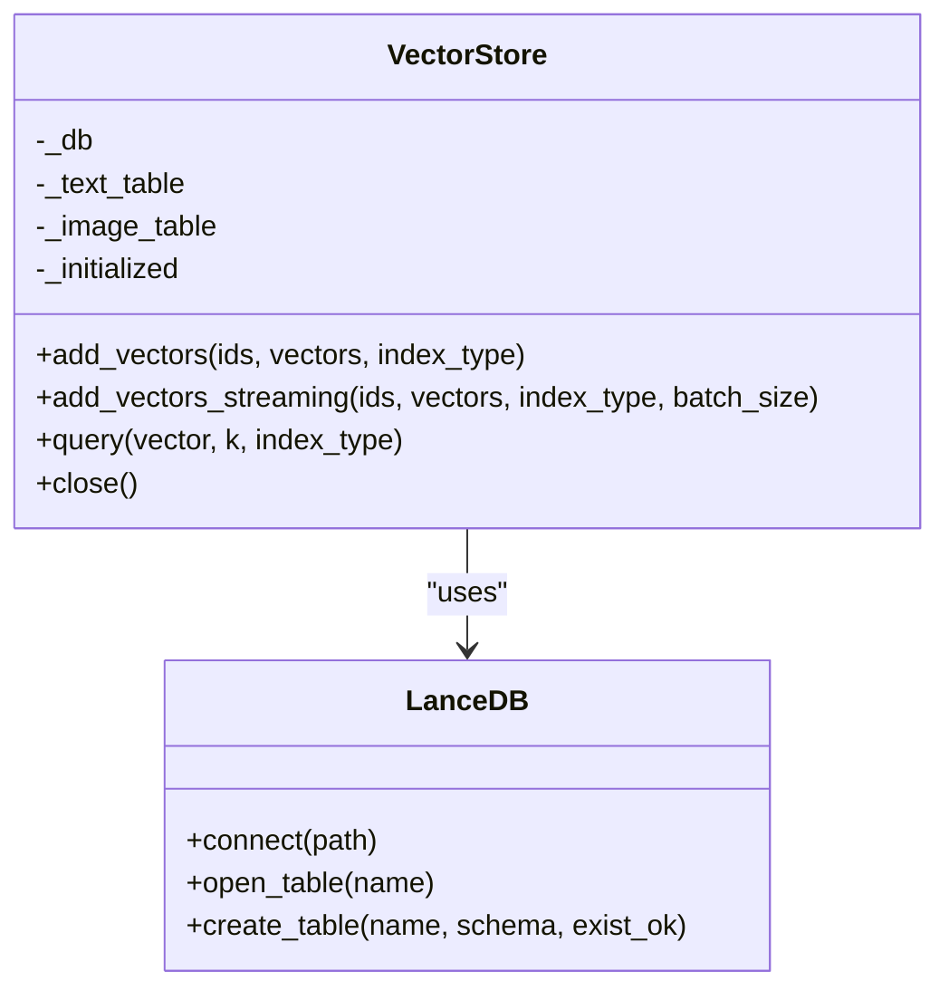
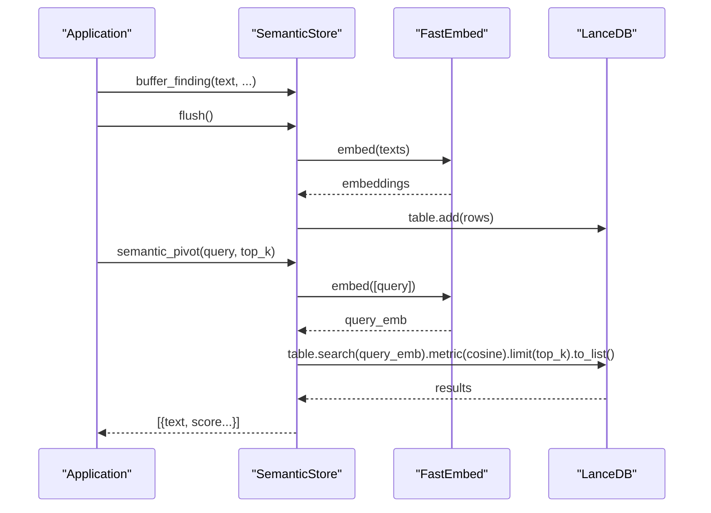
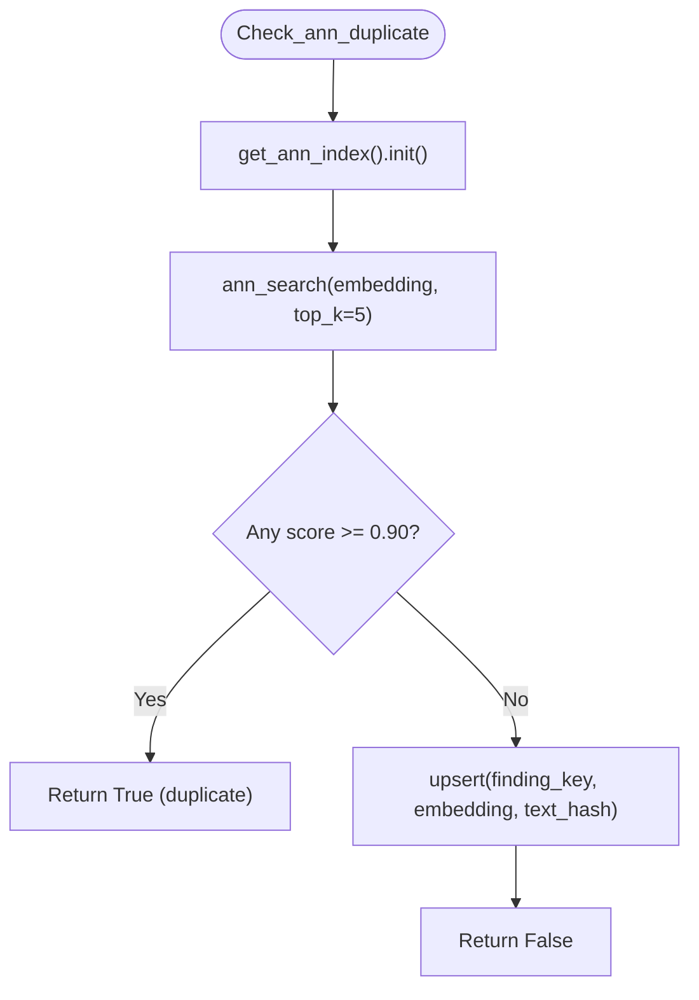
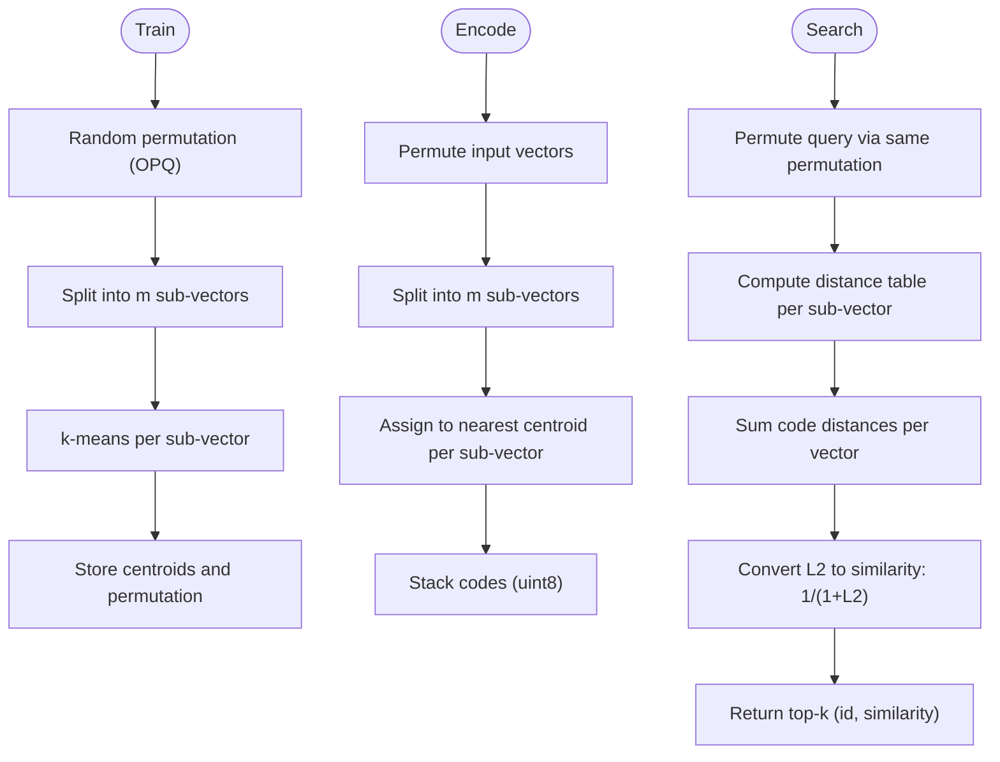
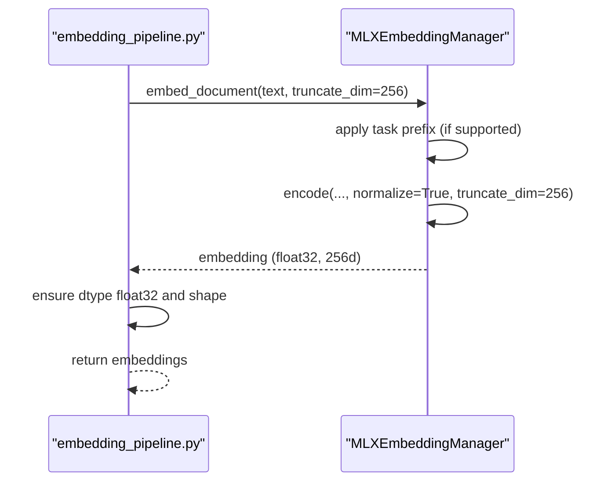
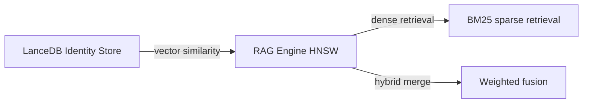
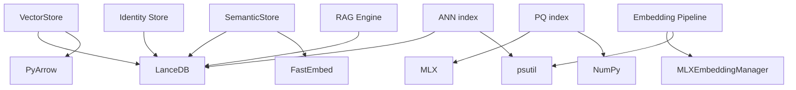

# Vector Store

<cite>
**Referenced Files in This Document**
- [vector_store.py](file://knowledge/vector_store.py)
- [semantic_store.py](file://knowledge/semantic_store.py)
- [ann_index.py](file://knowledge/ann_index.py)
- [pq_index.py](file://knowledge/pq_index.py)
- [embedding_pipeline.py](file://embedding_pipeline.py)
- [mlx_embeddings.py](file://core/mlx_embeddings.py)
- [lancedb_store.py](file://knowledge/lancedb_store.py)
- [rag_engine.py](file://knowledge/rag_engine.py)
</cite>

## Table of Contents
1. [Introduction](#introduction)
2. [Project Structure](#project-structure)
3. [Core Components](#core-components)
4. [Architecture Overview](#architecture-overview)
5. [Detailed Component Analysis](#detailed-component-analysis)
6. [Dependency Analysis](#dependency-analysis)
7. [Performance Considerations](#performance-considerations)
8. [Troubleshooting Guide](#troubleshooting-guide)
9. [Conclusion](#conclusion)
10. [Appendices](#appendices)

## Introduction
This document describes the Vector Store system as the primary vector storage backend for embeddings and similarity search. It covers:
- The LanceDB-backed VectorStore for text and image embeddings
- ANN indexing strategies and integration with embedding models
- Embedding management via MLXEmbeddingManager and the embedding pipeline
- Similarity search algorithms and hybrid retrieval
- Batch processing for embedding creation and similarity queries
- Configuration options, memory optimization, and scaling considerations
- Relationship with the semantic store and identity store, and how vector data coexists with other knowledge representations

## Project Structure
The Vector Store system spans several modules:
- VectorStore: LanceDB-backed storage with separate text and image indices
- SemanticStore: FastEmbed + LanceDB for semantic search over findings
- ANN index: Optional fast-path ANN index for cross-run semantic dedup
- PQ index: Compression layer for embedding vectors
- Embedding pipeline and MLXEmbeddingManager: Embedding generation and normalization
- Identity store (LanceDB): Hybrid vector + FTS entity resolution
- RAG Engine: HNSW-based retrieval and hybrid search

**Diagram sources**
- [vector_store.py:44-308](file://knowledge/vector_store.py#L44-L308)
- [semantic_store.py:42-301](file://knowledge/semantic_store.py#L42-L301)
- [ann_index.py:51-371](file://knowledge/ann_index.py#L51-L371)
- [pq_index.py:29-274](file://knowledge/pq_index.py#L29-L274)
- [embedding_pipeline.py:50-498](file://embedding_pipeline.py#L50-L498)
- [mlx_embeddings.py:79-568](file://core/mlx_embeddings.py#L79-L568)
- [lancedb_store.py:66-1177](file://knowledge/lancedb_store.py#L66-L1177)
- [rag_engine.py:1150-1650](file://knowledge/rag_engine.py#L1150-L1650)

**Section sources**
- [vector_store.py:1-308](file://knowledge/vector_store.py#L1-L308)
- [semantic_store.py:1-301](file://knowledge/semantic_store.py#L1-L301)
- [ann_index.py:1-371](file://knowledge/ann_index.py#L1-L371)
- [pq_index.py:1-274](file://knowledge/pq_index.py#L1-L274)
- [embedding_pipeline.py:1-498](file://embedding_pipeline.py#L1-L498)
- [mlx_embeddings.py:1-568](file://core/mlx_embeddings.py#L1-L568)
- [lancedb_store.py:1-1177](file://knowledge/lancedb_store.py#L1-L1177)
- [rag_engine.py:1150-1650](file://knowledge/rag_engine.py#L1150-L1650)

## Core Components
- VectorStore: Singleton, lazy-initialized LanceDB tables for text (256d) and image (1024d) embeddings; supports batch insert and streaming insert; cosine similarity search via LanceDB vector search
- SemanticStore: FastEmbed + LanceDB for semantic search over findings; batching, CPU executor offloading, cosine similarity search
- ANN index: Optional fast-path ANN index for cross-run semantic dedup; bounded capacity, eviction, cosine similarity threshold
- PQ index: Product Quantization compression layer for embedding vectors; maintains consistency with cosine similarity via L2 distance conversion
- Embedding pipeline: MLX-based embedding generation with MRL truncation to 256d; memory guards and streaming batch API
- MLXEmbeddingManager: Provider for ModernBERT embeddings with task-aware prefixing and normalization
- Identity store: Hybrid vector + FTS entity resolution with prefiltering, MMR, and adaptive reranking
- RAG Engine: HNSW dense retrieval with optional BM25 sparse fusion and hybrid retrieval

**Section sources**
- [vector_store.py:44-308](file://knowledge/vector_store.py#L44-L308)
- [semantic_store.py:42-301](file://knowledge/semantic_store.py#L42-L301)
- [ann_index.py:51-371](file://knowledge/ann_index.py#L51-L371)
- [pq_index.py:29-274](file://knowledge/pq_index.py#L29-L274)
- [embedding_pipeline.py:50-498](file://embedding_pipeline.py#L50-L498)
- [mlx_embeddings.py:79-568](file://core/mlx_embeddings.py#L79-L568)
- [lancedb_store.py:66-1177](file://knowledge/lancedb_store.py#L66-L1177)
- [rag_engine.py:1150-1650](file://knowledge/rag_engine.py#L1150-L1650)

## Architecture Overview
The Vector Store integrates embedding generation, storage, and retrieval:
- Embedding generation produces normalized vectors (256d MRL for text, 1024d for images)
- VectorStore persists vectors to LanceDB tables and performs cosine similarity search
- SemanticStore provides a separate semantic search index for findings
- ANN index accelerates cross-run semantic deduplication
- PQ index compresses vectors for memory savings
- Identity store and RAG Engine provide hybrid and dense/sparse retrieval

**Diagram sources**
- [embedding_pipeline.py:127-181](file://embedding_pipeline.py#L127-L181)
- [mlx_embeddings.py:236-324](file://core/mlx_embeddings.py#L236-L324)
- [vector_store.py:122-278](file://knowledge/vector_store.py#L122-L278)

## Detailed Component Analysis

### VectorStore: LanceDB-backed text and image vector storage
- Responsibilities:
  - Manage two LanceDB tables: text_index (256d) and image_index (1024d)
  - Lazy initialization on first use
  - Add vectors with dimension validation and PyArrow conversion
  - Streaming batch insert to reduce memory spikes
  - Cosine similarity search via LanceDB vector search
  - Singleton access via get_vector_store()

- Key behaviors:
  - Dimensions enforced per index type
  - Normalized float32 vectors
  - Streaming insert yields to event loop for M1 memory safety
  - Query returns similarity = 1 - distance for cosine distance

**Diagram sources**
- [vector_store.py:44-308](file://knowledge/vector_store.py#L44-L308)

**Section sources**
- [vector_store.py:44-308](file://knowledge/vector_store.py#L44-L308)

### SemanticStore: FastEmbed + LanceDB semantic search
- Responsibilities:
  - Maintain a bounded pending buffer for findings
  - Batch embed via CPU executor
  - Append to LanceDB table with schema including vector, text, and metadata
  - ANN search with cosine similarity and score normalization

- Key behaviors:
  - Bounded pending buffer to prevent unbounded growth
  - Model loaded once and reused
  - Buffered flush to LanceDB
  - Search returns top-k with scores in [0,1]

**Diagram sources**
- [semantic_store.py:123-267](file://knowledge/semantic_store.py#L123-L267)

**Section sources**
- [semantic_store.py:42-301](file://knowledge/semantic_store.py#L42-L301)

### ANN index: Cross-run semantic dedup fast-path
- Responsibilities:
  - Optional fast-path ANN index for semantic dedup across runs
  - Bounded capacity with oldest-first eviction
  - Cosine similarity threshold (default 0.90)
  - Pre-warming to reduce first-query latency
  - Fail-open behavior on initialization or query errors

- Key behaviors:
  - Memory guard to avoid heavy initialization on constrained systems
  - Thread-safe operations with locking
  - Upsert after successful duplicate check

**Diagram sources**
- [ann_index.py:319-360](file://knowledge/ann_index.py#L319-L360)

**Section sources**
- [ann_index.py:51-371](file://knowledge/ann_index.py#L51-L371)

### PQ index: Embedding compression layer
- Responsibilities:
  - Train centroids via k-means on sub-vectors (OPQ preprocessing)
  - Encode vectors to PQ codes for memory savings
  - Search using L2 distance on codes with similarity conversion to 1/(1+L2)

- Key behaviors:
  - 12x memory savings (768d -> 8 bytes per vector)
  - Consistency with cosine similarity via distance conversion
  - Save/load for persistence

**Diagram sources**
- [pq_index.py:64-222](file://knowledge/pq_index.py#L64-L222)

**Section sources**
- [pq_index.py:29-274](file://knowledge/pq_index.py#L29-L274)

### Embedding pipeline and MLXEmbeddingManager
- Responsibilities:
  - Generate embeddings with MRL truncation to 256d for text
  - Asymmetric task-aware embedding with prefixes for queries/documents
  - Memory guards to avoid OOM on M1 devices
  - Streaming batch API to reduce peak memory
  - Async wrappers for non-blocking operation

- Key behaviors:
  - Memory pressure checks before model load/unload
  - Task prefix discipline for retrieval quality
  - Normalization and dimension handling

**Diagram sources**
- [embedding_pipeline.py:127-181](file://embedding_pipeline.py#L127-L181)
- [mlx_embeddings.py:159-227](file://core/mlx_embeddings.py#L159-L227)

**Section sources**
- [embedding_pipeline.py:50-498](file://embedding_pipeline.py#L50-L498)
- [mlx_embeddings.py:79-568](file://core/mlx_embeddings.py#L79-L568)

### Identity store and RAG Engine integration
- Identity store:
  - Hybrid vector + FTS search with prefiltering and MMR
  - Adaptive reranking (ColBERT, FlashRank, MLX)
  - Binary signature prefilter and MLX acceleration
- RAG Engine:
  - HNSW dense retrieval with optional BM25 sparse fusion
  - Hybrid retrieval combining dense and sparse signals

**Diagram sources**
- [lancedb_store.py:965-1037](file://knowledge/lancedb_store.py#L965-L1037)
- [rag_engine.py:1188-1290](file://knowledge/rag_engine.py#L1188-L1290)

**Section sources**
- [lancedb_store.py:66-1177](file://knowledge/lancedb_store.py#L66-L1177)
- [rag_engine.py:1150-1650](file://knowledge/rag_engine.py#L1150-L1650)

## Dependency Analysis
- VectorStore depends on LanceDB and PyArrow for schema and data conversion
- SemanticStore depends on FastEmbed and LanceDB; uses CPU executor for embedding
- ANN index depends on LanceDB and optional psutil for memory guard
- PQ index depends on MLX for training and NumPy for distance computations
- Embedding pipeline depends on MLXEmbeddingManager and psutil for memory guards
- Identity store and RAG Engine depend on LanceDB and optional external rerankers

**Diagram sources**
- [vector_store.py:70-120](file://knowledge/vector_store.py#L70-L120)
- [semantic_store.py:96-104](file://knowledge/semantic_store.py#L96-L104)
- [ann_index.py:81-134](file://knowledge/ann_index.py#L81-L134)
- [pq_index.py:21-27](file://knowledge/pq_index.py#L21-L27)
- [embedding_pipeline.py:50-58](file://embedding_pipeline.py#L50-L58)
- [lancedb_store.py:878-916](file://knowledge/lancedb_store.py#L878-L916)
- [rag_engine.py:1334-1343](file://knowledge/rag_engine.py#L1334-L1343)

**Section sources**
- [vector_store.py:19-120](file://knowledge/vector_store.py#L19-L120)
- [semantic_store.py:96-104](file://knowledge/semantic_store.py#L96-L104)
- [ann_index.py:81-134](file://knowledge/ann_index.py#L81-L134)
- [pq_index.py:21-27](file://knowledge/pq_index.py#L21-L27)
- [embedding_pipeline.py:50-58](file://embedding_pipeline.py#L50-L58)
- [lancedb_store.py:878-916](file://knowledge/lancedb_store.py#L878-L916)
- [rag_engine.py:1334-1343](file://knowledge/rag_engine.py#L1334-L1343)

## Performance Considerations
- Memory optimization:
  - VectorStore streaming insert reduces peak RSS during embedding phases
  - Embedding pipeline memory guards and automatic unload after batch processing
  - PQ index achieves 12x memory savings for vectors
  - ANN index bounded capacity with oldest-first eviction
- Scaling:
  - Separate indices for text (256d) and image (1024d) enable dimension-appropriate storage
  - SemanticStore batching and CPU executor offloading prevent event loop blocking
  - Identity store prefiltering (binary signatures) and MMR improve retrieval quality and speed
- Search performance:
  - VectorStore uses LanceDB vector search with cosine similarity
  - ANN index provides sub-10ms duplicate detection for cross-run data
  - RAG Engine HNSW dense retrieval with optional BM25 sparse fusion

[No sources needed since this section provides general guidance]

## Troubleshooting Guide
- VectorStore initialization failures:
  - Ensure LanceDB is installed and available; the module raises a clear error if not
  - Verify directory permissions for the LanceDB home path
- Dimension mismatches:
  - Text vectors must be 256d; image vectors must be 1024d
  - Queries must match the index dimension; otherwise the query is skipped with a warning
- Memory pressure:
  - Embedding pipeline triggers memory guards and returns empty arrays when RSS exceeds thresholds
  - ANN index initialization is guarded by RSS thresholds
- ANN index reliability:
  - Fail-open behavior: on any error, the index falls back to non-dedup logic
  - Boot error stored and checked before search operations

**Section sources**
- [vector_store.py:115-120](file://knowledge/vector_store.py#L115-L120)
- [vector_store.py:242-249](file://knowledge/vector_store.py#L242-L249)
- [embedding_pipeline.py:90-114](file://embedding_pipeline.py#L90-L114)
- [ann_index.py:78-99](file://knowledge/ann_index.py#L78-L99)
- [ann_index.py:130-134](file://knowledge/ann_index.py#L130-L134)

## Conclusion
The Vector Store system provides a robust, scalable foundation for embeddings and similarity search:
- VectorStore offers efficient LanceDB-backed storage with streaming batch operations and cosine similarity
- SemanticStore enables fast semantic search over findings with batching and CPU offloading
- ANN index accelerates cross-run semantic deduplication with bounded memory usage
- PQ index delivers significant memory savings for vector storage
- Embedding pipeline and MLXEmbeddingManager ensure high-quality, normalized embeddings with strong memory safeguards
- Identity store and RAG Engine integrate vector and hybrid retrieval for comprehensive knowledge access

[No sources needed since this section summarizes without analyzing specific files]

## Appendices

### Configuration and Tuning Examples
- Vector insertion:
  - Use add_vectors with ids and vectors shaped (N, dim) where dim is 256 for text or 1024 for image
  - For large batches, use add_vectors_streaming to reduce memory spikes
- Similarity search:
  - Query vectors must match the index dimension; results are sorted by similarity descending
  - Adjust k to balance precision and recall
- Memory optimization:
  - Tune embedding pipeline batch sizes and memory thresholds
  - Enable PQ compression for large-scale vector storage
  - Use ANN index pre-warming to reduce cold-start latency
- Choosing embedding models:
  - Use MLXEmbeddingManager for ModernBERT-based embeddings with MRL truncation to 256d for text
  - For semantic search over findings, FastEmbed BAAI/bge-small-en-v1.5 provides compact 384d embeddings

**Section sources**
- [vector_store.py:122-211](file://knowledge/vector_store.py#L122-L211)
- [embedding_pipeline.py:425-498](file://embedding_pipeline.py#L425-L498)
- [ann_index.py:248-278](file://knowledge/ann_index.py#L248-L278)
- [pq_index.py:223-274](file://knowledge/pq_index.py#L223-L274)
- [semantic_store.py:96-104](file://knowledge/semantic_store.py#L96-L104)
- [mlx_embeddings.py:159-227](file://core/mlx_embeddings.py#L159-L227)