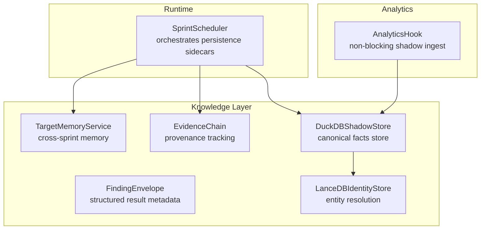
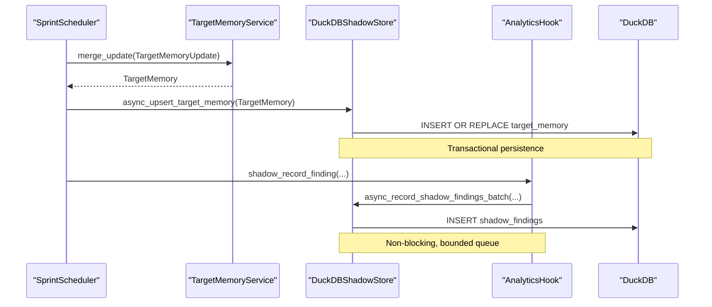
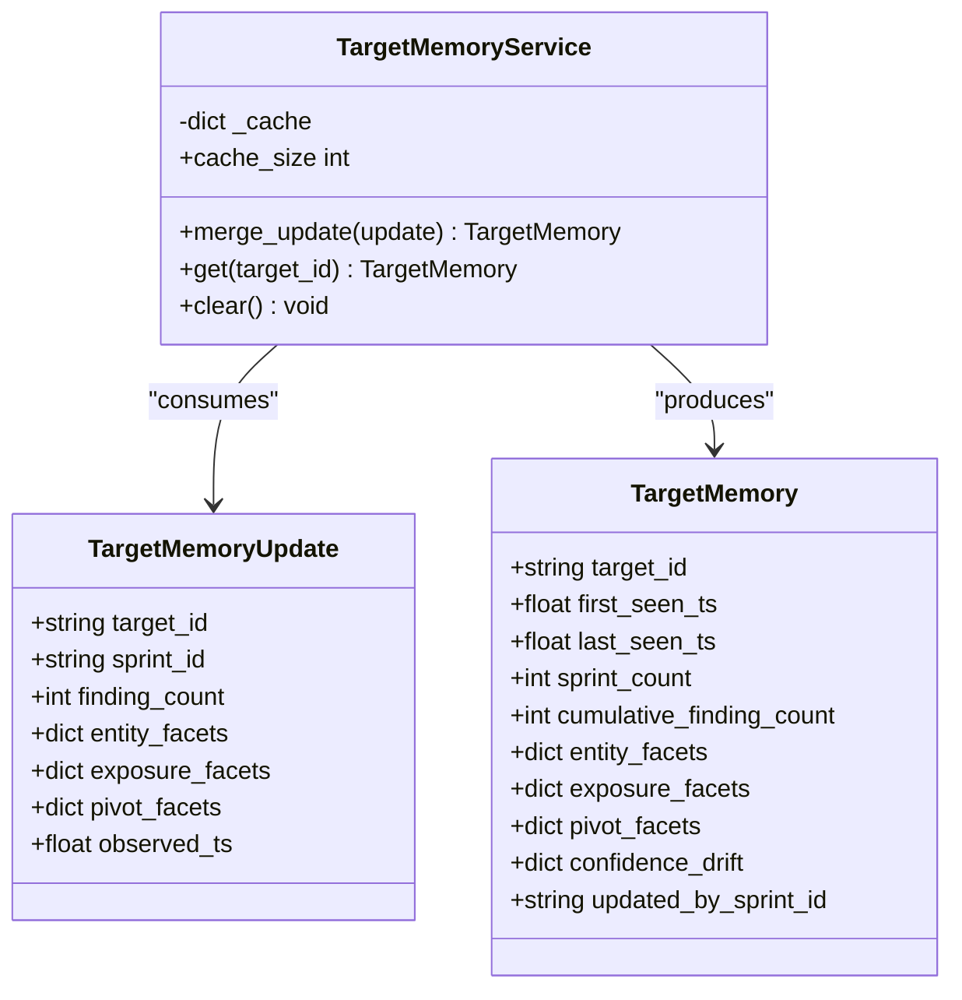
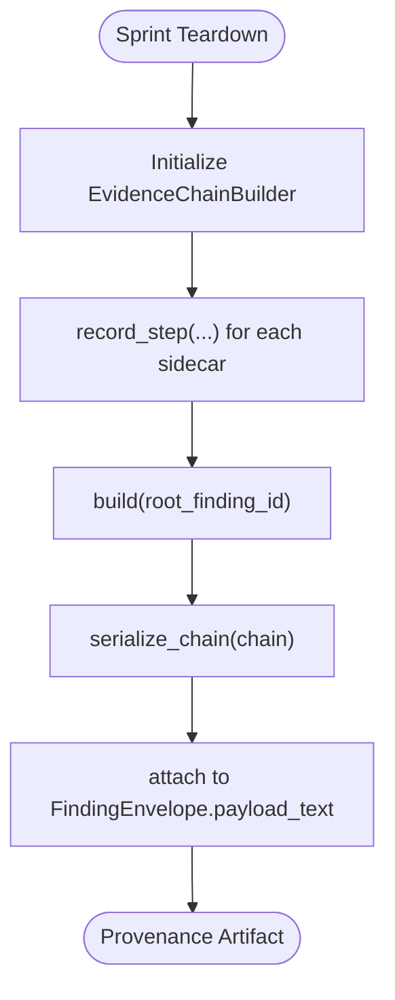
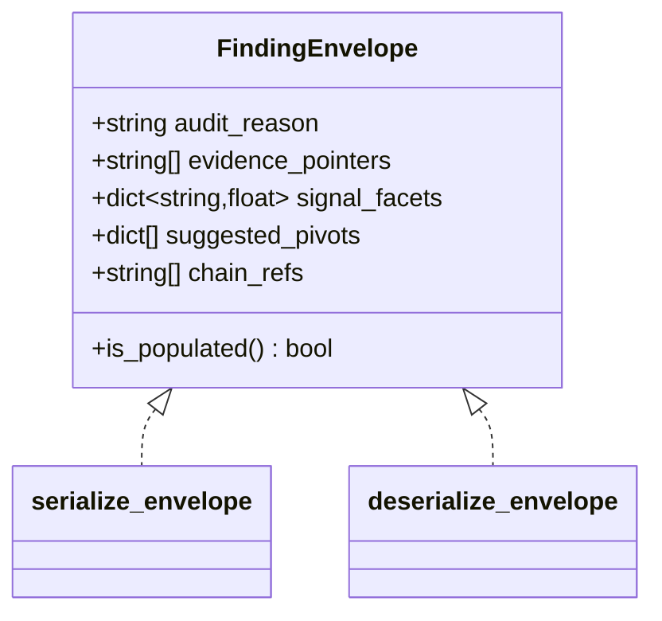
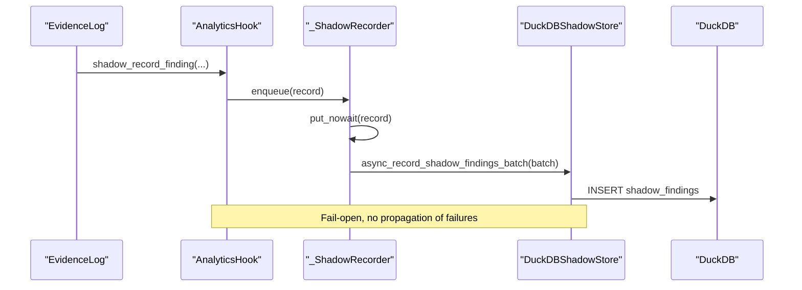
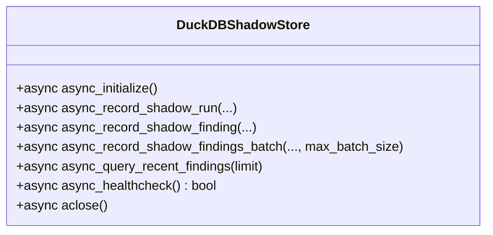
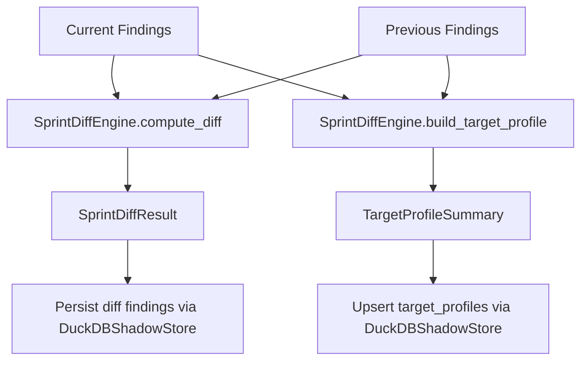
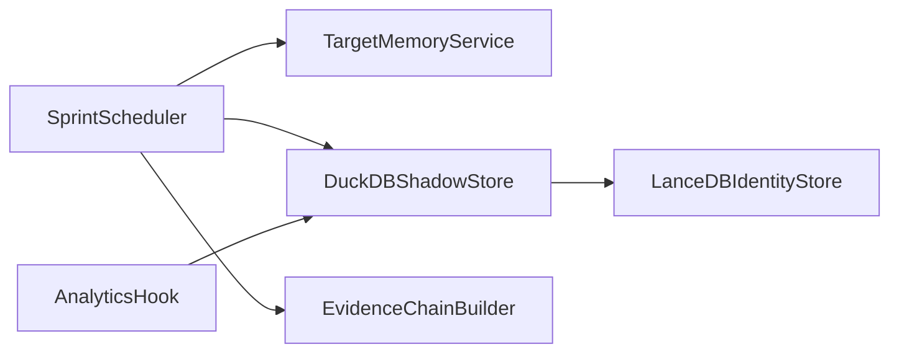

# Data Persistence and Lifecycle

<cite>
**Referenced Files in This Document**
- [target_memory.py](file://knowledge/target_memory.py)
- [evidence_chain.py](file://knowledge/evidence_chain.py)
- [finding_envelope.py](file://knowledge/finding_envelope.py)
- [analytics_hook.py](file://knowledge/analytics_hook.py)
- [duckdb_store.py](file://knowledge/duckdb_store.py)
- [sprint_scheduler.py](file://runtime/sprint_scheduler.py)
- [sprint_diff_engine.py](file://knowledge/sprint_diff_engine.py)
- [lancedb_store.py](file://knowledge/lancedb_store.py)
</cite>

## Table of Contents
1. [Introduction](#introduction)
2. [Project Structure](#project-structure)
3. [Core Components](#core-components)
4. [Architecture Overview](#architecture-overview)
5. [Detailed Component Analysis](#detailed-component-analysis)
6. [Dependency Analysis](#dependency-analysis)
7. [Performance Considerations](#performance-considerations)
8. [Troubleshooting Guide](#troubleshooting-guide)
9. [Conclusion](#conclusion)
10. [Appendices](#appendices)

## Introduction
This document explains the data persistence and lifecycle management system across the knowledge layer. It focuses on:
- Cross-sprint data persistence via TargetMemory
- Evidence provenance tracking with EvidenceChain
- Structured result encapsulation via FindingEnvelope
- Observability and analytics ingestion via AnalyticsHook
- Persistence interfaces, transaction management, and consistency guarantees
- Data retention, cleanup, and migration strategies for data aging
- Practical workflows for persistence, cross-sprint sharing, and evidence tracking

## Project Structure
The persistence and lifecycle system spans several modules:
- Knowledge layer: TargetMemory, EvidenceChain, FindingEnvelope, DuckDBShadowStore, LanceDB identity store
- Runtime orchestration: SprintScheduler coordinates persistence sidecars and lifecycle transitions
- Analytics pipeline: AnalyticsHook forwards findings to DuckDBShadowStore asynchronously

**Diagram sources**
- [target_memory.py:56-346](file://knowledge/target_memory.py#L56-L346)
- [evidence_chain.py:149-460](file://knowledge/evidence_chain.py#L149-L460)
- [finding_envelope.py:46-217](file://knowledge/finding_envelope.py#L46-L217)
- [duckdb_store.py:643-800](file://knowledge/duckdb_store.py#L643-L800)
- [lancedb_store.py:113-231](file://knowledge/lancedb_store.py#L113-L231)
- [sprint_scheduler.py:6695-6894](file://runtime/sprint_scheduler.py#L6695-L6894)
- [analytics_hook.py:101-428](file://knowledge/analytics_hook.py#L101-L428)

**Section sources**
- [target_memory.py:1-346](file://knowledge/target_memory.py#L1-L346)
- [evidence_chain.py:1-747](file://knowledge/evidence_chain.py#L1-L747)
- [finding_envelope.py:1-217](file://knowledge/finding_envelope.py#L1-L217)
- [analytics_hook.py:1-428](file://knowledge/analytics_hook.py#L1-L428)
- [duckdb_store.py:643-800](file://knowledge/duckdb_store.py#L643-L800)
- [sprint_scheduler.py:6695-6894](file://runtime/sprint_scheduler.py#L6695-L6894)
- [sprint_diff_engine.py:1-200](file://knowledge/sprint_diff_engine.py#L1-L200)
- [lancedb_store.py:113-231](file://knowledge/lancedb_store.py#L113-L231)

## Core Components
- TargetMemoryService: Maintains bounded cross-sprint target memory with RAM guard and drift explainability.
- EvidenceChain: Tracks reasoning paths from raw findings to derived conclusions; stored as JSON in envelopes.
- FindingEnvelope: Encapsulates audit metadata and pointers for each finding; serialized into payload_text.
- AnalyticsHook: Non-blocking adapter that forwards findings to DuckDBShadowStore for analytics.
- DuckDBShadowStore: Canonical store for sprint facts, shadow findings, and target memory; provides async APIs and batch operations.
- SprintScheduler: Coordinates persistence sidecars, including target memory updates and diff computations.
- LanceDBIdentityStore: Provides identity/entity resolution with hybrid search and bounded caches.

**Section sources**
- [target_memory.py:56-346](file://knowledge/target_memory.py#L56-L346)
- [evidence_chain.py:149-460](file://knowledge/evidence_chain.py#L149-L460)
- [finding_envelope.py:46-217](file://knowledge/finding_envelope.py#L46-L217)
- [analytics_hook.py:101-428](file://knowledge/analytics_hook.py#L101-L428)
- [duckdb_store.py:643-800](file://knowledge/duckdb_store.py#L643-L800)
- [sprint_scheduler.py:6695-6894](file://runtime/sprint_scheduler.py#L6695-L6894)
- [lancedb_store.py:113-231](file://knowledge/lancedb_store.py#L113-L231)

## Architecture Overview
The system separates concerns across three tiers:
- Tier 1: Canonical sprint facts (DuckDBShadowStore)
- Tier 2: Shadow findings (DuckDBShadowStore)
- Tier 3: Graph stores (IOCGraph/Kuzu, SemanticStore/LanceDB)

Evidence flows from the ledger (EvidenceLog) into the analytics pipeline, then into DuckDBShadowStore. Target memory is updated post-acceptance and persisted into DuckDB.

**Diagram sources**
- [sprint_scheduler.py:6695-6894](file://runtime/sprint_scheduler.py#L6695-L6894)
- [target_memory.py:246-332](file://knowledge/target_memory.py#L246-L332)
- [duckdb_store.py:3278-3308](file://knowledge/duckdb_store.py#L3278-L3308)
- [analytics_hook.py:348-428](file://knowledge/analytics_hook.py#L348-L428)

## Detailed Component Analysis

### TargetMemory: Cross-Sprint Data Persistence
TargetMemoryService maintains a bounded, RAM-guarded cross-sprint memory of targets. It merges incoming updates with drift analysis and persists via DuckDBShadowStore.

Key behaviors:
- RAM guard: Skips merges when memory pressure exceeds thresholds.
- Facet bounds: Enforces maximum sizes for entity/exposure/pivot facets.
- Drift explainability: Computes drift ratios, deltas, and reasons for changes.
- JSON size guard: Limits serialized drift metadata size.
- Persistence: Upserts TargetMemory into DuckDB target_memory table.

**Diagram sources**
- [target_memory.py:31-54](file://knowledge/target_memory.py#L31-L54)
- [target_memory.py:56-346](file://knowledge/target_memory.py#L56-L346)

**Section sources**
- [target_memory.py:56-346](file://knowledge/target_memory.py#L56-L346)
- [sprint_scheduler.py:6695-6894](file://runtime/sprint_scheduler.py#L6695-L6894)
- [duckdb_store.py:3278-3308](file://knowledge/duckdb_store.py#L3278-L3308)

### EvidenceChain: Provenance and Data Lineage
EvidenceChainBuilder records processing steps during sprint teardown and serializes chains into FindingEnvelope payload_text. It supports corroboration analysis and bounds on depth and size.

Key behaviors:
- Step recording with bounds on depth and total steps.
- Serialization to JSON with size guard.
- Corroboration helpers to assess multi-source support.
- Lookup by finding_id across chains.

**Diagram sources**
- [evidence_chain.py:149-460](file://knowledge/evidence_chain.py#L149-L460)
- [finding_envelope.py:134-217](file://knowledge/finding_envelope.py#L134-L217)

**Section sources**
- [evidence_chain.py:149-460](file://knowledge/evidence_chain.py#L149-L460)
- [finding_envelope.py:46-217](file://knowledge/finding_envelope.py#L46-L217)

### FindingEnvelope: Structured Result Encapsulation
FindingEnvelope encapsulates audit metadata, evidence pointers, signal facets, suggested pivots, and chain references. It is serialized into CanonicalFinding.payload_text with strict size guards.

Key behaviors:
- Size guard using orjson/numpy serialization.
- Fail-soft deserialization with graceful degradation.
- Chain references enable tracing back to raw sources.

**Diagram sources**
- [finding_envelope.py:46-94](file://knowledge/finding_envelope.py#L46-L94)
- [finding_envelope.py:134-217](file://knowledge/finding_envelope.py#L134-L217)

**Section sources**
- [finding_envelope.py:46-217](file://knowledge/finding_envelope.py#L46-L217)

### AnalyticsHook: Data Observability and Shadow Pipeline
AnalyticsHook is a non-blocking adapter that forwards finding metadata to DuckDBShadowStore. It uses a bounded async queue, guarded worker, and batch flushing.

Key behaviors:
- Feature-flagged enablement.
- Bounded queue with drop-on-full behavior.
- Worker starts lazily and flushes batches periodically or on timeout.
- Graceful shutdown with final flush attempt.

**Diagram sources**
- [analytics_hook.py:101-428](file://knowledge/analytics_hook.py#L101-L428)
- [duckdb_store.py:643-800](file://knowledge/duckdb_store.py#L643-L800)

**Section sources**
- [analytics_hook.py:101-428](file://knowledge/analytics_hook.py#L101-L428)
- [duckdb_store.py:643-800](file://knowledge/duckdb_store.py#L643-L800)

### DuckDBShadowStore: Persistence Interfaces and Consistency
DuckDBShadowStore provides async APIs for canonical persistence:
- async_initialize, async_record_shadow_run/findings_batch, async_query_recent_findings
- Health checks and idempotent aclose
- Thread-affine DB operations via ThreadPoolExecutor
- Batch methods enforce chunking and run_in_executor to avoid event-loop blocking

Consistency characteristics:
- INSERT OR REPLACE semantics for target_memory
- JSON TEXT columns for complex facets
- Fail-soft behavior in sidecars; canonical store remains authoritative

**Diagram sources**
- [duckdb_store.py:643-800](file://knowledge/duckdb_store.py#L643-L800)

**Section sources**
- [duckdb_store.py:643-800](file://knowledge/duckdb_store.py#L643-L800)

### Cross-Sprint Diff and Target Profile
SprintDiffEngine computes diffs between sprints and builds target profiles with velocity and entity summaries. It integrates with DuckDBShadowStore to read previous findings and persist diffs.

Key behaviors:
- Diff computation: new, disappeared, changed entities
- Target profile: cumulative counts, first/last seen, derived velocity
- Integration: reads previous findings and ingests diff findings

**Diagram sources**
- [sprint_diff_engine.py:64-200](file://knowledge/sprint_diff_engine.py#L64-L200)
- [sprint_scheduler.py:6834-6894](file://runtime/sprint_scheduler.py#L6834-L6894)
- [duckdb_store.py:643-800](file://knowledge/duckdb_store.py#L643-L800)

**Section sources**
- [sprint_diff_engine.py:1-200](file://knowledge/sprint_diff_engine.py#L1-L200)
- [sprint_scheduler.py:6834-6894](file://runtime/sprint_scheduler.py#L6834-L6894)
- [duckdb_store.py:643-800](file://knowledge/duckdb_store.py#L643-L800)

### Data Aging, Retention, and Cleanup
- DuckDBShadowStore: Provides canonical tables for facts and shadow findings; lifecycle hooks manage initialization and shutdown.
- Legacy atomic storage: Includes a cleanup routine for shard files older than a specified number of months.
- TargetMemory: Bound by maximum keys and JSON size; drift metadata is capped to mitigate growth.
- EvidenceChain: Serialized chains are bounded by depth and size; corroboration summaries are bounded.

Cleanup and retention strategies:
- Monthly cleanup of legacy shards (retention configurable).
- Bounded caches and writeback buffers in LanceDBIdentityStore.
- RAM guards and memory pressure checks across components.

**Section sources**
- [legacy/atomic_storage.py:657-682](file://legacy/atomic_storage.py#L657-L682)
- [target_memory.py:18-27](file://knowledge/target_memory.py#L18-L27)
- [evidence_chain.py:68-72](file://knowledge/evidence_chain.py#L68-L72)
- [lancedb_store.py:113-231](file://knowledge/lancedb_store.py#L113-L231)

## Dependency Analysis
The following diagram shows key dependencies among components involved in persistence and lifecycle:

**Diagram sources**
- [sprint_scheduler.py:6695-6894](file://runtime/sprint_scheduler.py#L6695-L6894)
- [target_memory.py:56-346](file://knowledge/target_memory.py#L56-L346)
- [evidence_chain.py:149-460](file://knowledge/evidence_chain.py#L149-L460)
- [analytics_hook.py:101-428](file://knowledge/analytics_hook.py#L101-L428)
- [duckdb_store.py:643-800](file://knowledge/duckdb_store.py#L643-L800)
- [lancedb_store.py:113-231](file://knowledge/lancedb_store.py#L113-L231)

**Section sources**
- [sprint_scheduler.py:6695-6894](file://runtime/sprint_scheduler.py#L6695-L6894)
- [analytics_hook.py:101-428](file://knowledge/analytics_hook.py#L101-L428)
- [duckdb_store.py:643-800](file://knowledge/duckdb_store.py#L643-L800)
- [lancedb_store.py:113-231](file://knowledge/lancedb_store.py#L113-L231)

## Performance Considerations
- Asynchronous batching: DuckDBShadowStore uses run_in_executor and chunked batches to avoid blocking the event loop.
- Bounded queues and caches: AnalyticsHook and LanceDBIdentityStore employ bounded buffers and writeback mechanisms to control memory usage.
- RAM guards: TargetMemoryService and LanceDBIdentityStore check memory pressure and degrade safely under constraints.
- Lazy initialization: DuckDBShadowStore defers import and initialization until first use to reduce cold-start overhead.

[No sources needed since this section provides general guidance]

## Troubleshooting Guide
Common issues and diagnostics:
- AnalyticsHook drops: Monitor shadow_ingest_failures and queue full warnings; verify GHOST_DUCKDB_SHADOW flag and queue capacity.
- Target memory not updating: Verify RAM guard thresholds and that async_upsert_target_memory is invoked with TargetMemory instances.
- EvidenceChain serialization failures: Check MAX_CHAIN_JSON_BYTES and ensure orjson/json fallbacks are functioning.
- DuckDBShadowStore health: Use async_healthcheck and inspect worker thread status and connection state.
- LanceDB cache saturation: Review cache telemetry and eviction metrics; adjust HLEDAC_LANCEDB_CACHE_MB or enable large override.

**Section sources**
- [analytics_hook.py:192-327](file://knowledge/analytics_hook.py#L192-L327)
- [target_memory.py:252-278](file://knowledge/target_memory.py#L252-L278)
- [evidence_chain.py:501-564](file://knowledge/evidence_chain.py#L501-L564)
- [duckdb_store.py:643-800](file://knowledge/duckdb_store.py#L643-L800)
- [lancedb_store.py:522-540](file://knowledge/lancedb_store.py#L522-L540)

## Conclusion
The persistence and lifecycle system combines bounded, fail-soft components with canonical storage to ensure reliable cross-sprint data continuity, transparent provenance, and observable analytics. TargetMemory, EvidenceChain, FindingEnvelope, and AnalyticsHook collectively provide a robust foundation for data lineage, structured encapsulation, and non-blocking ingestion, while DuckDBShadowStore offers durable, asynchronous persistence with clear boundaries and safeguards.

[No sources needed since this section summarizes without analyzing specific files]

## Appendices

### Example Workflows

- Cross-sprint target memory update:
  1. SprintScheduler extracts facets from accepted findings.
  2. TargetMemoryService merges updates with drift analysis.
  3. DuckDBShadowStore persists TargetMemory via async_upsert_target_memory.

- Evidence tracking procedure:
  1. During teardown, EvidenceChainBuilder records steps.
  2. Chains are serialized and attached to FindingEnvelope.
  3. Envelope payload_text is stored with the finding.

- Analytics ingestion:
  1. EvidenceLog invokes AnalyticsHook for each finding.
  2. AnalyticsHook enqueues records into a bounded queue.
  3. Worker flushes batches to DuckDBShadowStore.

**Section sources**
- [sprint_scheduler.py:6695-6894](file://runtime/sprint_scheduler.py#L6695-L6894)
- [target_memory.py:246-332](file://knowledge/target_memory.py#L246-L332)
- [evidence_chain.py:465-564](file://knowledge/evidence_chain.py#L465-L564)
- [finding_envelope.py:134-217](file://knowledge/finding_envelope.py#L134-L217)
- [analytics_hook.py:348-428](file://knowledge/analytics_hook.py#L348-L428)
- [duckdb_store.py:643-800](file://knowledge/duckdb_store.py#L643-L800)