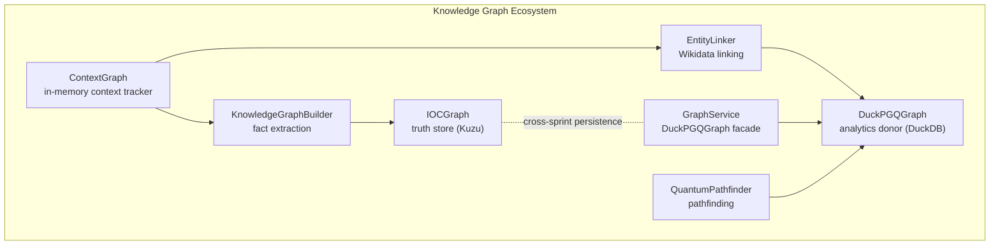
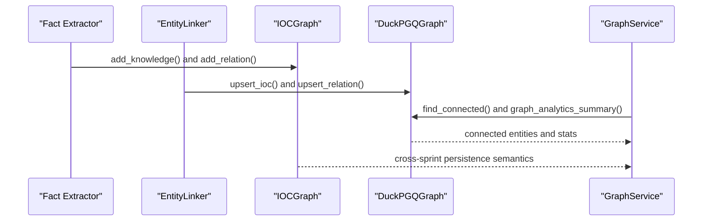
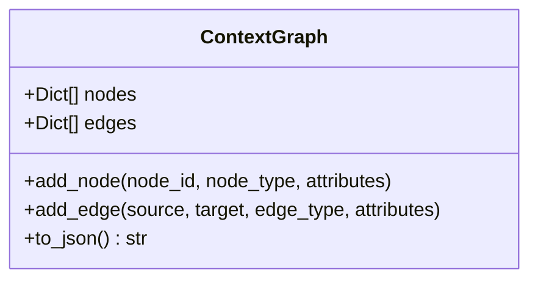
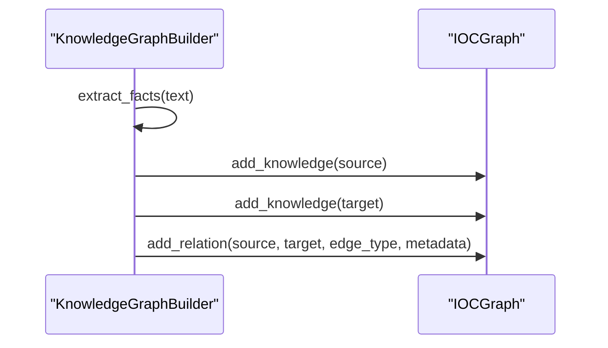
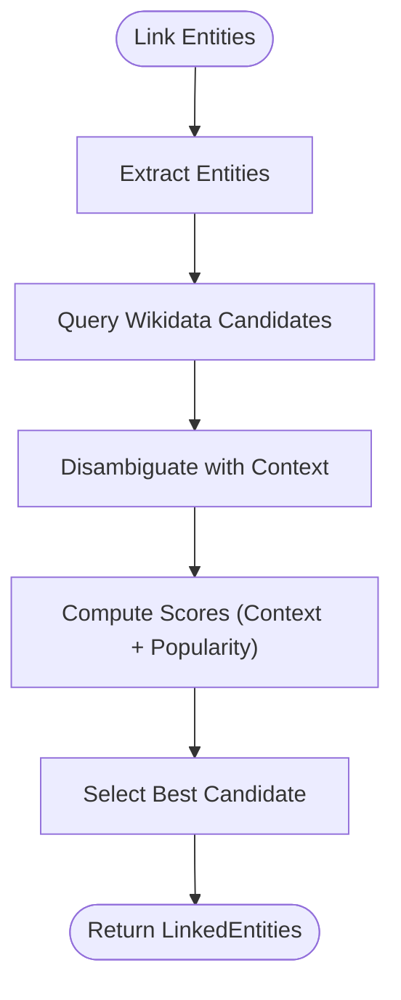
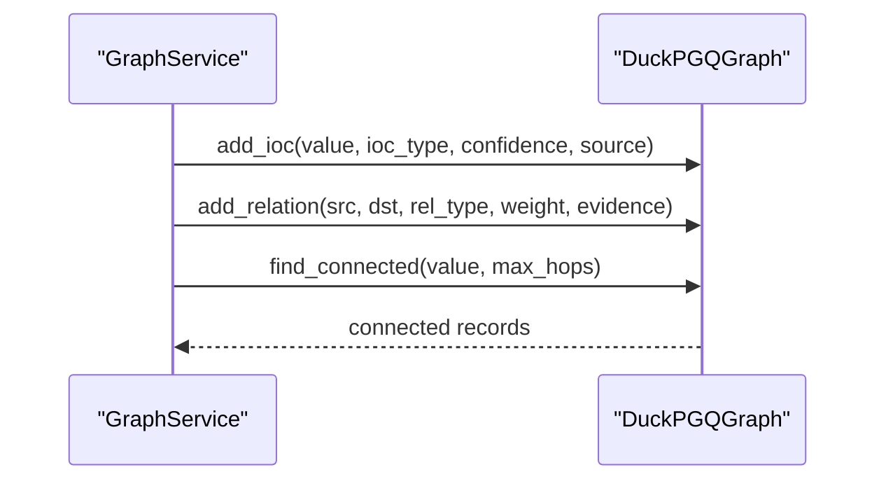
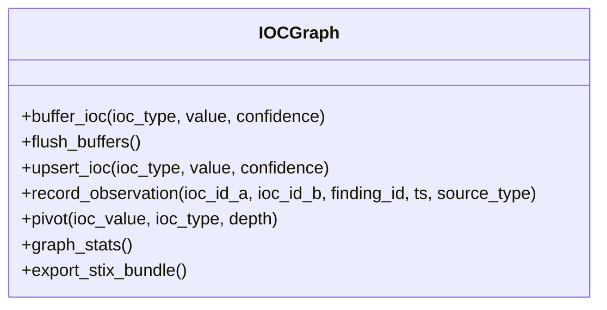
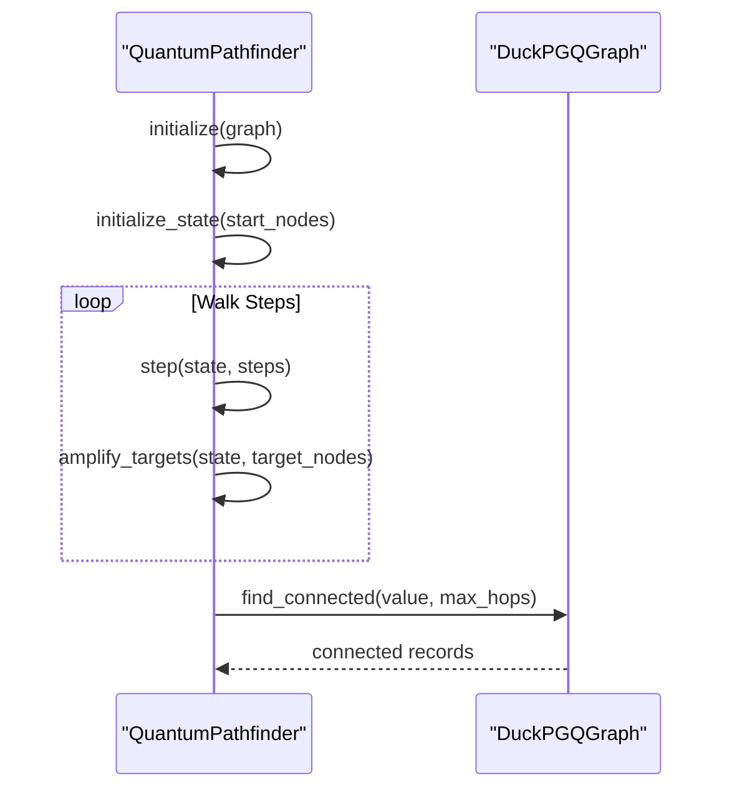
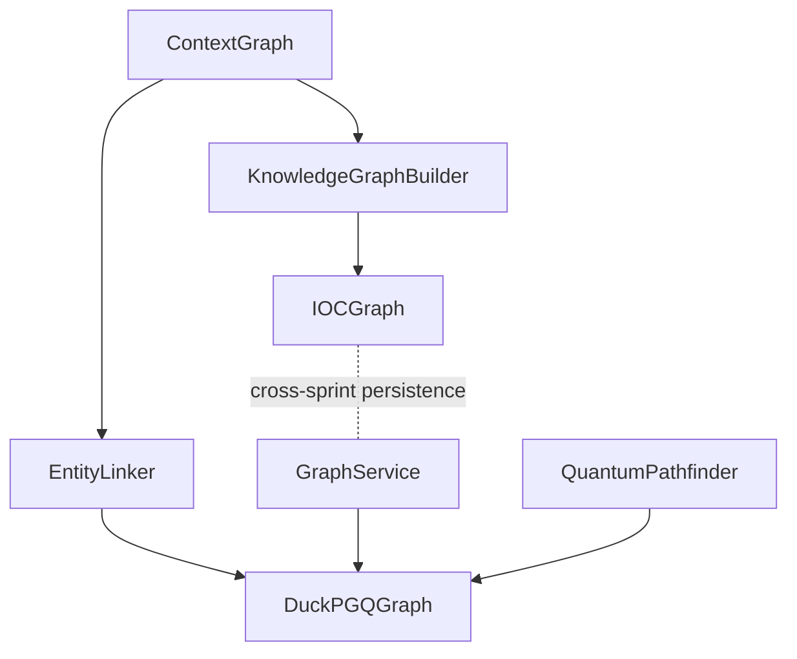

# Context Graph

<cite>
**Referenced Files in This Document**
- [context_graph.py](file://knowledge/context_graph.py)
- [graph_builder.py](file://knowledge/graph_builder.py)
- [graph_service.py](file://knowledge/graph_service.py)
- [entity_linker.py](file://knowledge/entity_linker.py)
- [ioc_graph.py](file://knowledge/ioc_graph.py)
- [quantum_pathfinder.py](file://graph/quantum_pathfinder.py)
- [relationship_discovery.py](file://intelligence/relationship_discovery.py)
</cite>

## Table of Contents
1. [Introduction](#introduction)
2. [Project Structure](#project-structure)
3. [Core Components](#core-components)
4. [Architecture Overview](#architecture-overview)
5. [Detailed Component Analysis](#detailed-component-analysis)
6. [Dependency Analysis](#dependency-analysis)
7. [Performance Considerations](#performance-considerations)
8. [Troubleshooting Guide](#troubleshooting-guide)
9. [Conclusion](#conclusion)

## Introduction
This document describes the ContextGraph implementation and its role in maintaining contextual relationships and semantic connections within the knowledge graph. The ContextGraph module provides a lightweight, in-memory structure for tracking context-aware relationships, complementing the authoritative storage backends (IOCGraph for truth, DuckPGQGraph for analytics). It integrates with fact extraction, entity linking, and graph analytics to support reasoning, traversal, and cross-sprint persistence.

## Project Structure
The ContextGraph sits within the knowledge graph ecosystem alongside:
- Fact extraction and graph building (regex-based extraction and forwarding to authoritative stores)
- Entity linking with Wikidata and context-aware disambiguation
- Truth store (IOCGraph) and analytics donor (DuckPGQGraph)
- Graph analytics and pathfinding (quantum-inspired algorithms)

**Diagram sources**
- [context_graph.py:20-55](file://knowledge/context_graph.py#L20-L55)
- [graph_builder.py:24-235](file://knowledge/graph_builder.py#L24-L235)
- [entity_linker.py:265-936](file://knowledge/entity_linker.py#L265-L936)
- [graph_service.py:26-311](file://knowledge/graph_service.py#L26-L311)
- [ioc_graph.py:113-791](file://knowledge/ioc_graph.py#L113-L791)
- [quantum_pathfinder.py:1105-1435](file://graph/quantum_pathfinder.py#L1105-L1435)

**Section sources**
- [context_graph.py:1-55](file://knowledge/context_graph.py#L1-L55)
- [graph_builder.py:1-235](file://knowledge/graph_builder.py#L1-L235)
- [entity_linker.py:1-936](file://knowledge/entity_linker.py#L1-L936)
- [graph_service.py:1-311](file://knowledge/graph_service.py#L1-L311)
- [ioc_graph.py:1-791](file://knowledge/ioc_graph.py#L1-L791)
- [quantum_pathfinder.py:1-1435](file://graph/quantum_pathfinder.py#L1-L1435)

## Core Components
- ContextGraph: Lightweight in-memory graph for context tracking (not authoritative storage)
- KnowledgeGraphBuilder: Regex-based fact extraction and forwarding to authoritative stores
- EntityLinker: Wikidata-based linking with context-aware disambiguation
- GraphService: DuckPGQGraph facade for upserts, history queries, and analytics summaries
- IOCGraph: Truth store for IOC entities and buffered writes
- DuckPGQGraph: Analytics donor backend for graph analytics and path queries
- QuantumPathfinder: Pathfinding engine for multi-hop reasoning

**Section sources**
- [context_graph.py:20-55](file://knowledge/context_graph.py#L20-L55)
- [graph_builder.py:24-235](file://knowledge/graph_builder.py#L24-L235)
- [entity_linker.py:265-936](file://knowledge/entity_linker.py#L265-L936)
- [graph_service.py:26-311](file://knowledge/graph_service.py#L26-L311)
- [ioc_graph.py:113-791](file://knowledge/ioc_graph.py#L113-L791)
- [quantum_pathfinder.py:1105-1435](file://graph/quantum_pathfinder.py#L1105-L1435)

## Architecture Overview
The system separates concerns:
- Truth ownership: IOCGraph (Kuzu) for authoritative IOC storage
- Analytics ownership: DuckPGQGraph (DuckDB) for path queries and analytics
- Cross-sprint persistence: GraphService coordinates upserts and history queries
- Context tracking: ContextGraph maintains lightweight in-memory context for reasoning
- Fact extraction and linking: GraphBuilder and EntityLinker feed data into the authoritative stores

**Diagram sources**
- [graph_builder.py:117-203](file://knowledge/graph_builder.py#L117-L203)
- [entity_linker.py:672-740](file://knowledge/entity_linker.py#L672-L740)
- [graph_service.py:45-127](file://knowledge/graph_service.py#L45-L127)
- [ioc_graph.py:305-439](file://knowledge/ioc_graph.py#L305-L439)
- [quantum_pathfinder.py:1240-1284](file://graph/quantum_pathfinder.py#L1240-L1284)

## Detailed Component Analysis

### ContextGraph: Lightweight Context Tracker
- Purpose: Tracks context-aware relationships in memory; not a storage backend
- Structure: Nodes and edges represented as dictionaries with attributes
- Operations: Add nodes, add edges, serialize to JSON
- Use cases: Temporary context propagation during reasoning or during sprint phases

**Diagram sources**
- [context_graph.py:20-55](file://knowledge/context_graph.py#L20-L55)

**Section sources**
- [context_graph.py:20-55](file://knowledge/context_graph.py#L20-L55)

### KnowledgeGraphBuilder: Fact Extraction and Forwarding
- Role: Extracts structured facts from text using regex patterns and forwards them to the authoritative store
- Relationship types: is_a, causes, located_in, part_of, contains
- Integration: Generates deterministic IDs, maps relations to edge types, and upserts metadata

**Diagram sources**
- [graph_builder.py:67-101](file://knowledge/graph_builder.py#L67-L101)
- [graph_builder.py:139-175](file://knowledge/graph_builder.py#L139-L175)
- [ioc_graph.py:305-439](file://knowledge/ioc_graph.py#L305-L439)

**Section sources**
- [graph_builder.py:24-235](file://knowledge/graph_builder.py#L24-L235)
- [ioc_graph.py:113-791](file://knowledge/ioc_graph.py#L113-L791)

### EntityLinker: Context-Aware Entity Linking
- Role: Links extracted entities to Wikidata with context-aware disambiguation
- Features: Async SPARQL queries, response caching, context similarity scoring, optional GLiNER fallback
- Integration: Provides LinkedEntity objects with canonical labels and confidence scores

**Diagram sources**
- [entity_linker.py:672-740](file://knowledge/entity_linker.py#L672-L740)
- [entity_linker.py:617-670](file://knowledge/entity_linker.py#L617-L670)
- [entity_linker.py:473-521](file://knowledge/entity_linker.py#L473-L521)

**Section sources**
- [entity_linker.py:265-936](file://knowledge/entity_linker.py#L265-L936)

### GraphService and DuckPGQGraph: Analytics and Persistence
- GraphService: Facade over DuckPGQGraph providing idempotent upserts, history queries, and analytics summaries
- DuckPGQGraph: SQL/PGQ graph backend with path queries, batching, and checkpointing
- Cross-sprint persistence: Session-level idempotency and singleton management

**Diagram sources**
- [graph_service.py:45-127](file://knowledge/graph_service.py#L45-L127)
- [quantum_pathfinder.py:1240-1284](file://graph/quantum_pathfinder.py#L1240-L1284)

**Section sources**
- [graph_service.py:26-311](file://knowledge/graph_service.py#L26-L311)
- [quantum_pathfinder.py:1105-1435](file://graph/quantum_pathfinder.py#L1105-L1435)

### IOCGraph: Truth Store
- Role: Authoritative IOC entity truth store with buffered writes and STIX export
- Features: Upsert semantics, observation edges, pivot queries, batch operations, STIX 2.1 export

**Diagram sources**
- [ioc_graph.py:113-791](file://knowledge/ioc_graph.py#L113-L791)

**Section sources**
- [ioc_graph.py:113-791](file://knowledge/ioc_graph.py#L113-L791)

### QuantumPathfinder: Multi-Hop Reasoning
- Role: Pathfinding engine using quantum-inspired algorithms (random walks, Grover amplification)
- Backend: DuckPGQGraph for analytics queries; supports MLX and NumPy fallbacks
- Integration: Used for hidden path discovery and centrality-based analytics

**Diagram sources**
- [quantum_pathfinder.py:158-826](file://graph/quantum_pathfinder.py#L158-L826)
- [quantum_pathfinder.py:1240-1284](file://graph/quantum_pathfinder.py#L1240-L1284)

**Section sources**
- [quantum_pathfinder.py:1105-1435](file://graph/quantum_pathfinder.py#L1105-L1435)

## Dependency Analysis
- ContextGraph is a lightweight component and does not depend on other modules in the knowledge graph stack
- KnowledgeGraphBuilder depends on IOCGraph for persistent storage and uses regex patterns for extraction
- EntityLinker depends on Wikidata SPARQL and caches responses; integrates with DuckPGQGraph via GraphService
- GraphService depends on DuckPGQGraph for analytics and history queries
- IOCGraph is independent and provides the authoritative truth store
- QuantumPathfinder depends on DuckPGQGraph for analytics and path queries

**Diagram sources**
- [context_graph.py:20-55](file://knowledge/context_graph.py#L20-L55)
- [graph_builder.py:24-235](file://knowledge/graph_builder.py#L24-L235)
- [entity_linker.py:265-936](file://knowledge/entity_linker.py#L265-L936)
- [graph_service.py:26-311](file://knowledge/graph_service.py#L26-L311)
- [ioc_graph.py:113-791](file://knowledge/ioc_graph.py#L113-L791)
- [quantum_pathfinder.py:1105-1435](file://graph/quantum_pathfinder.py#L1105-L1435)

**Section sources**
- [context_graph.py:20-55](file://knowledge/context_graph.py#L20-L55)
- [graph_builder.py:24-235](file://knowledge/graph_builder.py#L24-L235)
- [entity_linker.py:265-936](file://knowledge/entity_linker.py#L265-L936)
- [graph_service.py:26-311](file://knowledge/graph_service.py#L26-L311)
- [ioc_graph.py:113-791](file://knowledge/ioc_graph.py#L113-L791)
- [quantum_pathfinder.py:1105-1435](file://graph/quantum_pathfinder.py#L1105-L1435)

## Performance Considerations
- ContextGraph is in-memory and not intended for persistence; keep datasets small for performance
- DuckPGQGraph leverages DuckDB with vectorized operations and optional duckpgq extension for graph queries
- IOCGraph uses buffered writes and thread-pool execution for Kuzu operations to minimize latency
- QuantumPathfinder uses lazy imports and memory cleanup to operate within M1 8GB constraints
- EntityLinker employs caching and concurrency limits to reduce API calls and manage memory

[No sources needed since this section provides general guidance]

## Troubleshooting Guide
- ContextGraph deprecation: Use authoritative stores (IOCGraph, DuckPGQGraph) for persistence
- GraphService failures: DuckPGQGraph initialization and query failures are logged and fail-safe
- IOCGraph errors: Buffered writes and flush operations handle exceptions; verify schema and connection
- EntityLinker timeouts: SPARQL queries may timeout; adjust concurrency and cache settings
- QuantumPathfinder memory pressure: The pathfinder performs periodic garbage collection and MLX cache clearing

**Section sources**
- [context_graph.py:1-12](file://knowledge/context_graph.py#L1-L12)
- [graph_service.py:33-42](file://knowledge/graph_service.py#L33-L42)
- [ioc_graph.py:229-240](file://knowledge/ioc_graph.py#L229-L240)
- [entity_linker.py:515-521](file://knowledge/entity_linker.py#L515-L521)
- [quantum_pathfinder.py:800-845](file://graph/quantum_pathfinder.py#L800-L845)

## Conclusion
The ContextGraph provides a lightweight mechanism for context tracking during reasoning and processing, complementing the authoritative IOCGraph and analytics DuckPGQGraph. Together with KnowledgeGraphBuilder, EntityLinker, GraphService, and QuantumPathfinder, the system enables robust fact extraction, entity linking, cross-sprint persistence, and multi-hop reasoning within constrained hardware environments.