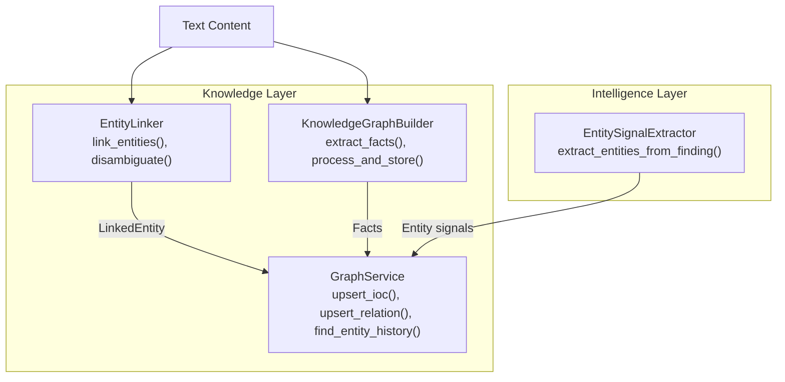
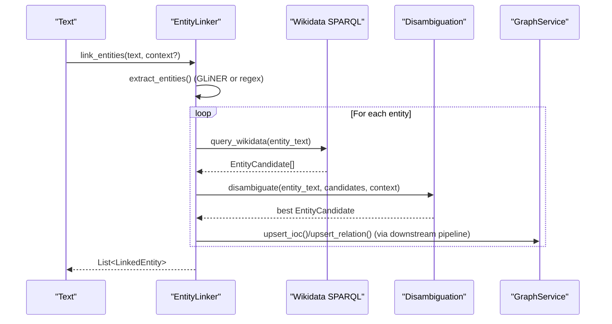
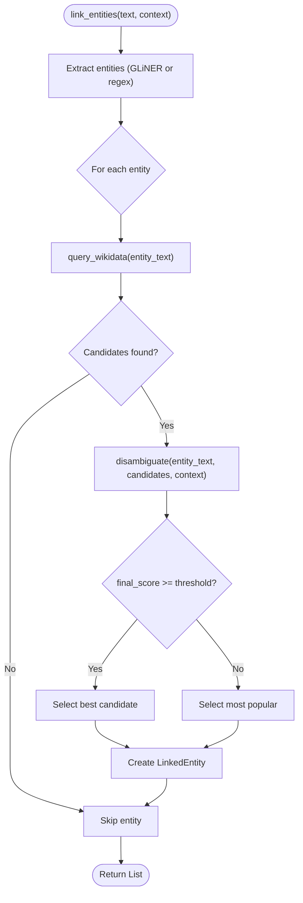
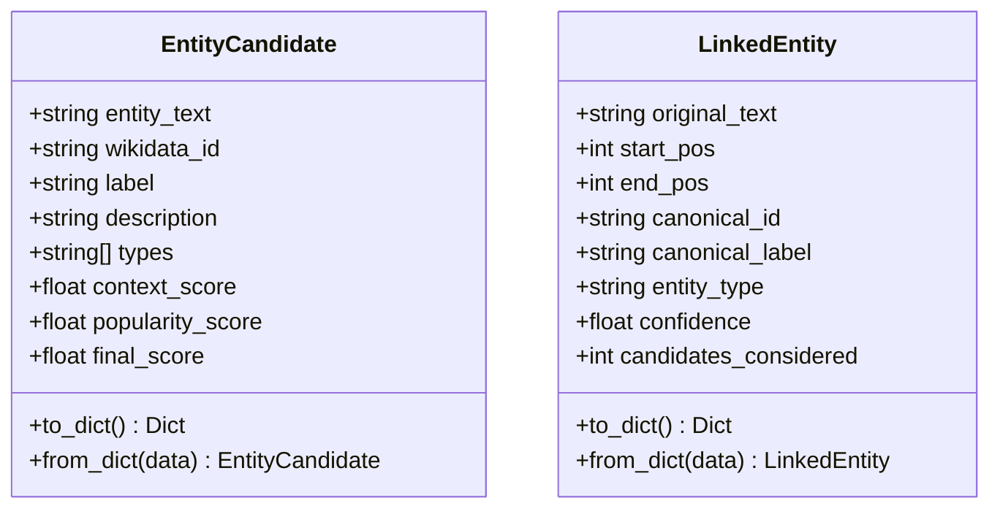
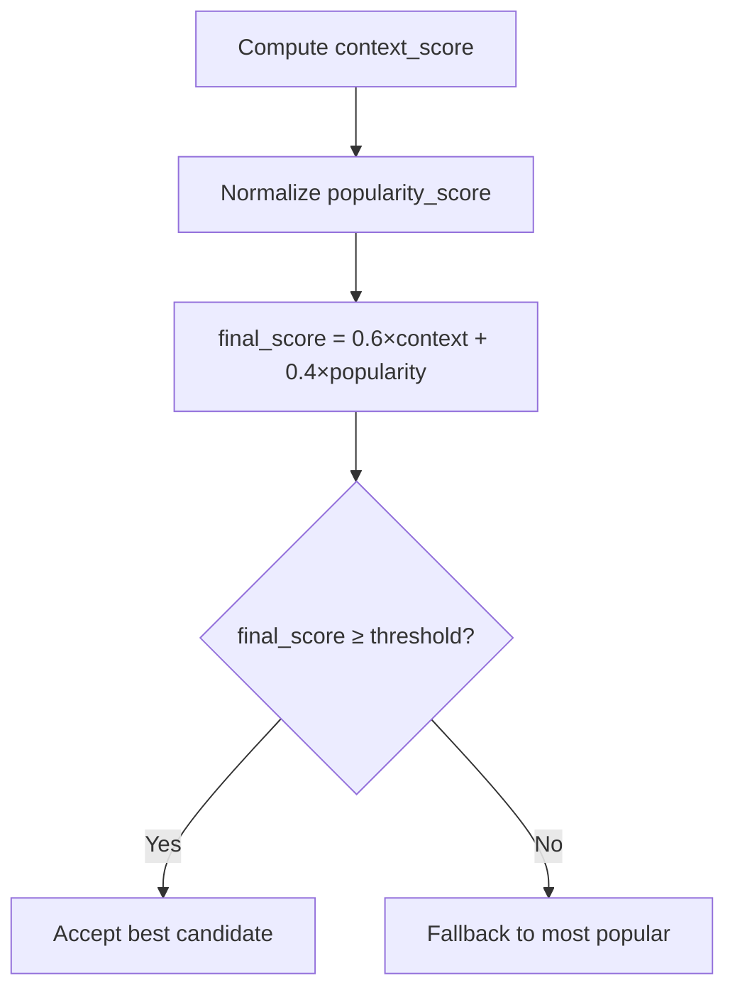
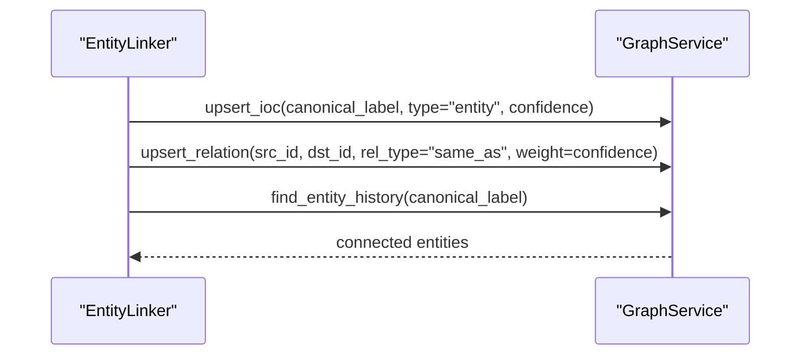
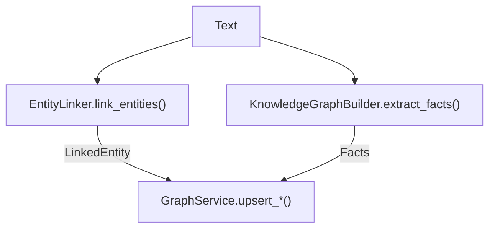
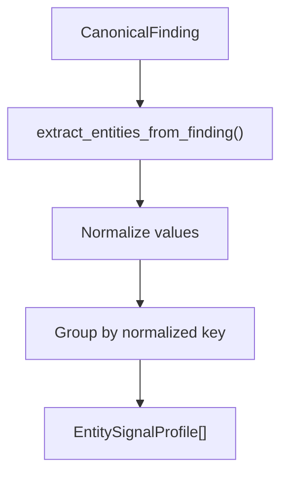
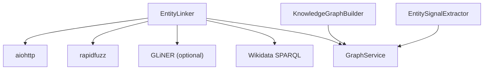

# Entity Linker

<cite>
**Referenced Files in This Document**
- [entity_linker.py](file://knowledge/entity_linker.py)
- [graph_builder.py](file://knowledge/graph_builder.py)
- [graph_service.py](file://knowledge/graph_service.py)
- [__init__.py](file://knowledge/__init__.py)
- [entity_signal_extractor.py](file://intelligence/entity_signal_extractor.py)
- [test_knowledge_graph_service.py](file://tests/test_knowledge_graph_service.py)
</cite>

## Table of Contents
1. [Introduction](#introduction)
2. [Project Structure](#project-structure)
3. [Core Components](#core-components)
4. [Architecture Overview](#architecture-overview)
5. [Detailed Component Analysis](#detailed-component-analysis)
6. [Dependency Analysis](#dependency-analysis)
7. [Performance Considerations](#performance-considerations)
8. [Troubleshooting Guide](#troubleshooting-guide)
9. [Conclusion](#conclusion)
10. [Appendices](#appendices)

## Introduction
This document describes the EntityLinker component responsible for entity disambiguation and linking. It explains how extracted entities are matched against candidates from Wikidata, how disambiguation is performed using context-aware scoring, and how the resulting linked entities integrate into the broader knowledge graph construction pipeline. The document also covers confidence scoring mechanisms, relationship establishment, and practical examples of linking scenarios and disambiguation challenges.

## Project Structure
The EntityLinker resides in the knowledge package and integrates with other knowledge graph components:
- EntityLinker: performs entity extraction, candidate retrieval from Wikidata, disambiguation, and produces LinkedEntity results.
- KnowledgeGraphBuilder: extracts structured facts from text for graph construction.
- GraphService: provides a durable, idempotent persistence layer for graph updates and analytics.
- EntitySignalExtractor: extracts entity signals (emails, usernames, domain handles) from findings for identity stitching and graph linkage.

**Diagram sources**
- [entity_linker.py:672-740](file://knowledge/entity_linker.py#L672-L740)
- [graph_builder.py:67-101](file://knowledge/graph_builder.py#L67-L101)
- [graph_service.py:45-105](file://knowledge/graph_service.py#L45-L105)
- [entity_signal_extractor.py:141-219](file://intelligence/entity_signal_extractor.py#L141-L219)

**Section sources**
- [entity_linker.py:1-120](file://knowledge/entity_linker.py#L1-L120)
- [graph_builder.py:1-36](file://knowledge/graph_builder.py#L1-L36)
- [graph_service.py:1-25](file://knowledge/graph_service.py#L1-L25)
- [entity_signal_extractor.py:1-31](file://intelligence/entity_signal_extractor.py#L1-L31)

## Core Components
- EntityLinker: Orchestrates entity extraction, Wikidata SPARQL queries, candidate ranking, and disambiguation. It supports GLiNER-based extraction with regex fallback, async HTTP requests, and an LRU cache with TTL.
- EntityCandidate: Candidate entity representation with context and popularity scores.
- LinkedEntity: Final linked entity with confidence and provenance metadata.
- SimpleCache: Lightweight in-memory cache for SPARQL query results.
- KnowledgeGraphBuilder: Regex-based fact extraction and graph ingestion helper.
- GraphService: Idempotent upsert and history lookup for graph persistence.
- EntitySignalExtractor: Lightweight extraction of usernames, emails, and domain handles from findings.

**Section sources**
- [entity_linker.py:84-186](file://knowledge/entity_linker.py#L84-L186)
- [entity_linker.py:188-263](file://knowledge/entity_linker.py#L188-L263)
- [entity_linker.py:265-860](file://knowledge/entity_linker.py#L265-L860)
- [graph_builder.py:24-101](file://knowledge/graph_builder.py#L24-L101)
- [graph_service.py:45-105](file://knowledge/graph_service.py#L45-L105)
- [entity_signal_extractor.py:65-106](file://intelligence/entity_signal_extractor.py#L65-L106)

## Architecture Overview
The entity linking workflow integrates extraction, disambiguation, and persistence:

**Diagram sources**
- [entity_linker.py:672-740](file://knowledge/entity_linker.py#L672-L740)
- [entity_linker.py:473-521](file://knowledge/entity_linker.py#L473-L521)
- [entity_linker.py:617-670](file://knowledge/entity_linker.py#L617-L670)
- [graph_service.py:45-105](file://knowledge/graph_service.py#L45-L105)

## Detailed Component Analysis

### EntityLinker: Candidate Selection, Disambiguation, and Confidence Scoring
- Entity extraction:
  - Prefer GLiNER if available; otherwise use regex patterns for PERSON, ORGANIZATION, LOCATION.
  - Extracted spans exclude overlaps and preserve positional context for disambiguation windows.
- Wikidata query:
  - Builds a SPARQL query to find label-matching entities, captures descriptions, types, and sitelinks.
  - Normalizes popularity from sitelinks and caches results with TTL.
- Disambiguation:
  - Computes context similarity using fuzzy matching (token-set ratio fallback to word overlap).
  - Scores combine context similarity (60%) and popularity (40%), then thresholds by confidence.
  - If below threshold, falls back to the most popular candidate.
- Confidence scoring:
  - final_score = 0.6 × context_score + 0.4 × popularity_score.
  - confidence in LinkedEntity equals the final_score of the chosen candidate.
- Linking workflow:
  - Concurrently processes entities with a semaphore to bound parallelism.
  - Uses a short textual window around the entity span as context when none is provided.

**Diagram sources**
- [entity_linker.py:672-740](file://knowledge/entity_linker.py#L672-L740)
- [entity_linker.py:617-670](file://knowledge/entity_linker.py#L617-L670)
- [entity_linker.py:473-521](file://knowledge/entity_linker.py#L473-L521)

**Section sources**
- [entity_linker.py:389-438](file://knowledge/entity_linker.py#L389-L438)
- [entity_linker.py:440-471](file://knowledge/entity_linker.py#L440-L471)
- [entity_linker.py:473-584](file://knowledge/entity_linker.py#L473-L584)
- [entity_linker.py:586-616](file://knowledge/entity_linker.py#L586-L616)
- [entity_linker.py:617-670](file://knowledge/entity_linker.py#L617-L670)
- [entity_linker.py:672-740](file://knowledge/entity_linker.py#L672-L740)

### Data Models: EntityCandidate and LinkedEntity

**Diagram sources**
- [entity_linker.py:84-186](file://knowledge/entity_linker.py#L84-L186)

**Section sources**
- [entity_linker.py:84-186](file://knowledge/entity_linker.py#L84-L186)

### Disambiguation Strategies and Scoring
- Context similarity:
  - Uses rapidfuzz token_set_ratio when available; otherwise computes overlap ratio of words.
- Popularity:
  - Derived from sitelinks normalized by the maximum observed sitelinks in the result set.
- Final score:
  - Weighted combination of context and popularity; threshold determines acceptance.
- Fallback:
  - If no acceptable candidate, selects the most popular one.

**Diagram sources**
- [entity_linker.py:586-616](file://knowledge/entity_linker.py#L586-L616)
- [entity_linker.py:617-670](file://knowledge/entity_linker.py#L617-L670)

**Section sources**
- [entity_linker.py:586-616](file://knowledge/entity_linker.py#L586-L616)
- [entity_linker.py:617-670](file://knowledge/entity_linker.py#L617-L670)

### Relationship Establishment Between New and Existing Entities
- LinkedEntity provides canonical_id and canonical_label for established links.
- Downstream components (e.g., GraphService) can upsert these entities and relations into the knowledge graph.
- Example usage patterns:
  - Upsert canonical entities and relations idempotently.
  - Query entity history to discover connected entities.

**Diagram sources**
- [entity_linker.py:719-728](file://knowledge/entity_linker.py#L719-L728)
- [graph_service.py:45-105](file://knowledge/graph_service.py#L45-L105)

**Section sources**
- [entity_linker.py:719-728](file://knowledge/entity_linker.py#L719-L728)
- [graph_service.py:45-105](file://knowledge/graph_service.py#L45-L105)

### Integration with Knowledge Graph Construction Pipeline
- KnowledgeGraphBuilder:
  - Extracts structured facts (is_a, causes, located_in, part_of, contains) from text using regex.
  - Produces nodes and relations for downstream ingestion.
- EntityLinker:
  - Provides LinkedEntity objects with canonical identifiers and confidence for precise linking.
- GraphService:
  - Ensures idempotent upserts and safe history queries for entity relationships.

**Diagram sources**
- [graph_builder.py:67-101](file://knowledge/graph_builder.py#L67-L101)
- [entity_linker.py:672-740](file://knowledge/entity_linker.py#L672-L740)
- [graph_service.py:45-105](file://knowledge/graph_service.py#L45-L105)

**Section sources**
- [graph_builder.py:67-101](file://knowledge/graph_builder.py#L67-L101)
- [entity_linker.py:672-740](file://knowledge/entity_linker.py#L672-L740)
- [graph_service.py:45-105](file://knowledge/graph_service.py#L45-L105)

### Examples of Entity Linking Scenarios and Disambiguation Challenges
- Scenario 1: Technology company mention
  - Input: “Apple was founded by Steve Jobs.”
  - Extraction: “Apple” (ORGANIZATION), “Steve Jobs” (PERSON).
  - Disambiguation: Context similarity with entity descriptions favors the correct “Apple Inc.” over other organizations.
- Scenario 2: Ambiguous person name
  - Input: “John Smith met with a John Smith at the conference.”
  - Challenge: Two instances of “John Smith”; disambiguation relies on surrounding context or entity type/type hierarchy.
- Scenario 3: Alias resolution
  - Input: “Tesla Motors” vs. “Tesla.”
  - Resolve aliases to canonical label using resolve_aliases() and select the most popular candidate.

**Section sources**
- [entity_linker.py:672-740](file://knowledge/entity_linker.py#L672-L740)
- [entity_linker.py:742-773](file://knowledge/entity_linker.py#L742-L773)

### Entity Signals and Identity Stitching
- EntitySignalExtractor:
  - Extracts emails, usernames, and domain handles from findings.
  - Normalizes values and groups by normalized keys to build lightweight profiles.
  - Provides confidence adjustments based on finding confidence and pattern strength.

**Diagram sources**
- [entity_signal_extractor.py:141-219](file://intelligence/entity_signal_extractor.py#L141-L219)

**Section sources**
- [entity_signal_extractor.py:141-219](file://intelligence/entity_signal_extractor.py#L141-L219)

## Dependency Analysis
- Internal dependencies:
  - EntityLinker depends on aiohttp for async HTTP, rapidfuzz for fuzzy matching, and optional GLiNER for NER.
  - KnowledgeGraphBuilder and GraphService provide complementary extraction and persistence roles.
- External dependencies:
  - Wikidata SPARQL endpoint for candidate retrieval.
  - DuckPGQGraph (via GraphService) for analytics and history queries.

**Diagram sources**
- [entity_linker.py:47-81](file://knowledge/entity_linker.py#L47-L81)
- [graph_service.py:22-42](file://knowledge/graph_service.py#L22-L42)

**Section sources**
- [entity_linker.py:47-81](file://knowledge/entity_linker.py#L47-L81)
- [graph_service.py:22-42](file://knowledge/graph_service.py#L22-L42)

## Performance Considerations
- Concurrency:
  - Semaphore limits concurrent Wikidata queries to avoid overload.
- Caching:
  - SimpleCache with TTL reduces repeated SPARQL calls and improves latency.
- Memory footprint:
  - Lightweight similarity and regex-based extraction keep memory usage low on constrained hardware.
- Batch processing:
  - Batch link mode allows processing multiple texts concurrently.

**Section sources**
- [entity_linker.py:698-740](file://knowledge/entity_linker.py#L698-L740)
- [entity_linker.py:188-263](file://knowledge/entity_linker.py#L188-L263)
- [entity_linker.py:805-831](file://knowledge/entity_linker.py#L805-L831)

## Troubleshooting Guide
- Missing aiohttp:
  - Symptom: Cannot query Wikidata; warnings logged.
  - Action: Install aiohttp or ensure runtime availability.
- Missing rapidfuzz:
  - Symptom: Fallback similarity computed via word overlap.
  - Action: Install rapidfuzz for improved fuzzy matching.
- GLiNER not available:
  - Symptom: Fallback NER patterns used.
  - Action: Ensure GLiNER is installed and importable.
- GraphService failures:
  - Symptom: Upserts return False; history queries return empty.
  - Action: Verify graph initialization and connectivity; GraphService is designed to fail-safe.

**Section sources**
- [entity_linker.py:47-81](file://knowledge/entity_linker.py#L47-L81)
- [entity_linker.py:586-616](file://knowledge/entity_linker.py#L586-L616)
- [entity_linker.py:377-388](file://knowledge/entity_linker.py#L377-L388)
- [graph_service.py:33-42](file://knowledge/graph_service.py#L33-L42)
- [test_knowledge_graph_service.py:106-172](file://tests/test_knowledge_graph_service.py#L106-L172)

## Conclusion
The EntityLinker provides a robust, memory-efficient framework for entity disambiguation and linking against Wikidata. Its context-aware scoring, alias resolution, and integration with GraphService enable reliable linkage and subsequent graph construction. By combining lightweight extraction, caching, and idempotent persistence, it fits well into the broader knowledge graph pipeline while remaining resilient under real-world constraints.

## Appendices

### API Surface Summary
- EntityLinker.link_entities(text, context="")
- EntityLinker.disambiguate(entity_text, candidates, context)
- EntityLinker.resolve_aliases(entities)
- GraphService.upsert_ioc(value, ioc_type, confidence, source)
- GraphService.upsert_relation(src, dst, rel_type, weight, evidence)
- GraphService.find_entity_history(value, max_hops)
- KnowledgeGraphBuilder.extract_facts(text)
- EntitySignalExtractor.extract_entities_from_finding(finding)

**Section sources**
- [entity_linker.py:672-740](file://knowledge/entity_linker.py#L672-L740)
- [entity_linker.py:742-773](file://knowledge/entity_linker.py#L742-L773)
- [graph_service.py:45-105](file://knowledge/graph_service.py#L45-L105)
- [graph_builder.py:67-101](file://knowledge/graph_builder.py#L67-L101)
- [entity_signal_extractor.py:141-219](file://intelligence/entity_signal_extractor.py#L141-L219)