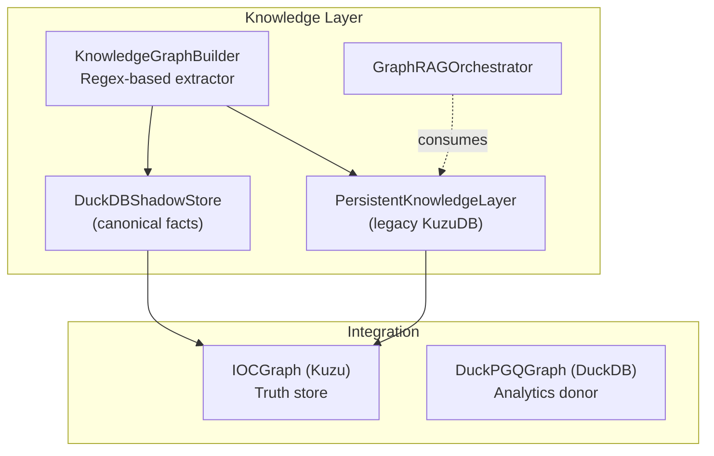
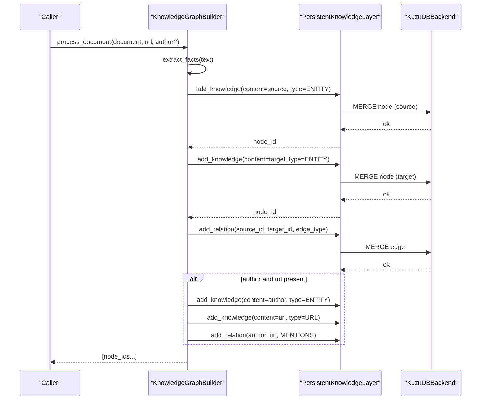
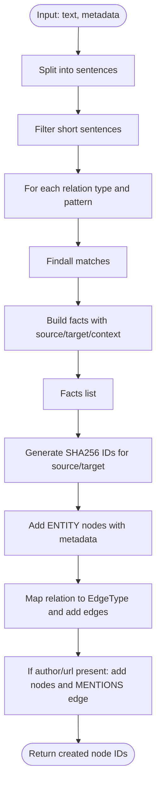
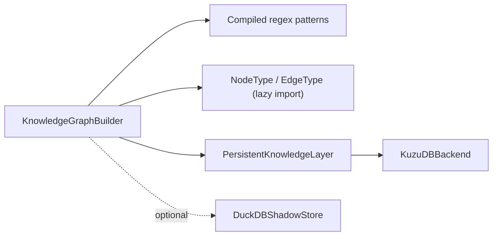

# Graph Builder Core

<cite>
**Referenced Files in This Document**
- [graph_builder.py](file://knowledge/graph_builder.py)
- [persistent_layer.py](file://legacy/persistent_layer.py)
- [graph_layer.py](file://knowledge/graph_layer.py)
- [duckdb_store.py](file://knowledge/duckdb_store.py)
- [__init__.py](file://knowledge/__init__.py)
</cite>

## Table of Contents
1. [Introduction](#introduction)
2. [Project Structure](#project-structure)
3. [Core Components](#core-components)
4. [Architecture Overview](#architecture-overview)
5. [Detailed Component Analysis](#detailed-component-analysis)
6. [Dependency Analysis](#dependency-analysis)
7. [Performance Considerations](#performance-considerations)
8. [Troubleshooting Guide](#troubleshooting-guide)
9. [Conclusion](#conclusion)

## Introduction
This document explains the KnowledgeGraphBuilder core component, a memory-safe, regex-based system for extracting structured facts from text and integrating them into the persistent knowledge layer. It avoids expensive NLP model loading by relying on carefully designed regular expressions to identify semantic relations such as "is_a", "causes", "located_in", "part_of", and "contains". The builder extracts facts from sentences, generates stable IDs using SHA256 hashing, and creates nodes and edges in the persistent knowledge layer with rich metadata.

## Project Structure
The KnowledgeGraphBuilder resides in the knowledge module and integrates with legacy and modern storage backends:
- Core extractor: knowledge/graph_builder.py
- Legacy persistent layer (KuzuDB): legacy/persistent_layer.py
- Orchestrator layer (deprecated): knowledge/graph_layer.py
- Canonical facts store (DuckDB): knowledge/duckdb_store.py
- Public exports and compatibility: knowledge/__init__.py

**Diagram sources**
- [graph_builder.py:24-35](file://knowledge/graph_builder.py#L24-L35)
- [persistent_layer.py:674-762](file://legacy/persistent_layer.py#L674-L762)
- [duckdb_store.py:643-741](file://knowledge/duckdb_store.py#L643-L741)
- [graph_layer.py:23-61](file://knowledge/graph_layer.py#L23-L61)

**Section sources**
- [graph_builder.py:1-35](file://knowledge/graph_builder.py#L1-L35)
- [__init__.py:120-129](file://knowledge/__init__.py#L120-L129)

## Core Components
- KnowledgeGraphBuilder: Initializes regex patterns, extracts facts from text, and stores them into the persistent knowledge layer. It also handles metadata propagation and author/source linking.
- PersistentKnowledgeLayer (legacy): Provides the authoritative persistent storage backend (KuzuDB) and manages nodes, edges, and metadata updates with ring buffers for temporal signals.
- DuckDBShadowStore (canonical): Stores sprint-level facts and analytics records; not the truth store for IOCs, but a durable facts authority for analytics.
- GraphRAGOrchestrator: Consumes the persistent layer for multi-hop reasoning (not owned by the builder).

Key responsibilities:
- Memory-safe extraction without NLP models
- Sentence segmentation and pattern matching
- Node and edge creation with metadata
- Stable ID generation using SHA256
- Integration with legacy KuzuDB and canonical DuckDB stores

**Section sources**
- [graph_builder.py:24-35](file://knowledge/graph_builder.py#L24-L35)
- [persistent_layer.py:674-762](file://legacy/persistent_layer.py#L674-L762)
- [duckdb_store.py:643-741](file://knowledge/duckdb_store.py#L643-L741)
- [graph_layer.py:23-61](file://knowledge/graph_layer.py#L23-L61)

## Architecture Overview
The builder acts as a helper/extractor that forwards facts to the authoritative graph backend. It does not own storage; it transforms and feeds data into the persistent layer.

**Diagram sources**
- [graph_builder.py:117-203](file://knowledge/graph_builder.py#L117-L203)
- [persistent_layer.py:255-277](file://legacy/persistent_layer.py#L255-L277)

## Detailed Component Analysis

### KnowledgeGraphBuilder
- Initialization: Compiles regex patterns for five relation types and logs initialization.
- Pattern initialization: Defines patterns for "is_a", "causes", "located_in", "part_of", and "contains" using re.IGNORECASE.
- Fact extraction:
  - Splits text into sentences using sentence-ending punctuation.
  - Filters short sentences.
  - Applies each pattern for each relation type.
  - Captures subject and object terms and records the original sentence as context.
- ID generation: Uses SHA256(content) and takes the first 16 hex characters for compact, stable IDs.
- Storage integration:
  - Creates source and target nodes with NodeType.ENTITY and metadata indicating provenance.
  - Adds edges mapped to EdgeType values (e.g., RELATED, CAUSES, PART_OF, CONTAINS).
  - Optionally links author and URL nodes with MENTIONS edge when metadata is provided.
  - Logs counts of processed facts and created nodes.

Supported relations and patterns:
- is_a: "X is a Y", "X are Y"
- causes: "X causes Y", "X leads to Y"
- located_in: "X is located in Y", "X is situated in Y"
- part_of: "X is part of Y", "X belongs to Y"
- contains: "X contains Y", "X includes Y"

Metadata handling:
- Nodes receive metadata with extracted_from pointing to the source URL.
- Edges carry context (original sentence) and extracted_from.
- Author and URL nodes receive type metadata and a MENTIONS relation.

Processing workflow:
- process_document builds metadata and delegates to process_and_store.
- process_and_store orchestrates extraction, node creation, edge creation, and optional author/url linking.

**Diagram sources**
- [graph_builder.py:67-101](file://knowledge/graph_builder.py#L67-L101)
- [graph_builder.py:117-203](file://knowledge/graph_builder.py#L117-L203)

**Section sources**
- [graph_builder.py:37-65](file://knowledge/graph_builder.py#L37-L65)
- [graph_builder.py:67-101](file://knowledge/graph_builder.py#L67-L101)
- [graph_builder.py:103-105](file://knowledge/graph_builder.py#L103-L105)
- [graph_builder.py:117-203](file://knowledge/graph_builder.py#L117-L203)
- [graph_builder.py:205-234](file://knowledge/graph_builder.py#L205-L234)

### PersistentKnowledgeLayer (Legacy)
- Provides authoritative storage via KuzuDB with a JSON fallback.
- Manages nodes and edges with typed enums (NodeType, EdgeType).
- Implements touch_node with ring buffers for temporal metadata (evidence_ring, url_ring, content_hash_ring) to maintain memory safety.
- Offers lazy semantic filter loading and optional HNSW/PQ indexing for search.

Integration with builder:
- add_knowledge merges nodes by ID and updates metadata.
- add_relation merges edges by source/target pair and sets metadata.

**Section sources**
- [persistent_layer.py:120-140](file://legacy/persistent_layer.py#L120-L140)
- [persistent_layer.py:317-401](file://legacy/persistent_layer.py#L317-L401)
- [persistent_layer.py:449-491](file://legacy/persistent_layer.py#L449-L491)

### DuckDBShadowStore (Canonical Facts Store)
- Not the truth store; canonical facts authority for analytics.
- Provides async-safe operations with thread-affine DB connections.
- Supports quality gates, deduplication, and optional graph injection slots for IOCGraph and STIX export.

Integration note:
- The builder can integrate with this store for analytics-level records, but the truth store remains IOCGraph (Kuzu).

**Section sources**
- [duckdb_store.py:643-741](file://knowledge/duckdb_store.py#L643-L741)
- [duckdb_store.py:843-858](file://knowledge/duckdb_store.py#L843-L858)

### GraphRAGOrchestrator
- Consumes the persistent layer for multi-hop reasoning.
- Not owned by the builder; acts as a consumer of the knowledge layer.

**Section sources**
- [graph_layer.py:54-61](file://knowledge/graph_layer.py#L54-L61)

## Dependency Analysis
- KnowledgeGraphBuilder depends on:
  - Compiled regex patterns for relation extraction
  - Legacy types (NodeType, EdgeType, KnowledgeNode, KnowledgeEdge) via lazy import
  - PersistentKnowledgeLayer for storage operations
- PersistentKnowledgeLayer depends on:
  - KuzuDBBackend (with JSON fallback)
  - Optional semantic search components (Model2Vec, HNSW, PQ)
- DuckDBShadowStore is independent of the builder’s storage path and is used for analytics.

**Diagram sources**
- [graph_builder.py:37-35](file://knowledge/graph_builder.py#L37-L35)
- [graph_builder.py:107-115](file://knowledge/graph_builder.py#L107-L115)
- [persistent_layer.py:187-254](file://legacy/persistent_layer.py#L187-L254)
- [duckdb_store.py:643-741](file://knowledge/duckdb_store.py#L643-L741)

**Section sources**
- [graph_builder.py:107-115](file://knowledge/graph_builder.py#L107-L115)
- [persistent_layer.py:187-254](file://legacy/persistent_layer.py#L187-L254)

## Performance Considerations
- Memory safety:
  - Regex-based extraction avoids loading heavy NLP models.
  - KuzuDBBackend uses ring buffers for temporal metadata to bound memory usage.
- ID generation:
  - SHA256 hashing produces stable IDs; taking a fixed-length prefix reduces key size.
- Sentence segmentation:
  - Simple punctuation splitting; consider sentence boundaries for complex punctuation.
- Storage efficiency:
  - MERGE semantics in KuzuDBBackend prevent duplicates and reduce churn.
  - Optional HNSW/PQ indexing improves search performance for large graphs.

[No sources needed since this section provides general guidance]

## Troubleshooting Guide
Common issues and resolutions:
- Missing KuzuDB:
  - The backend falls back to JSON; verify db_path permissions and availability.
- Import-time coupling:
  - Legacy types are lazily imported; ensure the builder is used after the knowledge module is imported.
- Metadata rings:
  - If temporal metadata appears stale, verify ring sizes and eviction behavior in touch_node.
- Author/URL linking:
  - Ensure metadata includes author and url; otherwise, the builder skips authorship edges.

**Section sources**
- [persistent_layer.py:215-225](file://legacy/persistent_layer.py#L215-L225)
- [persistent_layer.py:317-401](file://legacy/persistent_layer.py#L317-L401)
- [graph_builder.py:177-200](file://knowledge/graph_builder.py#L177-L200)

## Conclusion
KnowledgeGraphBuilder delivers a memory-safe, regex-based approach to extract semantic facts from text and integrate them into the persistent knowledge layer. Its design avoids heavy NLP overhead, uses stable ID generation, and propagates rich metadata for provenance and analytics. Integration with the legacy PersistentKnowledgeLayer (KuzuDB) and the canonical DuckDBShadowStore enables both authoritative storage and robust analytics workflows.