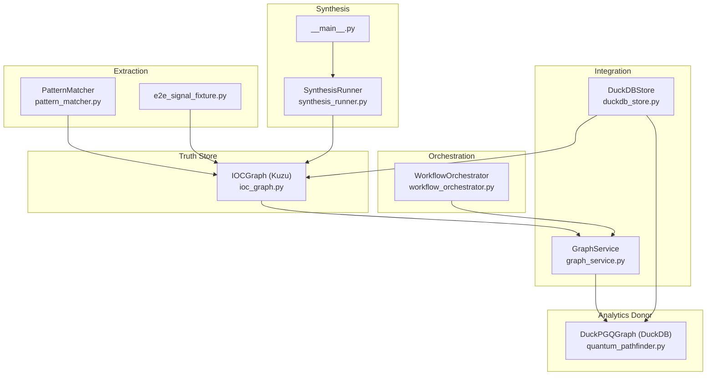
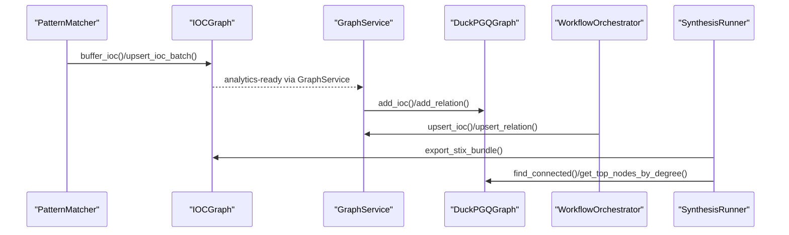
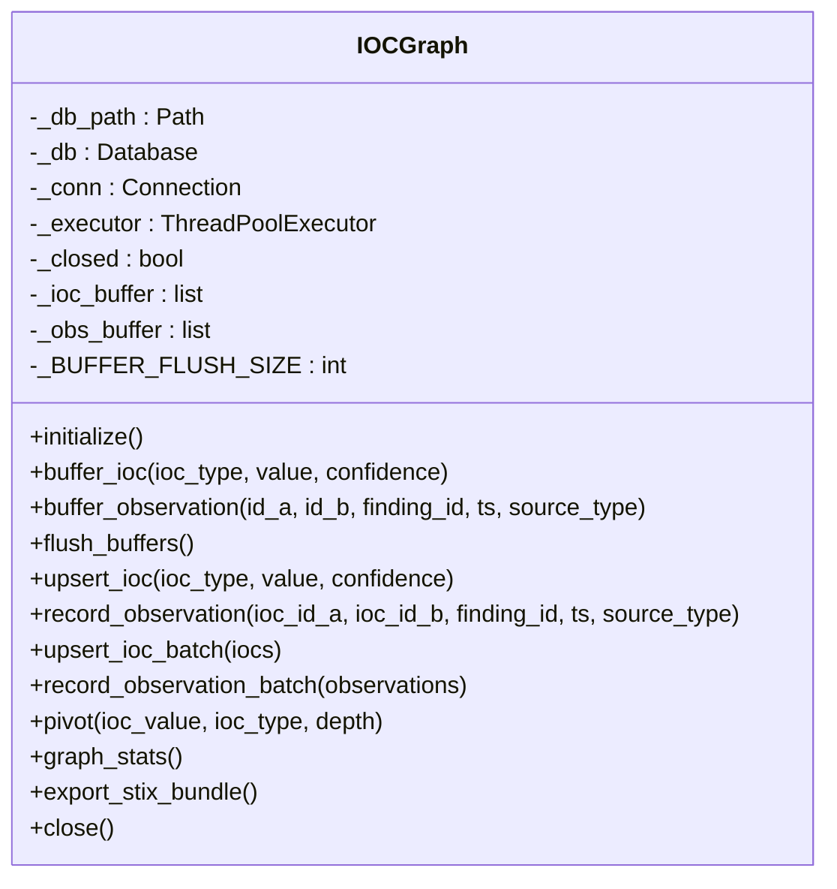
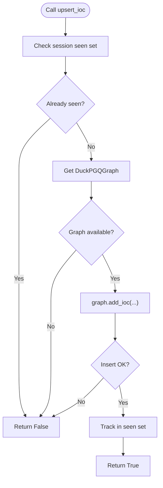
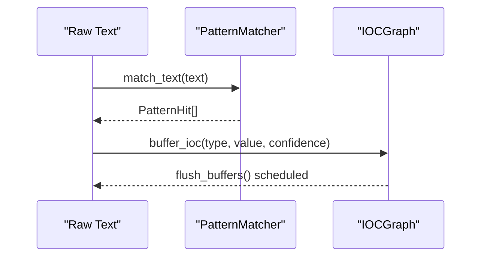
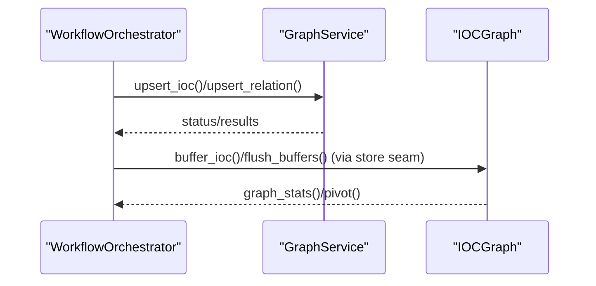
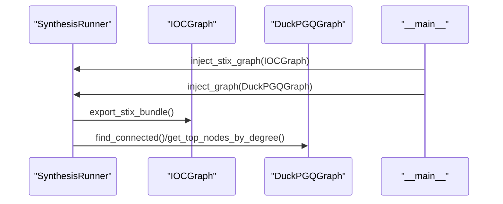
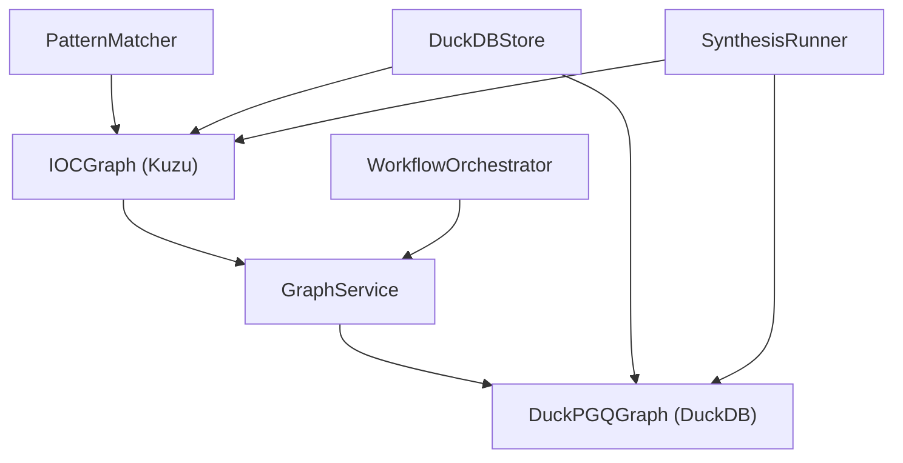

# IOC Graph

<cite>
**Referenced Files in This Document**
- [ioc_graph.py](file://knowledge/ioc_graph.py)
- [graph_service.py](file://knowledge/graph_service.py)
- [workflow_orchestrator.py](file://intelligence/workflow_orchestrator.py)
- [pattern_matcher.py](file://patterns/pattern_matcher.py)
- [e2e_signal_fixture.py](file://benchmarks/e2e_signal_fixture.py)
- [synthesis_runner.py](file://brain/synthesis_runner.py)
- [__main__.py](file://__main__.py)
- [quantum_pathfinder.py](file://graph/quantum_pathfinder.py)
- [duckdb_store.py](file://knowledge/duckdb_store.py)
</cite>

## Table of Contents
1. [Introduction](#introduction)
2. [Project Structure](#project-structure)
3. [Core Components](#core-components)
4. [Architecture Overview](#architecture-overview)
5. [Detailed Component Analysis](#detailed-component-analysis)
6. [Dependency Analysis](#dependency-analysis)
7. [Performance Considerations](#performance-considerations)
8. [Troubleshooting Guide](#troubleshooting-guide)
9. [Conclusion](#conclusion)
10. [Appendices](#appendices)

## Introduction
This document describes the Indicator of Compromise (IOC) graph implementation used for OSINT IOC tracking and threat intelligence representation. The IOC graph is a specialized entity graph that stores cyber threat indicators (IOCs), malware signatures, and attack patterns as nodes, and relationships between them as edges. It provides:
- A truth store for authoritative IOC entity data
- Buffered ingestion for high-throughput IOC capture
- Pivot queries for graph traversal and correlation
- STIX export for interoperability with threat intelligence ecosystems
- Integration with analytics backends for path queries and graph analytics

The implementation centers on IOCGraph (Kuzu-backed), complemented by GraphService (DuckPGQ-backed analytics), PatternMatcher-based IOC extraction, and orchestration via the Workflow Orchestrator.

## Project Structure
The IOC graph implementation spans several modules:
- Truth store: IOCGraph (Kuzu) for authoritative IOC storage and STIX export
- Analytics donor: DuckPGQGraph (DuckDB) for path queries and analytics
- Extraction: PatternMatcher and e2e signal fixture for IOC pattern detection
- Orchestration: WorkflowOrchestrator for coordinating multi-source analysis
- Integration: GraphService and DuckDBStore for seamless graph seam usage
- Synthesis: SynthesisRunner for STIX context injection and report generation

**Diagram sources**
- [ioc_graph.py](file://knowledge/ioc_graph.py)
- [graph_service.py](file://knowledge/graph_service.py)
- [workflow_orchestrator.py](file://intelligence/workflow_orchestrator.py)
- [pattern_matcher.py](file://patterns/pattern_matcher.py)
- [e2e_signal_fixture.py](file://benchmarks/e2e_signal_fixture.py)
- [synthesis_runner.py](file://brain/synthesis_runner.py)
- [__main__.py](file://__main__.py)
- [quantum_pathfinder.py](file://graph/quantum_pathfinder.py)
- [duckdb_store.py](file://knowledge/duckdb_store.py)

**Section sources**
- [ioc_graph.py](file://knowledge/ioc_graph.py)
- [graph_service.py](file://knowledge/graph_service.py)
- [workflow_orchestrator.py](file://intelligence/workflow_orchestrator.py)
- [pattern_matcher.py](file://patterns/pattern_matcher.py)
- [e2e_signal_fixture.py](file://benchmarks/e2e_signal_fixture.py)
- [synthesis_runner.py](file://brain/synthesis_runner.py)
- [__main__.py](file://__main__.py)
- [quantum_pathfinder.py](file://graph/quantum_pathfinder.py)
- [duckdb_store.py](file://knowledge/duckdb_store.py)

## Core Components
- IOCGraph (Kuzu-backed truth store)
  - Provides async-safe operations for buffered IOC ingestion, upserts, observation edges, pivot queries, and STIX export
  - Maintains deterministic IOC IDs, write buffers, and thread-safe execution via a single-thread executor
- GraphService (DuckPGQ-backed analytics donor)
  - Provides idempotent upserts and read-only analytics via DuckPGQGraph
  - Offers bounded analytics summaries and graph statistics
- PatternMatcher and e2e_signal_fixture
  - Extract structured identifiers and attack technique terms to bootstrap IOC discovery
- WorkflowOrchestrator
  - Coordinates multi-module analysis, correlates findings, and drives IOC graph integration
- SynthesisRunner and DuckDBStore
  - Integrate IOCGraph for STIX context and analytics graph for synthesis insights

**Section sources**
- [ioc_graph.py](file://knowledge/ioc_graph.py)
- [graph_service.py](file://knowledge/graph_service.py)
- [pattern_matcher.py](file://patterns/pattern_matcher.py)
- [e2e_signal_fixture.py](file://benchmarks/e2e_signal_fixture.py)
- [workflow_orchestrator.py](file://intelligence/workflow_orchestrator.py)
- [synthesis_runner.py](file://brain/synthesis_runner.py)
- [duckdb_store.py](file://knowledge/duckdb_store.py)

## Architecture Overview
The IOC graph architecture separates concerns:
- Truth store (IOCGraph) persists authoritative IOC entities and exports STIX
- Analytics donor (DuckPGQGraph) provides path queries and centrality analytics
- Extraction pipeline (PatternMatcher + e2e_signal_fixture) identifies structured identifiers and attack patterns
- Integration layer (GraphService + DuckDBStore) exposes seams for buffered writes and analytics reads
- Orchestration (WorkflowOrchestrator) coordinates analysis and graph integration
- Synthesis (SynthesisRunner) consumes both truth-store and analytics graphs for reports

**Diagram sources**
- [ioc_graph.py](file://knowledge/ioc_graph.py)
- [graph_service.py](file://knowledge/graph_service.py)
- [workflow_orchestrator.py](file://intelligence/workflow_orchestrator.py)
- [synthesis_runner.py](file://brain/synthesis_runner.py)
- [quantum_pathfinder.py](file://graph/quantum_pathfinder.py)

## Detailed Component Analysis

### IOCGraph: Kuzu-backed Truth Store
IOCGraph is the authoritative IOC entity graph with:
- Node schema: IOC(id, ioc_type, value, first_seen, last_seen, confidence)
- Edge schema: OBSERVED(from IOC TO IOC, properties: finding_id, source_type, first_seen, last_seen)
- Buffered ingestion: ACTIVE-phase buffering with automatic flushing at threshold
- Pivot traversal: Kuzu Cypher MATCH with hop limits for neighbor discovery
- STIX export: Converts IOC nodes to STIX 2.1 Indicator/Vulnerability objects with validation

Key operations:
- buffer_ioc(ioc_type, value, confidence): Enqueue IOC for later flush
- flush_buffers(): Bulk upsert IOCs and record observations
- upsert_ioc(ioc_type, value, confidence): Single upsert with last_seen bump
- record_observation(ioc_id_a, ioc_id_b, finding_id, ts, source_type): Edge upsert with idempotence
- pivot(ioc_value, ioc_type, depth): Return connected IOCs within depth hops
- export_stix_bundle(): Produce validated STIX 2.1 bundle
- graph_stats(): Node and edge counts

**Diagram sources**
- [ioc_graph.py](file://knowledge/ioc_graph.py)

**Section sources**
- [ioc_graph.py](file://knowledge/ioc_graph.py)

### GraphService: Analytics Donor Seam
GraphService wraps DuckPGQGraph for analytics:
- upsert_ioc(value, ioc_type, confidence, source): Idempotent IOC insertion with session-level dedup
- upsert_relation(src, dst, rel_type, weight, evidence): Idempotent relation insertion
- find_entity_history(value, max_hops): Return connected entities within N hops
- graph_stats(): Node/edge statistics
- graph_analytics_summary(top_k): Top central entities and community count (bounded)
- checkpoint(): Force WAL flush

**Diagram sources**
- [graph_service.py](file://knowledge/graph_service.py)

**Section sources**
- [graph_service.py](file://knowledge/graph_service.py)

### PatternMatcher and e2e_signal_fixture: IOC Extraction
PatternMatcher provides structured identifier and attack technique extraction:
- Labels for vulnerability IDs, attack techniques, malware types, and threat actors
- match_text() returns PatternHit objects used to seed IOCs

e2e_signal_fixture demonstrates pattern extraction usage in benchmarks.

**Diagram sources**
- [pattern_matcher.py](file://patterns/pattern_matcher.py)
- [e2e_signal_fixture.py](file://benchmarks/e2e_signal_fixture.py)
- [ioc_graph.py](file://knowledge/ioc_graph.py)

**Section sources**
- [pattern_matcher.py](file://patterns/pattern_matcher.py)
- [e2e_signal_fixture.py](file://benchmarks/e2e_signal_fixture.py)
- [ioc_graph.py](file://knowledge/ioc_graph.py)

### WorkflowOrchestrator: Security Intelligence Workflows
The orchestrator coordinates multi-module analysis, correlates findings, and integrates with graph services:
- Executes modules sequentially or in parallel groups with timeouts
- Builds correlation reports and anomaly detections
- Drives graph integration via GraphService and DuckDBStore seams

**Diagram sources**
- [workflow_orchestrator.py](file://intelligence/workflow_orchestrator.py)
- [graph_service.py](file://knowledge/graph_service.py)
- [ioc_graph.py](file://knowledge/ioc_graph.py)

**Section sources**
- [workflow_orchestrator.py](file://intelligence/workflow_orchestrator.py)
- [graph_service.py](file://knowledge/graph_service.py)
- [ioc_graph.py](file://knowledge/ioc_graph.py)

### SynthesisRunner and STIX Integration
SynthesisRunner consumes both truth-store and analytics graphs:
- inject_stix_graph(IOCGraph): Preferred truth-store path for STIX context
- inject_graph(DuckPGQGraph): Analytics donor for insights
- export_stix_bundle() from IOCGraph used for report context

**Diagram sources**
- [synthesis_runner.py](file://brain/synthesis_runner.py)
- [ioc_graph.py](file://knowledge/ioc_graph.py)
- [quantum_pathfinder.py](file://graph/quantum_pathfinder.py)
- [__main__.py](file://__main__.py)

**Section sources**
- [synthesis_runner.py](file://brain/synthesis_runner.py)
- [ioc_graph.py](file://knowledge/ioc_graph.py)
- [quantum_pathfinder.py](file://graph/quantum_pathfinder.py)
- [__main__.py](file://__main__.py)

## Dependency Analysis
- IOCGraph depends on Kuzu for graph storage and Cypher execution
- GraphService depends on DuckPGQGraph for analytics and path queries
- DuckDBStore provides compatibility seams for both IOCGraph and DuckPGQGraph
- PatternMatcher and e2e_signal_fixture feed IOCs into the truth store
- WorkflowOrchestrator coordinates ingestion and analytics
- SynthesisRunner consumes both truth-store and analytics graphs

**Diagram sources**
- [ioc_graph.py](file://knowledge/ioc_graph.py)
- [graph_service.py](file://knowledge/graph_service.py)
- [workflow_orchestrator.py](file://intelligence/workflow_orchestrator.py)
- [synthesis_runner.py](file://brain/synthesis_runner.py)
- [quantum_pathfinder.py](file://graph/quantum_pathfinder.py)
- [duckdb_store.py](file://knowledge/duckdb_store.py)

**Section sources**
- [ioc_graph.py](file://knowledge/ioc_graph.py)
- [graph_service.py](file://knowledge/graph_service.py)
- [workflow_orchestrator.py](file://intelligence/workflow_orchestrator.py)
- [synthesis_runner.py](file://brain/synthesis_runner.py)
- [quantum_pathfinder.py](file://graph/quantum_pathfinder.py)
- [duckdb_store.py](file://knowledge/duckdb_store.py)

## Performance Considerations
- Buffered writes: IOCGraph accumulates IOCs and observations in memory and flushes in batches to reduce I/O overhead
- Thread safety: Kuzu is executed via a single-thread executor to avoid concurrency issues
- Regex extraction: PatternMatcher uses compiled patterns for efficient scanning
- Analytics bounding: GraphService caps analytics sampling and top-K results to control resource usage
- STIX export validation: Bundle validation occurs after construction to ensure integrity

[No sources needed since this section provides general guidance]

## Troubleshooting Guide
Common issues and resolutions:
- Kuzu initialization failures: Verify database path permissions and availability
- GraphService analytics unavailable: DuckPGQGraph may be unavailable; fallback to idempotent operations
- STIX export validation warnings: Inspect generated objects and ensure required fields are populated
- Buffered writes not flushing: Ensure flush_buffers() is invoked during WINDUP or when buffer threshold is reached
- Cross-sprint state leakage: Reset session idempotency trackers and graph singleton at sprint start

**Section sources**
- [ioc_graph.py](file://knowledge/ioc_graph.py)
- [graph_service.py](file://knowledge/graph_service.py)
- [synthesis_runner.py](file://brain/synthesis_runner.py)

## Conclusion
The IOC graph implementation provides a robust, asynchronous, and interoperable foundation for OSINT IOC tracking and threat intelligence workflows. By separating the truth store (IOCGraph) from the analytics donor (DuckPGQGraph), it enables scalable ingestion, efficient traversal, and standardized export for downstream synthesis and reporting.

[No sources needed since this section summarizes without analyzing specific files]

## Appendices

### IOC Classification System
- Types supported: cve, ip, hash_sha256, hash_md5, onion, domain, apt, malware
- Deterministic IDs: Generated from ioc_type and hashed value for stable entity identity
- Confidence: Numeric confidence score associated with each IOC

**Section sources**
- [ioc_graph.py](file://knowledge/ioc_graph.py)

### Relationship Types Between Indicators and Threats
- OBSERVED edges connect IOCs with properties: finding_id, source_type, first_seen, last_seen
- These edges represent co-occurrence or association evidence between IOCs
- Pivot queries traverse these edges to discover connected IOCs within configurable hop distances

**Section sources**
- [ioc_graph.py](file://knowledge/ioc_graph.py)

### Graph Traversal Algorithms for Threat Hunting
- Pivot traversal: Cypher MATCH with variable-length relationships to find neighbors up to a specified depth
- Top-k analytics: Degree-based centrality sampling for high-value entity identification
- Community estimation: Label propagation approximation on sampled edges

**Section sources**
- [ioc_graph.py](file://knowledge/ioc_graph.py)
- [graph_service.py](file://knowledge/graph_service.py)
- [quantum_pathfinder.py](file://graph/quantum_pathfinder.py)

### Examples of IOC Graph Construction and Queries
- IOC construction:
  - PatternMatcher extracts structured identifiers and attack terms
  - IOCGraph.buffer_ioc() enqueues IOCs; flush_buffers() persists them
  - GraphService.upsert_ioc() provides idempotent analytics ingestion
- Threat intelligence queries:
  - pivot(ioc_value, ioc_type, depth) returns connected IOCs for correlation
  - find_entity_history(value, max_hops) returns related entities for contextual analysis
- Security analysis workflows:
  - WorkflowOrchestrator coordinates extraction, ingestion, and analytics
  - SynthesisRunner consumes both truth-store and analytics graphs for comprehensive reports

**Section sources**
- [pattern_matcher.py](file://patterns/pattern_matcher.py)
- [ioc_graph.py](file://knowledge/ioc_graph.py)
- [graph_service.py](file://knowledge/graph_service.py)
- [workflow_orchestrator.py](file://intelligence/workflow_orchestrator.py)
- [synthesis_runner.py](file://brain/synthesis_runner.py)