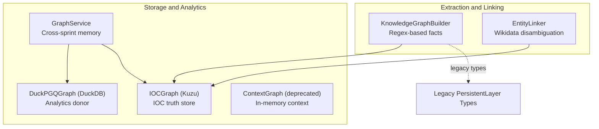
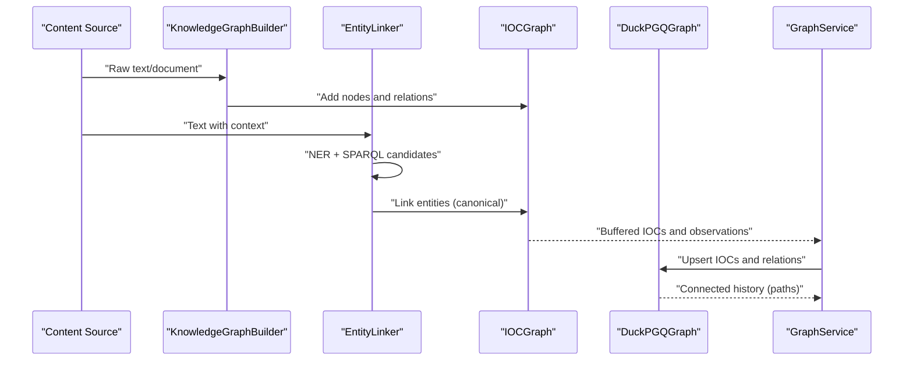
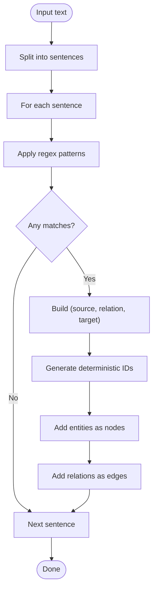
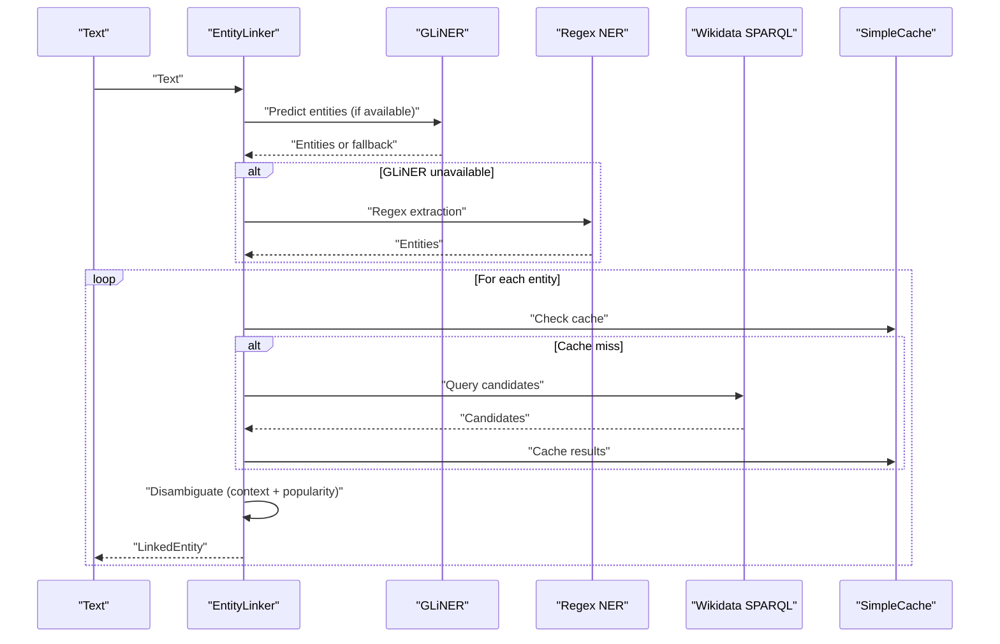
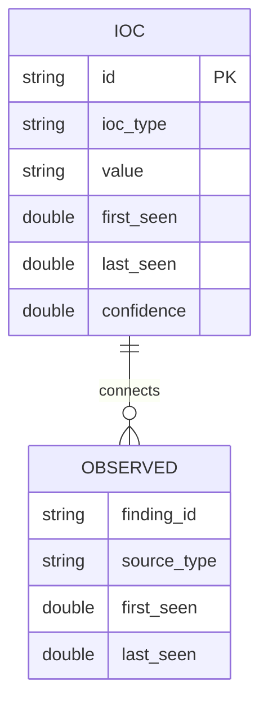
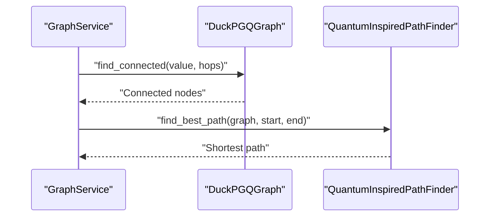
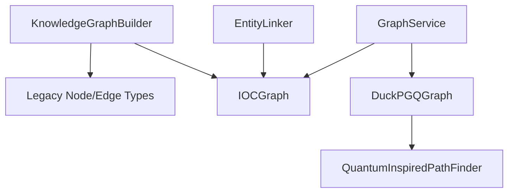

# Knowledge Graph Construction

<cite>
**Referenced Files in This Document**
- [graph_builder.py](file://knowledge/graph_builder.py)
- [entity_linker.py](file://knowledge/entity_linker.py)
- [ioc_graph.py](file://knowledge/ioc_graph.py)
- [quantum_pathfinder.py](file://graph/quantum_pathfinder.py)
- [graph_service.py](file://knowledge/graph_service.py)
- [context_graph.py](file://knowledge/context_graph.py)
- [persistent_layer.py](file://legacy/persistent_layer.py)
</cite>

## Table of Contents
1. [Introduction](#introduction)
2. [Project Structure](#project-structure)
3. [Core Components](#core-components)
4. [Architecture Overview](#architecture-overview)
5. [Detailed Component Analysis](#detailed-component-analysis)
6. [Dependency Analysis](#dependency-analysis)
7. [Performance Considerations](#performance-considerations)
8. [Troubleshooting Guide](#troubleshooting-guide)
9. [Conclusion](#conclusion)
10. [Appendices](#appendices)

## Introduction
This document explains the knowledge graph construction system, focusing on:
- Regex-based fact extraction and entity recognition performed by the KnowledgeGraphBuilder
- EntityLinker’s disambiguation algorithms, candidate selection, and linking strategies
- ContextGraph’s lightweight in-memory context tracking
- IOC (Indicator of Compromise) graph for threat intelligence representation powered by IOCGraph (Kuzu-backed)
- Graph schema definitions, node and edge types, relationship patterns, and traversal algorithms
- Practical workflows for graph construction, entity linking, and querying

## Project Structure
The knowledge graph system spans several modules:
- Knowledge extraction and linking: graph_builder.py, entity_linker.py
- Truth store for IOCs: ioc_graph.py
- Analytics donor backend: quantum_pathfinder.py (DuckPGQGraph)
- Cross-sprint memory seam: graph_service.py
- Deprecated in-memory context: context_graph.py
- Legacy node/edge types and persistent layer: persistent_layer.py

**Diagram sources**
- [graph_builder.py:24-235](file://knowledge/graph_builder.py#L24-L235)
- [entity_linker.py:265-936](file://knowledge/entity_linker.py#L265-L936)
- [ioc_graph.py:113-791](file://knowledge/ioc_graph.py#L113-L791)
- [quantum_pathfinder.py:1105-1435](file://graph/quantum_pathfinder.py#L1105-L1435)
- [graph_service.py:26-311](file://knowledge/graph_service.py#L26-L311)
- [context_graph.py:20-55](file://knowledge/context_graph.py#L20-L55)
- [persistent_layer.py:120-185](file://legacy/persistent_layer.py#L120-L185)

**Section sources**
- [graph_builder.py:1-235](file://knowledge/graph_builder.py#L1-L235)
- [entity_linker.py:1-936](file://knowledge/entity_linker.py#L1-L936)
- [ioc_graph.py:1-791](file://knowledge/ioc_graph.py#L1-L791)
- [quantum_pathfinder.py:1-1435](file://graph/quantum_pathfinder.py#L1-L1435)
- [graph_service.py:1-311](file://knowledge/graph_service.py#L1-L311)
- [context_graph.py:1-55](file://knowledge/context_graph.py#L1-L55)
- [persistent_layer.py:120-185](file://legacy/persistent_layer.py#L120-L185)

## Core Components
- KnowledgeGraphBuilder: extracts structured facts from text using regex patterns and stores them into the knowledge graph backend via PersistentKnowledgeLayer. It generates deterministic node IDs and maps relations to edge types.
- EntityLinker: performs entity extraction (GLiNER or regex fallback), queries Wikidata via SPARQL, caches responses, and ranks candidates by context similarity and popularity to produce canonical linked entities.
- IOCGraph: Kuzu-backed IOC graph serving as the authoritative truth store for OSINT indicators. Provides buffered writes, pivot queries, and STIX export.
- DuckPGQGraph: DuckDB-backed analytics donor backend implementing SQL MATCH queries and recursive CTE fallbacks for pathfinding and analytics.
- GraphService: cross-sprint memory seam integrating DuckPGQGraph and IOCGraph, offering idempotent upserts and bounded analytics summaries.
- ContextGraph: deprecated in-memory context tracker (not for persistent storage).

**Section sources**
- [graph_builder.py:24-235](file://knowledge/graph_builder.py#L24-L235)
- [entity_linker.py:265-936](file://knowledge/entity_linker.py#L265-L936)
- [ioc_graph.py:113-791](file://knowledge/ioc_graph.py#L113-L791)
- [quantum_pathfinder.py:1105-1435](file://graph/quantum_pathfinder.py#L1105-L1435)
- [graph_service.py:26-311](file://knowledge/graph_service.py#L26-L311)
- [context_graph.py:20-55](file://knowledge/context_graph.py#L20-L55)

## Architecture Overview
The system separates concerns:
- Extraction and linking feed the truth store (IOCGraph) and optionally the analytics donor (DuckPGQGraph).
- GraphService coordinates cross-sprint persistence and bounded analytics.
- Legacy node/edge types inform the mapping of extracted facts to graph entities and relationships.

**Diagram sources**
- [graph_builder.py:117-235](file://knowledge/graph_builder.py#L117-L235)
- [entity_linker.py:672-740](file://knowledge/entity_linker.py#L672-L740)
- [ioc_graph.py:143-217](file://knowledge/ioc_graph.py#L143-L217)
- [quantum_pathfinder.py:1240-1284](file://graph/quantum_pathfinder.py#L1240-L1284)
- [graph_service.py:45-104](file://knowledge/graph_service.py#L45-L104)

## Detailed Component Analysis

### KnowledgeGraphBuilder: Regex-Based Fact Extraction and Entity Recognition
- Purpose: Transform unstructured text into structured facts and insert them into the knowledge graph.
- Regex patterns: Detects relations such as is-a, causes, located-in, part-of, and contains.
- Processing:
  - Splits text into sentences and applies patterns to extract triples (source, relation, target).
  - Generates deterministic node IDs from entity text.
  - Maps relation types to edge types and inserts nodes and edges via PersistentKnowledgeLayer.
  - Optionally links authors and URLs to documents.

**Diagram sources**
- [graph_builder.py:67-101](file://knowledge/graph_builder.py#L67-L101)
- [graph_builder.py:117-203](file://knowledge/graph_builder.py#L117-L203)

**Section sources**
- [graph_builder.py:24-235](file://knowledge/graph_builder.py#L24-L235)

### EntityLinker: Disambiguation, Candidate Selection, and Linking Strategies
- Entity extraction:
  - Prefer GLiNER when available; otherwise use regex-based fallback patterns.
- Candidate retrieval:
  - Queries Wikidata SPARQL endpoint with label containment and sorts by popularity (sitelinks).
- Disambiguation:
  - Computes context similarity against entity descriptions (token-set ratio or word overlap).
  - Scores combine context similarity (60%) and popularity (40%).
  - Returns best candidate if above threshold; otherwise returns most popular fallback.
- Caching and concurrency:
  - In-memory cache with TTL and LRU eviction.
  - Limits concurrent Wikidata requests with a semaphore.

**Diagram sources**
- [entity_linker.py:389-439](file://knowledge/entity_linker.py#L389-L439)
- [entity_linker.py:473-521](file://knowledge/entity_linker.py#L473-L521)
- [entity_linker.py:617-670](file://knowledge/entity_linker.py#L617-L670)
- [entity_linker.py:188-255](file://knowledge/entity_linker.py#L188-L255)

**Section sources**
- [entity_linker.py:265-936](file://knowledge/entity_linker.py#L265-L936)

### ContextGraph: Lightweight In-Memory Context Tracker
- Role: Tracks context in memory for research sessions.
- Important note: Not a persistent storage backend; use IOCGraph for authoritative storage.

**Section sources**
- [context_graph.py:20-55](file://knowledge/context_graph.py#L20-L55)

### IOC Graph (IOCGraph): Threat Intelligence Representation
- Backend: KuzuDB with a dedicated schema for IOCs and observations.
- Schema highlights:
  - Node table: IOC(id PK, ioc_type, value, timestamps, confidence)
  - Rel table: OBSERVED(FROM IOC TO IOC, with properties: finding_id, source_type, timestamps)
- Key operations:
  - Buffered writes: buffer_ioc(), buffer_observation(), flush_buffers()
  - Upserts: upsert_ioc(), upsert_ioc_batch()
  - Observations: record_observation(), record_observation_batch()
  - Traversal: pivot() with variable-depth hops
  - Analytics: export_stix_bundle() for STIX 2.1 export

**Diagram sources**
- [ioc_graph.py:108-106](file://knowledge/ioc_graph.py#L108-L106)

**Section sources**
- [ioc_graph.py:113-791](file://knowledge/ioc_graph.py#L113-L791)

### Analytics Donor Backend (DuckPGQGraph) and Pathfinding
- DuckPGQGraph:
  - SQL schema for ioc_nodes and ioc_edges.
  - Path queries using DuckPGQ GRAPH_TABLE MATCH with recursive CTE fallback.
  - Bounded analytics: top-k nodes by out-degree, export edge list, checkpoint.
- Quantum-inspired pathfinder:
  - Implements quantum random walks and Grover-style amplification using MLX or NumPy fallback.
  - Memory-conscious design with periodic cleanup and MLX cache management.

**Diagram sources**
- [quantum_pathfinder.py:1240-1284](file://graph/quantum_pathfinder.py#L1240-L1284)
- [quantum_pathfinder.py:1372-1424](file://graph/quantum_pathfinder.py#L1372-L1424)

**Section sources**
- [quantum_pathfinder.py:1105-1435](file://graph/quantum_pathfinder.py#L1105-L1435)

### Cross-Sprint Memory Seam (GraphService)
- Responsibilities:
  - Idempotent upserts for IOCs and relations within a sprint session.
  - History lookup via find_connected.
  - Bounded analytics summary and community estimation.
  - Checkpoint and session reset utilities.

**Section sources**
- [graph_service.py:26-311](file://knowledge/graph_service.py#L26-L311)

## Dependency Analysis
- KnowledgeGraphBuilder depends on legacy node/edge types for mapping extracted facts to graph entities and relationships.
- EntityLinker depends on optional libraries (aiohttp, rapidfuzz, GLiNER) and caches Wikidata responses.
- IOCGraph depends on KuzuDB for storage and provides async-safe operations via a single-threaded executor.
- DuckPGQGraph depends on DuckDB and DuckPGQ extension; falls back to CTE for path queries.
- GraphService integrates both IOCGraph and DuckPGQGraph for cross-sprint persistence and analytics.

**Diagram sources**
- [graph_builder.py:107-115](file://knowledge/graph_builder.py#L107-L115)
- [entity_linker.py:265-346](file://knowledge/entity_linker.py#L265-L346)
- [ioc_graph.py:122-130](file://knowledge/ioc_graph.py#L122-L130)
- [quantum_pathfinder.py:1105-1126](file://graph/quantum_pathfinder.py#L1105-L1126)
- [graph_service.py:26-42](file://knowledge/graph_service.py#L26-L42)

**Section sources**
- [graph_builder.py:107-115](file://knowledge/graph_builder.py#L107-L115)
- [entity_linker.py:265-346](file://knowledge/entity_linker.py#L265-L346)
- [ioc_graph.py:122-130](file://knowledge/ioc_graph.py#L122-L130)
- [quantum_pathfinder.py:1105-1126](file://graph/quantum_pathfinder.py#L1105-L1126)
- [graph_service.py:26-42](file://knowledge/graph_service.py#L26-L42)

## Performance Considerations
- Memory safety:
  - IOCGraph uses a single-threaded executor to avoid Kuzu concurrency issues.
  - DuckPGQGraph leverages DuckPGQ extension for vectorized queries and falls back to CTE.
  - QuantumInspiredPathFinder uses MLX when available and includes periodic cleanup and cache clearing.
- Concurrency and caching:
  - EntityLinker limits concurrent Wikidata requests and caches responses with TTL.
  - GraphService maintains in-memory idempotency sets per sprint to avoid duplicate writes.
- I/O patterns:
  - IOCGraph batches writes via buffers and flushes periodically to reduce I/O overhead.
  - DuckPGQGraph checkpoints to persist WAL to disk.

[No sources needed since this section provides general guidance]

## Troubleshooting Guide
- IOCGraph initialization failures:
  - Ensure KuzuDB is installed and accessible; schema initialization handles “already exists” errors.
- EntityLinker missing dependencies:
  - Install aiohttp and rapidfuzz; GLiNER is optional but improves accuracy.
- DuckPGQGraph path failures:
  - DuckPGQ extension may be unavailable; the backend automatically falls back to recursive CTE.
- Quantum pathfinder memory pressure:
  - The pathfinder performs periodic garbage collection and clears MLX caches; reduce max_steps or disable MLX acceleration if needed.

**Section sources**
- [ioc_graph.py:229-240](file://knowledge/ioc_graph.py#L229-L240)
- [entity_linker.py:48-64](file://knowledge/entity_linker.py#L48-L64)
- [quantum_pathfinder.py:1085-1091](file://graph/quantum_pathfinder.py#L1085-L1091)
- [quantum_pathfinder.py:803-845](file://graph/quantum_pathfinder.py#L803-L845)

## Conclusion
The knowledge graph construction system combines regex-based extraction, context-aware entity linking, and robust storage backends. IOCGraph provides an authoritative IOC truth store, while DuckPGQGraph enables analytics and pathfinding. GraphService bridges cross-sprint persistence and bounded analytics, ensuring reliable and scalable graph operations.

[No sources needed since this section summarizes without analyzing specific files]

## Appendices

### Graph Schema Definitions and Types
- Node types (legacy):
  - FACT, ENTITY, CONCEPT, EVENT, URL, DOCUMENT
- Edge types (legacy):
  - RELATED, CAUSES, CAUSED_BY, CONTAINS, PART_OF, MENTIONS, MENTIONED_IN, SIMILAR
- IOC graph schema:
  - Nodes: id (PK), ioc_type, value, timestamps, confidence
  - Edges: OBSERVED(from IOC to IOC) with finding_id, source_type, timestamps

**Section sources**
- [persistent_layer.py:120-185](file://legacy/persistent_layer.py#L120-L185)
- [ioc_graph.py:108-106](file://knowledge/ioc_graph.py#L108-L106)

### Example Workflows
- Graph construction workflow:
  - Feed raw text to KnowledgeGraphBuilder.
  - Extract facts, generate deterministic IDs, and insert nodes/edges into IOCGraph.
  - Optionally link authors and URLs to documents.
- Entity linking workflow:
  - Extract entities via GLiNER or regex.
  - Query Wikidata, cache results, and rank candidates by context similarity and popularity.
  - Produce LinkedEntity outputs with canonical labels and confidence.
- Graph querying techniques:
  - Use IOCGraph pivot() to traverse relationships up to a specified depth.
  - Use DuckPGQGraph find_connected() for bounded path queries.
  - Use GraphService graph_analytics_summary() for top-k central entities and community estimates.

**Section sources**
- [graph_builder.py:117-235](file://knowledge/graph_builder.py#L117-L235)
- [entity_linker.py:672-740](file://knowledge/entity_linker.py#L672-L740)
- [ioc_graph.py:575-637](file://knowledge/ioc_graph.py#L575-L637)
- [quantum_pathfinder.py:1240-1284](file://graph/quantum_pathfinder.py#L1240-L1284)
- [graph_service.py:194-252](file://knowledge/graph_service.py#L194-L252)