# Knowledge Management

<cite>
**Referenced Files in This Document**
- [knowledge/__init__.py](file://knowledge/__init__.py)
- [knowledge/duckdb_store.py](file://knowledge/duckdb_store.py)
- [knowledge/lancedb_store.py](file://knowledge/lancedb_store.py)
- [knowledge/vector_store.py](file://knowledge/vector_store.py)
- [knowledge/semantic_store.py](file://knowledge/semantic_store.py)
- [knowledge/graph_builder.py](file://knowledge/graph_builder.py)
- [knowledge/entity_linker.py](file://knowledge/entity_linker.py)
- [knowledge/rag_engine.py](file://knowledge/rag_engine.py)
- [knowledge/graph_rag.py](file://knowledge/graph_rag.py)
- [knowledge/ioc_graph.py](file://knowledge/ioc_graph.py)
- [knowledge/target_memory.py](file://knowledge/target_memory.py)
- [knowledge/context_graph.py](file://knowledge/context_graph.py)
- [knowledge/graph_layer.py](file://knowledge/graph_layer.py)
</cite>

## Table of Contents
1. [Introduction](#introduction)
2. [Project Structure](#project-structure)
3. [Core Components](#core-components)
4. [Architecture Overview](#architecture-overview)
5. [Detailed Component Analysis](#detailed-component-analysis)
6. [Dependency Analysis](#dependency-analysis)
7. [Performance Considerations](#performance-considerations)
8. [Troubleshooting Guide](#troubleshooting-guide)
9. [Conclusion](#conclusion)
10. [Appendices](#appendices)

## Introduction
This document describes Hledac Universal’s knowledge management system. It covers the storage layer architecture integrating DuckDB, LanceDB, and vector stores; semantic search capabilities; knowledge graph construction, entity linking, and relationship discovery; persistent layer semantics, atomic storage operations, and cross-sprint data persistence; configuration options and performance tuning; data lifecycle management; and practical examples for querying, graph traversal, and semantic similarity search. It also addresses data integrity, backup strategies, and migration procedures.

## Project Structure
The knowledge subsystem is organized around modular components:
- Storage backends: DuckDB for durable analytics facts, LanceDB for identity and semantic search, and a generic vector store for embeddings.
- Knowledge graph orchestration: graph builder, entity linker, and graph RAG orchestrator.
- Truth store: IOCGraph for authoritative IOC entity storage.
- Cross-sprint memory: TargetMemoryService for bounded, RAM-guarded persistence across sprints.
- Deprecated compatibility shims for legacy atomic storage and persistent layer.

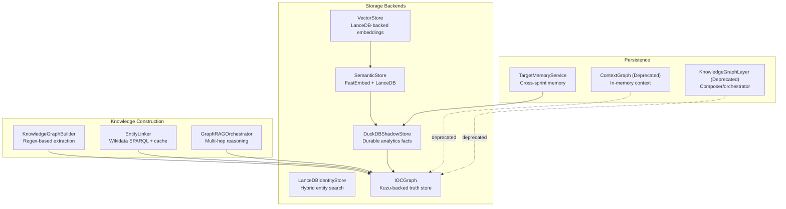

**Diagram sources**
- [knowledge/duckdb_store.py:643-791](file://knowledge/duckdb_store.py#L643-L791)
- [knowledge/lancedb_store.py:113-230](file://knowledge/lancedb_store.py#L113-L230)
- [knowledge/vector_store.py:44-121](file://knowledge/vector_store.py#L44-L121)
- [knowledge/semantic_store.py:42-117](file://knowledge/semantic_store.py#L42-L117)
- [knowledge/ioc_graph.py:113-140](file://knowledge/ioc_graph.py#L113-L140)
- [knowledge/graph_builder.py:24-101](file://knowledge/graph_builder.py#L24-L101)
- [knowledge/entity_linker.py:265-346](file://knowledge/entity_linker.py#L265-L346)
- [knowledge/graph_rag.py:93-126](file://knowledge/graph_rag.py#L93-L126)
- [knowledge/target_memory.py:56-94](file://knowledge/target_memory.py#L56-L94)
- [knowledge/context_graph.py:20-55](file://knowledge/context_graph.py#L20-L55)
- [knowledge/graph_layer.py:23-61](file://knowledge/graph_layer.py#L23-L61)

**Section sources**
- [knowledge/__init__.py:1-189](file://knowledge/__init__.py#L1-L189)

## Core Components
- DuckDBShadowStore: Canonical, async-safe DuckDB sidecar for sprint-level facts, shadow findings, and analytics. Supports RAMDISK-first mode, UMA-aware runtime settings, quality gates, persistent dedup, and graph injection slots.
- LanceDBIdentityStore: Hybrid vector + FTS store for entity resolution with embedding cache, MLX acceleration, and bounded memory usage.
- VectorStore: Singleton LanceDB-backed vector store with separate text and image indices and streaming batch insertion.
- SemanticStore: FastEmbed + LanceDB for ANN semantic search over findings with buffering and batch flush.
- IOCGraph: Kuzu-backed truth store for IOC entities and observations with buffered writes, pivot queries, and STIX export.
- KnowledgeGraphBuilder: Regex-based extractor feeding facts into the authoritative graph backend.
- EntityLinker: Wikidata-based entity linking with SPARQL, context-aware disambiguation, and response caching.
- GraphRAGOrchestrator: Multi-hop reasoning over the knowledge graph with centrality, communities, and contradiction detection.
- TargetMemoryService: Bounded, RAM-guarded cross-sprint memory for targets with drift analysis.
- Deprecated: ContextGraph (in-memory), KnowledgeGraphLayer (composer), legacy atomic storage and persistent layer re-exported via lazy compatibility.

**Section sources**
- [knowledge/duckdb_store.py:643-791](file://knowledge/duckdb_store.py#L643-L791)
- [knowledge/lancedb_store.py:113-230](file://knowledge/lancedb_store.py#L113-L230)
- [knowledge/vector_store.py:44-121](file://knowledge/vector_store.py#L44-L121)
- [knowledge/semantic_store.py:42-117](file://knowledge/semantic_store.py#L42-L117)
- [knowledge/ioc_graph.py:113-140](file://knowledge/ioc_graph.py#L113-L140)
- [knowledge/graph_builder.py:24-101](file://knowledge/graph_builder.py#L24-L101)
- [knowledge/entity_linker.py:265-346](file://knowledge/entity_linker.py#L265-L346)
- [knowledge/graph_rag.py:93-126](file://knowledge/graph_rag.py#L93-L126)
- [knowledge/target_memory.py:56-94](file://knowledge/target_memory.py#L56-L94)
- [knowledge/context_graph.py:20-55](file://knowledge/context_graph.py#L20-L55)
- [knowledge/graph_layer.py:23-61](file://knowledge/graph_layer.py#L23-L61)
- [knowledge/__init__.py:18-65](file://knowledge/__init__.py#L18-L65)

## Architecture Overview
The system separates concerns across truth, analytics, identity, and grounding:
- Truth store: IOCGraph (Kuzu) for authoritative IOC entities and relationships.
- Analytics store: DuckDBShadowStore for per-sprint metrics, findings, and scorecards.
- Identity/store: LanceDBIdentityStore for entity resolution and LanceDB-backed vector store for embeddings.
- Grounding: RAGEngine integrates hybrid retrieval (BM25 + HNSW) and ultra-context compression.
- Cross-sprint memory: TargetMemoryService maintains bounded, explainable target profiles.

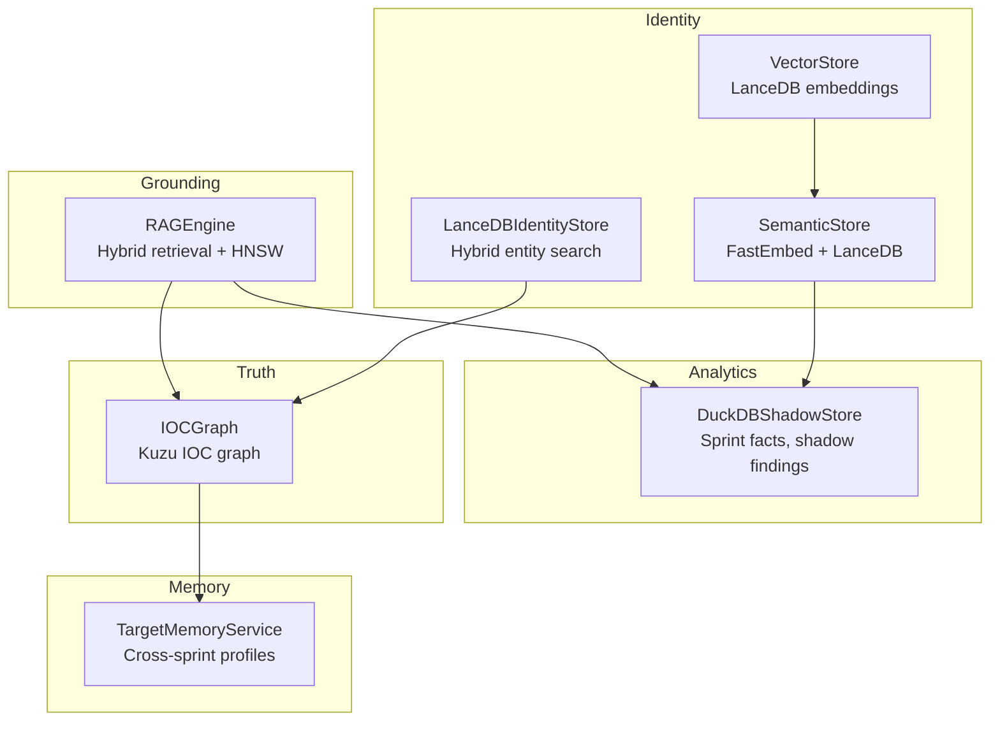

**Diagram sources**
- [knowledge/rag_engine.py:665-723](file://knowledge/rag_engine.py#L665-L723)
- [knowledge/duckdb_store.py:643-791](file://knowledge/duckdb_store.py#L643-L791)
- [knowledge/lancedb_store.py:113-230](file://knowledge/lancedb_store.py#L113-L230)
- [knowledge/vector_store.py:44-121](file://knowledge/vector_store.py#L44-L121)
- [knowledge/semantic_store.py:42-117](file://knowledge/semantic_store.py#L42-L117)
- [knowledge/ioc_graph.py:113-140](file://knowledge/ioc_graph.py#L113-L140)
- [knowledge/target_memory.py:56-94](file://knowledge/target_memory.py#L56-L94)

## Detailed Component Analysis

### DuckDBShadowStore
- Role: Canonical, async-safe DuckDB sidecar for durable analytics facts and shadow findings.
- Modes: RAMDISK-first file mode and :memory: degraded mode; UMA-aware runtime settings; single-worker thread affinity.
- Schemas: Tier 1 (sprint_delta, sprint_scorecard, source_hit_log), Tier 2 (shadow_findings, shadow_runs), Tier 3 (graph injection).
- Quality gates: Entropy thresholds, duplicate detection, persistent dedup via LMDB, and rejection ledger.
- Graph injection: Slots for IOCGraph (truth), DuckPGQGraph (analytics), and STIX export.

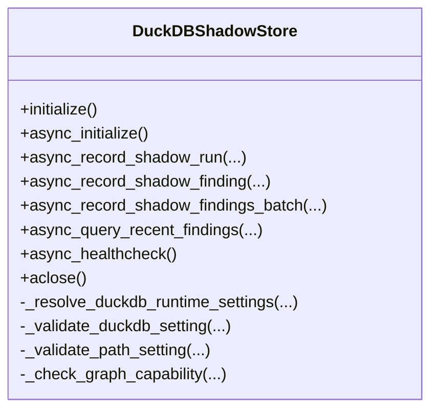

**Diagram sources**
- [knowledge/duckdb_store.py:643-791](file://knowledge/duckdb_store.py#L643-L791)

**Section sources**
- [knowledge/duckdb_store.py:643-791](file://knowledge/duckdb_store.py#L643-L791)

### LanceDBIdentityStore
- Role: Identity/Entity Store (not grounding authority).
- Features: Hybrid vector + FTS search, bounded storage, MLX acceleration, embedding cache with float16 quantization, binary embeddings for fast prefilter, adaptive reranking, and M1-safe cache bounds.
- Embedding pipeline: Shared MLXEmbeddingManager, CoreML fallback, and numpy fallback.

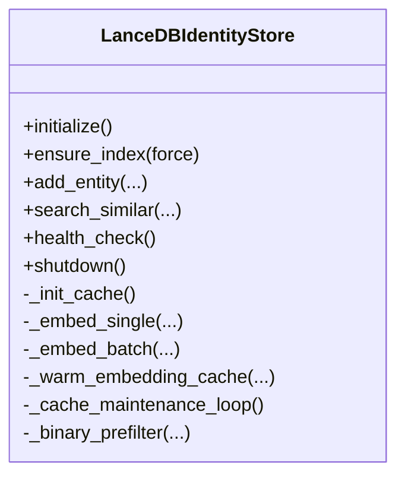

**Diagram sources**
- [knowledge/lancedb_store.py:113-230](file://knowledge/lancedb_store.py#L113-L230)

**Section sources**
- [knowledge/lancedb_store.py:113-230](file://knowledge/lancedb_store.py#L113-L230)

### VectorStore
- Role: Singleton LanceDB-backed vector store with separate text and image indices.
- Contracts: add_vectors(ids, vectors, index_type), query(vector, k, index_type), streaming batch add.
- Dimensions: 256d (MRL) for text, 1024d for images; lazy initialization and schema creation.

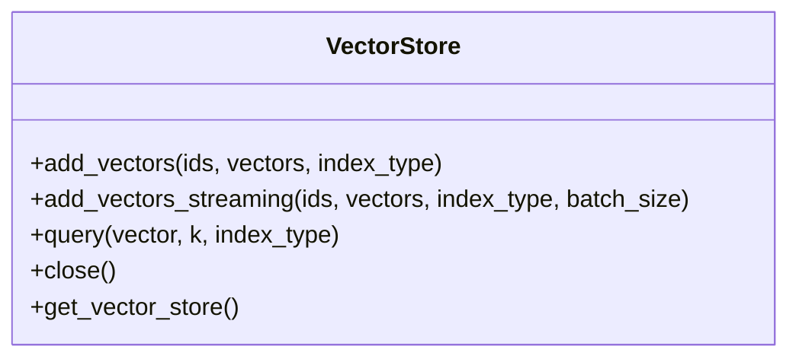

**Diagram sources**
- [knowledge/vector_store.py:44-121](file://knowledge/vector_store.py#L44-L121)

**Section sources**
- [knowledge/vector_store.py:44-121](file://knowledge/vector_store.py#L44-L121)

### SemanticStore
- Role: Consumer/Enrichment store for semantic search over findings.
- Lifecycle: initialize() (boot), buffer_finding(), flush() (windup), semantic_pivot(), close().
- Index: LanceDB table “findings_v1” with 384d BAAI/bge-small-en-v1.5 embeddings, cosine metric.

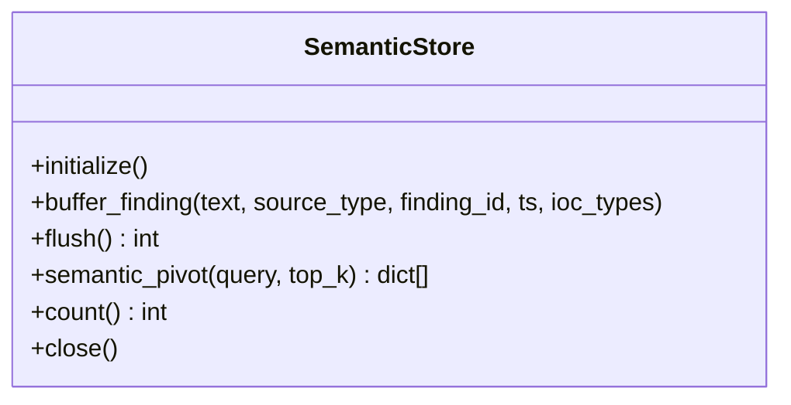

**Diagram sources**
- [knowledge/semantic_store.py:42-117](file://knowledge/semantic_store.py#L42-L117)

**Section sources**
- [knowledge/semantic_store.py:42-117](file://knowledge/semantic_store.py#L42-L117)

### IOCGraph
- Role: Graph truth store for IOC entities and observations.
- Buffers: Buffered writes (buffer_ioc, buffer_observation) with automatic flush at threshold.
- Operations: upsert_ioc, record_observation, upsert_ioc_batch, record_observation_batch, pivot, export_stix_bundle, graph_stats.
- Concurrency: Single-threaded executor for thread-safe Kuzu operations.

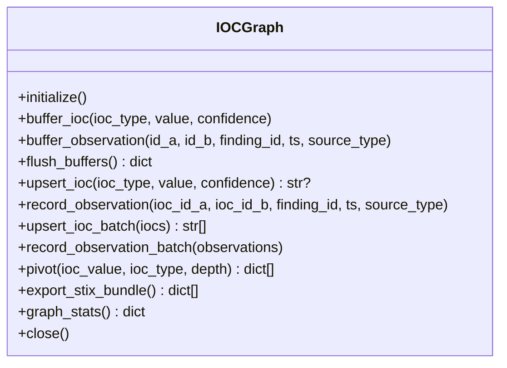

**Diagram sources**
- [knowledge/ioc_graph.py:113-140](file://knowledge/ioc_graph.py#L113-L140)

**Section sources**
- [knowledge/ioc_graph.py:113-140](file://knowledge/ioc_graph.py#L113-L140)

### KnowledgeGraphBuilder
- Role: Helper/extractor for memory-safe regex-based fact extraction.
- Outputs: Entities and relations fed into authoritative graph backend (e.g., IOCGraph).

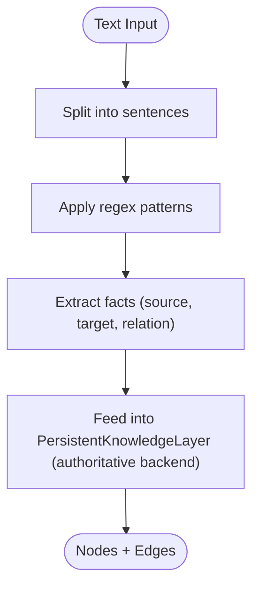

**Diagram sources**
- [knowledge/graph_builder.py:67-101](file://knowledge/graph_builder.py#L67-L101)

**Section sources**
- [knowledge/graph_builder.py:24-101](file://knowledge/graph_builder.py#L24-L101)

### EntityLinker
- Role: Wikidata-based entity linking with context-aware disambiguation.
- Features: Async HTTP requests, response caching, batch processing, GLiNER/NLP fallback, and M1 8GB RAM optimization.

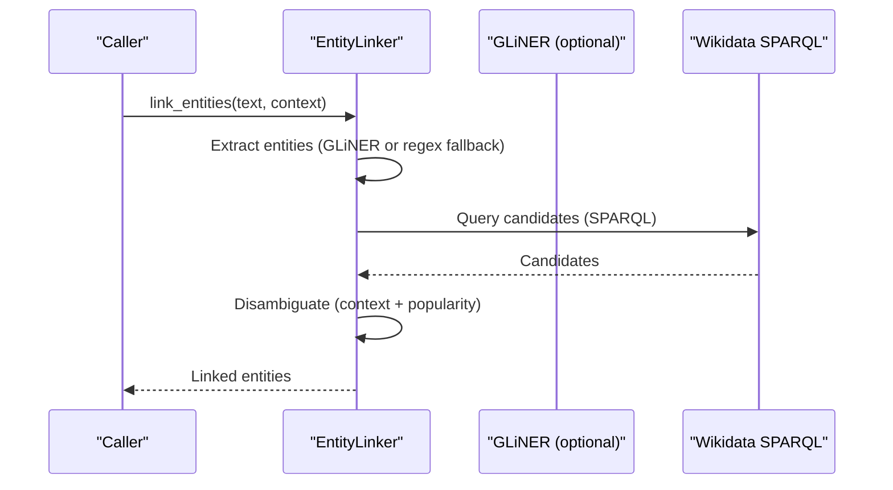

**Diagram sources**
- [knowledge/entity_linker.py:672-740](file://knowledge/entity_linker.py#L672-L740)

**Section sources**
- [knowledge/entity_linker.py:265-346](file://knowledge/entity_linker.py#L265-L346)

### GraphRAGOrchestrator
- Role: Consumer/orchestrator for multi-hop reasoning over the knowledge graph.
- Features: Multi-hop traversal, path scoring, novelty filtering, timeline analysis, contradiction detection, and narrative comparison.

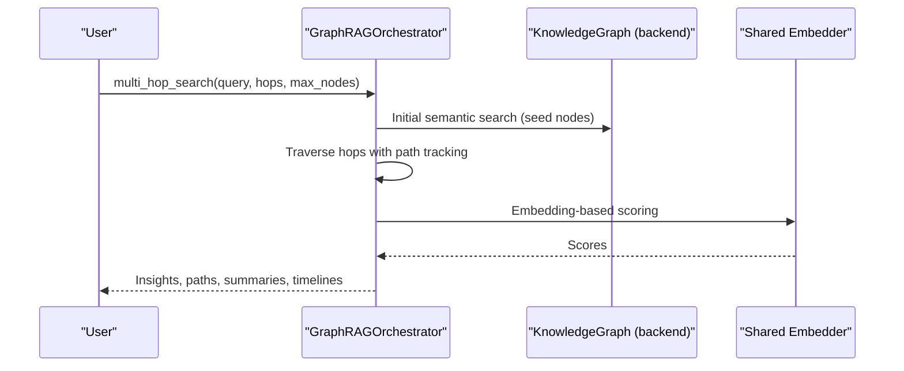

**Diagram sources**
- [knowledge/graph_rag.py:246-420](file://knowledge/graph_rag.py#L246-L420)

**Section sources**
- [knowledge/graph_rag.py:93-126](file://knowledge/graph_rag.py#L93-L126)

### TargetMemoryService
- Role: Bounded, RAM-guarded cross-sprint memory for targets with drift analysis.
- Features: Facet bounds, JSON size limits, drift ratio, and deterministic drift reasons.

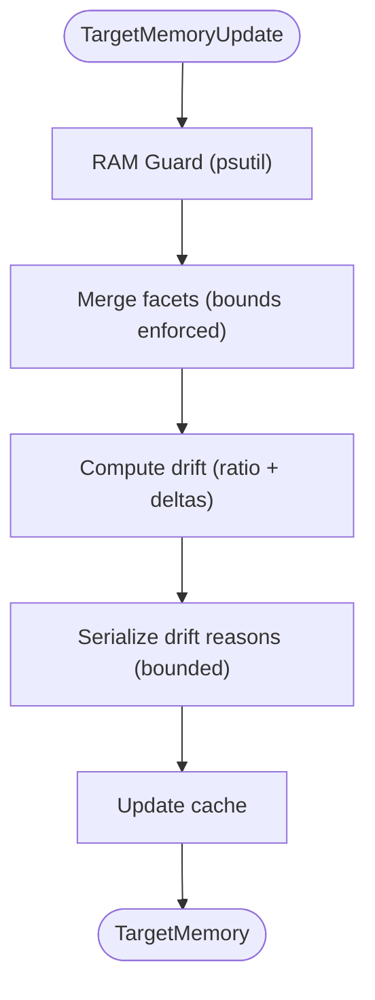

**Diagram sources**
- [knowledge/target_memory.py:246-332](file://knowledge/target_memory.py#L246-L332)

**Section sources**
- [knowledge/target_memory.py:56-94](file://knowledge/target_memory.py#L56-L94)

### Deprecated Components
- ContextGraph: Simple in-memory context graph (not a storage backend).
- KnowledgeGraphLayer: Composer/orchestrator (deprecated; use IOCGraph directly).

**Section sources**
- [knowledge/context_graph.py:20-55](file://knowledge/context_graph.py#L20-L55)
- [knowledge/graph_layer.py:23-61](file://knowledge/graph_layer.py#L23-L61)

## Dependency Analysis
- DuckDBShadowStore depends on DuckDB (imported lazily), LMDB for persistent dedup, and injectable graph backends (IOCGraph).
- LanceDBIdentityStore depends on LanceDB, optional CoreML/MLX, and LMDB embedding cache.
- VectorStore depends on LanceDB and PyArrow; SemanticStore depends on FastEmbed and LanceDB.
- IOCGraph depends on Kuzu and uses a single-threaded executor for thread-safe operations.
- GraphRAGOrchestrator depends on a knowledge layer (e.g., IOCGraph) and a shared MLXEmbeddingManager.
- TargetMemoryService depends on psutil and JSON serialization.

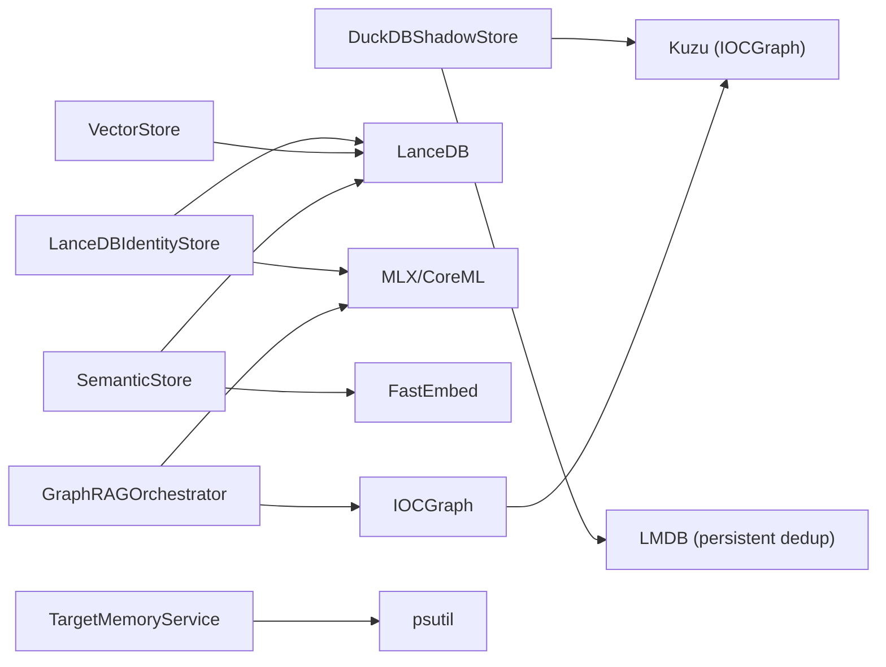

**Diagram sources**
- [knowledge/duckdb_store.py:643-791](file://knowledge/duckdb_store.py#L643-L791)
- [knowledge/lancedb_store.py:113-230](file://knowledge/lancedb_store.py#L113-L230)
- [knowledge/vector_store.py:44-121](file://knowledge/vector_store.py#L44-L121)
- [knowledge/semantic_store.py:42-117](file://knowledge/semantic_store.py#L42-L117)
- [knowledge/ioc_graph.py:113-140](file://knowledge/ioc_graph.py#L113-L140)
- [knowledge/graph_rag.py:93-126](file://knowledge/graph_rag.py#L93-L126)
- [knowledge/target_memory.py:56-94](file://knowledge/target_memory.py#L56-L94)

**Section sources**
- [knowledge/duckdb_store.py:643-791](file://knowledge/duckdb_store.py#L643-L791)
- [knowledge/lancedb_store.py:113-230](file://knowledge/lancedb_store.py#L113-L230)
- [knowledge/vector_store.py:44-121](file://knowledge/vector_store.py#L44-L121)
- [knowledge/semantic_store.py:42-117](file://knowledge/semantic_store.py#L42-L117)
- [knowledge/ioc_graph.py:113-140](file://knowledge/ioc_graph.py#L113-L140)
- [knowledge/graph_rag.py:93-126](file://knowledge/graph_rag.py#L93-L126)
- [knowledge/target_memory.py:56-94](file://knowledge/target_memory.py#L56-L94)

## Performance Considerations
- DuckDB runtime settings:
  - Memory limit and temp directory size configurable via environment variables.
  - UMA-aware adjustments for CRITICAL/EMERGENCY states.
  - Thread count tuned conservatively for M1 8GB UMA.
- LanceDB cache:
  - M1-safe defaults and hard caps; optional large override controlled by environment variable.
  - Float16 quantization and binary signatures reduce memory footprint.
- HNSW index:
  - Configurable max_elements, M, ef_construction, ef_search; supports resizing and persistence.
- Streaming batch operations:
  - VectorStore streaming insert reduces peak RSS during embedding phases.
- Embedding pipeline:
  - Shared MLXEmbeddingManager singleton to avoid duplication; fallbacks for CoreML/ANE and numpy.

[No sources needed since this section provides general guidance]

## Troubleshooting Guide
- DuckDBShadowStore
  - Health checks expose cache and index status; inspect logs for writeback failures.
  - UMA state transitions can reduce memory footprint; verify settings via runtime resolver.
  - Quality rejections and ledger help diagnose ingestion issues.
- LanceDBIdentityStore
  - Health check reports cache size, index existence, and embedder type; watch for cache eviction metrics.
  - Large cache overrides require explicit environment variables.
- IOCGraph
  - Single-threaded executor prevents race conditions; ensure flush_buffers is called during windup.
  - STIX export validates bundle; check logs for parse/validation errors.
- GraphRAGOrchestrator
  - Use sync or async execution safely depending on context; avoid nested event loops on M1.
  - Path scoring relies on shared embedder; verify availability and fallback behavior.
- TargetMemoryService
  - RAM guard skips merges under high memory pressure; monitor virtual memory percentage.

**Section sources**
- [knowledge/duckdb_store.py:643-791](file://knowledge/duckdb_store.py#L643-L791)
- [knowledge/lancedb_store.py:492-520](file://knowledge/lancedb_store.py#L492-L520)
- [knowledge/ioc_graph.py:684-701](file://knowledge/ioc_graph.py#L684-L701)
- [knowledge/graph_rag.py:422-440](file://knowledge/graph_rag.py#L422-L440)
- [knowledge/target_memory.py:252-277](file://knowledge/target_memory.py#L252-L277)

## Conclusion
Hledac Universal’s knowledge management system cleanly separates truth, analytics, identity, and grounding. DuckDB and LanceDB backends provide durable, scalable storage; IOCGraph ensures authoritative IOC entity storage; EntityLinker and GraphRAGOrchestrator enable robust entity resolution and multi-hop reasoning; TargetMemoryService preserves cross-sprint insights with RAM guards and drift analysis. The design emphasizes async safety, memory-conscious defaults, and modular composition.

[No sources needed since this section summarizes without analyzing specific files]

## Appendices

### Configuration Options and Environment Variables
- DuckDBShadowStore
  - GHOST_DUCKDB_MEMORY: memory_limit (default applied if unset).
  - GHOST_DUCKDB_MAX_TEMP: max_temp (default applied if unset).
  - UMA state: passed externally to adjust runtime settings.
- LanceDBIdentityStore
  - HLEDAC_LANCEDB_CACHE_MB: cache size in MB (default 256MB; capped at 512MB without override).
  - HLEDAC_ALLOW_LARGE_LANCEDB_CACHE: enable larger cache (backward compatible default up to 1GB).
- VectorStore
  - LanceDB directory: ~/.hledac/lancedb; tables created lazily.
- SemanticStore
  - FastEmbed model: BAAI/bge-small-en-v1.5; LanceDB table “findings_v1”.

**Section sources**
- [knowledge/duckdb_store.py:428-488](file://knowledge/duckdb_store.py#L428-L488)
- [knowledge/lancedb_store.py:85-106](file://knowledge/lancedb_store.py#L85-L106)
- [knowledge/vector_store.py:31-38](file://knowledge/vector_store.py#L31-L38)
- [knowledge/semantic_store.py:35-40](file://knowledge/semantic_store.py#L35-L40)

### Data Lifecycle Management
- Active phase: Buffered writes (IOCGraph), quality gating (DuckDBShadowStore), and entity linking (EntityLinker).
- Windup phase: Flush buffers (IOCGraph), batch embedding and upsert (SemanticStore), and analytics fact recording (DuckDBShadowStore).
- Cross-sprint persistence: TargetMemoryService aggregates facets and drift reasons.

**Section sources**
- [knowledge/ioc_graph.py:176-216](file://knowledge/ioc_graph.py#L176-L216)
- [knowledge/semantic_store.py:158-214](file://knowledge/semantic_store.py#L158-L214)
- [knowledge/duckdb_store.py:643-791](file://knowledge/duckdb_store.py#L643-L791)
- [knowledge/target_memory.py:246-332](file://knowledge/target_memory.py#L246-L332)

### Examples

- Knowledge querying
  - DuckDBShadowStore recent findings query:
    - [async_query_recent_findings:54-54](file://knowledge/duckdb_store.py#L54-L54)
  - RAGEngine hybrid retrieval:
    - [RAGConfig, BM25Index, HNSWVectorIndex:65-92](file://knowledge/rag_engine.py#L65-L92)
    - [RAGEngine.query:799-800](file://knowledge/rag_engine.py#L799-L800)

- Graph traversal
  - Multi-hop search:
    - [GraphRAGOrchestrator.multi_hop_search:246-420](file://knowledge/graph_rag.py#L246-L420)
  - Pivot query (IOCGraph):
    - [IOCGraph.pivot:575-605](file://knowledge/ioc_graph.py#L575-L605)

- Semantic similarity search
  - LanceDBIdentityStore hybrid search:
    - [LanceDBIdentityStore.search_similar:113-230](file://knowledge/lancedb_store.py#L113-L230)
  - SemanticStore pivot:
    - [SemanticStore.semantic_pivot:220-266](file://knowledge/semantic_store.py#L220-L266)
  - VectorStore query:
    - [VectorStore.query:211-277](file://knowledge/vector_store.py#L211-L277)

**Section sources**
- [knowledge/duckdb_store.py:54-54](file://knowledge/duckdb_store.py#L54-L54)
- [knowledge/rag_engine.py:65-92](file://knowledge/rag_engine.py#L65-L92)
- [knowledge/rag_engine.py:799-800](file://knowledge/rag_engine.py#L799-L800)
- [knowledge/graph_rag.py:246-420](file://knowledge/graph_rag.py#L246-L420)
- [knowledge/ioc_graph.py:575-605](file://knowledge/ioc_graph.py#L575-L605)
- [knowledge/lancedb_store.py:113-230](file://knowledge/lancedb_store.py#L113-L230)
- [knowledge/semantic_store.py:220-266](file://knowledge/semantic_store.py#L220-L266)
- [knowledge/vector_store.py:211-277](file://knowledge/vector_store.py#L211-L277)

### Data Integrity, Backup, and Migration
- Data integrity
  - IOCGraph uses MATCH→CREATE/SET patterns and idempotent edge updates; flush_buffers ensures buffered writes are committed.
  - DuckDBShadowStore maintains quality gates and rejection ledger; persistent dedup via LMDB.
  - STIX export validates bundles before returning.
- Backup strategies
  - DuckDBShadowStore: file mode database path and temp directory configurable; in-memory mode persists via a single connection.
  - IOCGraph: Kuzu file database path under ~/.hledac/kuzu; export STIX bundle for external archival.
  - LanceDB stores: ~/.hledac/lancedb for identity and semantic stores; tables created lazily.
- Migration procedures
  - DuckDBShadowStore: schema defined once; new tables can be added with ALTER TABLE semantics; ensure migrations are idempotent.
  - IOCGraph: schema creation guarded against duplicates; new indices can be added via ensure_index-like patterns.
  - VectorStore/ SemanticStore: schema created on first use; ensure dimension and column alignment when upgrading models.

**Section sources**
- [knowledge/ioc_graph.py:241-264](file://knowledge/ioc_graph.py#L241-L264)
- [knowledge/ioc_graph.py:684-701](file://knowledge/ioc_graph.py#L684-L701)
- [knowledge/duckdb_store.py:531-637](file://knowledge/duckdb_store.py#L531-L637)
- [knowledge/vector_store.py:62-121](file://knowledge/vector_store.py#L62-L121)
- [knowledge/semantic_store.py:106-117](file://knowledge/semantic_store.py#L106-L117)