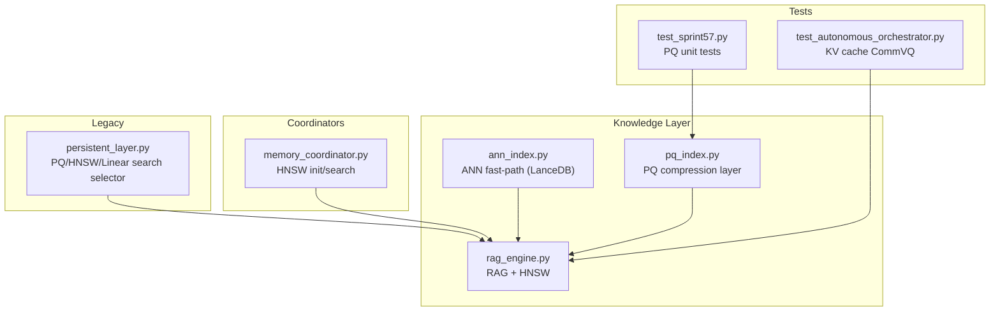
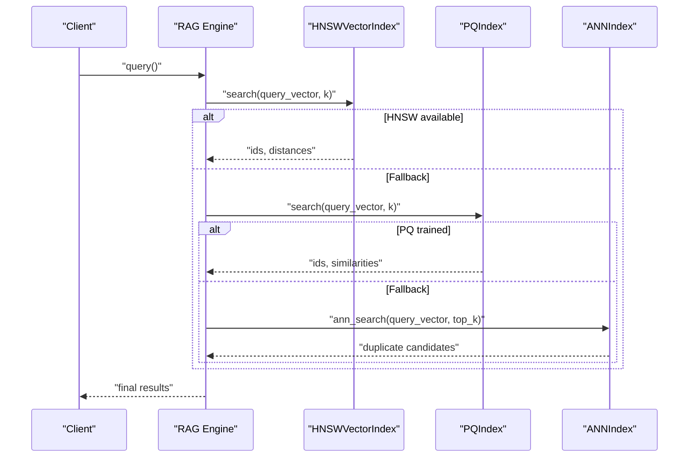
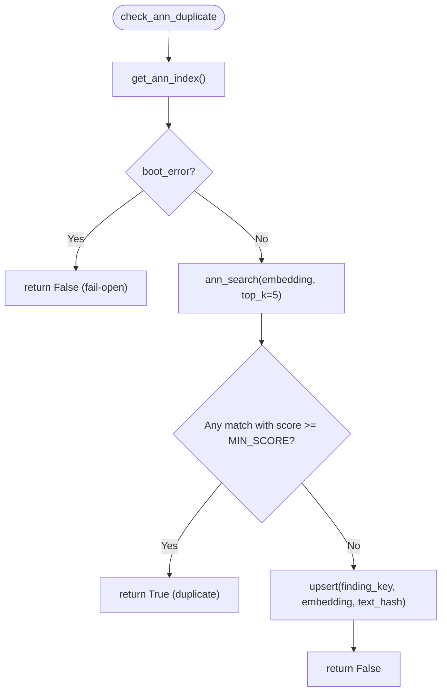
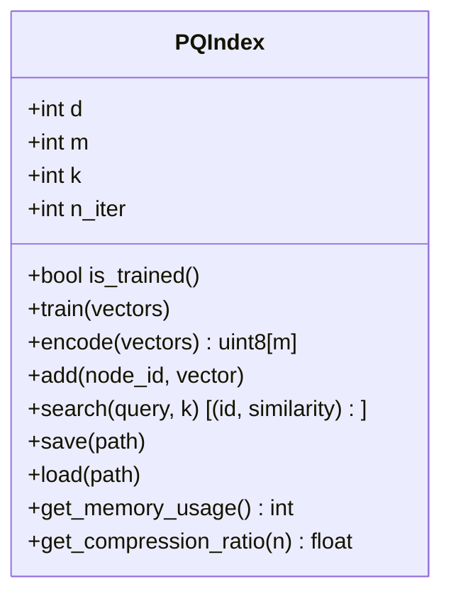
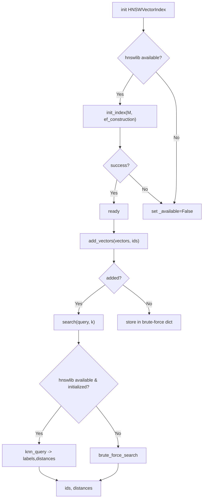
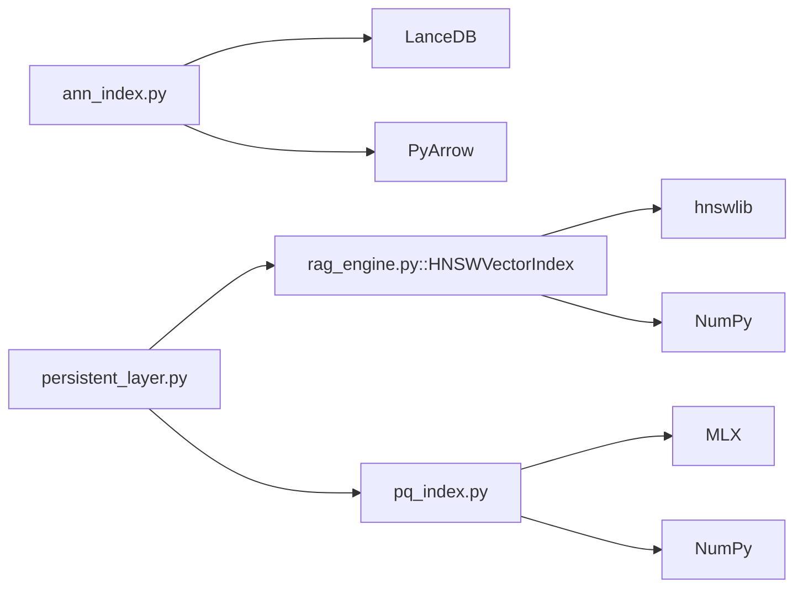

# ANN and Product Quantization Indexes

<cite>
**Referenced Files in This Document**
- [ann_index.py](file://hledac/universal/knowledge/ann_index.py)
- [pq_index.py](file://hledac/universal/knowledge/pq_index.py)
- [rag_engine.py](file://hledac/universal/knowledge/rag_engine.py)
- [memory_coordinator.py](file://hledac/universal/coordinators/memory_coordinator.py)
- [persistent_layer.py](file://hledac/universal/legacy/persistent_layer.py)
- [test_sprint57.py](file://hledac/universal/tests/test_sprint57.py)
- [test_autonomous_orchestrator.py](file://hledac/universal/tests/test_autonomous_orchestrator.py)
- [hermes3_engine.py](file://hledac/universal/brain/hermes3_engine.py)
- [mlx_embeddings.py](file://hledac/universal/core/mlx_embeddings.py)
- [benchmark_pipeline.py](file://hledac/universal/benchmarks/benchmark_pipeline.py)
- [benchmark_20260311_004339.json](file://hledac/universal/benchmark_results/benchmark_20260311_004339.json)
</cite>

## Table of Contents
1. [Introduction](#introduction)
2. [Project Structure](#project-structure)
3. [Core Components](#core-components)
4. [Architecture Overview](#architecture-overview)
5. [Detailed Component Analysis](#detailed-component-analysis)
6. [Dependency Analysis](#dependency-analysis)
7. [Performance Considerations](#performance-considerations)
8. [Troubleshooting Guide](#troubleshooting-guide)
9. [Conclusion](#conclusion)
10. [Appendices](#appendices)

## Introduction
This document explains the Approximate Nearest Neighbor (ANN) and Product Quantization (PQ) indexing systems in the repository. It covers:
- ANN algorithms for scalable similarity search (cosine metric)
- Quantization techniques for compressed vector storage
- Index construction workflows and integration patterns
- Trade-offs between search accuracy and memory efficiency
- Configuration parameters and performance characteristics
- Use cases where PQ provides optimal results
- Index training procedures, quantizer optimization, and hybrid approaches combining ANN with PQ

## Project Structure
The ANN and PQ systems are implemented as focused modules within the knowledge layer and integrated with broader retrieval and orchestration components:
- ANN fast-path for cross-run duplicate detection backed by LanceDB
- PQ standalone compression layer for embedding storage and similarity search
- HNSW vector index for hybrid retrieval in the RAG engine
- Legacy and modern integration points for PQ and HNSW

**Diagram sources**
- [ann_index.py:1-381](file://hledac/universal/knowledge/ann_index.py#L1-L381)
- [pq_index.py:1-274](file://hledac/universal/knowledge/pq_index.py#L1-L274)
- [rag_engine.py:1-1707](file://hledac/universal/knowledge/rag_engine.py#L1-L1707)
- [memory_coordinator.py:2417-2445](file://hledac/universal/coordinators/memory_coordinator.py#L2417-L2445)
- [persistent_layer.py:914-988](file://hledac/universal/legacy/persistent_layer.py#L914-L988)
- [test_sprint57.py:41-84](file://hledac/universal/tests/test_sprint57.py#L41-L84)
- [test_autonomous_orchestrator.py:18599-18705](file://hledac/universal/tests/test_autonomous_orchestrator.py#L18599-L18705)

**Section sources**
- [ann_index.py:1-381](file://hledac/universal/knowledge/ann_index.py#L1-L381)
- [pq_index.py:1-274](file://hledac/universal/knowledge/pq_index.py#L1-L274)
- [rag_engine.py:1-1707](file://hledac/universal/knowledge/rag_engine.py#L1-L1707)
- [memory_coordinator.py:2417-2445](file://hledac/universal/coordinators/memory_coordinator.py#L2417-L2445)
- [persistent_layer.py:914-988](file://hledac/universal/legacy/persistent_layer.py#L914-L988)
- [test_sprint57.py:41-84](file://hledac/universal/tests/test_sprint57.py#L41-L84)
- [test_autonomous_orchestrator.py:18599-18705](file://hledac/universal/tests/test_autonomous_orchestrator.py#L18599-L18705)

## Core Components
- ANN fast-path (LanceDB): Provides sub-10ms cosine-similarity duplicate detection for cross-run data with bounded capacity and memory guard.
- PQ compression layer: Trains centroids per sub-vector, encodes vectors to uint8 codes, and supports similarity search consistent with cosine via 1/(1+L2).
- HNSW vector index (RAG): Hierarchical navigable small world for fast approximate nearest neighbor search with configurable memory footprint.
- Legacy integration: Selects PQ/HNSW/linear fallback depending on availability and configuration.

Key configuration highlights:
- ANN: dimension contract 256d float32, bounded table size, cosine threshold, memory guard, pre-warming.
- PQ: d (dimension), m (number of sub-vectors), k (centroids per sub-vector), n_iter (training iterations), memory usage estimation, compression ratio calculation.
- HNSW: dim, max_elements, M, ef_construction, ef_search, space, index_path.

**Section sources**
- [ann_index.py:38-45](file://hledac/universal/knowledge/ann_index.py#L38-L45)
- [ann_index.py:91-139](file://hledac/universal/knowledge/ann_index.py#L91-L139)
- [ann_index.py:140-182](file://hledac/universal/knowledge/ann_index.py#L140-L182)
- [ann_index.py:183-221](file://hledac/universal/knowledge/ann_index.py#L183-L221)
- [ann_index.py:252-282](file://hledac/universal/knowledge/ann_index.py#L252-L282)
- [pq_index.py:39-63](file://hledac/universal/knowledge/pq_index.py#L39-L63)
- [pq_index.py:116-143](file://hledac/universal/knowledge/pq_index.py#L116-L143)
- [pq_index.py:164-222](file://hledac/universal/knowledge/pq_index.py#L164-L222)
- [pq_index.py:223-274](file://hledac/universal/knowledge/pq_index.py#L223-L274)
- [rag_engine.py:224-252](file://hledac/universal/knowledge/rag_engine.py#L224-L252)
- [rag_engine.py:273-300](file://hledac/universal/knowledge/rag_engine.py#L273-L300)
- [memory_coordinator.py:2417-2445](file://hledac/universal/coordinators/memory_coordinator.py#L2417-L2445)
- [persistent_layer.py:914-988](file://hledac/universal/legacy/persistent_layer.py#L914-L988)

## Architecture Overview
The retrieval architecture integrates ANN, PQ, and HNSW across layers:
- ANN fast-path sits alongside semantic dedup to accelerate duplicate checks using cosine similarity.
- PQ serves as a compression layer for embeddings, enabling efficient storage and similarity search.
- HNSW provides scalable vector search within the RAG engine for hybrid retrieval.
- Legacy layer offers explicit index selection among HNSW, PQ, and linear search.

**Diagram sources**
- [rag_engine.py:356-404](file://hledac/universal/knowledge/rag_engine.py#L356-L404)
- [pq_index.py:164-222](file://hledac/universal/knowledge/pq_index.py#L164-L222)
- [ann_index.py:140-182](file://hledac/universal/knowledge/ann_index.py#L140-L182)
- [persistent_layer.py:914-988](file://hledac/universal/legacy/persistent_layer.py#L914-L988)

**Section sources**
- [rag_engine.py:356-404](file://hledac/universal/knowledge/rag_engine.py#L356-L404)
- [pq_index.py:164-222](file://hledac/universal/knowledge/pq_index.py#L164-L222)
- [ann_index.py:140-182](file://hledac/universal/knowledge/ann_index.py#L140-L182)
- [persistent_layer.py:914-988](file://hledac/universal/legacy/persistent_layer.py#L914-L988)

## Detailed Component Analysis

### ANN Fast-Path (LanceDB)
Purpose:
- Sub-10ms cosine-similarity duplicate detection for cross-run data.
- Fail-open behavior: returns duplicate=False on any error; stores boot error and gracefully degrades.

Key behaviors:
- Memory guard: skips initialization above a configured RSS threshold.
- Bounded table: maintains a fixed-capacity table with oldest entries evicted on overflow.
- Normalized cosine search: normalizes query vectors and converts LanceDB distance to score.
- Upsert with LRU-style timestamp: maintains insertion order for eviction.
- Prewarming: performs a dummy search to reduce cold-start latency.

**Diagram sources**
- [ann_index.py:326-370](file://hledac/universal/knowledge/ann_index.py#L326-L370)
- [ann_index.py:140-182](file://hledac/universal/knowledge/ann_index.py#L140-L182)
- [ann_index.py:183-221](file://hledac/universal/knowledge/ann_index.py#L183-L221)

**Section sources**
- [ann_index.py:1-381](file://hledac/universal/knowledge/ann_index.py#L1-L381)

### PQ Compression Layer
Purpose:
- Compress embeddings using Product Quantization for significant memory savings.
- Train centroids per sub-vector, encode to compact codes, and search using 1/(1+L2) similarity consistent with cosine.

Key behaviors:
- Training: random permutation (OPQ), k-means++ style initialization, iterative refinement per sub-vector.
- Encoding: permutes input, reshapes to sub-vectors, computes argmin distance to centroids per sub-vector, stacks uint8 codes.
- Search: permutes query, builds per-sub-vector distance table, sums code-based distances, converts to similarity, sorts, returns top-k.
- Persistence: save/load centroids, codes, permutation, and ids; memory usage estimation and compression ratio calculation.

**Diagram sources**
- [pq_index.py:29-63](file://hledac/universal/knowledge/pq_index.py#L29-L63)
- [pq_index.py:64-115](file://hledac/universal/knowledge/pq_index.py#L64-L115)
- [pq_index.py:116-143](file://hledac/universal/knowledge/pq_index.py#L116-L143)
- [pq_index.py:164-222](file://hledac/universal/knowledge/pq_index.py#L164-L222)
- [pq_index.py:223-274](file://hledac/universal/knowledge/pq_index.py#L223-L274)

**Section sources**
- [pq_index.py:1-274](file://hledac/universal/knowledge/pq_index.py#L1-L274)
- [test_sprint57.py:41-84](file://hledac/universal/tests/test_sprint57.py#L41-L84)

### HNSW Vector Index (RAG)
Purpose:
- Fast approximate nearest neighbor search with configurable memory and quality controls.

Key behaviors:
- Initialization: attempts to import hnswlib; falls back to brute-force storage if unavailable.
- Add items: validates dimensions and ids, initializes index if needed, adds vectors or falls back.
- Search: uses hnswlib if available and initialized; otherwise brute-force with cosine/L2/IP distance variants.
- Persistence: saves/loads index and metadata; estimates memory usage.

**Diagram sources**
- [rag_engine.py:273-300](file://hledac/universal/knowledge/rag_engine.py#L273-L300)
- [rag_engine.py:304-355](file://hledac/universal/knowledge/rag_engine.py#L304-L355)
- [rag_engine.py:356-404](file://hledac/universal/knowledge/rag_engine.py#L356-L404)
- [rag_engine.py:406-451](file://hledac/universal/knowledge/rag_engine.py#L406-L451)
- [memory_coordinator.py:2417-2445](file://hledac/universal/coordinators/memory_coordinator.py#L2417-L2445)

**Section sources**
- [rag_engine.py:207-643](file://hledac/universal/knowledge/rag_engine.py#L207-L643)
- [memory_coordinator.py:2417-2445](file://hledac/universal/coordinators/memory_coordinator.py#L2417-L2445)

### Legacy Integration and Hybrid Selection
Purpose:
- Explicitly select PQ/HNSW/linear fallback for vector search.

Key behaviors:
- Index type selection: "auto", "hnsw", "pq", or "linear".
- PQ search path: validates availability and training, converts query to MLX array if available, executes PQ search.
- HNSW search path: uses legacy HNSW search if available.
- Linear fallback: brute-force cosine similarity for small graphs.

**Section sources**
- [persistent_layer.py:914-988](file://hledac/universal/legacy/persistent_layer.py#L914-L988)

## Dependency Analysis
- ANN depends on LanceDB and PyArrow for schema and table operations; guarded by memory checks.
- PQ depends on MLX for numerical operations and numpy for complex indexing; provides save/load for persistence.
- HNSW depends on hnswlib; falls back to brute-force storage and operations.
- Legacy layer integrates PQ/HNSW/linear search selection and interacts with RAG engine.

**Diagram sources**
- [ann_index.py:105-138](file://hledac/universal/knowledge/ann_index.py#L105-L138)
- [pq_index.py:20-27](file://hledac/universal/knowledge/pq_index.py#L20-L27)
- [rag_engine.py:260-269](file://hledac/universal/knowledge/rag_engine.py#L260-L269)
- [persistent_layer.py:958-979](file://hledac/universal/legacy/persistent_layer.py#L958-L979)

**Section sources**
- [ann_index.py:105-138](file://hledac/universal/knowledge/ann_index.py#L105-L138)
- [pq_index.py:20-27](file://hledac/universal/knowledge/pq_index.py#L20-L27)
- [rag_engine.py:260-269](file://hledac/universal/knowledge/rag_engine.py#L260-L269)
- [persistent_layer.py:958-979](file://hledac/universal/legacy/persistent_layer.py#L958-L979)

## Performance Considerations
- ANN fast-path:
  - Memory guard prevents initialization under high memory pressure.
  - Bounded capacity with oldest-first eviction keeps memory bounded.
  - Prewarming reduces first-query latency.
- PQ:
  - 12× memory savings for 768-d vectors (768 → 8 bytes per vector) with consistent cosine similarity via 1/(1+L2).
  - Training complexity scales with number of sub-vectors and iterations; search complexity proportional to number of codes.
  - Memory usage estimation and compression ratio calculation aid capacity planning.
- HNSW:
  - <1ms search latency for 100K vectors with ~100MB per 100K 768-dim vectors.
  - Memory footprint controlled via max_elements; M and ef_search balance quality/speed.
  - Fallback to brute-force when hnswlib is unavailable.
- KV cache compression (CommVQ):
  - 2-bit quantization yields ~87.5% savings for KV cache in generation workloads.
  - GPU memory usage validated via active memory metrics.

**Section sources**
- [ann_index.py:21-23](file://hledac/universal/knowledge/ann_index.py#L21-L23)
- [ann_index.py:252-282](file://hledac/universal/knowledge/ann_index.py#L252-L282)
- [pq_index.py:251-274](file://hledac/universal/knowledge/pq_index.py#L251-L274)
- [rag_engine.py:212-222](file://hledac/universal/knowledge/rag_engine.py#L212-L222)
- [test_autonomous_orchestrator.py:18628-18654](file://hledac/universal/tests/test_autonomous_orchestrator.py#L18628-L18654)
- [hermes3_engine.py:1927-1963](file://hledac/universal/brain/hermes3_engine.py#L1927-L1963)

## Troubleshooting Guide
Common issues and mitigations:
- ANN initialization failures:
  - Symptoms: boot error recorded, subsequent searches return empty; degraded to in-process LRU.
  - Mitigations: verify memory guard thresholds, ensure LanceDB and PyArrow availability, confirm table schema compatibility.
- PQ training/encoding errors:
  - Symptoms: RuntimeError if train() not called before encode/add/search; dimension mismatch if d not divisible by m.
  - Mitigations: ensure training on representative dataset, verify dimensionality constraints, check MLX availability.
- HNSW initialization failures:
  - Symptoms: fallback to brute-force; logs indicate initialization failure.
  - Mitigations: verify hnswlib installation, adjust max_elements/M/ef parameters, ensure proper index path permissions.
- Legacy index selection:
  - Symptoms: PQ/HNSW fallback to linear search when unavailable.
  - Mitigations: enable PQ training, ensure HNSW availability, or rely on linear search for small graphs.

**Section sources**
- [ann_index.py:91-139](file://hledac/universal/knowledge/ann_index.py#L91-L139)
- [ann_index.py:140-182](file://hledac/universal/knowledge/ann_index.py#L140-L182)
- [pq_index.py:64-115](file://hledac/universal/knowledge/pq_index.py#L64-L115)
- [pq_index.py:116-143](file://hledac/universal/knowledge/pq_index.py#L116-L143)
- [rag_engine.py:273-300](file://hledac/universal/knowledge/rag_engine.py#L273-L300)
- [persistent_layer.py:958-979](file://hledac/universal/legacy/persistent_layer.py#L958-L979)

## Conclusion
The repository provides robust, production-ready implementations of ANN and PQ for scalable similarity search and compressed vector storage. ANN accelerates cross-run duplicate detection with fail-open guarantees, PQ delivers substantial memory savings with cosine-consistent similarity, and HNSW enables fast approximate nearest neighbor search with tunable quality and memory. Integration points across the knowledge layer, legacy layer, and RAG engine support flexible hybrid retrieval strategies tailored to different scale requirements.

## Appendices

### Configuration Parameters Summary
- ANN:
  - Dimension contract: 256d float32
  - Bounded entries: 50,000
  - Min score threshold: 0.90
  - Memory guard: RSS threshold
  - Prewarm: dummy search to reduce cold-start latency
- PQ:
  - d: vector dimension
  - m: number of sub-vectors (must divide d)
  - k: centroids per sub-vector
  - n_iter: training iterations
  - Memory usage estimation and compression ratio calculation
- HNSW:
  - dim: vector dimension
  - max_elements: capacity
  - M: bi-directional links
  - ef_construction: construction candidate list size
  - ef_search: search candidate list size
  - space: "cosine", "l2", or "ip"
  - index_path: persistent storage path

**Section sources**
- [ann_index.py:38-45](file://hledac/universal/knowledge/ann_index.py#L38-L45)
- [ann_index.py:252-282](file://hledac/universal/knowledge/ann_index.py#L252-L282)
- [pq_index.py:39-63](file://hledac/universal/knowledge/pq_index.py#L39-L63)
- [pq_index.py:251-274](file://hledac/universal/knowledge/pq_index.py#L251-L274)
- [rag_engine.py:224-252](file://hledac/universal/knowledge/rag_engine.py#L224-L252)
- [rag_engine.py:273-300](file://hledac/universal/knowledge/rag_engine.py#L273-L300)

### Performance Benchmarks and Metrics
- Pipeline benchmarking framework collects phase timings and memory deltas across discovery, fetch, embed, hypothesis, and export stages.
- Example benchmark result captures wall-clock durations, gating metrics, acquisition statistics, memory usage, and synthesis metrics.

**Section sources**
- [benchmark_pipeline.py:1-381](file://hledac/universal/benchmarks/benchmark_pipeline.py#L1-L381)
- [benchmark_20260311_004339.json:1-85](file://hledac/universal/benchmark_results/benchmark_20260311_004339.json#L1-L85)